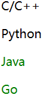
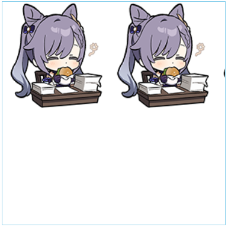
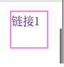

# CSS简单语法

**一、在HTML里写CSS形式**

* 在`<style>`标签内可编写CSS语法
* 在HTML里一般在`<head>`标签内写CSS语句

```html
<!-- HTML内CSS的简单结构 -->
<html>
    <head>
	<!--
		<style>
			选择器{
				属性:值;
				...
				属性:值;
			}
		</style>
	-->
        <style>
            h1{
                color:red;
            }
        </style>
    </head>
    <body>
        <h1>HELLO WORLD</h1>
    </body>
</html>
```

**二、CSS与HTML分离形式**

* 在HTML中，使用`<link>`标签引进`CSS`文件
* `<link>`标签需要两种属性：1、引用类型（`stylesheet`）2、引用路径

```css
h1{
    color:red;
}
```

```html
<html>
    <head>
        <link rel="stylesheet" href="css/style.css">
    </head>
    <body>
        <h1>Hello World</h1>
    </body>
</html>
```

**三、CSS优点**

* 内容与表现分离
* 网页结构表现统一，可以实现复用
* 样式丰富

# CSS的导入方式

**一、行内样式**

* 直接在HTML的标签内写CSS语法
* 在`style`属性里编写`CSS`样式

```html
<html>
    <body>
        <h1 style="color:red">
            Hello World
        </h1>
    </body>
</html>
```

**二、内部样式**

* 在`<style>`标签内写CSS样式
* `<style>`标签填充放在`<head>`里

```html
<html>
    <head>
        <style>
            h1{
                color:red;
            }
        </style>
    </head>
    <body>
        <h1>
            Hello World
        </h1>
    </body>
</html>
```

**三、外部样式**

* HTML和CSS语法分离

```css
h1{
    color:red;
}
```

```html
<html>
    <head>
        <link rel="stylesheet" href="css/style.css">
    </head>
    <body>
        <h1>Hello World</h1>
    </body>
</html>
```

**四、样式优先级**

* 符合就近原则，离元素越近优先级越高
* `<style>`和`<link>`的优先级，离元素越近优先级越高

# 选择器

用于选择页面上某一个元素或某一类元素

## 基本选择器

**一、标签选择器**

* 使用标签作为选择器，对所有该标签使用CSS样式
* 选择器语法：`标签{ CSS语法 }`

```html
<html>
    <head>
        <style>
            h1{
                color:blue;
            }
        </style>
    </head>
    <body>
        <h1>C/C++</h1>
        <h1>Python</h1>
        <h1>Java</h1>
        <h1>Go</h1>
    </body>
</html>
```


**二、类选择器**

* 对元素进行分类，对某类元素使用CSS样式
* 使用标签的`class`属性进行自定义分类
* 类选择器语法：`.类名{ CSS语法 }`

```html
<html>
    <head>
        <style>
            .one{
                color:green;
            }
            .two{
                color:red;
            }
        </style>
    </head>
    <body>
        <h1 class="one">C/C++</h1>
        <h1 class="two">Python</h1>
        <h1 class="one">Java</h1>
        <h1 class="two">Go</h1>
    </body>
</html>
```


**三、id选择器**

* 对元素定义一个<font color=red>唯一</font>的id，通过id使用CSS样式
* 使用标签的`id`属性定义id名
* id选择器语法：`#id名{ CSS语法 }`

```html
<html>
    <head>
        <style>
            #C{
                color:blue;
            }
            #Python{
                color:red;
            }
        </style>
    </head>
    <body>
        <h1 id="C">C/C++</h1>
        <h1 id="Python">Python</h1>
    </body>
</html>
```


**四、选择器的优先顺序**

* 选择器不遵循就近原则
* id选择器>类选择器>标签选择器

## 层次选择器

**一、后代选择器**

* 选择某个标签的所有子类，可以选择子类的子类
* 后代选择器语法：`父标签 子标签{ CSS语法 }`

```html
<html>
    <head>
        <style>
            body p{
                color:green;
            }
        </style>
    </head>
    <body>
        <p>C/C++</p>
        <p>Python</p>
		<ol>
            <ul>
                <li><p>Java</p></li>
                <li><p>Go</p></li>
            </ul>
        </ol>
    </body>
</html>
```


**二、子选择器**

* 选择某个标签的第一层子类，子类的子类不可选择
* 子选择器语法：`父标签>子类标签{ CSS语法 }`

```html
<html>
    <head>
        <style>
            body>p{
                color:green;
            }
        </style>
    </head>
    <body>
        <p>C/C++</p>
        <p>Python</p>
		<ol>
        	<li><p>Java</p></li>
        	<li><p>Go</p></li>
        </ol>
    </body>
</html>
```


**三、相邻兄弟选择器**

* 选择与某个标签同层的下一个元素（某标签元素不受影响）
* 相邻兄弟选择器需要使用类选择器或id选择器作为基础
* 相邻兄弟选择器语法：`.类 +p{ CSS语法 }`、`#id +p{ CSS语法 }`

```html
<html>
    <head>
        <style>
            #C+p{
                color:green;
            }
            .Java+p{
                color:blue;
            }
        </style>
    </head>
    <body>
        <p id="C">C/C++</p>
        <p>Python</p>
        <p class="Java">Java</p>
        <p>Go</p>
    </body>
</html>
```


**四、通用选择器**

* 选择与某个标签同层且位于该标签下面的所有元素（某标签元素不受影响）
* 相邻兄弟选择器需要使用类选择器或id选择器作为基础
* 相邻兄弟选择器语法：`.类 ~p{ CSS语法 }`、`#id ~p{ CSS语法 }`

```html
<html>
    <head>
        <style>
            #Python~p{
                color:green;
            }
        </style>
    </head>
    <body>
        <p>C/C++</p>
        <p id="Python">Python</p>
        <p>Java</p>
        <p>Go</p>
    </body>
</html>
```



## 结构伪类选择器

**一、伪类选择器**

* 据条件选择元素的选择器
* `:`后面为选择元素的条件
* 范围定位方式：1、使用标签定位父标签  2、根据第一次出现的子标签的父类进行定位父标签

**二、选择第一个元素和最后一个元素**

* 根据标签选择父标签：`父标签 子标签:条件{ CSS语法 }`

```html
<html>
    <head>
        <style>
			/*选择第一个元素*/
            ul li:first-child{
                color:red;
            }
            /*选择最后一个元素*/
            ul li:last-child{
                color:green;
            }
        </style>
    </head>
    <body>
       	<ul>
			<li>C/C++</li>
			<li>Python</li>
			<li>Java</li>
			<li>Go</li>
		</ul>
    </body>
</html>
```


**二、顺序定位**

* 根据子标签的父标签选择父标签：`子标签:条件{ CSS语法 }`
* `nth-child()`作为条件时先按顺序选择子标签，然后再检查该子标签是否是子标签
* 当`nth-child()`的值为1时按顺序会选择到`<h1>`，不会选到`<p>`因此不会有变色

```html
<html>
    <head>
        <style>
            p:nth-child(2){
                color:green;
            }
        </style>
    </head>
    <body>
        <h1>程序语言</h1>
        <p>C/C++</p>
        <p>Python</p>
      	<p>Java</p>
       	<p>Go</p>
    </body>
</html>
```


**三、按标签顺序定位**

* 根据子标签的父标签选择父标签：`子标签:条件{ CSS语法 }`
* `nth-of-type()`作为条件时会选择同层的所有子标签，再按顺序选择

```html
<html>
    <head>
        <style>
            p:nth-of-type(2){
                color:green;
            }
        </style>
    </head>
    <body>
        <h1>程序语言</h1>
        <p>C/C++</p>
        <p>Python</p>
      	<p>Java</p>
       	<p>Go</p>
    </body>
</html>
```


## 属性选择器

**一、选择存在某属性的元素**

* 格式：`标签[属性]{ CSS语法 }`

```html
<html>
    <head>
        <style>
            p[id]{
                color:blue;
            }
            p[class]{
                color:green;
            }
        </style>
    </head>
        <p id="C">C/C++</p>
        <p class="Python">Python</p>
      	<p class="Java">Java</p>
       	<p id="Go">Go</p>
    </body>
</html>
```


**二、选择某属性值为特定值的元素**

* 格式：`标签[属性=值]{ CSS语法 }`

```html
<html>
    <head>
        <style>
            p[id=C]{
                color:blue;
            }
            p[class=Java]{
                color:green;
            }
        </style>
    </head>
        <p id="C">C/C++</p>
        <p class="Python">Python</p>
      	<p class="Java">Java</p>
       	<p id="Go">Go</p>
    </body>
</html>
```


**三、选择属性值包含某值的元素**

* 格式：`标签[属性*=值]{ CSS语法 }`

```html
<html>
    <head>
        <style>
            p[class*=av]{
                color:green;
            }
        </style>
    </head>
        <p id="C">C/C++</p>
        <p class="Python">Python</p>
      	<p class="Java">Java</p>
       	<p id="Go">Go</p>
    </body>
</html>
```


**四、选择属性值以某值开头的元素**

* 格式：`标签[属性^=值]{ CSS语法 }`

```html
<html>
    <head>
        <style>
            p[class*=Py]{
                color:green;
            }
        </style>
    </head>
        <p id="C">C/C++</p>
        <p class="Python">Python</p>
      	<p class="Java">Java</p>
       	<p id="Go">Go</p>
    </body>
</html>
```


**五、选择属性值以某值开头的元素**

* 格式：`标签[属性$=值]{ CSS语法 }`

```html
<html>
    <head>
        <style>
            p[id$=o]{
                color:green;
            }
        </style>
    </head>
        <p id="C">C/C++</p>
        <p class="Python">Python</p>
      	<p class="Java">Java</p>
       	<p id="Go">Go</p>
    </body>
</html>
```


# 特殊标签

## span标签

**一、span标签**

* span标签本身无任何特性
* 常用于套住重点元素

```html
<html>
    <body>
        <span>HELLO WORLD</span>
    </body>
</html>
```

## div标签

**一、div标签**

* div标签会换行
* 常用于按模块封装内容
* 常用id选择器选取

# CSS字体样式

## 字体样式

**一、改变字体类型**

* 使用`font-family`更改字体类型

```html
<html>
    <head>
        <style>
            .span{
                font-family:Ani;
            }
        </style>
    </head>
    <body>
        <span>HELLO WORLD</span>
    </body>
</html>
```


**二、设置字体大小**

* 使用`font-size`修改字体大小
* 以像素`px`为单位

```html
<html>
    <head>
        <style>
            .span{
                font-family:Ani;
                font-size:50px;
            }
        </style>
    </head>
    <body>
        <span>HELLO WORLD</span>
    </body>
</html>
```


**三、字体加粗**

* 使用`font-weight`修改字体的形式

```html
<html>
    <head>
        <style>
            .span{
                font-size:50px;
                font-weight:bold;
            }
        </style>
    </head>
    <body>
        <span>HELLO WORLD</span>
    </body>
</html>
```


**四、字体的颜色**

* 使用`color`修改字体的颜色

```html
<html>
    <head>
        <style>
            .span{
                font-size:50px;
                font-weight:bold;
                color:green;
            }
        </style>
    </head>
    <body>
        <span>HELLO WORLD</span>
    </body>
</html>
```


**五、字体样式的混合写法**

* 使用`font`实现字体的属性混合语法
* 混合写法需要按照一定顺序编写属性

```html
<html>
    <head>
        <style>
            .span{
                font: oblique bolder 50px Ani;	/* 字体风格 字体深度 字体大小 字体类型 */
            }
        </style>
    </head>
    <body>
        <span>HELLO WORLD</span>
    </body>
</html>
```


# CSS文本样式

**一、简单颜色设置**

* 使用`color`设置颜色
* 可以使用特殊颜色的单词`red`作为值
* 可以使用`#00ff00`作为值

```html
<html>
    <head>
        <style>
            #one{
                color:green;
            }
            #two{
                color:#00ffff;
            }
        </style>
    </head>
    <body>
        <p id="one">
            床前明月光
        </p>
        <p id="two">
            疑是地上霜
        </p>
    </body>
</html>
```


**二、使用函数设置颜色**

* 在`color`属性中使用`rgb()`设置颜色
* 输入十进制的数

```html
<html>
    <head>
        <style>
            p{
                color:rgb(123,255,10);
            }
        </style>
    </head>
    <body>
        <p>
            HELLO WORLD
        </p>
    </body>
</html>
```


**三、设置透明度**

* 在`color`属性中使用`rgba()`设置颜色的透明度，值的范围为`[0,1]`

* 在`color`属性中使用`#`设置颜色透明度，在尾部增加两位表示透明度，值的范围`[00,ff]`

```html
<html>
    <head>
        <style>
            #one{
                color:rgba(255,12,123,0.7);
            }
            #two{
                color:#00ffff64;
            }
        </style>
    </head>
    <body>
        <p id="one">
            床前明月光
        </p>
        <p id="two">
            疑是地上霜
        </p>
    </body>
</html>
```


**四、文本位置**

* 使用`text-align`属性设置文本位置
* 值为`center`时，实现文本的左右居中

```html
<html>
    <head>
        <style>
            p{
                color:green;
                text-align:center;
            }
        </style>
    </head>
    <body>
        <p>
            HELLO
        </p>
        <p>
            WORLD
        </p>
    </body>
</html>
```


**五、设置文本缩进**

* 使用`text-indent`设置文本缩进
* 值用`em`为单位，1em表示一个空格

```html
<html>
    <head>
        <style>
            p{
                color:green;
                text-indent:2em;
            }
        </style>
    </head>
    <body>
        <p>
            HELLO
        </p>
        <span>
            WORLD
        </span>
    </body>
</html>
```


**六、行高**

* 使用`line-height`设置每行的高度
* 当行高等于块的高度时实现上下居中

```html
<html>
    <head>
        <style>
            p{
                line-height: 30px;
            }
        </style>
    </head>
    <body>
        <p>
            床前明月光，疑是地上霜。
        </p>
        <p>
            举头望明月，低头思故乡。
        </p>
    </body>
</html>
```


**七、设置划线**

* 使用`text-decoration`设置划线
* 值为`underline`时为下划线
* 值为`line-through`时为中划线
* 值为`overline`时为上划线
* 值为`none`时去掉划线，常用于超链接

```html
<html>
    <head>
        <style>
            p{
                text-decoration:underline;
            }
        </style>
    </head>
    <body>
        <p>
            HELLO WORLD
        </p>
    </body>
</html>
```


**八、多元素垂直居中对齐**

* 使用`vertical-align`设置
* 值设置为`middle`实现多元素垂直居中
* 使用选择器时需要放入多个元素

```html
<html>
    <head>
        <style>
            #one{
                font-size:50px;
            }
            #one,#two{
                vertical-align:middle;
            }
        </style>
    </head>
    <body>
		<span id="one">HELLO</span>
        <span id="two">WORLD</span>
    </body>
</html>
```


# 超链接样式

**一、超链接的默认设置**

* 使用标签选择器设置超链接的默认状态

* 使用`text-decoration`属性去掉下划线
* 使用`color`修改颜色

```html
<html>
    <head>
        <style>
            a{
                text-decoration:none;
                color:black;
            }
        </style>
    </head>
    <body>
		<a href="#">
        	
        </a>
        <p>
            <a href="#">刻晴</a>
        </p>
        <p>
            <a href="#">图片来源</a>
        </p>
    </body>
</html>
```

**二、伪类设置超链接鼠标悬浮的状态**

* 使用`a:hover`伪类设置悬浮颜色
* 对图片无效

```html
<html>
    <head>
        <style>
            a{
                text-decoration:none;
                color:orange;
            }
            a:hover{
                color:skyblue;
            }
        </style>
    </head>
    <body>
		<a href="#">
        	
        </a>
        <p>
            <a href="#">刻晴</a>
        </p>
        <p>
            <a href="#">图片来源</a>
        </p>
    </body>
</html>
```


**三、伪类设置超链接被点击未释放的状态**

* 使用`a:active`伪类设置悬浮颜色
* 对图片无效

```html
<html>
    <head>
        <style>
            a{
                text-decoration:none;
                color:orange;
            }
            a:hover{
                color:skyblue;
            }
            a:active{
                color:violet;
            }
        </style>
    </head>
    <body>
		<a href="#">
        	
        </a>
        <p>
            <a href="#">刻晴</a>
        </p>
        <p>
            <a href="#">图片来源</a>
        </p>
    </body>
</html>
```


# 文本阴影

**一、设置文本阴影**

* 使用`text-shadow`属性设置阴影
* 使用语法：`text-shadow: x轴偏移 y轴偏移 模糊距离 颜色代码;`
* 偏移使用`px`作为单位，右下为正，左上为负
* 模糊距离越高，阴影越模糊

```html
<html
    <head>
        <style>
            p{
                text-shadow: 4px 4px 2px skyblue;
            }
        </style>
    </head>
    <body>
		<p>
            HELLO WORLD
        </p>
    </body>
</html>
```

# 列表样式

* 处理列表元素常用后代选择器

**一、设置列表元素的高度**

* 使用`height`设置

```css
ul li{
    height:30px;
}
```

**二、修改列表样式**

* 使用`list-style`设置
* 值为`none`：去掉列表前缀符号
* 值为`circle`：设置空心圆
* 值为`square`：设置正方形

```css
ul li{
    list-style:none;
}
```

**三、设置缩进**

* 使用`text-indent`设置缩进

```css
ul li{
    text-indent:1em;
}
```

# 背景

## 背景图片

**一、设置背景图片**

* 使用`background-image`属性设置背景图片
* 值使用`url()`函数定位资源
* 默认使用平铺

```html
<html
    <head>
        <style>
            div{
                width:300px;
                height:300px;
                border: 1px solid skyblue;
                background-image:url("./1.png");
            }
        </style>
    </head>
    <body>
		<div>
            
        </div>
    </body>
</html>
```


**二、水平平铺**

* 使用`background-repeat`设置布局方式
* 值为`repeat-x`时，图片仅水平平铺

```html
<html
    <head>
        <style>
            div{
                width:300px;
                height:300px;
                border: 1px solid skyblue;
                background-image:url("./1.png");
                background-repeat:repeat-x;
            }
        </style>
    </head>
    <body>
		<div>
            
        </div>
    </body>
</html>
```



**三、竖直平铺**

* 使用`background-repeat`设置布局方式
* 值为`repeat-y`时，图片仅水平平铺

```html
<html
    <head>
        <style>
            div{
                width:300px;
                height:300px;
                border: 1px solid skyblue;
                background-image:url("./1.png");
                background-repeat:repeat-y;
            }
        </style>
    </head>
    <body>
		<div>
            
        </div>
    </body>
</html>
```


**四、不平铺**

* 使用`background-repeat`设置布局方式
* 值为`no-repeat`时，不平铺

```html
<html
    <head>
        <style>
            div{
                width:300px;
                height:300px;
                border: 1px solid skyblue;
                background-image:url("./1.png");
                background-repeat:no-repeat;
            }
        </style>
    </head>
    <body>
		<div>
            
        </div>
    </body>
</html>
```


**五、设置图片位置**

* 使用`background-position-x`设置水平方向
* 使用`background-position-y`设置竖直方向
* 位置以左上角为零点

```html
<html
    <head>
        <style>
            div{
                width:300px;
                height:300px;
                border: 1px solid skyblue;
                background-image:url("./1.png");
                background-repeat:no-repeat;
                background-position-x:75px;
                background-position-y:75px;
            }
        </style>
    </head>
    <body>
		<div>
            
        </div>
    </body>
</html>
```


## 背景颜色

**一、设置背景颜色**

* 使用`background-color`属性设置背景图片

## 综合设置

**六、综合设置**

* 使用`background`实现综合设置
* CSS语法：`background:背景颜色 url("图片路径") x坐标 y坐标 平铺方式`

```html
<html
    <head>
        <style>
            div{
                width:300px;
                height:300px;
                border: 1px solid skyblue;
				background: violet url("./1.png") 75px 75px no-repeat;
            }
        </style>
    </head>
    <body>
		<div>
            
        </div>
    </body>
</html>
```


## 渐变背景

**一、设置渐变色**

* 使用`background-image`设置渐变色
* [可视化设置渐变色](https://www.grabient.com/)

**二、线性渐变色设置**

* 值为`linear-gradient()`时设置线性渐变色
* 参考参数：`43deg, 颜色 0%, 颜色 46%, 颜色 100%`

```html
<html
    <head>
        <style>
            div{
                width:300px;
                height:300px;
                border: 1px solid skyblue;
				background-image: linear-gradient(43deg, violet 0%, skyblue 46%, orange 100%);
            }
        </style>
    </head>
    <body>
		<div>
            
        </div>
    </body>
</html>
```


**三、圆形渐变色**

* 值为`radial-gradient()`时设置线性渐变色
* 参考参数：`颜色 颜色`

# 盒子模型

## 盒子模型概念

**一、盒子模型**

* `html`的每个元素都由外边距、边界、内边距和内容组成，这些属性可以构成一个盒子模型
* 外边距：有4个方向的外边距，用于隔开相邻的元素
* 内边距：有4个方向的内边距，用于设置元素与边界的距离
* 边界：元素的边界（不是盒子的边界）
* <font color=violet>每个标签都有盒子模型</font>
* 外边距是元素与其他元素的距离，不同元素的外边距可以重合

## 初始化操作

**一、初始化盒子模型**

* 对所用到的标签进行初始化操作
* 初始化操作将外边距、内边距、下划线等归零
* 初始化操作是项目开始前的基本操作

```css
h1,ul,li,a,body,div,span{
    margin:0;				/*外边距设为0*/
    padding:0;				/*内边距设为0*/
    text-decoration:none;	/*去掉下划线*/
    list-style:none;		/*去掉列表标志*/
}
```

## 外边距(margin)

**一、修改外边距距离**

* 使用`margin`可以修改外边距
* 输入1个参数时会默认修改4个方向
* 输入2个参数时，第一个参数处理上下外边距，第二个参数处理左右外边距
* 输入4个参数时，分别对4个方向设置外边距，顺序为顺时针（上右下左）
* 可以使用`margin-left`、`margin-right`等参数分别设置外边距

```css
a{
    width:150px;
    height:150px;
    margin:10px 20px 30px 40px;
}
```

## 内边距(padding)

**一、内边距的作用**

* 用于设置元素与边界的距离
* 使用`paddiing`可以修改外边距
* 相关原理和`margin`一致

```css
div{
    padding:10px;
}
```

## 边框(border)

**一、设置边框长度**

* CSS设置语法：`border: 颜色 solid 宽度;`

```css
form{
    boder:red solid 2px;
}
```

**二、设置圆角边框**

* 使用`border-radius`设置圆角边框
* CSS设置语法：`border-radius:宽度;`
* 输入1个参数时会默认修改4个角
* 输入2个参数时，第一个参数处理左上角右下角，第二个参数处理右上角左下角
* 输入4个参数时，分别对4个方向设置外边距，顺序为顺时针（左上 右上 右下 左下）

```css
form{
    border-radius:10px;
}
```

**三、圆形框**

* 使用`border-radius`设置圆型边框
* 值设为盒子的宽度的一半（盒子包括边框距离）或`50%`
* 盒子的长和高要相等（正方体）

```html
<html
    <head>
		<!--网站头像的设置-->
        <style>
            img{
                width:500px;
                height:500px;
                background:red;
                border-radius:50%;
            }
            div{
                width:500px;
                margin:0 auto;
            }
        </style>
    </head>
    <body>
		<div>
            
        </div>
    </body>
</html>
```

**四、边框阴影**

* 使用`box-shadow`设置边框阴影
* CSS语法：`box-shadow: x偏移 y偏移 阴影范围 颜色`

```css
div{
    box-shadow: 2px 2px 10px red;
}
```

## 内容

**一、设置内容的大小**

* 使用`width`设置宽度
* 使用`height`设置高度

```div
div{
    height:300px;
    width:300px;
}
```

## 长度计算

**一、盒子大小**

* 盒子长度=2×边框长度+内边距+外边距+内容
* 元素间的距离=max{元素a的外边界,元素b的外边界}

## 外边距设置水平居中对齐

* 设置模块的宽度`width`
* 设置外边距：`margin`
* 外边距的值设为：`0 auto`（上下外边距为0，左右自动居中）

```css
form{
    width:300px;
    margin:0 auto;
}
```

## display设置

**一、块级元素与行内元素**

* 块级元素：独占一行，能够包住行内元素
* 行内元素：不独占一行，长和宽内容决定，不能包住块级元素
* 常见块级元素：`h1-h6`,`p`,`div`,`ul li`
* 常见行内元素：`span`,`a`,`img`

**二、display作用**

* 将行内元素转为块级元素（`block`）
* 将块级元素转为行内元素（`inline`）
* 将元素转为块级行内元素（`inline-block`）对每个元素分别设置
* 可以将元素隐藏（`none`）

```html
<html>
    <head>
        <style>
            ul,li,body,div{
    			margin:0;
    			padding:0;
    			text-decoration:none;
    			list-style:none;
			}
            .one{
                background:skyblue;
                display:inline;
            }
            .two{
                background:skyblue;
                display:inline-block;
            }
            .three{
                background:skyblue;
                display:inline;
            }
            .four{
                background:skyblue;
                display:inline;
            }
            ul{
                width:175px;
            	margin:0 auto;
            }
        </style>
    </head>
    <body>
        <div>
            <ul>
                <li class="one">首页</li>
                <li class="two">直播</li>
                <li class="three">游戏中心</li>
                <li class="four">漫画</li>
            </ul>
        </div>
    </body>
</html>
```


## float浮动设置

**一、浮动设置**

* 使元素向左或向右放置，其周围的元素也会重新排列。
* 浮动会引起父边框的塌陷
* 使用`float`属性设置浮动
* 浮动设置的值为：`left`,`right`

```html
<html>
    <head>
        <style>
            body,div{
                margin:0;
                padding:0;
            }
            div{
                height:50px;
                border:5px solid red;
            }
            img{
                float:right;
            }
        </style>
    </head>
    <body>
        <div>
            
            
        </div>
    </body>
</html>
```

**二、清除浮动**

* 使用`clear`属性清除浮动
* 值为`both`时，表示指定元素两侧不能出现浮动元素。

```css
div{
    clear:both;
}
```

## 解决浮动引起的父级边框塌陷的方法

**一、增加父级边框高度**

```html
<html>
    <head>
        <style>
            body,div{
                margin:0;
                padding:0;
            }
            div{
                height:500px;
                border:5px solid red;
            }
            img{
                float:right;
            }
        </style>
    </head>
    <body>
        <div>
            
            
        </div>
    </body>
</html>
```

**二、增加空div标签清除浮动**

* 能让父级边框自适应变大包裹所有元素

```html
<html>
    <head>
        <style>
            body,div{
                margin:0;
                padding:0;
            }
            .father{
                border:5px solid red;
            }
            .photo{
                float:right;
            }
            .clear{			/*设置空标签属性*/
                clear:both;
            }
        </style>
    </head>
    <body>
        <div class="father">
            <div class="photo">
                
            </div>

            <div class="photo">
                            
            </div>
            <div class="clear"></div>
        </div>
    </body>
</html>
```

**三、使用overflow属性**

* 使用`overflow`在父边框增加滚动条
* 值为`scroll`时设置滚动条
* 常用于内容超出范围的情况，父边框需要设置宽和高
* 值为`hidden`时如果设置了高度则隐藏子元素超出的部分，没有则自适应变大

```html
<html>
    <head>
        <style>
            body,div{
                margin:0;
                padding:0;
            }
            .father{
                border:5px solid red;
                overflow:hidden;	/*hidden的使用*/
            }
            .photo{
                float:right;
            }
        </style>
    </head>
    <body>
        <div class="father">
            <div class="photo">
                
            </div>

            <div class="photo">
                            
            </div>
        </div>
    </body>
</html>
```


```html
<html>
    <head>
        <style>
            body,div{
                margin:0;
                padding:0;
            }
            .father{
                border:5px solid red;
                overflow:hidden;	/*hidden的使用，边框自适应变大*/
            }
            .photo{
                float:right;
            }
        </style>
    </head>
    <body>
        <div class="father">
            <div class="photo">
                
            </div>

            <div class="photo">
                            
            </div>
        </div>
    </body>
</html>
```


```html
<html>
    <head>
        <style>
            body,div{
                margin:0;
                padding:0;
            }
            .father{
                border:5px solid red;
                height:200px;
                weight:200px;
                overflow:scroll;	/*滚动条*/
            }
            .photo{
                float:right;
            }
        </style>
    </head>
    <body>
        <div class="father">
            <div class="photo">
                
            </div>

            <div class="photo">
                            
            </div>
        </div>
    </body>
</html>
```


# 定位

## 相对定位

**一、根据相对定位设置元素位置**

* 使用`position:relative`开启相对定位，position属性用于锚定标签
* 使用`top`,`left`,`right`,`bottom`设置位置
* <font color=red>需要逆向思维</font>，四个方向表示的是设置的位置相当于本身的位置

```html
<html>
<head>
    <meta charset="UTF-8">
    <link rel="stylesheet" href="type.css">
</head>
<body>
<div id="father">
    <div>
        <a href="#" id="one">链接1</a>
    </div>
    <div>
        <a href="#" id="two">链接2</a>
    </div>
    <div>
        <a href="#" id="three">链接3</a>
    </div>
    <div>
        <a href="#" id="four">链接4</a>
    </div>
    <div>
        <a href="#" id="five">链接5</a>
    </div>
</div>
</body>
</html>
```

```css
/*先设置父边框*/
#father{
    border: 5px solid violet;
    padding: 5px;
    width:300px;
    height:300px;
}
/*再设置链接的共同配置*/
a{
    /*大小与下划线*/
    display:inline-block;
    width:100px;
    height:100px;
    text-decoration:none;
	/*颜色*/
    background:pink;
    color: white;
    /*居中设置*/
    text-align: center;
    line-height: 100px;
}
#one{
}
#two{
    position: relative;
    top:-100px;
    left:200px;
}
#three{
}
#four{
    position: relative;
    left:200px;
    top:-100px;
}
#five{
    position: relative;
    left:100px;
    top:-300px;
}
a:hover{
    background: skyblue;
}
```


## 绝对定位

**一、相对于浏览器的绝对定位**

* 要求父级元素不能有`position`属性
* 在标签内设置属性`position:absoulte;`开启绝对定位
* 使用`top`,`left`,`right`,`bottom`设置元素位置
* 位置不会随滚动条的移动同步
* 与相对定位一样，设置方向时要逆向思维

```html
<html>
    <head>
        <style>
            a{
                text-decoration:none;
            }
            #one{
                border:2px solid violet;
                position:absolute;
                right:30px;
                bottom:300px;
            }
        </style>
    </head>
    <body>
		<div id="one">
            <a href="#">链接</a>
        </div>
    </body>
</html>
```


**二、相当于父级元素进行偏移**

* 要求在父级元素设置`position:relative;`
* 要求在当前元素设置`position:absolute;`
* 只能在父级元素范围内显示

```html
<html>
    <head>
        <style>
            #father{
                width:300px;
                height:300px;
                border:5px solid deepskyblue;
                position:relative;
            }
            a{
                text-decoration:none;
            	display:inline-block;
                width:50px;
                height:50px;
            }
            #one{
                border:2px solid violet;
                position:absolute;
                right:30px;
                bottom:300px;
            }
        </style>
    </head>
    <body>
        <div id="father">
            <div id="one">
                <a href="#">链接</a>
            </div>
        </div>

    </body>
</html>
```


## 固定定位

**一、固定定位**

* 会固定在某个位置，不会因为滚动条移动而变化
* 使用`position:fixed;`设置固定定位
* 使用`top`,`left`,`right`,`bottom`设置元素位置

```html
<html>
    <head>
        <style>
            a{
                text-decoration:none;
            	display:inline-block;
                width:50px;
                height:50px;
            }
            #one{
                border:2px solid violet;
                position:fixed;
                right:30px;
            }
        </style>
    </head>
    <body>
		<div id="one">
            <a href="#">链接</a>
        </div>
    </body>
</html>
```



# Z-index

**一、z-index的使用**

* 能够实现多种元素的重叠显示，经常配合定位使用
* 使用`z-index`设置层级
* 层级越大越在底层，顶层覆盖底层

```html
<html>
<head>
    <meta charset="UTF-8">
    <title>Title</title>
    <link rel="stylesheet" href="type.css">
</head>
<body>
    <div id="father">
        <div>
            
        </div>
        <div>
            
        </div>
        <div id="content">
            <p id="name">刻晴</p>
            <p>2023.1.14</p>
        </div>
    </div>
</body>
</html>
```

```css
body,div,p{
    margin: 0;
    padding: 0;
}
#father{
    position: relative;
    width: 200px;
    height:260px
}
#img_one{
    height: 200px;
    width: 200px;
    z-index: 2;
}
#img_two{
    z-index: 1;
    position: absolute;
    bottom:200px;
    height: 60px;
    width: 60px;
}
#content{
    font-size: 25px;
    text-align: center;
    color:lightgreen;
    position: absolute;
    bottom:25px;
    left:50px;
}
```


# 透明度

**一、设置透明度**

* 使用`opacity`设置透明度
* 透明度范围为`0-1`

```css
div{
    opacity:0.5;
}
```


