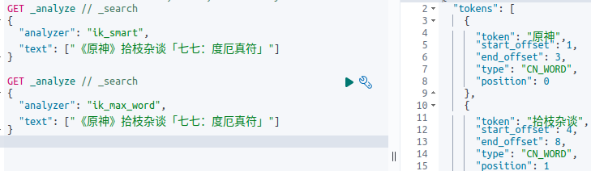
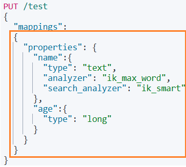

# Elasticsearch简介

**一、Elasticsearch**

* `Elasticsearch`是一个天生支持分布式的搜索、聚合分析和存储引擎
* 基于Java开发的分布式搜索引擎
* 基于Lucene框架开发
* 跨语言，仅支持Json的数据格式，支持PB级数据量
* 使用`RESTFUL`风格命令实现CURD

**二、Elastic Stack**

* 由`Kibana`、`Elasticsearch`、`Beats`和`logstash`组成

**三、Elasticsearch的作用**

* 解决基于已经存在的海量数据全文搜索

**四、Elasticsearch不适合的场景**

* 管理数据
* 事务
* 大单页查询（海量数据里查询大量内容）
* 数据实时写入或更新

**五、不同数据库的对比**

| 数据库       | Elasticsearch                            | MongoDB                            | MySQL                             |
| ------------ | ---------------------------------------- | ---------------------------------- | --------------------------------- |
| 数据库类型   | 搜索引擎                                 | 文档数据库                         | 关系型数据库                      |
| 开发语言     | Java                                     | C++                                | C、C++                            |
| 存储结构     | FST、Hash                                | B Tree                             | B+ Tree                           |
| 数据格式     | Json                                     | Bson                               | Row                               |
| 分布式支持   | 原生支持                                 | 原生支持                           | 使用MyCat实现                     |
| 数据分区方案 | 分片                                     | 分片                               | 分库分表                          |
| 业务系统类型 | OLAP                                     | OLTP                               | OLTP                              |
| 事务支持     | 不支持                                   | 多文档ACID事务                     | 支持                              |
| 数据存储量级 | PB级别                                   | PB级别                             | 单表1000w量级                     |
| 一致性策略   | 最终一致性                               | 最终一致性<br>及时一致性           | 及时一致性                        |
| 擅长领域     | 1、海量数据全文搜索<br>2、大数据聚合分析 | 海量数据CURD                       | 1、强一致性<br>2、事务<br>3、ACID |
| 劣势         | 1、不支持事务<br>2、实时性低             | 1、弱事务支持<br>2、不支持Join查询 | 1、大数据全文搜索性能低           |

# docker安装Elasticsearch与Kibana

**一、docker安装Elasticsearch**

* 要求虚拟机内存要大于2G，否则会爆内存影响虚拟机的运行

```bash
docker run -d 		\
	--name es 		\
	-p 9200:9200	\
	-p 9300:9300	\
	-e "discovery.type-single-node" elasticsearch
```

* 验证启动成功：浏览器访问`127.0.0.1:9200`

**二、docker安装Kibana**

* 编写配置文件

```yaml
server.name: kibana
server.host: "0.0.0.0"
elasticsearch.hosts: ["http://172.18.0.2:9200"]				#数组
xpack.monitoring.ui.container.elasticsearch.enabled: true
i18n.locale: "zh-CN"
```

* 启动kibana

```bash
docker run -d \
  --name=kibana \
  -p 5601:5601 \
  -v ${PWD}/config/kibana.yml:/usr/share/kibana/config/kibana.yml \
  kibana
```

* 验证启动成功：浏览器访问`127.0.0.1:5601`

**三、docker-compose一键安装**

* 初始化环境

```shell
mkdir -p ./kibana/config
touch ./kibana/config/kibana.yml
mkdir -p ./elasticsearch/plugins
touch ./elasticsearch/elasticsearch.yml
```

* `elasticsearch.yml`

```yaml
cluster.name: "docker-cluster"
network.host: 0.0.0.0
discovery.type: single-node
xpack.security.enabled: false
```

* `kibana.yml`里`elasticsearch`的IP设为`172.18.0.2`

```yaml
version: "3.8"
services:
  es:
    image: elasticsearch:8.7.0
    ports:
      - "9200:9200"
      - "9300:9300"
    environment:
      - "discovery.type=single-node"
      - "xpack.security.enabled=false"
      - "ES_JAVA_OPTS=-Xms64m -Xmx1024m"
    volumes:
      - "${PWD}/elasticsearch/plugins:/usr/share/elasticsearch/plugins"
      - "${PWD}/elasticsearch/elasticsearch.yml:/usr/share/elasticsearch/config/elasticsearch.yml"
    networks:
      project_net:
        ipv4_address: 172.18.0.2
  kibana:
    image: kibana:8.7.0
    ports:
      - "5601:5601"
    volumes:
      - "${PWD}/kibana/config/kibana.yml:/usr/share/kibana/config/kibana.yml"
    depends_on:
      - es
    networks:
      project_net:
        ipv4_address: 172.18.0.3
networks:
  project_net:
    driver: bridge
    ipam:
      config:
        - subnet: 172.18.0.0/16
          gateway: 172.18.0.1
```

# elasticsearch概念

## es的数据结构描述

**一、elasticsearch的数据存储结构**

* elasticsearch是面向文档的搜索引擎
* 数据以json的形式存储

| MySQL            | Elasticsearch       |
| ---------------- | ------------------- |
| 数据库(database) | 索引(indices)       |
| 表(tables)       | 字段类型（mapping） |
| 行(rows)         | documents           |
| 字段(columns)    | fields              |

**二、物理设计**

* elasticsearch在后台把每个索引划分成多个分片，每个分片可以在集群不同服务器间迁移

## 分片

**一、分片**

* 一个索引包含1个或多个分片
* 分片的副本可以在索引创建之后修改数量，主分片的数量一旦确定不可修改
* 在集群里，分片及其复制分片不会在同一个节点内
* 一个分片是一个Lucene索引，是一个包含倒排索引的文件目录

**二、倒排索引**

* elasticsearch采用Lucene倒排索引作为底层，适用于全文搜索
* 将"文档"->"单词"的正向索引形式倒转得到"单词"->"文档"的倒排索引形式
* 倒排索引结构：将包含某单词的所有文档的ID组成一条队列

| 单词1 | 文档1的ID | 文档2的ID | ...  |
| ----- | --------- | --------- | ---- |
| 单词2 | 文档1的ID | 文档3的ID |      |
| ...   | ...       | ...       |      |

# IK分词器

## docker-compose安装分词器

**一、下载IK分词器插件**

* [IK分词器](https://gh.ddlc.top/https://github.com/medcl/elasticsearch-analysis-ik/releases/download/v8.7.0/elasticsearch-analysis-ik-8.7.0.zip)
* 解压zip然后放到`~/elasticsearch/plugins`目录里
* 重启容器

**二、验证安装成功**

* 进入`elasticsearch`容器里

```bash
docker exec -it es-es-1 /bin/bash
```

* 验证安装

```bash
elasticsearch-plugin list
```

## IK分词器

**一、分词**

* 把一段字符串划分成一个个关键字
* 将索引库的数据和用户输入的内容进行分词
* 对于中文分词的处理需要使用IK分词器

**二、IK分词算法**

* `ik_smart`：最粗粒度划分（输出的数组较少）
  * 常用于拆分用户输入的内容

```json
GET _anaiye
{
    "analyzer":"ik_smart",
    "text": "美国黄石公园"
}
```

* `ik_max_word`：最细粒度划分（输出的数组较多）
  * 常用于索引最大化

```json
GET _anaiye
{
    "analyzer":"ik_max_word",
    "text": "美国黄石公园"
}
```

**三、自定义扩展字典**

* 在`~/elasticsearch/plugins/config`目录里创建一个`dic`文件

```bash
touch ./elasticsearch/plugins/config/my.dic
```

* 添加词语，一行一个

```dic
原神
拾枝杂谈
```

* 打开`IKAnalyzer.cfg.xml`加载自定义字段

```xml
<?xml version="1.0" encoding="UTF-8"?>
<!DOCTYPE properties SYSTEM "http://java.sun.com/dtd/properties.dtd">
<properties>
	<comment>IK Analyzer 扩展配置</comment>
	<!--用户可以在这里配置自己的扩展字典 -->
	<entry key="ext_dict">my.dic</entry>
	 <!--用户可以在这里配置自己的扩展停止词字典-->
	<entry key="ext_stopwords"></entry>
	<!--用户可以在这里配置远程扩展字典 -->
	<!-- <entry key="remote_ext_dict">words_location</entry> -->
	<!--用户可以在这里配置远程扩展停止词字典-->
	<!-- <entry key="remote_ext_stopwords">words_location</entry> -->
</properties>
```

* 重启`elasticsearch`

```bash
docker-compose stop
docker-compose start
```

* 分词效果



# 文档的数据类型

**一、类型**

| 类型   | 关键字                                                       | 说明                                    |
| ------ | ------------------------------------------------------------ | --------------------------------------- |
| 字符串 | text,keyword                                                 | keyword用于整体搜索<br>text用于局部搜索 |
| 数值   | long,integer,short,byte,double,float,half,float,scaled float |                                         |
| 日期   | date                                                         |                                         |
| 布尔   | boolean                                                      |                                         |
| 二进制 | binary                                                       |                                         |

# 索引的创建与删除

**一、简单创建索引**

* 使用`PUT`创建索引
* RESTFUL格式：`PUT /索引`

```json
PUT /test
```

**二、创建自定义索引**

* 对于中文需要使用ik分词器，则需要修改索引的属性

```json
PUT /your_index
//设置IK分词器
{
  "settings": {
    "analysis": {
      "analyzer": {
        "ik_analyzer": {
          "type": "custom",
          "tokenizer": "ik_max_word",
          "use_smart": false
        }
      }
    }
  },
    //设置字段
  "mappings": {
    "properties": {
      "content": {
        "type": "text",
        "analyzer": "ik_analyzer"
      }
    }
  }
}
```

**三、删除索引**

* 使用`DELETE`删除索引
* RESTFUL格式：`DELETE /索引`

```json
DELETE /test
```

**四、获取索引信息**

* 使用`GET`获取信息
* RESTFUL格式：`GET /索引`

```json
GET /test
```

# 文档的CUD操作

**一、插入数据**

* 使用`PUT`插入数据
* RESTFUL格式：`PUT /索引/_doc/文档id { 文档内容 }`

* 如果没有对应索引则自动创建索引

```json
PUT /test/_doc/1
{
	"name":"demo",
    "age":18
}
```

**二、覆盖更新数据**

* 使用`PUT`实现覆盖更新数据
* 如果更新的内容与原来的内容相比缺少了某些字段，则更新后会造成数据丢失

```json
PUT /test/_doc/1
{
	"name":"hello",
}
```

**三、局部字段更新**

* 使用`POST`实现局部更新
* RESTFUL格式：`POST /索引/_doc/文档id/_update { "doc""{ 修改内容 } }`

```json
POST /test/_doc/1/_update
{
    "doc":{
        "name":"hello"
    }
}
```

**四、删除数据**

* 使用`DELETE`删除数据
* RESTFUL格式：`DELETE /索引/_doc/文档id`

```json
DELETE /test/_doc/1
```

# match和term匹配模式

**一、match搜索模式**

* 会对输入的搜索词（text类型）进行进一步划分（`one->o,n,e`）
* 搜索的结果多，但速度较慢

**二、term搜索模式**

* 不会对输入的搜索词（text类型）进一步划分，如果倒排索引没有该搜索词则不会返回结果（`one->one`）
* 搜索的结果少，但速度较快

# 文档的R操作

## id查询

**一、id查询**

* 使用id获取数据
* RESTFUL格式：`GET /索引/_doc/id`

```json
GET /test/_doc/1
```

## 条件查询

### 单条件查询

**一、简单单条件查询**

* 使用`GET`进行查询
* RESTFUL格式：`GET /索引/_search?q=key:value`

```json
GET /test/_search?q=age:18
```

**二、原始单条件查询**

* 使用`GET`进行查询
* 常见的匹配模式：match,term
* RESTFUL格式

```json
GET /索引/_search
{
  "query":{
      "匹配模式": {
		"键":"值"
      }
  }
}
```

```json
GET /test/_search
{
  "query":{
      "match": {
        "age": 18
      }
  }
}
```

### bool组合查询

**一、多条件匹配查询**

* RESTFUL格式

```json
GET /索引/_search
{
  "query":{
      "bool": {
        "must": [
          {
            "匹配模式": 
            {
              "键1": "值1"
            }
          },
          {
            "匹配模式": 
            {
              "键2": "值2"
            }
          }
        ]
      }
  }
}
```

```json
GET /test/_search
{
  "query":{
      "bool": {
        "must": [
          {
            "match": {
              "name": "王五"
            }
          },
          {
            "match": {
              "age": 18
            }
          }
        ]
      }
  }
}
```

**二、多字段部分匹配查询**

* 满足其一即可，满足越多分值越高

```json
GET /索引/_search
{
  "query":{
      "bool": {
        "should": [
          {
            "匹配模式": 
            {
              "键1": "值1"
            }
          },
          {
            "匹配模式": 
            {
              "键2": "值2"
            }
          }
        ]
      }
  }
}
```

```json
GET /test/_search
{
  "query":{
      "bool": {
        "should": [
          {
            "match": {
              "name": "王五"
            }
          },
          {
            "match": {
              "age": 18
            }
          }
        ]
      }
  }
}
```

**三、多条件过滤查询**

* 使用`must_not`筛选出所有不满足对应条件的内容

```json
GET /索引/_search
{
  "query":{
      "bool": {
        "must_not": [
          {
            "匹配模式": 
            {
              "键1": "值1"
            }
          },
          {
            "匹配模式": 
            {
              "键2": "值2"
            }
          }
        ]
      }
  }
}
```

```json
GET /test/_search
{
  "query":{
      "bool": {
        "must_not": [
          {
            "match": {
              "name": "王五"
            }
          },
          {
            "match": {
              "age": 18
            }
          }
        ]
      }
  }
}
```

**四、单字段多值查询**

* 多个条件用空格隔开
* 会对单词进一步拆分匹配（对于one，用on可以匹配上）
* 搜索满足其一条件的所有结果，按分值进行排序

```json
GET /test/_search
{
  "query":{
    "match": {
      "tag": "one two"
    }
  }
}
```

## 选择字段查询

* 使用`_source`进行选择字段

```json
GET /test/_search
{
  "query":{
      "match": {
        "age": 18
      }
  },
  "_source": ["name"]
}
```

## 排序查询

* 使用`_sort`实现排序查询
* 需要设置参照字段的排序规则，与`SQL`一样

```json
GET /test/_search
{
  "query":{
      "match": {
        "course": "数学"
      }
  },
  "sort": [
    {
      "score": {
        "order": "desc"
      }
    }
  ]
}
```

## 分页查询

* 使用`from`设置起点
* 使用`from`设置单页面的数据量

```json
GET /test/_search
{
  "query":{
      "match": {
        "age":18
      }
  },
  "from": 0,
  "size": 2
}
```

## 范围查询

* 使用`filter-range`实现

```json
GET /test/_search
{
  "query":{
      "bool": {
        "filter": [
          {
            "range": {
              "字段": {
                "gte": 1, //大于
                "lte": 20 //小于
              }
            }
          }
        ]
      }
  }
}
```

```json
GET /test/_search
{
  "query":{
      "bool": {
        "filter": [
          {
            "range": {
              "age": {
                "gte": 10,
                "lte": 20
              }
            }
          }
        ]
      }
  }
}
```

## 高亮查询（嵌入html）

* 追加`hightlight`对象实现对文本里的搜索词嵌入html
* 使用`pre_tags`设置前缀
* 使用`post_tags`设置后缀

```json
GET /test/_search
{
  "query":{
    "term": {
      "name":"拾枝杂谈"
    }
  },
  "highlight": {
    //嵌入html
    "pre_tags": "<p style='color:red'>", 
    "post_tags": "</p>", 
    "fields": {
      "name":{}
    }
  }
}
```

# Go连接Elasticsearch

## 连接Elasticsearch

**一、下载连接包**

```bash
go get github.com/elastic/go-elasticsearch/v8
```

**二、导入包**

```bash
import es "github.com/elastic/go-elasticsearch/v8"
```

**三、获取Config对象**

* 设置相关配置
* IP地址要有协议

```go
c:=es.Config{Addressess:[]string{"http://127.0.0.1:9200"}}
```

**四、连接Elasticsearch**

* 使用`es.NewClient()`获取Elasticsearch连接对象

```go
client,err:=es.NewClient(c)
if err!=nil{
    log.Println(err)
    return
}
```

## 创建索引库与配置索引库

**一、创建索引库**

* 使用`.Indices.Create()`创建索引
* 使用`.Indices.Create.WithContext`可以设置context上下文（本质是闭包封装参数返回函数）

```go
reader:=strings.NewReader(`{"properties":{"name":{"type":"text","analyzer":"ik_max_word","search_analyzer":"ik_smart"},"age":{"type":"long"}}}`)
_,err=client.Indics.Create("test",client.Indices.Create.WithTimeout(time.Second),client.Indices.Create.WithBody(reader))
//err为空时只表示发送成功，不表示执行成功
if err!=nil{
    log.Println(err)
    return
}
//判断是否执行成功需要获取resp，查看响应代码是否为200
```

**二、配置索引库**

* 使用`.Indices.PutMapping()`配置索引库
* 对于中文环境需要设置IK分词器
* 必须输入的参数有字符串数组(`[]string{}`)和配置信息的io对象(`io.reader`)
* 输入的io输入的内容为`Mapping`的内容
* <font color=blue>Elaticsearch连接包使用工厂模式开发，不同工厂的插入上下文的方法都不同</font>

```go
reader:=strings.NewReader(`{"properties":{"name":{"type":"text","analyzer":"ik_max_word","search_analyzer":"ik_smart"},"age":{"type":"long"}}}`)
ctx:=context.Background()
resp,err:=client.Indices.PutMapping([]string{"test"},reader,client.Indices.PutMapping.WithContext(ctx))
if err!=nil{
    log.Println(err)
    return
}
defer resp.Body.Close()
if resp.StatusCode==404{
    log.Println("index not found")
    return
}
```



## 插入文档

**一、插入单条文档**

* 使用`.Create()`插入单条文档
* 输入参数：索引库、文档id、reader、其它配置
* 如果文档已经存在，则不会执行插入操作

```go
reader:=strings.NewReader(`{"name":"拾枝杂谈","age":20}`)
ctx:=context.Background()
resp,err:=client.Create("test","1",reader,client.Create.WithContext(ctx))
if err!=nil{
    log.Println(err)
    return
}
defer resp.Body.Close()

switch resp.StatusCode{
    case 409:
    	log.Println("document exist")
    case 201:
    	log.Println("Created")
}
```

## 更新文档

**一、局部字段更新**

* 使用`.Update()`实现更新部分字段数据
* 输入参数：索引库、文档id、reader、其它配置

```go
reader:=strings.NewReader(`{"doc":{"age":18}}`)
ctx:=context.Background()
resp,er:=client.Update("test","1",reader,client.Update.WithContext(ctx))
if err!=nil{
    log.Println(err)
    return
}
defer resp.Body.Close()

switch resp.StatusCode{
    case 400:
    	//可以从resp.Body里读取错误原因
    	log.Println("Update Error")
    case 200:
    	log.Println("Updated")
}
```

## 删除文档

**一、局部字段更新**

* 使用`.Delete()`实现更新部分字段数据
* 输入参数：索引库、文档id、其它配置

```go
ctx:=context.Background()
resp,er:=client.Delete("test","1",client.Delete.WithContext(ctx))
if err!=nil{
    log.Println(err)
    return
}
defer resp.Body.Close()

switch resp.StatusCode{
    case 404:
    	//可以从resp.Body里读取错误原因
    	log.Println("Document Not Exists")
    case 200:
    	log.Println("Deleted")
}
```

## 查询文档

**一、id查询**

* 使用`.Get()`实现id查询数据
* 输入参数：索引库、文档id

```go
ctx:=context.Background()
resp,err:=client.Get("test","1",client.Get.WithContext(ctx))
if err!=nil{
    log.Println(err)
    return
}
defer resp.Body.Close()

data,err:=ioutil.ReadAll(resp.Body)
if err!=nil{
    log.Println(err)
    return
}

fmt.Println(string(data))
switch resp.StatusCode{
    case 404:
    	//可以从resp.Body里读取错误原因
    	log.Println("Document Not Exists")
    case 200:
    	log.Println("Get OK")
}
```

**二、复杂查询**

* 使用`.Search`实现复杂查询
* 使用`.Search.WithBody()`输入请求体
* resp返回的状态无论是否有值都为200

```go
reader:=strings.NewReader(`{"query":{"match":{"name":"拾枝杂谈"}}}`)
ctx:=context.Background()
resp,err:=client.Search(client.Search.WithBody(reader),client.Search.WithContext(ctx))
if err!=nil{
    log.Println(err)
    return
}
defer resp.Body.Close()

data,err:=ioutil.ReadAll(resp.Body)
if err!=nil{
    log.Println(err)
    return
}
```


