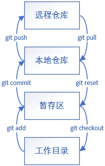
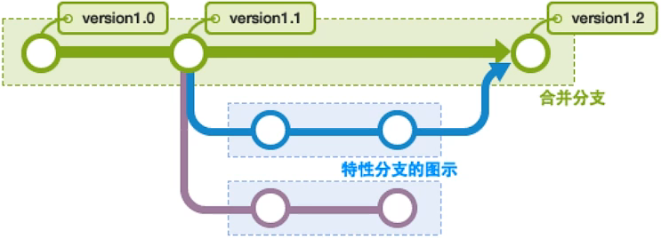

# 版本控制

**一、集中式版本控制**

* `SVN`
* 所有数据保存在单一服务器上，安全性高
* 用户只有以前的版本，想要最新版和提交代码需要连接公司`SVN`服务器

**二、分布式版本控制**

* `Git`
* 每个人都拥有全部代码
* 可以离线提交，联网时再提交给其他用户

# Git的安装与配置

## `Ubuntu`安装Git

```shell
sudo apt-get update
sudo apt-get install git
```

## 设置用户全局配置

**一、设置名字**

```shell
git config --global usr.name 名字
```

**二、设置邮箱**

```shell
git config --global usr.email 邮箱
```

## 查看配置文件

**一、查看系统配置文件**

```shell
git config --system --list
```

**二、查看用户配置文件**

```shell
git config --global --list
```

# Git本地仓库初始化与远程仓库克隆

**一、本地仓库初始化**

```shell
git init
```

**二、远程仓库克隆**

```shell
git clone 仓库URL
```

# Git的文件操作

## Git文件状态

**一、Untracked**

* 文件未跟踪，文件是新建的还没有入库

**二、Unmodify**

* 文件已入库，与代码仓库的文件一致

**三、Modified**

* 文件已修改，未暂存

**四、Staged**

* 文件处于暂存状态，可以使用`git commit`提交



## Git文件操作

**一、查看文件状态**

* 使用`git status`实现
* 可以查看某一文件状态，也可以查看所有文件状态（默认查看所有文件状态）

```shell
#查看某一文件状态
git status 文件相对路径
#查看所有文件状态
git status
```

**二、将新修改的新创建的文件提交到暂存区**

* 使用`git add`实现

```shell
git add ./*
```

**三、提交代码**

* 使用`git commit`提交
* 使用`-m`参数备注信息

```shell
git commit -m 信息
```

**四、查看文件的改变**

* 使用`git diff`查看改变的文件

```bash
git diff
```

**五、设置忽略文件（.gitignore）**

* 提交时忽略某些文件
* 可以使用通配符`*`、`?`

```.gitignore
#忽略以.txt结尾的文件
*.txt
#忽略某目录及其里面的文件
./temp/
#除某文件外都忽略
!demo.txt
#忽略某文件
./temp/demo.txt
```

# 配置ssh公钥

**一、在本地生成密钥**

```shell
ssh-keygen
```

**二、将公钥配置到Github或Gitee上**

* 在`.ssh`文件里找到`.pub`文件结尾的公钥，将公钥与远程仓库账号绑定

# 远程代码仓库相关操作

## 上传代码

* 要求本地的所有修改文件已经`commit`
* 使用`git push`进行上传

```shell
git push
```

## 更新代码

* 使用`git pull`进行更新

```shell
git pull
```

# Git分支相关操作

## 查看类操作

**一、列出所有本地分支**

```shell
git branch
```

**二、列出远程仓库所有分支**

```shell
git branch -r
```

## 修改类操作

**一、创建分支**

```shell
git branch 分支名
```

**二、切换分支**

* 切换分支的同时会将代码文件切换到对应分支的代码

```shell
git checkout 分支名
```

**三、合并指定的分支到当前分支**

```shell
git merge 指定的分支
```

**四、删除本地分支**

```shell
git branch -d 分支名
```

**五、提交代码到分支**

```bash
git push origin 指定分支
```

**六、删除远程分支**

```shell
git push origin --delete 分支名
git branch -dr 分支名
```

**七、合并代码**

* 当前分支与某分支的代码进行合并

```bash
git rebase 分支名
```

**八、Github上New pull request**

* 请求master分支管理者将个人分支的改动合并到主分支

**九、Github上的Squash and merge**

* 合并分支的改变，将分支代码同步到主分支上



