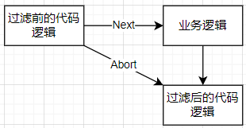

# 下载Gin框架

**一、安装方式**

```shell
go get -u github.com/gin-gonic/gin
```

# Web服务的简单构建

**一、获取web服务对象**

* 可以使用`gin.Default()`和`gin.New()`获取web服务对象
* `gin.Default()`会打印请求响应的速度，常用于开发阶段
* `gin.New()`不会打印请求响应的速度，常用于上线阶段

```go
server:=gin.Default()
server:=gin.New()
```

**二、构建响应请求的方法**

* `server.GET()`用于处理`Get`请求
* `server.POST()`用于响应`Post`请求
* `server.GET()`使用格式：`server.GET("响应路径",响应方法)`
* `server.POST()`使用格式：`server.POST("响应路径",响应方法)`

```go
server.GET("/hello",func(context *gin.Context){
    context.JSON(200,gin.H{"msg":"hello world"})
})
```

**三、启动Web服务**

* 使用`server.Run()`启动服务
* 格式：`server.Run("IP:端口")`

```go
server.Run("0.0.0.0:8081")
```

**四、给标签页添加`icon`**

* 下载第三方包：`go get github.com/thinkerou/favicon`
* 通过`server.Use()`方法使用中间件加载`icon`
* 使用第三方包的`New()`方法加载`icon`
* 第三方包使用方法`favicon.New("icon路径")`

```go
server.Use(favicon.New("./刻晴-夜宵.png"))
```

# Gin响应的数据类型

**一、字符串**

* 使用`context.String()`方法字符串数据

```go
//返回字符串
server.GET("str", func(context *gin.Context) {
    context.String(200, "hello world")
})
```

**二、JSON数据**

* 使用`context.JSON()`方法返回Json数据
* 可以使用`gin.H{}`包装json数据
* 可以使用`map[string]interface{}`类型作为json数据
* 可以使用结构体返回json数据，可以使用反射修改key的名

```go
//使用gin.H{}包装json数据
server.GET("json1", func(context *gin.Context) {
    context.JSON(200, gin.H{"msg": "hello world"})
})
```

```go
//使用map[string]interface{}类型作为json数据
server.GET("json2", func(context *gin.Context) {
    context.JSON(200, map[string]interface{}{
        "msg": "hello world",
    })
})
```

```go
//使用结构体返回json数据
type Message struct {
	Msg string `json:"msg"`
}
server.GET("json3", func(context *gin.Context) {
    msg := &Message{Msg: "hello world"}
    context.JSON(200, msg)
})
```

**三、JSON跨域数据**

* 使用`context.JSONP()`方法返回跨域JSON数据
* 前端传入`callback`属性的值时，会将callback的值放在json前面

```go
//返回JSON跨域数据
server.GET("jsonp", func(context *gin.Context) {
    context.JSONP(200, gin.H{"msg": "hello world"})
})
```

```json
//输入/jsonp?callback=xxx时
xxx({"msg":"hello world"});
```

**四、返回HTML页面**

* 使用`context.HTML()`方法返回
* 需要使用`server.LoadHTMLGlob()`方法加载HTML模板

```go
//加载html页面
server.LoadHTMLGlob("./templates/*")
//返回html页面
server.GET("/index", func(context *gin.Context) {
    context.HTML(200, "index.html", nil)
})
```

**五、响应文件**

* 使用`context.File()`响应文件

```go
webServer.POST("/hander", func(context *gin.Context) {
	//设置响应头参数
	context.Header("Content-Transfer-Encoding", "binary")
	context.Header("Cache-Control", "no-cache")
	context.Header("Content-Type", "application/octet-stream")
	context.Header("Content-Disposition", "attachment;filename=kq.zip")
	context.File("./kq.zip")
}
```

# HTML模板渲染

**一、输出数据**

* 输出后端发来的JSON数据
* 可以输出结构体数据
* 在html中的设置语法：`{{.属性}}`

```html
{{.msg}}
```

**二、设置html变量并赋值**

* 在html中的设置语法：`{{$变量名:=.属性}}`

```html
{{$content:=.msg}}
${{content}}
```

**三、条件判断**

* 语法规则：`{{if 比较字符 .属性 .属性}}输出内容{{else}}输出内容{{end}}`
* 比较字符：`eq`,`ne`,`lt`,`le`,`gt`,`ge`

```html
{{if eq .a .b}}a、b相等
{{else if gt .a .b}}a大于b
{{else}}a、b不相等
{{end}}
```

**四、循环输出数组元素**

* 数组绑定语法：`{{range $idx,$val:=.数组属性}}`
* 输出数组语法：`{{$idx}}{{$val}}`
* 没有数据时输出：`{{else}} 内容`
* 结束：`{{end}}`

```html
<ul>
    {{range $idx,$val:=.list}}
    <li>{{$idx}}&nbps;{{$val}}</li>
    {{else}}
    <li>no data</li>
    {{end}}
</ul>
```

# 前后端请求处理--RESTful API

**一、RESTful API**

* 允许网页在同一路径下处理增删改查的请求
* 传统的网页需要在不同的路径用`POST`处理删改查

| RESTful请求类型 | 常见用处 |
| --------------- | -------- |
| GET             | 查询数据 |
| POST            | 增加数据 |
| PUT             | 更新数据 |
| DELETE          | 删除数据 |

**二、使用`RESTful API`**

* 处理`GET`请求

```go
server.GET("/hello", func(context *gin.Context) {
	//返回JSON内容
	context.JSON(200, gin.H{"msg": "SELECT"})
})
```

* 处理`POST`请求

```go
server.POST("/hello", func(context *gin.Context) {
	context.JSON(200, gin.H{"msg": "ADD"})
})
```

* 处理`PUT`请求

```go
server.PUT("/hello", func(context *gin.Context) {

	context.JSON(200, gin.H{"msg": "UPDATA"})

})
```

* 处理`DELETE`请求

```go
server.DELETE("/hello", func(context *gin.Context) {

	context.JSON(200, gin.H{"msg": "DELETE"})

})
```

# 响应页面与数据给前端

**一、加载资源**

* 加载一个`HTML`页面：使用`server.LoadHTMLFiles()`加载
* 加载全部`HTML`页面：使用`server.LoadHTMLGlob()`加载
* 加载目录里全部的静态资源：使用`server.Static()`加载
* 加载静态资源的方法使用格式：`server.Static("网页路径","主机存放资源的根目录")`

```go
//加载html资源
server.LoadHTMLFiles("./templates/index.html")
server.LoadHTMLGlob("./templates/*")
//加载css js资源，资源放在static目录里
server.Static("/static","./static")
```

**二、状态码**

* 用于表示请求的处理情况
* 可以直接写数字

```go
StatusOK=200
StaticNotFound=404
```

**三、响应页面与数据**

* 使用`context.HTML()`进行响应页面

```go
server.Get("/hello",func(context *gin.Context){
    context.HTML(200,"index.hrml",gin.H{
        "msg":"hello MyWeb",
    })
})
```

# 前端传递参数到后端

## 传统的Get请求取参

* 传统`Get`请求参数在`url`中以`?`开头，以`&`拼接
* 使用`context.Query()`通过`key`取`value`

```go
server.GET("/hello",func(context *gin.Context){
    id:=context.Query("id")
    name:=context.Query("name")
    context.HTML(200,"index.html",gin.H{
        "id":id,
        "name":name,
    })
})
```

## Get请求RESTful形式取参

* `RESTful`形式的请求参数以网页相对路径为主，用`/:`定义的`key`，数据传来时对应位置为`value`
* 使用`context.Param()`获取值

```go
//定义含RESTful形式的url，/:后面跟着key
server.Get("/hello/:id/:name",func(context *gin.Context){
    id:=context.Param("id")
    name:=context.Param("name")
    context.HTML(200,"index.html",gin.H{
        "id":id,
        "name":name,
    })
})
```

## Post请求取参

**一、简单获取数据**

* 使用`context.PostForm()`根据`key`获取`value`
* 处理`key=value&key=value`类型的数据
* 前端请求头要设置`["Content-Type"]="application/x-www-form-urlencoded";`

```go
server.POST("hello",func(context *gin.Context){
    id:=context.PostForm("id")
    passwd:=context.PostForm("passwd")
    context.JSON()
})
```

**二、数据绑定到结构体**

* 使用`context.Bind()`将表单数据绑定到结构体
* 处理`json`格式的数据，非json格式不能处理
* 结构体要有`json`

```go
type User{
    Account		string `json:"account"`
    Password 	string `json:"password"`
}
server.POST("hello",func(context *gin.Context){
    var u User
    err:=context.Bind(&u)
    if err!=nil{
        fmt.Println(err)
    }
    fmt.Println(u)
})
```

**三、数据绑定到map**

* 使用`context.GetRawData()`获取`json`数据
* 使用`json.Unmarshal()`实现反序列化（数据转为键值对）
* 处理`json`格式的数据，非json格式不能处理

```go
server.POST("/usr", func(context *gin.Context) {
	data, _ := context.GetRawData()
	var m map[string]interface{}
	json.Unmarshal(data, &m)
	context.JSON(200, m)
})
```

# 重定向

* 使用`conrext.Redirect()`实现网站重定向

```go
server.GET("/redirect",func(context *gin.Context){
    context.Redirect(301,"https://www.baidu.com")
})
```

# 自定义默认页面

## 自定义404页面

* 使用`server.NoRoute()`响应自定义的404页面

```go
server.NoRoute(func(context *gin.Context) {
	context.HTML(404, "404.html", nil)
})
```

# 路由组

**一、路由组**

* 实现路径的拼接
* 使用`server.Group()`创建并定义路由组的根路径

* 格式：`路由组对象:=server.Group("网页路径")`

* 可以使用`{ }`来框住路由组下的所有路径，提高可读性

```go
usrGroup := server.Group("/usr")
{
	usrGroup.GET("/login", func(context *gin.Context) {
		context.String(200, "login")
	})
	usrGroup.GET("/register", func(context *gin.Context) {
		context.String(200, "register")
	})
}
```

# 限制处理请求过程消耗的内存大小

**一、限制请求使用内存的大小**

* 使用`server.MaxMultipartMemory`设置 

```go
server.MaxMultipartMemory = 8 << 20		//限制8Mb  1MB
```

# 文件上传

## HTML上传文件设置

* `action`：设置文件发送url或路径
* `method`：设置请求方法，一般为post
* `enctype`：设置对文件进行编码
* `accept`：设置文件mime类型
* `name`：设置后端获取文件对象的key
* `multiple`：设置多文件上传，不设置时默认单文件上传

```html
<html>
	<body>
		<form action="/file" method="post" enctype="multipart/form-data">
    		<p><input type="file" multiple="multiple" accept="image/*" name="image"/></p>
    		<p><button type="submit">提交</button></p>
		</form>
	</body>
</html>
```

## 上传一个文件

* 使用`context.FormFile()`获取web文件指针
* 格式：`webfile,err:=context.FormFile("HTML key")`
* 使用`context.SaveUploadedFile()`保持文件
* 格式：`context.SaveUploadedFile(webfile,"目录路径/"+File.Filename)`
* webfile指针的方法：
  * `Filename()`：获取文件名
  * `Size()`：获取文件大小
  * `Open()`：获取文件指针`*File`

```go
server.POST("/file", func(context *gin.Context) {
    //获取web文件指针
	file, _ := context.FormFile("image")
	//打印日志
    log.Println("filename:", file.Filename)
	log.Println("size:", file.Size)
	//保存文件
	_ = context.SaveUploadedFile(file,"./save/+file.Filename")
    //返回处理信息
	context.String(200, fmt.Sprintf("%s上传成功！", file.Filename))
})
```

## 上传多个文件

* 使用`context.MultipartForm()`获取文件表单
* 使用`form.File["key"]`获取所有文件的web指针
* 循环遍历web指针并保存文件

```go
server.POST("/file", func(context *gin.Context) {
	//获取文件表单
	form, _ := context.MultipartForm()
	//根据key获取文件集合
	files := form.File["image"]
	//遍历每个gin的文件指针并保存数据
	for _, file := range files {
		_ = context.SaveUploadedFile(file, "./save/"+file.Filename)
	}
	context.String(200, fmt.Sprintf("文件上传成功！"))
})
```

## 限制上传的文件大小

* 使用gin文件指针对象的`Size`方法获取文件大小

```go
server.POST("/file", func(context *gin.Context) {
    //获取web文件指针
	file, _ := context.FormFile("image")
	//限制文件大小
    if file.Size > 5*1024*1024{
        context.String(200, fmt.Sprintf("%s文件过大！上传失败", file.Filename))
    }
	//开启传输通道并保存文件
	_ = context.SaveUploadedFile(file,"./save/+file.Filename")
    //返回处理信息
	context.String(200, fmt.Sprintf("%s上传成功！", file.Filename))
})
```

# 后端返回文件

* 使用`context.File()`返回文件
* 使用`context.Header`设置响应头（对于一些特殊文件需要设置）

```go
webServer.POST("/hander", func(context *gin.Context) {
	//设置响应头参数
	context.Header("Content-Transfer-Encoding", "binary")
	context.Header("Cache-Control", "no-cache")
	context.Header("Content-Type", "application/octet-stream")
	context.Header("Content-Disposition", "attachment;filename=kq.zip")
	context.File("./kq.zip")
}
```

# Cookie

## Cookie相关概念

**一、Cookie的作用**

* HTTP是无状态协议，从同一网站的一个页面转到另一个页面，不同页面不能直接共享数据
* 不同页面之间的数据共享需要使用Cookie或Session实现
* Cookie存储于个人计算机中，实现同一域名不同页面间的数据共享

**二、Cookie的应用**

* 保持用户登陆状态
* 保持用户浏览的历史记录
* 智能推荐
* 电商网站商品加入购物车并暂存

**三、Cookie的过期时间**

* 时间>0：表示n秒后过期
* 时间<0：表示删除Cookie
* 时间=0：表示Cookie的销毁与Session销毁时间相同

## Cookie的设置与使用

**一、Cookie的属性**

* 检查设置的7种参数

```go
type Cookie struct{
    Name:		name,					//COookie的键
    Value:		url.QueryEscape(value),	//Cookie的值
    MaxAge:		maxAge,					//设置过期时间，单位为秒
    Path:		path,					//Cookie生效路径
    Domain:		domain,					//Cookie对应的域名
    SameSite:	c.sameSite,				
    Secure:		secure,					//是否在https页面生效
    HttpOnly:	httpOnly,				//Cookie是否在客户端能获取以及操作
}
```

**二、设置Cookie**

* 使用`context.SetCookie()`设置Cookie
* 语法：`context.SetCookie("key","value",过期时间,"路径","域名",是否仅https,客户端是否可以调用)`
* 路径设为`\`时，表示全局Cookie，域名下的所有子路径都可以获取

```go
//获取Cookie
val, err := context.Cookie("msg")
//如果没有则设置Cookie
if err != nil {
    context.SetCookie("msg", "hello world", 3600, "/", "127.0.0.1", false, false)
    赋值
    val = "hello world"
}
```

**三、获取Cookie**

* 使用`context.Cookie()`获取Cookie
* 语法：`context.Cookie("key")`

```go
val, err := context.Cookie("msg")
if err != nil {
    context.HTML(200, "index.html", gin.H{"msg": "error"})
} 
```

**四、删除Cookie**

* 使用`context.SetCookie()`重新设置
* 将过期时间设为`-1`

```go
 context.SetCookie("msg", "hello world", -1, "/set", "127.0.0.1", false, false)
```

**五、所有二级域名中共享Cookie**

* 使用`context.SetCookie()`设置Cookie
* 域名项设置为`.域名`（`.`不会将Cookie限制在一级域名里）

```go
 context.SetCookie("msg1", "hello world", 3600, "./", "127.0.0.1", false, false)
```

# Session

## Session相关概念

**一、session的作用**

* session是一种记录客户状态的机制，session的数据保存在服务端，而Cookie是保存在客户端

**二、session工作流**

* 客户端第一次发送请求时，服务器创建一个session对象（删除的数据类似KV数据）
* 将`value`保存在服务器，`key`保存在客户端（key通过Cookie形式保存）
* 浏览器下次访问时发送key到服务端，服务端找到对应的session（value）
* 每个浏览器有唯一的key

**三、下载Session中间件**

```bash
go get github.com/gin-contrib/sessions
```

**四、Session中间件支持的存储引擎**

* cookie-----该第三方库自带，<font color=orange>数据只保存在本地服务器，不能实现集群架构</font>
* redis
* mongodb

**五、Session在浏览器上Cookie**

* Cookie的key为Session服务端存储引擎的name
* Value为加密后的session的key

## Session的设置与使用------cookie

**一、Session中间件初始化**

* 引入`github.com/gin-contrib/sessions/cookie`包
* 使用`cookie.NewStore()`方法创建cookie存储引擎，设置session密钥（放入字节切片数据，内容随意）

* 使用`sessions.Sessions("name",存储引擎)`设置存储引擎的key
* 使用`server.Use()`方法加载Session中间件

```go
//设置私钥
store := cookie.NewStore([]byte("my private key"))
//装载session
server.Use(sessions.Sessions("mysession", store))
```

**二、设置Session数据**

* 使用`sessions.Default(context)`获取Session对象
* 使用`session.Set()`方法暂存键值对
* 语法：`session.Set("key","value")`
* 使用`session.Save()`方法保存键值对

```go
//设置session数据
server.GET("/set", func(context *gin.Context) {
    //获取session对象
    session := sessions.Default(context)
    //设置键值对
    session.Set("msg", "hello world")
    //设置过期时间
    session.Options(sessions.Options{MaxAge: 3600})
    //保存session数据
    err := session.Save()
    if err != nil {
        context.HTML(200, "index.html", gin.H{"msg": "session save error"})
    }
})
```

**三、获取Session数据**

* 使用`sessions.Default(context)`获取Session对象
* 使用`session.Get()`方法获取Session的值

```go
server.GET("/get", func(context *gin.Context) {
    //获取session对象
    session := sessions.Default(context)
    //取值
    val := session.Get("msg")
    context.HTML(200, "index.html", gin.H{"msg": val})
})
```

**四、设置Session过期时间**

* 使用`session.OPtions()`方法设置
* 传入`sessions.Options{}`结构体，给`MaxAge`设置，单位秒

```go
//设置过期时间
session.Options(sessions.Options{MaxAge: 3600})
```

## Session的设置------redis

**一、Session中间件初始化**

* 引入`github.com/gin-contrib/sessions/redis`包
* 使用`redis.NewStore()`方法创建redis存储引擎，设置连接数，连接方式、redis连接和session密钥
* 语法：`redis.NewStore(连接数,"tcp","redisIP端口","密码",[]byte("密钥"))`

* 使用`sessions.Sessions("name",存储引擎)`设置存储引擎的key
* 使用`server.Use()`方法加载Session中间件

```go
//获取redis连接，并设置私钥
store, err := redis.NewStore(10, "tcp", "127.0.0.1:6379", "", []byte("my private key"))
if err != nil {
    fmt.Println("redis error")
    return
}
//装载session
server.Use(sessions.Sessions("mysession", store))
```

# 协程的使用

**一、协程相关问题**

* `gin.Context`本身线程不安全

**二、数据传递**

* 使用`context.Copy()`获取`gin.Context`的复制对象，将复制对象传入协程里获取数据

```go
ctx:=context.Copy(context)
```

# 中间件（拦截器）

**一、中间件的作用**

* 用于预处理请求，常用于处理请求之前的过滤或一些中间操作
* 应用场景：登陆的验证、分页、耗时统计等

**二、中间件的定义**

* 定义一个函数，用于返回`gin.HandlerFunc`类型的函数
* 使用匿名函数构建中间件的具体实现
* 中间件的代码由三部分组成，分别为过滤前逻辑代码，过滤操作和业务处理完后的逻辑代码

```go
//简单的中间件代码结构
func myHandler() gin.HandlerFunc {
    return func(context *gin.Context){
        //过滤前逻辑代码
        //过滤操作，context.Next()或context.Abort()
        //过滤后的逻辑代码
    }
}
```



**三、中间件请求的过滤与放行**

* 使用`context.Next()`方法对请求放行并执行业务代码
* 使用`context.Abort()`阻止请求
* <font color=red>放行或拦截请求后要使用`return`退出函数，否则会进行运行逻辑</font>

```go
func myHander() gin.HandlerFunc {
	return func(context *gin.Context) {
		//获取id数据
		id := context.Param("id")
		//判断拦截请求
		if id == "1" {
			context.Abort()
            //拦截后不作处理时必须设置return，否则系统会运行无用逻辑引发bug和漏洞
            return
		}
		//设值
		context.Set("msg", "access")
		//请求通过
		context.Next()
	}
}
```

**四、中间件的注册**

* 全局使用：使用`ginServer.Use()`方法注册中间件
* 局部使用：先注册中间件，在某个处理请求里，将中间件放到相对路径后面，处理函数要放在中间件后面

```go
//注册中间件，全局使用
server.Use(myHander())
```

```go
//注册中间件，局部使用
server.Use(myHander())
//返回json，添加中间件函数
server.GET("/:id", myHander(), func(context *gin.Context) {
    //获取中间件设置的数据
    msg := context.MustGet("msg").(string)
    //返回数据
    context.JSON(200, gin.H{"msg": msg})
})
```

**五、中间件存值与取值**

* 在中间件可以使用`context.Set()`存键值对

* 在服务函数使用`context.MustGet()`方法获取中间件存放的键值对，返回`any`类型的变量，取值时要断言

```go
//存值
context.Set("msg", "access")
```

```go
//取值
msg := context.MustGet("msg").(string)
```

# MVC开发框架

**一、项目的结构**

* 视图：templates，根据不同模块可以进行详细分类
* 路由api：router，根据不同模块可以进行详细分类
* 控制器：controller，用于定义请求的处理方法
* 模型数据：model，用于获取数据

**二、路由分离**

* 将路由部分从`main.go`中抽离
* 在路由文件路构造路由函数，需要传入`gin.engine`对象的指针

```go
//路由文件配置路由
func RoutersInit(r *gin.Engine){
    RouterOne:=r.Group("/one")
    {
        RouterOne.Get("/first",func(context *gin.Context){ ... })
        RouterOne.Get("/second",func(context *gin.Context){ ... })
    }
}
```

**三、控制器分离**

* 将处理请求部分从`main.go`中抽离
* 在控制器文件路构造路由函数，需要传入`gin.engine`对象的指针
* 可以构建结构体实现继承某些控制器

```go
//简单控制器
func Login(context *gin.Context){
    context.String(200,"登陆成功")
}
func Register(context *gin.Context){
    context.String(200,"注册成功")
}
```

```go
//继承控制器，继承Person控制器的方法，路由文件需要实例化结构体才能使用方法
type Student struct{
    Person
}
func (stu *Student)Login(context *gin.Context){
    context.String(200,"登陆成功")
}
func (stu *Student)Register(context *gin.Context){
    context.String(200,"注册成功")
}
```

# 项目实践

## 上传图片并按日期存储图片

**处理过程**

* 接收上传文件的请求头
* 获取图片后缀，判断类型是否正确（.jpg,.png,.gif,.jpeg）
* 判断是否存在日期目录，没有则创建目录
* 获取图片上传

**一、接收上传文件的请求头**

* 分为上传单文件和上传多文件

```go
//上传单个文件
file, _ := context.FormFile("image")
```

```go
//上传多个文件
	//获取文件表单
form, _ := context.MultipartForm()
	//根据key获取文件集合
files := form.File["image"]
	//遍历每个gin的文件指针
for _, file := range files {
    ......
}
```

**二、获取文件后缀**

* 使用标准库的path包的方法处理
* 使用`path.Ext()`获取文件后缀
* 使用`ginFileObj.Filename`获取文件名

```go
extName:=path.Ext(file.Filename)
```

**三、判断是否存在日期目录，没有则创建目录**

* 使用`time.Format()`获取形式化日期
* 使用`time.Now()`获取当前时间
* 使用`os.Stat(string)`获取文件信息
* 使用`os.IsNotExist(error)`判断文件是否存在
* 使用`os.Mkdir(dir,权限)`创建目录
* 直接使用`os.MKdirAll(dir,权限)`创建目录，如果存在则不作操作返回nil

```go
//获取形式化日期
func GetDay()string{
    return time.Now().Format("20060102")
}
```

```go
//判断是否存在目录，没有则创建
	//获取形式化日期
dir:="./upload/"+GetDay()
	//获取文件信息
_,err:=os.Stat("./pkgdemo")
if err!=nil{
    //判断是否没有目录
    if os.IsNotExit(err){
        //没有则创建目录
        os.Mkdir(dir,0666)
    }else{
        fmt.Println(err)
        return
    }
}
```

```go
//判断是否存在目录，没有则创建
	//获取形式化日期
dir:="./upload/"+GetDay()
err := os.MkdirAll( uploadDir ,0666)
if err!=nil{
    fmt.Println(err)
    return
}
```

**四、获取上传图片**

* 使用`context.SaveUploadedFile(file,dst)`存储上传的图片

```go
dst=dir+fmt.Sprinf("%d",time.Now().UnixNano())+extName
context.SaveUploadedFile(file,dst)
```

# Gin加载vue项目

**一、导入包**

```go
import "github.com/gin-contrib/static"
```

**二、装载dist文件**

* 使用`.Use()`使用加载中间件

```go
//dist目录与main.go在同一目录下时
server.Use(static.Serve("/",static.LocalFile("dist",true)))
server.GET("/",func(context *gin.Context){
    context.HTML(200,"index.html",nil)
})
```


