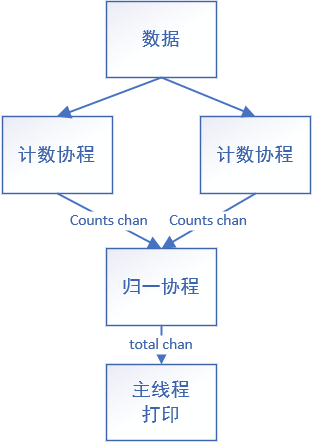

# 并发经验

* 开启`goroutine`的速度慢于for循环的速度
* 协程函数需要放入参数则优先使用匿名方法，在方法的尾部`()`里放入参数
* 先`wg.Add()`再启动协程，否则程序执行完但协程还没启动
* 对于百万数量以上或需要消耗大量内存的并发优先选择`ants`异步并发框架（）


# 并发计数二维数组

* 协程间的通信使用`channel`
* <font color=red>归一函数协程的运行释放需要计数协程关闭通道，不能让协程计数+1否则死锁</font>

```go
package main

import (
	"fmt"
	"sync"
)

var wg sync.WaitGroup
var counts chan int
var total chan int

//获取数据
func initArr(n int) [][]int {
	arr := make([][]int, n)
	for i := 0; i < n; i++ {
		for j := 0; j < n; j++ {
			arr[i] = append(arr[i], j)
		}
	}
	return arr
}

//并发计数
func countFunc(matrix [][]int) {
    //运行完关闭counts通道
	defer close(counts)
    //启动计数协程
	for _, arr := range matrix {
        //先Add再启动协程，否则程序执行完但协程还没启动造成协程不安全
		wg.Add(1)
		go func(arr []int) {
            //协程运行完wg计数减1
			defer wg.Done()
			count := 0
			for _, v := range arr {
				count += v
			}
            //计算结果传到counts通道
			counts <- count
        //放入匿名函数需要的参数
		}(arr)
	}
    //启动归一函数协程
	go getRes()
    //等待计数协程运行完毕
	wg.Wait()
}

//归一计数
func getRes() {
	defer close(total)
	res := 0
    //for循环获取通道数据，通道关闭时跳出循环
	for {
		v, ok := <-counts
		if !ok {
			break
		}
		res += v
	}
	total <- res
}

func main() {
	n := 10000
    //初始化通道
	counts = make(chan int, n)
	total = make(chan int, 1)
    //获取数据
	testData := initArr(n)
	//开始计数
    countFunc(testData)
    //获取计数结果
    for{
        res,ok:=<-total
        if !ok{
            break
        }
        fmt.Println(res)
    }
}
```

