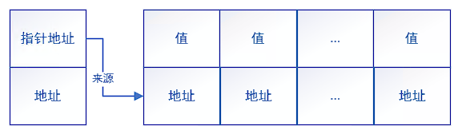
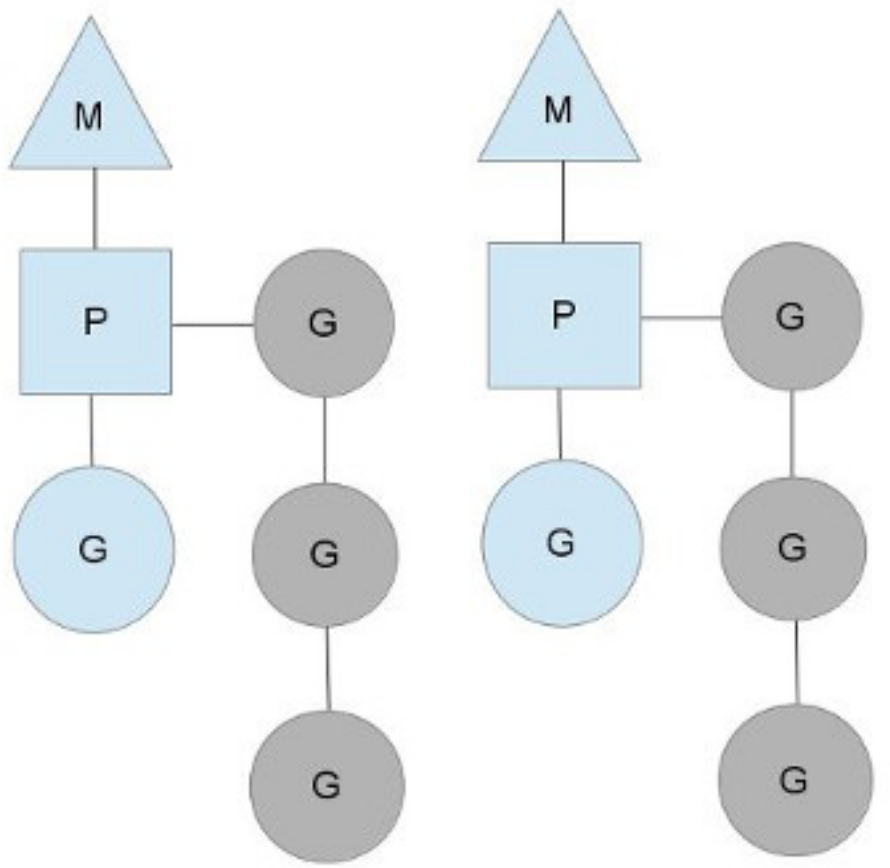
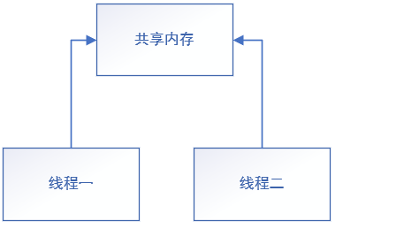
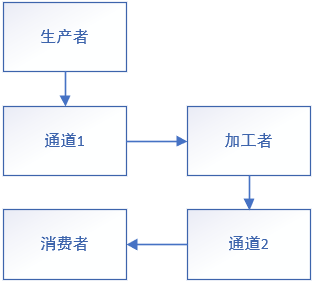
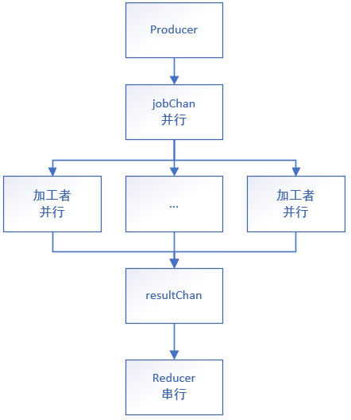
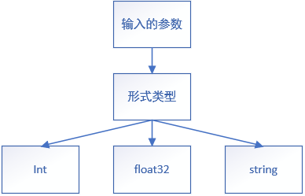

# 递归函数

**一、递归的定义**

* 是一种**由后往前推**的收敛算法

* 若知道最后一步而且计算过程为重复的操作，则可以使用递归思想

```go
//台阶问题
func step(n int) int {				//输入剩余台阶数，返回上台阶种类数
    if n==1{
        return 1					//最后台阶剩1时返回种类数1
    }else if n==2{
        return 2					//最后台阶为2时返回种类数2
    }else{
        return step(n-1)+step(n-2)	//如果台阶数大于2时递归相加
    }
}
func main(){
    fmt.Println(step(5))
}
```

# 类型别名和自定义类型

**一、自定义类型**

*	格式：`type 类型名 内置的数据类型`

* 构造自定义的类型

```go
type myint int			//自定义的一个类型名，内置类型为int
						//类型为 包名.myInt
```

**二、类型别名**

* 格式：`type 类型别名=内置数据类型`

* 给类型一个外号，不会构造新的类型

* 可以用于标识某一种类的数据（rune用于标识字符编码）

```go
type myInt=int			//定义一个类型别名
						//类型为int
```

# 基本的结构体

## 结构体的定义

**一、结构体的定义**

* Go语言使用`struct`能实现面向对象

* 对某个类封装多个基本数据类型

* 最基本的结构体由字段名和字段类型组成

* 先定义结构（或类）再实例化

```go
type people struct{					//使用struct定义名为people的类
    name string						//定义字段name，字段类型为string
    age int
    hobby []string
}
func main(){
    var p people					//实例化结构体
    p.name="张三"					   //给对象p赋值
    p.age=18
    p.hobby=[]string{"basketball","football","game"}
    fmt.Println(p)
}
```

**二、匿名结构体的定义**

* 直接实例化的结构体（或对象）

* 多用于临时场景

```go
func main(){
    var m struct{			//直接实例化对象
    	CPU string
        GPU string
	}
}
```

**三、结构体的引用**

* 结构体直接传入函数时传的是副本

* 结构体直接传入函数并修改不会影响原来的结构体，需要返回才能改变

```go
type machine struct{
    CPU string
    GPU string
}
func f(m machine)machine{
    m.CPU="Inter"
    return m
}

func main(){
    var m machine
    m.CPU="AMD"
    m.GPU="NVIDIA"
    fmt.Println(m)			//AMD NVIDIA
    _=f(m)					//不会改变
    fmt.Println(m)			//AMD NVIDIA
    m=f(m)					//会改变
    fmt.Println(m)			//Inter NVIDIA
}
```


## 结构体指针和结构体初始化

**一、结构体指针**

* Go语言不能修改指针地址，但能修改指针对应的变量

* 将**结构体指针**传入函数可以修改结构体本体的值（不是修改副本）

```go
func f(m *machine){		//传入结构体指针
    m.CPU="Inter"		//通过指针修改值
}
func main(){
    m.CPU="AMD"
    m.GPU="NVIDIA"
    fmt.Println(m)		//AMD NVIDIA
    f(&m)				//传入对象m的地址
    fmt.Println(m)		//Inter NVIDIA
}
```

**二、创建指针类型结构体**

* 可以使用new对结构体进行实例化

* 使用`.`访问结构体内属性

* 两种实例化方式内部结构不同

 ```go
 var m1 machine			//实例化方法一
 var m2 =new(machine)	//实例化方法二
 fmt.Printf("%p %p,%s",&m1,&m2,m1.CPU)
 ```

* 直接var创建的结构体内存结构（是一块连续的空间）


* new创建的结构体内存结构（由结构体指针和一块连续的空间组成）



**三、结构体的初始化**

```go
//创建后进行初始化
m1.CPU="AMD"
//快速创建并以键值对形式初始化
var m1 =machine{CPU:"AMD",GPU:"NVIDIA"}
var m2 :=machine{CPU:"AMD",GPU:"NVIDIA"}
//快速创建、初始化并返回地址
var m1 =&machine{CPU:"AMD",GPU:"NVIDIA"}			//和new方式实例化后的内存结构一样
m1 :=&machine{CPU:"AMD",GPU:"NVIDIA"}				//由结构体指针和一块连续空间组成
```

##  结构体的构造函数

**一、构造函数的定义**

* 用于返回一个完成初始化的结构体变量的函数

* 构造函数有两种，一种是返回值，一种是返回指针（结构体是值类型）

* 返回值会有复制粘贴过程，会消耗系统内存资源，返回指针直接跳过，节省了资源

```go
//返回值的构造函数
func newMachine(CPU string,GPU string) machine{
    return machine{CPU:"AMD",GPU:"NVIDIA"}
}
//返回结构体指针的构造函数
func newMachine(CPU string,GPU string) *machine{
    return &machine{CPU:"AMD",GPU:"NVIDIA"}
}
```

## 方法和接收者

**一、方法和接收者的定义**

* 只能被特定类型变量调用的函数叫做方法，该特定类型为接收者

* 特定类型变量作用类似Java的this，Python的self，通过变量调用结构体的属性

* 特定类型变量由变量名和结构体类型组成

* 方法定义的格式：`func (变量 结构体类型)函数名(){函数体}`

```go
//定义结构体类型
type machine struct{
    CPU string
    GPU string
}
//定义结构体的构造方法
func newMachine(CPU string,GPU string)*machine{
    return &machine{CPU:CPU,GPU:GPU}
}
//定义machine的方法
func (m machine)run(){							//设置接收者，只有接收者才能使用该方法
    fmt.Printf("%s %s run!!\n",m.CPU,m.GPU)		//通过m可以调用结构体的属性
}
//使用mechine的方法
func main(){
    m1 :=newMachine("AMD","NVIDIA")
    m1.run()
}
```

**二、值接收者和指针接收者**

* 值接受者里改变结构体的属性只能改变副本，不能改变本体

* 指针接收者可以改变结构体的本体数据

* 值接收者的定义：`变量 结构类型`

* 指针接收者的定义：`变量 *结构类型`

```go
func (m machine)runOne(){
    m.CPU="Inter"
}
func (m *machine)runTwo(){
    m.CPU="Inter"
}
func main(){
    m1:=newMachine("AMD","NVIDIA")	//获取初始化结构体指针
    m1.runOne()						//值接收者不能改变本体
    fmt.Println(*m1)					//{AMD,NVIDIA}
    m1.runTwo(m1)					//指针接收者能改变本体
    fmt.Println(*m1)					//{Inter,NVIDIA}
}
```

**三、指针接收者的优势**

* 指针接收者能够改变结构体本体的数据

* 指针接收者更改数据的过程耗费的资源小（不需要开辟内存存储副本）

* 要求有一个方法使用了指针接收者，其他方法也要用指针接收者

**四、自定义类型接收者**

* 和结构体接收者的构造一样

## 结构体的匿名字段

**一、匿名字段的定义**

* 不需要字段名，只写字段类型（不常用）

* 通过变量类型获取匿名字段的值

* 只适用于字段少且类型不重复的结构体（类型重复会报错）

```go
type machine struct{
    string
    int
}
func main{
    m1 :=machine{"CPU",12}
    fmt.Println(m1.string)
    fmt.Println(m1.int)
}
```

## 嵌套结构体

**一、嵌套结构体的定义**

* 在一个结构体内嵌套另一个结构体

* 使用匿名嵌套结构体访问属性时可直接获取属性

* 匿名嵌套结构体的字段不能重复，否则冲突不能编译

```go
//嵌套结构体
type machine struct{				//定义一个结构体
    CPU string
    GPU string
}
type worker struct{					//定义一个嵌套结构体
    name string
    m 	 machine					//嵌套了machine结构体
}
func main{
    p :=worker{name:"keven",m:machine{CPU:"AMD",GPU:"NVIDIA"}}	//嵌套结构体初始化
    fmt.Println(p)
    fmt.Printf("%s,%s,%s",p.name,p.m.CPU,p.m.GPU)				//嵌套结构体属性的访问
}
//匿名嵌套结构体
type machine struct{				//定义一个结构体
    CPU string
    GPU string
}
type worker struct{					//定义一个嵌套结构体
    name string
    machine							//匿名的machine结构体
}
func main{							//machine:machine{}对匿名结构体定位然后初始化
    p :=worker{name:"keven",machine:machine{CPU:"AMD",GPU:"NVIDIA"}}
    fmt.Println(p)											//嵌套结构体以及匿名结构体的初始化
    fmt.Printf("%s,%s,%s",p.name,p.CPU,p.GPU)				//嵌套结构体属性的直接访问
}
```

## 结构体中的继承

**一、结构体继承的定义**

* 使用结构体实现面向对象的继承

* 实现继承父类的属性和方法

```go
//定义machine结构体
type machine struct{
    CPU string
    GPU string
}
//定义machine的方法
func (m machine)run(){
    fmt.Println("system run!!")
}
//定义computer结构体
type computer struct{
    OS string
    machine						//使用嵌套结构体可以实现继承
}
//定义computer的方法
func (pc computer)work(){		//可以获取父类的属性
    fmt.Printf("system:%s CPU:%s GPU:%s",pc.OS,pc.CPU,pc.GPU)
}

func main(){					//实例化Pc对象
    Pc :=computer{OS:"linux",machine:machine{CPU:"AMD",GPU:"NVIDIA"}}
    Pc.run()					//运行父类方法
    Pc.work()					//运行子类方法
}
```

## 结构体与JSON

**一、结构体的属性转为json（序列化）**

* 需要使用内置的包`"encoding/json"`

* 使用json包的方法Marshal()实现结构体属性的序列化（转换为json格式的字符串）

* Marshal()方法返回字节序列和错误信息（[]byte,err）

* **结构体的非私有属性的首字母要大写**

* 若json要求字段名要小写字母，则可以使用反引号进行字段名映射

```go
type machine struct{
    CPU string `json:"cpu"`			//当值传给json包时，使用反引号可将字段名映射为"cpu"
    GPU string
}
func main(){
    m :=machine{CPU:"AMD",GPU:"NVIDIA"}
    byte, err:=json.Marshal(m)		//返回字节序列和错误信息
    if err != nil{					//没有错误时err为nil
        fmt.Println(err)
    }else{
        fmt.Println(string(byte))	//将字节序列转为字符串序列并输出
    }
}
```

**二、json转换为结构体的属性（反序列化）**

* 使用json包的Unmarshal()方法进行反序列操作

* Unmarshal()方法需要传入字节序列和声明的结构体指针

```go
var m2 machine							
str :={"CPU":"AMD","GPU":"NVIDIA"}		//使用Umarshal方法时注意传入的是字节序列	
err :=json.Umarshal([]byte(str),&m2)	//传入m2的地址才能修改，副本不能修改原始数据
if err != nil{
    fmt.Println(err)					//判断返回err
}else{
    fmt.Println(m2)						//使用m2结构体的数据
}
```

## 结构体的可比较情况

* 如果`struct`内部的字段均为基础的数据类型则可以进行比较
* 如果`struct`内部存在引用类型(`slice`、`map`、`channel`)，如果不是和`nil`比较，其余的都不能比较
* 结构体存在函数类型时不能比较
* 结构体之间的比较只能比较是否相等，不能比较大小
* <font color=red>只有属性都相等且属性顺序一致的结构体才能进行比较</font>

## 结构体嵌套的相关问题

* 被嵌套的结构体的方法内如果调用其它自己的方法，调用的方法为原本的方法（不会调用被覆盖的新的方法）

# 接口

## 接口的实现

**一、接口的定义**

* 接口是一种类型

* 实现不同类型的变量拥有统一的方法并统一调用

* 规定了满足接口变量的结构体要实现的方法，并通过接口变量统一调用

* 只要实现了对应的方法的结构体变量就可以认为是接口变量，通过接口变量调用方法

* 可以实现集中式管理，实现多个数据库插入需要多个方法，可以用接口统一调用

* 接口定义格式：`type 接口名 interface{ 方法名(参数)(返回值) }`

* **接口的值为动态值，接口的类型为动态类型**（可以灵活变）

```go
//定义一个animal接口类型
type animal interface{
    eat()					//带的参数和返回值不同则函数类型不同
}
//定义一个dog结构体类型
type dog struct{
    name string
}
//定义dog的eat方法
func (d dog)eat(){
    fmt.Println(d.name," eat meat")
}
//定义一个goat的结构体类型
type goat struct{
    name string
}
//定义goat的eat方法
func (g goat) eat(){
    fmt.Println(g.name," eat grass")
}
//通过do函数结合接口变量a进行统一调用eat方法
func do(a animal){
    a.eat()
}

func main(){
    dog :=dog{name:"dog"}			
    goat :=goat{name:"goat"}
    do(dog)						//使用接口变量可以调用实现类的方法
    do(goat)
}
```

**二、值接收者和指针接收者实现接口方法**

* 接口方法使用值接收者时，接口变量可传入结构体指针和结构体变量

* 接口方法使用指针接收者时，接口变量只能传入结构体指针

* 一般使用指针接收者来实现接口方法

```go
//指针接收者
type animal interface{					//定义接口
    eat()
}

type dog struct{						//定义dog结构体
    name string
}

func (d *dog) eat(){					//使用指针接收者实现接口
    fmt.Println(d.name,"eat meat")
}

func main(){
    var a animal						//声明接口变量
    dog1 :=&dog{name:"dog1"}			//初始化dog1结构体变量获取结构体指针
    a =dog1								//接口变量获取dog1的结构体指针
    a.eat()								//使用指针接收者定义的方法
}										//结构体变量不能调用eat()方法
```

```go
//值接收者
type animal interface{					//定义接口
    eat()
}

type dog struct{						//定义dog结构体
    name string
}

func (d dog) eat(){					//使用指针接收者实现接口
    fmt.Println(d.name,"eat meat")
}

func main(){
    var a animal						//声明接口变量
    
    dog1 :=&dog{name:"dog1"}			//初始化dog1结构体变量获取结构体指针
    dog2 :=dof{name :"dog2"}			//初始化dog2结构体变量获取结构体变量
    
    a =dog1								//接口变量获取dog1的结构体指针
    a.eat()								//使用指针接收者定义的方法
    
    a =dog2								//接口变量获取dog2的结构体变量
    a.eat()								//使用指针接收者定义的方法
}
```

## 接口的组合

* 接口中可以组合其它存在的接口

```go
//结构体实现多个接口和接口的嵌套
type animal interface{			//总接口组合两个子接口
    eater
    mover
}

type eater interface{			//定义一个eater接口
    eat()
}

type mover interface{			//定义一个mover接口
    move()
}

type dog struct{				//定义一个结构体
    name string
}
//结构体实现animal接口
func (d *dog)eat(){				//指针接收者实现eat()方法
    fmt.Println(d.name,"eat meat")
}

func (d *dog)move(){			//指针接收者实现move()方法
    fmt.Println(d.name,"run")
}

func main(){
    var a animal				//声明animal接口变量
    dog :=&dog{name:"dog"}		//获取结构体指针
    a=dog						//接口变量获取dog结构体指针
    a.eat()						//接口变量调用eat()方法
    a.move()					//接口变量定义move()方法
}
```

## 空接口

**一、空接口的定义**

* 空接口定义格式：`interface{ }`

* 空接口没必要命名

* 任意类型都是空接口类型，具有广泛性

```go
//空接口作为容易类型
func printer(val interface{}){					//空接口作为函数参数的类型
    fmt.Printf("%T\n",val)
}
func main(){
    m :=make(map[string]interface{},10)			//卡接口作为map值的类型
	m["Sno"]=2019101
	m["name"]="zhang san"
	m["hobby"]=[]string{"basketball","football","swimming"}
	fmt.Println(m)
	printer(m)
}
```

**二、类型断言**

* 用于猜接口变量的类型

* 断言格式：`返回值,ok :=接口变量.(具体类型)`

* 如果猜对接口变量类型则会返回接口变量的值，否则报错

* 猜对时ok为`true`，猜错时为`false`，使用ok值判断避免报错

* **猜错时返回值为零值**

```go
//类型断言的一般使用方式
func printer(val interface{}){
    num ,ok :=val.(int)				//使用类型断言判断接口类型是否为int
    fmt.Println(num)
    if ok == true{					//是则执行
        fmt.Printf("%d\n",num)
    }else{
        fmt.Printf("error")			//否则执行
    }
}
func main(){
    n :=10
    printer(n)
}
```

```go
//使用switch判断接口变量的类型
func printer(val interface{}){
    switch val.(type){				//这种类型断言只适用于switch语句
        case int:
        	fmt.Println("int")
        case string:
        	fmt.Println("string")
        case float64:
        	fmt.Println("float")
        default:
        fmt.Println("others")
    }
}
```

# package（自定义包的引用）

**一、包的定义**

* 格式：`package 包名`

* 只有main包是程序入口

* 自定义包的目录要和包名要相同

```go
//main包
package main
//自定义包
package 包名
```

**二、包的导入**

* 格式：`import "包名"`

* 禁止循环导入包（禁止a导入b的同时b导入a）

```go
//单行导入
import "包1"
//多行导入
import (
	"包1"
    "包2"
)
```

**三、包的别名**

* 格式：`import 别名 "包名"`

```go
//单行导入
import d "demo"
//多行导入
import (
	d "demo"
    t "text"
)
```

**四、匿名导入包**

* 只希望导入包而不使用内部数据时使用匿名导入包

* 格式：`import _ "包的路径"`

**五、私有与公有**

* 如果标识符为公有，则第一个字母要求是大写字母

* 只有公有的属性和方法才能被调用或将属性和方法传给自定义包

**六、init()初始化函数**

* 导入包时自动触发包内部init()函数的调用

* init()函数没有参数、没有返回值

* 程序执行时自动调用，不能在代码里主动调用

* init()函数的执行顺序：先执行导入包的init(),最后执行main包的init()

* 导入**多个包**时init()执行顺序为**后进先出**

* init函数执行时机：全局声明->init()->main()

```go
package cal
func init(){
    fmt.Println("package自动调用")
}
package main
func init(){
    fmt.Println("main")
}
//package自动调用
//main
```

# 文件操作

## 打开文件

**一、打开文件**

* 格式：`fileObj,err :=os.Open("文件路径")`（goland开发界面要在终端运行才能用相对路径）

* os.Open()函数**返回文件指针和错误信息**

* 文件操作的必要步骤

```go
fileObj,err :=os.Open("./hello.go")
if err != nil{							//err非空时出现异常
    fmt.Println(err)
    return								//main函数的return直接结束程序
}
def fileObj.Close()						//文件关闭
```

## 读取文件

**一、直接读取文件**

* 格式：`n,err :=fileObj.Read(字节切片)`

* 读取文件前要定义一个大小合适的**字节切片**

* n表示读取的字节数，err表示错误信息

```go
//读取前先打开文件获取文件对象（文件指针）
temp :=make([]byte,128)			//定义一个128字节的切片
n,errR :=fileObj.Read(temp)		//最多读取与切片大小等量的数据
if errR != nil{
    fmt.Println(errR)
    return
}
fmt.Println("read",n,"byte")	//打印读取信息
fmt.Println(string(temp[:n]))	//将读取的字节数据转换为字符串
```

```go
//for循环实现读完容易大小的文件
func readDirect(fileObj *os.File){
	for{
    	n,errR :=fileObj.Read(temp)		//读取文件数据
    	if errR !=nil{
        	fmt.Println(errR)
        	return
    	}
    	fmt.Println(string(temp[:n]))	//根据读取的字节数的多少打印数据
    	if n <len(temp){				//读取的数据字节数小于切片的大小说明读完了
        	break
    	}
	}
}
```

**二、bufio使用缓冲区读取文件**

* 用缓冲区来暂时存储数据

* 能把某些字符作为分割符进行读取

* 使用方式：使用文件对象构造一个扫描对象reader，然后再根据分割符分段读取

* 构造扫描对象格式：`reader :=bufio.NewReader(fileObj)`

* 根据字符分割分段读取格式：`line,err :=reader.ReadString('字符')`

* 根据行分段读取：`line,isProfix,err :=reader.ReadLine()`（isProfix表示缓冲区是否溢出）

```go
//根据行分段读取
func readBuf(fileObj *os.File){
	reader :=bufio.NewReader(fileObj)		//构造扫描对象
	for{
    	line,_,err:=reader.ReadLine()		//按行读取
    	if err ==io.EOF{					//如果错误为EOF说明读完
        	break
    	}
    	if err !=nil{
        	fmt.Println(err)
        	break
    	}
    	fmt.Println(string(line))			//按行打印
	}
}
```

**三、ioutil读取整个文件**

* 格式：`content,err :=ioutil.ReadFile("文件路径")`

```go
func main(){
    content,err :=ioutil.ReadFile("文件路径")
    if err != nil{
        fmt.Println(err)
        return
    }
    fmt.Println(string(content))			//字节数据转为字符串
}
```

## 写入文件

**一、打开文件**

* 读取文件的打开方式与写入文件的打开方式不同

* 格式：`fileObj,err :=OpenFile("路径","模式","文件权限")`

* 模式可以用`|`选多个（本质就是二进制或运算）

* 文件权限和Linux一样，给所有者、同组人、其他人赋予权限权限（**使用8进制**）

| 模式        | 含义     |
| ----------- | -------- |
| os.O_WRONLY | 只写     |
| os.O_CREATE | 创建文件 |
| os.O_RDWR   | 读写     |
| os.O_TRUNC  | 清空     |
| os.O_APPEND | 追加     |

| 文件权限 | 含义 |
| -------- | ---- |
| r        | 读   |
| w        | 写   |
| x        | 执行 |

```go
fileObj,err :=os.OpenFile("文件路径",os.O_CREATE|os.O_RDWR,0777)
if err !=nil{
    fmt.Println(err)
    return
}
defer fileObj.Close()
```

**二、基本数据输入**

* 字节输入格式：`fileObj.write([]byte)`

* 字符串输入格式：`fileObj.writeString(str)`

* 使用前要用Openfile函数打开文件

```go
fileObj.Write([]byte(str))
fileObj.WriteString(str)
```

**三、缓冲区bufio写入**

* 先用Openfile函数打开文件

* 然后创建写扫描对象writer

* 再使用Write函数写入数据

* 最后使用Flush()将数据写入文件

* WriteString函数使用格式：`int, err:=writer.WriteString(str)`（字符串输入）

* Write函数使用格式：`int, err:=writer.Write([]byte)`（字节输入）

* 写入文件函数：`writer.Flush()`

* 用于经常修改的情况，最后再写入

```go
writer.bufio.NewWriter(fileObj)			//创建writer扫描器对象
_,errW :=writer.WriteString(str)		//数据写入缓存区
if errW !=nil{
    fmt.Println(errW)
}
writer.Flush()							//缓存数据写入文件
```

**四、ioutil覆盖整个文件**

* 使用ioutil.WriteFILE()函数实现覆盖写入

* 格式：err :=ioutil.WriteFile("路径",[]byte,8进制权限)

* 不需要打开文件直接进行覆盖操作

```go
str :="hello world"
err :=ioutil.WriteFile("路径",[]byte(str),0777)
if err!=nil{
    fmt.Println(err)
}
```

## 复制文件

**一、使用io.Copy函数实现复制**

* 格式：`n,err :=io.Copy("目的文件对象指针","源文件对象指针")`

* 使用前要用os.Open函数打开源文件，os.OpenFile函数打开目的文件

```go
func copyFile(src string,dst string){
    fileSrc,errSrc :=os.Open(src)			//open函数打开源文件获取文件指针
    fileDst,errDst :=os.OpenFile(dst,os.O_RDWR|os.O_CREATE,0777)
    defer func(){							//openfile函数打开目的文件指针
        fileSrc.close()						//defer使用匿名函数关闭文件
        fileDst.close()
    }()
    
    if errSrc !=nil{
        fmt.Println(errSrc)
        return
    }
    
    if errDst !=nil{
        fmt.Println(errSrc)
        return
    }
    
    n,errCp :=io.Copy(fileDst,fileSrc)		//进行文件复制
    if errCp !=nil{
        fmt.Println(errCp)
        return
    }
    fmt.Printf("复制的字符数：%d\n",n)			//打印复制情况
}
```

## bufio读取用户输入

**一、bufio实现获取用户输入**

* 能够实现空格的输入（scan方法不能输入空格）

```go
func read(){
    reader :=bufio.NewReader(os.Stdin)
    s,_ :=reader.ReadString('\n')
    fmt.Println(s)
}
```

## 随机读写

**一、使用seek方法实现随机读取和写入**

* 格式：`addr,err :=fileObj.Seek(偏移位置,起始位置)`

* 文件指针只能顺序读取，不能反向读取，需要读取则**Seek函数改变文件指针指向**

```go
//随机读取
func randRead(fileAddr string){
    fileRead,errO :=os.Open(fileAddr)		//根据路径打开文件
    if errO != nil{
        fmt.Println(errO)
    }
    defer fileRead.Close()					//运行完关闭文件
    
    var data=make([]byte,30)				//构造大小为30的字节切片
    fileRead.Seek(2,0)						//设置偏移位置为2，起始位置为0
    for{
        n,_ :=fileRead.Read(data)			//循环读取数据
        fmt.Print(string(data[:n]))			//根据读取的数据字节数进行打印
        if n<len(data){						//n小于切片大小说明读取完毕，退出循环
            break
        }
    }
}
```

```go
//随机写入
func randWrite(fileAddr string){
    fileObj,errO :=os.OpenFile(fileAddr,os.CREATE|os.O_RDRW,0777)
    										//打开文件，输入模式和权限
    if errO!=nil{
        fmt.Println(errO)
    }
    defer fileObj.Close()					//函数运行完关闭文件
    
    fileObj.seek(3,0)						//设置位置偏移为3，初始位置为0
    data :=make([]byte,20)					//构造数据缓存切片
    s :=make([]byte,10)						//构造数据中间切片
    for{
        n,_ :=fileObj.Read(s)				//for循环读取一部分数据
        data=append(dara,s[:n]...)			//数据追加到缓存切片
        if n<len(s){						//读取完退出
            break
        }
    }
    
    str :="\ngolang"						//要插入的数据
    fileObj.Seek(3,0)						//返回偏移位置
    fileObj.WriteString(str+string(data))	//写入内容
}
```

# Time包

## 时间对象

**一、时间类型**

* time.Time表示时间

* 通过time.Now()函数获取时间

```go
func main(){
    now :=time.Now()			//获取时间对象
    fmt.Println(now.Year())		//打印年
    fmt.Println(now.Month())	//打印月
    fmt.Println(now.Day())		//打印日
    fmt.Println(now.Hour())		//打印小时
    fmt.Println(now.Minute())	//打印分钟
    fmt.Println(now.Second())	//打印秒
    fmt.Println(now.Weekday())	//打印星期
}
```

## 时间戳

**一、时间戳的定义**

* 时间戳全球统一

* 通过timeObj.unix()函数获取

* 时间戳从北京时间1970年1月1日8点开始计时（GMT 8）

```go
func main(){
    t :=time.Now()
    fmt.Println(t.Unix)				//秒时间戳
    fmt.Println(t.UnixNano())		//纳秒时间戳
}
```

**二、时间戳转为时间**

* 输入秒或纳秒时间戳转换为时间

* 使用其中一个时另一个置零

* 使用time.Unix()函数进行转换

```go
t :=time.Unix(秒时间戳,纳秒时间戳)	//2选1，选其中1个另一个置零
fmt.Println(t)
```

## 时间间隔

**一、时间常量**

* 对时间进行操作需要用time包内置的常量

```go
Nanosecond 		//纳秒
Microsecond		//微妙
Millisecond		//毫秒
Second			//秒
Minute			//分
Hour			//时
```

**二、时间之和**

* 使用timeObj.Add()实现时间加操作

* 格式：`newObj :=timeObj.Add(时间常量)`

```go
t :=time.Now()			//获取当前时间
t=t.Add(10 *time.Hour)	//时间相加，可加负数
fmt.Println(t)			//打印时间
```

**三、时间对象之差**

* 格式：`res :=t1.Sub(t2)`

* 返回两个时间的差，有正负

```go
del := t2.Sub(t1)			//获取时间差
fmt.Println(del.Hours())		//时间差按小时输出
```

**四、时间比较**

* 底层是以时间戳为标准，不同时区可以正确比较

* 格式：`bool :=t1.Equal(t2)`

```go
fmt.Println(t1.Equal(t2))
```

**五、判断时间的前和后**

* 使用Before函数判断是否在输入的时间之前

* 使用After函数判断是否在输入的时间之后

```go
t1.Before(t2)	//true
t1.After(t2)	//false
```

## 定时器

**一、定义并使用定时器**

* 定时器使用time.Tick()函数定义

* 定时器通过for-range循环使用时是死循环

* 格式：`timer :=time.Tick(时间间隔常量)`

```GO
func main(){
    timer :=time.Tick(5 *time.Second)	//设置时间间隔为5秒的定时器
    for i :=range timer{
        fmt.Println(i)                  //i为时间对象
    }									//每5秒打印一次时间
    for range timer{
        fmt.Println(5)					//每5秒打印一次5
    }
}
```

## 时间格式化

**一、时间格式化**

* 使用timeObj.format()函数进行格式化并返回字符串

* 格式：`str =timeObj.format("2006-01-02-03-04-05")`

```go
str :=t.Format("2006-01-02-03")		//格式化输出年月日
str :=t.Format("2006-01-02-03.000")	//格式化输出年月日，精确到毫秒
//2006代表年
//01代表月
//02代表日
//15代表时
//04代表分
//05代表秒
```

**二、解析格式化的字符串获取时间**

* 格式`timeObj,err :=time.Parse("字符串的时间格式","字符串")`

```go
timeObj,err:=time.Parse("2006-01-02","2022-07-11")	//布局中01一定要对应07，不能是7
```

**三、通过时区解析时间**

* 先获取地区的时区

* 通过时区进行解析

```go
local,_ :=time.LocalLocation("America/New_York")	//获取时区
str :="2022-07-11 16:50:39"
timeObj,err:=time.ParseInLocation("2006-01-02 15:05:05",str,local)
fmt.Println(timeObj)		//解析并输出
fmt.Println(err)			//输入的时间位数容易错，要对应两位
```

## 程序睡眠

**一、程序睡眠**

* 使用time.Sleep函数进行睡眠

* 格式：`time.Sleep(time包的时间常量)`

```go
time.Sleep(3*time.Second)
```

# 日志库（log）

## 日志相关操作

**一、日志的打印**

* 使用log库的println方法实现打印

* 打印时会自动加上时间（时间 内容）

* log.Println()默认输出端口为终端

```go
log.Println("a log")
```

**二、日志内容写入日志文档**

* 先使用os.OpenFile()函数打开日志文档

* 使用log.SetOutput()函数设置输出端口

* 使用log.Println()函数进行写入

```go
fileObj,errOp :=os.OpenFile("./log.txt",os.O_RDWR|os.O_CREATE|os.O_SPPEND,0777)
if errOp !=nil{									//打开日志文档
    fmt.Println(errOp)
    return
}
defer fileObj.Close()							//运行完关闭文档

log.SetOutput(fileObj)							//设置日志输出端口
log.Println("open file ok")						//日志输出到日志文档
```

## 日志库的需求分析

**一、需求分析内容**

* 支持往不同的地方输出日志

* 日志分级（要有严重级别划分）

  * Debug：调试信息（开发）

  * Trace：跟踪（和info一样）

  * Info：程序运行情况

  * Warning：警告信息

  * Error：错误信息

  * Fatal：严重错误

* 日志支持开关

* 完整的日志记录包含时间、行号、文件名、日志级别、日志信息

* 日志文件要切割

  * 按文件大小切割

  * 按日期切割

## runtime.Caller

**一、runtime.Caller()函数**

* 能获取栈标识符、函数所在的包、runtime.Caller()所在行

* 格式：`pc,path,line,ok :=runtime.Caller(0)`

**二、runtime.FuncForPc()**

* 通过栈标识符能获取所在函数的函数名

* 格式：`funcName :=runtime.FuncForPC(pc).Name()`

**三、path.Base()获取文件名**

* 通过路径获取包名

* 格式` fileName :=path.Base(addr)`

```go
func main(){			//输入参数为1时调用级别减1
    pc,file,addr,_ :=runtime.Caller(0)			//参数为0时返回所在函数对应的信息
    funcName :=runtime.FuncForPC(pc).Name()		//获取runtime.Caller所在函数的函数名
    fileName :=path.Base(addr)					//获取包名
    fmt.Println(path)							//打印调用runtime.Caller所在的包的路径
    fmt.Println(line)							//打印调用runtime.Caller所在的行

    fmt.Println(funcName)
}
```

## 切割日志文件

**一、切割日志的步骤**

* 关闭当前日志文件

* 备份日志

* 打开新的日志文件

* 返回新的文件对象

# Reflect反射

## TypeOf()反射

**一、TypeOf()作用**

* 用于获取字段的属性

**二、获取字段的属性**

*使用TypeOf()函数获取字段的属性

```go
structType :=reflect.TypeOf(dog)
```

**三、遍历字段的属性**

* 使用NumField()方法获取字段的数量

* 使用Field()方法获取某一字段的属性

```go
for i:=0;i<structType.NumField();i++{
    field :=structType.Field(i)			//获取某一字段属性
    fmt.Println(field.Name)
}
```

## ValueOf()反射

**一、ValueOf()作用**

*	用于获取字段的值

* 用于添加和修改字段的值

**二、获取字段的所有值**

* 使用ValueOf()函数获取字段的属性

```go
structValue :=reflect.ValueOf(dog)
```

**三、遍历字段的所有值**

* 使用NumField()方法获取字段的数量

* 使用Field()方法获取某一字段的属性

```go
for i:=0;i<structValue.NumField();i++{
    field :=structValue.Field(i)		//获取某一字段的值
    fmt.Println(field.Name)
}
```

**四、Type()函数获取部分属性**

* 字段名

* 字段底层数据类型

* 获取字段的数量和字段

```go
structType :=structValue.Type()
```

## ValueOf与TypeOf共有的方法

* Kind()：用于获取底层数据类型

* NumField()：获取字段的数量

* Field()：获取某一字段（Type对应属性，Value对应值）

## 字段标签

**一、字段标签作用**

* 用于映射，字段传递给其他包时，对字段的属性名进行映射转换

* 用于匹配字段名，通过匹配tag的映射然后获取字段名

* tag标签：可以为包名，用于用于映射字段名，可以为其他tag，用于匹配获取内部字段名

```go
type dog struct{
    Name string	`json:"name"`
    Age int		`ini:"age"`
}
```

## 结构体反射

**一、结构体指针与结构体的类型输出**

* 结构体指针的底层数据类型为Ptr（指针）

* 结构体的底层数据类型为struct

* 使用Elem()函数获取指针指向的值或结构体

```go
//configType为结构体指针,Kind()函数输出reflect.Ptr
fmt.Println(configType.Kind())
//Elem()函数获取结构体,Kind()函数输出reflect.Struct
fmt.Println(configType.Elem().Kind())
```

## 字段的获取与匹配

**一、通过tag实现匹配结构体**

* 需要使用TypeOf()函数获取外部结构体属性

* 遍历嵌套结构体所有字段

* 通过Tag.Get()函数获取tag对应的值，然后进行匹配

* 若匹配成功则通过Name函数获取结构体类型名

```go
var structName string								//外部定义结构体名
for i:=0;i<configType.Elem().NumField()++{			//遍历嵌套结构体字段
    configStruct :=configType.Elem().Field(i)		//获取字段结构体
    if sectionName == configStruct.Tag.Get("ini"){	//获取标签对应的字符串并进行匹配
        structName =configStruct.Name				//匹配成功并获取字段结构体名
    }
}
```

**二、使用ValueOf()通过字段结构体名获取字段结构体**

* FieldByName()方法通过结构体名获取嵌套的结构体

```go
configValue :=reflect.ValueOf(data)						//必须要ValueOf才能获取结构体
structValue:=configValue.Elem().FieldByName(structName)	//获取结构体
```

**三、ValueOf()的Type()函数实现字段匹配**

* Type()方法将值转换为类型

```go
var fieldName string
for i:=0;i<structValue.NumField();i++{		//遍历所有字段
    field :=structValue.Type().Field(i)		//通过Type()获取结构体类型，再获取字段的类型
    if field.Tag.Get("ini") ==val[0]{		//通过tag对键进行匹配
        fieldName =field.Name				//匹配成功则获取字段并退出循环
        break
    }
}
```

## 设置字段的值

**一、ValueOf()函数使用一系列set方法进行设置值**

```go
fieldVal :=structValue.FieldByName(fieldName)	//通过字段名获取字段
switch fieldVal.Kind(){							//使用case判断底层类型
    case reflect.string:						//通过底层类型进行赋值
    	fieldVal.SetString(val[1])
    case reflect.int"
    	fieldVal.SetInt(val[1])
}
```

**二、判断值是否存在**

* IsNil()方法判断是否为空，如果非空会程序panic

* IsValid()方法判断是否有值，不会程序panic

```go
val :=reflect.ValieOf(input)
fmt.Println(val.IsValid())		//会导致panic
fmt.Println(val.IsNil())		//不会导致panic
```

# strconv

**一、字符串转为整型**

* 使用strconv包的Atoi()函数直接将字符串转为数字

*	格式：`num,err:=strconv.Atoi(str)`

*	使用strconv包的ParseInt()函数能够转为其他进制的数字

* 格式：`num,err :=strconv.ParseInt(str,进制,位数)`

```go
str :="123"
num1,_:=strconv.ParseInt(str,10,64)		//转为10进制，int64
num1,_:=strconv.Atoi(str)				//直接转为int
```

**二、整型转为字符串**

* 直接使用string()不能转换，会被认为是ASCII或UTF编码进行解析

* 使用strconv包的Itoa()函数直接将数字转为字符串

* 格式：`str :=strconv.Itoa(num)`

```go
str :=strconv.Itoa(num)
```

**三、字符串转为浮点数**

* 使用strconv包的ParseFloat()函数直接将字符串转为浮点数

* 格式：`floatNum,err:=strconv.ParseFloat(str,位数)`

# 并发编程

## 并发与并行

**一、并发的概念**

* 对于单核CPU在**一段时间内**同时执行多个任务

* 单核CPU通过快速切换任务实现完成多个任务（CPU交替执行不同任务的能力）

**二、并行的概念**

* 对于多核CPU能够在**同一时刻**执行多个任务，核心之间不会相互干扰

* 多个核心同时执行多个任务的能力

* 机器真正运行时会同时存在并发和并行

**三、GoLang与并发**

* GoLang天生支持并发，能够创建上万`goroutine`协程

* GoLang通过`goroutine`实现并发，`goroutine`类似线程（用户态线程）

* GoLang通过channel实现多个`goroutine`(线程)间通信

* `goroutine`和`channel`是GoLang秉承的CSP并发模式的重要实现基础

* `goroutine`协程运行时由`runtime`调度完成

## goroutine协程

**一、构造goroutine协程**

* 格式：`go 函数`

```go
func print(i int){
    fmt.Println(i)
}
func main(){
    for i:=0;i<1000000;i++{
        go print(i)
    }
    fmt.Println("END")
}
```

**二、goroutine协程与主函数**

* 主函数运行结束时线程不管有没有运行会一并销毁

* 线程能运行的前提是主函数存在

* 解决方法：使用sync.WaitGroup函数进行等待

**三、闭包环境下构造协程的问题**

* 构造`goroutine`后，线程的启动需要一定时间

* `goroutine`构造的速度大于线程启动的速度

* **`goroutine`构造时的闭包环境与`goroutine`启动时的闭包环境不同时会引发严重bug**

* 解决方法：线程构造时将参数写进去，不要等到启动时获取外部参数

```go
for i:=0;i<10000;i++{
    go func(i int){			//定义需要的参数，不依靠环境的参数
        fmt.Println(i)
    }(i)					//构造线程时直接放入参数
}
```

## sync.WaitGroup等待

**一、等待原理**

* 使用计数器方式进行等待

* 当计算器为0时停止等待，当计算器非0时进行等待（容易引发死锁bug）

**二、使用WaitGroup等待线程**

* 声明一个sync.WaitGroup的全局变量

* 构造线程前使用Add()函数加1

* 线程运行完时使用Done()方法减1

* main函数使用Wait()方法进行等待

```go
var wg sync.WaitGroup			//设置全局变量

func main(){
    
    for i:=0;i<100000;i++{
        wg.Add(1)				//线程创建前计数+1
        
        go func(i int){
            defer wg.Done()		//运行完时计数-1
            fmt.Println(i)
        }(i)
    }
    wg.Wait()					//等待计算器归0
}
```

## goroutine调度模型GMP

**一、可增长的栈**

* OS用户态线程一般为固定的栈内存（2MB），goroutine协程的栈不是固定的

* goroutine协程开始时只有2KB大小可以按需增大和缩小，最大达1GB

* goroutine可以创建十万量级的并发数，而一般Java只能是千量级线程

**二、GMP调度**

* G：`goroutine`协程，存放`goroutine`信息和与所在P的绑定等信息

* M：对操作系统内核线程的虚拟，`goroutine`协程需要放在内核线程上运行

* P：process调度器，管理一组goroutine队列和相关的上下文环境

```go
1、调度器管理一组goroutine协程队列，将goroutine放到系统内核线程运行
2、P的个数通过runtime.GOMAXPROCS设定，默认为物理线程数即逻辑核心数
3、OS线程是由OS内核进行调度，goroutine由GMP调度
4、GMP调度为m:n调度技术（调度m个goroutine到n个线程）
5、goroutine的调度在用户态下完成，不涉及内核态与用户态之间的频繁切换
（内存的分配与释放都是在用户态维护着一块大的内存池，调度成本比OS线程低充分利用了多核的硬件资源）
（将大量的goroutine协程均分到物理线程上）
6、遇到阻塞时创建一个空间存放goroutine协程，将计算资源分配给其他goroutine协程
```



**三、GOMAXPROCS**

* GoLang程序可以用的OS的线程数，默认为全部CPU逻辑核心数

* 可以自己设置

```go
runtime.GOMAXPROCS(1)		//设置可使用的内核态线程数为1
```

**四、OS的调度与GMP调度的区别**

* OS用户态线程一般为固定的栈内存（2MB），goroutine协程的栈不是固定的（最小2KB）

* OS线程是由OS内核进行调度，goroutine协程由GMP调度

## channel线程通信

## channel概念

**一、内存共享与channel**

* 使用共享内存进行数据交换时会用到锁，会造成性能的损失（CS）

* channel通过通信共享内存，直接传值而不用上锁(P2P)




**二、channel的定义**

* GoLand的并发模型是`CSP`模型，通过通信共享内存

* `channel`是`goroutine`协程直接的连接，可以通过发生一个值到另一个线程

* `channel`遵循先进先出的规则，保证收发数据的顺序

* `channel`类型的声明：`var 变量 chan 元素类型`

* `channel`是引用类型，需要初始化

* `channel`的初始化：`c :=make(chan 类型,容量)`

* 有容量通道能够存储一定数据，无容量通道不能存储数据，只能等待到能直接传递数据

* <font color="blue"> 要有多个线程才能使用无容量通道，否则死锁</font>

* 通道容量满了后继续放值会上锁，可能引发死锁

```go
var a chan int			//通道的声明
a=make(chan int,16)		//初始化容量为16的通道
b:=make(chan int)		//初始化无容量通道,容易死锁
```

## 通道的操作

**一、发送**

* 格式：`通道 <- 值`

* **通道关闭后不能输入值**

```go
ch <- val
```

**二、接收**

* 格式：`变量<- 通道`

* **通道没关闭时要求通道一定要有值传入，否则接收值引发死锁**

* **通道关闭后可以无限取值（多的部分是零值）**

```go
val := <-ch		//数据赋值
<-ch			//数据丢弃
val,ok :=<-ch	//当channel无数据且通道关闭时返回false
```

**三、关闭**

* 格式：`close(通道)`

* 关闭后通道不能输入值

* 通道关闭后不能再关闭

```go
defer close(ch)
```

**四、线程中for循环取值**

```go
//用于串行
for i:=0;i<len(ch);i++{	//要求传完值，不要求通道要关闭
    fmt.Println(i)		//i为从通道取出的元素
}
//用于并行
for{
    cal,ok:=<-ch		//判断判断是否关闭且取的值是否为零值
    if ok==false{		//当通道关闭且无数据时返回false
        break
    }
}
//用于并行和串行取值
for i:=range ch{		//要求传完值通道要关闭
    fmt.Println(i)		//通道不关闭，如果没传值则会死锁
}
```

**五、通道的串行和并行**

* 模块与串行模块连接，传完值后不需要关闭通道（串行使用for-range循环不会发生死锁）

* 模块与并行模块连接，传完值后需要关闭通道	（并行使用for死循环会发生死锁）

* 使用`goroutine`协程时传完值后需要使用close()函数关闭通道以便消费者退出循环

```go
//多生产者与单消费者的实践
var wg sync.WaitGroup
var ch1 chan int				//声明必要变量
var ch2 chan int

func main(){
    ch1 =make(chan int,100)
    ch2=make(chan int,100)
    
    wg.Add(1)					//线程+1
    go func(){
        defer wg.Done()
        for i:=0;i<100;i++{		//放入100个值
            ch1 <-i
        }
        close(ch1)				//放完关闭通道
    }()
    
    wg.Add(1)					//线程+1
    go func(){
        defer wg.Done()
        for{
            i,ok :=<-ch1		//取值
            if ok==false{		//值取完且通道关闭时退出
                break
            }
            ch2 <-i*i			//计算完后放入值
        }
        close(ch2)				//关闭通道
    }()
    
    wg.Add(1)
    go func(){
        defer wg.Done()
        for {
            val,ok:=<-ch2		//取值
            if ok ==false{		//值取完且通道关闭时退出
                break
            }
            fmt.Println(val)	//消费值
        }
    }()
    
    wg.Wait()					//等待线程运行完
}
```



## 单向通道

**一、单向通道的定义**

* 在定义函数时声明通道变量，要求通道单向流动

* 分为单向输入和单向输出

```go
func f1(ch1 chan<- int){}	//单向输入
func f2(ch1 <-chan int){}	//单向输出
```

## goroutine协程池

```go
var (
	wg			sync.WaitGroup
    jobChan		chan int64
    resultChan	chan int64
)

func producer(jobChan chan<- int64){	//函数内定义的jobChan是传值的单向通道
    defer wg.Fone()
    rand.Seed(time.Now().UnixNano())
    for i:=0;i<10000;i++{
        jobChan <-rand.Int63n(10000)
    }
    close(jobChan)						//下文与串行模块连接
}

func worker(jobChan <-chan int64,resultChan chan<- int64){
    defer wg.Done()						//函数内定义的jobChan是取值的单向通道
    var result int64					//resultChan是传值的单向通道
    for{								//for循环从通道取值
        val,ok:=<-jobChan
        if ok==false{
            break
        }
        result=result+val
    }
    resultChan <-result					//下文1与串行模块连接
}

func reducer(resultChan <-chan int64) int64{
    var sum int64						//函数内定义的resultChan是取值的单向通道
    for i:=0;i<len(resultChan);i++{		//进行reduce操作
        sum=sum + <-resultChan
    }
    return sum
}

func main(){
    jobChan=make(chan int64,10000)
    resultChan=make(chan int64,10000)
    
    wg.Add(1)
    go producer(jobChan)				//用线程开启生产者
    for i:=0;i<24;i++{
        wg.Add(1)
        go worker(jobChan,resultChan)	//用线程创建多个加工者
    }
    wg.Wait()							//等待线程运行完毕
    
    fmt.Println(reducer(resultChan))	//串行创建集中者
}
```



## select多通道管理

**一、select作用**

* 用于管理多通道值的发送与接收

* 随机运行多个通道，不会选择阻塞的通道

* 当所有通道阻塞时运行default语句,用于防止死锁

* 仅`select`结构多用于发送端发送值

```go
//select语句结构
select{
    	...				//这里添加time.Sleep()能够调节整体运行速度
    case 通道操作:
    	...
	case 通道操作 :
    	...
    default:
    	...				//常用time.Sleep()进行休眠
}
```

**二、for循环与select**

* `for-select`结构常用于接收端使用通道进行接收数据

```go
var(								//声明通道
	chan1 chan int
    chan2 chan int
)
func one(){
    for{
        time.Sleep(time.Second)
        chan1<-rand.Intn(100)
    }
}
func two(){
    for{
        time.Sleep(time.Second)
        chan2<-rand.Intn(100)
    }
}
func main(){
    chan1=make(chan int,3)			//实例化通道
    chan2=make(chan int,3)
    var val int						//声明接收值
    
    go one()						//运行生产者协程
    go two()
    
    for{							//for-select接收产品
        select{						//随机选择通道
            case val=<-chan1:		//chan1有值则进行消费
            	fmt.Println(val)
            case val=<-chan2:		//chan2有值则进行消费
            	fmt.Println(val)
            default:				//通道都没值时休眠
            	fmt.Println("sleep")
            	time.Sleep(time.Second*3)
        }
    }
}
```

# Sync包（互斥锁）

**一、互斥锁**

* 用于控制共享资源访问的方法，保证只有一个`goroutine`协程访问

* 可以用于实现互斥操作

* 使用Lock()方法用于加锁，Unlock()方法用于解锁

* 使用`sync`包的`Mutex`类型实现互斥锁

```go
var(
	x 		int
    lock 	sync.Mutex
    wg 		sync.WaitGroup
)

func add(){
    defer wg.Done()
    for i:=0;i<100000;i++{
        lock.Lock()		//互斥操作域上界
        x=x+1			//线程互斥操作
        lock.Unlock()	//互斥操作域下界
    }
}

func main(){
    wg.Add(3)
    go add()
    go add()
    go add()
    wg.Wait()
    fmt.Println(x)
}
```

**二、读写互斥锁**

* 读锁：`goroutine`获取读锁后，其他线程会继续加读锁（加读锁计数+1，解锁则-1）

* 写锁：`goroutine`获取写锁等待前面的读锁运行完后，其他线程会等待直到写锁解除

* 使用RLock()方法加读锁，RUnlock()方法解开读锁

* 使用Lock()方法加写锁,Unlock()方法解开写锁

* 使用`sync`包的`RWMutex`类型实现读写互斥锁

* **加写锁后，先处理完之前的读锁，后面的读锁等写完后处理**

```go
var(
	rwLock 	sync.RWMutex
    x		int
)

func read(){
    rwLock.RLock()		//加读锁
    fmt.Println(x)
    rwLock.RUnlock()	//减读锁
}

func write(){
    rwLock.Lock()		//加写锁
    x++
    rwLock.Unlock()		//减写锁
}
```

**三、sync.Once**

* 保证在多线程环境下某些函数或语句只能执行一次

* 在多线程环境下，初始化某些变量时只能严格执行一次，否则会导致线程不安全

* 使用Do()函数实现

* **Do()函数只能接收无参数无返回值的函数（需要使用到闭包函数进行转换）**

```go
var (
	m		map[string]int
    once	sync.Once			//声明sync.Once对象
    wg		sync.WaitGroup
)

func loadVal(){
    m=make(map[string]int,10)	//初始化map
    m["first"]=1
    m["second"]=2
}

func do(){
    defer wg.Done()				
    once.Do(loadVal)			//保证线程只执行一次
    for _,val :=range m{
        fmt.Println(val)
    }
}
```

**四、sync.Map**

* 一般的map读写操作会导致线程不安全，线程数大于20时会报错

* sync.Map不用初始化可以直接使用（包内部实现了初始化）

* sync.Map只能使用内部定义了一些方法实现存值、取值、删除和遍历

* Store()方法实现存值

* Load()方法实现取值

* Delete()方法实现删除

* Range()方法实现遍历（要用到匿名函数或闭包转换函数）

* LoadOrStore()方法实现尝试取值，如果没有则存值

```go
var(
	m		sync.Map				//声明一个sync.Map
    once 	sync.Once
    wg		sync.WaitGroup
)

func do(){
    defer wg.Done()
    for i:=0;i<20;i++{				//使用sync.Map及其内置函数进行存值与取值存值
        m.Store(i,i*i)				//key,val
        fmr.Println(m.load(i))
    }
}

func main(){
    for i :=0;i<30;i++{				//创建30个线程
        wg.Add(1)
        go do()						//执行do函数
    }
    wg.Wait()
}
```

# atomic原子性操作

**一、atomic原子操作**

* 提供了底层的原子级内存操作

* 从原子底层实现加锁，能够实现多线程的同步操作

* **原子操作并发安全，性能优于`lock()`锁**（lock()锁性能开销大）

* 适用于一些繁重的读写、修改、交换的数据操作**（`lock()`是针对连续操作，原子操作针对单独操作）**

**二、原子读取操作**

* 函数名：`Load数据类型(变量地址)(返回值)`	**（数据类型与返回值的类型一致）**

```go
atomic.LoadInt64(&x)					//读取x的值
```

**二、原子写入操作**

* 函数名：`Store数据类型(存储地址,值)`

```go
atomic.StoreInt64(&x,8)					//写入8
```

**三、原子加操作**

* 函数名：`Add数据类型(变量地址,加数)(返回新的值)`

```go
atomic.AddInt64(&x,1)					//x++
```

**四、原子交换操作**

* 函数名：`Swap数据类型(变量地址,新值)(返回旧值)`

```go
atomic.SwapInt64(&x,100)				//用100取代原值
```

**五、原子比较并交换操作**

* 函数名：`CompareAndSwap数据类型(变量地址,旧值,新值)(swapped bool)`

* 先比较变量的值是否与旧值相等，是则进行交换成新值并返回`true`

```go
atomic.CompareAndSwapInt64(&x,100,300)	//比较是否等于100，是则用300取代
```

# 泛型

## 泛型相关概念

**一、类型形参与类型实参**

* 泛型在实参和形参的基础上引入类型形参和类型实参
* 类型形参：不是具体的类型，定义函数时使用类型形参表示参数类型的不确定
* 类型实参：根据传入参数的具体类型将类型形参转换为类型实参（能转的类型范围需要定义）




**二、泛型的作用**

* 减少重复代码，提高类型的安全性
* 针对不同类型参数编写同一方法逻辑时，使用泛型执行的效率最佳，远高于反射

## 泛型类型的使用

**一、泛型类型**

* 常用于定义同一结构数据（slice、map、channel），但元素类型不同的变量

* 泛型类型的定义由4部分组成（type关键字、类型名、泛型范围、返回的实际类型）
* 格式：`type 类型名[泛型范围] 返回结构类型`
* 使用泛型类型时，需要在`[ ]`里补充实参类型

**二、定义泛型切片类型**

* 定义格式：`type 类型名[T 类型范围] []T`

```go
//定义泛型切片
type myType[T int|string] []T
//初始化整型切片
var arr myType[int]
arr=append(arr,1,2,3)
//初始化字符串切片
var str myType[string]
str=append(str,"hello")
//打印
fmt.Println(arr)
fmt.Println(str)
```

**三、定义泛型map类型**

* 定义格式：`type 类型名[key 类型范围, val 类型范围] map[key]value`

```go
type myType[key int|string,val int|string] map[key]val
var myMap myType[int,int]
m[1]=1
fmt.Println(m[1])
```

**四、定义泛型通道**

* 定义格式：`type 类型名[T 类型范围] chan T`

```go
type myType[T int|string] chan T
Chan:=make(myType[int],5)
Chan<-1
fmt.Println(<-Chan)
```

## 泛型接口与泛型结构体

**一、泛型结构体**

```go
type animal[T int|string]struct{
    uid T
}
func main(){
    a1:=animal[int]{uid:1}
    a2:=animal[string]{uid:"2"}
    fmt.Println(a1,a2)
}
```

**二、泛型接口**

```go
type animal[T int|string] interface{
    print(uid T)
}
```

## 泛型函数

**一、泛型receiver（泛型追加方法）**

* 由于泛型处理后返回的是结构体类型，所以可以给泛型类型追加方法
* 需要定义泛型全局类型
* 不是通过泛型构建的结构体不能使用泛型追加的方法（即使底层结构相同也不行）

```go
//全局定义泛型类型
type MySlice[T int|float32] []T
//定义泛型类型追加的方法
func (s MySlice[T])sum()T{
    var sum T
    for _,v:=range s{
        sum+=v
    }
    return sum
}
func main(){
    //构建切片结构体
    one:=MySlice[int]{1,2,3,4,5}
    two:=MySlice[float32]{1.1,1.2,1.3,1.4,1.5}
    //输出结果
    fmt.Println(one.sum())
    fmt.Println(two.sum())
}
```

**二、泛型函数**

* 使用泛型定义函数输入数据的类型
* 常用于处理具有相同的处理逻辑但数据类型不同的场景，能够降低代码冗余度

```go
func add[T int|float32](a,b T)T{
    return a+b
}
func main(){
    fmt.Println(add[int](1,2))
    fmt.Println(add[float32](1.2,1.3))
}
```

# Context包协程的管理

## Context包相关概念

**一、context包**

* Go1.7之后引入的标准库
* 用于简化处理单个请求的多个协程的数据管理，比如取消信号、请求截至、请求过期等相关处理操作
* 引入context包用于建立协程的父子关系，父协程取消时子协程一同取消，常用于web开发

**二、使用原因**

* 协程之间无父子关系，协程内启动一个子协程时，如果父协程结束了，子协程还会继续运行
* 一个请求需要多个协程处理，如果请求结束后请求相关的协程没有清理完毕会导致内存的泄露和安全隐患

## 获取context对象

**一、获取context对象**

* 使用`context.Background()`获取对象

```go
ctx:=context.Background()
```

## 发送取消信号实现关闭所有协程

**一、取消信号**

* 使用`context.WithCancel()`获取取消方法和`context`对象
* 使用`context.WithCancel()`之前需要使用`context.Background()`获取`context`对象
* 主协程调用`cancel()`方法时会给所有接收了`context`对象的子协程发送取消信号
* 需要使用`defer`调用`cancel()`确保父协程运行完能释放子协程

```go
ctx,cancel:=context.WithCancel(context.Background)
defer cancel()
```

**二、子协程接收取消信号**

* 子协程使用`for select`循环处理请求
* 通过`<-ctx.Done()`接收取消信号
* 使用`return`结束协程，不能使用`break`，`break`只能跳出`select`不能跳出循环

```go
func handleThread(ctx context.Context){
    for{
        select{
            //接收取消信号
            case <-ctx.Done():
            	return
            default:
            	//请求处理逻辑
        }
    }
}
```

**三、示例**

```go
func do(ctx context.Context){
    for{
        select{
            //获取取消信号
            case <-ctx.Done():
            	return
            default:
            	//处理事务
            	fmt.Println(1)
            	time.Sleep(time.Second)
        }
    }
}
func main(){
    //获取context对象和cancel方法
    ctx,cancel:=context.WithCancel(context.Background())
    defer cancel()
    //开启协程，传入context对象
    go do(ctx)
    //执行5s
    time.Sleep(time.second*5)
    //取消服务
    cancel()
    //查看协程执行情况
    fmt.Println("end")
    time.Sleep(time.Second*3)
}
```

## 到期发送取消信号

**一、到期发送取消信号**

* 使用`context.WithDeadline()`获取取消方法和`context`对象
* 可以提前发送取消信号，也可以到期自动发送取消信号

```go
//获取5s后的时间
dt:=time.Now().Add(time.Second*5)
//获取context对象和cancel方法
ctx,cancel:=context.WithCancel(context.Background(),dt)
```

**二、子协程接收信号**

* 与前面的接收取消信号方式相同

```go
func handleThread(ctx context.Context){
    for{
        select{
            //接收取消信号
            case <-ctx.Done():
            	return
            default:
            	//请求处理逻辑
        }
    }
}
```

**三、示例**

```go
func do(ctx context.Context){
    for{
        select{
            //获取取消信号
            case <-ctx.Done():
            	return
            default:
            	//处理事务
            	fmt.Println(1)
            	time.Sleep(time.Second)
        }
    }
}
func main(){
	//获取5s后的时间
	dt:=time.Now().Add(time.Second*5)
	//获取context对象和cancel方法
	ctx,cancel:=context.WithCancel(context.Background(),dt)
    defer cancel()
    //开启协程，传入context对象
    go do(ctx)
    //执行5s
    time.Sleep(time.second*5)
    //5s后自动调用cancel()方法
    fmt.Println("5s after")
    //查看协程执行情况
    time.Sleep(time.Second*3)
}
```

## 超时发送取消信号

**一、超时发送取消信号**

* 使用`context.WithTimeout()`获取取消方法和`context`对象
* 超过设置的时间范围后自动发送取消信号

```go
ctx,cancel:=context.WithTimeout(context.Background(),time.Second*5)
```

**二、子协程接收信号**

* 与前面的接收取消信号方式相同

```go
func handleThread(ctx context.Context){
    for{
        select{
            //接收取消信号
            case <-ctx.Done():
            	return
            default:
            	//请求处理逻辑
        }
    }
}
```

**三、示例**

```go
func do(ctx context.Context){
    for{
        select{
            //获取取消信号
            case <-ctx.Done():
            	return
            default:
            	//处理事务
            	fmt.Println(1)
            	time.Sleep(time.Second)
        }
    }
}
func main(){
	//获取context对象和cancel方法
	ctx,cancel:=context.WithTimeout(context.Background(),time.Second*5)
    defer cancel()
    //开启协程，传入context对象
    go do(ctx)
    //执行5s
    time.Sleep(time.second*5)
    //5s后超时自动调用cancel()方法
    fmt.Println("5s after")
    //查看协程执行情况
    time.Sleep(time.Second*3)
}
```

## 父协程到子协程数据的传递

**一、协程数据的传递**

* 使用`context.WithValue()`将数据以键值对的形式放入context对象
* 键和值的类型任意，取值时需要使用断言确定值的类型（返回的是interface{}类型）

```go
ctx=context.WithValue(context.Backftound(),"key","value")
```

**二、子协程接收值**

* 使用`ctx.Value()`方法根据`key`获取`value`

```go
func do(ctx context.Context){
    for{
        select{
            //获取取消信号
            case <-ctx.Done():
            	return
            default:
            //获取值处理事务
            fmt.Println(ctx.Value("key"))
            	time.Sleep(time.Second)
        }
    }
}
```

**三、示例**

```go
func do(ctx context.Context){
    for{
        select{
            //获取取消信号
            case <-ctx.Done():
            	return
            default:
            //获取值处理事务
            fmt.Println(ctx.Value("key"))
            	time.Sleep(time.Second)
        }
    }
}
func main(){
	//获取context对象和cancel方法
	ctx,cancel:=context.WithTimeout(context.Background(),time.Second*5)
    defer cancel()
    //使用 ctx=context.WithValue()存一个键值对，并返回context对象
    ctx=context.WithValue(ctx,"key","value")
    //开启协程，传入context对象
    go do(ctx)
    //执行5s
    time.Sleep(time.second*5)
    //5s后超时自动调用cancel()方法
    fmt.Println("5s after")
    //查看协程执行情况
    time.Sleep(time.Second*3)
}
```

