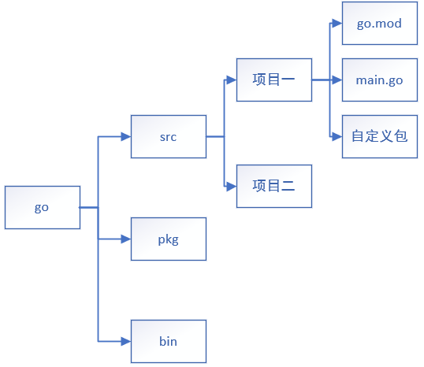
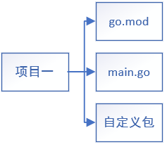

## GOPATH目录结构

**一、GOPATH目录基本结构**

​		◼源码存放在src里

​		◼src下一级目录为项目

​		◼项目间不能相互导入包

​		◼项目内**要有个go.mod文件**用于包的指引（有这个文件才能调用项目内的包）

​		◼项目内的main文件为主要文件，可编译成二进制文件且只能放在项目目录的下一级目录

​		◼**一个自定义包内只能有一个go文件**

**二、非GOPATH内部的目录文件结构**

​		◼可以在非GOPATH目录下运行

