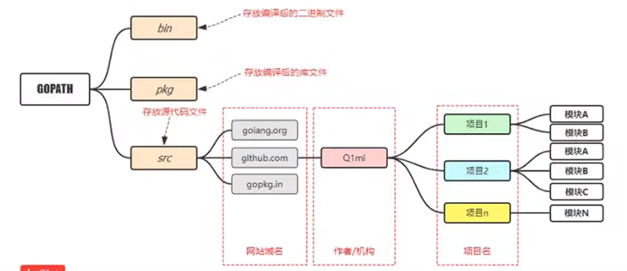
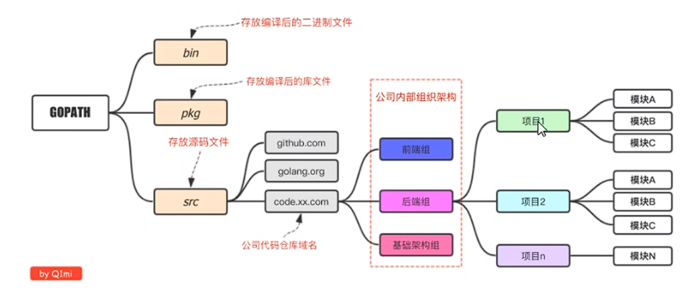
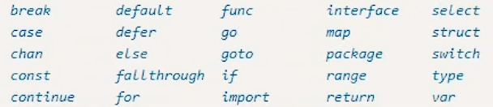
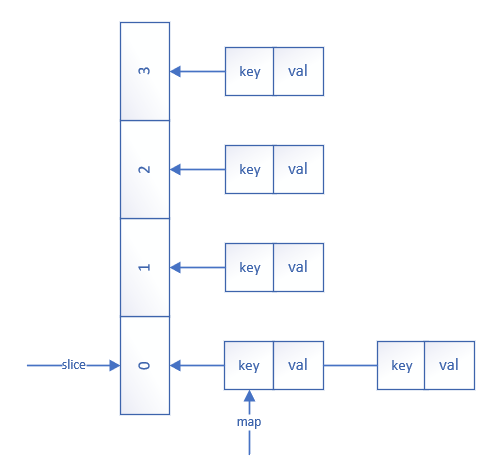
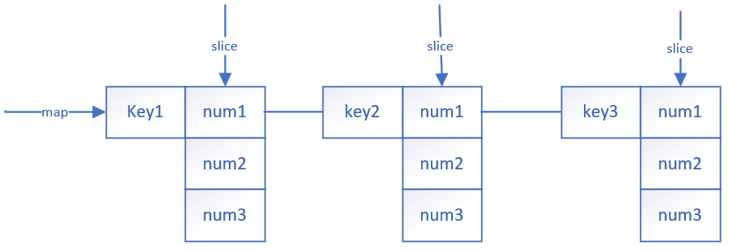
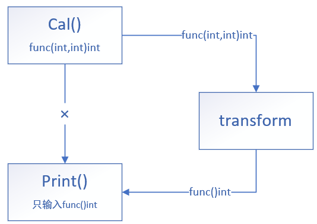
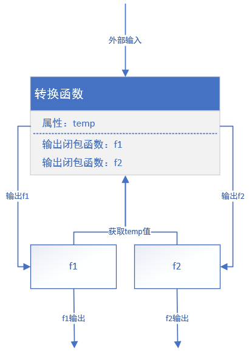

# GoLang基础

## GoLang在linux的安装与环境配置

**一、官网下载软件包**

​		[中国GoLang官网](https://golang.google.cn/)
**二、解压包**
​		◼将包解压到 /usr/local 目录上并该名为go

```shell
sudo tar -zxvf  go压缩包 -c  /usr/local
```

**三、创建工作目录**
​		◼在 /home 目录下创建go目录

```shell
sudo mkdir /home/go
```


​		◼在go目录下创建src、bin、pkg三个目录

```shell
cd /home/go;mkdir src bin pkg
```

**四、环境配置**
​		◼Vi编辑器打开 /etc/profile文件

```shell
sudo vi /etc/profile
```


​		◼导入GOROOT路径（go开发工具包）

```shell
export GOROOT=/usr/local/go
```


​		◼导入GOPATH路径（go工作目录）

```shell
export GOPATH=/home/go
```


​		◼导入bin目录

```shell
export PATH=$PATH:$GOROOT/bin:$GOPATH/bin
```


​		◼导入代理

```shell
export GOPROXY=https://proxy.golang.com.cn,direct
```

​		◼刷新环境变量

```shell
source /etc/profile
```

## GoLang工作项目目录结构

**个人开发者目录结构**



**企业级开发目录结构**



## 编写Go语言程序

**一、在GOPATH目录编写**
		◼在src目录内编写程序
**二、使用go.mod在任意位置编写**
		◼在某一目录下创建项目目录
		◼在项目目录内生成go.mod

```shell
go mod init 目录名
```

​		◼在目录内编写Go程序
**三、Go程序的package声明**
​		◼main：可编译成二进制的包（应用程序入口包）

​		`package main`

​		◼go文件名：依赖包（用于给其他程序调用的包）

​		`package go文件名`

**四、Go可执行程序的基本结构**

```go
package main
import "fmt"
func main(){
	fmt.println("hello world")
}
```


# 变量、常量及其类型

## 标识符与关键字

**一、标识符**
	◼变量名、常量名、函数名
	◼标识符有字母、数字、_组成
	◼只能以 _ 或字母开头
**二、关键字**



## 变量的声明

**一、一般声明方式**
格式：var 变量名 变量类型
		`var num int`
**二、批量声明**
格式：var ( num int )

```go
var (
	num int
	name  string
)
```

**三、声明变量并赋值**

​	◼一般声明赋值

​	`var name string ="name"`

​	◼批量声明赋值<font color=red>（声明全局变量推荐使用）</font>

```go
var(
	name string ="字符串"
	num int =12
)
```

​	◼类型推导声明赋值：通过赋值获取类型<font color=red>（推荐）</font>

​	`var str ="字符串"`

​	◼短变量声明赋值：通过赋值获取类型，<font color=green>只能在函数内</font>使用<font color=red>（推荐）</font>

​	`var str := "字符串"`

**四、声明位置**
		◼函数体外：全局变量<font color=red>（少用）</font>
		◼函数体内：局部变量

**五、变量命名的方式**

​		◼下划线形式：下划线隔开

​		`var student_name`

​		◼驼峰形式：第一个单词首字母小写，后一个单词单词首字母大写

​		`var studentName`

​		<font color=red>（Go语言推荐形式）</font>

​		◼大驼峰形式：所有字母首字母大写

​		`var StudentName`

**六、匿名变量**

​		◼匿名变量不占用命名空间，不会分配内存

​		◼多重赋值时想要忽略某个值可以用匿名变量

​		◼匿名变量的表示：<code>_</code>		<font color=red>（"\_"一般表示为占位符）</font>

​		`x,_ :=foo()`

**常见报错**
		◼GoLang要求定义的局部变量一定要使用否则不能运行（全局变量可以不使用）

## 常量

**一、常量作用**

​		◼恒定不变的量

**二、常量的声明**

​		◼一般声明：const 变量名 =值

​		`const e =2.71`

​		◼批量声明：const ( 变量名 =值  变量名 =值)

```go
const(
	pl =3.14
	e =2.71
)
```

​		◼特别的声明<font color=red>（n2的值和类型和n1相同）</font>

```
const(
	n1 =10
	n2
)
```

**三、ioda常量计数器**

​		◼只能在常量表达式中使用

​		◼const关键字出现时重置为0

​		◼每新增一行常量声明<code>ioda</code>计数+1

​		◼用于定义并枚举赋值

```go
const(
	n1 = iota
	n2
	n3
)
```

​		<font color=blue>输出的n1为0，n2为1，n3为2</font>

**四、iota特殊用法**

​		◼使用<code>_</code>跳过某些值

```go
const(
	n1=iota
	_
	n2
)
```

​			<font color=blue>输出的n1为0，n2为2</font>	

​		◼iota声明变量过程中有其他变量插队插队

```go
const(
	n1=iota
    n2=100
    n3=iota		//要写iota，否则n3=100
)
```

​			<font color=blue>输出的n1为0，n2为100，n3为2</font>

​		◼多个常量在一行

```go
const(
	n1,n2 = iota,iota	//n1,n2在同一行
    n3 = iota
)
```

​			<font color=blue>输出的n1为0，n2为0，n3为1</font>			

​		◼定义数量级

```go
const(
	_ = iota
    KB = 1 << (10 * iota)	//1为二进制中的1
    MB = 1 << (10 * iota)	//二进制左移
    GB = 1 << (10 * iota) 
)
```

​			<font color=blue>输出的KB=1024B，n2=1024KB，n3=1024MB</font>	
$$
输出1KB=2^{10}B，1MB=2^{20}B，1GB=2^{30}B
$$

## 基本数据类型

### 整型

**一、整形的分类**

| 有符号整型 | 描述           | 无符号整型 | 描述           |
| ---------- | -------------- | ---------- | -------------- |
| int8       | 有符号8位整型  | uint8      | 无符号8位整型  |
| int16      | 有符号16位整型 | uint16     | 无符号16位整型 |
| int32      | 有符号32位整型 | uint32     | 无符号32位整型 |
| int64      | 有符号64位整型 | uint64     | 无符号64位整型 |

**二、特殊整型**

| 类型    | 32位操作系统             | 64位操作系统             |
| ------- | ------------------------ | ------------------------ |
| uint    | 32位操作系统是uint32     | 64位操作系统是uint64     |
| int     | 32位操作系统是int32      | 64位操作系统是int64      |
| uintptr | 无符号整型，用于存放指针 | 无符号整型，用于存放指针 |

**三、二进制、八进制、十六进制**

```go
//定义
var n1 int =0b11	//二进制	3
var n2 int =077		//八进制	63
var n3 int =0xff	//十六进制	255
//输出
fmt.Printf("%b",n1)	//打印二进制数
fmt.Printf("%o",n2)	//打印八进制数
fmt.Printf("%x",n3)	//打印十六进制数
```

**四、浮点型**

| 类型    | 描述       |
| ------- | ---------- |
| float32 | 32位浮点数 |
| float64 | 64位浮点数 |

```go
//定义浮点数
var n1 float32 =1.234	//32位浮点数
var n2 float64 =1.234	//64位浮点数
n3 := 1.234				//默认64位浮点数
```

​		<font color=blue>float32类型不能直接赋值给float64类型，需要类型转换</font>

**五、布尔类型**

​		◼布尔类型只有两个值（true、false）

​		◼布尔类型变量默认值为false

​		◼Go语言中不能将整型转换为布尔型

​		◼布尔类型无法参与数值运算，无法转换成其他类型

## 字符串

**一、字符串**

​		◼字符串使用双引号包裹<font color=blue>（字符用单引号包裹）</font>

​		◼Go字符串使用的字符集是UTF-8

​		◼字符串不能直接修改

```go
var str string ="字符串"	//字符串的定义
str := "字符串"			//字符串的定义
c :='A'					  //字符的定义
```

**二、字符串转义符**

​		◼\r：回车符（输入回车）

​		◼\n：换行

​		◼\t：制表符

​		◼\\'：输出单引号

​		◼\\"：输出双引号

​		◼\\\\：输出反斜杠

```go
path :="//home//keqing"		//路径
fmt.Println(path)			//打印路径
```

**三、多行字符串**

​		◼使用反引号包裹

```go
str :=	`
			第一行
			第二行
	   	`
```

**四、字符串常用操作**

| 方法                                | 描述                   |
| ----------------------------------- | ---------------------- |
| len(str)                            | 获取字符串长度         |
| +或者fmt.Sprintf                    | 拼接字符串             |
| strings.Split()                     | 分割字符串             |
| strings.contains                    | 判断是否包含           |
| strings.HasPrefix,strings.HasSuffix | 前后缀判断             |
| strings.Index(),strings.LastIndex() | 子串出现的位置         |
| strings.Join(str,位置)              | 列表里字符串的拼接操作 |
| strings.TrimSpace(str)              | 去掉首尾空格           |

```go
len(str1)									//获取字符串长度
str3 := str1 + str2							//直接拼接字符串
str3 :=fmt.Sprintf("%s%s",str1,str2)		//形式化拼接字符串
List :=strings.Split(path,"/")				//以“/”为分隔符进行分割然后输出列表
Bool :=strings.Contains(path,"home")		//判断path是否包含"home"并返回bool值
Bool :=strings.HasPrefix(path,"/home")		//判断前缀是否为"/home",并返回布尔值
Bool :=strings.HasSuffix(path,"keqing")		//判断后缀是否为"keqing",并返回布尔值
index :=strings.Index(path,"keqing")		//返回"keqing"的首字母所在位置（int）
index :=strings.LastIndex(path,"keqing")	//返回最后出现"keqing"的首字母所在位置
str :=strings.Join(List,"?")				//各个字符串之间用"?"进行连接并返回字符串
```

**五、Go语言的字符类型**

​		◼uint8类型：或叫byte类型，代表ASCII码的一个字符

​		◼uint32：或叫rune类型代表一个UTF-8字符<font color=blue>（默认）</font>

**六、Go语言字符类型的转换和字符串类型的转换**

```go
ch1 :='A'					//定义了一个UTF-8 的字符
str1 :="hello"				//定义了一个字符串

ch2 :=byte(ch1)				//UTF-8字符类型转换为ASCII类型
ch3 :=rune(ch2)				//ASCII字符类型转换为UTF-8类型

List1 :=[]byte(str1)		//通过切片将字符串的每个元素分割出来形成列表（ASCII类型）
List2 :=[]rune(str1)		//通过切片将字符串的每个元素分割出来形成列表（UTF-8类型）

List1[0]='H'				//对列表里的字符进行修改

str2 :=string(List1)		//将字符列表转为字符串	
```

# if判断

## if-else分支结构

​		◼else必须紧跟if的函数体，不能换行

```go
if (表达式1){
    分支1
}else if (表达式2){
    分支2
}else{
    分支3
}
```

# 循环结构（Go语言无while循环）

**一、基本for循环语句**

​		◼不能用()将初始、条件、变化语句括起来

```go
#基本格式
for 初始语句;条件语句;变化语句{
    循环体执行语句
}
#案例
for i:=0;i<10;i++{
    fmt.Println("i")
}
```

**二、无限循环**

​		◼<font color=red>一个无限循环会占用计算机全部CPU资源</font>

```go
for {
    循环体
}
```

**三、for-range（键值循环）**

​		◼for-range循环用于遍历数组、切片、字符串以及通道

​		◼数组、切片、字符串返回索引

​		◼map返回键和值

​		◼通道只返回通道内的值

```go
#字符串
str :="hello world"							//字母索引一个计数，汉字索引3个计数
for i,v :=range str{						//容易漏:=,不需要索引可以用'_'代替
    fmt.Printf("index=%d char=%c",i,v)		//Println默认不会输出字符，只会输出编码
}											//需要两个变量i和v，一个表示索引一个表示值
```

**四、跳出循环**

​		◼break：跳出循环

​		◼continue：跳过本次循环，继续下一个循环

# switch-case

**一、普通分支**

```go
num :=3
switch num{
    case 1:
    	fmt.Println("1")		//不需要break
    case 2:
    	fmt.Println("2")
    case 3:
    	fmt.Println("3")
    default:
    	fmt.Println("other")
}
```

**二、多值分支**

```go
num :=3
switch num{
    case 1,2:
    	fmt.Println("1")
    case 3,4:
    	fmt.Println("2")
    default:
    	fmt.Println("other")
}
```

**三、使用表达式的分支**

```go
age :=12
switch {	//不需要放age
    case age>0 && age <10:
    	fmt.Println("儿童")
    case age >=10 && age<18:
    	fmt.Println("青年")
    default:
    	fmt.Println("other")
}
```

# 运算符

**一、算术运算符**

| 运算符 | 描述 |
| ------ | ---- |
| +      | 加   |
| -      | 减   |
| *      | 乘   |
| /      | 除   |
| %      | 求余 |

**二、关系运算符**

| 运算符 | 描述     |
| ------ | -------- |
| ==     | 等于     |
| ！=    | 不等于   |
| >      | 大于     |
| >=     | 大于等于 |
| <      | 小于     |
| <=     | 小于等于 |

**三、逻辑运算符**

| 运算符 | 描述   |
| ------ | ------ |
| &&     | 逻辑与 |
| \|\|   | 逻辑或 |
| ！     | 逻辑非 |

**四、位运算符**

| 运算符 | 描述               |
| ------ | ------------------ |
| &      | 与运算             |
| \|     | 或运算             |
| ^      | 异或运算           |
| <<     | 左移（乘2的n次方） |
| >>     | 右移（除2的n次方） |

**五、赋值运算符**

| 运算符 | 描述         |
| ------ | ------------ |
| =      | 简单赋值     |
| +=     | 相加然后赋值 |
| -=     | 相减然后赋值 |
| *=     | 相乘然后赋值 |
| /=     | 相除然后赋值 |
| %=     | 求余然后赋值 |

# 数组

**一、数组的定义**

​		◼基本格式：var 数组名 [个数]类型

​		◼数组的类型：变量的类型+数组的长度

```go
var arr [5]int
```

**二、数组的初始化**

​		◼方式一：arr :=[个数]类型{元素1,元素2}

​		◼方式二：arr :=[...]类型{元素1,元素2}

​		◼方式三：arr :=[个数]类型{索引:元素1,索引:元素2}

```go
//方式一：一般数组初始化
arr :=[3]int{1,2,3}
//方式二：自动写入数组长度
arr :=[...]int{1,2,3}
//方式三：索引初始化
arr :=[3]int{0:1,2:3}			//初始化第一个元素为0，第三个元素为3
arr :=[3]int{1,2}				//部分初始化，索引初始化的默认情况
```

**三、数组的遍历**

```go
arr :=[...]int{1,2,3,4,5}
//一般遍历
for i:=0;i<len(arr);i++ {
    fmt.Println(arr[i])
}
//for-range遍历法
for i,val:=range arr{
    fmt.Printf("index:%d val=%d\n",i,val)
}
```

**四、多维数组的定义**

```go
arr:=[3][2]int{			//三行两列
    [2]int{1,2},		//[ ]里面表示每行元素个数（多少列）
    [2]int{3,4},
    [2]int{5,6},
}

arr:=[3][2]int{			//三行两列
    [...]int{1,2},		//方框内可以用...省略
    [...]int{3,4},		//矩阵要符合定义的3行两列
    [...]int{5,6},
}
```

**五、多维数组的遍历**

```go
for _,val1 :=range arr{			//第一个for-range获取行
    for _,val2 :=range val1{	//第二个for-range获取每行数组里的元素
        fmt.Println(val2)
    }
}
```

**六、数组的值类型体现**

​		◼值类型：赋值后，数据独立存在，不随被引用的变量而变化

​		◼引用类型：数据为引用的值，会碎被引用变量的变化二变化

```go
arr1 :=[...]int{1,2,3}
arr2 :=arr1
arr2[0]=10
fmt.Println(arr1)		//[1 2 3]
fmt.Println(arr2)		//[10 2 3]
```

# 切片(slice)

**一、切片的定义**

​		◼具有相同类型元素的可变长度序列

​		◼内部结构包含``地址``、``长度``和``容量``

```go
//切片的定义,定义后切片内部没有任何值
var s =[]int{}		//定义了一个整型切片，和数组不同在于没有固定的元素数量（方框不用填）
s :=[]int{}
//切片的初始化
var s =[]int{1,2,3}	//和数组类似
s :=[]int{1,2,3}
//判断切片是否为空
s == nil		//nil相当于空，相当于没有开辟内存空间
				//s为空时返回true,s有值时返回false
```

**二、切片的长度和容量**

​		◼len()：获取切片的长度

​		◼cap()：获取切片的容量

```go
len(s)		//获取切片的长度
cap(s)		//获取切片的容量
//切容量的定义：底层数组从切片的第一个到最后的元素数量
//容量表示切片可能的最大的元素数量（切片可向后扩容）
arr :=[...]int{1,2,3,4,5,6,7,8,9}
s1 :=arr[2:4]		//len=2 cap=7
s2 :=arr[:4]		//len=4 cap=9
s3 :=arr[3:]		//len=6 cap=6
s4 :=arr[:]			//len=9 cap=9
//len的计算：切片的元素个数
//cap的计算：cap=数组元素的个数-切片截取开始的位置
//		或	cap=数组最后一个元素的位置-切片截取开始的位置+1
```

**三、从数组获取切片**

```go
arr :=[...]int{1,2,3,4,5}
s1 :=arr[1,3]				//截取区间为[1,3)的元素
s2 :=arr[:3]				//截取区间[0:3)的元素
s3 :=arr[3:]				//截取位置3以其后面的所有元素
s4 :=arr[:]					//将整个数组作为切片
```

**四、切片的切片**

```go
s1 :=arr[2:7]	//len=5 cap=7
s2 :=s1[2:4]	//len=2 cap=5
//切片的切片的容量计算：s1的容量-s2开始的位置
//s1,s2引用的底层数组相同，本质还是从数组里切片
//只是切片里获得切片开始位置是相对于切片的位置
```

**五、切片为引用类型的表现**

​		◼切片的值为引用类型，切片本身没有独立的物理空间

​		◼原数组的值改变，切片的值也会改变

​		◼切片可以改变数组元素的值

```go
arr :=[...]int{1,2,3,4,5}	// ...表示数组，没有则表示切片
s1 :=arr[:4]
fmt.Println(s1)				//[1,2,3,4]
arr[0]=10		
fmt.Println(s1)				//[10,2,3,4]
s1[0]=1
fmt.Println(s1)				//[1,2,3,4]
```

**六、make函数构造切片**

​		◼格式：make([]type,size,cap)

```int
//方式一
s1 :=make([]int,5,10)		//构造一个长度为5，容量为10的切片
							//[]int：表示构造一个切片，为构造数组的后半部分
//方式二
s2= :=make([]int,5)			//构造一个长度为5，容量为5的切片
							//输入的参数只有两个，则默认长度等于容量
```

**七、切片的本质**

​		◼切片引用的物理空间是连续的内存空间，不能存储不同类型的值

​		◼真正的数据存储在被引用的内存空间

**八、切片与nil**

​		◼切片属于引用类型，不能在切片之间比较

​		◼切片可以和nil比较

​		◼一个nil值的切片没有底层数组，即**nil切片的长度和容量都为0**

​		◼**nil切片的本质是没有开辟内存空间**，长度和容量都为0不一定是nil切片

```go
//有=表示开辟内存空间
var s1 []int		//没有开辟内存空间
s2 :=[]int{}		//开辟了内存空间
s3 :=make([]int;0)	//开辟了内存空间
//判断切片是否为空使用len()函数
//判断切片是否分配内存空间使用nil参数
```

**九、切片的遍历**

```go
//标准for循环遍历
for i := 0;i<len(s);i++{
    fmt.Println(s[i])
}
//for-range循环遍历
for i,v :=range s{
    fmt.Printf("index=%d val=%d",i,v)
}
```

# append和copy

**一、使用append()函数给切片追加元素**

​		◼格式：新切片=append(旧切片,值)

​		◼增加切片的长度，容量不够时自动扩容

```go
//一般的切片追加
s1 :=[]int{1,2,3}
s1 =append(s1,4)		//append()函数返回新的切片，底层数组和原来的切片不同
//追加后的物理地址变化
s1 :=[]int{1,2,3}		//s1为3		
s2 :=append(s1,4)		//s2为6
fmt.Println(s1)			//[1 2 3]，若不是s1接收追加后的切片，则原切片的物理存储保留
fmt.Println(s2)			//[1 2 3 4]
//切片追加多个元素
s1 :=[]int{1,2,3}
s1 =append(s1,3,4)
//切片追加切片里的元素
s1 :=[]int{1,2,3}
s2 :=[]int{4,5}
a1 =append(s1,s2...)	//...表示提取s2的元素
```

**二、切片的扩容策略**

​		◼如果新申请容量大于2倍旧容量，则最终容量为新申请的容量
​		◼原切片容量如果小于1024，则新的切片容量为原来的两倍-- newcap=2oldcap
​		◼原切片容量如果大于1024，则新的切片容量增加原来的1/4-- newcap=5/4oldcap

​		◼如果最终容量计算溢出，则最终容量计算新申请容量

**三、copy()函数**

​		◼格式：copy(目的切片,原切片)

​		◼**要求目的切片有引用的内存空间**

​		◼根据目的切片的长度复制原切片的元素

​		◼如果目的切片要完全复制原切片长度，则要求目的切片长度大于或等于原切片长度

​		◼复制后目的切片引用的内存空间和原切片引用的内存空间不同

```go
s1 :=[]int{1,2,3}
//目的切片的长度小于原切片的长度
s2 :=make([]int,2)
fmt.Println(s2)		//[1 2]
//目的切片的长度大于或等于原切片的长度
s2 :=make([]int,len(s1))
fmt.Println(s2)		//[1 2 3]
//目的切片和原切片的内存空间不同
s2 :=make([]int,len(s1))
s1[0]=10
fmt.Println(s1)		//[10 2 3]
fmt.Println(s2)		//[1 2 3]
```

**四、使用append()函数实现输出元素**

​		◼通过索引定位，使用append()方法实现删除操作

```go
s1 :=[]int{1,2,3,4,5,6,7,8,9}	//切片的顺序是对应着底层数组的顺序
//删除4，对应索引为3			   //实质上修改了底层的数组,索引及索引后面的元素被后一位元素覆盖
s1 =append(s1[:3],s1[4:]...)	//底层修改后为[1 2 3 5 6 7 8 9 9]，容量不变，长度-1
fmt.Println(s1)					//s1输出为[1 2 3 5 6 7 8 9]
```

# 指针

**一、Go语言的指针**

​		◼Go语言不存在指针操作

​		◼针对地址的两个符号：1、取地址`&`	2、读地址`*`

​		◼指针为存储地址的变量

**二、指针的取值**

​		◼使用`&`获取地址，使用`*`取地址对应的值

```go
n :=10
p :=&n				//获取p的地址
fmt.Println(p)		//默认打印地址为十六进制
fmt.Println(*p)		//通过地址取值
```

**三、new()函数构造指针**

​		◼用于申请内存空间并返回地址

​		◼格式：var p =new(值的类型)

```go
var p=new(int)		//申请内存获取地址
*p=10				//赋值，int默认为0
fmt.Println(*p)
```

**四、make构造指针**

​		◼只用于切片、字典、通道的内存创建

​		◼用于构造**引用类型**指针

```go
//构造字典
var b map[string]int		//声明键为string、值为int的字典
b =make(map[string]int,10)	//申请10个元素的字典内存空间
b["age"]=10					//放入一个键值对
fmt.Println(b)
//构造切片
s :=make([]int,4,10)		//构造长度为4，容量为10的切片
```

**五、new和make的区别**

​		◼make和new都用于申请内存

​		◼new用于给基本数据类型申请内存，并返回内存地址

​		◼make给`slice`、`map`、`channel`申请内存，返回对应类型本身

# map

**一、map的定义**

​		◼Go语言的映射容器，内部使用散列表实现

​		◼map是一种无序的基于key-value的数据结构

​		◼map是引用类型，必须初始化才能使用

​		◼map定义格式：`map[keyType]valueType`

```88go
//map的声明
var m1 map[string]int
```

**二、map的赋值**

​		◼要求先初始化才能使用，否则为nil

​		◼使用make()函数进行初始化，会自动扩容

```go
//初始化
var m1 map[string]int				//声明m1
m1=make(map[string]int,10)			//初始化map表，容量为10
//赋值
m1["first"]=1
//取值
fmt.Println(m1["first"])
//判断键对应的值是否为空
val, Bool :=m1["键名"]					   //true表示输入的键有值
fmt.Printf("val=%d bool=%v\n",val,Bool)		//false表示输入的键没有对应值，val输出类型0值
```

**三、map的遍历**

 ```go
 //for-range遍历
 for key,val :=range m1{
     fmt.Printf("key=%s val=%d\n",key,val)
 }
 //for-range只遍历键
 for key:=range m1{					//不需要匿名变量
     fmt.Printf("key=%s\n",key)
 }
 //for-range只遍历值
 for _,val :=range m1{				//需要匿名变量
     fmt.Printf("val=%d",val)
 }
 ```

**四、删除map的键值对**

​		◼用于删除map的键值对

​		◼键不存在时不执行操作也不返回值

```go
delete(map,key)
```

**五、map的按key排序的实现**

​		◼map的底层是散列表，输出顺序只和插入顺序相等，不能对key进行排序

​		◼使用切片对key进行排序然后输出

```
//创建切片
keys :=make([]string,0)				//使用append()函数会自动扩容
//for-range循环获取map所有key
for key :=range m1{
	keys=append(keys,key)
}
//切片进行排序
sort.strings(keys)
//按key的顺序输出值
for _,key :range keys{
	fmt.Printf("key=%s val=%d\n",key,m1[key])
}
```

**六、map和slice的组合一**

​		◼一个切片元素的类型为map

​		◼初始化一个切片，其元素类型为map

​		◼初始化次数有两次，一个针对`slice`一个针对`map`

​		◼最好预估容量，扩容需要重新申请存储空间



```go
//初始化一个切片
s1 :=make([]map[string]int,0,10)			//初始化一个长度为0，容量为10的slice
//向切片添加一个map类型元素
s1=append(s1,make(map[string]int,1))		//初始化一个容量为1的map变量并追加到slice里
//给切片里的map赋值
s1[0]["age"]=18								//赋值
//打印切片
fmt.Println(s1)
```

**七、map和slice的组合二**

​		◼一个map元素的类型为切片

```go
m1 :=make(map[string][]int,5)			//初始化一个容量为5的map
m1["num1"]=[]int{1,2,3,4}				//初始化并给切片赋值
m1["num2"]=[]int{5,6,7,8}				//初始化并给切片赋值
fmt.Println(m1)
```



# 函数

**一、函数的形参和实参**

* 形式参数：有类型但不具有实际值的参数，常用于声明函数引用的参数
* 实体参数：有类型且有值的参数，调用函数时根据实际情况输入参数

**二、函数体的定义**

​		◼使用func关键字声明函数

​		◼定义输入变量，先写变量名后写变量类型

​		◼函数内部不能定义一个有命名函数，但可以定义匿名函数

```go
//定义无返回值函数
func sum(x int,y int){	
    x+y					
}
//定义有返回值函数
func sum(x int,y int) int {			//第三个int表示返回值的类型为int
    return x+y						//返回值
}
//定义多个返回值函数
func sum(x int,y int)(int int){		//括号的两个int表示返回多个int数据
    return x+y,x*y					//返回值
}
//可变长参数函数
func sum(x ...int){					//可以输入多个参数
    fmt.Println(x)					//x本质为一个切片，类型为...后面的int
}
//确定返回值变量的函数
func sum(x int,y int)(result int){	//直接定义了返回值变量，多用于含defer语句的函数
    result=x+y						
    return							//可以不写变量默认返回result，如果写则会给result赋值
}
```

# defer关键字

**一、deffer关键字的作用**

​		◼将语句放到最后执行

​		◼实现`栈`的后进先出的结构

​		◼**defer后面的语句必须为函数方法**，可以用匿名函数，不能是计算公式

**二、defer的使用**

​		◼多用于释放资源

```go
//延迟执行
fmt.Println("1")
defer fmt.Println("2")
fmt.Println("3")					//132
//实现按后进先出顺序执行
defer fmt.Println("1")
defer fmt.Println("2")
defer fmt.Println("3")				//321
```

**三、defer与函数return的操作顺序**

​		◼go语言return操作分两个步骤：①返回值赋值②返回返回值

​		◼含有defer关键字语句时的执行顺序：1、返回值赋值 2、执行defer语句 3、返回返回值

```go
//没有定义返回值变量
func text(x int) int {			//没有定义返回值的变量则内部会自动定义一个返回值变量
    x=5							//初始化x
    defer func(){
    	defer x++				//2、x++		x的计算结果没被用于给函数返回值赋值
    }()
    return x					//1、给返回值赋值 返回值=x=5
}								//3、函数返回返回值为5
//定义了返回值变量
func text()(result int){		//定义了返回变量
    result=5					//给返回变量赋值
    defer func(){		
    	result++				//2、执行defer语句，由于result本身就是返回值，所以result+1
    }()
    return						//1、给返回值赋值为5
}								//函数返回返回值result为6
//定义返回值变量，用其他变量给返回值赋值(和没有定义返回值变量一样)
func text(x int) (result int) {	//没有定义返回值的变量则内部会自动定义一个返回值变量
    x=5							//初始化x
    defer func(){
    	defer x++				//2、x++		x的计算结果没被用于给函数返回值赋值
    }()
    return x					//1、给返回值赋值 result=x=5
}								//3、函数返回返回值result为5
```

**四、defer的赋值问题和执行问题**

​		◼defer语句块里的变量会按函数的位置赋值，不会到最后才赋值

​		◼defer语句块里有递归时先执行递归函数，执行完后再入栈留到最后执行

​		◼执行顺序：先赋值，执行完递归函数

```go
func cal(x int,y int)int{
    fmt.Printf("x=%d y=%d\n",x,y)
    return x+y
}

func main(){
    x:=1
    y:=2
    defer fmt.Println(cal(x,cal(x,y)))		//赋值后为cal(1,cal(1,2))
    x =2
    defer fmt.Println(cal(x,cal(x,y)))		//赋值后为cal(2,cal(2,2))
}		
//执行顺序：
//	1、赋值 
//	2、执行完cal(x,cal(x,y))这些函数后入栈，等到最后执行最后一步
//	3、等到最后按照"后近先出"的顺序出栈执行defer语句
```

# 作用域

**一、全局变量**

​		◼在函数外使用var关键字定义的变量

**二、局部变量**

​		◼在函数内部定义的变量

​		◼函数内部定义的变量只能在该函数内部使用

**三、语句块作用域**

​		◼if函数和for函数里定义的变量只能用于for循环和if判断内部

```go
for i:=0;i<10;i++{
    fmt.Println(i)		//i定义了
}
fmt.Println(i)			//error，i无定义
```

# 函数类型与变量

**一、定义函数类型**

​		◼函数类型的组成：①输入变量类型②输入变量个数③输出变量类型④输出变量个数

​		◼函数本身可以作为一种变量

​		◼函数本身可以作为一个返回变量

```go
//定义一个函数，类型为func(int,int)int
func add(x,y int) int {
    return x+y
}
//定义一个函数，类型为func(int,int)int
func multi(x,y int) int {
    return x*y
}
//定义一个函数，类型为func( func(int,int)int , func(int,int)int ) int
func do(x func(int,int)int ,y func(int int)int) int {
    r1 :=x(1,2)			//只有满足func(int,int)int类型的函数才能传进去
    r2 :=y(1,2)
    return r1+r2
}
//定义一个函数，根据输入的值输出一个函数
func outPut(x int) func(int,int)int{
    if x == 1{
        return add		//返回add函数
    }else{
        return multi	//返回multi函数
    }
}
func main(){
    //函数变量作为输入
    fmt.Println(do(add,multi))
    //函数变量作为输出
    fmt.Println("函数类型为%T,输出值为%d\n",outPut(1),outPut(1)(1,3))
}										//输入选择参数后返回函数，再给函数输入参数返回值
```

# 匿名函数

**一、匿名函数的定义和使用**

​		◼没有命名的函数

​		◼常用于函数内部

​		◼函数的本质是变量，可以用一个变量接受匿名函数

​		◼匿名函数可以引用外部函数的变量

​		◼可以构造一次性函数

```go
//一次性的匿名函数,直接运行不用命名
func main(){
    func (a int){				//定义匿名函数
    	fmt.Println(a)			//匿名函数结构体
	}(100)						//给参数输入值
}
//使用匿名函数定义新的函数
func main(){
    x :=5
    f :=func(x int){			//定义匿名函数
        fmt.Println(x)			//函数结构体，引用了外部函数的变量
    }
    f()							//执行匿名函数并使用了外部函数的变量
}
```

# 闭包

**一、闭包的定义**

​		◼匿名函数与匿名函数所引用外部变量的组合

​		◼闭包函数变量查找顺序：1、外部函数找变量 2、查找内部函数的变量 3、内部函数变量优先级最高

​		◼外部函数的变量相当于内部函数的公共变量，改变了会影响内部函数的赋值

**二、闭包的应用--函数类型的转换**

​		◼使用匿名函数构造一个新的函数实现函数类型的转换

​		◼转换函数的本质是给函数**赋值减少参数**或**定义新的参数实现增加参数**



```go
//定义一个输入参数为 func()int的函数
func Print(f func()int){
    fmt.Println(f())
}
//定义一个多参数，一个返回值的函数
func cal(x int,y int)int{
    return x*y
}
//定义一个转换函数，返回转换后的cal()函数，使其能够输入到Print()函数里
func transform(oldFunc func(int,int)int,x int,y int)(func()int){
    newFunc:=func()int{					//使用匿名函数实现转换
        return oldFunc(x,y)				//构造完匿名函数后，x和y都被赋值了
    }
    return nuwFunc						//返回转换后的函数
}
func main(){
    Print(trasnform(cal,20,30))
}
```

**三、闭包的应用--多个闭包函数共同使用相同的外部函数变量**



```go
func cal(temp int)(func()int,func()int){	//temp相当于f1和f2的公有变量
    f1 :=func()int{
        temp++
        return temp
    }
    f2 :=func()int{
        temp=2*temp
        return temp
    }
    return f1,f2							//返回两个闭包函数
}
func main(){
    f1,f2 :=cal(100)						//temp=100
    fmt.Println(f1())						//temp=101
    fmt.Println(f2())						//temp=202
}
```

# Go语言的内置函数

| 内置函数       | 介绍                                                         |
| -------------- | ------------------------------------------------------------ |
| close          | 关闭channel                                                  |
| len            | 求长度，比如string、array、slice、map、channel               |
| new            | 用于分配内存，用于分配值类型内存，比如int、struct（返回指针） |
| make           | 用于分配内存，用于分配引用类型内存（channel、map、slice）    |
| append         | 用于增加元素到数组、slice中                                  |
| panic和recover | 错误尝试处理（gogcc2.0可能加入异常处理）                     |

**一、panic/recover**

​		◼Go语言Go1.8没有异常机制，只能使用panic/recover处理错误

​		◼`panic`可以在任何地方主动引发错误

​		◼**`recover`只能在`defer`调用的函数中有效**，可以用于尝试修复错误

​		◼遇到panic时程序直接运行defer语句的函数，运行完后程序退出不再执行其他main方法下一个语句

​		◼**defer一定要在可能引发panic语句之前定义**

​		◼引发`panic`时，`recover`能让程序继续运行而不会强制退出程序

 ```go
 func f1(){
     defer func(){
         err :=recover()						//获取panic的"app error"
         fmt.Println(err)
         fmt.Println("cut down con")
     }()
     fmt.Println("create con")
     panic("app error")						//若被recover获取则不会在defer执行完后打印
     fmt.Println("app running")				//panic后面的语句不会执行
 }
 func main(){
     f1()
     fmt.Println("normal leave")				//如果没有recover则不会执行
 }
 ```

# fmt标准库

## fmt打印函数

**一、print**

​		◼直接打印内容

​		`fmt.Print("内容")`

**二、printf**

​		◼格式化打印

​		◼可以使用占位符，用变量替换占位符后打印内容

​		`fmt.Printf("字符串：%s，数字：%d")`

**三、println**

​		◼打印内容后自动换行

​		`fmt.Pringtln("内容")`

**四、printf打印类型**

```go
fmt.Printf("%d",n)		//打印整型数值
fmt.Printf("%a",n)		//打印二进制数
fmt.Printf("%o",n)		//打印八进制数
fmt.Printf("%x",n)		//打印十六进制数
fmt.Printf("%s",n)		//打印字符串
fmt.Printf("%v",n)		//打印任何类型
fmt.Printf("%t",n)		//打印布尔值
fmt.Printf("%T",n)		//打印n的数值类型
fmt.Printf("%U",n)		//打印Unicode格式
fmt.Printf("%d%%",n)	//打印带有%后缀的数值
```

**五、宽度标识符**

| 占位符 | 说明                                        |
| ------ | ------------------------------------------- |
| %f     | 默认宽度，默认精度                          |
| %9f    | 宽度为9，整数+小数点+尾数=9个位置，默认精度 |
| %.2f   | 默认宽度，精度为2                           |
| %9.2f  | 宽度为9，精度为2                            |
| %9.f   | 宽度为9，精度为0                            |
| %03d   | 宽度为3,用0补充                             |

```go
%f		//12.340000
%8f		//12.34000
%.2f	//12.34___	_表示有占位
%9,2f	//____12.34
%9.f	//_______12
%03d	//010
```

## 获取输入

**一、fmt.Scan**

​		◼输入变量地址，接收外部输入并赋值

​		◼如果外部输入与变量类型不匹配则不会赋值

```go
var str string
fmt.Scan(&str)
```

**二、fmt.Scanf**

​		◼输入变量地址，接收外部输入并赋值

​		◼和C语言差不多

```go
fmt.Scanf("%d %s",&str,&num)
```

**三、fmt.Scanln**

​		◼输入变量地址，接收外部输入并赋值

​		◼自动换行

```go
fmt.Scanln("%d %s",&str,&num)
```

## 形式化拼接

**一、Sprint**

​		◼形式化拼接字符串并赋值

```go
str:="num"
num:=10
str =fmt.Sprintf("%s=%d",str,num)
fmt.Println(str)
```

# math/rand包

**一、设置种子**

​		◼使用Seed函数设置种子

​		◼格式：`rand.Seed.(int64)`

​		◼通常取时间戳作为随机种子（纳秒级别）

```go
rand.Seed.(time.Now.UnixNano())
```

**二、获取随机数**

​		◼只能取整数

​		◼无具体范围的随机数：`num64 :=rand.Int()`

​		◼0到具体范围的随机数：`num64 :=rand.Intn()`	（左闭右开）

​		◼负数的获取：`0-num64`

# ...的使用

**一、根据输入参数数量构建等量长度的数组**

* 位置在类型前面
* 用于动态构建数组或切片

```go
arr:=[...]int{1,2,3,4}
```

```go
func do(arr ...int){
    for _,v:=range arr{
        fmt.Println(v)
    }
}
func main(){
    do(1,2,3,4,5,6)
}
```

**二、解开数组，提取每个元素**

* 位置在类型后面
* 后面常配合`...类型`使用

```go
func do(arr ...int){
    for _,v:=range arr{
        fmt.Println(v)
    }
}
func main(){
    arr:=[]int{1,2,3,4,5}
    do(arr...)
}
```

```go
arr2=append(arr2,arr1...)
```


