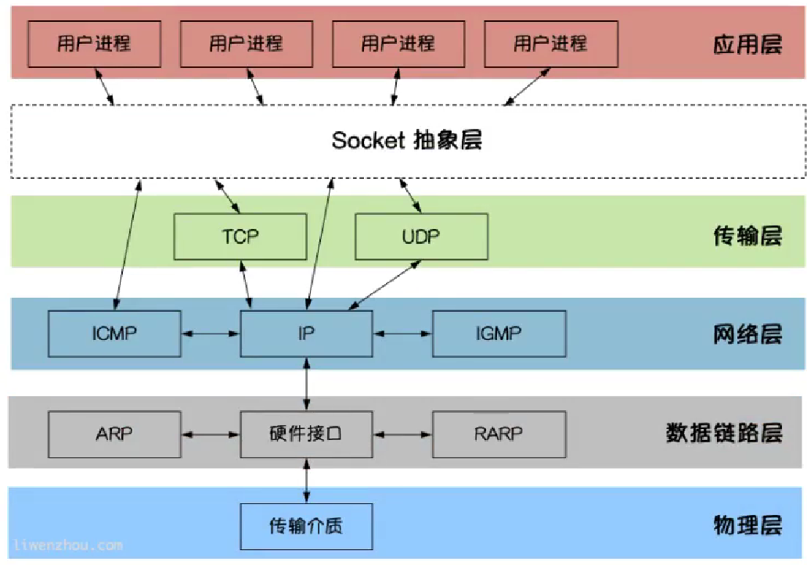
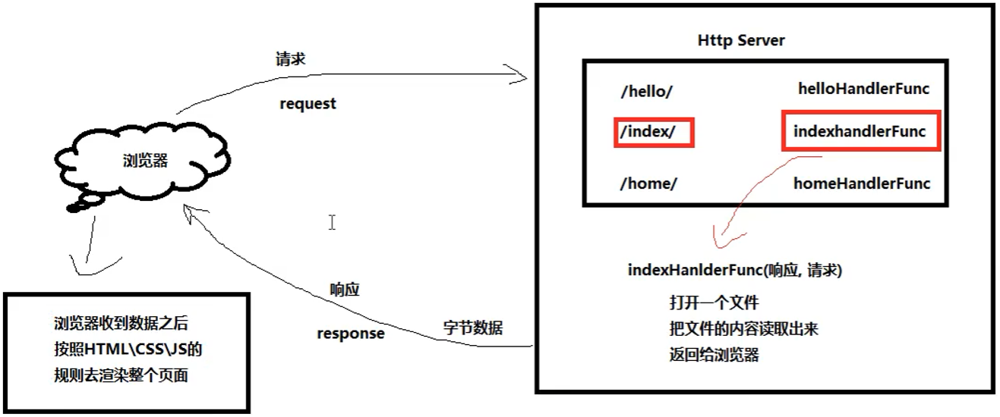

# GoLang网络编程

## 互联网结构

**一、数据链路层**

​		◼解决局域网内部的主机识别

**二、网络层**

​		◼解决广域网上主机的识别

**三、传输层**

​		◼解决主机内某个应用程序与远程主机的某个应用程序的对接（使用网络端口）

**四、应用层**

​		◼接收和发送数据

## socket编程

**一、socket**

​		◼socket被称为套接字，用于描述IP地址和端口

​		◼socket是TCP/IP网络的API，应用程序通过socket向网络发出请求或响应



## TCP通信

**一、TCP服务端**

​		◼一个TCP服务端可以连接多个客户端

​		◼Go语言创建多个`goroutine`实现并发高效处理大量链接

**二、TCP服务端的处理流程**

​		◼监听端口

​		◼接收客户端的请求建立连接

​		◼创建`goroutine`线程处理链接

**三、TCP客户端的处理流程**

​		◼建立与服务端的链接

​		◼进行数据的收发

​		◼关闭链接

## TCP通信的实现

**一、绑定协议、IP和端口**

​		◼使用net包的Listen和Dial函数实现

​		◼Listen()函数为用于服务端绑定IP和端口

​		◼Dial()函数用于客户端向服务端请求

​		◼格式：`listenObj,err :=net.Listen("协议","IP:端口号")`

​		◼格式：`conn,err:=net.Dial("tcp","目标主机IP:端口号")`

```go
//服务端绑定ip和端口
listenObj,err:=net.Listen("tcp","127.0.0.1:7777")
if err !=nil{
    fmt.Println(err)
    return					//绑定失败要退出
}
//客户端发送tcp请求
conn,err:=net.Dial("tcp","127.0.0.1:7777")
if err !=nil{
    fmt.Println(err)
    return					//请求失败退出
}
```

**二、接收请求并建立链接**

​		◼使用listen对象的Accept()函数简历链接

​		◼格式：`conn,err :=listenObj.Accept()`

```go
for{
	conn,err :=listenObj.Accept()
    defer conn.Close()	//链接处理完后关闭
	if err !=nil{
    	fmt.Println(err)
    contine				//链接简历失败退出本次循环
	}    
}
```

**三、数据的接收和发送**

​		◼使用conn对象的Write()方法和Read()方法实现数据的发送和接收

​		◼格式：`conn.Write([]byte)`

​		◼格式：`conn.Read([]byte)`

```go
conn.Write([]byte(str))		//发送字符串
conn.Read([]byte(str))		//接收字符串
```

**四、net包实现TCP服务端与服务端通信**

​		◼根据read()和write()函数返回的`err`进行断开链接

​		◼断开链接退出`for`循环最好使用`return`

​		◼退出`for`循环使用`break`会继续执行`for`循环下面的语句

​		◼退出`for`循环使用`return`直接退出函数

​		◼使用`conn.Close()`断开链接

​		◼TCP链接两端都要关闭链接

```go
//服务端
func do(conn net.Conn){
    defer conn.Close()							//链接最后要关闭
    info:=make([]byte,128)						//初始化信息
    for{
        n,err := conn.Read(info)				//接收信息
        if err!=nil{							//如果不能接收说明链接已经断了
            fmt.Println("break conn")			//直接退出函数调用defer的关闭链接语句
            return
        }
        
        _,errS :=conn.Write([]byte("state:ok"))	//返回提示
        if errS!=nil{
            fmt.Println("break conn")			//服务端断网会报错
            return
        }
        fmt.Println(string(info[:n]))			//通过接收信息的字节数进行打印
    }
}

func main(){
    //服务端绑定协议、IP和端口号
    Listener,errInit :=net.Listen("tcp","127.0.0.1:7777")
    if errInit !=nil{
        fmt.Println(errInit)
        return
    }
    
    for{
    //循环接收请求
        Conn,errApt :=Listener.Accept()
        
        if errApt !=nil{
            fmt.Println(errApt)
            continue							//不能退出循环
        }
        //使用线程处理请求
        go do(Conn)
    }
    
}
```

```go
//客户端
func do(conn net.Conn){
    defer conn.Close()
    
    reader :=bufio.NewReader(os.stdin)			//获取外部输入
    info :=make([]byte,128)						//创建信息接收缓存区
    for{
        content,_:=reader.ReadString('\n')		//以\n作为分割符
        content=strings.TrimSpace(content)		//去掉空格换行符
        
        if connent =="quit"{					//输入quit则退出关闭链接
            fmt.Println("close conn")
            return
        }
        
        _,errS :=conn.Write([]byte(content))	//字符串转为字节切片并发送给服务端
        if errS!=nil{
            fmt.Println("break conn")
            return
        }
        
        n,errR :=conn.Read(info)				//接收服务端的信息
        if errR !=nil{							//服务端宕机时关闭链接
            fmt.Println("break conn")
            return
        }
        fmt.Println(string(info[:n]))			//打印来自服务端的信息
    }
}

func main(){
    //根据协议，IP和端口号请求建立链接
    conn,err:=net.Dial("tcp","127.0.0.1:7777")
    if err!=nil{					//建立失败则退出
        fmt.Println(err)
        return
    }
    
    do(conn)
}
```

**五、TCP黏包问题**

​		1、产生原因

​		◼TCP数据传递模式是流模式，在保持长时间连接时进行多次收发

​		◼黏包问题在客户端和服务端都有可能发生

​		◼Naglr算法是改善网络传输效率的算法，在TCP协议下没提交一段数据并不会立刻发送数据，而是等待一段			时间而是看看这段时间是否有数据要发送，如果有则合并数据包一起发送

​		◼接收端接收不及时造成接收端黏包问题，TCP会把数据存在缓冲区中如果应用层应用不能及时取出会造成缓			存区存了多段数据

​		2、解决办法

​		◼出现黏包是因为不确定传输数据包的大小，所以要对数据包进行封装和拆解的操作

​		◼封装：发送时给数据加上包头（4字节，int32），将数据长度封装在里面

​		◼解包：读取数据的包头获取数据长度，根据长度读取数据

```go
func Encode(data byte[])([]byte,error){
    
    var length=int32(len(message))			//数据长度，字节类型
	var pkg=new(bytes.Buffer)				//创建缓冲区
	//长度写入缓冲区
	err :=binary.Write(pkg,binary.LittleEndian,length)
    if err!=nil{
        return nil,err
    }
	//数据写入缓冲区
	err :=binary.Write(pkg,binary.LittleEndian,data)
    if err!=nil{
        return nil,err
    }
    return pkg.Bytes(),nil
}
//Reader接收了发来的数据
func Decode(reader *bufio.Reader)(string,err){
    //读取前4个字节
    lengthByte,_:=reader.Peek(4)				//读取数据长度
    lengthBuff :=bytes.NewBuffer(lengthByte)	//创建数据长度大小相等的缓冲区
    var length int32
    err :=binary.Read(lengthBuff,binary.LittleEndian,&length)
    if err!=nil{
        return "",err
    }
    //缓冲区的数据小于信息头长度(4字节)则说明没数据了
    if int32(reader.Buffered())<4{
        return "",err
    }
}
```

## UDP协议

**一、UDP协议**

​		◼用户数据报协议

​		◼一种无连接的传输层协议

​		◼不需要建立连接，直接进行数据发送和接收

​		◼属于不可靠的，没有时序的通信，但是实时性好

**二、服务端的处理流程**

​		◼绑定IP和端口

​		◼处理事务

**三、客户端的处理流程**

​		◼绑定服务端的IP和端口

​		◼处理事务

## UDP通信的实现

**一、服务端绑定端口和协议**

​		◼使用`net.ListenUDP()`方法进行绑定IP和端口

​		◼使用`net.IPv4()`方法获取IP的字节形式

​		◼绑定IP和端口时需要用到`net.UDPAddr{}`结构体，初始化并传进结构体地址

​		◼如果conn为空，使用`conn.Close()`会引发错误（conn没有初始化导致）

​		◼如果conn非空，则可以使用`defer conn.Close()`

​		◼`ListenUDP`使用格式：`conn,err:=net.ListenUDP("udp",UDPAddr结构体地址)`

​		◼`IPv4`使用格式：`byte[]:=net.IPv4(a,b,c,d)`

```go
//绑定IP和端口号
conn,err :=net.ListenUDP("udp",&net.UDPAddr{
    IP:		net.IPv4(127.0.0.1),
    Port:	7777,
})
//如果绑定失败则conn为空
if err !=nil{
    fmt.Println(err)
    return
}
//运行最后关闭conn
defer conn.Close()
```

**二、UDP信息的收发**

​		◼使用`ReadFromUDP()`方法进行接收信息

​		◼使用`WriteToUDP()`方法进行发送数据

​		◼`ReadFromUDP()`格式：`n,addr,err:=conn.ReadFromUDP(byte[])`

​		◼`WriteToUDP()`格式：`conn.WriteToUDP([]byte,addr)`

```go
//接收,适用于客户端和服务端
data:=make([]byte,1024)
n,addr,err:=conn.ReadFromUDP(data)
if err !=nil{
    fmt.Println(err)
}
fmt.Println(data[:n])
fmt.Println(addr)
//发送，适用于服务端
_,err:=conn.WriteToUDP([]byte(data),addr)
//发生，适用于客户端
_,err:=conn.Write([]byte)
```

**三、客户端的IP绑定**

​		◼使用`net.DialUDP()`方法进行绑定

​		◼要用到`net.UDPAddr`结构体

​		◼`net.InterfaceAddrs()`可以获取本地IP地址（需要判断是否是回环地址）

​		◼`net.DialUDP()`格式：`socket,err:=net.DialUDP("udp",nil,UDPAddr地址)`

```go
socket,err:=net.DialUDP("udp",nil,&net.UDPAddr{	//与服务端相连
    IP:		net.IPv4(127.0.0.1),				//IP和端口参数为服务端的IP和端口
    Port:	7777,
})
if err!=nil{
    fmt.Println(err)
}
```

**四、net包使用UDP实现客户端与服务端的通信**

```go
//服务端
func do(conn *net.UDPConn){
	data:=make([]byte,1024)				//创建缓存
	n,addr,err:=conn.ReadFromUDP(data)	//接收数据，并获取字节数和地址信息
	if err !=nil{
		fmt.Println(err)
		return
	}
	fmt.Print(addr,":")					//打印地址信息
	fmt.Println(string(data[:n]))		//打印内容
	conn.WriteToUDP([]byte("reply OK"),addr)
}										//回复接收成功

func main(){
    //绑定IP和端口
	conn,err:=net.ListenUDP("udp",&net.UDPAddr{
		IP: net.IPv4(127,0,0,1),
		Port: 7777,
	})
    //绑定失败则退出
	if err !=nil{
		fmt.Println(err)
        return
	}
    //关闭链接
	defer conn.Close()
	//多线程循环处理事务
	for{
		go do(conn)
	}
}
```

```go
//客户端
func do(conn *net.UDPConn) {
	_, err := conn.Write([]byte("Hello world"))	//发送信息
	if err != nil {								//没有网络发送则失败
		fmt.Println("Not Internet")
		return
	}
	data := make([]byte, 1024)					//创建缓存
	n, _, err := conn.ReadFromUDP(data)			//获取信息
	if err != nil {
		fmt.Println("404")						//服务端连不上则返回404
		return
	}
	fmt.Println(string(data[:n]))				//打印获取的信息
}

func main() {
    //绑定服务端的IP和端口
	conn, err := net.DialUDP("udp", nil, &net.UDPAddr{
		IP:   net.IPv4(127, 0, 0, 1),
		Port: 7777,
	})
    //绑定失败则退出
	if err != nil {
		fmt.Println(err)
        return
	}
    //最后关闭连接
	defer conn.Close()
	//处理事务
	do(conn)
}
```

# HTTP协议

**一、HTTP协议**

​		◼`net/http`包提供了HTTP客户端和服务端的实现

​		◼超文本传输协议

​		◼域名的组成：协议://域名/路径

**二、浏览器的作用**

​		◼发送请求获取html文本

​		◼根据html文本的内容进行渲染

​		◼`CSS`:叠层样式表，用于渲染UI

​		◼`JavaScript`：跑在浏览器上的编程语言，用于渲染动作（比如点击按钮后的变化）

## HTTP server端

**一、绑定路径**

​		◼先绑定路径再绑定端口，否则会`404`

​		◼使用`http.HandleFunc()`方法绑定路径和对客户端进行响应

​		◼使用格式：`http.HandleFunc("/路径",响应的方法)`

​		◼响应的方法要求输入参数引入`http.ResponseWriter`和`*http.Request`

​		◼使用`White()`方法发送html文本

**二、绑定IP和端口**

​		◼使用`http.ListenAndServe()`方法绑定IP和端口

```go
http.ListenAndServer("127.0.0.1:8080",nil)
```

```go
//定义处理方法
func helloHandlerFunc(w http.ResponseWriter,r *http.Request){	//引入http包的两个参数
    content,err:=ioutil.ReadFile("./hello.html")		//获取需要发送的html文本
    if err!=nil{
        w.Write([]byte("not content"))
    }
    w.Write(content)									//以字节的形式发送文本
}
func main(){
    http.HandleFunc("/hello",helloHandlerFunc)			//绑定路径和对应的处理方法   
    http.ListenAndServe("127.0.0.1:8080",nil)			//绑定IP和端口
}
```



**三、获取Get请求的参数**

​		◼使用`r.URL.Query()`方法获取参数，返回一个map[string] []string的map字符串切片的Value数据结构

​		◼使用Value的`Get("key")`获取参数

```go
val:=r.URL.Query()
age:=val.Get("age")
```

## HTTP client端

### 请求和响应的参数

​		◼`r.URL`：请求的路径和参数（不包含域名和协议）

​		◼`r.Method`：请求使用的方法（`Get`或`Post`）

​		◼`r.Body`：请求发来的数据

​		◼`resp.Body`：响应发来的数据

### Get请求

**一、简单的Get请求**

​		◼使用`http.Get()`方法直接发送请求

​		◼请求地址要写完整（协议-域名-路径-参数）

​		◼再路径后面写参数

​		◼使用格式：`resp,err:=http.Get(完整的地址)`

```go
//发送一个简单的Get请求
resp,err:=http.Get("http://127.0.0.1:8080/test?name=我&age=18")//`我`不会转为Unicode编码
if err !=nil{
    fmt.Println(err)
}
s,_:=ioutil.ReadAll(resp.Body)			//读取数据
fmt.Println(string(s))					//转为字符串打印
```

**二、自定义的Get请求**

​		◼用`url.ParseRequestURI`方法加载URI

​		◼定义一个`url.Value{}`结构体用于存放参数

​		◼`Encode()`编码参数并加载到URI的`RawQuery`中（将非英文非数字转换成Unicode编码）

​		◼使用`os.Open()`打开文件，使用`bufio.NewReader`创建一个reader对象

​		◼使用`http.NewRequest()`方法并传进需要的数据建立请求

​		◼使用`http.DefaultClient.Do()`发送请求并返回响应，结束时要关闭`resq.Body`io对象释放http连接

```go
//加载URI
URI,_:=url.ParseRequestURI("http://127.0.0.1:8080/test")
//添加参数
data:=url.Values{}
data.Set("name","张三")
data.Set("age",18)
//对参数进行编码并放到URI对象中
URI.RawQuery=data.Encode()
//打开文件，使用bufio创建一个reader对象
fileObj,_os.Open("文件路径")
reader:=bufio.NewReader(fileObj)
//创建一个Get请求，将URI对象和含数据的reader对象放进请求里
req,err :=http.NewRequest("GET",URI.String(),reader)
if err !=nil{
    fmt.Println(err)
    return
}
//发送请求并接收响应
resp,err :=http.DefaultClient.Do(req)
if err !=nil{
    fmt.Println(err)
    return
}
//结束后释放网络IO,但是http连接要过一段时间才能关闭(KeepAliveTimeout)
defer resp.Body.Close()
//读取响应的数据
s,_:=ioutil.ReadAll(resp.Body)
fmt.Pruintln(string(s))
```

### 其他请求

​		◼发送文件：`resp,err:=http.Post("URI","文件类型",bufio对象指针)`

​		◼发送表单：`resp,err:=http.PostForm("URI","文件类型",url.Values结构体)`

```go
resp,err:=http.Post("URI","image/jpeg",&buf)
resp,err:=http.PostForm("URI",url.Values{"key":{"value"}})//url.Values结构体可以提前定义设值
```

### 自定义client

**一、client作用**

​		◼用于发送自定义的请求

​		◼http连接：不会因为io释放了而关闭，会持续一段时间

​		◼长连接：时间会持续到`KeepAliveTimeout`才关闭（默认60s）

​		◼短连接：时间只会持续5s然后关闭

​		◼构造完一个Client后使用`Do()`方法发送请求

**二、请求频繁但持续时间短的处理方式**

​		◼一般共用一个client，声明一个全局的client，使用长连接

​		◼持续时间一般在`KeepAliveTimeout`以内，过了最大存活时间会自动关闭http连接

```go
//分开
var(
    tr=&http.Transport{
        DisableKeepAlives:true,
    }
    Client=http.Client{Transport:tr}
)
//紧凑
var(
    Client=http.Client{
        Transport:&http.Transport{
        	DisableKeepAlives:true,
    	},
    }
)
```

**三、请求不频繁但持续时间长的处理方式和请求频繁持续时间长**

​		◼一般使用短链接

```go
//设置属性
tr :=&http.Transport{
    DisableKeepAlives:true,
}
//构造新的Client,并加载属性
Client:=http.Client{Transport:tr}
//使用自定义的Client发送请求
resp,err:=Client.Do(req)
```

# flag包

**一、获取命令行参数**

​		◼使用`os.Args`方法获取参数

​		◼`os.Args`方法返回字符串切片，第一个元素为程序名

​		◼类型单一

```go
s:=os.Args		//获取程序外部输入
fmt.Println(a)
```

```shell
./程序 参数 参数
```

**二、使用flag包获取多种类型的值**

​		◼`flag`的方法获取外部参数**返回的是地址**

​		◼格式：`参数地址 :=flag.类型("参数名","默认值","提示")`

​		◼`flag`的`Var`方法可以直接获取值而表示地址

​		◼格式：`flag.类型Var(存储地址,"参数名","默认值","提示")`

​		◼使用`Parse()`方法解析外部输入并获取值（**获取值必要的代码**）

```go
name :=flag.String("name","null","input name")
age :=flag.Int("age",-1,"input age")
time :=flag.Duration("ct",time.second,"时间间隔")
var str string
flag.StringVar(&str,"info","null","输入信息")
flag.Parse()									//必须在所有输入参数的后面
fmt.Prantln(*name,*age)							//从地址中取值
```

```shell
./程序 -name=abc -age=11 -ct=12h -info=asdfg
```

**三、其他函数**

| 函数名       | 内容                                                |
| ------------ | --------------------------------------------------- |
| flag.Args()  | 获取外部参数返回切片（没有程序名）                  |
| flag.NArg()  | 获取外部参数的个数                                  |
| flag.NFlag() | 返回外部输入参数中，是命令行参数的个数（-name=xxx） |

# Go操作MySQL数据库

## MySQL驱动的安装与配置

**一、Go内置的相关包情况**

​		◼Go语言中的`database/sql`包提供了保证SQL数据库的**泛用接口**，不提供数据库驱动

​		◼使用`database/sql`包时必须注入一个数据库驱动

**二、下载MySQL数据库驱动**

​		◼使用终端（开发工具在root的区域需要提前在`/root/.bashrc`配置环境）

​		◼下载完后如果开发工具在root区域要给`GOROOT`和`GOPATH`的pkg授权

```shell
//如果go开发工具在root的区域,不在则直接go get且不用授权
sudo go get -u github.com/go-sql-driver/mysql
//授权
sudo su
chmod -R a+rwx $GOPATH/pkg
chmod -R a+rwx $GOROOT/pkg/mod
```

## 与数据库进行连接

**一、GoLang的数据库连接**

​		◼GoLang支持连接池，是并发安全的

​		◼**GoLang构造的数据库连接是数据源**

​		◼`database/sql`库没有具体实现，只是列出了需要第三方库实现的内容

​		◼每个数据库驱动都有个驱动签名在`driver.go`文件里

**二、创建MySQL数据库的连接**

​		◼使用`Open()`方法构造数据源连接，GoLang中返回的**数据库连接默认是连接池**

​		◼使用格式：`conn,err:=sql.Open("数据库驱动签名","数据源连接参数")`(数据源参数又叫数据源名)

​		◼使用`conn.Ping()`方法检测能否进行连接

​		◼**驱动签名**在`driver.go`文件里的`init()`函数找到

​		◼数据源连接参数组成：`用户名:密码@tcp(IP:端口)/数据库名`

​		◼使用`Ping()`尝试与数据库建立连接

​		◼`SetMaxOpenConns()`方法设置数据库连接池最大连接数

​		◼`SetMaxIdleConns()`方法设置最大空闲连接数

```go
//构造连接
dsn:="root:password@tcp(192.168.2.11:3306)/edt_db"	//数据源参数
conn,err:=sql.Open("mysql",dsn)						//构造连接
if err！=nil{
    fmt.Println("failed open db",err)
}
//检测能否连接
err=conn.Ping()										//如果能连接则数据库连接创建完成
if err!=nil{
    fmt.Println(err)
    return
}
//关闭
conn.Close()										//关闭数据源
```

```go
//全局声明数据库连接
var (
	conn *sql.DB		//声明全局的数据源
    err error			//对应声明全局的err
)
func init(){
    dsn:="root:password@tcp(192.168.2.11:3306)/edt_db"	//数据源参数
    conn,err=sql.Open("mysql",dsn)						//创建连接,不能有:否则声明的是局部变量
	if err！=nil{
   		fmt.Println("failed open db",err)
	}
	//检测能否连接
	err=conn.Ping()
	if err!=nil{
   		fmt.Println(err)
    	return
	}
}
```

## 查询

**一、查询前的准备**

​		◼创建数据的结构体

​		◼完成数据库的连接，获取连接对象

​		◼可以用的占位符：`?`

```go
type data struct{
    name	string
    age 	int
}
```

**二、单条查询**

​		◼使用`QueryRow()`方法进行查询

​		◼格式：`connObj.QueryRow("sql语句")`

​		◼使用`Scan()`方法从数据集里获取数据并放到结构体里

​		◼**查询完后一定要使用`Scan()`方法以便将连接放回连接池**

​		◼**取值时要放结构体字段的地址**

```go
func query(){
    var val data							 //声明一条数据
    rst :=conn.QueryRow("SQL语句")			//输入SQL语句获取数据集
    rst.Scan(&val.name,&val.age)			 //将数据结构体字段的地址按SELECT元素的顺序放置
    fmt.Println(val)
}
```

```go
func query(){
    var val data							 		  //声明一条数据
    conn.QueryRow("SQL语句").Scan(&val.name,&val.age)	//简化
    fmt.Println(val)
}
```

**三、多条查询**

​		◼使用`Query()`方法进行多条查询

​		◼查询完后需要调用`Close()`函数进行关闭

​		◼使用`rows.Next()`方法检测是否有还有元组

​		◼使用`Scan()`方法获取元组

```go
var(
    conn *sql.DB
)
func query(){
    var rst []Result						//说明结果集切片
    rows,err:=conn.Query("SELECT Sno,Sname FROM student WHERE CLno=101")
    if err!=nil{							//获取结果集
        fmt.Println(err)
        return
    }
    defer rows.Close()						//使用完后关闭
    
    for rows.Next(){						//for循环检测是否还有元组
        var val Result
        rows.Scan(&val.Sno,&val.Sname)		//存储数据
        rst.Append(rst,val)					//追加到结果集切片
    }
    fmt.Println(rst)
}
```

## 插入、更新、删除数据

**一、共同使用的方法**

​		◼使用`Exec()`方法进行数据修改的操作

​		◼使用`?`作为占位符

​		◼**插入或修改值时，字符串的值要有`""`，建议用反引号转义整个SQL语句**

​		◼查询完后使用`LastInsertId()`方法获取**自增主键**的`Id`类字段的值

​		◼更新或删除完后使用`RowsAffected()`获取受到影响的元组数

```go
//插入
func insert(){
    res,err:=conn.Exec(`INSERT INTO student(Sname,CLno) VALUES("张三"，"101")`)
    if err!=nil{
        fmt.Println(err)
        return
    }
    id,_:=res.LastInsertId()
    fmt.Println(id)
}
//更新
func update(){
    CLno :="102"
    Sno:=2019103
    res,err:=conn.Exec(`UPDATE student SET CLno=? WHERE Sno=?`,CLno,Sno)
    if err!=nil{
        fmt.Println(err)
        return
    }
    n,_:=res.RowsAffected()
    fmt.Println(n)
}
//删除
func delete(){
    res,err:=conn.Exec("DELETE FROM student WHERE Sno=2019104")
    if err!=nil{
        fmt.Println(err)
        return
    }
    n,_:=res.RowsAffected()
    fmt.Println(n)
}
```

## 预处理

**一、预处理过程**

​		◼提前准备SQL语句

​		◼使用占位符`?`代替参数

​		◼用参数代替占位符获取完整SQL语句然后执行

**二、预处理的作用**

​		◼优化重复执行SQL的方法，提升服务器性能

​		◼防止SQL注入

```go
//查询
func prepareQuery(){
    var rst []Result
    
    sql:="SELECT Sno,Sname FROM student WHERE CLno=?"	//预编译的SQL语句
    stmt,err:=conn.Prepare(sql)							//获取预处理对象
    if err !=nil{
        fmt.Println(err)
    	return
    }
    defer stmt.Close()									//运行结束后关闭预处理对象
    
    rows,_:=stmt.Query(101)								//输入参数进行查询操作
    
    for rows.Next(){									//for循环遍历查询结果
        var val Result
        rows.Scam(&val.Sno,&val.Sname)					//获取数据
        rst=append(rst,val)								//追加到结果集切片
    }
    fmt.Println(rst)
}
```

## 事务的处理

**一、事务**

​		◼由多个SQL操作组成

​		◼要求满足原子性、一致性、隔离性、持久性

**二、事务的处理**

​		◼使用`Begin()`方法开始事务

​		◼格式：`tx,err:=conn.Begin()`

​		◼使用`Commit()`方法提交事务

​		◼格式：`err:=tx.Commit()`

​		◼使用`Rollback()`方法回滚事务

​		◼格式：`tx.Rollback()`

```go
//更新
func update(){
    
    tx,err:=conn.Begin()							//开始事务
    if err!=nil{
        tx.Rollback()								//发生错误时回滚
        fmt.Println(err)
        return
    }
    
    sql:=`UPDATE student SET CLno=? WHERE Sno=?`
    stmt,err:=conn.Prepare(sql)						//预编译SQL语句
    if err !=nil{
        tx.Rollback()								//发生错误时回滚
        fmt.Println(err)
        return
    }
    
    res,err:=stmt.Exec("102",2019103)				//放入参数执行SQL语句
    if err!=nil{
        tx.Rollback()								//发生错误则回滚
        fmt.Println(err)
        return
    }
    
    err=tx.Commit()									//提交事务
    if err!=nil{
        tx.Rollback()								//发生错误则回滚
        fmt.Println(err)
        return
    }
    
    n,_:=res.RowsAffected()
    fmt.Println(n)
}
```

# Redis

## Redis简介

**一、Redis与Redis的安装**

​		◼开源的内存数据库

​		◼在`docker`中使用`redis`

​		◼[Docker 安装 Redis](https://www.runoob.com/docker/docker-install-redis.html)

**二、Redis用处**

​		◼cache缓存（缓存系统，减轻主数据库的压力）

​		◼变化很快的计数场景（关注数、粉丝数）

​		◼使用LIST实现简单队列

​		◼排行榜

**三、支持的数据结构**

​		◼字符串（`string`）

​		◼哈希（`map`）

​		◼列表（`lists`）

​		◼集合（`sets`）

​		◼带范围的排序集合（`sorted sets`）

​		◼位图（`bitmaps`）

​		◼带半径查询

​		◼流的地理空间索引

**三、第三方库的安装**

```shell
go get -u github.com/go-redis/redis
```

**四、docker中使用Redis**

​		◼容器：镜像的实例化

​		◼1、docker中实例化redis镜像获取容器并命名和完成端口映射

​				格式：`docker run -itd --name 容器名 镜像 -p 主机端口:docker内部端口`

​		◼2、启动容器

​				格式:`docker start 容器名或容器ID序列`

​		◼2、进入容器

​				格式：`docker exec -it 容器名 /bin/bash`

​		◼3、使用redis

​				格式：`redis-cli`

```shell
#docker中运行redis镜像并给容器命名
docker run -itd --name Redis redis -p 6379:6379
#进入docker容器内部
docker start Redis				#容器没启动则要启动
docker exec -it Redis /bin/bash
#使用redis
redis-cli
#或直接进入容器内的redis
docker exec -it Redis redis-cli
```

## 创建Redis数据库对象

**一、创建Redis数据库对象**

​		◼使用`redis.NewClient()`方法创建数据库对象

​		◼`redis.Options`结构体最基本的参数：IP与端口信息、密码、第几个数据库（分布式集群）

​		◼使用`Ping()`方法中的`Result()`方法检测是否连通

​		◼最后要关闭

```go
func initRedis()(err error){
    redisDB=redis.NewClient(&redis.Options{
        Addr:		"172.17.0.1:6379",			//IP和端口信息
        Password:	"",							//密码
        DB:			0,							//数据库编号
    })
    
    _,err = redisDB.Ping().Result()				//测试连通
    
    return										//返回err
}

var redisDB *redis.Client						//声明数据库的全局变量

func main(){	
    err:=initRedis()							//创建数据库
    if err!=nil{								//有错误则打印错误并退出函数
        fmr.Println(err)
        return
    }
    defer redisDB.Close()						//关闭redisDB对象
}
```

## 存键值对与取键值对

**一、存键值对**

​		◼使用`Set()`方法存键值对

​		◼`key`是字符串类型，`value`是空接口类型

​		◼使用`Err()`方法返回错误

​		◼格式：`redisDB.Set(key,val,time.时间)`

```go
func setValue(key string,val int)(err error){
    err=redisBB.Set(key,val,time.Second*5).Err()
    return
}
```

**二、取键值对**

​		◼使用`Get()`方法取值

​		◼`Get()`方法后面跟着对应类型的方法返回的值为对应类型

​		◼如果`Get()`方法后面跟着`Val()`，则返回的为字符串类型

​		◼格式：`redisDB.Get(key).Int()`

```go
func getValue(key string)(val int,err error){
    val,err=redisDB.Get(key).Int()
    return
}
```

## 有序集合（排行榜）

**一、存储排行榜**

​		◼使用`ZAdd()`方法创建排行榜集合并追加元素

​		◼`redis.Z`结构体：有`Score`和`Member`组成，是排行榜集合的单位元素

​		◼使用切片定义多个`redis.Z`元素并加进`redis`中

```go
func sortedSet()(num int64,err error){
    zsetKey:="Language_Rank"
    languages:=[]redis.Z{
        {Score:10.0，Member:"Java"}
        {Score:20.0，Member:"Python"}
        {Score:30.0，Member:"PHP"}
        {Score:40.0，Member:"Go"}
    }
    num,err redisDB.ZAdd(zsetKey,languages...)
    return
}
```

**二、给元素追加分数**

​		◼使用`ZIncrBy()`方法给某元素追加分数改变排行

​		◼格式：`redisDB.ZIncrBy(key,addNum,elem)`

```go
func addPoint(key string,addNum float64,elem string)(score float64,err error){
    score,err=redisDB.ZIncrBy(key,addNum,elem).Result()
    return
}
```


