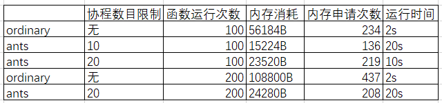
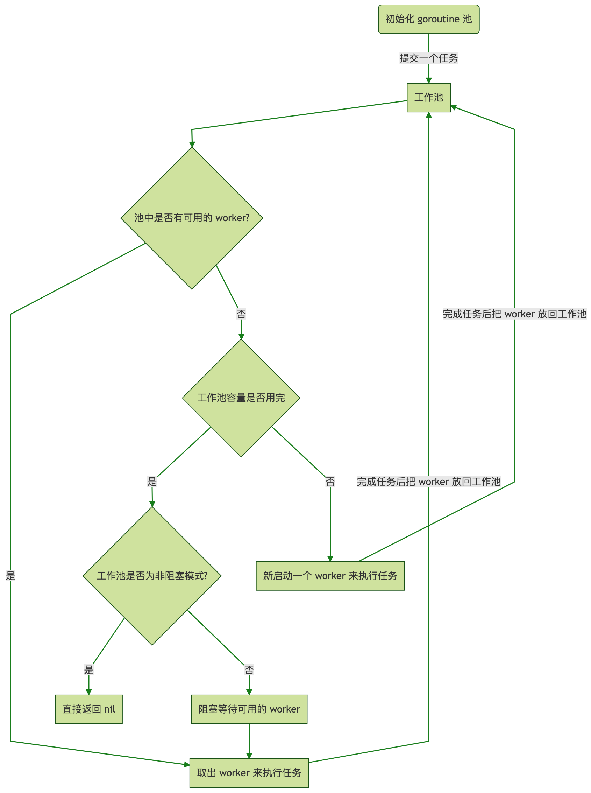

# ants--goroutine池--异步

## `ants`

**一、`ants`作用**

​		◼`ants`是一个高性能的`gorountine`池

​		◼实现对大规模`gorountine`池的调度管理、`goroutine`复用

​		◼开发并发程序时能够限制`gorountine`数量和复用资源，获取最优的执行任务效果和资源分配

**二、`ants`的特性**

​		◼协程数目越多运行速度越快（协程数目峰值与CPU性能相关）

​		◼协程数目越多内存申请次数越多，内存消耗也越多

​		◼内存资源的消耗与函数运行次数无关



**三、`ants`的获取与使用**

​		◼`go get -u github.com/panjf2000/ants/v2`

## `ants`与`goroutine`的对比

**一、`ants`和一般的`goroutine`**启动的对比

​		◼`ants`会限制`goroutine`的数量，减少对内存资源的消耗

​		◼`ants`会实现对`goroutine`的重复利用，不需要重复启动

​		◼`ants`能够以更少的数量的`goroutine`和内存资源完成工作，极大提高了协程利用率

​		◼由于`ants`限制了协程数量，所以运行速度会比一般`goroutine`方式慢

​		◼当`ants`的线程数大于函数运行次数时，速度和一般方式相同

**二、一般启动`goroutine`方式的劣势**

​		◼协程用完后立即释放资源，使用协程需要重新创建协程和重新申请内存

​		◼内存资源消耗极大，资源利用率低

## `ants`运行方式



## `ants`并发的使用

### 构建和使用线程池的模板结构

​		◼程序运行完释放`ants`

​		◼`handler`函数

​		◼构造闭包函数`task`，使用闭包填充数据并返回对应属性的函数

​		◼构造线程池，设置必要的属性

​		◼程序运行完释放线程池

​		◼启动线程

```go
var wg Sync.WaitGroup
func handler(i int){
    
}
func main(){
    defer ants.Release()			//释放ants
    
    task:=func(i int)func(){		//闭包构造task函数返回func()函数
        handler(i)
        wg.Done()					//协程运行完-1
    }
    
    p,_:=ants.NewPool(20)			//构造线程池
    defer p.Release()				//使用完释放协程池
    
    for i:=0;i<20;i++{				//启动线程
        wg.Add(1)
        _=pool.Submit(task(i))
    }
    wg.Wait()
    
}
```

### 线程池构建的方式

**一、协程池构建函数**

​		◼`NeWPool()`方式

​		◼`NewPoolWithFunc()`方式

**二、`NewPool()`构造线程池**

​		◼**能够与多个`task`函数共享一个线程池**

​		◼使用`pool.Submit()`函数启动协程

​		◼`pool.Submit()`只接收`func()`函数，可以使用闭包方式填充数据返回`func()`函数

```go
var wg sync.WaitGroup
var sum int32

func do(i int) {
	atomic.AddInt32(&sum, 2)
	time.Sleep(time.Second * 2)
	fmt.Println(i)
}

func main() {
	defer ants.Release()

	pool, _ := ants.NewPool(20)		//构造协程池
	defer pool.Release()

    task := func(i int) func(){		//闭包函数填充数据返回func()函数
		return func() {
			do(i)
			wg.Done()
		}
	}

	for i := 0; i < 10; i++ {
		wg.Add(1)
		_ = pool.Submit(task(i))	//提交工作函数，启动协程
	}
	wg.Wait()						//等待运行完

	fmt.Println("sum:", sum)
}
```

**三、`NewPoolWithFunc()`构建协程池**

​		◼**构造的线程池只给一个函数使用**

​		◼使用`pool.Invoke()`启动协程

​		◼`pool.Invoke()`只接收`func(i interface{})`函数

​		◼需要填充多个数据时可以结构体传入`task`函数，在`task`函数里使用断言将数据传入`handler`函数

```go
var wg sync.WaitGroup
var sum int32

func do(i int) {
	atomic.AddInt32(&sum, 2)
	time.Sleep(time.Second * 2)
	fmt.Println(i)
}

func main() {
	defer ants.Release()

	task := func(i interface{}) {	//使用闭包构建func(i interface{}函数)
		do(i.(int))					//使用断言填充数据
		wg.Done()
	}

	p, _ := ants.NewPoolWithFunc(20, task)	//构建协程池，设置协程数和放入工作函数
	defer p.Release()				//协程池程序结束前释放

	for i := 0; i < 20; i++ {
		wg.Add(1)
		p.Invoke(i)					//放入数据，至少放入i,然后启动线程
	}
	wg.Wait()						//等待运行完毕
	fmt.Println(sum)				//输出结果
}
```

### 协程池相关配置

​		◼在协程构造函数里追加`ants.optionFunc`进行配置

​		◼`ants.NewPool(100000, ants.WithPreAlloc(true))`

| 方法(optionFunc)                    | 说明                                                         |
| :---------------------------------- | :----------------------------------------------------------- |
| WithExpiryDuration(time.Duration)   | 设置goroutine过期时间, 表示goroutine 空闲多长时间之后会被`ants`池回收 |
| WithPreAlloc(bool)                  | 启动预分配内存给goroutine队列                                |
| WithMaxBlockingTasks(int)           | 设置堵塞队列的最大长度，等待队列超过这个长度, 提交任务直接返回错误 |
| WithNonblocking(bool)               | 启动或关闭goroutine的阻塞队列，默认启动                      |
| WithPanicHandler(func(interface{})) | 设置异常处理函数, 遇到 panic 会调用这里设置的处理函数        |
| WithLogger(logger)                  | 设置日志实例                                                 |

### 其他方法

**一、动态调整协程池**

​		◼使用`pool.Tune()`方法动态调整协程池大小

**二、预先分配协程队列内存**

​		◼`p, _ := ants.NewPool(100000, ants.WithPreAlloc(true))`

**三、协程池的释放**

​		◼使用`pool.Release()`方法释放协程池

**四、重启协程池**

​		◼使用`pool.Reboot()`方法重启协程池

# tunny--goroutine池--同步


[Go 每日一库之 tunny - 知乎 (zhihu.com)](https://zhuanlan.zhihu.com/p/379674651)