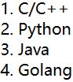
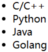
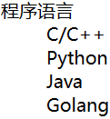
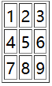
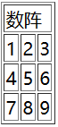
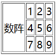
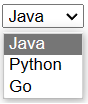
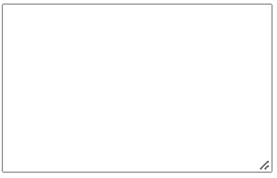
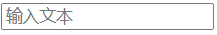

# HTML基本结构

**一、HTML基本结构**

* html标签
* 网页头部：head标签
* 主体部分：body标签

```html
<html>
    <head>
        <title>我的html</title>
    </head>
    <body>
        网页内容
    </body>
</html>
```

**二、HTML注释**

```html
<!-- 内容 -->
```

# 网页基本信息

**一、DOCTYPE规范**

* 确定网页使用的规范，默认为html

```html
<!DOCTYPE html>
```

**二、html总标签**

* html网页的内容都要在html标签内

```html
<html>
    内容
</html>
```

**三、head标签**

* 表示网页头部，一般用于设置网页的属性

```html
<html>
    <head>
        头部内容
    </head>
</html>
```

**四、body标签**

* 表示网页的主体

```html
<html>
    <body>
        主体内容
    </body>
</html>
```

# 网页头部的基本标签

**一、title标签**

* 用于设置网页的标题

```html
<html>
    <head>
        <title>网页标题</title>
    </head>
</html>
```

**二、meta标签**

* 用于描述网站的信息
* 用于设置字符编码和一些键值对

```html
<html>
    <head>
        <meta charset="UTF-8">
        <meta name="key" content="value">
    </head>
</html>
```

# 网页主体的基本标签和特殊符号

**一、标题标签**

* 使用`<h1></h1>`表示为一级标题
* 使用`<h2></h2>`表示为二级标题
* 总共有6级的标签

```html
<html>
    <body>
        <h1>
            我的大题目
        </h1>
        <h2>
            我的小题目
        </h2>
    </body>
</html>
```

**二、段落标签**

* 使用`<p></p>`进行分段，被框住的内容显示为1行
* 两行之间较为宽松

```html
<html>
    <body>
	<p>静夜思</p>
	<p>床前明月光，疑是地上霜。</p>
    <p>举头望明月，低头思故乡。 </p>
    </body>
</html>
```

**三、换行标签**

* 使用`<br>`进行换行，两行之间较为紧凑

```html
<html>
    <body>
    静夜思<br/>
	床前明月光，疑是地上霜。<br/>
    举头望明月，低头思故乡。 <br/>
    </body>
</html>
```

**四、水平线标签**

* 使用`<hr/>`显示水平线

```html
<html>
    <body>
        <hr/>
    </body>
</html>
```

**五、字体样式标签**

* 粗体：`<strong></strong>`
* 斜体：`<em></em>`

```html
<html>
    <body>
        <strong>粗体</strong>
        <em>斜体</em>
    </body>
</html>
```

**六、注释和特殊符号**

* 注释符号：`<!-- 内容 -->`
* 空格符号：`&nbsp;`
* 一般的空格：无论文本里有多少给空格都只空1格
* 大于：`&gt;`
* 小于：`&lt;`
* 版权符号：`&copy;`

```html
<html>
    <body>
        <!--内容-->
        空&nbsp;格
        2&gt;1
        1&lt;2
        &copy;版权所有
    </body>
</html>
```

# 图形标签

**一、图片标签相关属性**

* 图片地址`src`：用于指出图片资源的来源
* 图片的代替文字`alt`：图片没加载出来时用文字替代，一般为图片名字
* 图片的提示文字`title`：鼠标悬停到图片时显示的提示文字
* 图片的显示宽度`width`：设置图片的宽度
* 图片的显示高度`height`：设置图片的高度

**二、图像标签**

* 使用``显示图像

```html
<html>
    <body>
        <!-- 最基本的图片标签 -->
        
        <!-- 限制大小的图片标签 -->
        
        <!-- 悬停显示文字 -->
        
    </body>
</html>
```

# 超链接标签

**一、超链接的属性**

* 链接路径`href`：链接的目的网页
* 窗口打开的位置`target`：\_blank（新页面打开）、\_self（当前页面打开，默认）
* 超链接的显示文本或图像

**一、超链接文本**

* 使用文本嵌套`<a>`标签

```html
<html>
    <body>
        <!-- 最基本的文本超链接 -->
        <a href="https://www.baidu.com/">跳转百度</a>
        <!-- 新标签打开链接 -->
        <a href="https://www.baidu.com/" target="_blank">跳转百度</a>
    </body>
</html>
```

**二、超链接图像**

* 使用图片嵌套`<a>`标签

```html
<html>
    <body>
        <a href="https://www.baidu.com/">
                
        </a>
    </body>
</html>
```

**三、锚链接**

* 常用于跳转到页面锚点位置
* 使用`id`设置锚
* 在`hred`里使用`#`转义为锚

```html
<html>
    <body>
        <!-- 设置跳转锚 -->
        <a id="top">顶部</a>
        <p>
            一系列内容
        </p>
        <!-- 回到顶部位置 -->
        <a href="#top">回到顶部</a>
    </body>
</html>
```

```html
<html>
    <body>
        <!-- 跳转到位置demo页面的top瞄点 -->
        <a href="demo.html#top">跳转页面</a>
    </body>
</html>
```

# 行内元素与块元素的概念

**一、块元素**

* 无论内容多少只占1行，会触发换行
* （`<p>`、`<h1>`、`<h2>`......）

**二、行内元素**

* 内容撑开宽度，左右都是行内元素可以排在一行，不会换行

* （`<a>`、`strong`、`em`）

# 列表标签

**一、有序列表**

* 使用`<ol>`显示有序列表（`order list`）
* 使用`<li>`定义列表元素
* 应用范围：试卷、问答

```html
<html>
    <body>
        <ol>
            <li>C/C++</li>
            <li>Python</li>
            <li>Java</li>
            <li>Golang</li>
        </ol>
    </body>
</html>
```



**二、无序列表**

* 使用`<ul>`显示无序列表
* 使用`<li>`定义列表元素
* 应用范围：导航、侧边栏

```html
<html>
    <body>
        <ul>
            <li>C/C++</li>
            <li>Python</li>
            <li>Java</li>
            <li>Golang</li>
        </ul>
    </body>
</html>
```



**三、自定义列表**

* 使用`<dl>`显示自定义列表
* 使用`<dt>`定义列表名称
* 使用`<dd>`定义列表内容
* 应用范围：公司网站底部

```html
<html>
    <body>
        <dl>
            <dt>程序语言</dt>
            <dd>C/C++</dd>
            <dd>Python</dd>
            <dd>Java</dd>
            <dd>Golang</dd>
        </dl>
    </body>
</html>
```



# 表格标签

**一、一般表格**

* 使用`<table>`显示表格
* 行标签：`<tr>`
* 列标签：`<td>`
* 使用`border`属性加边框

```html
<html>
    <body>
        <table border="1px">
            <tr>
            	<td>1</td>
                <td>2</td>
                <td>3</td>
            </tr>
            <tr>
            	<td>4</td>
                <td>5</td>
                <td>6</td>
            </tr>
            <tr>
            	<td>7</td>
                <td>8</td>
                <td>9</td>
            </tr>
        </table>
    </body>
</html>
```



**二、跨列表格**

* 在一般表格的基础上，在`<td>`列标签追加`colspan`值

```html
<html>
    <body>
        <table border="1px">
            <tr>
            	<td colspan="3">数阵</td>
            </tr>
            <tr>
            	<td>1</td>
                <td>2</td>
                <td>3</td>
            </tr>
            <tr>
            	<td>4</td>
                <td>5</td>
                <td>6</td>
            </tr>
            <tr>
            	<td>7</td>
                <td>8</td>
                <td>9</td>
            </tr>
        </table>
    </body>
</html>
```



**三、跨行表格**

* 在一般表格的基础上，在`<td>`列标签追加`rowspan`值

```html
<html>
    <body>
        <table border="1px">
            <tr>
            	<td rowspan=3>数阵</td>
                <td>1</td>
                <td>2</td>
                <td>3</td>
            </tr>
            <tr>
            	<td>4</td>
                <td>5</td>
                <td>6</td>
            </tr>
            <tr>
            	<td>7</td>
                <td>8</td>
                <td>9</td>
            </tr>
        </table>
    </body>
</html>
```



# 媒体元素

**一、视频元素**

* 使用`<video>`标签显示视频
* `src`：设置资源来源
* `controls`：显示控制条
* `autoplay`：自动播放，需要在`src`前加`muted`（浏览器会限制此行为）

```html
<html>
    <body>
        <video src="D:\动画\孤独摇滚\1.mp4" controls autoplay></video>
    </body>
</html>
```

**二、音频元素**

* 使用`<audio>`标签显示音频
* `src`：设置资源来源
* `controls`：显示控制条
* `autoplay`：自动播放（浏览器会限制此行为）

```html
<html>
    <body>
        <audio src="D:\动画\1.flac" controls autoplay></audio>
    </body>
</html>
```

# 页面结构

| 元素    | 描述                           |
| ------- | ------------------------------ |
| header  | 标题头部区域内容               |
| footer  | 标记脚步区域内容               |
| section | Web页面的一块独立区域          |
| article | 独立的文章内容                 |
| aside   | 相关内容或应用（常用于侧边栏） |
| nav     | 导航类辅助内容                 |

```html
<html>
    <body>
        <header>
        	<h2>网页头部</h2>
        </header>
        
        <section>
            <h2>网页主体</h2>
        </section>
        
        <footer>
			<h2>网页脚部</h2>
        </footer>
    </body>
</html>
```

# 嵌套网页

**一、iframe内联框架**

* 使用`<iframe>`实现页面的嵌套
* `src`：页面的来源
* `frameborder`：边框长度
* `width`：宽度
* `height`：高度
* `name`：框架标识名

```html
<html>
    <iframe src="https://bing.com"></iframe>
</html>
```

**二、在iframe内联框架内跳转**

* 使用`name`标记内联框架
* 在`<a>`标签中，使用`target`实现在内联框架内跳转

```html
<html>
    <iframe src="https://bing.com" name="bing"></iframe>
    <a href="https://bilibili.com" target="bing">跳转</a>
</html>
```

# 表单

**一、表单相关的属性**

* `action`：提交路径，通常是网站和请求处理地址
* `method`：提交方式，表单一般使用post方法

**二、输入框的相关属性**

* `type`：输入文本的类型，有文本、密码、图片、重置、提交、单选、多选等
* `name`：设置值的key，后台通过key取value
* `value`：元素的值，radio必须指定一个value值
* `checked`：用于表示是否被选中
* `maxlength`：设置输入值最大长度

**三、单选框**

* `<input>`标签`type`属性设为`radio`会显示单选框
* 要求要有`value`属性
* 当`name`属性的值相同时表示同一组，在同一组时只能同时选一个
* 使用`checked`属性设置默认选项

```html
<html>
    <body>
  		<p>
        性别：<input type="radio" value="boy" name="sex"/>男
        	<input type="radio" value="girl" name="sex"/>女
        </p>
    </body>
</html>
```

**四、多选框**

* `<input>`标签`type`属性设为`checkbox`会显示多选框
* 要求要有`value`属性
* 当`name`属性的值相同时表示同一组，在同一组时能同时选多个
* 使用`checked`属性设置默认选项

```html
<html>
    <body>
        <p>
            爱好：
        	<input type="checkbox" value="C/C++" name="hobby"/> C/C++ 
            <input type="checkbox" value="Java" name="hobby"/>Java 
            <input type="checkbox" value="Go" name="hobby"/>Go
        </p>
    </body>
</html>
```

**五、按钮**

* `<input>`标签`type`属性设为`button`会显示按钮
* `<input>`标签`type`属性设为`image`会显示图片按钮，<font color=red>如果在表单内会引发提交</font>
* `value`属性用于设置按钮上的文字

```html
<html>
    <body>
        <input type="button" value="点击" name="bnt"/>
        <input type="image" src="./kq.png"/>
    </body>
</html>
```

**六、创建表单**

* 使用`<form>`创建表单
* 使用`<input>`创建输入框
* 使用`<button>`和`<input>`设置提交按钮和重置按钮

```html
<html>
    <body>
        <h1>注册</h1>
        <form action="/register" method="post">
            <!--注册表-->
            <p>
                账号：<input type="text" name="username"/>
            </p>
            <p>
                密码：<input type="password" name="pwd"/>
            </p>
            <!--单选框-->
            <p>
                性别：<input type="radio" value="boy" name="sex"/>男
                	<input type="radio" value="girl" name="sex"/>女
            </p>
            <p>
             	<input type="submit">
                <input type="reset"> 
            </p>
        	<p>
            爱好：
        		<input type="checkbox" value="C/C++" name="hobby"/> C/C++ 
            	<input type="checkbox" value="Java" name="hobby"/>Java 
            	<input type="checkbox" value="Go" name="hobby"/>Go
        	</p>
        </form>
    </body>
</html>
```

# 列表框、文本域和文件域

**一、列表框**

* 使用`<select>`标签设置下拉框
* 使用`<option>`设置下拉框选项
* 使用`selected`属性设置默认选择

```html
<html>
    <body>
        <h1>注册</h1>
        <form action="/register" method="post">
        	<select name="程序语言" id="language">
            	<option value="Java">Java</option>
            	<option value="Python">Python</option>
            	<option value="Go" selected>Go</option>
        	</select>
            <input type="submit"/>
        </form>
    </body>
</html>
```



**二、文本域**

* 使用`<textarea>`设置文本域
* 使用`rows`设置行数
* 使用`cols`设置列数

```html
<html>
    <body>
        <h1>注册</h1>
        <form action="/register" method="post">
            <textarea name="text" rows="10" cols="20"></textarea>
            <input type="submit"/>
        </form>
    </body>
</html>
```



**三、文件域**

* `<form>`标签里的`enctype`属性设置为`multipart/form-data`
* `<input>`的`type`属性设置为`file`，`multiple`属性设置为`multiple`
* `<input>`的`name`用于设置文件的key，后端通过改key获取文件
* 使用`accept`设置接收的文件类型

```html
<html>
    <body>
        <form action="/hander" method="post" enctype="multipart/form-data">
        <p><input type="file" multiple="multiple" accept="*" name="image"/></p>
        <p><input type="submit" /></p>
		</form>
    </body>
</html>
```

# 简单验证与搜索框滑块域

**一、邮箱验证**

* 使用`<input>`标签，`type`设置为`email`

```html
<html>
    <body>
        <p>邮箱：
        	<input type="email" name="email"/>            
        </p>
    </body>
</html>
```

**二、网页验证**

* 使用`<input>`标签，`type`设置为`url`

```html
<html>
    <body>
        <p>网页：
        	<input type="url" name="url"/>            
        </p>
    </body>
</html>
```

**三、纯数字验证**

* 使用`<input>`标签，`type`设置为`number`
* `max`属性可设置最大值
* `min`属性可设置最小值
* `step`属性可设置数字步长，自动填充数字

```html
<html>
    <body>
        <p>输入数字：
        	<input type="number" name="number" max="1000" min="10" step="1"/>
        </p>
    </body>
</html>
```

**四、滑块**

* 使用`<input>`标签，`type`设置为`range`

* `max`属性可设置最大值
* `min`属性可设置最小值
* `step`属性可设置数字步长，自动填充数字

```html
<html>
    <body>
        <p>音量：
        	<input type="range" name="range" max="100" min="0" step="10"/>
        </p>
    </body>
</html>
```

**五、搜索框**

* 使用`<input>`标签，`type`设置为`search`

```html
<html>
    <body>
        <p>搜索：
        	<input type="search" name="search"/>
        </p>
    </body>
</html>
```

# 表单输入的其他设置

**一、设置隐藏**

* 设置`hidden`属性

```html
<html>
    <body>
        <input type="text" value="admin" hidden/>
    </body>
</html>
```

**二、设置只读**

* 设置`readonly`属性

```html
<html>
    <body>
        <input type="text" value="admin" readonly/>
    </body>
</html>
```

**三、设置禁用**

* 设置`disabled`属性

```html
<html>
    <body>
        <input type="radio" value="1" disabled/>选择
    </body>
</html>
```

**四、重新指向**

* 使用`<label>`实现
* `for`属性用于设置指向的控件id
* 用于增强鼠标可用性

```html
<html>
    <body>
        <label for="mytext">点击重新指向</label>
        <input type="text" id="mytext"/>
    </body>
</html>
```

# 表单的初级验证

**一、设置提示信息**

* 使用`<input>`标签，用`placeholder`设置提示信息

```html
<html>
    <body>
        <input type="text" placeholder="输入文本"/>
    </body>
</html>
```



**二、设置内容非空**

* 使用`<input>`标签，用`required`设置输入非空

```html
<html>
    <body>
        <input type="text" required/>
    </body>
</html>
```

**三、正则表达式**

* 使用`<input>`标签，用`pattern`设置正则表达式验证
* 正则表达式建议网上搜

```html
<html>
    <body>
        <input type="text" pattern="正则表达式"/>
    </body>
</html>
```


