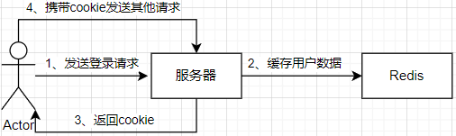
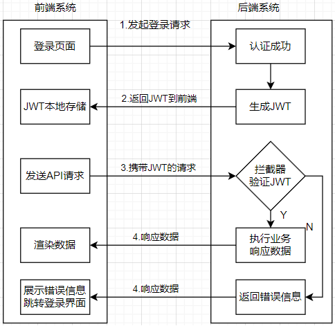

# Http与session会话

**一、http与状态**

* http协议是一个无状态协议，每次处理http请求时不能知道哪个用户发来的请求
* 为了记录用户的状态，可以将用户状态数据以session会话或JWT的形式进行保存

# 传统的session的认证方式

**一、传统的session认证流程**

1. 用户发送登录请求

2. 服务器查询数据，并将数据打包成JSON形式并存储到redis里（session主体），返回cookie，其中session对应的key作为cookie的值

3. 用户携带cookie发起请求



**二、传统的session认证的问题**

* 每个用户认证之后都需要在服务器存储一次数据到内存，使用redis集群时每台机器上都要有一个数据副本，随着认证用户的增多服务端开销明显增加
* session数据存储在某些机器的内存中，下次请求时必须访问这些机器，限制了系统的负载均衡和可扩展性的能力
* 用户发送请求时，如果cookie被截获用户很容易受到跨站请求伪造攻击
* 前后端分离的系统里，因为系统的解耦增加了部署的复杂性，如果后端应用是多节点部署，那么需要实现session的共享机制，不方便集群的应用（尤其对于云原生应用）

# JWT简介

**一、JWT**

* 全称：JSON Web Token（JSON Web令牌）
* 通过数字签名的方式，以JSON对象为载体在不同的服务终端之间安全传输信息

**二、JWT作用**

* 授权认证：一旦用户登录，后续每个请求都包含JWT，系统每次处理用户请求之前都要进行JWT安全校验，通过后再处理请求，JWT可以再不同域中使用。
* 信息交换：因为对信息进行签名所以JWT可以实现安全的传输信息，签名使用`Header`和`Payload`进行计算

# JWT的认证方式

**一、JWT认证流程**

1. 用户发起请求
2. 服务端认证成功并生成JWT令牌，返回JWT到前端，前端将JWT存储在localStorage（持久只读存储库）里
3. 用户携带cookie进行请求
4. 系统拦截器拦截请求并验证JWT的合法性，如果出现过期等问题则返回错误信息到前端要求重新登录，如果通过拦截则执行业务逻辑并影响数据



**二、退出认证的实现**

* 前端删除JWT数据即可

**三、前端发送JWT的方式**

* 将JWT放入`Header`中的Authorization位，用于解决XSS和XSRF问题

**四、JWT的优势**

* 简洁：可以使用url，post参数或在HTTP header里发送数据
* 自包含：负载中包含了所有用户所需的信息，避免了多次查询数据库
* 跨域跨语言：Token以JSON加密的形式保存在客户端，所以JWT是跨语言的
* 不需要再服务端保存会话信息，特别适用于分布式微服务

# Token的结构

**一、Token的组成**

* Token由标头（Header）、有效载荷（Payload）和签名（Signature）组成
* Token不同组成之间使用`.`进行拼接，即为`Header.Payload.Signature`

**二、Header**

* 标头通常由令牌的类型(`typ`)和使用的签名算法(`alg`)组成
* 装载为Header时会使用``Base64-URL``编码

```json
//Header
{
    'typ':'JWT',
    'alg':'HS256'
}
```

**三、Payload**

* 有效负载通常保存着数据实体
* 有效负载在装载时会使用`Base64-URL`进行编码
* 有效负载不能存放用户敏感信息，否则JWT被抓包截获时会造成数据泄露

```json
//Payload
{
    "uid":1,
    "name":"demo",
    "expireAt":123123123
}
```

**四、Signature**

* 使用编码后的header和payload以及一个内部密钥，然后使用header中指定的签名算法(`HS256`)进行签名
* 签名的作用是保证JWT没有被篡改
* 对`Header.payload+key`的内容使用摘要算法获取签名
* 装载时需要对签名进行`Base64-URL`编码

```go
Signature:=HMACSHA256(`Base64-URL`UrlEnconde(header)+"."+baseUrlEncode(payload),secret)
```

# Gin+JWT的鉴权认证

**一、后端处理登录逻辑**

1. 获取前端发送的登录数据
2. 数据库查询数据验证账号信息，出错则返回错误
3. 获取token（本例子使用自定义的JWT库）
4. token返回前端

**二、vue前端接收并保存token的实现**

* 使用`localStorage.setItem()`方法将token保存到前端

```vue
<script setup>
import {reactive} from "vue";
import axios from "axios";
let account=reactive({account:null,password:null})
function login() {
  axios.post("/login",{account:account.account,password:account.password}).then((res)=>{
    localStorage.setItem("token",res.data.token)
    alert(res.data.msg)
  }).catch(()=>{
    alert("连接错误")
  })
}
</script>
```

**三、vue前端使用axios拦截器发送token**

* 使用`localStorage.getItem()`从localStorage里获取token
* 使用`axios.interceptors.request.use(config=>{...})`设置请求拦截器（同理可以设置响应拦截器）

```vue
<script setup>
axios.interceptors.request.use(config=>{
	let token=localStorage.getItem('token')
	if (token){
        //请求设置token
  		config.headers.Authorization=token
	}
	return config
})
</script>
```

**四、gin后端使用拦截器验证token**

* 使用`context.Request.Header.Get("Authorization")`取出header的值
* 使用`context.Abort()`进行拦截，使用`context.Next()`放行，**过滤完后要return否则会继续执行逻辑**

```go
func checkToken() gin.HandlerFunc {
	return func(context *gin.Context) {
		token := context.Request.Header.Get("Authorization")
		payload, ok, err := JWT.Check(token, key)
		if err != nil {
			context.JSON(200, gin.H{
				"status": 200,
				"msg":    err.Error(),
			})
			context.Abort()
			return
		}
		//签名校验失败
		if !ok {
			context.JSON(200, gin.H{
				"status": 200,
				"msg":    "token解析失败，重新登录",
			})
			context.Abort()
			return
		}
		var auth Token
		err = json.Unmarshal(payload, &auth)
		if err != nil {
			context.JSON(200, gin.H{
				"status": 200,
				"msg":    "token解析失败，重新登录",
			})
			context.Abort()
			return
		}
		//token过期情况
		if auth.ExpireAt > time.Now().Unix() {
			context.Next()
			return
		} else {
			context.JSON(200, gin.H{
				"status": 200,
				"msg":    "token过期，重新登录",
			})
			context.Abort()
			return
		}
	}
}
```


