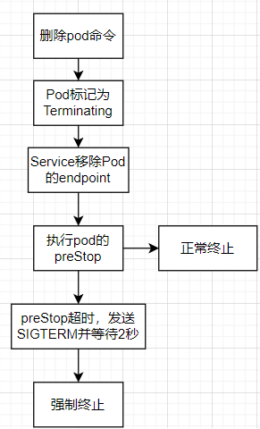

# Kubernetes

**一、`kubernetes`**

​		◼用于管理服务器集群，在集群的每个节点上运行特定的程序实现对容器的管理

​		◼实现资源管理的自动化

​		◼简称：`k8s`


**二、`k8s`的功能**

​		◼自我修复：容器崩溃了会迅速启动新的容器进行代替

​		◼弹性伸缩：根据需求自动对集群中正在运行的容器数量进行调整

​		◼服务发现：服务通过自动发现的形式找到它所依赖的服务

​		◼负载均衡：一个服务启动了多个副本，能够自动实现请求的负载均衡

​		◼版本回退：新发布的程序版本有问题可以立即回退原来的版本

​		◼存储编排：根据容器的自身需求自动创建容器卷

# Kubernetes的集群搭建

## 准备工具

* ubuntu_server 22.4
* 3台虚拟机，其中master要至少2核
* 科学上网工具
* Xshell（非必须）

## 环境准备

<font color=red>以下步骤适用于所有机</font>

**一、关闭分区**

```bash
sudo sed -ri 's/.*swap.*/#&/' /etc/fstab
sudo swapoff -a
```

**二、下载https依赖包**

```bash
sudo apt update
sudo apt install -y apt-transport-https
```

**三、安装docker**

```bash
curl -fsSL https://test.docker.com -o test-docker.sh
sudo sh test-docker.sh
sudo gpasswd -a $USER docker
newgrp docker
```

**四、添加docker配置**

```bash
sudo mkdir -p /etc/docker
sudo touch /etc/docker/daemon.json
#添加阿里云镜像设置
sudo cat >> /etc/docker/daemon.json <<EOF
{
    "registry-mirrors": ["https://bytkgxyr.mirror.aliyuncs.com","https://registry.docker-cn.com","http://hub-mirror.c.163.com"],
    "max-concurrent-downloads": 10,
    "max-concurrent-uploads": 5,
    "log-opts": {
    	"max-size": "300m",
    	"max-file": "2"
    },
    "live-restore": true
}
EOF
```

## 网络设置

**一、设置静态IP地址**

* 分别修改每台机的`00-installer-config.yaml`文件
* 设置静态IP，关闭DHCP

```bash
sudo vi /etc/netplan/00-installer-config.yaml
```

```yaml
network:
  ethernets:
    enp0s3:
      addresses: [192.168.137.60/24]
      gateway4: 192.168.137.1
      dhcp4: false
      nameservers:
        addresses: [114.114.114.114, 8.8.8.8]
  version: 2
```

```bash
netplan apply
reboot
```

**二、修改hostname**

* 对3台机分别修改主机名

```bash
#临时修改
sudo hostname master
#永久修改
vi /etc/hostname
```

**三、修改hosts**

* 适用于所有机

```bash
vi /etc/hosts
```

```bash
192.168.137.99 master
192.168.137.145 node1
192.168.137.215 node2
```

## 下载并安装kubectl

**一、下载并安装 kubectl**

* 适用于所有机

```bash
curl -LO https://dl.k8s.io/release/v1.27.2/bin/linux/amd64/kubectl
sudo install -o root -g root -m 0755 kubectl /usr/local/bin/kubectl
```

```bash
sysctl net.bridge.bridge-nf-call-iptables net.bridge.bridge-nf-call-ip6tables net.ipv4.ip_forward
```

## 下载安装containerd

**一、下载安装 containerd**

* 适用于所有机

```bash
sudo apt install -y curl gnupg2 software-properties-common apt-transport-https ca-certificates
sudo curl -fsSL https://download.docker.com/linux/ubuntu/gpg | sudo gpg --dearmour -o /etc/apt/trusted.gpg.d/docker.gpg
sudo add-apt-repository "deb [arch=amd64] https://download.docker.com/linux/ubuntu $(lsb_release -cs) stable"
```

```bash
sudo apt update
sudo apt install -y containerd.io
```

**二、配置containerd**

* 适用于所有机

```bash
containerd config default | sudo tee /etc/containerd/config.toml >/dev/null 2>&1
sudo sed -i 's/SystemdCgroup \= false/SystemdCgroup \= true/g' /etc/containerd/config.toml
```

```bash
sudo systemctl restart containerd
sudo systemctl enable containerd
```

**三、创建/etc/crictl.yaml 文件**

* 适用于所有机

```yaml
runtime-endpoint: unix:///run/containerd/containerd.sock
image-endpoint: unix:///run/containerd/containerd.sock
timeout: 10
debug: false
```

**四、验证安装成功**

```bash
sudo crictl images
```

## 修改内核参数

**一、追加containerd参数**

* 适用于所有机

```bash
sudo tee /etc/modules-load.d/containerd.conf <<EOF
overlay
br_netfilter
EOF
sudo modprobe overlay
sudo modprobe br_netfilter
```

**二、给k8s设置内核参数**

* 适用于所有机

```bash
sudo tee /etc/sysctl.d/kubernetes.conf <<EOF
net.bridge.bridge-nf-call-ip6tables = 1
net.bridge.bridge-nf-call-iptables = 1
net.ipv4.ip_forward = 1
EOF
```

```bash
sudo sysctl --system
```

## 下载安装kubectl kubelet kubeadm

**一、添加阿里云访问公钥**

* 适用于所有机

```bash
sudo su
curl https://mirrors.aliyun.com/kubernetes/apt/doc/apt-key.gpg | apt-key add - 
```

**二、添加阿里源**

* 适用于所有机

```bash
cat <<EOF >/etc/apt/sources.list.d/kubernetes.list
deb https://mirrors.aliyun.com/kubernetes/apt/ kubernetes-xenial main
EOF
```

**三、安装kubectl kubelet kubeadm**

* 适用于所有机

```bash
sudo apt update 
sudo apt install kubectl kubelet kubeadm -y
```

**四、测试命令**

* 适用于所有机

```bash
kubectl version --client
```

**五、开机自启**

* 适用于所有机

```bash
systemctl enable kubelet
```

## 换源与拉取镜像

**一、containerd换源**

* 适用于所有机

```bash
sudo rm /etc/containerd/config.toml
# 生成 containerd 的默认配置文件
containerd config default > /etc/containerd/config.toml 
# 统一换源操作
sed -i "s#registry.k8s.io/pause#registry.aliyuncs.com/google_containers/pause#g" /etc/containerd/config.toml
# 重新加载配置文件
systemctl daemon-reload 
# 重启所有有关6443端口的服务 
systemctl restart containerd.service 
systemctl restart docker
systemctl restart kubelet
```

**二、拉取镜像**

* 适用于所有机
* 查看需要拉取的镜像，将k8s的地址修改为阿里云的地址，注意`tag`标签

```bash
#查看需要拉取的镜像
sudo kubeadm config images list
```

```bash
#注意版本号
sudo docker pull registry.cn-hangzhou.aliyuncs.com/google_containers/kube-apiserver:v1.27.2
sudo docker pull registry.cn-hangzhou.aliyuncs.com/google_containers/kube-controller-manager:v1.27.2
sudo docker pull registry.cn-hangzhou.aliyuncs.com/google_containers/kube-scheduler:v1.27.2
sudo docker pull registry.cn-hangzhou.aliyuncs.com/google_containers/kube-proxy:v1.27.2
sudo docker pull registry.cn-hangzhou.aliyuncs.com/google_containers/pause:3.9
sudo docker pull registry.cn-hangzhou.aliyuncs.com/google_containers/etcd:3.5.7-0
sudo docker pull registry.cn-hangzhou.aliyuncs.com/google_containers/coredns:v1.10.1
```

## 初始化master

**一、初始化master节点**

* `image-repository`：镜像代理
* `apiserver-advertise-address`：master主机IP

```bash
sudo kubeadm init \
--image-repository registry.aliyuncs.com/google_containers  \
--apiserver-advertise-address=192.168.137.99 \
--pod-network-cidr=10.244.0.0/16 \
--kubernetes-version=v1.27.2 \
 --v=6
```

* 复制文件，修改权限

```bash
mkdir -p $HOME/.kube
sudo cp -i /etc/kubernetes/admin.conf $HOME/.kube/config
sudo chown $(id -u):$(id -g) $HOME/.kube/config
```

* 初始化成功后会得到组建的命令


**二、初始化成功后master状态**

```bash
#此时为NotReady状态
kubectl get nodes
```


**三、重置master节点**

* master初始化错误时需要先重置后重新初始化

```bash
sudo kubeadm reset
```

## master节点安装Flannel网络插件

**一、科学上网获取文件内容**

* 因为内容会有变更，这里不要copy别人的博客，否则一定会出错

```
https://raw.githubusercontent.com/coreos/flannel/master/Documentation/kube-flannel.yml
```

* 保存到master节点

```bash
vi kube-flannel.yml
```

**二、安装插件**

```bash
kubectl apply -f kube-flannel.yml
```

**三、拉取镜像**

* 搜索需要拉取的镜像，使用`docker pull`拉取
* 适用于全部主机

```bash
cat kube-flannel.yml | grep image:
```

**四、安装成功后master的状态**


**四、设置配置文件**

* 适用于所有节点

* 写入内容

```shell
mkdir -p /run/flannel/
cat> /run/flannel/subnet.env <<EOF
FLANNEL_NETWORK=10.244.0.0/16
FLANNEL_SUBNET=10.244.0.1/24
FLANNEL_MTU=1450
FLANNEL_IPMASQ=true
EOF
```

## 添加节点

**一、添加worker节点**

* 输入master节点初始化后给出的组建集群命令


* 结果


**二、生成添加worker节点的token命令**

```bash
kubeadm token create --print-join-command
```

**三、生成添加master的命令**

* 先生成添加worker节点的命令

```bash
kubeadm token create --print-join-command
```

* 生成添加master节点的证书

```bash
kubeadm init phase upload-certs --upload-certs
```

* 拼接添加命令得到添加master节点命令

```bash
[添加worker的命令] --control-plane --certificate-key [证书]
```

# Kubernetes的基础

## 节点结构

**一、master节点**

* master节点由`APIServer`、`Scheduler`、`ControllerManager`、`Etcd`组成
  * `APIServer`：接收用户输入的命令，提供认证、授权、API组成和服务发现等机制，也是集群管理、资源配置、整个集群安全机制的入口
  * `ControllerManager`：负责维护集群的状态，接收`APIServer`的指令管理`Pod`的状态，包括部署、故障检测、自动扩展、滚动更新等
  * `Scheduler`：集群`Pod`的调度中心，通过算法得到`Pod`的调度节点
  * `Etcd`：负责存储集群的数据
* `Calico`：符合CNI标准、生产环境常用的网络插件，给每个Pod生成唯一的IP地址，把每个节点当作一个路由器（其它插件：Cilium、Flannel）

**二、worker节点**

* `worker`节点由`Kubelet`、`KubeProxy`、`Docker`组成
  * `Kubelet`：负责管理节点上的`Pod`，并监听节点上Pod的状态，上报节点和节点上面`Pod`的状态
  * `KubeProxy`：负责提`Pod`之间的通信与负载均衡，将指定流量分发到正确机器上（外部访问容器的入口）
  * `Docker`：容器引擎，负责对容器的管理
* `IPVS`规则：作用于`KubeProxy`，监听`Master`节点的增加和删除以及`endpoint`的消息，对于每个`service`都会创建一个`iptables`规则，将`service`的`clusterIP`代理到后端对应的Pod
* `CoreDNS`：用于集群内部`service`的解析，让Pod把Service解析成IP地址，通过IP地址连接到对应服务上

## 组件关系


# kubectl管理工具


## 创建相关命令

**一、创建命名空间**

```bash
kubectl create ns 空间名
```


## 获取信息相关命令

**一、获取集群信息**

```bash
kubectl get nodes
```

**二、查看命名空间**

```bash
kubectl get ns
```

**三、查询命名空间下的所有Pod**

```bash
kubectl get po -n 命名空间
```

**四、获取集群运行的服务**

```bash
kubectl get svc
```

**五、获取运行日志**

```bash
kubectl describe [type] 资源名
```


## 删除相关命令

**一、删除Pod**

```bash
kubectl delete po Pod名 -n 命名空间
```

**二、通过yaml文件删除服务**

```bash
kubectl delete -f xxx.yaml -n 命名空间
```


# Pod

## 定义简单的Pod

**一、apiVersion模块**

* API的版本号（必要）

```yaml
apiVersion: v1
```

**二、资源类型模块**

* 一般值为`Pod`（必要）

```yaml
kind: Pod
```

**三、元数据模块**

* `name`：`Pod`名称，必须满足`RFC1035规范`（必须小写无特殊字符，不能数字开头，连接符用`-`）

* `namespace`：选择命名空间，默认`default`，建议使用命令行(`-n`)设置命名空间，尽量不修改资源清单（可选）

* `labels`：标签选择器，用于过滤和区分`Pod`
  * `app`：应用名，根据实际情况编写
  * `role`：标签
* `annotations`：注释列表，无规范要求

```yaml
metadata:
  name: mynginx
  labels:
    app: nginx
    role: frontend
  annotations:
    msg: simple Pod
```

**四、spec模块**

* `initContainers`：初始化容器，容器启动前中心初始化操作

  * `command`：编写一段shell命令

  * `containers`：容器列表

    * `- name`：定义一个容器，容器命名为`- name`的值，可以有多个`- name`

    * `image`：镜像
    * `imagePullPolicy`：镜像拉取策略，`IfNotPresent`：宿主机由镜像则不用从公网拉取镜像。`Always`：总是拉取
    * `command`：容器启动执行的命令
    * `workingDir`：工作目录
    * `volumeMounts`：挂载卷
      * `- name`：挂载名
      * `mountPath`：挂载路径
      * `readOnly`：主机只读
    * `ports`：暴露的端口
      * `- name`：端口名称
      * `containerPort`：端口号
      * `protocol`：端口协议，默认TCP
    * `env`
      * `- name`：变量名
      * `value`：值
    * `resources`：资源限制
      * `limits`：最大限制
        * `cpu`：设置核心数，默认1000m为1核心
        * `memory`：设置内存，1024M为1G

  * `restartPolicy`：重启策略（`Always`,`Onfailure`,`Never`）

  * `imagePullSecrets`：拉取镜像使用的secret

**五、简单的资源清单**

```yaml
#API版本模块
apiVersion: v1
#资源类型
kind: Pod
#元数据
metadata:
  name: mynginx
  labels:
    app: nginx
    role: frontend
  annotations:
    msg: simple Pod
#spec模块
spec:
  containers:
  - name: mynginx
    image: nginx:latest
    imagePullPolicy: IfNotPresent
    workingDir: /usr/share/nginx/html
    ports:
    - name: http
      containerPort: 80
      protocol: TCP
    env:
    - name: TZ
      value: Asia/Shanghai
    - name: LANG
      value: en_US.utf8
```

## Pod的基本命令

**一、启动Pod资源**

* `-f`：指定`Pod`资源清单
* `-n`：指定命名空间

```bash
kubectl create -f pod.yaml -n project
```

**二、获取所有的pod**

```bash
kubectl get po
```

**三、删除pod**

* 可以指定`pod.yml`删除
* 可以指定pod名删除（pod名可通过`kubectl get po`获取）

```bash
#指定pod删除
kubectl delete po nginx
#yml文件删除
kubectl delete -f pod.yml
```

**四、查看pod日志**

* 格式：`kubectl describe po pod名`

```bash
kubectl describe po mynginx
```

## Endpoints

**一、Endpoints**

* 表示一个Service对应的所有Pod副本的访问地址
* `Endpoint`是状态为running的pod可被访问的服务端点，其集合是`Endpoints`
* node上的`kube-proxy`进程获取每个Service的`Endpoints`，实现Service的负载均衡


* `Endpoint`的代码实现：


## Pod探针

### 探针相关

**一、探针类型**

* StartupProbe（初始化探针）

  * 用于判断容器内的应用程序是否启动

  * 会先禁止其它探针探测直到成功为止，成功后不再探测，<font color=red>常用于初始化时间长的应用</font>

* LivenessProbe（存活探针）

  * 检查容器是否处于`running`状态，<font color=red>检查失败则执行重启策略</font>

  * 没有配置该探针默认为success
  * 循环探测

* ReadinessProbe（就绪探针）
  * 检测容器是否处于`ready`状态，返回值为`success`时，则容器成功启动并处于接收流量的状态
  * <font color=red>当返回值为`false`时容器不会执行重启策略</font>
  * 循环探测

**二、探针检测类型**

* `exec`
  * 在容器内执行一个命令，如果返回值为0，则认为容器健康
* `tcpSocket`
  * 通过TCP连接检测容器内端口是否开启，如果连通则认为容器健康
* `httpGet`：
  * 通过应用程序暴露的API地址来检查程序是否正常，状态码在200~400之间认为容器健康

**三、探针检查参数配置**

* `initDelaySeconds`：初始化等待时间
* `timeoutSeconds`：超时时间
* `periodSeconds`：检查间隔时间
* `successThreshold`：检查达到设置的成功次数后返回成功
* `failureThreshold`：检查达到设置的失败次数后返回失败

### 探针的使用

**一、初始化探针**

```yaml
containers:
- name: xxx
  image: xxx

#初始化探针
  startupProbe:
#http检查
    httpGet:
      scheme: HTTP             # 协议
      path: /get   			   # 路径
      port: 8080               # 端口
#tcp检查
#	tcpSocket:
#	  port: 8080
#exec检查
#	exec:
#	  command:
#	  - bash
#	  - check.sh
```

**二、存活探针**

* 当容器服务初始化时间超过（延迟探测时间+（超时时间+探测间隔时间）\*不健康阀值）时会产生重启死循环
* 使用`startupProbe`探针避免初始化可能产生的死循环

```yaml
containers:
- name: xxx
  image: xxx

  # 存活探针
  livenessProbe:
#http检查
    httpGet:
      scheme: HTTP             # 协议
      path: /get  		       # 路径
      port: 8080               # 端口
#tcp检查
#	tcpSocket:        
#	  port: 8090
    initialDelaySeconds: 10    # 初始化等待时间（不推荐），一般使用startupProbe处理
    periodSeconds: 10          # 探测间隔时间
    timeoutSeconds: 1          # 超时时间
    successThreshold: 1        # 健康阀值 
    failureThreshold: 3        # 不健康阀值 
```

**三、就绪探针**

```yaml
containers:
- name: xxx
  image: xxx

  # 存活探针
  readinessProbe:
#http
    httpGet:
      scheme: HTTP             # 协议
      path: /get  		       # 路径
      port: 8080               # 端口
#tcp
#	tcpSocket:        
#	  port: 8090
    initialDelaySeconds: 10    # 延迟探测时间（不推荐），一般使用startupProbe处理
    periodSeconds: 10          # 探测间隔时间
    timeoutSeconds: 1          # 超时时间
    successThreshold: 1        # 健康阀值 
    failureThreshold: 3        # 不健康阀值 
```

## Pod的终止过程

**一、Pod的终止**

* 更新部署服务时，旧的Pod会终止新的Pod会上线
* 对于接收大流量的Pod，必须要该Pod处理完请求后才能关闭，否则可能会造成严重的错误
* 使用`preStop`调用自定义接口实现服务优雅的关闭
* k8s里执行`preStop`过程默认为30s，超过30s后等待2s强制停止服务
* 使用`terminationGracePeriodSeconds`参数设置等待时间



**二、preStop的设置**

* `preStop`里可以设置shell脚本和http-API处理停止服务前的准备

```yml
#执行preStop最大等待时间（可选），默认30s
terminationGracePeriodSeconds: 30
containers:
- name: xxx
  image: xxx
#Pod生命周期
  lifecycle::
#设置preStop
    preStop:
      #httpGet:
      #		path: /stop
      #		port: 8080
      exec:
        command:
        	- sh
        	- -c
        	- stop.sh
```

# k8s资源管理工具

**一、资源管理工具**

* `Deployment`：无状态应用部署（微服务）
* `Statement`：部署有状态应用（数据库、消息队列）
* `DaemonSet`：部署到每个的应用（插件、日志收集）

# Deployment

## Deployment概念

**一、Deployment**

* 用于部署无状态的服务（一般为微服务这类不需要保存数据缓存数据的服务）
* 管理多个副本的Pod实现无缝迁移、自动扩缩容、自动灾难恢复、一键回滚等功能

## 创建一个Deployment

**一、创建Deployment**

* 使用`kubectl create deployment`创建`deployment`
* 格式：`kubectl create deployment 命名 --image=镜像`

```bash
kubectl create deployment mynginx --image=nginx:latest
```

**二、导出Deployment资源清单**

* 格式：`kubectl get deployment deployment名 -o 文件类型 > 文件名`

```bash
kubectl get deployment mynginx -o yaml > mynginx-deploy.yaml
```

**三、Deployment状态**

* 获取Deployment状态

```bash
kubectl get deploy -owide
```


| 列名       | 说明                         |
| ---------- | ---------------------------- |
| NAME       | Deployment名称               |
| READY      | Pod的状态                    |
| UP-TO-DATE | 达到最新状态的副本数（更新） |
| AVAILABLE  | 可用副本数                   |
| AGE        | 运行时间                     |
| CONTAINER  | 容器名称                     |
| IMAGES     | 容器镜像（docker）           |
| SELECTOR   | 管理的Pod标签                |

## Deployment的更新

**一、更新已部署的Deployment**

* 编辑deployment资源清单
* 使用`kubectl replace -f deployment资源清单`进行更新

```bash
#修改资源清单
vi mynginx-deploy.yaml
```

```bash
#更新
kubectl replace -f mynginx-deploy.yaml
```

**二、无文件直接编辑更新**

* 格式：`kubectl edit deploy deployment名`

```bash
kubectl edit deploy mynginx
```

## Deployment的回滚

**一、回滚到上一个版本**

* 格式：`kubectl rollout undo deploy deploment名`

```bash
#可以修改镜像后缀进行测试
kubectl rollout undo deploy mynginx
```

**二、查看历史更新记录**

* 格式：`kubectl rollout history deploy deployment名`

```bash
kubectl rollout history deploy mynginx
```

**三、查看指定版本详细信息**

* 格式：`kubectl rollout history deploy deployment名 --revision=版本号`

```bash
kubectl rollout history deploy mynginx --revision=2
```

**四、回滚到指定版本**

* 需要查看历史更新记录获取版本号
* 格式：`kubectl rollout undo deploy deployment名 --to-revision=版本号`

```bash
kubectl rollout undo deploy mynginx --to-revision=2
```

## Deployment的扩缩容

**一、扩缩容**

* 可以直接修改文件更新（可以整体扩容和局部扩容）
* 可以使用`kubectl scale`进行资源整体扩容扩缩容
* 格式：`kubectl scale --replicas=倍数 deploy deployment名`

```bash
kubectl scale --replicas=3 deploy mynginx
```

## Deployment常见配置参数

**一、revisionHistoryLimit**

* 位置：`spec.revisionHistoryLimit`
* 设置保留的历史副本数

**二、容器更新的策略**

* 参数：`spec.strategy.type`
* 更新策略：
  * `RolingUpdate`：滚动更新
    * `maxUnavailable`：回滚或更新时最大不可用的Pod数量（默认25%，高可用系统要设置为0）
    * `maxSurge`：可以超过期望值的最大Pod数（默认25%，与`maxUnavailable`不能同时为0）
  * `Recreate`：重建：先删除旧的Pod，再创建新的Pod

# StatefulSet

## StatefulSet基本概念

**一、StatefulSet**

* 用于管理有状态应用程序的管理工具
* 常用于部署``ElasticSearch`集群、`MongoDB`集群、`RabbitMQ`集群等常见集群
* 启动服务时按顺序进行启动，并生成一个固定的标识

**二、StatefulSet使用场景**

* 需要稳定的独一无二的标识符
* 需要持久化数据
* 需要有序的、优雅的部署和扩展
* 需要有序的自动滚动更新

## StatefulSet部署应用

**一、StatefulSet部署简单的应用**

* 示例

```yaml
apiVersion: v1
kind: Service
metadata:
  name: nginx
  labels:
    app: nginx
spec:
  ports:
  - port: 80
    name: web
  clusterIP: None
  selector:
    app: nginx
---
apiVersion: apps/v1
kind: StatefulSet
metadata:
  name: web
spec:
  selector:
    matchLabels:
      app: nginx # 必须匹配 .spec.template.metadata.labels
  serviceName: "nginx"
  replicas: 3 # 默认值是 1
  minReadySeconds: 5 # 默认值是 0
  template:
    metadata:
      labels:
        app: nginx # 必须匹配 .spec.selector.matchLabels
    spec:
      terminationGracePeriodSeconds: 5
      containers:
      - name: nginx
        image: nginx:latest
        ports:
        - containerPort: 80
          name: web
```

* 使用文件部署

```bash
kubectl create -f mynginx-sts.yaml
```

**二、应用的启动顺序**

* 正常情况下，应用一个接着一个启动，只有前面的所有应用处于`Ready`状态时会启动下一个
* 当前面有个应用处于非`Ready`状态时，优先启动前面非`Ready`的应用，等待其`Ready`后接着启动下一个应用

**三、应用的删除顺序**

* 删除应用时，按编号从后往前删除，要求删除时前面的应用状态处于`Ready`
* 当前面有应用处于非`Ready`状态时，k8s将会暂停删除，并重启服务直到处于`Ready`状态才继续删除

**四、获取运行中的StatefulSet应用**

```bash
kubectl get sts -owide
```

## StatefulSet扩缩容

**一、扩缩容**

* 可以直接修改文件更新（可以整体扩容和局部扩容）
* 可以使用`kubectl scale`进行资源整体扩容扩缩容
* 格式：`kubectl scale --replicas=倍数 sts statefulset名`

```bash
kubectl scale --replicas=3 sts web
```

## StatefulSet更新策略

**一、滚动更新**

* 在`spec.updateStrategy`设置pod更新策略
* 按编号序列从后往前更新

```yaml
spec:
  updateStrategy:
    rollingUpdate:
      partition: 0
    type: RollingUpdate
```

**二、删除更新**

* pod被删除时更新

```yaml
spec:
  updateStrategy:
    type: OnDelete
```

**三、灰度发布**

* 实现方式：使用滚动更新时partition值大于0
* 更新pod时只更新编号大于等于partition值的所有应用，会保留partition值个旧版本的Pod
* 常用于缓慢更新服务

```yaml
spec:
  updateStrategy:
    rollingUpdate:
      partition: 2
    type: RollingUpdate
```

## StatefulSet删除策略

**一、级联删除**

* 删除StatefulSet应用时同时删除Pod
* 默认的删除处理

**二、非级联删除**

* 删除StatefulSet应用时不删除Pod
* 使用删除命令时添加参数`--cascade=false`实现非级联删除

```bash
kubectl delete sts web --cascade=false
```

# DaemonSet

## DaemonSet概念

**一、DaemonSet**

* 守护进程集，在所有节点上都部署一个Pod
* 常见应用
  * 部署集群存储的Daemon应用，比如ceph或gluserd
  * 节点的CNI网络插件，比如calico
  * 节点日志收集，比如fluentd或firebeat
  * 节点监控：node exporter
  * 服务暴露：ingress-nginx

## DaemonSet的使用

```yaml
apiVersion: apps/v1
kind: DaemonSet
metadata:
  name: nginx
spec:
  selector:
    matchLabels:
      app: nginx # 必须匹配 .spec.template.metadata.labels
  serviceName: "nginx"
  template:
    metadata:
      labels:
        app: nginx # 必须匹配 .spec.selector.matchLabels
    spec:
      terminationGracePeriodSeconds: 5
      containers:
      - name: nginx
        image: nginx:latest
        ports:
        - containerPort: 80
          name: nginx
  updateStrategy:
    type: OnDelete
```

## DaemonSet的更新与回滚

**一、DaemonSet的更新**

* DaemonSet的更新建议使用`OnDelete`模式
* 使用`OnDelete`模式可以对小范围节点继续测试，测试成功后可以应用到所有节点

**二、获取更新历史版本**

* 格式：`kubectl rollout history ds DaemonSet名称`

```bash
kubectl rollout history ds mynginx
```

**三、回滚**

* 格式：`kubectl rollout undo ds DaemonSet名称 --to-revision=版本`

```bash
kubectl rollout undo ds mynginx --to-revision=2
```

# HPA

## HPA概念

**一、HPA**

* 全称：`Horizontal Pod Autoscaler`（Pod水平自动扩缩器）
* 作用：监控Pod的CPU、内存的使用率来自动扩展或缩减Pod的数量
* 常用于应对处理大流量的突发情况
* 只有资源使用率超过了设置的值时才会扩容
* 当部分容器资源使用率低于预设值时，过一段时间后会自动删除

**二、环境准备**

* 安装metrics-server

## HPA的使用

**一、命令使用HPA动态扩缩容**

* 使用`kubectl autoscale deploy`给`deployment`设置动态扩缩容
* 格式：`kubectl autoscale deployment deployment名称 [一系列参数]`
* `deployment`文件里需要添加`requests`资源声明（定义了对应的容器所需要的最小资源量）
* 常见参数：
  * `--cpu-percent`：CPU的使用率（最常用）
  * `--min`：容器数量的最小值
  * `--max`：容器数量的最大值

```yaml
#参考deployment
apiVersion: apps/v1
kind: Deployment
metadata:
  name: hpa-demo
spec:
  selector:
    matchLabels:
      app: nginx
  template:
    metadata:
      labels:
        app: nginx
    spec:
      containers:
      - name: nginx
        image: nginx
        ports:
        - containerPort: 80
        resources:
          requests:
            memory: 1024Mi
            cpu: 100m
```

```bash
kubectl autoscale deployment hpa-demo --cpu-percent=50 --min=1 --max=10
```

**二、查看设置了hpa的deployment应用**

```bash
kubectl get hpa
```

# Label&Selector

## Label&Selector概念

**一、Label**

* 对k8s各种资源进行分类、分组，添加一个具有特别属性的标签

**二、Selector**

* 通过一个过滤的语法查找到对应标签的资源

## k8s节点打标签

**一、获取节点信息**

```bash
kubectl get node -owide
```

**二、给节点打标签**

* 格式：`kubectl label [资源类型] [资源名称] [标签]`
* 一般标签格式：`类别=值`
* 一个资源可以有多个标签
* 节点资源名称一般为对应机器的机器名
* 临时标签

```bash
#给GPU服务器打标签
kubectl label node node2 machine=gpu
```

**三、过滤节点**

* 格式：`kubectl get [资源类型] -l [过滤字段]`
* 过滤时对标签内容从前往后进行匹配

```bash
#获取服务器类别所有的节点
kubectl get node -l machine
#获取gpu服务器所有节点
kubectl get node -l machine=gpu
```

**四、展示所有节点的所有标签**

* 格式：`kubectl get [资源类型] -A --show-labels`

```bash
kubectl get node -A --show-labels
```

## deployment打标签

**一、获取所有资源的标签**

* 格式：`kubectl get [资源类型] --show-labels`

```bash
kubectl get deploy --show-labels
```

**二、deployment打标签**

* 格式：`kubectl label [资源类型] [资源名称] [标签类别]=[标签值]`

```bash
kubectl label deploy mynginx type=frontend
```

**三、deployment过滤标签**

* 格式：`kubectl get [资源类型] -l [过滤字段]`
* 过滤字段可以选择标签类别和完整的标签

```bash
kubectl get deploy -l type
kubectl get deploy -l type=frontend
```

**四、删除标签**

* 格式：`kubectl label [资源类型] [资源名称] [标签类别]-`

```bash
#标签类别前缀唯一时可使用
kubectl label deploy mynginx type-
```

**五、修改标签**

* `kubectl label [资源类型] [资源名称] [标签类别]=[新的值]`

```bash
kubectl label deploy mynginx type=newfrontend --overwrite
```

**六、展示所有deployment的标签**

* 格式：`kubectl get [资源类型] -A --show-labels`

```bash
kubectl get deploy --show-labels
```

## 多条件过滤

**一、多标签值过滤**

* `kubectl get [资源类型] -l '[标签类别] in ([值1],[值2],...)'`
* 使用`''`写入条件

```bash
#-A：显示隐藏的pod
kubectl get po -A -l 'component in (kube-apiserver,kube-controller-manager)'
```

**二、多条件过滤**

* 多个条件用`,`相隔开
* 格式：`kubectl get [资源类型] -l [条件1],[条件2],...`

```bash
kubectl get po -A -l component=kube-apiserver,component!=kube-controller-manager
```

# Service

## Service相关概念

**一、东西流量**

* `service`之间的服务

**二、service**

* 当Pod重启时会重新分配IP地址，直接使用IP地址访问Pod容易导致服务丢失
* service是逻辑上的一组Pod，当Pod的IP变化时该Pod还在service里
* service名固定不变

## Service东西流量访问的实现


* 将不同的服务注册到`service`里
* `Pod`通过`service`代理访问其它`service`的`Pod`

## 编写Service配置文件

**一、service.yaml**

* `spec.ports`：用于编写代理的模块，Pod有多个端口开放时可以写多组`-name`
  * `name`：服务名，可自定义
  * `port`：service开放的端口
  * `protocol`：TCP/IP协议类型
  * `targetPort`：Pod开发的端口
* `spec.selector`：选择器，用于指定代理的Pod
  * `[键值对]`

```yaml
apiVersion: v1
kind: Service
metadata:
  labels:
    app: nginx-svc
  name: nginx-svc
spec:
  ports:
  - name: http
    port: 80 #sevice开放的端口
    protocol: TCP
    targetPort: 80 #Pod端口
  - name: https
    port: 443
    protocol: TCP
    targetPort: 443
  selector:
    app: mynginx
  sessionAffinity: None
  type: ClusterIP
```

## Service代理外部应用

**一、使用场景**

* 生产环境中使用某个固定的名称访问外部的中间件服务
* service执行另一个namespace中其它集群的服务

* 项目迁移至k8s集群时一部分服务在集群外部，此时可以使用service代理

**二、创建用于访问外部的service**

* 编写代理的端口

```yaml
apiVersion: v1
kind: Service
metadata:
  labels:
    app: nginx-svc-external
  name: nginx-svc-external
spec:
  ports:
  - name: http
    port: 80
    protocol: TCP
    targetPort: 80
  sessionAffinity: None
  type: ClusterIP
```

**二、编写endpoint代理**

* 编写公网IP
* `labels`要求与`service`里的相同

```yaml
apiVersion: v1
kind: Endpoints
metadata:
  labels:
    app: nginx-svc-external
  name: nginx-svc-external
subsets:
- addresses:
  - ip: 39.156.66.10
  ports:
    - name: http
      port: 80
      protocol: TCP
```

**三、修改endpoint代理**

* 格式：`kubectl edit ep service名称`

```bash
kubectl edit ep nginx-svc-external
```

## Service类型

**一、Service类型**

* `ClusterIP`：集群内部访问（默认值）
* `ExternalName`：返回定义的外部域名
* `LoadBalancer`：使用云服务商提供的负载均衡服务
* `NodePort`：在使用安装了`kube-proxy`的节点上打开一个端口用于代理后端Pod应用，外部可以使用集群的IP和开放的端口访问Pod服务（端口范围默认为30000~32767，可以修改）

```yaml
#NodePort的使用，与docker的IP端口映射相同
apiVersion: v1
kind: Service
metadata:
  labels:
    app: nginx-svc
  name: nginx-svc
spec:
  ports:
  - name: http
    port: 80
    protocol: TCP
    targetPort: 80
    nodePort: 31000
  selector:
    app: mynginx
  sessionAffinity: None
  type: NodePort
```


# Ingress

## Ingress相关概念

**一、南北流量**

* 简单架构（路由层-微服务层）


* 企业级架构（负载均衡层-路由层-微服务层）


**二、ingress**

* 实现使用域名访问k8s应用

## yaml文件安装ingress

**一、下载yaml文件**

* 从官方指南获取yaml文件链接
* [官方安装指南](https://kubernetes.github.io/ingress-nginx/deploy/#quick-start)

**二、拉取镜像**

* 查看需要拉取的镜像

```shell
cat ingress-nginx.yaml | grep image:
```

* 使用阿里云源拉取镜像（注意tag版本）

```bash
#全节点适用
docker pull registry.cn-hangzhou.aliyuncs.com/google_containers/nginx-ingress-controller:v1.8.0
docker pull registry.cn-hangzhou.aliyuncs.com/google_containers/kube-webhook-certgen:v20230407
```

**三、修改yaml文件**

* 修改`yaml`文件的`image`来源为刚拉取的镜像

```bash
#vi编辑器筛选
/image:
```

* 注释掉`external Traffic Policy：Local`


* `Ingress-nginx-admission-create`、`Ingress-nginx-admission-patch`和`ingress-nginx-controller`的资源下的spec.template.spec中添加参数`hostNetwork: true`

```yaml
#添加三处
hostNetwork: true
```


* 修改`dns`策略

```yaml
  dnsPolicy: ClusterFirstWithHostNet
```

* 修改`type: LoadBalancer`

```yaml
type: ClusterIP
```

* 修改`Deployment`资源

```yaml
#kind改为DaemonSet
kind: DaemonSet
...
#修改nodeSelector，用于指定某主机作为ingress入口
      nodeSelector:
        #kubernetes.io/os: linux
        ingress: ingress
```

**四、给节点打标签**

```bash
kubectl label node node1 ingress=ingress
```

**五、启动ingress**

```bash
kubectl apply -f ingress-nginx.yaml
```


## Ingress的使用

### 扩缩容

**一、通过标签扩充节点**

* 需要在yaml文件里修改`Deployment`内容

```bash
kubectl label node node2 ingress=ingress
```

### Ingress代理

**一、官方文档**

* [文档](https://kubernetes.github.io/ingress-nginx/user-guide/nginx-configuration/)

**二、代理**

```yaml
apiVersion: networking.k8s.io/v1
kind: Ingress
metadata:
  name: demo
  : default
spec:
  ingressClassName: frontend
  rules:
  - host: one.bar.com
    http:
      paths:
      - pathType: Prefix
        path: "/"
        backend:
          service:
            name:  nginx-svc
            port:
              number: 80
  - host: two.bar.com
    http:
      paths:
      - pathType: Prefix
        path: "/"
        backend:
          service:
            name:  nginx-svc
            port:
              number: 80
```

# ConfigMaps

## ConfigMaps概念

**一、ConfigMap**

* 用于保存配置数据的键值对，可以用来保存单个属性，也可以用来保存配置文件
* 将配置和Pod分开，便于配置文件的更改和管理
* `Pod`只能引用当前`namespace`的`configmap`

## ConfigMaps的创建

**一、通过文件创建一个ConfigMap**

* 格式：`kubectl create configmap [命名] --from-file=[路径]`
* `kubectl create configmap`缩写为`kubectl create cm`
* 文件内容格式为`key=value`形式

```bash
kubectl create configmap mysql-cnf --from-file=my.cnf
```

**二、指定键值对创建一个ConfigMap**

* 格式：`kubectl create configmap [命名] --from-literal=[key]=[value] `
* 可以有多个键值对，重复多个`--from-literal`即可

```bash
kubectl create cm myconfig-1 --from-literal=db=mysql
```

**三、通过env文件创建一个ConfigMap**

* 格式：`kubectl create configmap [命名] --from-env-file=[路径]`

**四、通过资源清单创建一个ConfigMap**

* `metadata`定义configmap名称和namespace
* `data`定义键值对

```yaml
apiVersion:v1
kind:ConfigMap
metadata:
   name:special-config
   namespace:default
data:
   [key]:[value]
```

**五、读取ConfigMap的内容**

* 格式：`kubectl get configmaps [configmap名称] -o yaml`
* `-o yaml`表示以yaml形式输出键值对

```bash
kubectl get configmaps mysql-cnf -o yaml
```

**六、查看ConfigMap的内容**

* 格式：`kubectl describe configmaps [configmap名称]`
* 以`key=value`形式输出键值对

```bash
kubectl describe configmaps mysql-cnf
```

## ConfigMap的使用

**一、引用键值对到环境变量**

* 使用`valueFrom`引用键值对
* 使用格式：

```yaml
spec:
  containers:
  - ......
    env:
    - name: [自定义命名，一般大写]
      valueFrom:
        configMapKeyRef:
          name: [引用的configmap名]
          key: [引用的键值对的key]
```

**二、引用ConfigMap全部键值对到环境变量**

* 使用`envFrom`引用全部键值对

* 使用格式：

```yaml
spec:
  containers:
  - ......
    envFrom:
	  configMapKeyRef:
	    name: [引用的configmap名]
```

**三、ConfigMap挂载到容器充当配置文件**

* 要求`configmap`有设置文件名，否则会出现以key为文件名，内容为value的情况

* 资源清单里文件名的定义

```yaml
data:
  my.cnf: |
    ......
```

* 配置文件的挂载实现

```yaml
spec:
  containers:
  - ......
    volumeMounts:
    - name: [volume引用key]
      mountPath: [挂载目录路径]
  volumes:
    - name: [自定义volume引用key]
      configMap:
      	name: [configMap名称]
```


# Secret

## Secret

**一、Secret**

* 用于存储和共享敏感、加密的配置信息（密码、令牌）

**二、Secret类型**

* `Service Account`：用来访问Kubernetes API，由Kubernetes自动创建，会自动挂载到Pod的`/run/secrets/kubernetes.io/serviceaccount`目录
* `Opaque`：base64编码格式的Secret，用来存储密码、密钥等（编码）
* `kubernetes.io/dockerconfigjson`：用来存储私有docker registry的认证信息（拉取私有容器仓库的镜像）

**三、转义问题**

* 输入的字符串含`$`,`*`和`\`时需要使用`\`进行转义
* 可以使用反引号[\`\`]进行转义

## Secret-Opaque的创建

**一、指定键值对创建一个Opaque类型的Secret**

* 格式：`kubectl create secret generic [命名] --from-literal=[key]=[value] `
* 对于特殊字符需要转义

```bash
kubectl create secret generic mysecret --from-literal=user=admin --from-literal=password=123456 
```

**二、资源清单创建一个Secret**

* 值会自动加密

```yaml
apiVersion: v1
kind: Secret
type: Opaque
data:
  user: admin
  password: 123456
metadata:
  name: mysecret
  namespace: default
```

**三、查看Secret资源**

```bash
#获取Secret列表
kubectl get secret
#查看某个Secret资源
kubectl get secret [Secret资源名] -oyaml
```

## Secret-Opaque的使用

**一、挂载到配置文件的实现**

```yaml
spec:
  containers:
  - ......
    volumeMounts:
    - name: [volume引用key]
      mountPath: [挂载目录路径]
      #readOnly: true  #可选
  volumes:
    - name: [自定义volume引用key]
      secret:
      	secretName: [secret名称]
      	mode: [权限，8进制]
```

**二、添加到环境变量的实现**

* 与`ConfigMaps`的实现相同

```yaml
spec:
  env:
    - name: [自定义命名，一般大写]
      valueFrom:
        secretKeyRef:
          name: [引用的secret]
          key: [引用的键值对的key]
```

## Sectret-镜像拉取认证

**一、创建docker-registry类型的secret**

* 格式：`kubectl create secret docker-registry [secret名称] --docker-server=[镜像仓库地址] --docker-username=[账号] --docker-password=[密码] --docker-email=[管理员邮箱]`

```bash
kubectl create secret docker-registry myregistrykey --docker-server=DOCKER_REGISTRY_SERVER --docker-username=DOCKER_USER --docker-password=DOCKER_PASSWORD --docker-email=DOCKER_EMAIL
```

**二、设置镜像拉取认证**

* 设置`imagePullSecrets`参数

```yaml
spec:
 imagePullSecrets:
 	-name: [secret名称]
```

# ConfigMaps与Secret的特别使用方式

## SubPath的使用

**一、SubPath**

* 使用ConfigMaps或Secret挂载到配置文件时会清空除该配置文件的其它文件（目录fu'g）
* 使用SubPath挂载配置文件时能够保留同目录下的其它文件
* 以 [SubPath](https://kubernetes.io/zh-cn/docs/concepts/storage/volumes/#using-subpath) 卷挂载方式使用 ConfigMap或Secret 时，将无法接收 ConfigMap 的更新

**二、挂载配置文件**

* 使用`subPath`指定文件

```yaml
spec:
  containers:
    volumeMounts:
      - name: [volume引用key]
        mountPath: /etc/nginx/nginx.conf
        subPath: [挂载的文件名]
  volumes:
    - name: [自定义volume引用key]
      configMap:
        name: [configMap名称]
```

* 挂载nginx配置文件

```yaml
spec:
  containers:
	......
    volumeMounts:
      - name: nginx-conf
        mountPath: /etc/nginx/nginx.conf
        subPath: nginx.conf
  volumes:
    - name: nginx-conf
      configMap:
        name: nginx-cm
```

## 不可修改设置

**一、设置不可修改文件**

* 使用`yaml`文件或`kubectl edit`设置不可修改状态

* 在尾部追加参数：`immutable:true`

```yaml
......
metadata:
	......
immutable: true
```

# Volume

## HostPath

**一、HostPath**

* 数据存储到宿主机上
* 不推荐，Pod重新部署时会在另一个宿主机上部署，会导致数据丢失

**二、HostPath的设置**

* 资源清单使用格式：

```yaml
spec:
  containers:
  - ......
    volumeMounts:
    - name: [引用挂载key]
      mountPath: [挂载目录路径]
  volumes:
    - name: [自定义引用挂载key]
      hostPath:
      	path: [主机路径]
      	type: [挂载类型]
```

* 挂载类型

| 类型              | 描述                                                         |
| ----------------- | ------------------------------------------------------------ |
| 空字符串          | 不执行任何检查                                               |
| DirectoryOrCreate | 挂载的路径在宿主机上是个已经存在的目录，不存在就创建一个新的目录 |
| Directory         | 宿主机上必须实现存在目录，如果不存在就报错                   |
| FileOrCreate      | 表示挂载的是文件，宿主机如果不存在就挂载一个文件             |
| File              | 要挂载的文件必须事先存在，否则就报错                         |
| Socket            | 表示必须是一个Socket类型的文件                               |
| CharDevice        | 表示是一个字符类型的设备文件。                               |
| BlockDevice       | 表示的是一个块类型的设备文件。                               |

## emptyDir

**一、emptyDir**

* 用于实现不同容器的数据共享
* Pod被销毁时共享的数据也会被销毁

**二、emptyDir的设置**

* 可以使用内存加速共享数据（`medium: Memory`）

```yaml
spec:
  containers:
  #容器1
  - ......
    volumeMounts:
    - name: [引用挂载key]
      mountPath: [挂载目录路径]
  #容器2
  - ......
    volumeMounts:
    - name: [引用挂载key]
      mountPath: [挂载目录路径]  
  volumes:
    - name: [自定义引用挂载key]
      emptyDir: {}
      #medium: Memory
```

## 持久化存储PV/PVC

### PV/PVC的概念

**一、PV**

* 名称：`Persistent Volume`
* 对底层网络共享存储的抽象，将共享存储定义为一种“资源”
* 实现存储资源的池化（静态存储卷）
* 没有`namespace`隔离

**二、PVC**

* 名称：`Persistent Volume Claim`
* 用户对存储资源的“申请”
* PVC可以申请特定的存储空间和访问模式
* 有`namespace`隔离

**三、PV与PVC的使用**

* 构建PV资源清单，使存储资源池化
* Pod通过PVC申请存储资源，将数据存储到PV存储资源里


**四、PV与PVC的优点**

* 开发人员不需要关系存储集群的具体情况，直接通过PVC获取存储资源（透明）

**五、阿里云静态存储卷使用案例**

* [使用云盘静态存储卷 (aliyun.com)](https://help.aliyun.com/document_detail/130579.html)

**六、PV的状态**

* `kubectl get pv`获取pv列表

| 状态      | 描述                        |
| --------- | --------------------------- |
| Available | 空闲的PV，没有绑定任何PVC   |
| Bound     | 已被PVC绑定                 |
| Released  | PVC被删除，但资源被重新使用 |
| Failed    | 自动回收失败                |

### PV的创建与常见参数

**一、`persistentVolimeReclaimPolicy`**

* PV存储回收策略

| 策略   | 说明                |
| ------ | ------------------- |
| Retain | PVC删除时，PV保留   |
| Delete | 删除PVC后PV也会删除 |

**二、`capacity`**

* PV的容量

```yaml
spec:
  capacity:
    storage: 20Gi
```

**三、`volumeMode`**

* 默认`Filesystem`，此外还有`block`

**四、`accessModes`**

* PV访问模式

| 模式          | 描述           | 适用节点数量 |
| ------------- | -------------- | ------------ |
| ReadWriteOnce | 读写的模式挂载 | 单节点       |
| ReadWriteMany | 读写的模式挂载 | 多节点       |
| ReadOnlyMany  | 只读的模式挂载 | 多节点       |

**五、`storageClassName`**

* 类名
* PVC绑定PV时`storageClassName`必须一样

**六、使用阿里云存储服务创建PV**

* PV的名称（`name`）要与阿里云盘ID （`volumeId`）的取值保持一致
* 除了使用云存储外还有`ceph`、`nfs`等存储系统，需要在服务器上安装配置对应的存储系统

```yaml
#通用设置区域
apiVersion: v1
kind: PersistentVolume
metadata:
  name: d-bp1j17ifxfasvts3****
  labels:
    failure-domain.beta.kubernetes.io/zone: cn-hangzhou-b
    failure-domain.beta.kubernetes.io/region: cn-hangzhou
spec:
  capacity:
    storage: 20Gi
  storageClassName: disk
  accessModes:
    - ReadWriteOnce
#不同文件系统设置方式不同
  flexVolume:
    driver: "alicloud/disk"
    fsType: "ext4"
    options:
      volumeId: "d-bp1j17ifxfasvts3****"
```

### 创建与使用PVC

**一、创建PVC**

* `accessModes`要与PV一致
* 要设置`namespace`

```yaml
kind: PersistentVolumeClaim
apiVersion: v1
metadata:
  name: [PVC名称]
  namespace: default
spec:
  accessModes:
    - ReadWriteOnce      #读写模式
  storageClassName: [引用的PV的ClassName]
  resources:
    requests:
      storage: 20Gi		#请求资源大小
```

**二、使用PVC**

```yaml
spec:
  containers:
  - ......
    volumeMounts:
    - name: [引用挂载key]
      mountPath: [挂载目录路径]
  volumes:
    - name: [自定义引用挂载key]
      persistentVolumeClaim:
      	ClaimName: [PVC名称]
```

### 常见问题

**一、PVC不能绑定到PV**

* PVC的空间申请大小大于PV的大小
* PVC的StorageClassName没有与pv一致
* PVC的`accessModes`与PV不同

**二、创建了挂载PVC的Pod之后，Pod一直处于Pending状态**

* PVC没有创建成功
* PVC和Pod不在同一个`namespace`

**三、删除PVC**

* 需要先删除挂载的Pod然后才删除PVC，否则会一直循环等待

# Taint&Toleration

## 容忍与污点的概念

**一、容忍与污点的概念**

* `Taint`（污点）在一类服务器上打上污点，让不能容忍这个污点的Pod不能部署在该服务器上
* 由node选择Pod

**二、常见应用场景**

* 区分GPU服务器集群、存储服务器集群等
* 要求Master节点上不能部署非系统Pod

## 污点的设置

**一、节点设置一个污点**

* 格式：`kubectl taint node [节点名] [key]=[value]:[effect]`
* 污点由`key`、`value`和`effect`组成

```bash
kubectl taint node gpu-1 server=gpu:NoSchedule
```

**二、常用的effect**

| effect            | 描述                                                         |
| ----------------- | ------------------------------------------------------------ |
| NoSchedule        | 新的不能容忍的pod不能调度过来，但是已运行在节点且不容忍的Pod不受影响 |
| NoExecute         | 新的不能容忍的pod不能调度过来，驱逐已运行在节点但不容忍的Pod |
| PreferNoScheduler | 尽量不调度到污点节点中去（软污点）                           |

**三、污点的删除**

* 在`key`后面追加一个`-`，与`label`相同
* `kubectl taint node k8s-master [key]-`

```yaml
kubectl taint node k8s-master server-
```

## 容忍的设置

**一、设置容忍**

* 容忍设置规则

```yaml
spec:
  containers:
  ......
  tolerations:
  - key: "[污点key]"
    value: "[污点value]"
    #operator为Exists时，value可以删除
    effect: "[污点的effect]"
    operator: "[匹配规则]"
```

* 匹配规则，默认`Equal`

| 匹配规则 | 描述                   |
| -------- | ---------------------- |
| Exists   | key存在，此时value失效 |
| Equal    | key存在，value相等     |

**二、默认的容忍**

* 需要根据实际情况修改，对于在同机房下的服务器集群300s过长

```yaml
#Pod处于Not-Ready时等待300s后删除
node.kubernets.io/not-ready:NoExecute for 300s
#Pod处于Unknown时等待300s后删除
node.kubernets.io/unreachable:NoExecute for 300s
```

# Affinity

## 亲和性的概念

**一、Affinity**

* 由Pod选择node

* `NodeAffinity`：节点亲和性
  * `RequiredDuringSchedulingIgnoredDuringExecution`：硬亲和性，必须部署在指定节点上或必须不部署在指定节点上
  * `PreferedDuringSchedulingIgnoredDuringExecution`：软亲和性，尽量部署在满足条件的节点上，或者不要部署在被匹配的节点上
  
* `PodAddinity`：Pod亲和性，将多个Pod尽量部署在同一个**拓扑域**上以提高性能（IO密集型）
  * `RequiredDuringSchedulingIgnoredDuringExecution`：将Pod部署在一块
  * `PreferedDuringSchedulingIgnoredDuringExecution`：尽量将Pod部署一块
  
* `PodAntiAffinity`：Pod反亲和性多个Pod尽量不部署在一起（CPU密集型，互斥）
* `RequiredDuringSchedulingIgnoredDuringExecution`：将Pod不部署在一块
  
* `PreferedDuringSchedulingIgnoredDuringExecution`：尽量将Pod不部署一块

**二、Affinity的operator（匹配规则）**

| operator     | 描述                                  |
| ------------ | ------------------------------------- |
| In           | 部署满足多个条件的节点上              |
| NotIn        | 不部署满足多个条件的节点上            |
| Exists       | 部署存在某个key为指定值的node节点上   |
| DoesNotExist | 不部署存在某个key为指定值的node节点上 |
| Gt           | 值为数字，不能比较字符串              |
| Lt           | 值为数字，不能比较字符串              |

**三、Pod亲和性理解**

* Pod亲和性：
  * 仅当<font color=blue>节点和至少一个已运行且有 `key=value` 的标签</font>的 Pod 处于同一拓扑域时，才可以将该 Pod 调度到节点上
* Pod反亲和性：
  * 如果<font color=blue>拓扑域里至少一个 Pod 具有 `key=value` 标签</font>，则该 Pod 不应被调度到该拓扑域上

## 节点亲和性

### 强制节点亲和性

**一、设置强制节点亲和性**

* 设置`requiredDuringSchedulingIgnoredDuringExecution`

```yaml
spec:
  affinity:
    nodeAffinity:
      requiredDuringSchedulingIgnoredDuringExecution:
        nodeSelectorTerms:
        - matchExpressions:
          - key: [key]
            operator: [operator]
            values:
            - [value-1]
			- [value-2]
```

### 首选节点亲和性

**一、设置首选节点亲和性**

* 设置`preferredDuringSchedulingIgnoredDuringExecution`
* Pod首选匹配键值对的节点部署
* `weight`：软亲和力的权重，权重越高部署优先级越大（范围：[1:100]）

```yaml
spec:
  affinity:
    nodeAffinity:
      preferredDuringSchedulingIgnoredDuringExecution:
      - weight: [权重]
        preference:
          matchExpressions:
          - key: [key]
            operator: [operator]
            values:
            - [value-1]
            - [value-2]
```

## Pod 间亲和性

**一、设置Pod亲和性**

* 使用标签选择器筛选Pod
* 不设置`namespaces`时默认搜索全部Pod
* `topologyKey`：用于设置拓扑域，拓扑域不能为空（拓扑域为node的labels的key）
* 划分拓扑域时，根据label的key和value进行划分（key与value不同时拓扑域不同）
* 仅当节点和至少一个已运行且有 `security=S1` 的标签的 Pod 处于同一区域时，才可以将该 Pod 调度到节点上

```yaml
spec:
  affinity:
    podAffinity:
      requiredDuringSchedulingIgnoredDuringExecution:
      - labelSelector:
          matchExpressions:
          - key: [labelKey]
            operator: [operator]
            values:
            - [value]
         namespaces:
          - [namespaces]
         topologyKey: [拓扑域]
```

**二、设置Pod反亲和性**

* 不设置`namespaces`时默认搜索全部Pod
* `topologyKey`：用于设置拓扑域
* 如果节点处于 Pod 所在的同一可用区且至少一个 Pod 具有 `key=value` 标签，则该 Pod 不应被调度到该节点上

```yaml
spec:
  affinity:
  podAntiAffinity:
    preferredDuringSchedulingIgnoredDuringExecution:
    - weight: 100
      podAffinityTerm:
        labelSelector:
          matchExpressions:
          - key: [labelKey]
            operator: [operator]
            values:
            - [value]
         namespaces:
          - [namespaces]
      topologyKey: [拓扑域]
```

# Topology

**一、拓扑域的划分**

* 拓扑域的划分根据节点的label进行划分
* 不同节点label的key和value存在不同时，都属于不同拓扑域，都相同时处于同一拓扑域
* 使用Pod亲和性时不建议使用`kubernetes.io/hostname`作为拓扑域划分依据，将多个Pod强制部署在同一个主机上容易出现单一主机资源占用过高的情况


