# 关系数据库与SQL语句

**一、相关概念**

* 建立在关系模型基础上，由多张相互连接的二维表组成的数据库
* 使用表存储数据，格式统一，便于维护
* 使用SQL语言操作，标准统一，使用方便

**二、SQL语句通用语法**

* SQL语句可以单行或多行书写，以**<font color=red>分号结尾</font>
* SQL语句可以使用空格、`/`来增强语句的可读性
* MySQL数据库的SQL语句不区分大小写，关键字建议使用大写

**三、注释**

* 单行注释：`--`或`#`
* 多行注释：`/*内容*/`

# MySQL的安装与配置

## windows

**一、下载zip包**

[下载地址](https://downloads.mysql.com/archives/community)

**二、配置环境变量**

* 在`Path`中<font color=red>追加`MySQL`bin目录的地址</font>

```shell
#验证环境配置成功
mysql --version
```

**三、编辑`MySQL`配置**

* 在`MySQL`的目录下创建`my.ini`文本

```my.ini
[client]
port = 3306
host = localhost
user = root
password = 密码
[mysqld]
#设置3306端口
port = 3306
# 设置mysql的安装目录 tips:这里的目录是你自己的安装目录，这个是我的安装目录，你不能用的哦
basedir=C:\Program Files\mysql-8.0.28-winx64
# 设置mysql数据库的数据的存放目录 tips:同上一条
datadir=C:\Program Files\mysql-8.0.28-winx64\data
# 允许最大连接数
max_connections=200
# 服务端使用的字符集默认为8比特编码的latin1字符集
character-set-server=utf8mb4
# 创建新表时将使用的默认存储引擎
default-storage-engine=INNODB
#这个需要注意一下，不然报错
#其原因是从 5.6开始，timestamp 的默认行为已经是 deprecated 了。
explicit_defaults_for_timestamp=true
wait_timeout= 31536000
interactive_timeout= 31536000
[mysql]
# 设置mysql客户端默认字符集
default-character-set=utf8mb4
```

**四、进入数据库管理系统**

* 使用`mysql`目录进入数据库管理系统

```shell
mysql -u root -p
输入密码
```

## Linux环境下用docker安装

**一、创建相关文件和目录**

* 需要将配置信息写入配置文件

```shell
mkdir -p /home/mysql/data
touch /home/mysql/my.cnf
```

```my.cnf
###必备配置信息
[mysqld]
pid-file        = /var/run/mysqld/mysqld.pid
socket          = /var/run/mysqld/mysqld.sock
datadir         = /var/lib/mysql
secure-file-priv= NULL
###以下自主选择
# 服务端使用的字符集默认为8比特编码的latin1字符集
character-set-server=utf8mb4
# 创建新表时将使用的默认存储引擎
default-storage-engine=INNODB
#这个需要注意一下，不然报错
#其原因是从 5.6开始，timestamp 的默认行为已经是 deprecated 了。
explicit_defaults_for_timestamp=true
wait_timeout= 31536000
interactive_timeout= 31536000
[mysql]
# 设置mysql客户端默认字符集
default-character-set=utf8mb4
```

```shell
docker run 
			-d												#后台运行 
			-p 3306:3306 									#端口映射
			-v /home/mysql/my.cnf:/etc/mysql/my.cnf					#挂载配置文件
			-v /home/mysql/data:/var/lib/mysql 				#挂载数据
			-e MYSQL_ROOT_PASSWORD=123456 					#设置root密码
			--name mysql01 mysql							#设置容器名
```

# 数据库相关操作（DDL）

## 查询数据库

**一、查询所有数据库**

* 使用`SHOW DATABASES`查询所有数据库

```bash
SHOW DATABASES;
```

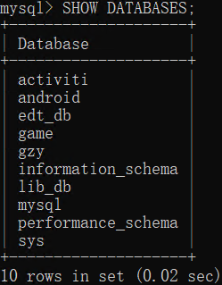

**二、查询当前数据库**

* 使用`SELECT DATABASE()`查询当前数据库

```bash
#进入数据库
USE edt_db;
#查询当前数据库
SELECT DATABASE();
```

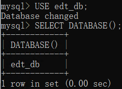

## 进入使用数据库

**一、进入使用数据库**

* 使用`USE`关键字实现

```bash
USE edt_db;
```

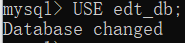

## 创建数据库操作

**一、创建数据库**

* 使用`CREATE DATABASE`关键字创建数据库
* 格式：`CREATE DATABASE [IF NOT EXISTS] 数据库名 [字符集] [排序规则]` 

```bash
CREATE DATABASE mydb
```

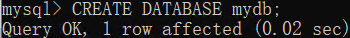

## 删除数据库

**一、删除数据库**

* 使用`DROP DATABASE`实现
* `DROP DATABASE [IF EXISTS] 数据库名`

```bash
DROP DATABASE mydb;
```

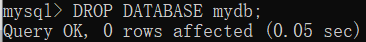

# 表的相关操作

## 查询表

**一、查询当前数据库的所有表**

* 使用`SHOW TABLES`实现

```bash
#进入某个数据库
USE edt_db
#查询所有表
SHOW TABLES;
```

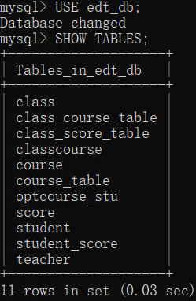

**二、查询表结构**

* 使用`DESC`实现

```bash
#进入某个数据库
USE edt_db
#查询表结构
DESC user;
```

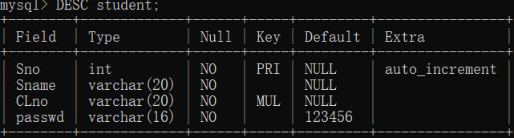

**三、查询指定表的建表语句**

* 使用`SHOW CREATE TABLE`实现

```bash
#进入某个数据库
USE edt_db
#查询建表语句
SHOW CREATE TABLE student;
```

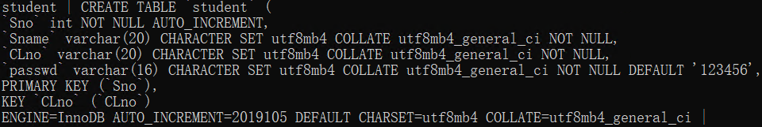

## MySQL数据库数据类型

**一、数值类型**

| 类型     | 字节占用数 | 描述         |
| -------- | ---------- | ------------ |
| TINYINT  | 1          | 小小整数     |
| SMALLINT | 2          | 小整数       |
| INT      | 4          | 整数         |
| BIGINT   | 8          | 加长整数     |
| FLOAT    | 4          | 单精度浮点数 |
| DOUBLE   | 8          | 双精度浮点数 |

**二、字符串类型**

| 类型    | 大小可选范围 | 描述                             |
| ------- | ------------ | -------------------------------- |
| CHAR    | 0~255        | 定长字符串，性能快但可能耗费空间 |
| VARCHAR | 0~65535      | 变长字符串，性能较慢但节省空间   |
| BLOB    | 0~65535      | 二进制数据                       |
| TEXT    | 0~65535      | 长文本数据                       |

**三、日期类型**

| 类型      | 大小 | 时间范围              | 格式                | 描述       |
| --------- | ---- | --------------------- | ------------------- | ---------- |
| DATE      | 3    | 1000-01-01~999-12-31  | YYYY-MM-DD          | 日期       |
| TIME      | 3    | -838:59:59~838:59:59  | HH:MM:SS            | 时间       |
| YEAR      | 1    | 1901~2155             | YYYY-MM-DD HH:MM:SS | 日期与时间 |
| TIMESTAMP | 4    | 至2038-01-19 03:14:07 | YYYY-MM-DD HH:MM:SS | 时间戳     |

## 创建表

**一、创建表**

* 使用`CREATE TABLE`关键字创建表
* 格式：`CREATE TABLE 表名()[COMMENT ‘表注释’]; `
* 字段定义格式：`字段 类型 [comment '注释'];`
* 字段的定义除了最后一行不用加`,`其他行都要加

```sql
CREATE TABLE user(
    id int COMMENT "id序列",
    username varchar(10) COMMENT "姓名",	#限制长度为10
    age tinyint unsigned COMMENT "年龄",	#使用无符号小小整数
    gender char(1) comment "性别",		#性别使用定长字符串
    idcard char(18) comment "身份证",		#使用定长字符串
    entrydate date comment "入职时间"		#使用date类型
)COMMENT "员工表";
```

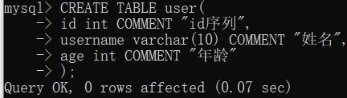

## 修改表的字段

* 使用`ALTER TABLE`修改表

**一、添加字段**

* 格式：`ALTER TABLE 表名 ADD 字段名 类型 [COMMENT 注释];`

```sql
ALTER TABLE user ADD nickname varchar(50) COMMENT "昵称"; 
```

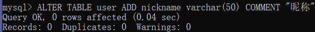

**二、修改字段的数据类型**

* 格式：`ALTER TABLE 表名 MODIFY 字段名 新数据类型[(长度)];`

```sql
ALTER TABLE user MODIFY nickname varchar(10);
```

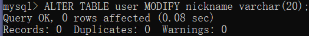

**三、修改字段名和字段数据类型**

* 格式：`ALTER TABLE 表名 CHANGE 旧字段名 新字段名 类型[(长度)] [COMMENT 注释] [约束];`

```sql
ALTER TABLE user CHANGE nickname newname varchar(40) COMMENT “修改字段属性”;
```

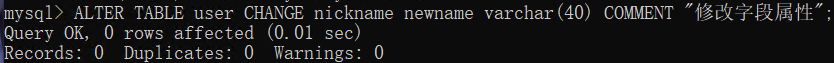

**四、删除字段**

* 格式：`ALTER TABLE 表名 DROP 字段名;`

```sql
ALTER TABLE user DROP newname;
```

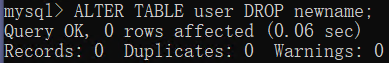

**五、修改表名**

* 格式：`ALTER TABLE 表名 RENAME TO 新表名;`

```sql
ALTER TABLE user DROP users;
```

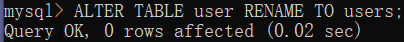

## 删除表

**一、删除表**

* 格式：`DROP TABLE 表名;`

```sql
DROP TABLE user;
```

**二、删除指定表的数据**

* 格式：`TRUNCATE TABLE 表名;`

```sql
TRUNCATE TABLE user;
```

# 数据的增删改（DML）

## 添加数据

**一、只给指定字段添加数据**

* 格式：`INSERT INTO 表名(字段1,字段2,...) VALUES(值1,值2,...);`

```sql
INSERT INTO student(Sno,Sname) VALUES(2019201,"张三");
```

**二、给所有字段添加数据**

* 格式：`INSERT INTO 表名 VALUSE(值1,值2,...)`

```sql
INSERT INTO student VALUES(2019202,"李四",102,22222);
```

**三、批量添加数据**

* 方法1：`INSERT INTO 表名(字段1,字段2,...) VALUES(值1,值2,...),(值1,值2,...),...`
* 方法2：`INSERT INTO 表名 VALUES(值1,值2,...),(值1,值2,...),...`

**四、注意事项**

* 插入数据时，指定的字段顺序要与值的顺序是一一对应的
* 字符串和日期类型数据应包含在引号中
* 插入的数据大小应该在字段规定范围内

## 修改数据

**一、修改数据**

* 格式：`UPDATE 表名 SET 字段1=值1,字段2=值2,... [WHERE 条件];`
* 不写`WHERE`表示会更新整张表的数据

```sql
UPDATE student SET Sname="王五" WHERE Sno=2019201;
```

## 删除数据

**一、删除数据**

* 格式：`DELETE FROM 表名 [WHERE];`
* 不加`WHERE`会删除所有数据

```sql
DELETE FROM student WHERE Sno=20190101;
```

# 数据的查询（DQL）

## 数据查询的语法结构

```sql
SELECT
	查询属性
FROM
	表
WHERE
	查询条件
GROUP BY
	分组条件
HAVING
	分组后的查询条件
ORDER BY
	排序方式
LIMIT
	分页参数
```

## 基本查询

**一、查询多个字段**

* 格式：`SELECT 字段1,字段2 FROM 表;`

```sql
SELECT Sno,Sname FROM student;
```

**二、查询所有字段**

* 格式：`SELECT * FROM 表;`

```sql
SELECT * FROM student;
```

**三、去粗重复记录**

* 格式：`SELECT DISTINCT 字段1,字段2 FROM 表;`

```sql
SELECT DISTINCT CLno FROM student;
```

**四、设置别名**

* `SELECT 字段1[AS 别名],字段2[AS 别名] FROM 表;`
* 设置别名后，返回的字段为设置的别名

```sql
SELECT DISTINCT Sname AS name FROM student;
```

## 条件查询

**一、条件查询**

* 格式：`SELECT 字段,... FROM 表名 WHERE 条件语句;`

```sql
SELECT Sno FROM student WHERE Sno=2019101;
SELECT * FROM student WHERE Sage BETWEEN 15 AND 20;
SELECT * FROM student WHERE Sage IN(15,16,17);
SELECT * FROM student WHERE Sname Like '_三';
```

**二、常见的条件语句**

| 比较运算符      | 功能                               |
| --------------- | ---------------------------------- |
| >               | 大于                               |
| >=              | 大于等于                           |
| <               | 小于                               |
| <=              | 小于等于                           |
| =               | 等于                               |
| <>或!=          | 不等于                             |
| BETWEEN A AND B | 在[A,B]范围内                      |
| IN(...)         | 在某范围内                         |
| LIKE            | 匹配字符串，常用`_`和`%`作为占位符 |
| IS NULL         | 是NULL                             |

| 逻辑运算符 | 功能 |
| ---------- | ---- |
| AND 或 &&  | 与   |
| OR 或 \|\| | 或   |
| NOT 或 ！  | 非   |

## 聚合查询

**一、常见的聚合函数**

| 函数  | 功能           |
| ----- | -------------- |
| count | 统计非NULL数量 |
| max   | 最大值         |
| min   | 最小值         |
| avg   | 平均值         |
| sum   | 求和           |

**二、统计函数的使用**

* 不统计`NULL`值
* 格式：`SELECT COUNT(字段) FROM 表; `

```sql
SELECT COUNT(*) FROM student;
```

**二、最大值函数的使用**

* 格式：`SELECT MAX(字段) FROM 表;`

```sql
SELECT MAX(Sage) FROM student;
```

**三、最小值函数的使用**

* 格式：`SELECT MIN(字段) FROM 表;`

```sql
SELECT MIN(Sage) FROM student;
```

**四、求和函数的使用**

* 格式：`SELECT SUM(字段) FROM 表;`

```sql
SELECT SUM(Sage) FROM 表;
```

**五、求平均函数的使用**

* 格式：`SELECT AVG(字段) FROM 表;`

```sql
SELECT AVG(字段) FROM 表;
```

## 分组查询

**一、基本的分组查询**

* `GROUP BY`后面填分组的依据字段

* 格式：`SELECT 字段,... FROM 表 GROUP BY 字段`

```sql
SELECT CLno,COUNT(CLno) FROM student GROUP BY CLno;
```

**二、含where的分组查询**

* where在分组之前先对数据进行过滤

```sql
SELECT CLno,COUNT(*) FROM student where Sage > 15 GROUP BY CLno;
```

**三、含having的分组查询**

* having在分组之后，以组为单位对组进行过滤
* 经常配合聚合函数和别名使用使用
* 执行顺序：`WHERE`过滤->分组->聚合函数->`HAVING`过滤

```sql
SELECT CLno,COUNT(*) address_count FROM student 
where Sage > 15
GROUP BY CLno 
HAVING address_count>1;
```

### where与having的区别

* 执行的时机不同
  * where是分组之前对数据进行过滤，不满足where不参与分组
  * having是分组后对组进行过滤
* 判断条件不同
  * where不能对聚合函数进行判断，而having可以

## 排序查询

**一、排序方式**

* `ASC`：升序
* `DESC`：降序

**二、排序查询**

* 格式：`SELECT 字段列表 FROM 表 ORDER BY 字段1 排序方式1,字段2 排序方式2`
* 多字段排序：第一个字段排序完后如果存在相同，就按照第二个字段排序
* 默认排序方式为`ASC`升序

```SQL
SELECT * FROM student ORDER BY Sage DESC;
```

## 分页查询

**一、分页查询**

* 格式：`SELECT 字段 FROM 表 LIMIT 起始索引,查询数量;`

```sql
#访问第二页的数据
SELECT * FROM student LIMIT 3,3;
```

**二、起始索引**

* 起始索引从0开始
* 起始索引=(查询页码-1)*每页记录数
* 分页查询在不同的数据库有不同的实现，MySQL中的关键字是`LIMIT`
* 查询第一页数据，起始索引可以省略，即`LIMIT 10`

## DQL查询语句执行顺序

```sql
FROM			--查询表
WHERE			--对数据初筛选
GROUP BY		--根据字段分组
HAVING			--对分组进行筛选
SELECT			--查询数据
ORDER BY		--根据字段排序
LIMIT			--通过分页获取部分数据
```

# 访问权限管理（DCL）

## 管理用户

**一、查询用户**

* 用户数据存放在`mysql`数据库里的`user`表

```sql
USE mysql;
SELECT * FROM user;
```

**二、创建用户**

* 格式：`CREATE USER '用户名'@'主机名' IDENTIFIED BY '密码';`
* 用户名，主机名和密码最好要有`''`进行转译

```sql
CREATE USER 'demo'@'127.0.0.1' IDENTIFIED BY '123456';
```

**三、修改用户密码**

* 格式：`ALTER USER '用户名'@'主机名' IDENTIFIED WITH mysql_native_password BY '新密码'`

* 用户名，主机名和密码最好要有`''`进行转译

```sql
ALTER USER 'demo'@'127.0.0.1' IDENTIFIED WITH mysql_native_password BY 'aaaaaa';
```

**四、删除用户**

* 格式：`DROP USER '用户名'@'主机名'`

```sql
DROP USER 'demo'@'127.0.0.1'
```

## 权限控制

**一、常用的权限**

| 权限               | 说明                         |
| ------------------ | ---------------------------- |
| ALL,ALL PRIVILEGES | 所有权限                     |
| SELECT             | 查询数据                     |
| INSERT             | 插入数据                     |
| UPDATE             | 修改数据                     |
| DELETE             | 删除数据                     |
| ALTER              | 修改表，修改字段             |
| DROP               | 删除数据库，删除表，删除视图 |
| CREATE             | 创建数据库，创建表           |

**二、查询权限**

* 格式：`SHOW GRANTS FOR '用户名'@'主机名';`

```sql
SHOW GRANTS FOR 'demo'@'127.0.0.1';
```

**三、授予权限**

* 格式：`GRANT 权限列表 ON 数据库.表 TO '用户名'@'主机名';`

```sql
GRANT SELECT ON edt_db.student TO 'demo'@'127.0.0.1';
```

**四、撤销权限**

* 格式：`REVOKE 权限列表 ON 数据库.表名 FROM '用户名'@'主机名';`

```sql
REVOKE SELECT ON edt_db.student FROM 'demo'@'127.0.0.1'; 
```

# 函数

## 字符串函数

| 函数                     | 功能                                                     |
| ------------------------ | -------------------------------------------------------- |
| CONCAT(s1,s2,...)        | 字符串拼接                                               |
| LOWER(str)               | 字符串全部转为小写                                       |
| UPPER(str)               | 字符串全部转为大写                                       |
| LPAD(str,n,pad)          | 左填充，用字符串pad对str的左边进行填充，使str达到长度为n |
| RPAD(str,n,pad)          | 右填充，用字符串pad对str的右边进行填充，使str达到长度为n |
| TRIM(str)                | 去掉头部和尾部的空格                                     |
| SUBSTRING(str,start,len) | 返回字符串str从start位置起的len个长度的字符串            |

## 数值函数

| 函数       | 功能                           |
| ---------- | ------------------------------ |
| CEIL(x)    | 向上取整                       |
| FLOOR(x)   | 向下取整                       |
| MOD(x,y)   | 返回x/y的模                    |
| RAND()     | 返回0~1以内的随机数            |
| RPUND(x,y) | 获取x四舍五入的值，保留y位小数 |

## 日期函数

| 函数                  | 功能                     |
| --------------------- | ------------------------ |
| CURDATE()             | 返回当前日期             |
| CURTIME()             | 返回当前时间             |
| NOW()                 | 返回当前日期和时间       |
| YEAR(date)            | 获取指定date的年份       |
| DAY(date)             | 获取指定date的日期       |
| DATEDIFF(date1,date2) | 返回date1到date2间的天数 |

## <font color=red>流程函数</font>

bool值：可以通过比较式子获得

| 函数                                                       | 功能                                                         |
| ---------------------------------------------------------- | ------------------------------------------------------------ |
| IF(bool,t,f)                                               | bool为true则返回t值，否则返回f值                             |
| IF NULL(val1,val2)                                         | val1非空时，返回val1，否则返回val2                           |
| CASE WHEN [bool] THEN [result1] ELSE [default] END         | 如果bool为true则返回result1，否则返回default                 |
| CASE [field] WHEN [val1] THEN [result1] ELSE [default] END | 如果字段值为val1则返回result1，否则返回default值（可以有多个WHEN-THEN结构） |

```sql
#需求：查询学生的姓名和年龄，根据年龄返回是否成年
	#比较场景
SELECT 
	Sname,Sage,
	CASE WHEN Sage>=18 THEN '成年' ELSE '未成年' END AS '年龄情况'
FROM student;
#需求：查询emp表的员工姓名和工作地址，如果地址是(北京、上海)，那么返回一线，其他的返回二线
	#匹配场景
SELECT 
	name,
	CASE address WHEN '北京' THEN '一线' WHEN '上海' THEN '一线' ELSE '二线' END
FROM emp;
```

# 约束

## 约束的概述

**一、约束的作用**

* 约束是作用于表中字段上的规则，用于限制存储在表中的数据
* 目的：保证数据库中数据的正确、有效性和完整性

**二、约束的分类**

* 多个约束间用空格分开

| 约束     | 描述                                               | 关键字      |
| -------- | -------------------------------------------------- | ----------- |
| 非空约束 | 限制该字段的数据不为null                           | NOT NULL    |
| 唯一约束 | 保证字段的所有数据唯一、不重复                     | UNIQUE      |
| 主键约束 | 主键是一行数据的唯一标识，要求非空且唯一           | PRIMARY KEY |
| 默认约束 | 保存数据时，如果未指定该字段的值，则采用默认值     | DEFAULT     |
| 检查约束 | 保证字段值满足某个值                               | CHECK       |
| 外键约束 | 用于让两张表之间建立连接，保证数据的一致性和完整性 | FOREIGN KEY |

## 约束的使用

**一、根据需求使用约束**

| 字段名 | 字段含义   | 字段类型    | 约束条件               | 约束关键字                 |
| ------ | ---------- | ----------- | ---------------------- | -------------------------- |
| id     | ID唯一标识 | int         | 主键，自动增长         | PRIMARY KEY,AUTO_INCREMENT |
| name   | 姓名       | varchar(10) | 非空，唯一             | NOT NULL,UNIQUE            |
| age    | 年龄       | int         | 大于0，并且小于等于120 | CHECK                      |
| status | 状态       | char(1)     | 没有指定值，默认为1    | DEFAULT                    |
| gender | 性别       | char(1)     | 无约束                 |                            |

```sql
#字段的定义格式：字段名 属性 约束（多个约束用空格相隔） 注释
CREATE TABLE user(
	id int PRIMARY KEY AUTO_INCREMENT,		#id，设置主键
	name varchar(10) NOT NULL UNIQUE,		#姓名
	age int CHECK(age>0 && age<=120),		#年龄
	status char(1) DEFAULT(1),				#状态
	gender char(1)							#性别
) COMMENT '用户表';
```

## 外键约束

**一、建立外键约束**

* 用于让两张表之间建立连接，保证数据的一致性和完整性

* 建议将所有表构建完后再添加外键
* `constraint`：约束

* 格式：`ALTER TABLE 表名 ADD CONSTRAINT 外键名 FOREIGN KEY(本表外键字段) REFERENCES 外表(外表字段)`

```sql
ALTER TABLE student							#修改student表
ADD CONSTRAINT fk_CLno FOREIGN KEY(CLno)	#设置student表的CLno为外键
REFERENCES class(CLno);						#外键引用class表的CLno的值
```

**二、删除外键约束**

* 格式：`ALTER TABLE 表 DROP FOREIGN KEY 外键;`
* 删除外键删除的是约束，不会删除数据

```sql
ALTER TABLE student DROP FOREIGN KEY CLno;
```

## 添加外键删除和更新行为

**一、外键删除/更新行为控制**

* 当父表有数据变化时才会触发

| 行为                 | 说明                                                         |
| -------------------- | ------------------------------------------------------------ |
| NO ACTION / RESTRICT | 当父表更新、删除数据时，子表不允许更新、删除数据             |
| CASCADE              | 当父表更新、删除数据时，子表则一同更新、删除数据外键数据     |
| SET NULL             | 当父表删除数据时，子表中外键值设为null                       |
| SET DEFAULT          | 父表有数据变更时，子表将外键列设置为一个默认值（Innodb引擎不支持） |

**二、设置外键格式**

* 不要双向设置外键

```sql
ALTER TABLE 表名
ADD CONSTRAINT 外键名称
FOREIGN KEY(表内外键字段)
REFERENCES 父表名(父表引用字段);
```

**三、构建外键并设置数据修改删除行为**

```sql
ALTER TABLE 表名
ADD CONSTRAINT 外键名称
FOREIGN KEY(外键字段)
REFERENCES 父表名(父表引用字段)
ON UPDATE 行为
ON DELETE 行为;
```

# 多表查询

## 多表关系

**一、一对多关系(1:n)**

* 案例：一个部门有多个员工
* 实现：在n的一方建立外键指向1的一方的主键

**二、多对多关系(n:n)**

* 案例：学生与课程关系
* 实现：建立第三张中间表，中间表至少包含两个外键，分别关联两方的主键

**三、一对一关系(1:1)**

* 案例：公司与老板
* 实现：在任意一方加入外键，关联另一方的主键，<font color=red>并设置外键唯一</font>

## 多表查询概述

**一、笛卡尔积**

* 集合A与集合B的所有组合情况
* 多表查询时需要通过关联消除无效的笛卡尔积

**二、多表查询分类**

* 连接查询
  * 内连接：查询两表交集部分数据（如果外键数据为空，则查询不到）
  * 外连接：查询某个表的所有数据，以及两表交集部分数据
  * 自连接：表与自身连接查询，自连接需要使用表的别名
* 子查询

**三、交集与不交集的判断**

* 交集数据：外键非空
* 不交集的数据：外键为空

## 内连接

**一、隐式内连接**

* 格式：`SELECT 字段列表 FROM 表1,表2 WHERE 条件;`
* 在`FROM`后面定义别名，<font color=red>定义了别名后，整条`SQL`语句只能使用别名</font>

```sql
#无使用别名
SELECT * FROM student,class WHERE student.CLno=class.CLno;
#使用别名
SELECT s.Sno,s.Sname,c.CLno,c.Num	#使用别名
FROM student s,class c 				#定义别名
WHERE st.CLno=c.CLno;				#WHERE要使用别名
```

**二、显式内连接**

* 格式：`SELECT 字段 FROM 表1 [INNER] JOIN 表2 ON 连接条件`

* `[INNER]`关键字可省略

```sql
SELECT s.Sno,s.Sname,c.CLno,c.Num	#筛选字段
FROM student s 						#主表
INNER JOIN class c 					#加入从表
ON s.CLno=c.CLno;					#连接条件
```

## 外连接

**一、左外连接**

* 格式：`SELECT 字段列表 FROM 表1 LEFT [OUTER] JOIN 表2 ON 条件;`
* 包含左表（表1）所有数据和右表（表2）交集的数据
* 可以使用别名

```sql
#不使用别名
SELECT * FROM student LEFT JOIN class ON student.CLno=class.CLno;
#使用别名
SELECT * FROM student s LEFT JOIN class c ON s.CLno=c.CLno;
```

**二、右外连接**

* 格式：`SELECT 字段列表 FROM 表1 RIGHT [OUTER] JOIN 表2 ON 条件;`

* 包含右表（表2）所有数据和左表（表1）交集的数据
* 可以使用别名

```sql
#不使用别名
SELECT * FROM student RIGHT JOIN class ON student.CLno=class.CLno;
#使用别名
SELECT * FROM student s RIGHT JOIN class c ON s.CLno=c.CLno;
```

## 自连接

**一、自连接**

* 自连接必须使用别名

* 格式：`SELECT 字段列表 FROM 表A 别名A JOIN 表A 别名B ON 条件`

```sql
#需求：在职员表中，查询员工及其所属领导的名字（员工和领导都在职员表内）
SELECT a.name,b.name
from emp a 
LEFT HOIN emp b 
ON a.managerid=b.id;
```

## 联合查询

**一、联合查询**

* 合并多次查询的结果，形成一个新的查询结果集
* 要求：<font color=red>多次查询的字段列数要保持一致，字段类型也要保持一致</font>

* 使用关键字`UNION`合并结果集
* `ALL`关键字不会对结果集去重复

```sql
SELECT 字段 列表 FROM 表A ...
UNION [ALL]
SELECT 字段列表 FROM 表B ...
```

```sql
#需求：查询工资低于5000的员工和年龄大于50的员工
SELECT * FROM emp WHERE salary <5000
UNION	#需要去重复
SELECT * FROM emp WHERE age >50;
```

# 子查询

## 子查询概念

**一、子查询**

* 概念：在查询语句中嵌套查询语句

**二、子程序的结果**

* 标量子程序：子程序结果为1个值
* 列子查询：查询结果为1列
* 行子查询：查询结果为1行
* 表子程序：查询结果为多行多列

**三、子程序可以出现的位置**

* `WHERE`之后
* `FROM`之后
* `SELECT`之后

## 标量子查询

**一、标量子查询**

* 返回的结果是单个值
* 常用比较符：=,!=,>,<,>=,<=

```sql
#需求：查询销售部的所有员工消息
#步骤：  1、查询销售部的id
#		2、查询销售不的所有员工消息
SELECT * FROM emp WHERE dept_id=(
	SELECT id FROM dept WHERE name='销售部'
);
```

## 列子查询

**一、列子查询常用操作符**

| 操作符 | 描述                                                         |
| ------ | ------------------------------------------------------------ |
| IN     | 在指定的集合范围之内                                         |
| NOT IN | 不在指定的集合范围之内                                       |
| ANY    | 只需比较子查询返回列表的某些元素（存在可以让比较式返回真的元素则返回真） |
| SOME   | 与ANY一样                                                    |
| ALL    | 需要比较子查询返回列表的所有元素                             |

**二、列子查询**

* 子查询查询某列多个元素（涉及多行）

```sql
#查询销售部和市场部的所有员工信息
SELECT *FROM emp						#查询员工信息
WHERE dept_id IN(						#要求员工信息为列集合的元素之一
	SELECT id FROM dept 				#筛选部门id（获取列元素）
    WHERE name='销售部' OR name='市场部'	#获取销售部和市场部的id
);
#查询比研发部任意一人工资高的员工工资
SELECT * FROM emp WHERE salary > ANY (	#工资高于研发部最小工资则比较式为真
	SELECT salary FROM emp				#根据研发部id筛选研发部所有人的工资
    WHERE dept_id=3						#研发部id
);
```

## 行子查询

**一、常用操作符**

* =：等于
* <>：不等于
* IN：满足
* NOT IN：不满足

**二、行子查询**

* 需要使用`( )`实现行比较
* 返回某一行的多个列元素

```sql
#查询与张三的薪资和直属领导相同的员工信息
SELECT * FROM emp WHERE (salary,managerid)=(
	SELECT salary,managerid FROM emp
    WHERE name='张三'
);
```

## 表子查询

**一、表子查询**

* 查询得到表

* 常用操作符：IN
* 查询结果可以用作临时表放在WHERE后面，通过别名调用

```sql
#查询和张三、李四的职位和工资相同的员工信息
SELECT * FROM emp WHERE (job,salary) IN(
	SELECT job,salary FROM emp
    WHERE name='张三' OR name='李四'
);
```

# 事务

## 事务相关概念

**一、事务**

* 事务是一组操作集合，这些操作要么同时成功，要么同时失败

## 事务相关操作

**一、开启事务**

```sql
BEGIN;
```

**二、提交事务**

* 事务操作正常时提交

```sql
COMMIT;
```

**三、回滚事务**

* 事务异常时回滚
* <font color=red>不能与`COMMIT`同时出现</font>

```sql
ROLLBACK;
```

## 事务的ACID特性

**一、ACID特性**

* 原子性：事务要么完成要么不完成，不完成要恢复到事务开始前的状态

* 一致性：事务开始之前和事务结束之后数据库的完整性没有被破坏

* 隔离性：允许多个并发事务对事务进行读写和修改，事务之间相互隔离（读锁写锁解决并发问题）

* 持久性：事务提交或回滚后对数据的修改是永久的

## 并发事务引发的问题

**一、并发事务问题**

| 问题       | 描述                                                         |
| ---------- | ------------------------------------------------------------ |
| 丢失更新   | 最后的更新覆盖了其他事务之前的更新，而事务之间不知道发生了更新丢失 |
| 脏读       | 一个事务读取到另一个事务还没提交的数据                       |
| 不可重复读 | 一个事务先后读取同一条记录，但两次读取的数据不同（执行过程中数据被修改了） |
| 幻读       | 查询数据时没有对应行，插入行时插入失败，再查询时没有对应行<br>(通过快照解决不可重复读之后会引发的并发问题，删除也可引发幻读) |

## 事务隔离级别与解决并发问题

**一、事务隔离级别**

* `Read uncommitted`：读，未提交
  * 一个事务已经开始写数据，则另外一个事务不允许同时进行写操作，但允许其他事务读此行数据
  * 使用读写锁可实现
  * 解决了更新丢失
  * 执行效率最高
* `Read committed`：读，已提交，oracle默认隔离级别
  * 读数据时允许其他事务读写，写数据时禁止其他事务访问该数据
* `Repeatable Read`：可重复读，mysql默认隔离级别
  * 执行事务访问数据时禁止其他事务访问该数据
* `Serializable`：串行化处理
  * 事务只能一个一个顺序执行
  * 执行效率最低

**二、不同事务隔离级别可能出现的并发问题**

| 隔离级别         | 更新丢失 | 脏读   | 不可重复读 | 幻读   |
| ---------------- | -------- | ------ | ---------- | ------ |
| Read uncommitted | 不存在   | 存在   | 存在       | 存在   |
| Read committed   | 不存在   | 不存在 | 存在       | 存在   |
| Repeatable Read  | 不存在   | 不存在 | 不存在     | 存在   |
| Serializable     | 不存在   | 不存在 | 不存在     | 不存在 |

**三、查看隔离级别**

```sql
SELECT @@TRANSACTION_ISOLATION;
```

**四、修改隔离级别**

* `SESSION`选项作用于会话级别，只针对某次与数据库的连接
* `GLOBAL`选项作用于全局数据库
* 格式：`SET [SESSION|GOLBAL] TRANSACTION LEVEL [隔离级别];`

```sql
SET SESSION TRANSACTION LEVEL Serializable;
```


