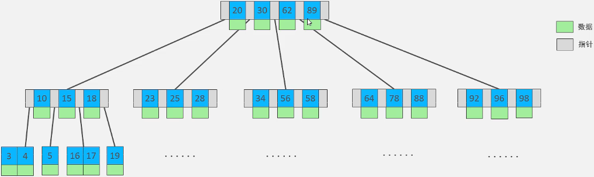
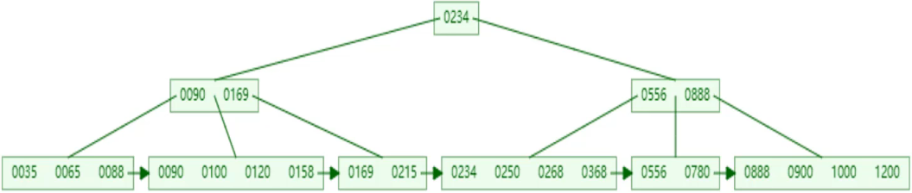
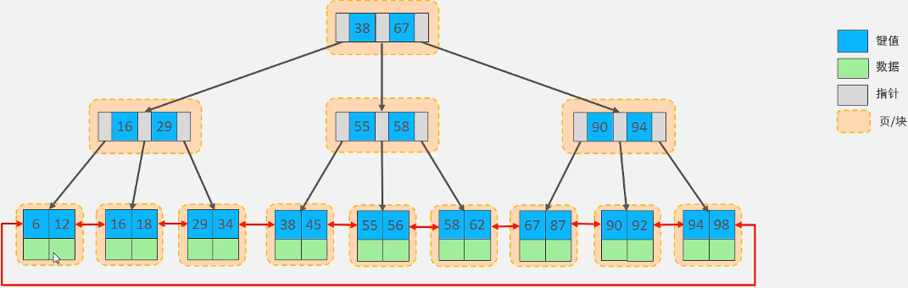
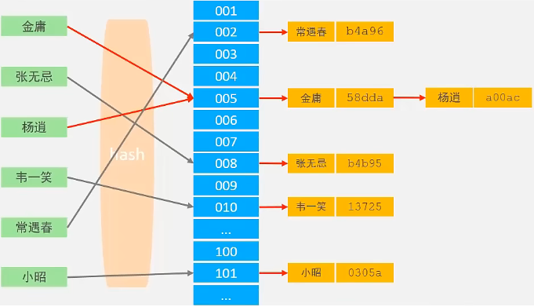
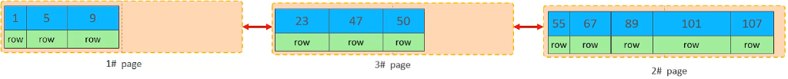

# MySQL体系结构

**一、连接层**

* 完成与用户连接的相关操作，包括连接处理、授权认证等。

**二、服务层**

* 处理大多数核心服务功能，包括SQL接口、缓存出现、SQL的分析与优化、内置函数的执行等

**三、引擎层**

* 负责MySQL中数据的存储与提取，服务器通过API和存储引擎通信
* 不同存储引擎有不同的功能，根据需求选择

**四、存储层**

* 将数据存储在文件系统里实现永久保存，并与存储引擎交互

# 存储引擎

## 存储引擎相关概念

**一、存储引擎**

* 存储引擎是存储数据、建立索引、更新/查询数据等功能的实现方式
* 存储引擎是基于表的，被称为表类型，每个表可以各自选择合适的存储引擎
* MySQL默认存储引擎为`InnoODB`
* 存储引擎建表后不能修改

**二、创建表时指定存储引擎**

```sql
CREATE TABLE 表名{
	字段以及属性
}ENGINE=INNODB;
```

**三、查询支持的存储引擎**

```sql
SHOW ENGINES;
```

##  InnoDB存储引擎

**一、InnoDB**

* 是一种兼顾高性能、高可靠性的通用存储引擎

**二、InnoDB特点**

* DML语句操作遵循ACID模型，支持事务
* 行级锁，提高并发访问性能
* 支持外键约束，保证数据的完整性和正确性

**三、InnoDB存储文件**

* 文件格式为`.idb`

* 存储了表结构、表数据、索引
* 逻辑结构：表->段->区->页->行

## MyISAM

**一、MyISAM**

* MySQL早期默认存储引擎

**二、MyISAM特点**

* 不支持事务，不支持外键
* 支持表锁，不支持行锁
* 访问速度快

**三、MyISAM存储文件**

* `.sdi`：存储表结构信息
* `.MYD`：存储数据
* `.MYI`：存储索引

## Memory

**一、Memory**

* 表数据存储在内存中，只能作临时表或缓存使用

**二、特点**

* 内存存放数据，访问速度极快
* 支持hash索引

**三、Memory结构文件**

* `.sdi`：存储表结构消息

## 不同存储引擎的特点总结

| 特点         | InnoDB | MyISAM | Memory |
| ------------ | ------ | ------ | ------ |
| 存储限制     | 64TB   | 有     | 有     |
| 事务安全     | 支持   |        |        |
| 锁进制       | 行锁   | 表锁   | 表锁   |
| B+tree索引   | 支持   | 支持   | 支持   |
| hash索引     |        |        | 支持   |
| 全文索引     | 支持   | 支持   |        |
| 空间使用     | 高     | 低     |        |
| 内存使用     | 高     | 低     | 中等   |
| 批量插入速度 | 低     | 高     | 高     |
| 支持外键     | 支持   |        |        |

## 存储引擎的选择

| 引擎   | 场景                                                         |
| ------ | ------------------------------------------------------------ |
| InnoDB | 支持事务、外键，并发条件下要求数据的一致性的场景<br>存在很多的更新、删除操作的表建议使用InnoDB引擎 |
| MyISAM | 以读操作和插入操作为主，只有很少的更新和删除操作，对事务的完整性、并发性要求不高 |
| MEMORY | 数据存储在内存中，访问速度快，常用于临时表和缓存，对表的大小有限制<br>无法保障数据的安全性 |

# 索引

## 索引相关概念

**一、索引**

* 用于辅佐MySQL高效获取数据的数据结构

**二、索引的特点**

* 提高数据的检索效率，降低数据库IO成本
* 通过索引继续排序，降低数据排序的成本，降低CPU的消耗

**三、索引的缺点**

* 索引需要占用存储空间
* 降低了增删改数据的速度

**四、数据结构演示网站**

[数据结构演示网站](https://www.cs.usfca.edu/~galles/visualization/Algorithms.html)

## 索引的数据结构

**一、索引结构**

| 索引结构              | 描述                                                         |
| --------------------- | ------------------------------------------------------------ |
| B+Tree索引            | 常用的索引类型，大部分引擎支持B+树索引                       |
| Hash索引              | 底层用哈希表实现，占用精确匹配索引列的查询有效<br>不支持范围查询 |
| R-tree（空间索引）    | 空间索引是MyISAM引擎的特殊索引类型，用于地理空间数据类型     |
| Full-text（全文索引） | 通过建立倒排索引，快速匹配文档                               |

**二、索引支持情况**

| 索引类型  | InniDB | MyISAM | Mwmory |
| --------- | ------ | ------ | ------ |
| B+tree    | 支持   | 支持   | 支持   |
| Hash      | 不支持 | 不支持 | 支持   |
| R-tree    | 不支持 | 支持   | 不支持 |
| Full-text | 支持   | 支持   | 不支持 |

## B-tree数据结构

**一、B-tree**

* 多路平衡查找树
* 若一棵B-tree的最大度数为5，则每个节点最多存储4个key，5个指针（度数表示一个节点最多5个子节点）
* 指针的个数由key的个数决定（n+1），每个指针指向由key划分的子节点
* 所有的节点都用于存储数据
* 示例：第1个指针指向小于20的子节点，第2个指针指向大于20且小于30的子节点，由此类推（假设key与数据相同）
* [B-tree数据结构演示](https://www.bilibili.com/video/BV1Kr4y1i7ru?p=68&spm_id_from=pageDriver&vd_source=52e83307931ccdd99f956bc100bcc5b1)



## B+tree数据结构

**一、B+tree**

* 基于B树结构的改造
* 叶子节点用于存储数据，非叶子节点部分存储索引（与B树不同之处）
* 叶子节点形成一个单向列表
* 相对于B树，B+树能够在索引存储空间一定的情况下能够存放更多索引，树的层级更低（B树节点数据和索引都存储）
* 示例：度数为5的B+树，每个节点最多存储4个元素



**二、MySQL对B+树优化**

* 在B+树的基础上，将叶子节点的单向链表结构变成了双向链表结构，形成带有双向顺序的B+树结构
* 提高了区间访问的性能
* 示例：度数为3的B+树，每个节点最多存储2个元素



## 索引结构

**一、Hash索引**

* 哈希索引采用一定的hash算法，将键值换算成新的hash值，映射到对应的槽位上，然后存储到hash表中
* 如果产生了hash冲突，可以通过链表来横向扩展槽位



**二、哈希索引的特点**

* 只能用于等值比较，不支持范围查询
* 无法利用索引完成排序
* 查询效率高，只需检索一次即可，效率通常高于B+tree树索引

**三、存储引擎的支持**

* Memory引擎支持hash索引
* InnoDB有自适应hash功能，指定条件下自动构建

## 索引选择相关问题

**一、为什么InnoDB存储引擎选择B+tree结构**

* 搜索二叉树结构顺序插入时会形成一个链表，层数非常高效率低下（基于搜索二叉树的树结构都有此问题）
* B+树会根据值的情况自适应分裂层数，加上每个节点可存储多个索引极大降低了树的层数，提高了搜索效率
* 对于B-tree，所有节点都要保存数据，导致一定存储空间下存储的索引比B+tree小，导致层数不得不比B+树高，降低了搜索的效率
* Hash索引只支持等值匹配，不支持范围索引和排序索引

## 索引的分类

**一、常规分类**

| 分类     | 含义                                     | 特点               | 关键字   |
| -------- | ---------------------------------------- | ------------------ | -------- |
| 主键索引 | 针对主键的索引                           | 自动创建，只有一个 | PRIMARY  |
| 唯一索引 | 避免值重复的索引                         | 可以有多个         | UNIQUE   |
| 常规索引 | 快速得特定数据                           | 可以有多个         |          |
| 全文索引 | 全文检索查找文中的关键词，不是比较索引值 | 可以有多个         | FULLTEXT |

**二、InnoDB引擎索引分类**

* 根据索引的存储形式分类

| 分类     | 含义                                                         | 特点            |
| -------- | ------------------------------------------------------------ | --------------- |
| 聚集索引 | 将数据存储与索引放在一起<br>索引结构的叶子节点保存了行数据（B+tree） | 必须有且只有1个 |
| 二级索引 | 数据与索引分开存储<br>叶子节点存储行对应的主键的值（B+tree） | 可以有多个      |

**三、InnoDB索引选取规则**

* 如果存在主键，主键索引技术聚集索引
* 如果不存在主键，将第一个唯一`UNIQUE`索引转为聚集索引
* 如果没有主键且没有唯一索引，则InnoDB自动生成一个rowid作为隐藏的聚集索引

**四、二级索引**

* 常用于非主键字段的索引
* 回表查询：先在二级索引搜索符合条件的主键，然后根据主键在聚集索引搜索行
* 示例：`select * from user where name="arm";`
  * 先在name的二级索引搜索符合条件的主键
  * 然后根据主键在聚集索引中获取行

```sql
#执行效率比较
select * from user where name="arm";
select * from user where id=12;
#2的效率比1高，2只需查聚集函数，而1需要查二级索引然后才能查聚集索引
```

## 不同类型索引的创建语法

**一、创建索引**

* 格式：`CREATE [UNIQUE|FULLTEXT] INDEX 索引名 ON 表(字段,...);`
* 联合索引针对多个字段值作为条件的查询语句

```sql
#在user表中创建name的索引
CREATE INDEX idx_user_name ON user(name);
#创建唯一索引
CREATE UNIQUE INDEX idx_user_id ON user(id);
#创建联合索引
CREATE UNIQUE INDEX idx_user_id ON user(id,name);
```

**二、查看索引**

* 格式：`SHOW INDEX FROM 表名;`

**三、删除索引**

* 格式：`DROP INDEX 索引名 ON 表;`

# 索引使用规则

## 单列索引与联合索引

**一、单列索引**

* 索引只包含1列

**二、联合索引**

* 索引包含多列
* SQL语句如果存在多个查询条件，需要考虑索引联合索引
* 多条件查询时，MySQL优化器会评估哪个字段的索引效率高
* 使用联合索引时需要考虑最左前缀法则

## 最左前缀法则

**一、最左前缀法则（联合索引使用法则）**

* 如果索引了多列，要遵守最左前缀法则
* 法则：使用联合索引从最左列的字段开始，并且不跳过索引中的字段
* <font color=red>查询语句如果不存在联合索引的某些字段，索引将部分失效</font>（后面的字段失效，前面的没影响）
* <font color=red>查询语句如果使用了没有=的范围查询，则联合索引右边的列将失效</font>
* 查询语句条件字段的顺序不会影响最左前缀法则的使用，该法则针对的是联合索引的使用

## SQL提示

**一、SQL提示**

* 查询单列数据时，MySQL会倾向于使用联合索引，需要提示才会使用单列索引
* SQL提示只是会增加使用的可能性，最终使用MySQL有算法权衡（除了强制使用）

* SQL语句中加入一些人为的提示达到优化操作的目的

* SQL提示
  * `use index`：使用某个索引
  * `ignore index`：忽略某个索引
  * `force index`：强制使用某个使用

```sql
select * from student use index(idx_student_name) where Sname='张三';
```

## 覆盖索引与回表查询

**一、覆盖索引**

* 要查询的数据在一次索引中都能得到
* 二级索引也能够实现覆盖索引（查询的数据为主键和索引的键）
* 效率高

**二、回表查询**

* 至少需要查询两次索引，一次查二级索引获取主键，然后根据主键查剩下的数据
* 效率较低

**三、EXPLAIN中extra信息**

* `using index condition`：查找使用了索引，但需要回表查询
* `using where;using index`：查找索引了索引，不需要回表查询
* `NULL`：需要回表查询

## 前缀索引

**一、前缀索引**

* 当字段类型为字符串时，索引很长的字符串会让索引变得庞大低效
* 前缀索引：取字符串的一部分前缀建立索引，可以极大节约索引空间，提高索引效率

**二、构建前缀索引**

* 索引的选择性：不重复索引值和数据表的记录总数的比值
* 前缀长度越短，选择性越接近1，则性能和实用性越好

* 格式：`create index 索引名 on 表(字段(前缀长度));`

```sql
#求索引的选择性
select count(distinct email)/count(*) from user;
#测试前缀长度为10的选择性
select count(distinct substring(email,1,10))/count(*) from user;
```

## 索引设计原则

**一、需要建立索引的情况**

* 针对数据量大，查询频繁的表
* 常作为查询条件（where）、排序（order by）、分组（group by）操作的字段建立索引
* 选择区分度高的列作为索引，尽量建立唯一索引，区分度越高（性别区分度不高），效率快
* 对于大文本字符串数据需要建立前缀索引
* 尽量使用联合索引，减少单列索引，减少回表查询的概率
* 要控制索引的数量，索引越多维护代价越大
* 如果索引列不能存储NULL值，需要字段创建时使用`NOT NULL`进行约束

## 索引失效的情况

**一、函数运算操作**

* 在索引列上如果存在函数运算，则索引将失效

**二、字符串不加引号**

* 字符串类型字段使用时不加引号，索引将失效

**三、模糊查询**

* 尾部模糊匹配索引不会失效，头部模糊匹配，索引将失效

**四、OR连接条件**

* 一侧字段有索引，一侧字段无索引，则整条语句索引失效

**五、数据分布情况**

* 如果MySQL评估索引索引比全表更慢，则不使用索引
* 示例：如果字段大部分数据为NULL，则查询字段为NULL的行时使用全表扫描

# SQL性能分析

**一、获取不同类型SQL使用频率**

* 使用`SHOW [SESSION|GLOBAL] STATUS`获取数据库更删改查的频率次数
* 针对频率高的SQL进行优化，一般为查询

```sql
SHOW GLOBAL STATUS LIKE 'com_______';
```

**二、慢查询日志**

* 慢查询记录了执行时间超过指定参数的所有SQL语句
* 慢查询日志默认没有开启，需要在`my.cnf`文件里配置
* 可以考虑针对慢查询进行优化
* 慢查询日志在`/~/mysql/localhost-slow.log`

```my.cnf
#开启慢查询日志
slow_query_log=1
#数组慢日志的时间为2秒，记录执行时间超过2秒的SQL语句
long_query_time=2
```

**三、profile详情**

* show profiles输出SQL语句具体的耗时部分
* 需要数据库支持profile，查看数据库是否支持`SELECT @@have_profiling;`

* profiling默认关闭，需要开启

```sql
#开启profiling
SET profiling=1;
#查看每一条SQL耗时情况
show profiles;
#查看指定query_id的SQL语句耗时情况
show profile for query query_id;
#查看指定query_id的SQL语句CPU的使用情况
show profile cpu for query query_id;
```

**四、explain执行计划**

* 可以获取MySQL如何执行执行SELECT语句的信息，包括SELECT语句执行过程中表的连接和连接的顺序
* 格式：`explain SQL语句;`或`DESC SQL语句;`

```sql
#获取SQL语句执行计划
explain select * from user where id=1;
```

| 字段        | 含义                                                         |
| ----------- | ------------------------------------------------------------ |
| id          | select查询序列号，表示执行select语句或者操作表的顺序<br>id相同，执行顺序从上到下，id不同，值越大越先执行 |
| select_type | 表示SELECT的类型<br>SIMPLE：简单表<br>PRIMARY：主键查询<br>UNION：联合查询<br>SUBQUERY：子查询 |
| type        | 连接类型，性能由好到差为：<br/>NULL：不访问任何表<br>system：访问系统表<br/>const：访问主键、唯一索引元素<br/>eq_ref<br/>ref：访问非唯一索引<br/>range<br/>index：访问索引<br/>all：全表扫描 |
| key         | 实际使用的索引，如果为NULL则没有使用索引                     |
| Key_len     | 索引字段最大可能长度，不失去精度的情况下长度越短越好         |
| filtered    | 返回结果行数占需要读取行数的百分比，filtered的值越大越好（WHERE的命中率） |

# 页分裂和页合并

**一、页分裂**

* 当主键乱序插入时很容易产生页分裂
* 插入数据产生页分裂的情况下，页分裂的处理步骤
  * 新建一个页
  * 将要插入页的一半数据转移到新建的页里
  * 插入数据
  * 修改页之间的指针顺序




**二、页合并**

* 执行删除行操作时可能发生
* 删除一行数据时，实际数据没有被物理删除，只是被标记为删除，空间可以被其他数据使用
* 当某页删除的元素过半时，会发生页合并
  * MySQL检查后面的页是否有元素可以合并
  * 有则进行合并数据

# SQL优化

## 插入优化

**一、批量插入**

* 格式：`insert into 表 values(数据1),(数据2),...;`

**二、手动事务提交**

```sql
begin;
插入语句1
插入语句2
commit;
```

**三、主键顺序插入**

* 插入时按主键的顺序进行插入
* 主键顺序插入的性能高于主键乱序插入

**四、使用外部文件插入大批量数据**

```sql
#开启本地文件导入数据开关
set global local_infile=1;
#导入数据
load data local infile '文件路径'
into table '表名' 
fields teminated by '间隔符'
lines teminated by '分行符';
#示例
load data local infile './data.log'
into table 'user'
fields teminated by ','
lines teminated by '\n';
```

## 主键优化

**一、主键数据组织方式**

* InnoDB存储引擎里，表数据是根据主键顺序组织存放
* 数据库乱序插入时，会经常出现页分裂的情况导致插入效率极低

**二、主键优化原则**

* 满足业务的情况下，尽量降低主键的长度
* 插入数据时尽量选择顺序插入，选择使用AUTO_INCREMENT自增
* 不要使用自然主键（身份证）作为数据库主键，否则乱序插入下性能极低
* 业务操作时尽量避免修改主键

## order by优化

**一、扫描方式**

* `Using filesort`：通过索引或全表扫描获取数据，再通过排序获取有序数据，不是通过索引直接返回排序结果
* `Using index`：通过有序索引顺序扫描直接返回有序数据

**二、order by排序优化**

* 索引或联合索引优化`order by`排序语句
* 建立`order by`排序条件的索引，可以实现`Using index`扫描方式
* 使用联合索引优化排序时，必须在遵守最左前缀原则的基础上，条件的顺序还要与联合索引保持一致
* 查询的元素为非索引元素和主键元素，则会回表查询，扫描方式为`Using filesort`（尽量使用覆盖索引）

```sql
#假设已经有idx_user_age_phone索引
select id,age,phone from user order by age,phone;
```

**三、多字段排序的升降序问题**

* 索引默认`ASC`排序，索引`order by`一个升序一个降序时，会出现`Using filesort`情况
* 处理方式：创建索引并自定义排序方式

```sql
#创建索引并自定义排序方式
create index idx_user_age_phone on user(age asc,phone desc);
```

## group by优化

**一、分组方式**

* `Using temporaty`：使用临时表
* `Using index`：使用索引

**二、group by排序优化**

* 索引或联合索引优化`group by`排序语句
* 建立`group by`分组条件的索引，可以实现`Using index`扫描方式
* 需要满足最左前缀法则

```sql
#假设已经有idx_user_profession_age索引
select profession,age,count(*) from user group by profession,age;
```

**三、where过滤与分组的结合**

* 使用where过滤时，会使用一个索引字段，过滤后使用过的字段不再用于分组

```sql
#假设已经有idx_user_profession_age索引
select ag,count(*) from user where profession='软件工程' group by age;
```

## limit优化

**一、limit执行效率问题**

* 数据量越多，`limit`查询代价越大
* limit执行过程中先排序，再取需要的数据，性能极低

**二、limit优化**

* 创建索引，使用覆盖索引提高性能，提高覆盖索引加列子查询进行优化
* 优化思路：<font color=red>使用覆盖索引进行排序，然后获取一定数量的主键id，最后根据id进行表的内连接获取数据</font>
* mysql不支持limit子查询语句作为条件语句，只能作为数据来源语句，需要使用别名和表的内连接

```sql
#待优化sql语句
select * from product limit 0,10;
#使用覆盖索引和子查询优化sql语句
	#排序并筛选id的语句，使用了主键的覆盖索引，筛选10个id
select id from product order by id limit 9000,10;
	#优化后的sql语句
select * 
from product p,(select id from product order by id limit 9000,10) a
where p.id=a.id;			#使用了表的内连接
```

## count优化

**一、不同引擎的处理方式**

* `MyISAM`引擎会将一个表的总行数存在磁盘上，执行`count(*)`时直接返回该数据
* `InnoDB`引擎因为没有存储行数，所以需要全表扫描计数

**二、全表计数优化方式**

* 自己计数，比如所以redis

**三、非全表计数**

* 在计数同等数量的行时，效率由上到下越来越高

| 语句        | 处理情况                                                     |
| ----------- | ------------------------------------------------------------ |
| count(字段) | 没not null约束会全表筛选非空值<br/>有not null约束则和主键一样的处理 |
| count(主键) | InnoDB引擎会遍历整张表                                       |
| count(1)    | 遍历整张表但不取值，放数字进去，直接累加1<br>累加结果与数字无关，可以设0 |
| count(*)    | 遍历整张表但不取值，直接累加1                                |

## update优化

**一、update锁的使用**

* 字段没有索引，更新数据时会使用表锁
* 字段有索引，更新数据时会使用行锁

**二、update优化**

* 更新数据时，需要根据索引字段更新，否则会触发表锁

# 视图

## 视图的概念和基本语法

**一、视图**

* 是一种虚拟存在的表
* 视图只保存查询的SQL逻辑，不保存查询结果
* 视图相当于在from后面的表子查询

**二、创建视图**

* 创建格式：`CREATE [OR REPLACE] VIEW 视图名[(列表名)] AS SELECT语句;`
* 由于视图没有物理表，所以优化只能依靠引用的表，需要在引用的表建立合适的索引

```sql
#or replace用于替换重名视图
create or replace view stu as select id,name from student where id <=10;
```

**三、删除视图**

* 格式：`DROP VIEW [ID EXISTS] 视图名称;`

## 视图的更新与作用

**一、视图的更新问题**

* 视图要更新，要求视图中的行与基础表中的行要对应
* 存在一下关键字，则不能用视图更新数据
  * 聚集函数
  * `DISTINCT`
  * `GROUP BY`
  * `HAVING`
  * `UNION`

**二、视图的作用**

* 简化用户对数据的理解，经常被使用的查询可以定义为视图
* 提高安全性，通过视图用户只能查询和修改它们所能看到的数据

* 视图可以帮助用户屏蔽真实表结构变化带来的影响

## 视图的使用案例

**一、使用视图的需求**

* 为了保证数据库表的安全性，开发人员在操作用户表时，只能看到用户的基本字段，屏蔽敏感信息字段
* 定义视图简化多张表联查的操作

```sql
#保证数据库的安全性
create view user_view as select id,name,profession,age,gender,status from user;
#创建三表联查的视图
create view stu_course_view as					#创建表
select s.Sname,s.Sno,c,Cname					#查询字段
from student s, student_course sc, course c		#数据来源表
where s.id=sc.studentid and sc.courseid=c.id;	#表的连接
```

# 触发器

## 触发器的概念

**一、触发器**

* 在insert/update/delete之前或之后，触发并执行触发器中定义的SQL语句
* 触发器可用于协助应用在数据库端确保数据的完整性，日志记录，数据校验等操作
* 使用OLD和NEW来引用触发器中发生变化的记录内容，用于引用老数据或新数据

**二、触发器类型**

| 触发器类型   | NEW和OLD                                         |
| ------------ | ------------------------------------------------ |
| INSERT触发器 | NEW表锁将要新增数据                              |
| UPDATE触发器 | OLD表示修改之前的数据<br>NEW表示已经修改后的数据 |
| DELETE触发器 | OLD表示已经删除的数据                            |

## 创建触发器

**一、创建语法**

* `MySQL`数据库只支持行级触发器

```sql
CREATE TRIGGER 触发器名		#创建触发器
BEFORE / AFTER				#设置修改前触发还是修改后触发
INSERT / UPDATE / DELETE	#设置触发器类型
ON 表名						#作用于某张表
FOR EACH ROW 				#行级触发器
BEGIN
	相关sql语句;
END;
```

**二、查看所有触发器**

* 语法：`SHOW TRIGGERS`

**三、删除触发器**

* 语法：`DROP TRIGGER [数据库名]触发器名;`
* 没有指定数据库则默认当前数据库

## 触发器案例

* 使用`NEW`可以取更新之后的数据
* `OLD`可以取更新之前的数据

```sql
#表的数据变更时，需要将行为记录到数据变更日志(user_logs)中
create trigger user_insert_trigger	#创建触发器
after insert on user				#在user表插入数据后触发
for each row						#行级触发器
begin
	insert into user_logs(id,operation,operate_time) VALUES
	(null,'insert',now());			#id自增写null，now()获取当前时间
end;
```

# 锁

## 锁的分类

**一、锁的分类**

* 全局锁：锁定数据库所有表
* 表级锁：每次操作锁主整张表
* 行级锁：每次操作锁住对应的行数据

## 全局锁

**一、全局锁相关概念**

* 全局锁是对所有数据库的所有表加锁，加锁后所有表处于只读状态
* 使用场景：数据备份时需要加全局锁，保证数据的一致性

**二、数据库加全局锁的问题**

* 主库上备份，在备份期间不能执行更新，业务基本停摆
* 从库上备份，备份期间不能执行主库同步来的二进制日志，导致主从隔离

## 使用全局锁进行数据备份

```sql
#加入mysql会话加全局锁
flush tables with read lock;
#退出mysql会话进行数据备份，IP地址默认127.0.0.1
mysqldump -h IP地址 -uroot -p密码 数据库名 > 存放路径.sql
#加入mysql会话释放锁
unlock tables;
```

```shell
#InnoDB引擎不加全局锁的一致性数据备份
mysqldump --single-transaction -uroot -p密码 数据库名>存放路径.sql
```

## 表级锁

### 表级锁的分类

* 表锁
* 元数据锁
* 意向锁

### 表锁

**一、表锁的分类**

* 表共享读锁

* 表独占写锁

**二、表锁相关操作**

* 加锁：`lock tables 表名 read/write`

* 释放锁：`unlock tables`或者客户端断开连接

**三、读锁和写锁的特点**

* 读锁不会阻塞其他客户端的读，但会阻塞写
* 写锁既会阻塞其他客户端的读，又会阻塞其他客户端的写

### 元数据锁

**一、相关概念**

* 元数据锁加锁过程是系统自动控制，无需显式使用
* 主要用于维护表元数据的数据一致性，表上有活动事务时，不可对元数据进行写操作
* 避免了增删改操作与数据库操作的冲突，保证读写的正确性
* 进行增删改查时，MySQL自动加MDL读锁
* 变更表结构时，MySQL自动加MDL写锁

### 意向锁

**一、相关概念**

* 引入意向锁使得表锁不用检查每行数据是否加锁，使用意向锁减少表锁的检查

* 避免DML在执行时出现行锁与表锁的冲突

**二、意向锁的分类**

* 意向共享锁(IS)：由语句select ... lock in share mode添加，与表锁的共享锁兼容，与表锁的排他锁互斥
* 意向排他锁(IX)：进行增删改查时添加，与表锁的共享锁和排他锁互斥，意向锁之间不互斥

## 行级锁

* 行锁：用于防止其他事务对此进行update和delete
* 间隙锁：锁定索引记录间隙。确保索引记录间隙不变，防止其他事务在间隙进行insert产生幻读
* 临键锁：行锁与间隙锁的组合，同时锁住数据，并锁住数据前面的间隙

### 行锁

**一、行锁的类型**

* 共享锁(s)：允许事务读一行，阻止其他事务获取相同数据集的排它锁
* 排它锁(x)：允许获取排它锁的事务更新数据，阻止其他事务获得相同数据集的共享锁和排它锁

### 间隙锁

* 间隙锁用于防止其他事务插入间隙
* 间隙锁可以共存，一个事务采用间隙锁不会阻止另一个事务在同一间隙上采用间隙锁
* 常用于防止幻读

