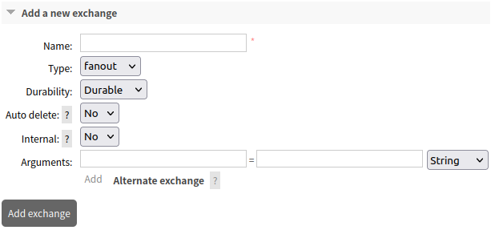
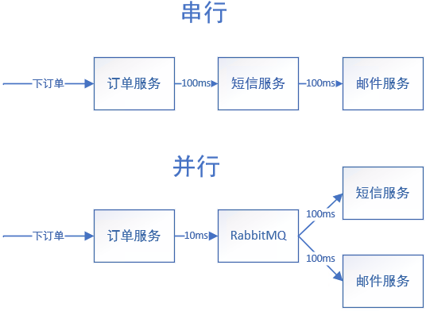

# RabbitMQ的下载与安装

**一、docker创建容器**

```bash
docker run 
	-id 							#后台运行
	--name myrabbit 				#容器名
	-e RABBITMQ_DEFAULT_USER=admin 	#设置超级管理账号
	-e RABBITMQ_DEFAULT_PASS=admin 	#设置超级管理密码
	-p 15672:15672 					#web管理界面
	-p 5672:5672 
	-p 25672:25672 
	-p 61613:61613 
	-p 1883:1883
	rabbitmq						#镜像名
```

```bash
#slave节点使用的镜像，默认不开启管理界面
docker run -id --name myrabbit -e RABBITMQ_DEFAULT_USER=admin -e RABBITMQ_DEFAULT_PASS=admin -p 15672:15672 -p 5672:5672 -p 25672:25672 -p 61613:61613 -p 1883:1883 rabbitmq
```

```bash
#master节点使用的镜像，默认开启管理界面，信息比开发版多
docker run -id --name myrabbit -e RABBITMQ_DEFAULT_USER=admin -e RABBITMQ_DEFAULT_PASS=admin -p 15672:15672 -p 5672:5672 -p 25672:25672 -p 61613:61613 -p 1883:1883 rabbitmq:management
```

**二、启动web管理界面**

```bash
docker exec -d myrabbit rabbitmq-plugins enable rabbitmq_management
```

# 官方使用文档

[RabbitMQ Tutorials — RabbitMQ](https://rabbitmq.com/getstarted.html)

# RabbitMQ的角色分类

**一、none**

* 不能访问management plugin

**二、management(查看自己相关的节点信息)**

* 列出字节可以通过AMQP登录的虚拟机
* 查看自己的虚拟机节点`virtual hosts`的`queues`,`exchanges`和`buildings`信息
* 查看和关闭自己的`channels`和`connections`
* 查看有关自己的虚拟机节点`virtual hosts`的统计信息，包括其它用户在这`virtual hosts`的活动信息

**三、Policymaker**

* 包含`management`使用权限
* 查看、创建和删除自己的`virtual hosts`所属的`policies`和`parameters`信息

**四、Monitoring**

* 包含`management`使用权限
* 列出所有的`virtual hosts`，包括不能登录的`virtual hosts`（只能看不能修改）
* 查看其它用户的`connections`和`channels`信息
* 查看节点基本的数据比如`clustering`和`memory`使用情况
* 查看所有的`virtual hosts`的全局统计信息

**五、Administrator**

* 最高权限
* 创建和删除`virtual hosts`
* 查看、创建和删除users
* 创建`permissions`
* 关闭所有用户的`connections`

# RabbitMQ组成部分


* `Virture Host`：实现数据隔离和区分，在管理界面`admin`处设置
* `Connection`：与`RabbitMQ`建立的TCP连接
* `Channel`：网络信道，在TCP连接基础上建立的信道，用于读写消息的通道
* `Message`：消息，有协议和消息体组成
* `Exchange`：交换机，负责从外部接收消息，并将消息分发到队列
* `Bindlings`：交换机与队列之间的虚拟连接，交换机将消息发送到与该交换机绑定的队列
* `Routing Key`：路由规则
* `Queue`：消息队列，保存信息并转发给消费者

# RabbitMQ常见模式

## 简单模式


**一、常见的选项**

* `Delivery Mode`：发送模式
  * `Non-persistent`：非持久化，消息不存储到磁盘
  * `Persistent`：持久化，Broker获取消息后会存储到磁盘
* `Ack Mode`：确认模式
  * `Nack`：不做应答处理
  * `Ack`：做应答处理，获得确认后会删除消息

**二、简单模式的描述**

* 生产者生产消息并发送到队列里
* 消费者从队列里拉取消息消费
* 生产者需要指定队列名，不需要指定路由key，可以不需要指定交换机
* 消费者获取消息是需要写入队列较完整的参数

## Fanout模式（发布与订阅）


**一、发布订阅模式的描述**

* 生产者发送消息到交换机，<font color=red>交换机将消息发送到与其绑定的所有队列</font>
* 生产者发送消息时不需要指定`key`，但需要指定交换机
* 消费者获取消息的发送和简单模式一样
* 创建交换机需要在管理界面处理，模式设置为`fanout`

## Headers模式（键值对匹配模式）

**一、Headers模式**

* 在发布订阅模式的基础上增加了键值对匹配
* 交换机接收到消息后会根据键值对分配消息到队列
* 创建交换机是，模式需要设置为`Headers`
* 队列绑定到交换机时需要设置headers键值对

## Direct模式（路由模式）


**一、路由模式的描述**

* 在发布订阅模式的基础上增加了路由key，对于特殊消息可以只发送到部分队列里
* 发送消息时需要设置key
* 创建交换机时，模式需要设置为`direct`，如果是`fanout`模式路由key将不生效

## Topic模式（主题模式）


**一、Topic模式的描述**

* 在路由模式的基础上增加了路由key的模糊匹配
* 路由key之间使用`.`进行隔离，路由key的顺序会影响匹配结果（比如：`com.github.#`）
* <font color=red>使用`*`表示模糊匹配1个路由key</font>
* <font color=red>使用`#`表示模糊匹配0个或1个及以上数量的路由key</font>
* <font color=blue>创建交换机时，模式需要设置为`Topic`</font>

## Work模式


# RabbitMQ模式Go的实现

## 简单模式

环境准备

**一、获取第三方包**

```bash
go get github.com/rabbitmq/amqp091-go
```

### simple生产者的实现

**一、导入第三方包**

```go
import amqp "github.com/rabbitmq/amqp091-go"
```

**二、获取RabbitMQ连接对象**

* 使用`amqp.Dial()`获取连接对象
* ip端口格式：`"amqp://账号:密码@IP:端口/"`

```go
conn,err:=amqp.Dial("")
defer conn.Close()
```

**三、获取通道对象**

* 使用连接对象获取通道对象
* 使用`conn.Channel()`获取通道对象

```go
ch,err:=conn.Channel()
defer ch.Close()
```

**四、创建消息队列**

* 使用`ch.QueueDeclare()`创建消息队列（如果已存在，rabbitMQ会跳过）
* 需要输入的属性
  * `name`：队列名（自定义）
  * `durable`：是否持久化
  * `autoDelete`：消息发送完后队列是否自动删除
  * `exclusive`：是否是专用队列
  * `noWait`：是否及时发送
  * `args`：参数协议

```go
queue,err:=ch.QueueDeclare(
	"hello",
    false,
    false,
    false,
    false,
    nil,
)
```

**五、编辑消息内容以及发送消息**

* 使用`ch.PublishWithContext()`发送消息
* 需要的参数
  * `context`对象
  * 队列名
  * `exchange`
  * `mandatory`
  * `immediate`
  * 消息体

```go
//获取context对象，设置超时释放协程
ctx,cancel:=context.WithTimeout(context.Background(),5*time.Second)
defer cancel()
//设置编辑消息内容
body:="hello world"
//发送消息
err=ch.PublishWithContext(ctx,
                         "",
                         queue.Name,
                         false,
                         false,
                          amqp.Publishing{
                              ContentType:"texr/plain",
                              Body:[]byte(body),
                          })
if err!=nil{
    log.Println(err)
}
log.Printf(" SendMSG:%s\n",body)
```

### simple消费者的实现

**一、导入第三方包**

```go
import amqp "github.com/rabbitmq/amqp091-go"
```

**二、获取RabbitMQ连接对象**

* 使用`amqp.Dial()`获取连接对象
* ip端口格式：`"amqp://账号:密码@IP:端口/"`

```go
conn,err:=amqp.Dial("")
defer conn.Close()
```

**三、获取通道对象**

* 使用连接对象获取通道对象
* 使用`conn.Channel()`获取通道对象

```go
ch,err:=conn.Channel()
defer ch.Close()
```

**四、声明消息队列及其相关属性**

* 使用`ch.QueueDeclare()`声明消息队列
* 参数和生产者设置的一致

```go
queue,err:=ch.QueueDeclare(
	"hello",
    false,
    false,
    false,
    false,
    nil,
)
```

**五、获取消息**

* 使用`ch.Consume()`获取消息，返回的消息体是一个`channel`数据结构
* 开启协程使用`for range`持续获取消息
* 使用空通道使得主线程永远阻塞持续获取消息
* 需要设置的参数：
  * 队列名
  * `autoAck`
  * `exclusive`
  * `noLocal`
  * `noWait`
  * `args`

```go
//消息channel
msgs,err:=ch.Consume(
	queue.Name,
    "",
    true,
    false,
    false,
    false,
    nil,
)
if err!=nil{
    log.Println(err)
    return
}
//开启协程获取信息
go func(){
    for data:=range msgs{
        log.Printf("Received MSG: %s",data.Body)
    }
}()
fmt.Printlf("Waiting for message")
//永久阻塞主线程
var forever chan struct{}
<-forever
```

## Header模式的实现

### 创建交换机以及队列的绑定

**一、创建Header交换机**

* 在管理界面创建一个交换机
* `Type`设置为`headers`


**二、队列绑定交换机**

* 转到`Exchanges`界面并点击刚创建的交换机
* 找到`Bindings`，输入队列名，在`arguments`里设置键值对


### headers生产者的实现

**一、设置headers参数**

* 创建一个`map[string]interface{}`类型的结构体
* 写入目标队列设置的键值对

```go
headers:=make(map[string]interface{})
headers["id"]=x
```

**二、发送消息**

* 使用`ch.PublishWithContext()`发送消息
* 设置`amqp.Publishing{}`结构体参数时需要加上设置的headers

```go
err:=ch.PublishWithContext(ctx,
                          "headX",		//交换机名
                          "",			//路由key
                          false,
                          false,
                           amqp.Publishing{
                               //装载headers参数
                               Headers:headers,
                               //设置mime类型
                               ContentType:"text/plan",
                               //装载消息体
                               Body:[]byte(body),
                           })
```

### headers消费者的实现

**一、设置headers参数**

* 创建一个`map[string]interface{}`类型的结构体
* 写入目标队列设置的键值对

```go
headers:=make(map[string]interface{})
headers["id"]=x
```

**二、获取消息**

* 使用`ch.Consume()`获取消息

* 需要在`argument`选项里写入headers参数

```go
msgs, err := ch.Consume(
    "queue_one",		//消息来源队列
    "",					//交换机
    false,
    false,
    false,
    false,
    header)				//header参数
if err != nil {
    fmt.Println(err)
    return
}
go func() {
    for data := range msgs {
        log.Printf("Received MSG: %s", data.Body)
    }
}()
```

## fanout模式的实现

### 创建交换机以及队列的绑定

**一、创建交换机**

* 在`Exchanges`页面里创建一个Type为fanout的交换机



**二、绑定队列**

* 创建多个队列，将队列直接绑定到交换机
* 不需要设置任何参数


### fanout生产者的实现

**一、发送消息**

* 使用`ch.PublishWithContext()`发送消息

```go
err = ch.PublishWithContext(ctx,
    //交换机
    "myexchange",
    //路由key
    "",
    false,
    false,
    amqp.Publishing{ //设置消息体
        //MIME类型
        ContentType: "text/plain",
        //消息体
        Body: []byte(body),
    })
if err != nil {
    log.Println(err)
    return
}
```

### fanout消费者的实现

**一、接收消息**

* 使用`ch.Consume()`获取消息

```go
msgs, err := ch.Consume(
    "one",
    "",
    false,
    false,
    false,
    false,
    nil)
if err != nil {
    fmt.Println(err)
    return
}

go func() {
    for data := range msgs {
        log.Printf("Received MSG: %s", data.Body)
    }
}()
```

## direct模式的实现

### 创建交换机以及队列的绑定

**一、创建交换机**

* 在`Exchanges`页面里创建一个Type为direct的交换机


**二、绑定队列**

* 创建多个队列，将队列直接绑定到交换机
* 不需要设置任何参数


### direct生产者的实现

**一、发送消息**

* 使用`ch.PublishWithContext()`发送消息
* 需要设置路由key

```go
err = ch.PublishWithContext(ctx,
    //交换机
    "route",
    //路由key
    "phone",
    false,
    false,
    amqp.Publishing{ //设置消息体
        //MIME类型
        ContentType: "text/plain",
        //消息体
        Body: []byte(body),
    })
```

### direct消费者的实现

**一、接收消息**

* 使用`ch.Consume()`获取消息

```go
msgs, err := ch.Consume(
    "one",
    "",
    false,
    false,
    false,
    false,
    nil)
if err != nil {
    fmt.Println(err)
    return
}

go func() {
    for data := range msgs {
        log.Printf("Received MSG: %s", data.Body)
    }
}()
```

## topic模式的实现

### 创建交换机以及队列的绑定

**一、创建交换机**

* 在`Exchanges`页面里创建一个Type为topic的交换机

**二、绑定队列**

* 创建多个队列，绑定队列时输入路由key

### topic生产者的实现

**一、发送消息**

* 使用`ch.PublishWithContext()`发送消息
* 需要设置路由key

```go
err = ch.PublishWithContext(ctx,
    //交换机
    "topic_exchange",
    //路由key
    "www.usr.github.com",
    false,
    false,
    amqp.Publishing{ //设置消息体
        //MIME类型
        ContentType: "text/plain",
        //消息体
        Body: []byte(body),
    })
```

### topic消费者的实现

**一、接收消息**

* 使用`ch.Consume()`获取消息

```go
msgs, err := ch.Consume(
    "two",
    "",
    false,
    false,
    false,
    false,
    nil)
if err != nil {
    fmt.Println(err)
    return
}

go func() {
    for data := range msgs {
        log.Printf("Received MSG: %s", data.Body)
    }
}()
```

## work模式的实现

### 轮询分发策略

**一、轮询分发**

* 将消息平均分配给每个消费者
* 轮询分发为默认的消息分发策略
* `autoACK`和`NACK`都可以实现轮询分发

**二、消费者的实现**

* 默认分发策略
* 设置手动ack时需要使用`.ACK(false)`进行确认

```go
msgs, err := ch.Consume(
    "worker_queue",
    "",
    //自动ack
    true,
    false,
    false,
    false,
    nil)
if err != nil {
    fmt.Println(err)
    return
}
sum := 0
go func() {
    for data := range msgs {
        num, _ := strconv.Atoi(string(data.Body))
        sum += num
        log.Printf("Received MSG: %d", sum)
    }
}()
```

### 公平分发策略

**一、公平分发策略**

* 由于服务器资源不相同，不同接收端消息处理速度不同
* 公平分发策略按照能者多劳原则分配消息，不会因为处理速度慢而导致消息堆积
* 最常用的分发策略

**二、消费者的实现**

* 需要将`autoACK`设置为`false`
* 需要使用通道设置`Qos`参数，该参数需要根据服务器资源的情况进行设置，不宜设置过大
* `Qos`参数用于设置`RabbitMQ`一次分发多条消息，等所有消息确认后再发送多条消息

```go
//设置Qos
err = ch.Qos(1, 0, false)
if err != nil {
    fmt.Println(err)
    return
}
//获取消费者对象
msgs, err := ch.Consume(
    "worker_queue",
    "",
    //手动ACK
    false,
    false,
    false,
    false,
    nil)
if err != nil {
    fmt.Println(err)
    return
}

go func() {
    for data := range msgs {
        time.Sleep(time.Millisecond * 500)
        //消息确认
        data.Ack(false)
        log.Printf("Received MSG: %s", string(data.Body))
    }
}()
```

# 交换机与队列的声明

**一、声明交换机和队列的必要性**

* 声明的必要性：使用交换机和队列的时候如果RabbitMQ里不存在则会引发异常
* 如果交换机或队列已存在，但再次声明时修改了参数，此时返回错误参数不会生效，需要删除原交换机或队列

**二、声明交换机**

* 需要获取通道对象
* 使用`.ExchangeDeclare()`声明交换机

```go
//获取通道对象
ch, err := conn.Channel()
if err != nil {
    fmt.Println(err)
    return
}
defer ch.Close()
//声明交换机
err = ch.ExchangeDeclare("work_fair", "direct", true, false, false, false, nil)
if err != nil {
    fmt.Println(err)
    return
}
```

**三、声明队列**

* 需要获取通道对象
* 使用`QueueDeclare()`声明队列

```go
//获取通道对象
ch, err := conn.Channel()
if err != nil {
fmt.Println(err)
return
}
defer ch.Close()
//声明队列
_, err = ch.QueueDeclare("worker_queue", false, false, false, false, nil)
if err != nil {
    fmt.Println(err)
    return
}
```

**四、绑定队列到交换机**

* 需要获取通道对象
* 使用`QueueBind()`绑定队列到交换机

```go
//获取通道对象
ch, err := conn.Channel()
if err != nil {
fmt.Println(err)
return
}
defer ch.Close()
//绑定队列
err = ch.QueueBind("worker_queue", "", "work_fair", false, nil)
if err != nil {
    fmt.Println(err)
    return
}
```

# RabbitMQ使用场景

**一、串行流程异步处理**



**二、解耦**


**三、削峰**

* `RabbitMQ`拥有暂存消息的能力，可以在消费端处于高负载运行的情况下存储来不及处理的消息

# 过期队列与过期消息

## 过期队列

**一、过期队列**

* 发布到过期队列的所有消息会经过一段时间后删除或转移到死信队列

**二、设置过期队列**

* 创建队列时增加ttl参数，需要设置时间，单位为ms
* 需要获取通道对象

```go
//设置参数
args:=make(map[string]interface{})
args["x-message-ttl"]=5000
_,err=ch.QueueDeclare("ttlQueue",false,false,false,false,args)
if err!=nil{
    fmt.Println(err)
    return
}
```

## 设置过期消息

* 有过期时间的消息会在一段时间后过期

* 生产消息时需要设置过期时间，单位为毫秒

```go
err=ch.PublishWithContext(ctx,
                         "myexchange",
                         "",
                         false,
                         false,
                          amqp.Publishing{
                              ContentType:"text/plain",
                              Body:[]byte(body),
                              //设置过期时间
                              Expiration:"5000",
                          })
if err!=nil{
    fmt.Println(err)
    return
}
```

## 死信机制

**一、死信处理**

* 当重要消息过期时，由于不能直接删除所以消息成为死信，需要死信队列存储过期的消息进行特殊处理

**二、死信机制的使用流程**

* 需要创建一个死信交换机用于分发死信，创建死信队列用于存储死信消息
* 声明业务队列时需要绑定死信交换机和死信路由key


**三、死信机制的实现**

* 创建死信交换机
* 创建死信队列
* 死信队列绑定到交换机，并设置路由key
* 创建业务交换机
* 创建业务队列，设置死信交换机、死信路由key和过期时间
* 业务队列绑定到业务交换机

```go
//声明交换机
//声明业务交换机
err = ch.ExchangeDeclare("task_exchange", "direct", true, false, false, false, nil)
if err != nil {
    fmt.Println(err)
    return
}
//声明死信交换机
err = ch.ExchangeDeclare("dead_exchange", "direct", true, false, false, false, nil)
if err != nil {
    fmt.Println(err)
    return
}
//声明队列
//声明过期队列
ttl_args := make(map[string]interface{}, 2)
//设置过期数据
ttl_args["x-message-ttl"] = 5000
//设置死信交换机
ttl_args["x-dead-letter-exchange"] = "dead_exchange"
//设置死信路由key，fanout模式不用设置
ttl_args["x-dead-letter-routing-key"] = "dead"
_, err = ch.QueueDeclare("ttl_queue", false, false, false, false, ttl_args)
if err != nil {
    fmt.Println(err)
    return
}
//声明死信队列
_, err = ch.QueueDeclare("dead_queue", false, false, false, false, nil)
if err != nil {
    fmt.Println(err)
    return
}
//绑定队列
//死信队列绑定到死信交换机
err = ch.QueueBind("dead_queue", "dead", "dead_exchange", false, nil)
if err != nil {
    fmt.Println(err)
    return
}
//过期队列绑定到业务交换机
err = ch.QueueBind("ttl_queue", "", "task_exchange", false, nil)
if err != nil {
    fmt.Println(err)
    return
}
```

# 内存和磁盘资源的监控

**一、参考文档**
[Configuration — RabbitMQ](https://www.rabbitmq.com/configure.html)

**二、使用命令调整内存大小**

* 使用命令修改内存大小是临时性的，重启后配置丢失
* 设置绝对内存值：使用`set_vm_memory_high_watermark absoulte`参数设置
* 设置相对内存值：使用`set_vm_memory_high_watermark relative`参数设置（实际内存=物理总内存×系数）
* 相对内存的系数最好在0.4到0.7之间

```bash
#绝对设置内存值
rabbitmqctl set_vm_memory_high_watermark absoulte 6GB
#相对设置内存值
rabbitmqctl set_vm_memory_high_watermark 0.5
```

**三、使用命令调整磁盘存储大小**

* 使用`set_disk_free_limit`设置磁盘剩余空间预警（剩余空间低于该值时Rabbitmq会阻塞生产者）

```bash
rabbitmqctl set_disk_free_limit 100MB
```

**四、内存换页**

* 当内存的使用率某个值时，RabbitMQ会将一定的数据转移到磁盘上减少内存的负担（默认值为0.5）

* 使用`vm_memory_high_watermark_paging_ratio`参数配置，设置最好在0.5-0.7的区间内

# 持久化设置

**一、交换机持久化**

* 创建时durable参数设为true
* 作用：宕机重启时，该交换机不会消失

```go
ch.ExchangeDeclare("deadExchange", "direct", true, false, false, false, nil)
```

**二、队列持久化**

* 创建时durable参数设为true
* 作用：宕机重启时，该队列不会消失，但存储里面的消息可能消失

```go
ch.QueueDeclare("orderQueue", true, false, false, false, args)
```

**三、消息持久化**

* 生产者发送消息时，将配送模式（`delivery-mode`）设为持久化（`persistent`）
* 作用：消息不会因宕机而消失

```go
confirm, err := ch.PublishWithDeferredConfirmWithContext(ctx,
    //交换机
    "orderExchange",
    //路由key
    "",
    false,
    false,
    amqp.Publishing{ //设置消息体
        //MIME类型
        ContentType: "text/plain",
        //消息体
        Body:         body,
        DeliveryMode: 2,
    })
```

# 一主多从集群搭建

**一、docker-compose配置文件参考**

```yaml
version: '3'
services:
    rabbitmq1:
        image: rabbitmq:management
        deploy:
          resources:
            limits:
              cpus: '2'
              memory: 8G
          restart_policy:
            condition: always
        ports:
          - "15672:15672"
          - "5672:5672"
        hostname: rabbitmq1
        container_name: rabbitmq1
        environment:
          - RABBITMQ_ERLANG_COOKIE=rabbitcookie
        volumes:
          - /data/docker/data/rabbitmq/rabbitmq1:/var/lib/rabbitmq
          - /etc/localtime:/etc/localtime

    rabbitmq2:
        image: rabbitmq:management
        deploy:
          resources:
            limits:
              cpus: '2'
              memory: 8G
          restart_policy:
            condition: always
        ports:
            - "5673:5672"
        hostname: rabbitmq2
        container_name: rabbitmq2
        environment:
          - RABBITMQ_ERLANG_COOKIE=rabbitcookie
        volumes:
          - /data/docker/data/rabbitmq/rabbitmq2:/var/lib/rabbitmq
          - /etc/localtime:/etc/localtime

    rabbitmq3:
        image: rabbitmq:management
        deploy:
          resources:
            limits:
              cpus: '2'
              memory: 8G
          restart_policy:
            condition: always
        ports:
          - "5674:5672"
        hostname: rabbitmq3
        container_name: rabbitmq3
        environment:
          - RABBITMQ_ERLANG_COOKIE=rabbitcookie
        volumes:
          - /data/docker/data/rabbitmq/rabbitmq3:/var/lib/rabbitmq
          - /etc/localtime:/etc/localtime
```

```bash
docker-compose --compatibility up -d
```

**二、组建集群**

* 启动集群时需要先关闭，重置数据，对于从节点需要绑定主节点，最后启动

```shell
#!/bin/bash
for host in $(seq 1 3)
do
	docker exec rabbitmq${host} rabbitmqctl stop_app;
	docker exec rabbitmq${host} rabbitmqctl reset;
	if test ${host} -gt 1
		then docker exec rabbitmq${host} rabbitmqctl join_cluster --ram rabbit@rabbitmq1;
	fi
	docker exec rabbitmq${host} rabbitmqctl start_app;
done
echo "Starting to create user."
docker exec rabbitmq1 rabbitmqctl add_user admin 123456;
echo "Set tags for new user."
docker exec rabbitmq1 rabbitmqctl set_user_tags admin administrator;
echo "Grant permissions to new user."
docker exec rabbitmq1 /bin/bash -c "rabbitmqctl set_permissions -p '/' admin '.*' '.*' '.*'";
```

**三、故障**

* 从节点宕机时不会影响集群的运行
* 主节点宕机时整个集群崩溃，重启时需要先启动主节点然后再启动从节点

# 分布式事务

## 基于分布式事务的订单系统架构


## 可靠生产与推送确认

**一、可靠生产的实现**

* 接收到订单时需要先将订单存储到临时表内，状态设为0（表示待发送）
* 然后将消息发送到RabbitMQ，发送模式设为2，等待回传ACK
* 得到回传的ACK时，状态设为1（表示传递成功）
* 没有得到回传的ACK时，状态设为-1（表示传递失败）
* 重发机制：扫描订单临时表的数据，若存在状态为-1的消息则尝试重传


**二、消息发布确认机制的实现**

* 与RabbitMQ进行连接，获取通道对象
* 使用`.Confirm()`开启通道确认机制
* 使用`.PublishWithDeferredConfirmWithContext()`发送消息，`DeliveryMode`设为2，返回`Confirm`对象
* `Confirm`对象使用`.Wait()`方法获取ACK接收的布尔值，返回true表示ACK已接收

```go
confirm, err := ch.PublishWithDeferredConfirmWithContext(ctx,
    //交换机
    "orderExchange",
    //路由key
    "",
    false,
    false,
    amqp.Publishing{ //设置消息体
        //MIME类型
        ContentType: "text/plain",
        //消息体
        Body:         body,
        DeliveryMode: 2,
    })
if err != nil {
    log.Println(err)
    return
}
//接收确认
if confirm.Wait() {
    //接收成功则更新状态
    mysqlConn.Table("order_status").Where("oid=?", userOrder.Oid).Update("status", 1)
} else {
    mysqlConn.Table("order_status").Where("oid=?", userOrder.Oid).Update("status", -1)
}
```

## 可靠消费与死信队列

**一、可靠消费的实现**

* 从RabbitMQ取出消息并消费
* 如果消费成功则将处理信息记录到配送表，最后使用`.ACK()`返回ACK
* 如果消费失败则使用`.NACK()`，将requeue参数设为false，直接转移到死信队列
* 异常消息处理机制：尝试重新处理死信队列里的消息


**二、消息消费确认实现**

* 使用`.ACK()`返回消费成功应答，`.NACK()`返回消费失败应答

```go
msgs, err := ch.Consume(
    "orderQueue",
    "",
    false,
    false,
    false,
    false,
    nil)
if err != nil {
    log.Println(err)
    return
}
//处理消息
go func() {
    for order := range msgs {
        time.Sleep(time.Millisecond * 500)
        var deliver Dispatch
        _ = json.Unmarshal(order.Body, &deliver)
        deliver.Delivery = "刘强东"
        deliver.Status = "配送中"
        err := mysqlConn.Table("dispatch").Create(&deliver).Error
        if err != nil {
            //requeue设为true时重新分发，false时转移到死信队列
            _ = order.Nack(false, false)
            continue
        }
        _ = order.Ack(false)
        log.Println("成功处理一份订单")
    }
}()
```

# 面试题

**一、RabbitMQ为什么基于channel去处理而不是基于连接去处理**

* 高并发场景下，如果一个线程对应一个连接，建立和销毁多个连接需要很大的开销（三次握手，四次挥手）
* RabbitMQ采用复用tcp连接方式，不仅减少性能开销，同时方便管理
* 每个线程对应一个通道，多个通道复用一个连接，高并发场景下不需要多次建立和销毁连接

**二、可以存在没有交换机的队列吗？**

* 不能，虽然没有指定交换机，但是RabbitMQ内存在默认的交换机

**三、分布式事务里，如果消费时出现异常会发生什么？如何解决？**

* 消费时由于异常消息在消费时引发异常而无法返回确认，导致RabbitMQ一直尝试发送异常消息，但是因为均无法正常处理不能返回ACK而造成死循环
* 解决方案一：限制重试次数，限制重试的次数，但造成消息的丢失
* 解决方案二：捕获异常+手动ACK，不能获取异常消息而造成消息的丢失
* 解决方案三：捕获异常+手动ACK+死信机制，死信队列存储异常消息，保证系统的鲁棒性


