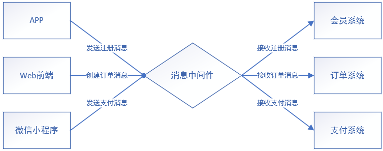
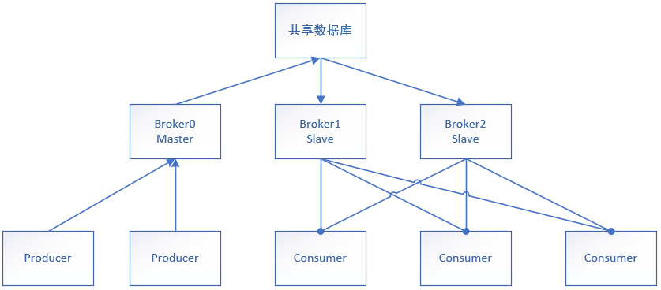
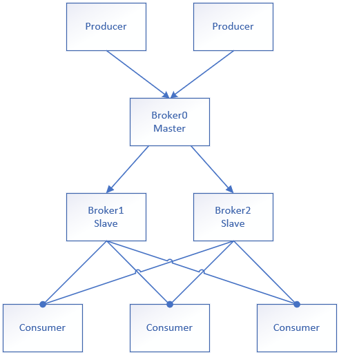
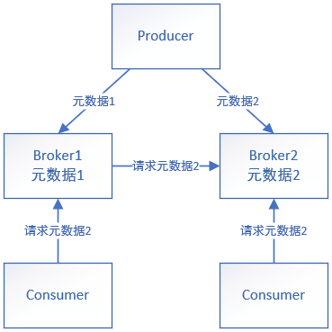
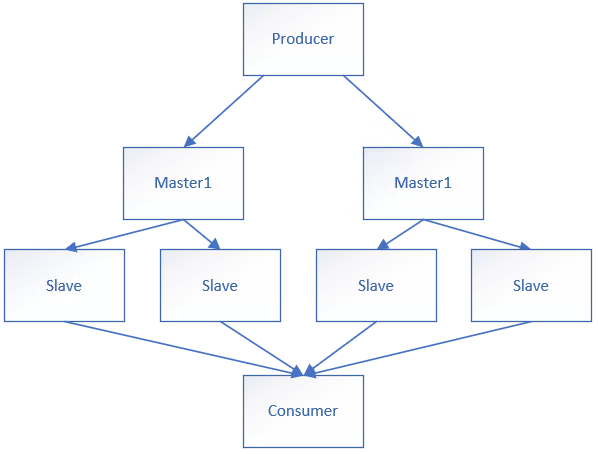

# 中间件

## 中间件的类型

| 中间件类型           | 中间件实例                                     | 中间件使用场景                                               | 中间件的特点                                   |
| -------------------- | ---------------------------------------------- | ------------------------------------------------------------ | ---------------------------------------------- |
| **分布式消息中间件** | `RabbitMQ`  `Kafka`  `RoceketMQ`         | 监控数据 异步数据传输 削峰填谷 任务调度 分布式事务 大数据分析 | 持久化 消息分发 高可用 高可靠 容错 |
| **负载均衡中间件**   | `Nginx` LVS负载均衡软件 KeepAlive CDN | 负载均衡 内容分发                                         |                                                |
| **缓存中间件**       | `Redis`                                        | 缓存                                                         |                                                |
| **数据库中间件**     | `Mycat`                                        |                                                              |                                                |

## 基于消息中间件的分布式系统架构

| 消息中间件的组成部分 | 描述                                               |
| -------------------- | -------------------------------------------------- |
| 通信协议             | 生产者发送数据后，消费者能够跨语言接收消息里的内容 |
| 消息的持久化机制     | 接收消息后会存储消息                               |
| 消息的容错机制       |                                                    |
| 消息的分发策略       |                                                    |
| 消息的高可用，高可靠 | 高可用：消息中间件集群化 高可靠：               |

**一、消息中间件的本质**

* 是一种接收数据、存储数据、发送数据等功能的技术服务

**二、消息中间件的作用**

* 利用可靠的消息传递机制进行系统和系统的通信
* 通过提供消息传递和消息排队机制，实现分布式系统下进程间的通信，屏蔽系统和编程语言的多样性

**三、基于消息中间件的架构主要角色**

* 生产者：生产数据并发送到消息中间件
* 消费者：从消息中间件获取数据并处理
* 消息中间件：接收数据并存储数据，并将数据分发给消费者

# 消息队列的通信协议

**一、协议**

* 数据的存储和分发的过程中需要遵循某种规范
* 消息队列的协议主要负责数据的接受和传递，数据冗余性低性能高
* 基于TCP/IP协议之上构建的规范

**二、协议的组成部分**

* 语法：用户数据与控制信息的结构与格式以及数据出现的顺序
* 语义：控制信息每部分的意义，规定了需要发出何种控制信息、完成的动作和做出的响应
* 时序：对事件发生顺序的说明

**三、常见的消息中间件协议**

| 协议名                 | 特性                                                         |
| ---------------------- | ------------------------------------------------------------ |
| AMQP协议               | 分布式事务支持 消息的持久化 高性能和高可靠的消息处理   |
| MQTT协议（物联网协议） | 轻量 结构简单 没有持久化 适用于低计算资源，网络不稳定的场景 |
| OpenMessage协议        | 结构简单 解析速度快 支持事务和持久化设计               |
| Kafka协议              | 结构简单 解析速度快 无事务支持 消息持久化           |

# 消息的持久化

**一、持久化**

* 将数据写入磁盘是数据永久保存

# 消息的分发策略

**一、消息队列的角色**

* 生产者：生产数据
* 消息中间件：存储和分发数据
* 消费者：处理数据

**二、不同中间件消息分发策略的对比**

* 轮询分发：平均分配消息
* 公平分发：根据消费者服务器资源的多少设置权重，权重越高分配的消息越多

| 功能     | ActiveMQ | RabbitMQ | Kafka | RocketMQ |
| -------- | -------- | -------- | ----- | -------- |
| 发布订阅 | 支持     | 支持     | 支持  | 支持     |
| 轮询分发 | 支持     | 支持     | 支持  |          |
| 公平分发 |          | 支持     | 支持  |          |
| 重发     | 支持     | 支持     |       | 支持     |
| 消息拉取 |          | 支持     | 支持  | 支持     |

# 消息中间件的高可用高可靠

**高可用**

* 在规定的条件和规定的时间内处于可执行规定功能状态的能力
* 请求量过大时，消息中间件会触及硬件极限而无法满足业务需求，这时需要集群的部署

**高可靠**

* 系统突然崩溃不影响线上业务的正常运行
* 消息中间件的可靠性保障：
  * 消息的传输：使用协议保证数据的正确解析
  * 消息的持久化：通过持久化保证数据的不易丢失

## 主从数据共享集群

**一、节点任务分配**

* 主节点将数据写入共享数据库
* 从节点读取共享数据库数据并分发消息

**二、缺点**

* 共享数据库宕机时会导致业务整体崩溃（单点故障）

**三、场景**

* 可用于小型业务

## 主从数据同步集群

**一、节点任务分配**

* 主节点负责数据的写入，并将数据同步到从节点
* 从节点分发消息

**二、缺点**

* 在请求量大的场景下，消息的拷贝和同步会消耗很多网络资源造成网络拥堵（建议局域网内部署）

## 元数据集群

**一、节点任务分配**

* 同步相同tag的元数据，通过tag获取数据或向其它节点请求数据

**二、优点**

* 每个节点只需要存储对应的元数据而不需要拷贝所有数据，极大减少数据存储花销
* 减少了持久化数据，网络和磁盘同步的开销，提高了系统的性能

## 多主多从集群

# 面试内容

**一、消息中间件为什么不使用http协议**

* http请求报文和响应报文头是比较复杂的，包含了cookie，数据的加密解密，状态码，响应码等附加功能，对于消息中间件只需要负责数据的传递，存储，分发，不需要过于复杂的http协议，而是需要高性能、简洁的通信协议（报文冗余）
* 大部分情况下http是短连接，在数据交互过程中请求到响应可能会中断，中断后不会持久化数据造成数据的丢失。消息中间件是一个长期的获取消息的过程，出现问题和故障要对数据进行持久化，保证数据的高可靠和稳健的运行（没有数据持久化）

