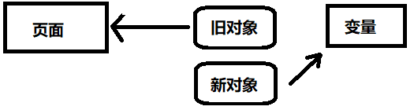

# vue的安装与基于vite创建项目

**一、安装node.js**

* [Node.js (nodejs.org)](https://nodejs.org/en)

**二、下载并安装vue**

```shell
npm create vue@latest
```

**三、下载依赖包**

```shell
cd 项目名
npm install
```

**四、运行**

```shell
npm run dev
```

# Hello World

## vue2

**一、入口文件(main.ts)核index.html**

```typescript
//导入CSS
import './assets/main.css'
//导入createApp用于创建应用
import { createApp } from 'vue'
//导入App根组件
import App from './App.vue'
//App根组件挂载到index.html里
createApp(App).mount('#app')
```

```html
<!-- index.html -->
<body>
    <!-- 挂载标签 -->
	<div id="app"></div>
    <!-- 脚本 -->
	<script type="module" src="/src/main.ts"></script>
</body>
```

**二、简单的根组件**

```vue
<template>
<h1>hello world</h1>
<!-- 放置组件 -->
<Person></Person>
</template>

<script lang="ts">
import Person from "./components/Person.vue"
    export default{
        name:"App", //组件名
        //连接组件
        components:{
            Person
        }
    }
</script>

<style>

</style>
```

**三、简单的组件**

```vue
<template>
    <div class="person">
        <h1>{{name}}</h1>
    </div>
</template>

<script lang="ts">
    export default{
        name:"Person",
        data(){
            return{
                name:"123"
            }
        }
    }
</script>
```

## vue3

**一、入口文件(main.ts)核index.html**

```typescript
//导入CSS
import './assets/main.css'
//导入createApp用于创建应用
import { createApp } from 'vue'
//导入App根组件
import App from './App.vue'
//App根组件挂载到index.html里
createApp(App).mount('#app')
```

```html
<!-- index.html -->
<body>
    <!-- 挂载标签 -->
	<div id="app"></div>
    <!-- 脚本 -->
	<script type="module" src="/src/main.ts"></script>
</body>
```

**二、简单的根组件**

* 创建组件时会自动导出组件名

```vue
<template>
<Person></Person>
</template>

<script lang="ts" setup>
//导入组件并在模板使用
import Person from "./components/Person.vue"
</script>

<style>

</style>
```

**三、简单的组件**

```vue
<template>
    <div class="person">
        <h1>{{name}}</h1>
    </div>
</template>

<script lang="ts" setup>
    //实现逻辑
    ......
</script>

<style>

</style>
```

# 响应式数据的创建

## 响应式基本类型数据

**一、响应式基本类型数据**

* 导入`ref()`函数
* 格式：`let 变量名=ref(数据)`
* 使用`变量.value`取值或赋值
* 定义定义对象类型数据，但一般不推荐

```vue
<template>
    <div class="person">
        <h1>{{name}}</h1>
        <button @click="changeName">click</button>
    </div>
</template>

<script lang="ts" setup>
//导入方法
import {ref} from 'vue'
//定义变量
let name=ref("keqing")
//改变变量的值
function changeName(){
    name.value="ganyu"
}
</script>
```

## 响应式对象类型

**一、响应式对象类型**

* 导入`reactive()`函数
* 使用`reactive()`定义响应式对象类型
* 格式：`let 对象=reactive(对象)`
* 使用`对象.变量`获取值
* 数组时对象的一种

```vue
<template>
    <div class="person">
        <h1>{{role.name}}</h1>
        <h1>{{role.age}}</h1>
        <button @click="changeRole">click</button>
    </div>

</template>

<script lang="ts" setup>
import {reactive} from 'vue'
let role=reactive({
    name:"keqing",
    age:18
})
function changeRole(){
    role.name="ganyu"
    role.age=5000
}
</script>
```

**二、修改响应式对象**

* 接收后端数据后需要修改响应式对象的值时
  * 使用`.`直接修改对象数据需要多行代码
  * 直接设置新的响应式对象时由于引用问题导致新的数据不能响应到页面上



* 使用`Object.assign()`方法，将新对象的键值对覆盖到旧对象里
* 格式：`Object.assign(旧对象,新对象)`

```typescript
let car=reactive({brand:"奔驰",price:100})
Object.assign(car,{brand:"奥拓",price:1})
```

## toRefs()函数

**一、toRefs()函数**

* 一般直接的解构会丢失响应式，需要使用`toRefs()`实现响应式解构
* `toRefs`：将对象的响应式属性提取出来，修改提取出来的属性时会修改对象的属性
* 格式：`let {提取的属性}=toRefs(对象)`

```typescript
let person=reactive({
	name:"张三",
	age:18
})
//提取响应式属性
let {name,age}=toRefs(person)
```

## 计算属性

**一、计算属性的定义**

* 导入`computed`函数
* 格式：`let 计算属性变量=computed(计算属性处理函数)`
* 计算属性变量本质是带缓存和监听器的特殊响应式变量

```typescript
import {reactive,computed} from 'vue'
let role=reactive({
    name:"keqing",
    age:18
})
let content=computed(()=>{
    return role.name+role.age
})
```

**二、反向计算属性**

* 计算除了取值外还可以根据输入的内容反向影响计算属性监听的变量
* `get()`方法用于取值，`set()`方法用于反向为监听的变量赋值
* `get()`方法的输出变量和`set()`方法输入变量**类型要一致且数量只能有一个**
* 要用`.value`设值

```typescript
let content=computed({
    get(){
        return role.name+role.age
    },
    set(val:string){
        let [name,age]=val.split("-")
        role.name=name
        role.age=Number(age)
    }
})
function changeRole(){
    content.value="ganyu-5000"
}
```

# watch监听

## watch简介

**一、watch**

* 用于监视数据的变化
* watch能监视的数据
  * `ref`定义的数据
  * `reactive`：定义的数据
  * 函数返回的一个值
  * 包含上述内容的数组

## 监听`ref`定义的基本类型数据

**一、监听`ref`变量**

* 导入`watch`函数
* 输入监听的`ref`变量和回调方法

```vue
<script>
let num=ref(2)
function changeNum(){
	num.value+=1
}
watch(num,(newValue,oldValue)=>{
	console.log(newValue)
})
</script>
```

## 监听`ref`定义的对象类型数据

**一、监听ref定义的对象**

* 当ref对应的对象地址发生改变时会触发调用
* 修改对象某个属性不会触发，需要深度监听

```vue
<script>
let role=ref({name:"keqing",age:"18"})
function changeRole(){
    role.value={name:"ganyu",age:"5000"}
}
watch(role,(newValue,oldValue)=>{
    console.log(newValue)
})
</script>
```

**二、深度监听ref定义的对象**

* `watch()`立追加`{deep:true}`实现监听对象里的变量变换

```vue
<script>
let role=ref({name:"keqing",age:"18"})
function changeRole(){
    role.value={name:"ganyu",age:"5000"}
}
function changeName(){
    role.value.name="ganyu"
}
watch(role,(newValue,oldValue)=>{
    console.log(newValue)
},{deep:true})
</script>
```

## 监听`reactive`定义的对象数据

**一、监听`reactive`定义的对象**

* 监听`reactive`定义的对象时默认开启深度监听

```vue
<script>
let role=reactive({name:"keqing",age:"18"})
function changeRole(){
    Object.assign(role,{name:"ganyu",age:"5000"})
}
function changeName(){
    role.name="ganyu"
}
watch(role,(newValue,oldValue)=>{
    console.log(newValue)
})
</script>
```

## 监听`reactive`定义的对象里的某个数据

**一、监听`reactive`定义的对象里的某个数据**

* 构造一个`getter()`函数返回对象的值
* `watch()`监听`getter()`函数的返回值
* 监听字符串时需要使用该方法

```vue
<script>
let role=reactive({name:"keqing",age:"18"})
function changeName(){
    role.name="ganyu"
}
watch(()=>{ return role.name },(newValue,oldValue)=>{
    console.log(newValue)
})
//简写
watch(()=>role.name,(newValue,oldValue)=>{
    console.log(newValue)
})
</script>
```

## 监听多个数据

**一、监听多个数据**

* 使用数组包裹多个数据

```vue
<script>
let role=reactive({name:"keqing",age:"18"})
function changeRole(){
    Object.assign(role,{name:"ganyu",age:"5000"})
}
function changeName(){
    role.name="ganyu"
}
watch([()=>{ return role.name },()=>{ return role.age }],(newValue,oldValue)=>{
    console.log(newValue)
})
</script>
```

## watchEffect

**一、watchEffect**

* 自动监视回调函数里使用的变量
* 项目启动时会立即执行一次
* 需要导入`watchEffect`函数

```vue
<script>
import {ref,watchEffect} from "vue"
let num = ref(0)
function change(){
    num.value+=1
}
watchEffect(()=>{
    if(num.value>10){
        console.log("num gt 10")
    }
})
</script>
```

# 标签的ref属性

**一、ref标签**

* 在组件html模板里使用`ref`属性定义id
* 在脚本里使用`ref()`获取html文本

```vue
<script>
import {ref} from 'vue'
let demo=ref()
function print(){
    console.log(demo.value)
}
</script>
```

**二、获取子组件暴露的数据**

* 在父组件标签里使用`ref`获取子组件实例
* 在子组件里使用内置宏函数`defineExpose()`导出数据

```vue
<!-- parent -->
<template>
	<Child ref="childData"></Child>
	<button @click="print">click</button>
</template>
<script>
let childData=ref()
function print(){
    console.log(childData.value.demo)
}
</script>
```

```vue
<!-- child -->
<script>
let demo=ref("hello world")
defineExpose({demo})
</script>
```

# TS里接口和泛型的使用

**一、定义接口**

* 在项目根目录里创建`types`目录，并创建`index.ts`文件

* 使用`interface`定义接口，**`typescript`接口定义的对象不能拓展其它属性**
* 在`interface`前面使用`export`暴露接口
* 在其它组件里使用`import`导入接口，并使用`type`标识接口
* `@/`表示项目根目录

```typescript
import {type Person} from "@/types/index"
let person:Person={id:"11",name:"zhangsan",age:19}
```

**二、定义接口数组**

* 使用数组实现

```typescript
import {type Person} from "@/types/index"
let personList:Person[]=[
    {id:"1",name:"one",age:18},
    {id:"2",name:"two",age:18}
]
```

* 在类型文件定义接口数组

```typescript
// types/index.ts
export interface Person{
    id:string,
    name:string,
    age:number
}

export type Persons=Person[]
```

```typescript
// 组件引用
import {type Persons} from "@/types/index"
```

**三、定义受接口约束的响应式数据**

* `reactive()`可以接收一个泛型进行约束

```typescript
let personList=reactive<Person[]>([
    {id:"1",name:"one",age:18},
    {id:"2",name:"two",age:18}
])
```

# props的使用

**一、props的使用**

* 父组件在子组件标签里传值，需要数据绑定
* 子组件使用内置宏函数`defineProps`接收值，需要输入数据的`key`字符串数组
* `defineProps()`会返回一个对象

```vue
<!-- parent -->
<template>
	<!-- 定义数据的key，传递数据 -->
<Child :persons="personList"></Child>
</template>
<script>
//导入组件
import Child from "./components/child.vue"
//导入类型数据
import {type Person} from "@/types/index"
//导入函数
import { reactive } from "vue";
//定义数据
let personList=reactive<Person[]>([
    {id:"1",name:"one",age:18},
    {id:"2",name:"two",age:18}
])
</script>
```

```vue
<!-- child -->
<script lang="ts" setup>
//调用内置宏函数取值，根据key取值
let props=defineProps(["persons"])
//打印
console.log(props.persons)
</script>
```

**二、props接收限制类型**

* 使用泛型实现限制接收类型，传入一个对象，属性名定义数据的key，值对应数据的类型

```vue
<script>
import {type Person} from "@/types/index"
let props=defineProps<{persons:Person[]}>()
console.log(props.persons)
</script>
```

**三、props可传性限制**

* 在数据的key后面加`?`

```vue
<script>
import {type Person} from "@/types/index"
let props=defineProps<{persons?:Person[]}>()
console.log(props.persons)
</script>
```

**四、完整的props写法**

* 导入`withDefault()`函数设置默认值，传入props对象和props对象的默认值
* 设置对应数据key的默认值时，如果是数组对象需要使用函数返回
* `?`控制可传性
* 泛型对象选择传来数据的类型

```vue
<script>
import {withDefaults} from 'vue'
import {type Person} from "@/types/index"
let props=withDefaults(defineProps<{persons:Person[]}>(),{
    //设置默认值
    persons:()=>[{id:"1",name:"one",age:18}]
})
console.log(props.persons)
</script>
```

# 生命周期

## Vue2生命周期

**一、创建组件**

* 创建前：`beforeCreate()`
* 创建完毕：`created()`

**二、挂载组件**

* 挂载前：`beforeMount()`
* 挂载完毕：`Mounted()`

**三、更新组件**

* 更新前：`beforeUpdate()`
* 更新完毕：`updated()`

**四、销毁组件**

* 销毁前：`beforeDestroy()`
* 销毁完毕：`destroyed()`

## Vue3生命周期

**一、创建组件**

* 创建组件：`setup()`（`setup()`在创建组件的适合调用）

**二、挂载组件**

* 挂载前：`onBeforeMount(()={ })`
* 挂载完毕：`onMounted(()=>{ })`

**三、更新组件**

* 更新前：`onBeforeUpdate(()=>{ })`
* 更新完毕：`onUpdated(()=>{ })`

**四、卸载组件**

* 卸载前：`onBeforeUnmount(()=>{ })`
* 卸载完毕：`onUnmounted(()=>{ })`

# Axios的使用

**一、axios简介与安装**

* 一个开源的用在浏览器端和`Node.js`的异步通信框架

```shell
npm install axios
```

**二、完整的异步Get请求**

```vue
<script>
import axios from "axios"
//发生get请求
axios.get("url",{
    //请求参数
    params:{
        key:value
    }
    //响应函数
}).then(()=>{
	//错误处理
}).catch(()=>{
	//执行完毕时调用
}).finally(()=>{
    
})
</script>
```

**三、同步Get请求**

* 使用`async`h和`await`组合实现

```vue
<script>
import axios from "axios"
async function request(){
    try{
        let resp=await axios.get("url",{params:{ key:"value" }})
        //handle logic
    }catch(error){
        //handle error
    }
    // complete logic
}
</script>
```

**四、Post请求**

```vue
<script>
import axios from "axios"

axios.post("url",{
    //请求参数
    key:"value"
    //响应函数
}).then(()=>{
    ......
	//错误处理
}).catch(()=>{
    ......
	//执行完毕时调用
}).finally(()=>{
    ......
})
</script>
```

**五、同步Post请求**

```vue
<script>
import axios from "axios"

async function request(){
    try{
        let resp=await axios.post("url",{ key:"value" })
        //handle logic
    }catch(error){
        //handle error
    }
    // complete logic
}
</script>
```

# 自定义Hook

**一、hook**

* 将组件内的功能实现转移到外部文件，提高项目的内聚性和开发效率
* 常用于项目的管理与功能的隔离

**二、hook的使用**

* 创建一个`hooks`文件夹，将所有`hook`文件放在该文件夹
* 在`hooks`目录里创建一个功能命名的`ts`文件
* 使用`export default`返回一个函数，函数里编写功能，最后使用`return`向外部提供变量、函数等

```typescript
//person.ts
import {reative} from "vue"
//返回方法，方法返回功能相关的函数和参数
export default function(){
    let person=reactive({
    	id:"1"
    	name:"demo"
	})
	function print(){
        console.log(person.id,person.name)
	}
	//返回变量和方法
	return {person,print}
}
```

```vue
<script>
import useHook from "@/hooks/person"
let {person,print}=useHook
</script>
```

# 路由

## 概念

**一、路由**

* 有KV组成的映射关系
* 常用于SPA应用（single page web application）

**二、基本的路由要素**

* 导航区、展示区
* 路由器
* 路由规则

**三、安装路由器**

* 安装路由器

```shell
npm i vue-router
```

* `src`目录里创建`router`目录，该目录里创建`index.ts`文件
* 编写`index.ts`

```typescript
//导入路由器相关函数
import { createRouter,createWebHistory } from 'vue-router'
//引入组件
import 组件 from "@/components/xxx.vue"
//创建路由器
const router=createRouter({
    //路由器工作模式
    history:createWebHistory(),
    //配置路由对象
    routes:[
        //路由组件
        {
            path:"路径",
            component: 组件
        }
    ]
})
export default router
```

* 修改`main.ts`

```typescript
import router from "@/router/index"
import { createApp } from 'vue'
import App from './App.vue'

const app= createApp(App)
//先使用中间件后挂载
app.use(router)
app.mount('#app')
```

## 项目工程规范

* 路由组件通常存放在`pages`或`views`文件夹，一般组件通常存放在`components`文件夹
* 切换；路由时会卸载旧的路由组件，然后挂载新的路由组件

## 基本切换效果

**一、基本的切换效果**

* 使用`<a>`标签改变路由
* 使用`<RouterView>`标签展示路由对应的页面

```vue
<template>
    <div class="nav">
        <a href="/home" class="nav-item">首页</a>
        <a href="/news" class="nav-item">新闻</a>
        <a href="/about" class="nav-item">关于</a>
    </div>
    <div>
        <!-- 展示内容 -->
        <RouterView></RouterView>
    </div>
</template>
```

* 使用`<RouterLink>`改变路由，使用`to`设置路径，使用`active-class`设置被激活时的类名

```vue
<template>
    <div class="nav">
        <RouterLink to="/home" class="nav-item" active-class="item-active">首页</RouterLink>
        <RouterLink to="/news" class="nav-item" active-class="item-active">新闻</RouterLink>
        <RouterLink to="/about" class="nav-item" active-class="item-active">关于</RouterLink>
    </div>
    <div>
        <RouterView></RouterView>
    </div>
</template>
```

## 路由器工作模式

**一、history模式**

* URL更美观，主流使用的模式，需要服务的处理路径

**二、hash模式**

* 兼容性更好，不需要服务端处理路径
* SEO优化方面较差

## 命名路由

**一、路由命名**

* 定义路由时使用`name`属性设置路由名
* 可以使用路由名跳转路由

```typescript
//index.ts
routes:[
    {
        name:"home",
        path:"/home",
        component:HOME
    }
]
```

## 路由to

**一、字符串路由**

* 在`<RouterLink>`标签里使用字符串直接指定路由

```html
<RouterLink to="/home"></RouterLink>
```

**二、对象路由**

* 使用对象绑定to属性，对象的`path`属性指定路由，对象的`name`属性指定路由名

```html
<RouterLink :to="{path:"/about"}"></RouterLink>
```

## 嵌套路由

**一、嵌套路由**

* 路由对象里使用children数组设置多个子路由
* 子集的开头不需要`/`
* 实现层级路径

```typescript
// /home/detail 
routes:[
    {
        name:"home",
        path:"/home",
        component:HOME,
        children:[
            //子路由
            {
                path:"detail",
                component:DETAIL
            }
        ]
    }
]
```

## 路由路径query传参

**一、模板字符串传参**

* 在路径里使用反引号包裹路径
* 在路径里使用`${  }`设置参数

```vue
<template>
	<RouterLink :to="`/group?id=${person.id}&name=${person.name}`"></RouterLink>
</template>
<script>
let person=reactive({
    id:1,
    name:"demo"
})
</script>
```

**二、对象路由的对象传参**

* 使用对象路由的`query`属性设置传参对象

```vue
<template>

<RouterLink :to="{
	path:"/group",
    query:{
    	id:person.id,
        name:person.name
    }
}">
</RouterLink>

</template>
<script>
let person=reactive({
    id:1,
    name:"demo"
})
</script>
```

**三、接收路由参数**

* 导入`vue-router`，`vue-router`本质是个hook

```vue
<script>
import {toRefs} from "vue"
import {useRoute} from "vue-router"
//获取路由对象
let route=useRoute()
//路由对象里提取响应式的query参数
let {query}=toRefs(route)
</script>
```

## 路由路径params传参

**一、定义Restful路由**

* 定义路由名
* 定义路径

```typescript
{
    name:"detail",
    path:"/detail/:id/:name",
    component:DETAIL
}
```

**二、传参**

* 要求路由必须有路由名
* 不能传递数组，需要转义成base64传递
* 最后一个参数可以使用`?`本身参数的可选性

```vue
<template>
	<RouterLink :to="{
		name:"detail",
    	params:{
			id:person.id,
            name:person.name
    	}
	}">
	</RouterLink>
</template>
<script>
let person=reactive({
    id:1,
    name:"demo"
})
</script>
```

**三、接收参数**

* 导入`vue-router`

```vue
<script>
import {toRefs} from "vue"
import {useRoute} from "vue-router"
//获取路由对象
let route=useRoute()
//路由对象里提取响应式的query参数
let {params}=toRefs(route)
</script>
```

## props配置传参

**一、简单props传参**

* 使用`props`参数启动props
* 该方法只能处理params参数

```typescript
{
    name:"detail",
    path:"/detail/:id/:name",
    component:DETAIL,
    props:true
}
```

**二、函数式传参**

* 定义props函数传参
* props函数会接收一个`route`对象
* 该方法可以传递route对象内所有参数

```typescript
{
    name:"detail",
    path:"/detail/:id/:name",
    component:DETAIL,
    props(route){
        return route.query
    }
}
```

**三、使用props接收参数**

* 接收完后可直接用于模板

```typescript
defineProps(["id","name"])
```

## replace模式的历史记录

**一、replace模式**

* 在`RouterLink`标签里设置replace模式
* replace模式：
  * 默认情况下是push模式，每一次跳转都会以栈的形式存储路由历史记录
  * replace模式会使用新路由记录替换栈顶的路由记录，使之不能回退到之前路由

## 编程式导航

**一、编程时导航**

* 导入`useRouter`函数
* 使用`router.push()`或`router.replace()`跳转

```typescript
import {onMounted} from "vue"
import {useRouter} from "vue-router"
let router=useRouter()
//限时跳转
onMounted(()=>{
    setTimeout(()=>{
        router.push("/news")
    },3000)
})
```

```typescript
type NewsInf interface{
	id:string,
	title:string
}
function showNews(news:NewsInf){
    router.push({
        name:"news",
        query:{
            id:news.id,
            title:news.title
        }
    })
}
```

## 路由重定向

**一、路由重定向**

* 使用`redirect`属性对路由重定向，值为目的路径

```typescript
{
    path:"/",
    redirect:"/home"
}
```

# Pinia

## 搭建Pinia环境

**一、下载Pinia**

```shell
npm install pinia
```

**二、引入Pinia**

```typescript
//main.ts
import {createPinia} from "pinia"
```

**三、创建Pinia**

```typescript
const pinia=createPinia()
```

**四、使用Pinia**

```typescript
app.use(pinia)
```

## 数据仓与读取数据

**一、设置数据仓**

* 在`store`文件夹里定义数据仓库
* 引入`defineStore`定义数据仓，并使用`export`导出
* 使用`state()`返回属性和属性的默认值

```typescript
//user.ts
import {defineStore} from 'pinia'
//数据仓库名+数据对象
export const useUserStore=defineStore("user",{
    //定义具体数据
    state(){
        return{
            id:123,
            name:"demo",
            age:18
        }
    }
})
```

**二、读取数据**

* 导入数据仓导出的方法
* 获取数据仓对象
* 直接使用`.`获取数据

```vue
<template>
    <div>
        <div>{{ userStore.id }}</div>
        <div>{{ userStore.name }}</div>
        <div>{{ userStore.age }}</div>
    </div>
</template>
<script>
import {useUserStore} from '@/store/user'
const userStore=useUserStore()
</script>
```

## 修改数据

**一、直接修改数据**

```vue
<script>
function changeInfo(){
    userStore.id=1,
    userStore.name="刻晴",
    userStore.age=18
}
</script>
```

**二、批量变更**

* 使用`$patch()`批量发送修改，要修改的属性放到对象里

```vue
<script>
function changeInfo(){
    userStore.$patch({
        id:2,
        name:"甘雨",
        age:5000
    })
}
</script>
```

**三、数据仓封装函数**

* 在数据仓处添加`actions`选项

* 使用`this`调用内部参数
* 在组件中调用该函数

```typescript
export const useUserStore=defineStore("user",{
    actions:{
        incr(value:number){
            this.age+=value
        }
    },
	......
})
```

```vue
<script>
function changeInfo(){
    userStore.incr(10)
}
</script>
```

## storeToRefs

* 用于提取pinia的属性，并保持响应式的特性
* 导入`storeToRefs`方法
* `storeToRefs`只关注数据，不会对方法包裹ref特性

```vue
<script>
import {useUserStore} from '@/store/user'
import {storeToRefs} from 'pinia'
const userStore=useUserStore()
let {id,name,age}=storeToRefs(userStore)
</script>
```

## getters的使用

**一、getters**

* 针对数据仓的计算属性
* 在数据仓处添加`getters`选项，然后定义计算属性

```typescript
import {defineStore} from 'pinia'
export const useUserStore=defineStore("user",{
	......
    getters:{
        bigNum():number{
            return this.num*10
        }
    }
})
```

## $subscribe监听数据变化

**一、监听数据发生变化**

* `$subscribe()`输入一个监听方法，属性发生改变时触发

```vue
<script>
import {useUserStore} from '@/store/user'
const userStore=useUserStore()
userStore.$subscribe(()=>{
    console.log(name.value,age.value)
})
</script>
```

# localStorage

**一、存数据**

* 需要将数据转为JSON形式的字符串
* 格式：`localStorage.setItem(key,value)`
* 使用`JSON.stringify()`将对象或数组转成字符串

```typescript
localStorage.setItem("key",JSON.stringify(obj))
```

**二、取数据**

* 格式：`localStorage.getItem(key)`
* 需要断言和设置空数组或空对象

```typescript
let obj=JSON.parse(localStorage.getTtem("key") as string) || {}
```

# 组件通信

## props

**一、props**

* 用于父传子或子传父

**二、父传子**

* 父组件通过组件传递参数
* 子组件通过`defineProps()`接收参数

```vue
<!-- 父 -->
<template>
	<Child :car="car"></Child>
</template>
<script>
	import {ref} from "vue"
    let car=ref("byd")
</script>
```

```vue
<!-- 子 -->
<template>
{{car}}
</template>
<script>
    defineProps(["car"])
</script>
```

**三、子传父**

* 父组件定义一个回调函数，用于接收子组件的参数并产生影响
* 父组件将函数传递给子组件
* 子组件调用函数，并将参数传入函数，实现参数传递给父组件

```vue
<!-- 父 -->
<template>
	<Child :sendToy="getToy"></Child>
	<div v-show="toy">
        {{toy}}
    </div>
</template>
<script>
    import {ref} from "vue"
    let toy=ref("")
	function getToy(value:string){
        toy.value=value
    }
</script>
```

```vue
<!-- 子 -->
<template>
	<button @click="sendToy()">click</button>
</template>
<script>
    import {ref} from "vue"
    let toy=ref("玩具")
    defineProps(["sendToy"])
</script>
```

## 自定义事件

**一、父子组件自定义事件的声明与使用**

* 父组件定义自定义事件的响应方法，并使用`@`定义事件名传递到子组件（`@自定义事件名="响应方法"`）
* 子组件使用`defineEmits()`接收自定义事件，使用`emit()`函数触发自定义事件

```vue
<!-- 父 -->
<template>
	<Child @print="print"></Child>
</template>
<script>
    function print(){
        console.log("abcd")
    }
</script>
```

```vue
<!-- Child -->
<script>
	import {onMounted} from "vue"
	let emit=defineEmits(["print"])
    onMounted(()=>{
        setTimeout(()={
            emit("print")
        },3000)
    })
</script>
```

**二、自定义事件传参**

* 父组件定义自定义事件的响应方法，并使用`@`定义事件名传递到子组件（`@自定义事件名="响应方法"`）
* 子组件使用`defineEmits()`接收自定义事件，使用`emit()`函数触发自定义事件，并传入参数（`emit("事件名",参数...)`）

```vue
<!-- 父 -->
<template>
	<Child @send-value="getValue"></Child>
</template>
<script>
    function getValue(str:string){
        console.log("str")
    }
</script>
```

```vue
<!-- Child -->
<template>
	<button @click="emit("send-value",hello)">click</button>
</template>
<script>
	defineEmits(["send-value"])
</script>
```

## mitt

**一、下载安装mitt**

```shell
npm i mitt
```

**二、绑定事件、调用事件和解绑事件**

* 使用`mitt()`获取mitt对象
* 使用`.on()`绑定事件
* 使用`.emit()`触发事件
* 使用`.off()`解绑事件
* 使用`.all.clear()`清空所有事件

```typescript
import mitt from "mitt"
//获取对象
const emitter=mitt()
//绑定事件
emitter.on("print",()=>{
    console.log("hello world")
})
//触发事件
setInterval(()=>{
    emitter.emit("print")
},1000)
//解绑事件
setTimeout(()=>{
    emitter.off("print")
},5000)
//导出对象，方便调用
export default emitter
```

**三、mitt实现任意组件通信**

* 组件引入`mitt`对象
* 接收数据的组件绑定事件
* 发送数据的组件触发事件
* 接收组件销毁时关闭事件

```typescript
//emitter.ts
import mitt from "mitt"
const emitter=mitt()
export default emitter
```

```vue
<!-- 接收组件 -->
<script>
import emitter from "@/utils/emitter"
import {ref,onUnmounted} from "vue"
let msg=ref("111")
//绑定事件
emitter.on("send-msg",(value:any)=>{
    msg.value=value as string
})
//组件销毁时关闭
onUnmounted(()=>{
    emitter.off("send-msg")
})
</script>
```

```vue
<!-- 发送组件 -->
<script>
import emitter from "@/utils/emitter"
import {ref} from "vue"
let msg=ref("hello")
//触发事件
function sendMsg(){
    emitter.emit("send-msg",msg.value)
}
</script>
```

## attrs

**一、attrs**

* 用于祖先向孙传值或孙向祖先传值，基本原理与props相同
* 父向子传值时，如果参数没被使用则会存储在`$attrs`里
* 使用`v-bind`可以将没有使用的`$attrs`传到孙组件里

```vue
<!-- 祖先 -->
<template>
	<Child :a="a"></Child>
</template>
<script>
	import Child from "./Child.vue"
    let a=ref(1)
</script>
```

```vue
<!-- 父 -->
<template>
	<GrandChild v-bind="$attrs"></GrandChild>
</template>
<script>
	import GrandChild from "./GrandChild.vue"
</script>
```

```vue
<!-- 孙 -->
<script>
defineProps(["a"])
</script>
```

## refs与parent

**一、ref和$refs**

* `ref`将组件内容绑定到一个变量
* 常用于父修改子的内容
* 子组件需要使用`defineExpose()`暴露变量
* `$refs`：当使用`ref`绑定组件时，`$refs`会记录绑定的信息，父组件绑定多个子组件时会有多条`ref`，使用`$refs[key]`获取组件信息

```vue
<!-- 子 -->
<script>
	import {ref} from "vue"
    let book=ref(3)
    defineExpose({book})
</script>
```

```vue
<!-- 父 -->
<template>
	<Child> ref="child"</Child>
	<button @click="change()">click</button>
</template>
<script>
	import {ref} from "vue"
    import Child from "./Child.vue"
    let child=ref()
    function change(){
        child.value.book+=1
    }
</script>
```

**二、$parent**

* 子组件通过`$parent`可以得到父组件信息，并修改父组件数据
* 父组件需要使用`defineExpose()`暴露变量

## provide和inject

**一、provide和inject**

* 常用于祖先向孙传递数据
* 祖先使用`provide()`提供数据，需要输入key和数据，传递时不要取值，否则失去响应式特性
* 子孙组件使用`inject()`输入key获取数据，可以设置默认值，通过默认值推断属性
* 孙修改祖先内容需要祖先通过方法，通过provide将方法交给后代调用

```vue
<!-- 祖先 -->
<script>
import {ref} from "vue"
let money=ref(100)
let book=ref(5)
provide("money",money)
provide("book",book)
</script>
```

```vue
<script>
import {inject} from "vue"
let money=inject("money",0)
let book=inject("book",0)
</script>
```

# 插槽

## 默认插槽

**一、默认插槽**

* 使用`<slot>`标签设置插槽
* 在父组件设置插槽内容
* `<slot>`标签内可以设置默认内容，当父组件没有设置插槽内容时使用

```vue
<!-- 父组件，使用插槽形式按钮形式的hello world -->
<template>
	<HOME>
    	<button>hello world</button>
    </HOME>
</template>
<script>
import HOME from "@/component/Home.vue"
</script>
```

```vue
<!-- 子组件，默认情况只显示文字形式的hello world -->
<template>
<slot>hello world</slot>
</template>
```

## 具名插槽

**一、具名插槽**

* 在`<slot>`标签里使用`name`属性对插槽命名
* 在父组件里，在组件标签或`<template>`标签里使用`v-slot:标签名`进行映射，简写为`#`

```vue
<!-- 父组件，使用插槽形式按钮形式的hello world -->
<template>
	<!-- 组件标签使用具名插槽 -->
	<HOME v-slot:s1>
    	<button>hello world</button>
    </HOME>
	<!-- template标签使用具名插槽 -->
	<HOME>
    	<template v-slot:s1><button>click me</button></template>
		<template v-slot:s2>输入：<input/></template>
    </HOME>
</template>
<script>
import HOME from "@/component/Home.vue"
</script>
```

```vue
<!-- 子组件，默认情况只显示文字形式的hello world -->
<template>
	<!-- 设置两个具名插槽位 -->
	<slot name="s1">hello</slot>
	<slot name="s2">world</slot>
</template>
```

## 作用域插槽

**一、作用域插槽**

* 作用：子组件给插槽传值，父组件可以不用再脚本使用`props`获取子组件的参数
* 子组件使用`v-bind`传值，格式：`:key=value`
* 父组件使用`v-slot`获取对象`prop`对象（格式：`v-slot="props"`），通过key获取参数

```vue
<!-- 父组件，从插槽获取props对象并取值 -->
<template>
    <div>
        <HOME v-slot="props">
            {{ props.msg }}
        </HOME>
    </div>
</template>
<script>
import HOME from "@/component/Home.vue"
</script>
```

```vue
<!-- 子组件，插槽发送msg为key的数据给父组件 -->
<template>
	<slot :msg="data">hello world</slot>
</template>
<script>
import {ref} from "vue"
let data=ref("hello world")
</script>
```

# gz压缩打包

**一、安装vite-plugin-compression插件**

```shell
npm install vite-plugin-compression
```

**二、vite.config.ts/js中导入插件**

```typescript
import viteCompression from 'vite-plugin-compression'
```

**三、使用插件**

```typescript
export default defineConfig({
	plugins: [
		viteCompression({
	      filter: /\.(js|css|json|txt|html|ico|svg)(\?.*)?$/i, // 需要压缩的文件
	      threshold: 1024, // 文件容量大于这个值进行压缩
	      algorithm: 'gzip', // 压缩方式
	      ext: 'gz', // 后缀名
	      deleteOriginFile: true, // 压缩后是否删除压缩源文件
    	}),
        ......
	]
})
```

**四、配置Nginx**

* http区块设置

```nginx
#开启gzip功能
gzip on; 
#开启gzip静态压缩功能
gzip_static on; 
#gzip缓存大小
gzip_buffers 4 16k;
#gzip http版本
gzip_http_version 1.1;
#gzip 压缩级别 1-10 
gzip_comp_level 5;
#gzip 压缩类型
gzip_types text/plain application/javascript text/css application/xml text/javascript application/x-httpd-php image/jpeg image/gif image/png;
# 是否在http header中添加Vary: Accept-Encoding，**一定要开启,不开启读取不到.gz结尾的压缩文件**
gzip_vary on;
```

```nginx
gzip on;
gzip_static on;
gzip_buffers 4 16k;
gzip_http_version 1.1;
gzip_comp_level 5;
gzip_types text/plain application/javascript text/css application/xml text/javascript application/x-httpd-php image/jpeg image/gif image/png;
gzip_vary on;
```

