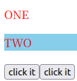
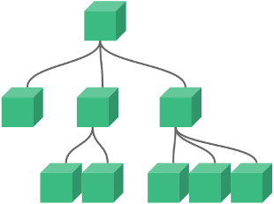
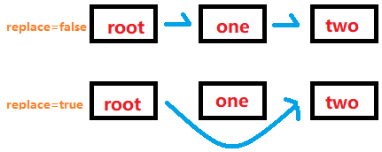

# 安装vue

**一、安装node.js和npm**

```shell
sudo apt-get update
sudo apt-get install nodejs
sudo apt-get install npm
```

**二、下载cnpm**

```shell
sudo npm install -g cnpm --registry=https://registry.npm.taobao.org
cnpm -v
```

**四、更新node**

```shell
sudo npm cache clean -f
sudo npm install -g n
sudo n stable
```

**五、升级npm到最新版本**

```shell
sudo npm install npm@latest -g
```

**六、下载vue**

```shell
sudo cnpm install vue
sudo cnpm install -g @vue/cli
vue -V
```

**七、创建vue3项目**

* 按y使用淘宝源，选择vue3

```shell
vue create demo
```

**八、启动项目**

```shell
#进入项目目录里
cd demo
npm run serve
```

# Vue简介

**一、vue**

* 用于处理视图层的框架
* soc原则（关注点分离原则）
* [vue文档](https://cn.vuejs.org/guide/introduction.html)

**二、常用的不同组件的功能**

* `axios`：网络通信
* `vue-router`：页面跳转
* `vuex`：状态管理
* `Element-UI`：组件UI

# VUE项目

## vue文件

**一、vue文件基本结构**

* vue文件的基本结构由组件dom模板、js脚本和css组成
* 可以使用import导入其他vue文件

```vue
<template>
	组件html
</template>
<script>
	组件js脚本
</script>
<style>
	组件css样式
</style>
```

## 其它文件

**一、main.js作用**

* 实现对vue组件的挂载到对应html位置（可以写一些js脚本，但建议在vue文件里写）
* 需要使用`import`导入vue文件
* 使用`create().mount()`将vue组件挂载到html位置

```javascript
import {createApp} from "vue"
import App from "./App.vue"		//App为别名，后面为文件路径
create(App).mount("#app")
```

```html
<html>
    <body>
        <div id="app"></div>
    </body>
</html>
```

**二、assets**

* 用于存放图片、视频等资源

**三、components**

* 存放vue组件，在main.js挂载

## Vue文件的JS脚本结构

**一、import与export**

* import用于在一个模块中加载另一个含export接口的模块（从外导入）
* export用于对外输出变量的接口，也可用于插入文本到组件模板里
* `export default`只允许向外暴露一次，常用于向模板发送变量、方法

**二、data()**

* Vue创建新组件实例的过程中会调用该函数，要求返回一个对象
* Vue得到对象后以`$data`的形式存储在组件实例中

```vue
<script>
export default{
    data(){
        return{
			一系列键值对
        }
    }
}
</script>
```

**三、方法**

* 使用`methods`对象向组件添加方法
* Vue自动为`methods`绑定组件实例，使用`this`表示当前组件实例
* `methods`中使用`this`可以调用`$data`里的键值对
* `methods`里避免使用箭头函数

```vue
<script>
export default{
	methods:{
        方法名:function(){
            ...
        }
    }
}
</script>
```

**四、计算属性**

* 该区域内的方法用于处理复杂的计算
* <font color=red>该区域内只能引用data数据，不能修改data数据</font>
* <font color=blue>该区域的方法必须返回一个值，计算里的方法作为属性使用，属性名为方法名</font>
* 如果data里某些数据发生改变，则computed里对应的方法会更新数据
* 计算属性计算完后会缓存数据，下次调用时直接获取缓存数据（提高性能）

```vue
<script>
export default{
	computed:{
        方法名:function(){
            ...
            return ...
        }
    }
}
</script>
```

```vue
<template>{{add}}</template>
<script>
    export default{
        data(){
			return{
                id:1
            }
        }
    }
    computed:{
        add:function(){
            let temp=this.id+1
            return temp
        }
    }
</script>
```

**五、计算属性的get和set方法**

* 计算属性默认有`get`方法，set方法按需设置
* get方法用于取值
* <font color=blue>set方法用于接收外部传来的值并修改`data`数据</font>，此时计算属性可以作为一个变量（`计算属性=值`）

```vue
<!-- 完整的计算属性写法，包含get和set-->
<script>
    computed:{
		方法名:{
            get:function(){
                ...
            },
            set:function(newValue){
                ...
                //this.变量=newValue+1
            }
        }
    }
</script>
<!-- 简写的计算属性写法，只包含get-->
<script>
    computed:{
		方法名:function(){
            
        }
    }
</script>
```

## vite创建项目

```bash
npm init vite@latest 项目名 -- --template vue
```

# 模板语法

## 插入文本

**一、动态更新文本**

* 使用`{{变量}}`插入文本，随变量的值改变而改变

```vue
<template>
	<div>
        <p>id:{{id}}</p>
        <p>uname:{{uname}}</p>
    </div>
</template>
```

**二、插入静态文本**

* 使用`v-once`属性实现组件文本只能更新一次，变量的数据更改时不会再变化

```vue
<template>
	<div>
        <p>id:{{id}}</p>
        <p v-once>uname:{{uname}}</p>	<!-- uname只更新一次-->
    </div>
</template>
```

**三、插入html文本**

* 使用`v-html=""`属性实现插入html文本（变量含html语法）
* 需要指定变量，不需要使用`{{变量}}`来输出
* 不要存储并广播用户提供的内容，容易导致`XSS攻击`（用户输入的js脚本能对网页进行攻击）

```vue
<template>
	<p v-html="变量名"></p>
</template>
```

## 修改属性

**一、动态修改属性的值**

* 变量的值改变时，标签的属性随之改变
* 使用`v-bind:标签属性="变量"`实现动态修改标签属性
* 可以简写为`:标签属性="变量"`
* 不能实现部分修改，使用`JavaScript`表达式才能实现

```vue
<temple>
	<p>
    	
    </p>
</temple>
```

**二、动态绑定多个属性**

* 使用`v-bind`属性实现
* 要求返回一个对象，里面的键值对与标签属性对应

```vue
<temple>
	<div v-bind="对象名"></div>
</temple>
<script>
export default{
    data(){
        return{
            对象名:{
                属性名:值,
                属性名:值
            }
        }
    }
}
</script>
```

**三、动态修改属性名**

* 使用`v-bind:[变量名]=值`实现
* 简写：`:[变量名]=值`

```vue
<temple>
	<div :[myAttribute]=2></div>
</temple>
<script>
export default{
    data(){
        return{
            myAttribute:"id"
        }
    }
}
</script>
```

## JavaScript表达式

**一、文本中使用JS表达式**

* 使用`{{表达式}}`实现

```vue
<template>
	<!--简单计算-->
	<p>{{num+1}}</p>
	<!--三元式判断，值可以设置数字和文本-->
	<p>{{ok?'true时变量值为':'false时变量值为'}}</p>
	<!--使用javascript方法修改变量值（字符串反转）-->
	<p>{{ message.split('').reverse().join('') }}</p>
</template>
```

**二、标签属性的局部更新**

* 需要使用反引号括住属性内容，使用`${变量}`实现属性的部分修改
* 属性格式：`:属性="``"`

```vue
<template>
	
</template>
```

**三、调用方法获取值**

* 使用`{{方法名()}}`实现
* 必须有`()`否则方法会认为是变量

```vue
<template>
	<span>{{getNum()}}</span>
</template>
```

**四、调用方法获取属性的值**

* 使用`:属性="方法()"`实现

```html
<template>
	<span :id="getNum()">demo</span>
</template>
```

## 指令

* 指令是带有`v-`的特殊属性
* 常见指令：`v-bind`,`v-html`,`v-for`,`v-on`,`v-slot`

**一、`v-if`的使用**

* 当设置的变量值为`true`时插入该html模板，`false`时移除html模板
* 使用格式：`v-if="变量名"`

```vue
<p v-if="ok">hello world</p>
```

**二、`v-on`的使用**

* 用于设置监听DOM事件
* 使用格式：`v-on:监听事件="JS表达式或方法()"`
* 简写格式：`@监听事件="JS表达式或方法()"`
* 使用`this`获取`data()`里的变量

```vue
<template>
	<button @click="add()">{{id}}</button>
</template>
<script>
	export default{
        data(){
            id:1
        },
        methods:{
            add:function(){
                this.id=this.id+1
            }
        }
    }
</script>
```

**三、修饰符**

* 修饰符是以点开头的特殊后缀

## 指令的缩写

| 指令名  | 缩写 |
| ------- | ---- |
| v-bind: | :    |
| v-on:   | @    |

# 侦听器

**一、侦听器**

* 通过`watch`实现响应数据的变化
* 在数据变化时，执行异步或开销较大的操作时使用（请求后端数据）
* 通过返回方法实现监听

```vue
<script>
	export default{
        watch:{		//用于监听数据变化
            监听的变量名:function(newValue,oldValue){
                ...
            }
        }
    }
</script>
```

```vue
<template>
  <div>
    <p>{{message}}</p>
    <p>change number:{{change}}</p>
    <button @click="click()">click it</button>
  </div>
</template>
<script>
    export default {
        data(){
            return{
                message:0,
                change:0
            }
        },
        methods:{
            //点击button改变message
            click:function () {
                this.message=this.message+1
            }
        },
        watch:{
            //以监听对象message名作为函数名对message进行监听
            message:function(newValue,oldValue){
                //控制台输出改变前后的值
                console.log(newValue,oldValue)
                //累计改变次数
                this.change=this.change+1
            }
        }
    }
</script>
```

**二、及时侦听器**

* 页面初始化时就调用侦听器函数
* 设置`immediate`属性值为`true`开启及时监听
* 将处理方法写在`handler`里
* 通过返回对象实现及时监听

```vue
<script>
    export default{
        watch:{
            监听的变量名:{
                immediate:true,
                handler:function(newValue,oldValue){
                    ......
                }
            }
        }
    }
</script>
```

**三、深度侦听器**

* 一般的侦听器不能监听对象的属性是否发生变化，需要用到深度侦听器
* 使用`deep`启动侦听器，使用`handler`定义处理方法，获取的参数为对象
* <font color=orange>深度侦听器会对对象里的所有属性添加侦听器，有较大的开销</font>

```vue
<template>
  <div>
    <p>{{user.name}}</p>
    <p>{{user.age}}</p>
    <button @click="click()">click it</button>
  </div>
</template>
<script>
export default {
    //返回对象
  data(){
     return{
        user:{
          name:"hello",
          age:18
        }
     }
  },
    //定义点击方法
  methods:{
      click:function () {
        this.user.age=this.user.age+1
      }
  },
  watch:{
      //侦听对象里的所有属性
    user:{
        //使用深度侦听
      deep:true,
        //获取新的对象
      handler:function (newObj) {
        alert(newObj.age);
      }
    }
  }
}
</script>
```

**四、侦听对象里某个属性**

* 使用深度侦听时会对对象里所有属性进行侦听，性能消耗大且容易引发bug
* 使用字符串形式作为侦听方法进行优化（`"对象.属性"`）
* `newValue`和`oldValue`为对象特定属性的新值和旧值
* 不需要使用`deep`

```vue
<template>
  <div>
    <p>{{user.name}}</p>
    <p>{{user.age}}</p>
    <button @click="click()">click it</button>
  </div>
</template>
<script>
export default {
  data(){
    return{
      user:{
        name:"hello",
        age:18
      }
    }
  },
  methods:{
    click:function () {
      this.user.age=this.user.age+1
    }
  },
  watch:{
    "user.age": {
      handler:function (newValue) {
        alert(newValue);
      }
    }
  }
}
</script>
```

# class属性与class样式的绑定

**一、使用键值对灵活使用多种样式**

* 通过`v-bind`使用变量绑定类名，实现样式的动态切换
* 变量的值为布尔类型，`true`则使用样式，`false`则不使用样式
* 标签可以使用多个类名实现样式的灵活组合使用
* 如果标签有多个`class`属性，`vue`会自动合并多个class，值绑定`true`

```vue
<template>
  <div>
      <!--使用one样式-->
    <p :class="{one:ok}">ONE</p>
      <!--使用组合样式-->
    <p :class="{one:ok,two:bgc}">TWO</p>
    <button @click="one()">click it</button>
    <button @click="two()">click it</button>
  </div>
</template>
<script>
export default {
  data(){
    return{
        //返回布尔变量的默认值
      ok:true,
      bgc:false
    }
  },
  methods:{
      //反转ok的值
    one:function () {
      this.ok=!this.ok
    },
      //反转bgc的值
    two:function () {
      this.bgc=!this.bgc
    }
  },
}
</script>
<style>
.one{
  color:red;
}
.two{
  background-color:skyblue;
}
</style>
```



**二、使用对象实现灵活使用多种样式**

* `data`里定义一个对象，键值对的格式为`样式名:布尔值`
* 使用`v-bind`绑定样式对象
* 对象里属性的值可以定义一个方法进行改变

```vue
<template>
  <div>
    <p :class="combineStyle">TWO</p>
  </div>
</template>
<script>
export default {
  data(){
    return{
      combineStyle:{
        one:true,
        two:true
      }
    }
  },
}
</script>

<style>
.one{
  color:red;
}
.two{
  background-color:skyblue;
}
</style>
```

**三、使用数组实现使用多种样式**

* 使用`v-bind`将class绑定到一个css样式数组
* 一般数组不能灵活控制类名，需要与对象结合（元素格式`{元素:布尔值}`）

```vue
<template>
	<p :class="[one,two]">hello world</p>
</template>
<style>
    .one{
        background:skyblue;
    }
    .two{
        color:red;
    }
</style>
```

**四、使用计算属性灵活控制样式**

* 使用计算属性使用布尔运算对组件样式进行选择
* 计算属性返回对象可实现使用组合样式
* 可以实现请求成功和请求失败的样式切换

```vue
<template>
  <div>
      <!--使用计算属性-->
    <p :class="classSelector">hello world</p>
  </div>
</template>
<script>
export default {
  data(){
    return{
        //请求成功时，error为null，与布尔值运算时js默认为false
      ok:true,
      error:null
    }
  },
  computed:{
      //定义计算属性名
    classSelector:function () {
        //返回对象
      return {
          //请求失败时使用失败样式
        err:this.error,
          //请求成功时使用成功样式，使用与运算
        access:this.ok && !this.error,
          //其它样式，比如背景
        bgc:true
      }
    }
  },
}
</script>
<style>
   	/*错误样式--文字*/
.err{
  color:red;
}
    /*成功样式--文字*/
.access{
  color:orange;
}
.bgc{
    /*背景*/
  background-color:skyblue;
}
</style>
```

# style属性与css语句的绑定

**一、使用字符串**

```vue
<template>
	<p style="color:red">hello world</p>
</template>
```

**二、使用键值对**

* 使用`v-bind`绑定`style`属性
* `css`语句里样式的值用键表示，`$data`里返回该键值对
* 对于有`-`的`css`标签需要转换为驼峰命名，也可以使用反引号括住

```vue
<template>
	<p :style="{color:mycolor}">hello world</p>
</template>
<script>
	export default{
        data(){
            return{
                mycolor:"red"
            };
        }
    };
</script>
```

**三、使用对象**

* 对于有`-`的`css`标签需要转换为驼峰命名，也可以使用反引号括住
* 使用对象返回`style`的样式

```vue
<template>
	<p :style="styleObj">hello world</p>
</template>
<script>
	export default{
        data(){
            return{
                styleObj:{
                    color:red,
                    fontSize:18px
                }
            };
        }
    };
</script>
```

# 渲染

## 声明式渲染

**一、声明式渲染**

* 在html里实现将数据写进DOM里（大后端不常用）
* 定义一个数据对象，要求里面有一个名为data的函数返回数据
* 使用`Vue.createApp()`装载数据，使用`mount()`挂载到标签对象
* 在标签对象内使用`{{变量名}}`设置模板
* 常用于`main.js`文件

```javascript
//声明式渲染格式
	//定义数据
let mydata={
    data:function(){
        return{
            变量名:数据,
            变量名:数据
        }
    }
};
	//装载数据并渲染
Vue.createApp(mydata).mount("选择器");
```

```javascript
let person={
    data:function(){
        return{
            id:10
        }
    }
};
	//装载数据并渲染
Vue.createApp(person).mount("#person");
```

## 条件渲染

### v-if,v-else

**一、v-if,v-else**

* `v-if`用于条件性地渲染一块内容，只有`v-if`的表达式或变量返回`true`值时才被渲染
* `v-else`则为表达式或变量返回`false`时被渲染

```vue
<template>
	<div>
    	<p v-if="">true</p>
		<p v-else>false</p>
        <p v-if="age>=18">18+</p>
		<p v-else>18-</p>
	</div>
</template>
<script>
	export default{
        data(){
            return{
				ok:false,
                age:19
            };
        }
    };
</script>
```

**二、条件渲染分组**

* 使用`template`标签包裹分组元素，渲染到`html`时该标签会消失

```vue
<template>
	<div>
		<template v-if="age>=18">
			<p>C/C++</p>
			<p>Java</p>
		</template>
		<template v-else>
			<p>Python</p>
			<p>Go</p>
		</template>
	</div>
</template>
<script>
	export default{
        data(){
            return{
                age:19
            };
        }
    };
</script>
```

### v-show

**一、v-show**

* `v-show`的使用与`v-if`相同，但`v-show`没有`v-else`，只有在`true`时才能使用
* v-show只是简单的切换元素的`display`（值为`none`时消失）

```vue
<template>
	<p v-show="ok">hello world</p>
</template>
```

### v-if与v-show的不同

| 不同点   | v-if                                                  | v-show                 |
| -------- | ----------------------------------------------------- | ---------------------- |
| 切换过程 | 条件块内的监听器和组件销毁重建                        | 修改`display`的值      |
| 条件     | v-if能渲染出true时的组件，使用v-else渲染false时的组件 | 只能渲染true时组件     |
| 渲染开销 | v-if有更高的开销，尤其在切换组件时                    | 开销小，适用于频繁切换 |

## 列表渲染

### v-for

**一、v-for遍历数组**

* `v-for`常用在`li`标签内
* `v-for`使用格式：`v-for="元素别名 in 数组"`
* `key`：列表唯一标识，vue默认用`index`（需要中间插入数据的情况要设置唯一标识，否则多选会发生漂移）
* 使用`{{别名}}`渲染出列表元素

```vue
<template>
	<ul>
        <li v-for="item in arr" :key="item">{{item}}</li>
    </ul>
</template>
```

**二、v-for使用index**

* 格式：`v-for="(元素别名,index) in 数组"`

```vue
<template>
	<ul>
        <li v-for="(item,index) in arr" :key="index">{{index}}-->{{item}}</li>
    </ul>
</template>
```

**三、v-for遍历对象的键值对**

* 格式：`v-for="(元素别名,key) in 对象"`

```vue
<template>
	<ul>
        <li v-for="(item,key) in personObj" :key="key">{{key}}-->{{item}}</li>
    </ul>
</template>
<script>
	export default{
        data(){
            return{
                personObj:{
                    name:"demo",
                    age:19,
                    sex:"man"
                }
            };
        }
    };
</script>
```

**四、遍历对象并使用索引**

* 格式：`v-for="(元素别名,key,index) in 对象"`

```vue
<template>
	<ul>
        <li v-for="(item,key,index) in personObj" :key="index">{{key}}-->{{item}}</li>
    </ul>
</template>
```

**五、key的使用**

* `key`表示标识，当需要插入有顺序的数据时需要设置唯一标识
* 不设置`key`时，索引会因为插入数据而改变导致无法锁定控件

```vue
<template>
  <div>
      <ul>
          <!--假设传来的值是唯一的-->
        <li v-for="(item) in person" :key="item"><input type="checkbox" name="" id=""/>{{item}}</li>
      </ul>
  </div>
  <p>
    <button @click="change">click me</button>
  </p>
</template>
<script>
export default {
  data(){
    return{
      person:["one","two","three"]
    }
  },
  methods:{
      change:function(){
        //头插
        this.person.unshift("zero")
      }
  },
}
</script>
```

## 数组更新检测

### 更新

**一、使用索引更新数组并响应视图**

* `vue3`里修改数组元素可以被响应到页面中

```vue
<template>
  <div>
      <ul>
        <li v-for="(item,index) in person" :key="index">{{item}}</li>
      </ul>
  </div>
  <p>
    <button @click="change">click me</button>
  </p>
</template>
<script>
export default {
  data(){
    return{
      person:["one","two","three"]
    }
  },
  methods:{
      change:function(){
        //改变数组
        this.person[2]="changed"
      }
  },
}
</script>
```

### 尾部相关

**一、数组尾部追加元素**

* 在`methods`里定义方法，并使用`.push()`追加元素
* 括号内可添加多个元素

```vue
<template>
  <div>
      <ul>
        <li v-for="(item,index) in person" :key="index">{{item}}</li>
      </ul>
  </div>
  <p>
    <button @click="change">click me</button>
  </p>
</template>
<script>
export default {
  data(){
    return{
      person:["one","two","three"]
    }
  },
  methods:{
      change:function(){
        //追加元素
        this.person.push("changed")
      }
  },
}
</script>
```

**二、删除数组末尾的元素**

* 在`methods`里定义方法，并使用`.pop()`删除末尾元素

```vue
<template>
  <div>
      <ul>
        <li v-for="(item,index) in person" :key="index">{{item}}</li>
      </ul>
  </div>
  <p>
    <button @click="change">click me</button>
  </p>
</template>
<script>
export default {
  data(){
    return{
      person:["one","two","three"]
    }
  },
  methods:{
      change:function(){
        //删除末尾元素
        this.person.pop()
      }
  },
}
</script>
```

### 头部相关

**一、删除第一位元素**

* 在`methods`里定义方法，并使用`.shift()`删除首位元素

```vue
<template>
  <div>
      <ul>
        <li v-for="(item,index) in person" :key="index">{{item}}</li>
      </ul>
  </div>
  <p>
    <button @click="change">click me</button>
  </p>
</template>
<script>
export default {
  data(){
    return{
      person:["one","two","three"]
    }
  },
  methods:{
      change:function(){
        //删除首位元素
        this.person.shift()
      }
  },
}
</script>
```

**二、从头插入元素**

* 在`methods`里定义方法，并使用`.unshift()`在头部追加元素

```vue
<template>
  <div>
      <ul>
        <li v-for="(item,index) in person" :key="index">{{item}}</li>
      </ul>
  </div>
  <p>
    <button @click="change">click me</button>
  </p>
</template>
<script>
export default {
  data(){
    return{
      person:["one","two","three"]
    }
  },
  methods:{
      change:function(){
        //删除首位元素
        this.person.unshift("changed")
      }
  },
}
</script>
```

### splice方法

**一、splice的删除**

* 在`methods`里定义方法，并使用`.splice()`进行操作
* `splice()`方法可以实现删除多个元素
* 第一个参数：开始处理的元素下标
* 第二个参数：要处理的元素个数

```vue
<template>
  <div>
      <ul>
        <li v-for="(item,index) in person" :key="index">{{item}}</li>
      </ul>
  </div>
  <p>
    <button @click="change">click me</button>
  </p>
</template>
<script>
export default {
  data(){
    return{
      person:["one","two","three"]
    }
  },
  methods:{
      change:function(){
        //删除多位元素
        this.person.splice(1,2)
      }
  },
}
</script>
```

**二、splice的插入**

* 可以在特定索引位置插入元素
* 第一个参数：开始处理的元素下标
* 第二个参数：设置为0，表示无元素删除
* 第三个参数：要插入的所有元素

```vue
<template>
  <div>
      <ul>
        <li v-for="(item,index) in person" :key="index">{{item}}</li>
      </ul>
  </div>
  <p>
    <button @click="change">click me</button>
  </p>
</template>
<script>
export default {
  data(){
    return{
      person:["one","two","three"]
    }
  },
  methods:{
      change:function(){
        //插入多位元素
        this.person.splice(1,0,"change1","change2")
      }
  },
}
</script>
```

**三、splice替换元素**

* 可以在特定索引位置替换多个元素
* 第一个参数：开始处理的元素下标
* 第二个参数：设置要替换元素的个数
* 第三个参数：所有新值，个数与第二个参数对应

```vue
<template>
  <div>
      <ul>
        <li v-for="(item,index) in person" :key="index">{{item}}</li>
      </ul>
  </div>
  <p>
    <button @click="change">click me</button>
  </p>
</template>
<script>
export default {
  data(){
    return{
      person:["one","two","three"]
    }
  },
  methods:{
      change:function(){
        //替换多位元素
        this.person.splice(1,2,"change1","change2")
      }
  },
}
</script>
```

### 排序

**一、排序**

* 在`methods`里定义方法，并使用`.sort()`对数组进行操作

```vue
<template>
  <div>
      <ul>
        <li v-for="(item,index) in person" :key="index">{{item}}</li>
      </ul>
  </div>
  <p>
    <button @click="change">click me</button>
  </p>
</template>
<script>
export default {
  data(){
    return{
      person:["one","two","three"]
    }
  },
  methods:{
      change:function(){
        //排序
        this.person.sort()
      }
  },
}
</script>
```

**二、反转**

* 在`methods`里定义方法，并使用`.reverse()`对数组进行操作
* 字符串的反转：需要使用`.split('')`变成数组，使用`.reverse()`进行反转，使用`.join('')`重新变成字符串

```vue
<template>
  <div>
      <ul>
        <li v-for="(item,index) in person" :key="index">{{item}}</li>
      </ul>
  </div>
  <p>
    <button @click="change">click me</button>
  </p>
</template>
<script>
export default {
  data(){
    return{
      person:["one","two","three"]
    }
  },
  methods:{
      change:function(){
        //反转
        this.person.reverse
      }
  },
}
</script>
```

# 事件处理

## 点击事件与event

**一、@click点击事件**

* 使用`@click`设置点击事件
* 在`methods`中定义点击相关方法
* `@click`里设置无参数时，`methods`方法里默认接收一个点击`event`

```vue
<template>
  <div>
    {{count}}
  </div>
  <p>
      <!--设置点击事件-->
    <button @click="change">click me</button>
  </p>
</template>
<script>
export default {
  data(){
    return{
      count:0
    }
  },
  methods:{
      //点击事件无传入参数默认返回event
      change:function(event){
        console.log(event)
        this.count++
      }
  },
}
</script>
```

**二、点击事件的有参数返回**

* 在`@click`里设置函数，函数里要设置传入参数并且是具体的值

```vue
<template>
  <div>
    {{count}}
  </div>
  <p>
      <!--设置点击事件并传入参数-->
    <button @click="change(5)">click me</button>
  </p>
</template>
<script>
export default {
  data(){
    return{
      count:0
    }
  },
  methods:{
      //传入参数并使用
      change:function(data){
        this.count+=data
      }
  },
}
</script>
```

**三、点击事件返回参数和事件**

* `@click`里方法使用`$event`代表返回事件

```vue
<template>
  <div>
    {{count}}
  </div>
  <p>
      <!--设置点击事件并传入参数和事件-->
    <button @click="change(5,$event)">click me</button>
  </p>
</template>
<script>
export default {
  data(){
    return{
      count:0
    }
  },
  methods:{
      //传入参数和事件并使用
      change:function(data,event){
        console.log(event)
        this.count+=data
      }
  },
}
</script>
```

## 多事件处理（多方法响应）

**一、多方法处理**

* 一个事件内可以有多个方法处理
* 每个方法使用`,`进行隔开

```vue
<template>
  <div>
    {{count}}
  </div>
  <p>
    <button @click="change(5,$event),response(12)">click me</button>
  </p>
</template>
<script>
export default {
  data(){
    return{
      count:0
    }
  },
  methods:{
      //处理方法一
      change:function(data,event){
        console.log(event)
        this.count+=data
      },
      //处理方法二
      response:function (num){
        alert(num)
      }
  },
}
</script>
```

## 事件修饰符

**一、阻止父元素触发事件**

* 在`vue`中，假如父标签有点击事件，当子标签触发自身的事件后会自动触发父标签的事件

* 在事件后追加`.stop`可以阻止父标签点击事件的触发(`@click.stop`)

```vue
<template>
  <div @click="one">
      <button @click.stop="two">click me</button>
  </div>
</template>
<script>
export default {
  methods:{
    one:function () {
      console.log("parent")
    },
    two:function () {
      console.log("children")
    }
  },
}
</script>
```

**二、阻止默认行为**

* 在`vue`中使用`.prevent`阻止默认的行为(`click.prevent`)

```vue
<template>
  <form action="#">
    <button type="submit" @click="myUpload">up load</button>
  </form>
</template>
<script>
export default {
  methods:{
    myUpload:function () {
        <!--打印OK-->
      console.log("OK")
    }
  }
}
</script>
```

**三、只触发一次事件**

* 在`vue`中使用`.once`设置只能触发一次响应(`click.once`)

```vue
<template>
  <div>
    {{count}}
  </div>
  <button @click.once="change">click me</button>
</template>
<script>
export default {
  data(){
    return{
      count:0
    }
  },
  methods:{
    change:function () {
      this.count++
    }
  }
}
</script>

```

## 键盘事件与键盘修饰符

**一、键盘事件**

* 使用`@keyup`,`@keydown`设置键盘响应事件
* 不设置修饰符限定按钮时默认监听键盘所有按钮

```vue
<template>
	<!--监听enter键-->
  <input type="text" @keyup.enter="msg">
</template>
<script>
export default {
  data(){
  },
  methods:{
    msg:function () {
      console.log("upload")
    }
  }
}
</script>
```

**二、常用的按键修饰符**

| 键                 | vue修饰符 |
| ------------------ | --------- |
| ENTER              | .enter    |
| TAB                | .tab      |
| DELETE和退格键`<-` | .delete   |
| ESC                | .esc      |
| 空格               | .space    |
| 上                 | .up       |
| 下                 | .down     |
| 左                 | .left     |
| 右                 | .right    |

# 表单输入绑定

## 常见的输入绑定

**一、简单的输入绑定**

* 使用`v-model`实现输入框与变量进行绑定
* 格式：`v-model="变量"`
* `v-model`本质：`v-bind`绑定value属性，`v-on`添加`input`事件并通过`$event`取值(`@input`)

```vue
<template>
	<div>
        <p>
    		<input type="text" v-model="msg"/>
    	</p>
        <p>
    		{{msg}}
    	</p>
    </div>
</template>
<script>
export default{
    data(){
        return{
            msg:"hello world"
        }
    }
}
</script>
```

**二、单选的绑定**

* `v-model`绑定到变量，要求每个单选都有`value`

```vue
<template>
	<div>
        <p>
            <input type="radio" v-model="myOption" value="one"/>
            <input type="radio" v-model="myOption" value="two"/>
    	</p>
        <p>
    		{{myOption}}
    	</p>
    </div>
</template>
<script>
export default{
    data(){
        return{
            myOption:null
        }
    }
}
</script>
```

**三、复选的绑定**

* `v-model`绑定到数组，要求每个复选框都有`value`用于加进数组里

```vue
<template>
	<div>
        <p>
            <input type="checkbox" v-model="arr" value="one"/>
            <input type="checkbox" v-model="arr" value="two"/>
            <input type="checkbox" v-model="arr" value="three"/>
    	</p>
        <p>
    		{{arr}}
    	</p>
    </div>
</template>
<script>
export default{
    data(){
        return{
            arr:[]
        }
    }
}
</script>
```

**四、列表框的绑定**

* `v-model`绑定到变量

```vue
<template>
	<div>
		<select v-model="myOption">
        	<option value="one">one</option>
            <option value="two">two</option>
            <option value="three">three</option>
    	</select>
        <p>
    		{{myOption}}
    	</p>
    </div>
</template>
<script>
export default{
    data(){
        return{
            myOption:null
        }
    }
}
</script>
```

**五、多选列表的绑定**

* `v-model`绑定到数组

```vue
<template>
	<div>
		<select v-model="myOption" multiple>
        	<option value="one">one</option>
            <option value="two">two</option>
            <option value="three">three</option>
    	</select>
        <p>
    		{{myOption}}
    	</p>
    </div>
</template>
<script>
export default{
    data(){
        return{
            myOption:[]
        }
    }
}
</script>
```

## v-model修饰符

**一、lazy**

* 输入框失去焦点后才同步输入框的数据
* 使用格式：`v-model.lazy`

```vue
<template>
	<div>
        <p>
    		<input type="text" v-model.lazy="msg"/>
    	</p>
        <p>
    		{{msg}}
    	</p>
    </div>
</template>
<script>
export default{
    data(){
        return{
            msg:""
        }
    }
}
</script>
```

**二、number**

* 如果输入框的内容为纯数字，则转为数字类型
* 使用格式：`v-model.number`

```vue
<template>
	<div>
        <p>
    		<input type="text" v-model.number="msg"/>
    	</p>
        <p>
    		{{msg}}
            {{typeof msg}}
    	</p>
    </div>
</template>
<script>
export default{
    data(){
        return{
            msg:""
        }
    }
}
</script>
```

**三、trim**

* 去除输入值两边的空格
* 使用格式：`v-model.trim`

```vue
<template>
	<div>
        <p>
    		<input type="text" v-model.trim="msg"/>
    	</p>
        <p>
    		{{msg}}
    	</p>
    </div>
</template>
<script>
export default{
    data(){
        return{
            msg:""
        }
    }
}
</script>
```

# Vue组件

## 组件的组织

**一、组件的树形结构**

* 一个应用会以一棵嵌套的组件树的形式来组织
* 一般以`App.vue`作为项目的根组件，而`App.vue`绑定到`html`里
* 每个组件都由`template`,`script`和`style`组成



## Vue组件的基本使用

**一、项目结构**

* `assets`：用于存放图片等资源
* `components`：用于存放`vue`的所有组件，建议所有父节点处都要有一个`components`目录
* `App.vue`：作为根组件用于引入vue组件
* `public`：存放`html`和网页图标

**二、项目导入组件**

* 在`<script>`中使用`import`导入项目的其它组件
* 组件的命名使用大驼峰语法
* 格式：`import 别名 from 相对地址`

```vue
<script>
import demo from "./compontents/One.vue"
</script>
```

**三、项目组件的使用**

* 导入组件后需要注册组件，注册时标签名默认导入时的别名
* 注册完组件后在`template`里导入组件，标签名为别名
* 在`components`里注册组件
* 注册的组件可以复用

```vue
<template>
	<!--注册组件-->
	<demo></demo>
	<!--组件的复用-->
	<demo></demo>
</template>
<script>
//导入组件
import demo from "./compontents/One.vue";
export default{
    //注册组件
    components:{
        demo
    }
}
</script>
```

## 组件数据的传递

### 复用组件之间的数据传递

**一、复用组件的数据独立**

* 复用组件里的data默认为独立的数据
* 数据独立的情况下，一个复用组件的值修改了不会影响其它复用组件

```vue
<!--组件FirstContent.vue-->
<template>
	<h2>{{num}}</h2>
	<p>
        <button @click="change">click me</button>
    </p>
</template>
<script>
export default{
    data(){
        return{
            num:0
        }
    },
    methods{
    	change:function(){
            this.num=this.num+1
        }
	}
}
</script>
```

```vue
<!--App.vue-->
<template>
	<One></One>
	<One></One>
	<One></One>
</template>
<script>
import One from "./compontents/FirstContent";
    export default{
        components:{
            One
        }
    }
</script>
```

**二、复用组件的数据共享**

* 使用`const`设置全局数据对象
* 使用格式：`const 对象={...}`
* 在`data()`里返回全局数据对象
* 能够实现复用组件共享同一个数据

```vue
<!--组件FirstContent.vue-->
<template>
	<h2>{{num}}</h2>
	<p>
        <button @click="change">click me</button>
    </p>
</template>
<script>
const numOnj={
    num:0
}
export default{
    data(){
        return numObj
    },
    methods{
    	change:function(){
            this.num=this.num+1
        }
	}
}
</script>
```

### 父组件向子组件传递数据---单向数据流

**一、数据传递**

* 在父组件里，在子组件标签自定义属性名，并传值
* 使用`v-bind`可以动态传值
* 在子组件里使用`props`取值
* `props`是个数组，要求数组里的属性名与父组件传来的属性名相同

```vue
<!--App.vue-->
<template>
	<!--定义传到子组件的属性名，并跟msg进行绑定-->
	<One :message="msg"></One>
	<p>
        <button @click="change"></button>
    </p>
</template>
<script>
import One from "./compontents/FirstContent";
    export default{
        data(){
            return{
                msg:0
            }
        },
        methods:{
            //动态传值
            change:function(){
                this.msg=this.msg+1
            }
        },
        components:{
            One
        }
    }
</script>
```

```vue
<!--组件FirstContent.vue-->
<template>
	<!--使用传来的值-->
	<h2>{{message}}</h2>
</template>
<script>
export default{
    //获取变量message
	props:["message"]
}
</script>
```

### Props类型

**一、字符串形式接收变量**

* 元素为字符串

```javascript
props:["message","name","age"]
```

**二、对象形式接收变量**

* `props`作为一个对象有多个属性，`key`为传来的属性名，`value`为类型
* 能够限制变量的类型
* 有多种可能类型可以使用数组进行表示

```javascript
props:{
    message:[String,Number],
    age:Number,
    ok,Boolean
}
```

**三、对象形式接收变量对象**

* `props`作为一个对象接收多个对象，每个对象的对象名为传来的属性名
* 可以选择类型和设置默认值
* `type`用于限制类型，`default`用于设置默认值
* `required`：用于设置必须传的值，值为布尔类型，默认`false`

```javascript
props:{
    message:{
        type:String,
        default:"null",
        required:true
    },
    age:{
        type:Number,
        default:0
    },
    ok:{
        type:Boolean,
        default:false
    }
}
```

**四、Props常用类型**

| 类型      | 描述   |
| --------- | ------ |
| `String`  | 字符串 |
| `Number`  | 数字   |
| `Boolean` | 布尔   |
| `Array`   | 数组   |
| `Object`  | 对象   |

### 子组件向父组件传递数据

**一、传递数据方式**

* 在子组件里使用自定义事件实现数据传递到父组件
* 父组件里定义接收函数，在子组件标签里连接子组件定义的自定义方法

**二、子组件传递数据的实现**

* 定义一个方法，使用`this.$emit()`自定义事件和返回数据
* `this.$emit`使用格式：`this.$emit("自定义事件名",返回的数据)`
* 将定义的方法放到点击事件里等待触发

```vue
<!--子组件FirstContent.vue-->
<template>
	<h2>{{childMSG}}</h2>
	<p>
        <button @click="sendData">click me</button>
    </p>
</template>
<script>
export default{
    data(){
        return{
            childMSG:"hello world"
        }
    },
    methods:{
        sendData:function(){
            //设置自定义方法
            this.$emit("childData",this.childMSG)
        }
    }
}
</script>
```

**三、父组件接收子组件传来的数据**

* 在组件标签里使用`@自定义事件=父组件方法`获取数据
* 父组件定义的接收方法里有参数传入，为子组件发送的数据

```vue
<!--App.vue-->
<template>
	<!--使用方法接收自定义事件发来的数据-->
	<One @childData="getChildData"></One>
	<p>{{msg}}</p>
</template>
<script>
import One from "./compontents/FirstContent";
    export default{
        data(){
            return{
                msg:""
            }
        },
        methods:{
			getChildData:function(value){
                this.msg=value
            }
        },
        components:{
            One
        }
    }
</script>
```

## Vue组件之间的访问

**一、组件间访问的相关参数**

* `$refs`：父组件访问子组件
* `$parent`：子组件访问父组件
* `$root`：访问根组件

### 父组件访问子组件的属性和方法

**一、访问的设置**

* 子组件标签中使用`ref`属性设置`key`
* 使用`this.$refs.key`访问特定的子组件
* `ref`可以标记组件内的标签获取位置信息（scrollTop）

```vue
<!--子组件FirstContent.vue-->
<template>
	<h2>
        {{childMSG}}
    </h2>
</template>
<Script>
export default{
    data(){
        return{
            //子组件数据
            childMSG:"hello world"
        }
    },
    methods:{
        //子组件方法
        tip:function(){
            alert("childFunc")
        }
    }
}
</Script>
```

```vue
<!--App.vue-->
<template>
	<!--使用ref属性设置key-->
	<One ref="child"></One>
	<p>{{msg}}</p>
	<button @click="change">click me</button>
</template>
<script>
import One from "./compontents/FirstContent";
    export default{
        data(){
            return{
                msg:""
            }
        },
        methods:{
			change:function(){
                //获取子组件数据
                this.msg=this.$refs.child.childMSG+" from child"
                //使用子组件方法
                this.$refs.child.tip()
            }
        },
        components:{
            One
        }
    }
</script>
```

### 子组件访问父组件

**一、访问的设置**

* 使用`this.$parent`访问父组件
* 当该组件被多个组件引用时容易出现`bug`，不推荐使用

### 子组件访问根组件

**一、访问的设置**

* 使用`this.$root`访问根组件
* 根组件通常会设置全局变量和全局方法

# slot插槽

**一、插槽的使用**

* 插槽用于设置基本样式，由父组件决定子组件里的标签元素，有利于组件的复用（常见于手机端的导航栏）

* 在子组件中使用`<slot>`设置插槽
* 在父组件中，使用子组件标签定义插槽内容

```vue
<!--App.vue-->
<template>
	<!--设置插槽组件-->
	<One>
        <!--返回按钮-->
    	<button>return</button>
        <!--搜索框-->
        <input type="text"/>
        <!--菜单栏-->
        <button>list</button>
    </One>
</template>
<script>
import One from "./compontents/FirstContent";
    export default{
        components:{
            One
        }
    }
</script>
```

```vue
<!--子组件FirstContent.vue-->
<template>
	<h2>{{msg}}</h2>
	<!--定义插槽位置-->
	<slot></slot>
</template>
<Script>
export default{
    data(){
        return{
            msg:"myNav"
        }
    }
}
</Script>
```

**二、具名插槽**

* 子组件里，在`slot`里使用属性`name`非插槽命名，实现多插槽处理
* 父组件里，使用`template`包裹每个插槽的元素，并使用`v-slot`匹配到具名插槽

```vue
<!--App.vue-->
<template>
	<!--设置具名插槽组件-->
	<One>
        <!--设置返回按钮样式-->
        <template v-slot:returnButton>
        	<button>return</button>
		</template>
		<!--设置搜索框样式-->
        <template v-slot:search>
			<input type="text"/>
		</template>
		<!--设置菜单栏样式-->
        <template v-slot:listButton>
			<button>list</button>
		</template>
    </One>
</template>
<script>
import One from "./compontents/FirstContent";
    export default{
        components:{
            One
        }
    }
</script>
```

```vue
<!--子组件FirstContent.vue-->
<template>
	<h2>{{msg}}</h2>
	<!--设置具名插槽-->
	<slot name="returnButton"></slot>
	<slot name="search"></slot>
	<slot name="listButton"></slot>
</template>
<Script>
export default{
    data(){
        return{
            msg:"myNav"
        }
    }
}
</Script>
```

**三、父组件插槽内容渲染**

* 父组件里，在插槽使用`{{变量}}`渲染插槽内容
* 变量的内容由父组件提供

```vue
<!--App.vue-->
<template>
	<One>
		<!--设置搜索框样式-->
        <template v-slot:search>
			{{msg}}<input type="text"/>
		</template>
    </One>
</template>
<script>
import One from "./compontents/FirstContent";
    export default{
        data(){
            return{
                msg:"搜索"
            }
        },
        components:{
            One
        }
    }
</script>
```

**四、备用插槽内容**

* 父组件没有传来内容时会使用备用内容
* 在子组件里的`slot`标签设置备用内容

```vue
<!--子组件FirstContent.vue-->
<template>
	<h2>{{msg}}</h2>
	<!--设置具名插槽-->
	<slot name="returnButton">
    	<!--设置备用内容-->
        <button>backup</button>
    </slot>
	<slot name="search"></slot>
	<slot name="listButton"></slot>
</template>
<Script>
export default{
    data(){
        return{
            msg:"myNav"
        }
    }
}
</Script>
```

**五、具名插槽使用子组件传来的值**

* 子组件里，`slot`里使用`v-bind`自定义变量并绑定组件内的变量
* 父组件里，使用`#`匹配插槽，使用`=`定义插槽来的所有数据的数据名
* 子组件设置格式：`<slot name="具名插槽名" :自定义变量名="组件内变量"`
* 父组件设置格式：`<template #具名插槽名="总变量名"`

```vue
<!--子组件FirstContent.vue-->
<template>
	<!--具名插槽向父组件传值-->
	<slot name="message" :text="msg"></slot>
</template>
<Script>
export default{
    data(){
        return{
            msg:"hello world"
        }
    }
}
</Script>
```

```vue
<!--App.vue-->
<template>
	<One>
        <!--匹配插槽并接收子组件的值到childData对象里-->
        <template #message="childData">
			{{childData.text}}
		</template>
    </One>
</template>
<script>
import One from "./compontents/FirstContent";
    export default{
        components:{
            One
        }
    }
</script>
```

# 跨级通信

**一、跨级通信**

* 使用`$parent`只能访问父组件，而对于祖先组件是不能访问的
* 在祖先组件设置`provide`，在子孙组件设置`inject`可获得祖先组件的值
* 跨级通信分为响应式和非响应式


**二、非响应式跨级通信**

* 非响应式：父组件数据变化时，子组件数据不会变化
* 祖先组件使用`provide(){}`设置变量
* 子组件使用`inject:[]`获取变量，数组内容为祖先组件设置变量的key

```vue
<!--App.vue-->
<template>
	<One></One>
</template>
<script>
import One from "./compontents/FirstContent";
    export default{
		data(){
            return{
                msg:"hello world"
            }
        },
        //设置跨域数据
        provide(){
            return{
                message:this.msg
            }
        },
        components:{
            One
        }
    }
</script>
```

```vue
<!--子组件FirstContent.vue-->
<template>
	<h1>{{message}}</h1>
</template>
<Script>
export default{
    //接收跨域数据
	inject:["message"]
}
</Script>
```

**三、响应式跨级通信**

* 祖先组件返回对象实现响应式跨域通信

```vue
<!--App.vue-->
<template>
	<One></One>
	<button @click="change">click me</button>
</template>
<script>
import One from "./compontents/FirstContent";
    export default{
		data(){
            return{
                dataObj:{
                    msg:"hello world"
                }
            }
        },
        //设置跨域数据
        provide(){
            return{
                messageObj:this.dataObj
            }
        },
        methods:{
            change:function(){
                this.dataObj.msg+=" hello world"
            }
        };
        components:{
            One
        }
    }
</script>
```

```vue
<!--子组件FirstContent.vue-->
<template>
	<h1>{{messageObj.msg}}</h1>
</template>
<Script>
export default{
    //接收跨域数据
	inject:["messageObj"]
}
</Script>
```

# 生命周期与钩子函数

## 生命周期


## 钩子函数

| 函数            | 描述                  |
| --------------- | --------------------- |
| beforeCreate()  | 组件创建前            |
| created()       | 组件创建后            |
| beforeMount()   | DOM挂载前             |
| mounted()       | DOM挂载后（出现页面） |
| beforeUpdate()  | DOM元素更新前         |
| updated()       | DOM元素更新后         |
| beforeUnmount() | 组件销毁前            |
| unmounted()     | 组件销毁后            |

# 组合式API

* 将相关的代码组合在一起有利于代码的阅读和分析
* 常用于大型项目

## setup函数

**一、`setup()`的特性**

* 在组件创建之前执行
* 作为组合式API的入口
* 能够取代`beforeCreate()`和`created()`钩子函数
* `setup()`内使用钩子函数需要在函数名前加`on`
* `setup`里没有`this`，直接`setup`里定义变量，使用变量名调用数据

## setup函数非响应式调用变量

**一、非响应式调用**

* 在`setup`内直接定义变量
* 非响应式只返回一次变量

```vue
<template>
	<h1>{{num}}</h1>
	<button @click="add">click me</button>
</template>
<script setup>
	let num=1;
    //页面数据不变，但内部数据已改变
    function add(){
        num++
    }
</script>
```

## setup函数响应式调用变量

**一、setup响应式调用前的准备**

* 在`<script setup>`里导入`ref`包

```javascript
import {ref} from 'vue';
```

**二、setup响应式调用变量**

* `ref()`输入值并返回一个对象，值保存在对象的`value`属性里
* 返回时直接返回对象，模板可以直接使用对象名
* 修改值时使用对象的`value`进行修改

```vue
<temmplate>
	<div>
        <!--直接使用对象名调用变量-->
        <h1>{{data}}</h1>
        <button @click="add">click me</button>
    </div>
</temmplate>
<script setup>
import {ref} from 'vue';
let data=ref("hello world");
function add(){
    data.value+="a"
}
</script>
```

## setup函数响应式调用对象

**一、调用前准备**

* 在`<script setup>`里导入`reactive`包

```vue
import {ref,reactive} from 'vue';
```

**二、setup函数响应式调用对象**

* 使用`reactive()`定义对象
* 修改值时直接使用`.属性`

```vue
<temmplate>
	<div>
        <P>{{msg.name}}</P>
		<p>{{msg.age}}</p>
        <button @click="add">click me</button>
    </div>
</temmplate>
<script setup>
import {reactive} from 'vue';
let msg=reactive({name:"demo",age:18});
function add(){
    msg.age+=1;
}
</script>
```

## setup函数使用watch

### 导入方法

**一、使用前准备**

* `watch`用于监听变量
* `watchEffect`用于监听对象
* `watchEffect`会自动收集匿名函数内调用的对象，但不能收集旧值，组件卸载时才结束监听

```javascript
import {watch,watchEffect} from 'vue';
```

### 监听变量

**一、监听变量的实现**

* 使用`watch()`，输入变量和匿名方法，匿名方法可以获得新值和旧值

```vue
<template>
<p>{{data}}</p>
<button @click="add">click me</button>
</template>
<script setup>
import {ref,watch} from 'vue'
let data=ref(1)
function add(){
    data.value+=1
}
watch(data,(newValue,oldValue)=>{
    console.log("new:"+newValue," old:"+oldValue)
})
</script>
```

### 监听对象属性

**一、监听变量属性实现**

* 使用`()=>对象.属性`指定监听的属性

```vue
<temmplate>
	<div>
        <P>{{msg.name}}</P>
		<p>{{msg.age}}</p>
        <button @click="add">click me</button>
    </div>
</temmplate>
<script setup>
import {reactive,watch} from 'vue'
let msg=reactive({name:"demo",age:18});
function add(){
    msg.age+=1;
}
watch(()=>msg.age,(newValue,oldValue)=>{
    console.log("new:"+newValue," old:"+oldValue)
})
</script>
```

### watchEffect的使用

**一、watchEffect**

* 自动监听回调函数引用的响应式属性
* 只能获取新值

```vue
<temmplate>
	<div>
        <P>{{msg.name}}</P>
		<p>{{msg.age}}</p>
        <button @click="add">click me</button>
    </div>
</temmplate>
<script setup>
import {reactive,watchEffect} from 'vue'
let msg=reactive({name:"demo",age:18});
function add(){
    msg.age+=1;
}
watchEffect(()=>{
    console.log(msg.age)
})
</script>
```

## setup函数使用computed

**一、导入方法**

```javascript
import {computed} from "vue";
```

**二、setup里computed的实现**

```vue
<template>
<p>{{data}}</p>
<p>{{reverseString}}</p>
</template>
<script setup>
import {ref,computed} from 'vue';
let data=ref("hello");
let reverseString=computed(()=>{
    return data.value.split('').reverse().join('');
})
</script>
```

## setup函数使用生命周期钩子

**一、hook的使用**

* 导入需要使用的钩子函数的方法
* 钩子函数里输入回调函数

```vue
<template>
<p>{{data}}</p>
<p>{{reverseString}}</p>
</template>
<script setup>
import {ref,onMounted} from 'vue';
let data=ref("");
onMounted(()=>{
    data.value="hello world"
})
</script>
```

## setup函数中的props取值

**一、导入方法**

```javascript
import {defineProps} from 'vue';
```

**二、获取父组件传来的值**

* 先使用`defineProps()`获取props对象
* 通过props对象取值

```vue
<!-- Children -->
<template>
	<p>
        {{props.num}}
    </p>
</template>
<script setup>
import {defineProps} from 'vue';
let props=defineProps({num:{type:Number,default:0}})
</script>
```

```vue
<!-- Parent -->
<template>
  <p>{{num}}</p>
  <button @click="add">click me</button>
  <Children :num="num"></Children>
</template>
<script>
import Children from "./views/ChildrenView"
export default {
  data(){
    return{
      num:0
    }
  },
  methods:{
    add:function () {
      this.num++
    }
  },
  components:{
    Children
  }
}
</script>
```


# Axios异步通信框架

## Axios简介

**一、Axios**

* 一个开源的用在浏览器端和`Node.js`的异步通信框架
* 主要用于实现`AJAX`的异步通信
* 仅支持ES6
* [Axios中文文档](https://www.axios-http.cn/docs/intro)

**二、Axios的作用**

* 从浏览器创建XMLHttpRequests
* 从`node.js`创建http请求
* 拦截请求和响应
* 转换请求数据和响应数据
* 取消请求
* 自动转换JSON数据
* 支持防御XSRF（跨域请求伪造）

## Axios下载

```bash
npm install axios
```

## 常见问题

**一、GET方法CORS头缺少`Access-Control-Allow-Origin`**

* 开发过程中由于端口只能一个应用时候而导致的跨域报错，<font color=red>被浏览器CORS策略屏蔽了</font>
* 在后端里header加`Access-Control-Allow-Origin`键值对作为临时处理方法
* 最优解：使用`nginx`配置反向代理

```go
//go的解决方式，允许全部
context.Header("Access-Control-Allow-Origin","*")
//只允许vue本地测试端访问
context.Header("Access-Control-Allow-Origin","http://localhost:8080")
```

**二、POST方法报CORS错误**

* 前端设置下面的请求头参数，不能返回json，不建议使用
* 最优解：使用`nginx`配置反向代理

```javascript
axios.defaults.headers.post["Content-Type"]="application/x-www-form-urlencoded";
```

## Get方法

### 请求数据

**一、简单的get请求获取数据**

* 使用`axios.get()`发送get请求，使用`then()`处理请求，使用`catch()`处理请求失败
* 请求处理方法和失败处理方法都输入匿名函数
* 返回的数据保存在`data`里，使用键获取值

```vue
<template>
	{{msg}}
</template>
<script>
import axios from 'axios';
export default{
	data(){
		return{
			msg:""
		}
	}，
    created(){
        axios.get("http://localhost:9090/data").then((res)=>{
            this.msg=res.data.msg;
        }).catch(()=>{
            this.msg="error"
        })
    }
}
</script>
```

### 返回数据

**一、Go后端**

```go
func main(){
    server:=gin.Default()
    //传统的键值对传递数据
    server.Get("/key",func(context *gin.context){
        data:=context.Query("name")
        fmt.Println(data)
        //没配置nginx时处理跨域问题
        context.Header("Access-Control-Allow-Origin","*")
        context.JSON(200,gin.H{"msg",data})
    })
    //Resful形式传递数据
    server.Get("/restful/:name",func(context *gin.context){
        data:=context.Param("name")
        fmt.Println(data)
        //没配置nginx时处理跨域问题
        context.Header("Access-Control-Allow-Origin","*")
        context.JSON(200,gin.H{"msg",data})
    })
    server.run(0.0.0.0:9090)
}
```

**二、get请求直接返回数据**

* 参数直接写在请求`url`上

```vue
<template>
	{{msg}}
</template>
<script>
import axios from 'axios';
export default{
	data(){
		return{
			msg:""
		}
	}，
    created(){
        //传统键值对形式
        axios.get("http://localhost:9090/key?name=demo").then((res)=>{
            this.msg=res.data.msg;
        }).catch(()=>{
            this.msg="error"
        })
    }
}
</script>
```

```vue
<template>
	{{msg}}
</template>
<script>
import axios from 'axios';
export default{
	data(){
		return{
			msg:""
		}
	}，
    created(){
        //Restful形式
        axios.get("http://localhost:9090/restful/demo").then((res)=>{
            this.msg=res.data.msg;
        }).catch(()=>{
            this.msg="error"
        })
    }
}
</script>
```

**三、get请求键值对形式返回数据**

* 使用`config`对象输入参数，在对象的`params`属性输入键值对

```javascript
axios.get("http://localhost:9090/key",{params:{name:"hello world"}}).then((res)=>{
    this.msg=res.data.msg;
}).catch(()=>{
    this.msg="error"
})
```

**四、get请求Restful形式返回数据**

* 使用字符串模板(`${ }`)实现输入参数
* 需要使用反引号括住`url`

```javascript
let name="hello world"
axios.get(`http://localhost:9090/restful/${name}`).then((res)=>{
    this.msg=res.data.msg;
}).catch(()=>{
    this.msg="error"
})
```

## 开发过程中跨域的处理方式（docker+nginx）

**一、准备阶段**

```shell
mkdir nignx
cd nignx
mkdir confg html log
cd confg
touch nginx.conf conf.d
```

**二、构建容器**

```shell
docker run -d --name mynginx -p 8080:80 \
	\-v $PWD/confg/nginx.conf:/etc/nginx/nginx.conf \
	\-v $PWD/confg/conf.d:/etc/nginx/conf.d \
	\-v $PWD/log:/var/log/nginx \
	\-v $PWD/html:/usr/share/nginx/html nginx
```

**三、构建vue项目**

```bash
npm run build
```

**四、转移文件**

* 将`dist`目录转移到`~/nginx/html`目录里

**五、编写nginx配置文件**

```nginx
worker_processes 1;
events{
    worker_connections 1024;
}
http{
    include /etc/nginx/mime.types;
    default_type application/octet-stream;
    sendfile on;
    keepalive_timeout 65;
    
    server{
        listen 80;
        server_name 0.0.0.0;
        //配置vue项目
        location /{
            root /usr/share/nginx/html/dist;
            index index.html;
        }
        //配置后端接口，172是docker环境里主机的地址
        localtion /postdata{
            proxy_pass http://172.17.0.1:9090;
        }
    }
}
```

## Post方法

**一、后端代码**

```go
func main(){
    server:=gin.Default()
    server.POST("/postdata",func(context *gin.Context){
        data,err:=context.GetRawData()
        if err!=nil{
            fmt.Println(err)
            return
        }
        var m map[string]interface{}
        err=json.Unmarshal(data,&m)
        if err!=nil{
            fmt.Println(err)
            return
        }
        fmt.Println(m)
        context.JSON(200,gin.H{"msg":"true"})
    })
    server.Run("0.0.0.0:9090")
}
```

**二、post返回json**

* 设置json请求头参数(`"application/json"`)
* 使用对象包装键值对

```javascript
axios.defaults.headers.post["Content-Type"]="application/json";
axios.post("/postdata",{name:"hello world"}).then((res)=>{
    this.msg=res.data.msg
}).catch(()=>{
    this.msg="error"
})
```

**三、自定义表单**

```vue
<template>
  <div>
    <h1>test</h1>
    <h1>{{msg}}</h1>
  </div>
  <form action="#">
      <!--v-model绑定-->
    <p>
      <input type="text" v-model="account" />
    </p>
    <p>
      <input type="password" v-model="password">
    </p>
  </form>
	<!--设置点击事件-->
  <button @click="submit()">upload</button>
</template>

<script>
import axios from 'axios';
export default {
  data(){
    return{
      account:"",
      password:"",
      msg:""
    }
  },
  methods:{
      //自定义提交
    submit:function () {
        //设置json类型
      axios.defaults.headers.post["Content-Type"] = "application/json"
        //定义数据对象
      let loginData={
        account:this.account,
        password:this.password
      }
      //发送数据，处理返回的数据
      axios.post("/postdata",loginData).then((res)=>{
        this.msg=res.data.msg
      }).catch(()=>{
        this.msg="error"
      })
    }
  }
}
</script>
```

## Vite项目实现跨域

**一、跨域实现**

* 找到`vite.config.js`文件
* 在`defineConfig`里添加`server`模块
* 在`server`模块里设置`proxy`对象用于代理
* `proxy`对象里包装多个路径对象，每个路径对象包含`target`和`changeOrigin`属性
* `target`为api来源地址，`changeOrigin`用于开启代理

```javascript
export default defineConfig({
    ...,
    server:{
    	proxy:{
    		'/path':{								//将该路径写在请求上能实现跨域请求
    			target:'https.//i.maoyan.com',		//来源地址
    			changeOrigin:true,					//开启代理
			}
		}
	}
})
```

# 路由

## 路由相关概念

**一、路由的作用**

* 改变URL，但页面不整体刷新

## 路由的安装

```bash
npm install vue-router@4
```

## 路由的简单使用

**一、安装路由模块**

```bash
npm install vue-router@4
```

**二、使用前准备**

* 创建`router`目录，里面创建`index.js`文件
* 创建`views`目录，里面放置路由组件

```shell
mkdir router views
cd router
touch index.js
```

**三、配置路由到应用**

* 修改`main.js`文件
* 导入路由文件`index.js`
* 使用`createApp()`获取app对象
* 使用`use()`挂载路由
* <font color=red>先使用`use()`再使用`mount()`</font>

```javascript
import {createApp} from 'vue'
import App from './App.vue'
import router from './router'
const app=createApp(App)
app.use(router)
app.mount('#app')
```

**四、编写index.js**

* 导入路由组件和使用的方法
* 编写路由表（对象数组），`path`为路由，`component`为路由对应的组件
* 使用`createRouter()`创建路由实例对象由路由模式和路由表组成
* 导出router对象

```javascript
//导入路由组件
import HOME from "../views/HomeContent"
import ABOUT from "../views/AboutContent"
//导入使用的路由方法
import {createRouter,createWebHashHistory} from 'vue-router'
//创建路由表
const routes=[
    {path:"/home",component:HOME},
    {path:"/alout",component:ABOUT}
]
//创建路由实例对象
const router=createRouter({
    //路由模式
    history:createWebHashHistory(),
    //路由表
    routes
})
//导出对象
export default router
```

**五、在vue组件里使用路由**

* 使用`<router-link>`标签设置路由，要加斜杆，不加默认是追加
* 使用`to`属性设置到达路由位置
* 使用`<router-view>`作为插槽显示路由里的内容

```vue
<!--App.vue-->
<template>
	<route-view></route-view>
	<p>
        <router-link to="/home"></router-link>
    </p>
	<p>
        <router-link to="/about"></router-link>
    </p>
</template>
```

```vue
<!--AboutContent.vue-->
<template>
	<h1>about web</h1>
</template>
```

```vue
<!--HomeContent.vue-->
<template>
	<h1>home web</h1>
</template>
```

## 带参数的动态路由

**一、发送参数到路由组件**

* 在`index.js`里使用`Restful`形式定义参数
* 在`App.vue`里填写参数并发送

```javascript
const routes=[
    {path:"/user/:id",component:USER}
]
```

```vue
<!--App.vue-->
<template>
	<route-view></route-view>
	<p>
        <router-link to="/user/12312"></router-link>
    </p>
</template>
```

**二、vue2语法获取路由参数**

* 使用`this.$route.params`获取参数

```vue
<script>
export default{
    methods:{
		goPage:function(){
        	this.$router.push({name:"demo",params:{id:123}})
    	}
    }
}
</script>
```

```vue
<!--UserContent.vue-->
<template>
	<h1>user web</h1>
	<h2>{{msg}}</h2>
</template>
<script>
export default{
    data(){
        return{
            msg:""
        }
    },
    mounted(){
        this.msg=this.$route.params.id
    }
}
</script>
```

**三、setup语法获取路由参数**

* 需要导入`vueRoute()`方法
* 使用`useRoute().params`获取参数

```vue
<!--UserContent.vue-->
<template>
	<h1>user web</h1>
</template>
<script setup>
	import {userRoute} from 'vue-router'
    console.log(useRoute().params.id)
</script>
```

## 路由的正则设置

**一、使用正则匹配**

* 使用`Restful`形式的url定义参数
* 在参数后面使用`()`使用正则表达式

```javascript
const routes=[
    {psth:"/:path(.*)"}				//path为参数，后面括号为使用正则
]
```

**二、设置路由的404**

* 必须在所有路由的最下面
* 使用正则表达式匹配所有路径

```javascript
const routes=[
    {path:"/home",component:Home},
    {path:"/about",component:ABOUT},
    {psth:"/:path(.*)"}				//path为参数，后面括号为使用正则
]
```

## 嵌套路由

**一、使用children设置嵌套路由**

* 嵌套路径里不用`/`
* 父组件要加`<router-view>`插槽
* 父路由组件需要写完整的嵌套路由

```javascript
const routes=[
    {
        path:"/parent",
     	component:Parent,
        //设置嵌套路由
        children:[
            //不加/
            {path:"one",component:ONE},
            {path:"two",component:TWO}
        ]
    }
]
```

```vue
<!--父组件-->
<template>
	<h1>content:</h1>
	<p>
        <!--完整的嵌套路由-->
        <router-link to="/parent/one">one</router-link>
    </p>
	<p>
        <router-link to="/parent/two">two</router-link>
    </p>
	<!--嵌套路由内容插槽-->
	<router-view></router-view>
</template>
```

```vue
<!--App.vue-->
<template>
	<p>
        <router-link to="/parent">patent</router-link>
    </p>
	<router-view></router-view>
</template>
```

## 路由去掉#号

**一、修改index.js文件**

* 将上面调用的``createWebHashHistory`方法换成`createWebHistoty()`方法

```javascript
//导入路由组件
import HOME from "../views/HomeContent"
import ABOUT from "../views/AboutContent"
//导入使用的路由方法
import {createRouter,createWebHistoty} from 'vue-router'
//创建路由表
const routes=[
    {path:"/home",component:HOME},
    {path:"/alout",component:ABOUT}
]
//创建路由实例对象
const router=createRouter({
    //路由模式
    history:createWebHistoty(),
    //路由表
    routes
})
//导出对象
export default router
```

## 页面的跳转

**一、JS实现页面的跳转**

* vue2语法中使用`this.$router`获取路由对象
* 使用`.push()`方法实现页面跳转
* 可以使用变量跳转(`{path:"路径"}`)

```vue
<script>
export default{
    methods:{
		goPage:function(){
        	this.$router.push("/")
    	}
    }
}
</script>
```

**二、使用对象动态跳转页面**

* 需要在`index.js`使用name设置key，使用`Restful`获取参数
* 对象里，使用name定位路由，使用params对象传递参数

```javascript
//index.js
const routes=[
    {
        name:"demo",
        path:"/demo/:id",
     	component:Demo,
    }
]
```

```vue
<script>
export default{
    methods:{
		goPage:function(){
        	this.$router.push({name:"demo",params:{id:123}})
    	}
    }
}
</script>
```

## 页面历史记录

**一、页面历史记录**

* 每使用一次`this.$router.push()`，浏览器会先记录当前页面然后再跳转到新页面

**二、不记录跳转前的页面**

* 使用对象进行跳转，需要在`index.js`给路由设置name
* 在对象里设置`replace`属性为`true`
* 进行跳转前，浏览器不会记录当前页面，直接跳转到新页面

```vue
<script>
export default{
    methods:{
		goPage:function(){
        	this.$router.push({name:"two",replace:true})
    	}
    }
}
</script>
```




