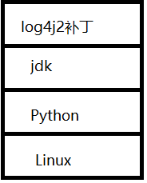

# docker原理

**一、docker工作原理**

​		◼docker是一个C/S结构系统，守护进程运行在Linux主机上


**二、docker与虚拟机的区别**

​		◼docker有比虚拟机更少的抽象层		<font color=blue>不需要虚拟化操作系统层</font>

​		◼docker使用主机的操作系统，虚拟机使用的是虚拟化的操作系统

|            | docker容器       | 虚拟机     |
| ---------- | ---------------- | ---------- |
| 虚拟化类型 | OS虚拟化         | 硬件虚拟化 |
| 性能       | 物理机性能       | 5%-20%损耗 |
| 隔离性     | 根据容器进行隔离 | 强         |
| QoS        | Cgroup弱         | 强         |
| 安全性     | 中               | 强         |
| 操作系统   | 只支持Linux      | 全部       |

**三、docker的启动过程**


# docker常用命令

## **一、帮助命令**

```shell
docker version						#显示docker版本信息
docker info							#显示docker系统信息，包括镜像和容器的数量
docker 命令 --help
http://www.dockerinfo.net/			#docker中文文档
https://docs.docker.com/reference/	#英文文档
```

## **二、镜像命令**

**1、查看镜像**

```shell
docker images -a		#显示所有镜像
docker images -q		#仅显示所有镜像的ID
#REPOSITORY	：镜像名
#TAG		：镜像标签
#IMAGE ID	：镜像的id
#CREATED	：镜像的创建时间
#SIZE		：镜像的大小
```


**2、搜索镜像**

​		◼`docker search 镜像名`

```shell
docker search mysql						#一般搜索
docker search mysql	--filter=STARS=3000	#搜索star大于3000的mysql镜像
```

**3、下载镜像**

​		◼`docker pull 镜像名`

​		◼`docker pull 镜像仓库地址:标签`（默认是`docker.io/library/镜像名`）

​		◼指定版本下载：`docker pull 镜像名：标签`（标签一般为版本信息）

​		◼`docker`使用联合文件系统进行分层下载

​		◼下载镜像时，如果某层存在则跳过，下载不同版本时会节省内存减少冗余空间

```shell
docker pull mysql							#默认下载最新的镜像
docker pull docker.io/library/mysql:latest	#指定仓库下载
docker pull mysql:5.7						#指定版本下载
#下载信息
#文件ID：对文件进行分层下载，如果存在则不下载
#Digest：数字签名
```


**4、删除镜像**

​		◼`docker rmi -f 镜像名/镜像ID `

```shell
docker rmi -f 镜像id或镜像名				#删除一个镜像
docker rmi -f 镜像id 镜像id				 #删除多个镜像
docker rmi -f $(docker images -aq)		#删除全部镜像
```

## **三、容器命令**

**1、容器**

​		◼必须有镜像才能有容器

**2、启动镜像**

​		◼`docker run [参数] image`

​		◼`--name`：设置容器名

​		◼`-d`：后台运行

​		◼`-it`：使用交互方式运行，进入容器查看内容

​		◼`-p`：指定容器端口与映射到主机端口

​		◼`-P`：随机指定端口

```shell
#构建一个名为Redis，端口映射为6379<->6379的容器
docker run -itd --name Redis redis -p 6379:6379
```

**3、列出容器**

```shell
docker ps			#列出正在运行的容器
docker ps -a		#列出所有容器
docker ps -q		#只显示正在运行容器的编号
docker ps -aq		#列出所有容器的编号
```

**4、进入容器和离开容器**

​		◼`docker exec -it linux命令`

​		◼`docker attach 容器名/ID`

​		◼关闭进程并离开:`exit`

```shell
docker exec -it Redis /bin/bash		#进入容器打开一个新的终端
docker attach Redis					#不会启动新的进程
#使用attach离开时会关闭容器,因为关闭的是容器的主线程
#使用exec离开时不会关闭容器,因为关闭的是容器的子线程终端
```

**5、删除容器**

​		◼`docker rm 容器名或容器id`

​		◼非强制的情况下，不会删除运行中的容器

```shell
docker rm Redis					#删除一个容器
docker rm Redis1 Redis2			#删除多个容器
docker rm -f $(docker ps -aq)	#强制删除所有容器，非必要情况不要用-f
```

**6、启动和停止容器操作**

```shell
docker start 容器名/容器ID		#启动
docker restart 容器名/容器ID		#重启
docker stop 容器名/容器ID		#停止
docker kill 容器名/容器ID		#强制停止
```

## 日志、进程、元数据的查看

**1、查看日志**

​		◼`docker logs`

​		◼`-tf`：显示日志

​		◼`--tail number`：显示日志的条数

```shell
docker logs -tf --tail 10 Redis		//查看Redis容器日志
```

**2、查看容器进程信息**

​		◼`docker top 运行中的容器名/容器ID`

```shell
docker top Redis
```

**3、查看元数据**

​		◼`docker inspect 容器名/ID`

```shell
Id:容器ID
Args:参数或脚本
State:容器状态
Image:镜像来源
Mounts:挂载
Config：配置信息
NetworkSettings：docker网络配置
```

## 容器与主机间文件的拷贝

**1、容器内文件复制到主机**

​		◼`docker cp 容器名/ID:容器内文件路径 主机文件路径`

```shell
docker cp Redis:/home/hello.java /home
```

**2、主机内文件复制到容器**

​		◼`docker cp 主机文件路径 容器名/ID:容器内文件路径`

```shell
docker cp Redis:/home/hello.java /home
```

**3、挂载**

​		◼实现容器与主机的自动同步

# 镜像原理---联合文件系统

## 联合文件系统

**一、联合文件系统**

​		◼是一种分层、轻量级且高性能的文件系统

​		◼可以将不同目录挂载到同一个虚拟文件系统上

​		◼镜像通过分层来进行继承，基于某种基础镜像制作其他应用类镜像

## docker文件的加载

**一、docker加载原理**

​		◼docker的镜像由多层的文件系统组成（联合文件系统）

​		◼`bootfs`：所有镜像公用层和最底层，包含`bootloader`和`kernel`，`bootloader`引导加载`kernel`，

​							 内核加载完后，内存使用权交给内核然后退出

​							（docker中使用的是主机的内核，主机启动后不再虚拟新的内核）

​		◼`rootfs`：各种不同操作系统，一般为精简版的linux系统，一般为内核上的第一层

​		◼开启容器时是秒级的，因为不需要再次引导内核（而虚拟机需要再次引导内核）


## 镜像与容器

**一、镜像的分层**

​		**1、**镜像内的不同文件相互之间不会产生冲突


​		**2、**对某应用的补丁文件会当作新的一层文件



​		**3、**当升级应用版本时，直接将新版本应用当作一层，打包时会把旧版本去掉


**二、镜像与容器的关系**

​		◼`Docker`镜像是只读的，当容器启动时，一个新的可写层加载到顶部（即为容器）

​		◼外部操作都在容器内进行，不会改变镜像

​		◼完成配置后将容器和镜像一起打包可形成新的镜像


## docker commit命令制作新的镜像

**一、`docker commit`的使用**

​		◼`docker commit 容器id 生成的镜像名:标签`

​		◼`-m`：提交的描述信息

​		◼`-a`：作者

​		◼`-p`：生成镜像前停止容器运行

​		◼`-c`：使用dockerfile指令创建镜像

```shell
docker commit -m="描述信息" -a="作者" 容器id 生成的镜像名:标签
#生成一个diyubuntu镜像
docker commit -m="diyubuntu 2022.8.10" -a="me" 2b8393415311 diyubuntu:v1.0
```

**二、镜像制作过程**

```shell
1、启动镜像，进入容器进行一系列修改
2、完成修改退出容器
3、使用docker commit命令生成新的镜像
4、docker push发布
```

# 容器数据卷

## 容器数据卷技术

**一、容器数据卷技术**

​		◼**Docker容器和主机在挂载目录下产生的数据会自动双向同步**

​		◼使容器内的数据永久化，容器被删除数据不会因此消失

​		◼将容器的目录挂载到主机上

​		◼容器间可以数据共享

​		◼一种备份技术


## 查看容器数据卷信息

**一、docker volume命令**

​		◼`docker volume create`：创建数据卷

​		◼`docker volume inspect`：获取数据卷信息

​		◼`docker volume ls`：列出所有数据卷

​		◼`docker volume prune`：删除未使用的数据卷

​		◼`docker volume rm`：删除数据卷

```shell
docker volume ls				 #列出所有数据卷	
docker volume inspect 卷名		#显示具体卷名信息
docker volume rm 卷名				#移除数据卷
docker volume create 卷名			#创建一个无挂载的数据卷
```

## 主机与容器挂载技术

**一、指定路径挂载**

​		◼`docker run`命令中使用参数`-`v`进行挂载

​		◼格式：`docker run -it -v 主机目录:容器目录`

```shell
docker run -it -v /home/uesr:/home centos	#将主机的/home/user目录挂载到容器的/home目录下
```

```shell
#检测挂载情况
docker inspect 容器ID/容器名
#查看mounts信息
```

```shell
#MySQL实战
docker run 
			-d												#后台运行 
			-p 3306:3306 									#端口映射
			-v /home/mysql/conf:/etc/mysql/conf.d 			#挂载配置文件
			-v /home/mysql/data:/var/lib/mysql 				#挂载数据
			-e MYSQL_ROOT_PASSWORD=123456 					#设置root密码
			--name mysql01 mysql							#设置容器名
```

```shell
#redis实战
docker run 
			-d 												#后台运行
			--privileged=true 								#获取容器内root权限
			-p 6379:6379 									#映射端口
			--name demo 									#容器名
			-v /home/keqing/桌面/redisdemo/data:/data 	   #数据和配置文件同步到主机
			-v /home/keqing/桌面/redisdemo/conf/redis.conf:/etc/redis/redis.conf 
			redis 											#镜像名
			redis-server /etc/redis/redis.conf				#指定配置文件启动redis
```

**二、匿名挂载**

​		◼格式：`docker run -it -v 容器内路径`

​		◼匿名挂载的卷名为一串哈希值

```shell
#匿名挂载
docker run -d -P --name nginx01 -v /etc/nginx nginx
#-P随机端口映射
```

**三、具名挂载**

​		◼格式：`docker run -it -v 卷名:容器内路径`

​		◼具名挂载的卷名为设置的卷名

```shell
#具名挂载
docker run -d -P --name nginx02 -v juming-nginx:/etc/nginx nginx
```

**四、具名挂载与匿名挂载指定的主机目录**

​		◼`.../docker/volumes/卷名/_data`

**五、数据卷权限**

​		◼`ro`：容器只读数据卷目录所有文件，不能写

​		◼`rw`：容器可以读写数据卷目录所有文件

​		◼`ro`和`rw`限制的是容器不是主机

​		◼一旦设置了权限容器就不能改，只能remake

```shell
docker run -d -P --name nginx02 -v juming-nginx:/etc/nginx:ro nginx		#容器只读
docker run -d -P --name nginx02 -v juming-nginx:/etc/nginx:rw nginx		#容器可读可写
```

## 容器与容器的挂载技术

**一、创建容器间的数据卷**

​		◼使用`run`的参数`--volumes-from 父容器`

​		◼`docker run -it -d --name 子容器名 --volumes-from 父容器名/ID ubuntu`

​		◼创建的子容器会继承父容器所有数据和所有与主机的挂载，创建完后自动与父容器进行同步数据

​		◼容器间数据同步是全连通的

```shell
docker run -it -d --name ubuntu02 --volumes-from ubunto01 ubuntu
```

```shell
#父容器挂载到主机上，子容器也会继承挂载到主机上
#挂载完后数据同步连同主机都是全连通的
#父容器删了不会影响数据与主机和容器同步
```


# Dockerfile

## Dockerfile简介

**一、DockerFile简介**

​		◼作用：用于构建docker镜像的文件

​		◼本质：命令脚本

## Dockerfile的编写

**一、编写步骤**

```shell
1、编写一个Dockerfile文件，准备需要装的软件压缩包
2、使用docker build命令构建一个镜像
3、docker run命令运行镜像
4、docker push命令发布镜像
```

**二、Dockerfile的构建命令**

​		◼每个指令都是大写字母

​		◼指令从上到下执行

​		◼`#`表示注释

​		◼每个指令都会创建提交一个新的镜像层

​		◼dockerfile是面向开发的，发布项目、做镜像都要编写`Dockerfile`文件

```shell
FROM				#基础镜像
MAINTAINER			#镜像作者，一般为姓名+邮箱
RUN					#docker构建时需要运行的命令，一般为shell的下载指令
ADD					#添加压缩包等文件，会自动解压
WORKDIR				#镜像工作目录，进入容器后自动跳转到工作目录
VOLUME				#挂载的目录
EXPOSE				#暴露容器的端口
CMD					#容器启动时需要运行的命令，只有最后一个会生效，参数可被替代
ENTRYPOINT			#容器启动时需要运行的命令，只有最后一个会生效，可以追加参数
ONBUILD				#当构建一个被继承DockerFile时会运行ONBUILD指令（属于触发指令）
COPY				#复制文件粘贴到镜像某个目录中
ENV					#构建时设置环境变量
```

**三、DockerFile命令的使用说明**

```shell
#Dockerfile文件,自制ubuntu镜像
FROM ubuntu								#基于ubuntu镜像
MAINTAINER ame<xxx@qq.com>				#镜像作者名和邮箱
ENV MYPATH /usr/local					#设置MYPATH的环境变量
WORKDIR $MYPATH							#设置工作目录
RUN apt-get update -y					#更新下载包信息，-y默认选择yes
RUN apt-get install -y vim				#下载vim编辑器，-y默认选择yes
EXPOSE 6666								#容器内暴露6666端口
CMD /bin/bash							#一定要有，否则容器启动不成功，不能挂后台
```

**四、CMD与ENTRYPOINT**

​		◼`docker`中如果容器没有运行任务则会自动退出

​		◼`CMD`：为启动的容器指定默认运行的程序，可被`docker run`的命令覆盖

​		◼`CMD`的最佳写法是命令和参数隔开，用引号括住

​		◼`ENTRYPOINT`：和`CMD`一样指定默认运行的程序，但不会被`docker run`的命令覆盖，而是作为参数追加

​		◼当`docker run`中含`--entrypoint`时，将覆盖`ENTRYPOINT`的命令

​		◼有多个`CMD`或`ENTRYPOINT`时仅最后一个生效

```shell
#执行CMD的命令
CMD ["ls","-a"]
docker run ...
#CMD的命令被覆盖
CMD ["ls","-a"]
docker run ... uname -v
#执行ENTRYPOINT的命令
ENTRYPOINT ["ls","-a"]
docker run ...
#给ENTRYPOINT命令追加参数
ENTRYPOINT ["ls","-a"]
docker run ... -l			#相当于执行 ls -al
#覆盖ENTRYPOINT命令
ENTRYPOINT ["ls","-a"]
docker run ... --entrypoint uname -v
```

**五、docker build指令的使用说明**

​		◼`docker build -f Dockerfile文件 -t 生成的镜像名:tag .`	

​		◼Dockerfile文件官方默认名为`Dockerfile`，其他名则需要`-f 文件`指出

​		◼`tag`最好是`latest`，`docker run`默认使用`latest`版本，其他版本要表明版本号

​		◼镜像名要小写

​		◼不能漏了最后一个点

```shell
#ubuntu，使用官方默认的Dockerfile文件名
docker build -t diyubuntu:latest .						#不要漏.
docker run -it diyubuntu								#不需要tag
#centos，不使用官方默认的文件名
docker build -f mycentosDockerfile -t diycentos:0.1 .	#构建centos
docker run -it diycentos:0.1							#启动镜像生成容器,需要tag
```

**六、docker history命令**

​		◼用于查看镜像生成的过程

```shell
docker history 镜像ID
```


## Dockerfile文件生成镜像的实践

**一、自制ubuntu镜像**

```shell
FROM ubuntu
MAINTAINER ame<xxx@qq.com>	
ENV MYPATH /usr/local				
WORKDIR $MYPATH						
RUN apt-get update -y					
RUN apt-get install -y vim
EXPOSE 6666						
CMD /bin/bash
```

**二、自制含jdk的ubuntu镜像**

```shell
FROM ubuntu										#基于ubuntu镜像
MAINTAINER me<xxx@qq.com>						#作者信息
ENV MYPATH /usr/local							#添加一个MYPATH环境变量
WORKDIR $MYPATH									#设置工作目录
COPY README.txt $MYPATH							#复制README文件到镜像中
ADD jdk-8u151-linux-x64.tar.gz $MYPATH			#给镜像添加压缩包
RUN apt-get update -y							#更新ubuntu软件包信息
RUN apt install -y net-tools					#下载ifconfig命令，用于获取容器ip

ENV JAVA_HOME $MYPATH/jdk1.8.0_151				#设置JAVA环境变量
ENV CLASSPATH $JAVA_HOME/lib/dt.jar:$JAVA_HOME/lib/tools.jar
ENV PATH $PATH:$JAVA_HOME/bin

VOLUME ["/usr/local/javafile"]					#使用匿名挂载，实现与主机相连
EXPOSE 8888										#暴露容器内部的端口
CMD /bin/bash									#运行容器，可以是终端，可以是启动应用的程序
```

```shell
#父容器，内部使用了匿名挂载
docker run -itd -p 8888:8888 --name father java_ubuntu
#子容器，与父容器挂载
docker run -itd -p 8889:8888 --name child --volumes-from father java_ubuntu
#父容器使用指定路径挂载，内部不需要匿名挂载
docker run -itd -p 8888:8888 --name father -v /home/work:/usr/local/work jvav_ubuntu
```

```shell
#Dockerfile只能匿名挂载
#指定路径挂载、具名挂载只能使用命令行
#容器间挂载只能使用命令行
```

## 镜像上传到阿里云

​		◼`docker login`：登陆

​		◼`docker tag`：打标签

​		◼`docker push`：上传镜像

```shell
docker login --username=fosu_keqing registry.cn-hangzhou.aliyuncs.com
docker tag [ImageId] registry.cn-hangzhou.aliyuncs.com/fish_keqing/my_mirror:[镜像版本号]
docker push registry.cn-hangzhou.aliyuncs.com/fish_keqing/my_mirror:[镜像版本号]
```

# docker网络

## 主机与容器的ipv4地址

**一、主机与容器的地址**

​		◼主机连接容器的ip默认为docker0的IP（`172.17.0.1`）

​		◼**容器的ipv4地址不能从主机的终端获取**，只能从容器内部使用`ifconfig`获取

​		◼容器的地址一般为`172.17.0.1`的递增，与容器开启的顺序有关

​		◼容器与主机，容器与容器可以相互ping通

​		◼docker使用桥接模式和`evth-pair`技术连通容器

```shell
ping 172.17.0.2			#主机ping容器
ping 172.17.0.1			#容器ping主机
ping 172.17.0.3			#容器ping容器
```

**二、`evth-pair`技术**	

​		◼`evth-pair`本质上是一对虚拟网卡接口

​		◼一个虚拟网卡挂在docker0，一个虚拟网卡挂在容器，通过协议进行通信

​		◼虚拟网卡通信效率高

​		◼删除容器后虚拟网卡也会删掉

**三、docker网络结构**

​		◼`docker0`在docker网络中相当于路由器

​		◼容器间的通信都要通过`docker0`

​		◼`docker0`与物理网卡通过NAT转换相连

​		◼最多分配65535个容器

​		◼**网络服务器重启后docker网络ip重新分配**


## --link

**一、--link参数的作用**

​		◼实现容器间的**单向连接**

​		◼连接完后可以在容器内用容器名单向`ping`通

​		◼**本质：创建容器后在容器内部的`/etc/host`文件中追加重定向**

​		◼局限性大，不推荐使用

**二、--link的局限**

​		◼网络内的容器不能双向连通

​		◼通常用于`docker0`网络，自定义网络本身支持双向连通不需要`--link`

**三、docker --link的使用**

​		◼`docker run --name mirror2 --link mirror1 ubuntu `

​		◼将镜像2与镜像1进行单向连接

```shell
docker run -d -P --name tomcat02 --link tomcat01 tomcat		#构造一个容器与tomcat01单向连接
docker exec -it tomcat02 ping tomcat01						#可以使用容器名单向ping通
```


## docker network命令

**一、命令种类**

​		◼`docker network connect`：将一个容器连接到一个网络中

​		◼`docker create`：创建一个自定义网络

​		◼`docker network disconnect`：容器断开与某网络的连接

​		◼`docker inspect`显示网络的信息

​		◼`docker network ls`：列出所有网络

​		◼`docker network prune`：删除没用的网络

​		◼`docker network rm`：删除网络

```shell
#容器连接到某网络
docker network connect 网络 容器
#创建新的网络
docker network create 
#显示网络信息
docker network inspect 网络
#列出所有网络
docker network ls
#删除无用的网络
docker network prune
#删除网络
docker network rm 网络名
```

## 自定义网络

**一、自定义网络类型**

​		◼桥接:`bridge`

​		◼none:不配置网络

​		◼host：和宿主机使用相同IP

​		◼**自定义网络一般使用桥接模式**


**二、docker0默认网络**

​		◼docker默认网络

​		◼不能使用容器名进行访问

**三、创建自定义网络**

​		◼使用`docker network create`创建一个自定义网络

​		◼**自定义网络不能与外网IP相冲突**

​		◼不同网络的容器一般不能ping通

​		◼格式：`docker network create --driver 模式 --subnet 网络IP名/子网掩码 --gateway 网关 网络名` 

​		◼`--driver 模式`：选择桥接bridge

​		◼`--subnet`：子网地址，可选择路由器的子网

​		◼`--gateway`：网关，一般为`master`主机，为`192.168.0.1`

```shell
#创建网络
docker network create --driver bridge --subnet 192.168.0.0/16 --gateway 192.168.0.1 mynet
```

**四、使用自定义网络**

​		◼使用`docker run`的`--net`参数配置容器网络

```shell
docker run -itd -P --anem java01 --net redisnet java_ubuntu
```


**五、自定义网络好处**

​		◼容器间可以使用容器名相互ping通（`不使用--link`）

​		◼不同的集群使用不同网络，保证集群的健康（不同网络的容器默认不能ping通）

**六、将容器连接到其他网段**

​		◼使用`docker network connect`将容器连接到其他网络

​		◼本质：给容器提供一个网络的ip使之能连通另一个网络（1个容器两个IP）

​		◼`docker network connect 网络 容器`

​		◼跨网络操作需要`docker network connect`进行连接

```shell
docker network connect mynet tomcat02
```


## 部署分片-高可用-负载均衡的redis集群

**一、集群特点**

​		◼分片：联合多个`master`

​		◼高可用：每个`master`拥有备份机

​		◼负载均衡：数据平均分配给服务器


**二、shell脚本创建redis结点**

```shell
#构造redis集群网络
docker network create redis --subnet 172.18.0.0/16
#构造redis结点
for port in $(seq 1 6)
do
#创建文件夹和文件
	mkdir -p /home/keqing/桌面/redis集群/node-${port}/conf
	touch /home/keqing/桌面/redis集群/node-${port}/conf/redis.conf
#写入配置信息
	cat << EOF >/home/keqing/桌面/redis集群/node-${port}/conf/redis.conf
#redis端口
port 6379
bind 0.0.0.0
#启动集群
cluster-enabled yes
#设置配置文件
cluster-config-file nodes.conf
#设置超时
cluster-node-timeout 5000
#设置redis结点IP
cluster-announce-ip 172.18.0.1$port
#设置结点端口
cluster-announce-port 6379
#设置通道端口
cluster-announce-bus-port 16379
#Go
appendonly yes
#结束写入
EOF
#启动集群结点，完成端口映射、结点命名、数据挂载、配置文件挂载、网络配置、IP配置
#启动后加载redis.conf文件
docker run -p 637$port:6379 -p 1637$port:16379 --name redis-${port} \
\-v /home/keqing/桌面/redis集群/node-${port}/data:/data \
\-v /home/keqing/桌面/redis集群/node-${port}/conf/redis.conf:/etc/redis/redis.conf \
\-d --net redis --ip 172.18.0.1$port redis /etc/redis/redis.conf
done
```

**三、构建集群**

```shell
#进入到其中一个结点
docker exec -it redis-1 /bin/bash
#组建集群
redis-cli --cluster create 172.18.0.11:6379 172.18.0.12:6379 172.18.0.13:6379 172.18.0.14:6379 172.18.0.15:6379 172.18.0.16:6379 --cluster-replicas 1
#选择
yes
#检测并查看集群情况
cluster info
```


# docker compose

## 简介

**一、docker compose作用**

​		◼用于轻松高效管理容器，定义运行多个容器

​		◼能够批量编排容器

​		◼将一系列`docker run`命令转为`docker-compose.yaml`文件，通过该文件一键启动

**二、docker compose使用步骤**

​		◼定义`Dockerfile`文件，保证项目在任何地方可以运行

​		◼编写`docker-compose.yml`文件，批量编排多个容器

​		◼`docker-compose up`启动项目

**三、docker compose重要概念**

​		◼服务(services)：本体为容器，由多个微服务组成，每个微服务对应一个容器，容器提供服务

​		◼项目(project)：一个项目内有多个容器提供多样化的服务

## docker-compose基本命令

**一、构建并运行命令**

​		◼`docker-compose up`

​		◼默认运行的文件名为`docker-compose.yaml`

​		◼`-d`：后台运行

​		◼`--build`：重新构建

```shell
docker-compose up -d
docker-compose --build	#重新构建yaml文件中指引的Dockerfile文件
```

**二、启动命令**

​		◼`docker-compose start`

​		◼要求有`docker-compose.yaml`文件指引

**三、停止命令**

​		◼`docker-compose stop`

​		◼要求有`docker-compose.yaml`文件指引

**四、关闭并删除项目所有镜像、容器和网络命令**

​		◼`docker-compose down`

​		◼要求使用时所在目录有`yml`文件，否则命令不能锁定关闭哪些容器

## yaml文件模板规则

### **版本信息**

**一、版本信息模板**

​		◼yml文件版本与docker引擎版本对应

​		◼[官方文档查看引擎对应的yml版本](https://docs.docker.com/compose/compose-file/compose-file-v3/)

​		◼`docker version`命令查看docker引擎版本


```yaml
version: "3.8"
```

### **多服务的配置**

**一、服务**

​		◼定义服务名

```yaml
version: "3.8"
services:
	handler:
		一系列配置
	db:
		一系列配置
```

**二、镜像的构建**

​		◼通过`build`构建镜像，路径下默认获取`Dockerfile`文件 

​		◼`context`：可以是git仓库url或路径

​		◼`dockerfile`：指定Dokcerfile

​		◼`args`：用于添加构建参数，仅构建过程中访问

```yaml
services:
	#直接使用路径构建
	db1:
		build: ./dir
	#使用context指出镜像仓库或路径
	db1:
		build:
			context: ./dir
	#指定dockerfile文件
	db1:
		build:
			context: ./dir
			dockerfile: diydockerfile
```

```dockerfile
#添加参数构建的Dockerfile文件
ARG dir
RUN mkdir $dir
```

```yaml
#添加参数构建的yaml文件
services:
	db:
		build:
			context: .
			args:
				dir: /usr/local/app_file
```

**三、镜像的引用**

​		◼使用`image`引用已有的镜像

```yaml
services:
	db:
		image: "镜像名:tag"
```

**四、命名容器**

​		◼使用`container_name`对容器进行命名

```yaml
services:
	db:
		image: "mysql"
		container_name: mydb
```

**五、端口暴露和端口映射**

​		◼使用`expose`暴露容器内的端口

​		◼使用`ports`实现主机与容器端口映射

```yaml
#暴露端口
services:
	db:
		image: "mysql"
		container_name: mydb
		expose:
			- "3333"
#端口映射
services:
	db:
		image: "mysql"
		container_name: mydb
		ports:
			- "3306:3306"
```

**六、服务的依赖关系**

​		◼使用`depends_on`调整容器启动的顺序

​		◼启动完该服务依赖的所有服务(容器)后，该服务才启动

```yaml
services:
	handle:
		image: "golang"
		container_name: golang
		depend_on:
			- db
			- redis
```

**七、容器的环境变量追加**

​		◼使用`environment`追加环境变量

```yaml
services:
	db:
		image: "mysql"
		container_name: mydb
		environment:
			- MYSQL_ROOT_PASSWORD=123456
```

**八、从文件添加环境变量**

​		◼使用`env_file`从文件获取并追加环境变量

```shell
#追加1个文件
services:
	db:
		image: "mysql"
		container_name: mydb
		env_file: 文件路径
#追加多个文件
services:
	db:
		image: "mysql"
		container_name: mydb
		env_file:
			- 路径
			- 路径
```

**九、容器的挂载**

​		◼匿名挂载：容器内路径

​		◼具名挂载与容器共享目录：在全局`volumes`定义挂载名，然后再进行挂载

​		◼路径挂载：主机路径:容器内路径

```yaml
#匿名挂载
services:
	handle:
		image: "golang"
		container_name: golang
		vloumes:
			- /usr/local/app-file
#路径挂载
services:
	handle:
		image: "golang"
		container_name: golang
		volumes:
			- ./app-file:/usr/local/app-file
#具名挂载与容器共享目录
services:
	handle:
		image: "golang"
		container_name: golang
		volumes:
			- appfile:/usr/local/app-file
volumes:
	appfile:
```

**十、容器的网络设置**

​		◼使用`networks`对容器配置网络

​		◼一个容器可以处在多个网络中（一个容器多个IP）

```yaml
services:
	db:
		image: "mysql"
		container_name: mydb
		networks:
			- dbnet
			- servernet
```

**十一、command**

​		◼覆盖容器内`CMD`的命令

```yaml
services:
	handle:
		image: "golang"
		container_name: golang
		command:["echo","$HOME"]
```

**十二、entrypoint**
		◼覆盖容器内`ENTRYPOINT`的命令

```shell
services:
	handle:
		image: "golang"
		container_name: golang
		entrypoint: ["ls","-a"]
```

**十三、重启策略**
		◼使用`restart`配置服务的重启策略，默认为`no`

​		◼`restart: no`：容器退出时不自动启动容器

​		◼`restart: on-failure`：退出状态非0时容器自动启动

​		◼`restart: always`：容器退出时总是重启

​		◼`restart: unless-stoped`：容器退出时重启，不考虑docker启动后没有运行的容器

```yaml
services:
	db:
	image: "mysql"
	restart: always
```

### **全局配置**

​	**一、networks**

​		◼可用于创建新的`docker`网络和引用已有的docker网络

​		◼`neworks`下一层添加`default`可以将下面的网络设为默认的网络

```yaml
#创建新的docker网络
networks:				
	mynet:
		driver: bridge
		ipam:
			config:
				- subnet: 172.18.0.0/16
				  gateway: 172.18.0.1
#引用已有的docker网络方式一
networks:
	external:
		name: mynet
#引用已有的网络方式二
networks:
	mynet:
		external: true
#设置默认网络
networks:
	default:
		external:
			name: mynet
```

**二、volumes**

​		◼用于创建全局数据卷名，实现具名挂载和容器数据同步

```yaml
#创建全局数据卷名，可实现具名挂载，多个容器通过具名使用该数据卷时会实现数据同步
volumes:
	dbdata:
```

**三、configs**

​		◼能够读取配置文件内容和引用已有的配置内容（已有的内容再compose之外早已创建）

```yaml
#读取配置文件内容
configs:
	first_config:
		file: 配置文件路径
#引用已有的配置信息
configs:
	exist_config:
		external: true
```

```yaml
version:"3.8"
services:
	web:	#web微服务
		build: .				#.表示当前路径，可以设其他相对路径。获取Dockerfile文件构建镜像
		container_name: myweb	#自定义容器名
        ports:
        	- "80:80"
        networks:
        	- docker网络名
        volumes:
        	- web-app:/路径 				   #挂载
        depends_on:							#依赖的服务，要求db启动后再启动web服务
        	- db
	db:		#db微服务
		image: "镜像:tag"						#默认latest，要求镜像存在
		container_name: mydb				#自定义容器名
		ports:
			- "3306:3306"
		networks:
			- docker网络名
		volumes:
			- db-data:/路径	   			   #使用具名挂载、路径挂载
		environment:						#环境配置
			- MYSQL_ROOT_PASSWORD=123456	#设置数据库的密码
#全局配置
volumes:
	dbdata:
networks:				
	mynet:
		driver: bridge
		config:								#没有指定可以不用
			- "172.16.0.0/24"
config:
	myconfig:
		file: 路径
```

## docker-compose实战

```yaml
version: "3.8"
services:
  system:
    build: ./
    container_name: server_system
    ports:
      - "6666:6666"
    volumes:
      - /usr/local/app-file
    networks:
      - new
    depends_on:
      - db
  db:
    image: "mysql:latest"
    container_name: mydb
    ports:
      - "3306:3306"
    environment:
      - MYSQL_ROOT_PASSWORD=123456
    networks:
      - new
networks:
  new:
    driver: bridge
```

# Swarm集群

## Swarm集群搭建与节点的管理

**一、Swarm概述**
		◼集群由管理节点和工作节点组成

​		◼管理节点可以用于工作和管理集群，而工作节点只能用于工作

​		◼**外部访问内部时，如果IP对应的机器没有部署需要的服务会自动转到已部署对应服务的机器上**

​		◼Swarm集群自带负载均衡，集群集群端口占用情况统一

**二、docker swarm命令**

​		◼`docker swarm init`：初始化集群

​		◼`docker swarm join`：将机器添加进集群，join后面跟着一串字符串，通过`join-token`获取

​		◼`docker swarm join-token`：创建一个节点令牌，用于添加`worker`节点和`manage`节点

​		◼`docker swarm leave`：离开集群

​		◼`docker swarm unlock`：解锁集群

​		◼`docker swarm unlock-key`

​		◼`docker swarm update`：更新集群

```shell
#初始化一个集群
docker swarm init --advertise-addr IP
#创建manage节点令牌
docker swarm join-token manager
#创建worker节点令牌
docker swarm join-token worker
#重新选举leader，用于全部manager节点宕机后重新启动
docker swarm init --force-new-cluster
```

**三、docker node命令**

​		◼`docker node ls`：列出集群所有节点

​		◼`docker node inspect`：输出节点信息

​		◼`docker node ps`：输出某个节点服务运行的日志

​		◼`docker node demote`：将节点降为`worker`节点

​		◼`docker node promote`：将节点升为`manager`节点

​		◼`docker node rm`：移除节点

​		◼`docker node update`：动态更新节点

## Raft协议

**一、Raft协议**

​		◼保证大多数节点存活才可以使用，集群至少3台

​		◼要求集群至少两个`manage`节点才可用

​		◼`worker`节点不能使用管理命令，只用于工作


## docker service

**一、docker service的作用**

​		◼创建服务

​		◼动态扩展服务

​		◼动态更新服务

**二、集群中服务、容器、副本的关系**

​		◼容器是服务的实体，处理请求并返回结果

​		◼副本的本质是容器，是集群中某个机器里的容器

​		◼一个服务可由集群中多个副本进行处理，控制副本的数量实现对服务的动态扩缩容


**三、docker service相关命令**

​		◼`docker service create`：创建集群服务

​		◼`docker service inspect`：输出容器信息

​		◼`docker service logs`：输出日志

​		◼`docker service ls`：列出集群的所有服务

​		◼`docker service ps`：列出对应服务的详细信息

​		◼`docker service rm`：移除集群中的服务

​		◼`docker service scale`:动态扩缩容集群中的服务

​		◼`docker service update`：动态更新集群中的服务

**四、集群中创建一个服务**

​		◼使用`docker service create`（与`docker run`差不多）

```shell
#集群中启动nginx服务
docker service create -p 8888:80 --name my-nginx nginx
```

**五、查看服务**

​		◼`docker service ls`

​		◼`docker service ps 容器ID/容器名`

```shell
#列出集群中启动的服务以及副本的数量
docker service ls
#列出容器的所有副本及其运行的节点
docker service ps 容器ID/容器名
```

**六、动态更新**

​		◼可以实现服务的

​		◼`docker service update`实现动态更新

```shell
#docker update实现服务的动态扩缩容
docker service updare --replicas 3 my-ngnx		#将对应的服务扩缩至3个副本
```

**七、动态扩缩容**

​		◼`docker service scale`实现服务的动态扩缩容

​		◼扩容的数量可以无限，但服务器数量有限一般最多扩至机房服务器的数量

```shell
#动态扩缩容副本至5份
docker service scale my-nginx=5
```

**八、移除集群中的服务**

​		◼`docker service rm`实现移除服务

```shell
#移除my-nginx服务
docker service rm my-nginx
```

## docker集群调度服务的底层操作顺序


## docker service容器启动模式

**一、`replicated`模式**

​		◼`docker service`默认的启动模式

​		◼**根据集群资源的使用状况进行调度任务，资源丰富的节点副本数越多**

​		◼能够动态地扩缩容副本数量

```shell
docker service create -p 8888:80 --mode replicated --name my-nginx nginx
docker service create -p 8888:80 --mode --name my-nginx nginx
```


**二、`global`模式**

​		◼**强制每个`node`都运行一个且最多一个某服务的副本**

​		◼运行的副本数等于集群的节点数

​		◼不能对服务进行动态扩缩容

```shell
docker service create -p 8888:80 --mode global --name my-nginx nginx
```


## docker stack集群部署

**一、docker stack作用**

​		◼根据`yaml`文件部署集群服务

**二、docker stack命令**

​		◼`docker stack deploy`：部署或更新项目

​		◼`docker stack ls`：列出集群所有项目

​		◼`docker stack ps`：查看集群中某个项目任务信息

​		◼`docker stack services`：查看某个项目的服务信息

​		◼`docker stack rm`：删除集群中某个服务

## yaml文件的deploy标签

**一、`labels`**

​		◼标签、描述服务

```yaml
services:
    image: awesome/webapp
    deploy:
      labels:
        com.example.description: "This label will appear on the web service"
```

**二、`mode`**

​		◼副本的启动模式，`replicated`,`global`

​		◼默认为`replicated`

```yaml
services:
    image: awesome/webapp
    deploy:
      mode: global
```

**三、`replicas`**

​		◼用于设置副本数

​		◼副本的启动模式为`repliccated`时才能使用

```yaml
services:
    image: awesome/webapp
    deploy:
      replicas: 6
```

**四、`resources`**

​		◼设置分配资源的大小

​		◼`limit`：限制副本最多分配的资源大小

​		◼`reservations`：副本至少拥有的资源大小

​		◼`cpus`：设置可用CPU资源量(可以为小数)

​		◼`memory`：设置可用内存的资源量（`50M`）

​		◼`pids`：设置可用线程数(为整数)

```yaml
services:
    image: awesome/webapp
    deploy:
      resources:
        limits:
          cpus: '0.50'
          memory: 50M
          pids: 1
        reservations:
          cpus: '0.25'
          memory: 20M
```

**五、`restart_policy`**

​		◼设置副本的重启策略（与服务的重启策略不同）

​		◼重要数据存放在副本时需要考虑

​		◼`condition`：设置重启策略（`none`,`on-failure`,`any`）

​		◼`delay`：设置重启等待时间

​		◼`max_attempts`：设置尝试重启的次数，默认为一直重启弃

​		◼`window`：设置在决定重新启动是否成功之前的等待时间

```yaml
services:
    image: awesome/webapp
	deploy:
	  restart_policy:
	    condition: on-failure
	    delay: 5s
	    max_attempts: 3
	    window: 120s
```


