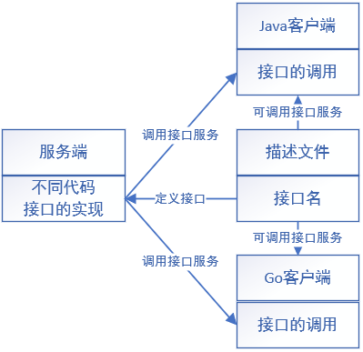

# gRPC微服务架构简介

**一、单体架构的弊端**

* 一旦某个服务宕机，整个应用将不可用
* 只能整体进行伸缩，可伸缩性差，浪费资源
* 代码耦合高，可维护性差

**二、微服务架构**

* 解决了单体架构的弊端
* 使用`RPC`（远程调用）解决进程与进程，服务器与服务器之间的通信（底层是TCP连接）

* 引入了代码冗余的问题
* 引入了服务与服务间的调用问题

**三、RPC**

* 用于屏蔽分布式计算中各种调用细节，实现本地直接调用远程函数
* 远程过程调用是客户端与服务端的沟通过程
* 客户端与服务端的实现可以使用不同类型的代码（双端解耦合）

**四、gRPC文档**

[gRPC](https://grpc.io/)

[gRPC 官方文档中文版](http://doc.oschina.net/grpc)

**五、RPC通信**

* 客户端发送数据（编码后的字节流数据）
* 服务端接收数据并解析处理，处理完后可返回结果
* 使用描述文件定义接口，gRPC会屏蔽底层的细节（比如代码的不同）
* 对于服务端，需要实现描述文件里定义的接口
* 对于客户端，只需要调用接口



**六、序列化与反序列化**

* 序列化（编码）：将数据结构或对象转换为二进制的形式
* 反序列化（解码）：将序列化产生的二进制转换为数据结构或对象

**七、Protocol Buffss序列化的优势**

* 序列化后体积比json和xml小，适合网络传输
* 支持跨平台多语言
* 消息格式升级和兼容性不错
* 序列化与反序列化速度快

# gRPC的安装与配置

## 安装Protobuf

**一、Protobuf下载地址**

[Releases · protocolbuffers](https://github.com/protocolbuffers/protobuf/releases)

**二、安装**

* 将bin目录里的文件移到`/usr/local/bin`
* 将include目录里的文件移到`/usr/local/include`

**三、检测安装**

```bash
protoc --version
```

## 安装gRPC

**一、安装gRPC**

```bash
go get google.golang.org/grpc
```

## 安装protocol编译器

**一、安装编译器**

* <font color=red>需要安装完**gRPC**才能安装编译器</font>

```bash
sudo su
go install google.golang.org/protobuf/cmd/protoc-gen-go@latest
go install google.golang.org/grpc/cmd/protoc-gen-go-grpc@latest
```

# Proto文件

* 用于生产go语言代码

## Proto文件的配置项

**一、proto语法限制**

* 使用`syntax`项限制proto语法

```protobuf
syntax="proto3"
```

**二、设置生产代码位置和包名**

* 使用`option`生成代码和定义代码所在的包名

* 使用`go_package`生成go语言的代码
* 第一个参数为生成代码的存放路径，第二个参数为包名（两个用`;`相隔）

```protobuf
option go_package=".;server"
```

**三、定义消息结构体**

* 定义结构体的属性，用于常用于限制接口的输入和输出

* 使用`message`定义消息结构体
* 每个消息结构体的属性都有消息号，用于定义顺序，用`=`规定属性在第几位

```protobuf
//定义HelloRequest结构体
message HelloRequest{
	//定义结构体的属性
	string 	requestName=1;
	int64	age=2;
}
```

**四、定义RPC服务接口**

* 使用`service`定义服务接口
* 使用`rpc`定义方法
* 接口的输入输出使用消息结构体表示

```protobuf
service hello{
	rpc SayHello(HelloRequest) returns(HelloRequest){}
	rpc SayWorld(HelloRequest) returns(HelloRequest){}
}
```

**五、字段规则**

* `required`：protobuf2中必填字段不填会导致编码错误，`protobuf3`中被删去
* `optional`：消息体可选字段
* `repeated`：消息体中可重复字段，go里会被定义为切片

```protobuf
message HelloRequest{
	string 	requestName=1;
	int64	age=2;
	repeated int64 age=3;
}
```

**六、嵌套消息结构体**

* 一个消息结构体由多个消息结构体组成
* 使用`.`调用嵌套的结构体

```protobuf
//定义嵌套结构体
message PersonInfo{
	message Person{
		string name=1;
		int8 age=2;
	}
	repeated Person info=1;
}
```

```protobuf
//调用嵌套的结构体
message PresonMessage{
	PersonInfo.Person info=1;
}
```

## 生产代码及相关文件

**一、生产Go语言文件**

* 使用`protoc`命令生成代码

* 使用`--go_out`参数生成go语言代码
* 需要参数：1、生成目录    2、proto文件路径

```bash
protoc --go_out=. server.proto
```

**二、生成gRPC代码**

* 使用`protoc --go-grpc_out`生成go语言的`gRPC`代码
* 需要参数：1、生成目录    2、proto文件路径

```bash
protoc --go-grpc_out=. server.proto
```

# 编写服务端

**一、构造结构体**

* 定义新的结构体，嵌套`grpc`包内实现具体方法的结构体

```go
//main包内定义新的结构体
//需要导入proto包使用里面的grpc包
import pb "gRPC/server/proto"
type server struct{
    //嵌套未实现方法对应的结构体
    pb.UnimplementedHelloServer
}
```

```go
//grpc包内的未实现的方法
func (UnimplementedHelloServer)SayHello(context.Context,*HelloRequest)(*HelloResponse,error){
    return nil,status.Errorf(codes.Unimplemented,"not implemented")
}
```

**二、实现接口方法**

* 复制grpc包内未实现的方法到main包
* 修改结构体为结构体指针，补充输入的变量名
* 对来自grpc包的结构体引入`pb`（自定义的包别名）

```go
//实现方法，使用传来的结构体的值，返回一段字符串
//修改结构体为结构体指针，补充变量名和引入grpc包
func (s *server)SayHello( ctx context.Context,req *pb.HelloRequest)(*pb.HelloResponse,error){
    //整个方法接收HelloRequest消息结构体，返回HelloResponse消息结构体
    //实现方法
    str:="Hello"+req.Name		//使用消息结构体的Name属性
    //构造返回的消息结构体，返回一段字符串，error改为返回nil
    return &pb.HelloResponse{MSG:str},nil
}
```

**三、开启端口监听**

* 使用`net.Listen()`开启监听

```go
listener,err:=net.Listen("tcp","0.0.0.0:9090")
if err!=nil{
    fmt.Println(err)
    return
}
defer listener.Closed()
```

**四、获取grpc对象**

* 使用`grpc.NewServer()`方法获取grpc服务对象

```go
//获取grpc服务对象
grpcServer:=grpc.NewServer()
```

**五、注册grpc服务**

* 在grpc服务端注册实现的服务
* 使用`pb.RegisterXXX()`方法进行注册（XXX为Proto文件定义的接口服务，不是函数）

```go
pb.RegisterHelloServer(grpcServer,&server{})
```

**六、启动服务**

* 使用grpc服务对象的`Serve()`方法嵌入监听对象启动服务

```go
err=grpcServer.Serve(listener)
if err!=nil{
    fmt.Println(err)
    return
}
```

**七、简单客户端完整的代码**

```go
package main

import (
	"context"
	"fmt"
	pb "gRPC/server/proto"
	"google.golang.org/grpc"
	"net"
)
//构造结构体
type server struct {
	pb.UnimplementedHelloServer
}
//实现SayHello方法
func (s *server) SayHello(ctx context.Context,req *pb.HelloRequest) (*pb.HelloResponse, error) {
	return &pb.HelloResponse{MSG: "hello "+req.Name}, nil
}

func main(){
	//获取监听对象
	listener,err:=net.Listen("tcp","0.0.0.0:9090")
	if err!=nil{
		fmt.Println(err)
		return
	}
	defer listener.Close()
	//获取grpc服务对象
	grpcServer:=grpc.NewServer()
	//注册服务
	pb.RegisterHelloServer(grpcServer,&server{})
	//启动服务
	err=grpcServer.Serve(listener)
	if err!=nil{
		fmt.Println(err)
		return
	}
}
```

# 编写客户端

**一、获取grpc连接对象**

* 使用`grpc.Dial()`方法进行连接
* 输入的参数有目标地址和grpc安全传输协议
* 使用`grpc.WithTransportCredentials()`选择安全传输协议

```go
//获取grpc连接对象，设置不使用安全协议
conn,err:=grpc.Dial("0.0.0.0:9090",grpc.WithTransportCredentials(insecure.NewCredentials()))
if err!=nil{
    fmt.Println(err)
    return
}
defer conn.Close()
```

**二、获取客户端对象**

* 使用`pb.NewHelloClient()`方法获取客户端对象

```go
client:=pb.NewHelloClient(conn)
```

**三、客户端调用服务端的方法**

* 使用`client`对象调用`proto`文件定义的服务里的所有方法
* 向服务端发送请求获取响应，然后处理响应数据，使用`GetXXX()`方法获取数据

```go
//调用远程服务端的方法获取响应数据
	//context.Background()获取context对象
resp,err:=client.SayHello(context.Background(),&pb.HelloRequest{Name:"zhangsan"})
if err!=nil{
    fmt.Println(err)
    return
}
//处理响应数据
fmt.Println(resp.GetMSG())
```

# OpenSSL的安装与配置

**一、Ubuntu安装openssl**

```bash
sudo apt-get install openssl
sudo apt-get install libssl-dev
```

**二、安装测试**

```bash
openssl version -a
```

# 生成证书

**一、生成服务端私钥**

* server.key为私钥文件名

```bash
openssl genrsa -out server.key 2048
```

**二、通过私钥生成证书**

* server.key为私钥文件名

```bash
openssl req -new -x509 -key server.key -out server.crt -days 365
```

**三、需要填写的相关信息**

* 可以跳过

| 填写信息       | 英文                     | 填写案例   |
| -------------- | ------------------------ | ---------- |
| 国家名称       | Country Name             | CN         |
| 省名称         | State or Province Name   | GuangDong  |
| 城市名称       | Locality Name            | Foshan     |
| 公司组织名     | Organization Name        | 公司名     |
| 部门名称       | Organizational Unit Name | 部门       |
| 服务器或网站名 | Common Name              | 填域名     |
| 邮箱           | Email Address            | XXX@qq.com |

**四、生成csr文件**

* 输入`server.key`私钥，输出文件名为`server.csr`

```bash
openssl req -new -key server.key -out server.csr
```

**五、复制ssl配置文件并修改**

* ubuntu里`openssl.cnf`文件在`/etc/ssl`目录里
* 复制一份`openssl.cnf`到`key`目录里，对里面的内容进行修改

```openssl.cnf
//去掉#号
copy_extensions=copy
//去掉#号
req_extensions=v3_req
//找到[ v3_req ]标签，添加别名
subjectAltName=@alt_names
//添加[alt_names]标签，设置DNS域名
DNS.1=*.fosukeqing.cn			#只有使用该域名访问时才能通过
```

**六、生成证书私钥**

* 生成的私钥名为`keqing.key`

```bash
openssl genpkey -algorithm RSA -out keqing.key
```

**七、生成证书请求文件**

* 生成的请求文件为`keqing.csr`

```bash
openssl req -new -nodes -key keqing.key -out keqing.csr -days 365 -subj "/C=cn/oU=myorg/0=mycomp/CN=myname" -config ./openssl.cnf -extensions v3_req
```

**八、生成SAN证书**

* 使用`keqing.csr`生成`keqing.pem`
* 需要`server.crt`和`server.key`文件

```bash
openssl x509 -req -days 365 -in keqing.csr -out keqing.pem -CA server.crt -CAkey server.key -CAcreateserial -extfile ./openssl.cnf -extensions v3_req
```

# 设置安全传输证书认证

## 服务端

**一、读取证书**

* 使用`credentials.NewServerTLSFromFile()`方法读取证书和私钥

```go
//读取证书
creds,err:=credentials.NewServerTLSFromFile("./key/keqing.pem","./key/keqing.key")
if err!=nil{
    fmt.Println(err)
    return
}
```

**二、获取grpc服务对象时装载证书**

* 使用`grpc.NewServer()`获取grpc服务对象
* 使用`grpc.Creds()`装载证书

```go
//装载证书到grpc服务对象
grpcServer:=grpc.NewServer(grpc.Creds(creds))
```

## 客户端

**一、读取证书**

* 使用`credentials.NewClientTLSFromFile()`方法读取证书
* 需要`.pem`文件和`服务域名`，需要写证书内的域名，写其他域名会被拒绝服务

```go
//读取证书
creds,err:=credentials.NewClientTLSFromFile("./key/keqing.pem","*.fosukeqing.cn")
if err!=nil{
    fmt.Println(err)
    return
}
```

**二、装载证书**

* 使用`grpc.Dial()`获取grpc连接对象
* 使用`grpc.WithTransportCredentials()`方法装载证书

```go
conn,err:=grpc.Dial("0.0.0.0:9090",grpc.WithTransportCredentials(creds))
if err!=nil{
    fmt.Println(err)
    return
}
defer conn.Close()
```

# 自定义Token认证

## 客户端

**一、复制接口**

* 到grpc的`credentials`包里复制`PerRPCCredentials`接口
* `GetRequestMeta()`方法用于设置Token数据集
* `RequireTransportSecurity()`方法用于设置是否使用安全传输认证

```go
type PerRPCCredentials interface{
    GetRequestMeta(ctx context.Context,uri ...string)(map[string]string,error)
    RequireTransportSecurity()bool
}
```

**二、定义Token结构体**

```go
type ClientToken struct{
}
```

**三、实现`GetRequestMeta()`方法**

* 设置`Token`数据并返回
* Token数据的`key`一定要小写，传输过程会把`key`设置为小写，`value`不影响
* 传输过程会把数据传到`context`里存储

```go
func (c *ClientToken)GetRequestMeta(ctx context.Context,uri ...string)(map[string]string,error){
    return map[string]string{
        "appid":"demo",
        "appkey":"123456",
    },nil
}
```

**四、实现`RequireTransportSecurity()`方法**

* 用于设置是否属于安全传输校验
* 如果使用需要设置证书相关的内容

```go
func (c *ClientToken)RequireTransportSecurity()bool{
    return true
}
```

**五、配置grpc客户端**

* 使用切片存储`grpc.DialOption`的设置选项

* 使用`grpc.Dial()`方法时进行装载

```go
//配置grpc客户端
var opts []grpc.DialOption
	//添加证书
opts=append(opts,grpc.WithTransportCredentials(creds))
	//添加自定义Token认证
opts=append(opts,grpc.WithPerRPCCredentials(new(ClientToken)))
//装载配置
conn,err:=grpc.Dial("0.0.0.0:9090",opts...)
if err!=nil{
    fmt.Println(err)
    return
}
defer conn.Close()
```

## 服务端

**一、在对应服务的对应方法获取Token数据并校验**

* 在对应服务的对应方法编写

* 使用`metadata.FromIncomingContext()`方法获取元数据
* 获取数据时需要确定是否有数据
* 获取Token数据后进行校验

```go
func (s *server)SayHello( ctx context.Context,req *pb.HelloRequest)(*pb.HelloResponse,error){
	//从context对象里获取元数据
    md,ok:=meta.FromIncomingContext(ctx)
    if !ok{
        return nil,errors.New("no Token")
    }
    //读取数据
    var appid,appkey string
    if v,ok:=md["appid"];ok{
        appid=v[0]
    }
	if v,ok:=md["appkey"];ok{
        appkey=v[0]
    }
    //Token校验
    if appid !="demo" || appkey !="123456"{
        return nil,errors.New("Token error")
    }
    return &pb.HelloResponse{MSG:"hello"+req.Name},nil
}
```


