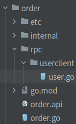
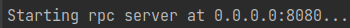
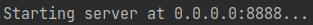
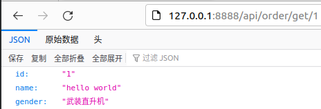
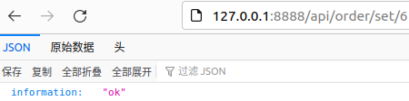
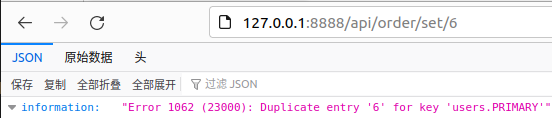
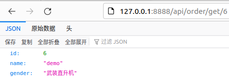
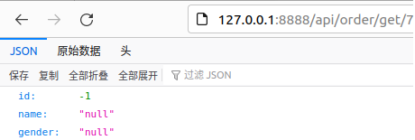

# 微服务

## 微服务的简介

**一、什么是微服务**

* 微服务框架指开发应用所用的架构形式

* 通过微服务，可将大型应用分解成多个独立的组件，其中每个组件都有各自的责任领域
* 在处理一个用户请求时，基于微服务的应用可能会调用许多内部微服务来共同生成其响应

**二、微服务的特点**

* 多个独立的组件，指的是微服务
* 独立服务易班有明确定义的API，用于通信
* 独立访问通常由一个小型团队负责
* 针对每个独立访问的开发、部署、运营维护、扩展等都不应该影响其它服务

* 每个服务针对一组功能进行设计，专注于解决特定的问题
* 每个服务不强调使用同一语言构建（技术自由）

**二、微服务架构的组成**

* 服务网关：确保服务提供者对客户端的透明（屏蔽复杂性），可以进行反向路由、安全认证、灰度发布、日志监控等
* 注册发现：注册并维护远程服务及服务提供者的地址，供消费者发现和调用，保证可用性（etcd、nacos、consul）
* 服务框架：用于实现微服务的RPC框架，包含服务接口描述及实现方案、向注册中心发布服务等功能（gRPC、Thrift）

* 服务监控：对服务消费者与提供者之间的调用情况进行监控和数据展示（prometheus）
* 服务追踪：记录对每个请求的微服务调用完整链路，以便进行问题定位和故障分析（jeager、zipkin）
* 服务治理：服务治理是通过一系列的手段来保证在各种情况下，服务调用仍然能够正常进行，手段包括熔断、隔离、限流、降级、负载均衡等（Sentinel、Istio）
* 基础设施：用以提供服务底层的基础数据服务，比如分布式消息队列、日志存储、数据库、缓存、文件服务器、搜索集群等（Kafka、MySQL、PostgreSQL、MongoDB、Redis、Minio，ElasticSearch）
* 分布式配置中心：统一设置配置文件（nacos、consul、apollo）
* 分布式事务：（seata、dtm）
* 容器以及容器编排：docker、k8s
* 定时任务

## 微服务的开发派系

**一、标准库/自研派系**

* 得益于go标准库的性能、稳定性、很多团队基于标准库来搭建微服务抽象
* 不会被框架束缚开发
* 开发RPC框架时（HTTP或TCP），大部分会选择gRPC（HTTP2.0）或基于gRPC进行自研开发

* 用到其它组件时进行集成即可
* 如果部署使用k8s，并且使用服务网格，比如使用Istio处理，那么只需要关心微服务的业务逻辑，不需要关心微服务架构其它组件（负载均衡等）

**二、基于开源web框架派系**

* 使用成熟的go web框架开发（go-gin）
* 以`gin`+`grpc`为核心，将其他组件集成进微服务架构

**三、大一统框架**

* 能很好减轻工作量，达到快速开发的目的，代价是遵循框架的规则
* go-zero是基于go的大一统框架的实践

# Go-zero的安装

**一、下载go-zero库**

```bash
GO111MODULE=on GOPROXY=https://goproxy.cn/,direct go get -u github.com/zeromicro/go-zero
```

**二、安装goctl工具**

* `sudo` 找不到`go`命令的解决方式：到安装go的目录里执行

```bash
#shell环境
GOPROXY=https://goproxy.cn/,direct 
sudo go install github.com/zeromicro/go-zero/tools/goctl@latest
```

```bash
#docker环境
# docker for arm64 (M1) architecture
docker pull kevinwan/goctl:latest-arm64
# run goctl like
docker run --rm -it -v `pwd`:/app kevinwan/goctl:latest-arm64 goctl --help
```

**三、检查protoc & protoc-gen-go的安装情况**

```go
goctl env check -i -f --verbose
```

**四、goctl的作用**

* api服务生成
* rpc服务生成
* model代码生成
* 模板管理

# Go-zero简介

**一、Go-zero文档**

[Go-zero文档](https://go-zero.dev/docs/tutorials)

**二、Go-zero特点**

- 集成了web/rpc于一体
- 强大的工具支持，尽可能少的代码编写
- 极简的接口
- 完全兼容 net/http
- 支持中间件，方便扩展
- 高性能
- 面向故障编程，弹性设计
- 内建服务发现、负载均衡
- 内建限流、熔断、降载，且自动触发，自动恢复
- API 参数自动校验
- 超时级联控制
- 自动缓存控制
- 链路跟踪、统计报警等
- 高并发支撑，稳定保障了疫情期间每天的流量洪峰

# API版Hello World

**一、创建项目**

* 使用`goctl`创建微服务
* 格式：`goctl api new 项目名`

```bash
goctl api new hello
```

**二、修改配置文件**

* 修改`./etc/xx-api.yaml`里的内容

* 初始状态下只有`Name`、`Host`和`Port`属性

```yaml
Name: hello-api
Host: 0.0.0.0
Prot: 8888
```

**三、修改路由**

* 在`./internal/routes.go`文件里修改`Path`的值

```go
[]rest.Route{
    {
        Method:http.MethodGet,
        Path:"/hello",
        handler:HelloHandler(serverCtx),
    },
}
```

**四、修改restful路由解析**

* 在`./internal/types/types.go`文件里进行修改
* hello world不需要路由参数解析所以直接将`Request`结构体的内容注释掉

**五、编写业务处理逻辑**

* 在`./internal/logic/xxlogic.go`里找到`todo`注释编写业务逻辑

```go
func (l *HelloLogic)Hello(req *types.Request)(resp *types.Response,err error){
    //todo:...
    resp=&types.Response{Message:"hello world"}
    return
}
```

**六、启动hello world微服务**

* 格式：`go run main文件 -f 配置文件`

```bash
go run hello.go -f ./etc/hello-api.yaml
```

# 微服务版Hello World

## rpc服务端

**一、初始化目录结构**

```bash
mkdir mall
cd mall
mkdir order user
```

**二、编写proto文件**

* 编写proto文件放在空目录里等待生成代码

```protobuf
//语法规范
syntax="proto3";
//生成微服务的包名，如果proto文件所在目录没有go.mod文件则自动生成
package user;
//生成代码相当于输出路径的存放位置（输出路径为相当于root目录），创建user目录并存放代码
option go_package="./user";
//消息结构体
message IdRequest{
	string id=1;
}
//消息结构体
message UserResopnse{
	string id=1;
	string name=2;
	string gender=3;
}
//rpc服务
service User{
	rpc getUser(IdRequest)returns(UserResponse);
}
```

**三、生成用于rpc调用的代码**

* 使用`goctl`工具proto文件生成代码
* 格式：`goctl rpc protoc proto文件名 --go_out=输出路径 --go-grpc_out=输出路径 --zrpc_out=proto文件存放目录`
* 一般要求生成的`pb.go`和`grpc.go`都放在同一目录下（输出路径一致）
* 使用`goctl`生成代码会同时生成用于客户端的`xxclient`目录文件

```bash
goctl rpc protoc user.proto --go_out=./types --go-grpc_out=./types --zrpc_out=.
```

**四、编写.yaml配置文件**

* 设置etcd的IP和端口
* 设置服务Key
* 注意端口占用情况

```yaml
Name: user.rpc
ListenOn:0.0.0.0:8080
Etcd:
	Hosts:
		-127.0.0.1:2379
	Key: user.rpc
```

**五、编写rpc服务端处理逻辑**

* 在`~/internal/logic`目录里编写处理逻辑

```go
func (l *GetUserLogic)GetUser(in *user.IdRequest)(*user.UserResponse,error){
    //todo
    return &user.Response{
        Id:in.GetId(),
        Name:"hello world",
        Gender:"武装直升机",
    },nil
}
```

**六、把接口文件发给客户端**

* 将`XXclient`发给编写rpc客户端逻辑的人

## api服务端

**一、api文件的编写**

* 使用`type`编写api输入输出的结构内容

* 在service模块里添加api方法，添加方法需要加`@handler`，方法的命名为`方法名+handler`

  (在`logic`目录里会变成方法名+`logic`)

* 可以接收Restful形式参数需要使用type定义输入的内容，然后用`()`进行绑定

```apl
type OrderReq{
	Id string `path:"id"`		//请求数据的消息结构，需要path包进行解析，数据从req变量里获取
}
type OrderReply{				//响应的消息结构，需要json包实现序列化
	Id string `json:"id"`
	Name string `json:"name"`
	UserName string `json:"userName"`
}
service order-api{
	@handler GetHandler		//定义名为Get的方法
	get /api/order/get/:id(OrderReq) returns (OrderReply)
}
```

**二、api文件生成代码**

* 格式：`goctl api go -api api文件名 -dir 生成代码输出位置`
* 默认会输出到当前目录，如果有已经写好的逻辑会被生成的代码覆盖，所以最好生成到一个新目录再选择覆盖

```bash
goctl api go -api order.api -dir .
```

**三、获取rpc的client文件**

* 创建一个`rpc`目录用于存放rpc客户端连接代码
* 从构建rpc服务端的人那获取rpc客户端连接代码



**四、.yaml文件配置rpc**

* 给每个rpc连接命名
* 设置Etcd的IP和端口
* 设置微服务的Key（习惯命名为服务名.rpc，一般要看服务端的etc配置文件设置的key）
* 注意端口占用情况

```go
Name: order-api
Host: 0.0.0.0
Port: 8888
UserRpc:			//rpc服务名
	Etcd:			//etcd服务器地址
		- 127.0.0.1:2379	
 	Key: user.rpc	//微服务的Key
```

**五、config.go配置rpc**

* 在`~/internal/config`目录里找到`config.go`文件添加rpc服务

```go
type Config struct{
    rest.RestConf
    UserRpc zrpc.RpcClientConf
}
```

**六、servicecontext.go配置rpc**

* 在`~/internal/svc`目录里找到`servicecontext.go`文件添加rpc服务
* 导入rpc的client包
* `ServiceContext`结构体里添加rpc客户端对象
* `NewServiceContext(...)`构造方法里添加返回rpc客户端对象
* `zrpc.MustNewClient()`只返回一个client，而`NewClient()`会返回额外返回一个`er`

```go
import (
	...
    "order/rpc/userclient"
)

type ServiceContext struct{
    Config config.Config
    //添加rpc客户端对象
    UserRpc userclient.User
}

func NewServiceContext(c config.Config)*ServiceContext{
    return &ServiceContext{
        Config:c,
        //添加rpc客户端对象
        UserRpc: userclient.NewUser(zrpc.MustNewClient(c.UserRpc)),
    }
}
```

**七、api接口调用rpc服务**

* 在`~/internal/logic`目录里编写业务处理逻辑
* 使用`l.svcCtx.rpc对象.方法`调用rpc方法

```go
func (l *GetLogic)Get(req *type.OrderReq)(resp *types.OrderReply,err error){
    //调用rpc方法
    user,err:=l.svcCtx.UserRpc.GetUser(l.ctx,&user.IdRequest{Id:req.Id})
    if err!=nil{
        return nil,err
    }
    //返回参数
    return &types.OrderReply{
        Id:user.Id,
        Name:user.Name,
        Gender:user.Gender,
    },nil
}
```

## docker-compose启动etcd

**一、安装docker-compose**
[docker-compose的安装与配置](https://gitee.com/fish_keqing/environment-configuration/blob/master/operation/docker-compose的安装与配置.md)

**二、docker-compose.yaml**

```yaml
version: "3.8"
services:
  Etcd:
    image: bitnami/etcd:latest			#镜像
    deploy:
      replicas: 1						#副本数
#      restart_policy:					#重启策略，新手阶段不推荐设置，不然启动失败都不知道
#        condition: on-failure
    environment:						#环境变量
      - ALLOW_NONE_AUTHENTICATION=yes
    privileged: true
    volumes:							#挂载目录
      - ${PWD}/data:/bitnami/etcd/data
    ports:
      - "2379:2379"						#端口映射
      - "2380:2380"
```

**三、启动etcd**

```shell
mkdir ./data			#创建目录
chmod a+rwx ./data		#目录授予0777权限
docker-compose up -d	#启动etcd
```

**四、启动失败的问题**

| 问题                                                         | 解决方式             |
| ------------------------------------------------------------ | -------------------- |
| "msg":"failed to start etcd",<br>"error":"cannot access data directory: open /bitnami/etcd/data/.touch: permission denied" | data目录授予0777权限 |

## 启动微服务

**一、启动etcd**

* 使用`docker-compose`启动

```bash
docker-compose up
```

**二、启动rpc服务端**

* 需要指定配置文件启动

```bash
go run user.go -f etc/user.yaml
```



**三、启动API接口/rpc客户端**

* 需要指定配置文件启动

```go
go run order.go -f etc/order-api.yaml
```



**四、检验结果**

* 路径为api文件里设置的路径



# 存储

## MySQL+Gorm的微服务实现

### rpc服务端

**一、编写有添加记录和查询记录的proto文件**

```protobuf
syntax="proto3";
package user;
option go_package="./user";
message IdRequest{
  int64 id=1;
}
message UserResponse{
  int64 id=1;
  string name=2;
  string gender=3;
}

message info{
  string info=1;
}

service User{
  rpc createUser(IdRequest)returns(info);
  rpc getUser(IdRequest)returns(UserResponse);
}
```

**二、goctl生成rpc服务端代码**

```bash
goctl rpc protoc user.proto --go_out=./types --go-grpc_out=./types --zrpc_out=.
```

**三、添加数据源**

* 创建名为zero的数据库，并在yaml配置文件添加数据源
* 在`~/internal/config/config.go`文件添加配置解析结构体
* 结构体命名：数据库名+`Config`

```sql
#mysql创建数据库语句
create database zero;
```

```yaml
Name: user.rpc
ListenOn: 0.0.0.0:8080
Etcd:
  Hosts:
  - 127.0.0.1:2379
  Key: user.rpc
Mysql:				#添加MySQL数据源
  DataSource: root:123456@tcp(127.0.0.1:3306)/zero?charset=utf8mb4
```

```go
//config.go
type Config struct{
    zrpc.RpcServerConf
    Mysql MysqlConfig	//对象名要对应yaml文件模块名
}

type MysqlConfig struct{
    DataSource string	//属性名要对应yaml文件里模块的属性名
}
```

**四、构建获取数据库连接池的方法**

* 在项目根目录处（`~/`）创建一个目录（`~/DAO`）用于保存获取数据库连接对象的相关代码
* 使用`gorm`库获取MySQL连接池

```bash
#获取gorm库和gorm的mysql驱动包
go get -u gorm.io/gorm
#mysql驱动
go get -u gorm.io/driver/mysql
```

```go
func GetMySQL(dsn string)(*gorm.DB,error){
    //获取mysql连接
    conn,err:=gorm.Open(mysql.Open(dsn),&gorm.Config{})
    if err!=nil{
        return nil,err
    }
    //获取sqlDB指针
    db.err:=conn.DB()
    if err!=nil{
        return nil,err
    }
    //设置最大连接数
    db.SetMaxOpenConns(10)
    //设置空闲连接数的上限
    db.SetMaxIdleConns(5)
    //设置重用连接的最长时间
    db.SetConnMaxLifetime(time.Second*600)
    //返回连接池
    return conn,nil
}
```

**五、构建数据模型**

* 创建`~/internal/model`目录，用于存储数据模型

```go
package model
//一个简单的users表
type User struct{
    Id		int64	`json:"id"`
    Name 	string	`json:"name"`
    Gender 	string	`json:"gender"`
}
```

**六、获取连接并返回连接对象**

* 在`~/internal/svc/servicecontext.go`里添加数据库连接对象
* 在`NewServiceContext()`里获取数据库连接池对象并返回
* 使用`c.Mysql.DataSource`获取`yaml`文件里的数据源

```go
type ServiceContext struct{
    Config config.Config
    MysqlDB *gorm.DB
}

func NewServiceContext(c config.Config)*ServiceContext {
    //输入数据源获取连接池
    MysqlDB,err:=connection.GetMySQL(c.Mysql.DataSource)
    if err!=nil{
        //连接失败退出服务
        panic("数据库连接失败!")
    }
    //将模型同步到MySQL，不用连接到MySQL建表
    _=MysqlDB.AutoMigrate(&model.User{})
    //返回MySQL数据源对象
    return &ServiceContext{
        Config:c,
        MysqlDB:MysqlDB,
    }
}
```

**七、编写curd逻辑代码**

* 创建`~/intetnal/curd`目录，用于存放curd逻辑代码

* 使用`gorm`实现增加记录和查询记录

```go
func Insert(mysqlEngin *gorm.DB,id int64)error{
    return mysqlEngin.Create(&model.User{Id:id,Name:"demo",Gender:"武装直升机"}).Error
}
func Query(mysqlEngin *gorm.DB,id int64)(*model.User,error){
    var user *model.User
    //获取数据并存在user对象里
    err:=mysqlEngin.Where("id=?",id).Take(&user).Error
    if err!=nil{
        return nil,err
    }
    return user,nil
}
```

**八、编写业务逻辑代码**

* 在`~/internal/logic`里编写业务逻辑代码
* 使用`l.svcCtx.MysqlDB`获取数据库连接池对象

```go
//createuserlogic.go
func (l *CreateUserLogic)CreateUser(in *user.IdRequest)(*user.Info,error){
    //输入数据库连接池对象和rpc客户端传来的Id
    err:=curd.Insert(l.svcCtx.MysqlDB,in.Id)
    if err!=nil{
        //返回error不为空时，rpc服务端不会将结构体里的数据返回，只会返回空结构体和error
        //这里直接返回处理情况信息，不需要在rpc客户端接收error再返回前端
        return &user.Info{Info:err.Error{}},nil
    }
}
```

```go
//createuserlogic.go
func (l *GetUserLogic)GetUser(in *user.IdRequest)(*user.UserResponse,error){
    //获取数据
    userInfo,err:=curd.Query(l.svcCtx.MysqlDB,in.Id)
    if err!=nil{
        return nil,err
    }
    //返回数据到rpc客户端
    return &user.UserResponse{
        Id:userInfo.Id,
        Name:userInfo.Name,
        Gender:userInfo.Gender,
    },nil
}
```

### api服务端

**一、编写api文件**

* 添加set方法和get方法

```go
//order.api
type Response {
	Message string `json:"message"`
}

type OrderReq {
	Id int64 `path:"id"`
}

type HandleInfo {
	Information string `json:"information"`
}

type OrderReply {
	Id     int64  `json:"id"`
	Name   string `json:"name"`
	Gender string `json:"gender"`
}

service order-api {
	@handler SetHandler
	get /api/order/set/:id(OrderReq) returns (HandleInfo)
	@handler GetHandler
	get /api/order/get/:id(OrderReq) returns (OrderReply)
}
```

**二、api文件生成代码**

```bash
goctl api go -api order.api -dir .
```

**三、获取rpc连接包**

* 创建`~/rpc`目录，将rpc连接包存在在该目录


**四、yaml文件添加rpc服务**

```yaml
Name: order-api
Host: 0.0.0.0
Port: 8888
UserRpc:
	Etcd:
		Hosts:
			- 127.0.0.1:2379
		Key: user.rpc
```

**五、config.go添加rpc服务**

```go
type Config struct{
    rest.RestConf
    UserRpc zrpc.RpcClientConf
}
```

**六、`servicecontext.go`添加rpc服务返回rpc对象**

```go
import (
	...
    "order/rpc/userclient"
)

type ServiceContext struct{
    Config config.Config
    //添加rpc客户端对象
    UserRpc userclient.User
}

func NewServiceContext(c config.Config)*ServiceContext{
    return &ServiceContext{
        Config:c,
        //添加rpc客户端对象
        UserRpc: userclient.NewUser(zrpc.MustNewClient(c.UserRpc)),
    }
}
```

**七、编写业务逻辑**

* 不能将数据赋值到resp，否则不能返回数据

```go
//getlogic.go
func (l *GetLogic)Get(req *type.OrderReq)(resp *types.OrderReply,err error){
  	userInfo,err:=l.svcCtx.UserRpc.GetUser(context.Background(),&user.IdRequest{Id:req.Id})
    //查询失败
    if err!=nil{
        //不能赋值到resp的属性，否则不能返回数据
        return &types.OrderReply{
            Id:		-1,
            Name:	"null",
            Gender:	"null",
        }
    }
    //查询成功
    return &types.OrderReply{
        Id:		userInfo.Id,
        Name:	userInfo.Name,
        Gender:	userInfo.Gender,
    },nil
}
```

```go
//setlogic.go
func (l *SetLogic)Set(req *type.OrderReq)(resp *types.HandleInfo,err error){
    info,_:=l.svcCtx.UserRpc.CreateUser(context.Background(),&user.IdRequest{Id:req.Id})
    return &types.HandleInfo{Information:info.Info},nil
}
```

### 微服务的启动

**一、部署mysql**

* 记得创建目录用于挂载

```bash
docker run 
			-d												#后台运行 
			-p 3306:3306 									#端口映射
			-v /home/mysql/my.cnf:/etc/mysql/my.cnf					#挂载配置文件
			-v /home/mysql/data:/var/lib/mysql 				#挂载数据
			-e MYSQL_ROOT_PASSWORD=123456 					#设置root密码
			--name mysql01 mysql							#设置容器名
```

```my.cnf
###必备配置信息
[mysqld]
pid-file        = /var/run/mysqld/mysqld.pid
socket          = /var/run/mysqld/mysqld.sock
datadir         = /var/lib/mysql
secure-file-priv= NULL
###以下自主选择
# 服务端使用的字符集默认为8比特编码的latin1字符集
character-set-server=utf8mb4
# 创建新表时将使用的默认存储引擎
default-storage-engine=INNODB
#这个需要注意一下，不然报错
#其原因是从 5.6开始，timestamp 的默认行为已经是 deprecated 了。
explicit_defaults_for_timestamp=true
wait_timeout= 31536000
interactive_timeout= 31536000
[mysql]
# 设置mysql客户端默认字符集
default-character-set=utf8mb4
```

**二、启动etcd**

* 参考上面docker-compose启动etcd

**三、启动服务**

```bash
#启动rpc服务
go run user.go -f ./etc/user.yaml
```


```bash
#启动api服务端
go run order.go -f ./etc/order-api.yaml
```


**四、测试服务**

* 插入成功



* 插入失败



* 查询成功



* 查询失败



## 带缓存的MySQL的微服务实现

### 生成数据库的curd代码

**一、通过.sql文件生成（ddl生成）**

* 进入`service/user/model`目录并在此目录存放生成的代码
* 命令格式：`goctl model 数据库种类 ddl -src .sql文件名 -dir 存放路径 -c`

```bash
cd service/user/model
goctl model mysql ddl -src user.sql -dir . -c
```

**二、通过数据源生成**

* 数据源格式：`root:password@tcp(127.0.0.1:3306)/database`（不需要?后面的参数）
* 命令格式：`goctl model 数据库类型 datasource -url="数据源" -table="表名" -c -dir .`

```bash
cd service/user/model
goctl model mysql datasource -url="..." -table="表名" -c -dir .
```

### 生成的curd方法及其作用

| 方法名    | 作用             |
| --------- | ---------------- |
| Insert()  | 主键顺序增加记录 |
| Delete()  | 删除记录         |
| Update()  | 更新记录         |
| FindOne() | 查询一条记录     |

### rpc服务端

**一、基于proto文件生成代码**

* 下面使用的proto文件与MySQL+Gorm的微服务实现的proto文件一样

```bash
goctl rpc protoc user.proto --go_out=./types --go-grpc_out=./types --zrpc_out=.
```

**二、yaml文件添加配置信息**

* 添加MySQL数据源和Redis的配置

```yaml
Name: user.rpc
ListenOn: 0.0.0.0:8080
Etcd:
  Hosts:
  - 127.0.0.1:2379
  Key: user.rpc
Mysql:
  DataSource: root:123456@tcp(127.0.0.1:3306)/zero?charset=utf8mb4
CacheRedis:
  - Host: 127.0.0.1:6379
    Type: node
```

**三、生成curd代码**

* 可以使用`.sql`文件和数据源生成代码
* 创建model目录存储生成的代码

**四、修改config.go文件**

* 添加MySQL和Redis的配置解析

```go
type Config struct {
	zrpc.RpcServerConf
	Mysql      MysqlConfig
	CacheRedis cache.CacheConf
}

type MysqlConfig struct {
	DataSource string
}
```

**五、获取带Redis缓存的MySQL连接对象**

* 使用`sqlx.NewMysql()`获取MySQL数据源
* 使用`model.NewUsersModel()`获取封装了Redis缓存的数据源

```go
type ServiceContext struct {
	Config config.Config
	Conn   model.UsersModel
}

func NewServiceContext(c config.Config) *ServiceContext {
	sqlConn := sqlx.NewMysql(c.Mysql.DataSource)
	return &ServiceContext{
		Config: c,
		Conn:   model.NewUsersModel(sqlConn, c.CacheRedis),
	}
}
```

**六、编写业务**

* 输入数据时，`sql.NullString{}`结构体的`Valid`要设为`true`表示非空

```go
//顺序插入数据，不需要输入主键id
func (l *CreateUserLogic) CreateUser(in *user.IdRequest) (*user.Info, error) {
	// todo: add your logic here and delete this line
	_, err := l.svcCtx.Conn.Insert(context.Background(), &model.Users{Id: in.Id, Name: sql.NullString{String: "demo", Valid: true}, Gender: sql.NullString{String: "武装直升机", Valid: true}})
	if err != nil {
		return nil, err
	}
	return &user.Info{Info: "ok"}, nil
}
```

```go
//查询数据
func (l *GetUserLogic) GetUser(in *user.IdRequest) (*user.UserResponse, error) {
	// todo: add your logic here and delete this line
	u, err := l.svcCtx.Conn.FindOne(context.Background(), in.Id)
	if err != nil {
		return nil, err
	}
	return &user.UserResponse{Id: u.Id, Name: u.Name.String, Gender: u.Gender.String}, nil
}
```

### 基于主键的缓存逻辑

**一、基于主键的缓存逻辑**

* 插入数据时，不缓存
* 更新数据时，更新完数据后删除缓存
* 删除数据时，删除缓存后删除数据
* 查询数据时
  * 如果从MySQL获取到数据则将数据以json的形式存储到Redis里
  * 如果从MySQ获取不到数据则暂存值为`*`

**二、缓存key的结构**

* 格式：`cache:zero:表名:主键id:序号`

### 缺点

**一、缺点**

* 生成代码的curd为业务常用的简单sql语句，对于较复杂的sql语句需要学习`sqlx`库自己编写sql语句
* 带缓存的连接绑定了`sqlx`库，对于使用`gorm`等库的程序员需要自己实现缓存机制

# JWT的使用

## 前端页面

**一、发送登录请求**

* 接收到响应数据后将token保存在`localStorage`里

```vue
<script setup>
import {reactive} from "vue";
import axios from "axios";
//登录信息
let account=reactive({account:null,password:null})
//登录事件
function login() {
  axios.post("/login",{account:account.account,password:account.password}).then((res)=>{
    //保存token
    localStorage.setItem("token",res.data.token)
    alert(res.data.msg)
  }).catch(()=>{
    alert("连接错误")
  })
}
</script>
```

**二、发送含token的请求**

* 使用`axios.interceptors.request.use()`设置请求拦截器
* 通过请求拦截器实现发送请求时附带token

```vue
<script setup>
import axios from "axios";
//设置请求拦截器
axios.interceptors.request.use(config=>{
    //获取token
    let token=localStorage.getItem('token')
    //存在则赋值到headers.Authorization
    if (token){
      config.headers.Authorization=token
    }
    return config
  })
//请求事件
function getMsg(){
  axios.get("/get").then((res)=>{
    alert(res.data.msg)
  }).catch(()=>{
    alert("连接错误")
  })
}
</script>
```

**三、跨域处理**

* 部署Nginx用于反向代理
* 前端项目构建完并打包后放入Nginx里
* 使用docker部署时需要注意本机IP是`docker0`的网关

```nginx
worker_processes 1;
events{
    worker_connections 1024;
}
http{
    include /etc/nginx/mime.types;
    default_type application/octet-stream;
    resolver 114.114.114.114;
    sendfile on;
    keepalive_timeout 65;
    server{
        listen 80;
        server_name 0.0.0.0;
        location /{
            root /usr/share/nginx/html/dist;
            index index.html;
        }
        location /get{
            proxy_pass http://172.17.0.1:8888;
        }
        location /login{
            proxy_pass http://172.17.0.1:8887;
        }
    }
}
```

## 登录的api服务

**一、编写api文件并生成代码**

```apl
type Response {
	Token string `json:"token"`
}

service login {
	@handler loginHandler
	get /login returns (Response)
}
```

```bash
goctl api go -api login.api -dir .
```

**二、修改yaml配置文件**

* 添加私钥和token持续时间
* 修改端口防止端口冲突

```yaml
Name: login
Host: 0.0.0.0
Port: 8887
Auth:
  AccessSecret: "*asadwda2345678"
  AccessExpire: 10
```

**三、修改config.go文件**

* 添加Auth配置信息内容

```go
type Config struct {
	rest.RestConf
	Auth struct {
		AccessSecret string
		AccessExpire int64
	}
}
```

**四、登录验证并返回token**

* `go-zero`里使用的jwt库为`github.com/golang-jwt/jwt/v4`
* 获取用于jwt的map（本质是封装了多个方法的`map[string]interface{}`）
* key为`exp`的值在使用的jwt库默认为过期时间，后续的api请求不能取该值
* 使用`jwt.New()`获取token对象
* 使用`.Claims`设置token的负载
* 使用`.SignedString()`输入key获取token序列

```go
func (l *LoginLogic) Login() (resp *types.Response, err error) {
    //获取用于jwt的map
	payload := make(jwt.MapClaims)
    //登录验证并获取数据
	payload["uid"] = 1
	payload["name"] = "demo"
    //设置过期时间该值不能取回
	payload["exp"] = time.Now().Unix() + 10
    //获取token对象
	token := jwt.New(jwt.SigningMethodHS256)
	//装载token内容
    token.Claims = payload
    //获取token序列
	jwtToken, err := token.SignedString([]byte(l.svcCtx.Config.Auth.AccessSecret))
	if err != nil {
		return nil, err
	}
	return &types.Response{Token: jwtToken}, nil
}
```

## 处理业务的api服务

**一、编写api文件并生成代码**

* 需要添加`@server`选项用于生成使用了jwt拦截器的代码
* 代码生成的拦截器在`~/internal/handler/routes.go`里引入，不想用在该处删掉Jwt拦截器引入代码

```apl
type Response {
	Uid  int64  `json:"uid"`
	Name string `json:"name"`
}

@server(
	jwt:Auth
)

service business {
	@handler getIngoHandler
	get /get returns (Response)
}
```

```bash
goctl api go -api business.api -dir .
```

**二、修改yaml配置文件**

* 添加私钥和token持续时间
* 修改端口防止端口冲突

```yaml
Name: business
Host: 0.0.0.0
Port: 8888
Auth:
  AccessSecret: "*asadwda2345678"
  AccessExpire: 10

```

**三、修改config.go文件**

* 添加Auth配置信息内容（Auth结构体会自动生成）

```go
type Config struct {
	rest.RestConf
	Auth struct {
		AccessSecret string
		AccessExpire int64
	}
}
```

**四、读取token数据并返回**

* jwt拦截器会自动解析token并将值存储到`ctx`对象里（exp键值对不会放入ctx里）
* 获取数字的值时要求断言使用`json.Number`，然后再获取对应类型的数据，返回error时表示数据为null

```go
func (l *GetIngoLogic) GetIngo() (resp *types.Response, err error) {
	id, _ := l.ctx.Value("uid").(json.Number).Int64()
	return &types.Response{Uid: id, Name: l.ctx.Value("name").(string)}, nil
}
```

# api服务中间件的使用

## 中间件的分类和api文件的编写

**一、中间件的分类**

* 路由中间件：作用于在同一路由组下的所有路由
* 全局中间件：作用于所有路由组里的所有路由

**二、api文件中添加中间件**

* 在`@server`模块里添加中间件

```apl
type Response {
	Uid  int64  `json:"uid"`
	Name string `json:"name"`
}

@server(
	middleware : userMiddleware
)

service business {
	@handler getIngoHandler
	get /get returns (Response)
}
```

## 路由中间件的使用

**一、修改`routes.go`文件**

* goctl生成代码时默认将所有路由放到同一个路由组导致所有路由都要使用中间件，所以需要进行修改
* 所有`server.AddRoutes()`添加新的路由组

```go
func RegisterHandlers(server *rest.Server, serverCtx *svc.ServiceContext) {
    //使用路由中间件的路由组
	server.AddRoutes(
		rest.WithMiddlewares(
			[]rest.Middleware{serverCtx.UserMiddleware},
			[]rest.Route{
				{
					Method:  http.MethodGet,
					Path:    "/login",
					Handler: loginHandler(serverCtx),
				},
			}...,
		),
	)
    //不使用中间件的路由组
	server.AddRoutes([]rest.Route{
		{
			Method:  http.MethodGet,
			Path:    "/register",
			Handler: registerHandler(serverCtx),
		},
	})
}
```

**二、编写中间件处理逻辑**

* 添加`next(w,r)`表示放行，不添加时表示过滤
* 使用闭包的方式返回中间件

```go
func (m *UserMiddleware) Handle(next http.HandlerFunc) http.HandlerFunc {
	return func(w http.ResponseWriter, r *http.Request) {
		log.Println("过滤前")
		next(w, r)
		log.Println("过滤后")
	}
}
```

**三、编写业务逻辑**

* 编写业务逻辑

## 全局中间件的使用

**一、修改`routes.go`文件**

* 使用`server.Use()`添加全局中间件
* 在`svc`对象里取出中间件对象

```go
func RegisterHandlers(server *rest.Server, serverCtx *svc.ServiceContext) {
    //添加全局中间件
	server.Use(serverCtx.UserMiddleware)
	server.AddRoutes([]rest.Route{
		{
			Method:  http.MethodGet,
			Path:    "/login",
			Handler: loginHandler(serverCtx),
		},
	})
	server.AddRoutes([]rest.Route{
		{
			Method:  http.MethodGet,
			Path:    "/register",
			Handler: registerHandler(serverCtx),
		},
	})
}
```

**二、编写中间件逻辑和业务逻辑**

* 编写中间件逻辑和业务逻辑

# 自定义错误

**一、实例api文件**

```apl
type Response {
	Msg string `json:"msg"`
}

service errors {
	@handler loginHandler
	get /login returns (Response)
}
```

**二、自定义错误**

* 创建`~/internal/errorx`目录，在该目录创建`errorx.go`文件
* 自定义一个错误结构体，并实现`error`接口
* 定义一个构造方法获取错误结构体
* 定义一个响应错误结构体，json的形式将错误返回前端
* 使用var定义一个错误的单例对象，业务代码错误时返回错误的单例对象即可
* 微服务的错误代码由微服务编号和错误编号组成

```go
//单例错误对象，101为微服务编号，01为错误编号
var ParamsError = New(10101, "自定义错误")

//自定义错误结构体
type BizError struct {
	Code int    `json:"code"`
	Msg  string `json:"msg"`
}

//构造方法
func New(code int, msg string) *BizError {
	return &BizError{Code: code, Msg: msg}
}

//返回错误字符串，实现error接口方法
func (e *BizError) Error() string {
	return e.Msg
}

//返回前端的响应消息结构体
type ErrorResponse struct {
	Code int    `json:"code"`
	Msg  string `json:"msg"`
}
// 返回响应数据
func (e *BizError) Data() *ErrorResponse {
	return &ErrorResponse{
		Code: e.Code,
		Msg:  e.Msg,
	}
}
```

**二、装载自定义错误**

* 在main方法里装载自定义错误
* 使用`httpx.SetErrorHandlerCtx()`装载自定义错误
* 使用`switch-case-default`语句实现，通过反射判断错误结构体的类型并返回响应数据

```go
httpx.SetErrorHandlerCtx(func(ctx context.Context, err error) (int, any) {
    //通过断言获取错误类型
    switch e := err.(type) {
    case *errorx.BizError:
        //返回响应状态码和错误消息给前端
        return http.StatusOK, e.Data()
    default:
        //默认只返回处理状态码，500
        return http.StatusInternalServerError, nil
    }
})
```

**三、编写业务逻辑代码**

```go
func (l *LoginLogic) Login() (resp *types.Response, err error) {
    //直接返回自定义错误，返回自定义错误的单例对象
	return nil, errorx.ParamsError
}
```

# goctl的使用

## API指令

**一、API工具**

* 用于初始化api文件或生成对应语言的代码
* [API文档](https://go-zero.dev/cn/docs/goctl/api)

| 命令     | 作用                   |
| -------- | ---------------------- |
| new      | 创建api文件            |
| validate | 校验api文件是否出错    |
| doc      | 生成doc文档            |
| go       | 生成go语言的代码       |
| java     | 生成java语言的代码     |
| ts       | 生成TypeScript代码     |
| dart     | 生成dart代码           |
| kt       | 生成kotlin代码         |
| plugin   | 使用自定义创建生成代码 |

**二、API指令的选项内容**

| 选项     | 作用                                                       |
| -------- | ---------------------------------------------------------- |
| --dir    | 生成代码输出位置                                           |
| --api    | 选择api文件                                                |
| --style  | 选择文件命名方式                                           |
| --home   | 选择自定义模板（模板的根目录）                             |
| --remote | 选择远程仓库的模板，--remote和--home互斥，默认优选--remote |
| --branch | 选择远程仓库模板的分支                                     |

**三、API指令生成go-api服务**

* 格式`goctl api go [command options] [arguments...]`
* 使用`--style`选择文件命名方式，默认小写

| 输入参数 | 文件格式    | 说明   |
| -------- | ----------- | ------ |
| gozero   | helloworld  | 小写   |
| goZero   | helloWorld  | 小驼峰 |
| go_zero  | hello_world | 下划线 |

```bash
goctl api go --api order.api --dir . --style goZero
```

## RPC指令

**一、RPC工具**

* 基于proto文件生成rpc微服务代码

| 选项       | 作用                        |
| ---------- | --------------------------- |
| --zrpc_out | 生成代码生成目录            |
| --style    | 命名规则，与api语法一样     |
| --home     | 使用模板，值为模板路径      |
| --remote   | 使用远程代码仓库的proto文件 |
| --branch   | 选择分支                    |
| --verbose  | 启用日志输出                |

**二、生成rpc服务代码**

* 格式：`goctl rpc protoc --go_out=./types --go-grpc_out=./types [命令选项]`

```bash
goctl rpc protoc user.proto --go_out=./types --go-grpc_out=./types --zrpc_out=.
```

**三、proto文件import的使用**

* 编写protoc文件时可以引用其他proto文件定义的变量
* 只能在结构体使用，不能在rpc服务区块使用

```protobuf
import "base/common.proto";

message Request {
  base.In in = 1;// 支持import
}
```

**四、proto文件option**

* 在go-zero规则里option必须填`./包名`，可生成客户端的连接代码`xxxClient`

```protobuf
option go_package="./user";
```

## Model指令

**一、model工具**

* 基于`.sql`文件或数据源快速生成基本CURD代码，可以修改模板

| 命令       | 说明               |
| ---------- | ------------------ |
| ddl        | 基于`.sql`文件生成 |
| datasource | 基于数据源生成     |

**二、基于.sql文件生成model代码**

* 格式：`goctl model mysql ddl [command] [arguments]`

```bash
goctl model mysql ddl -src user.sql -dir . -c
```

| 选项         | 说明                   |
| ------------ | ---------------------- |
| --src / -s   | .sql文件来源           |
| --dir / -d   | sql文件所在目录        |
| --style      | 命名风格               |
| --cache / -c | 生成带有缓存的CURD代码 |
| --home       | 使用模板生成           |
| --remote     | 使用远程代码仓库模板   |
| --branch     | 选择分支               |

**三、基于数据源生成model代码**

* 数据源格式：`user:pwd@tcp(ip:port)/db`
* 建议自定义model模板生成

```bash
goctl model mysql datasource -url="root:123456@tcp(127.0.0.1:3306)/zero" -table="表名" -c -dir .
```

| 选项         | 说明                   |
| ------------ | ---------------------- |
| --url        | 数据源                 |
| --table      | 表名                   |
| --cache / -c | 生成带有缓存的CURD代码 |
| --dir / -d   | sql文件所在目录        |
| --home       | 使用模板生成           |
| --remote     | 使用远程代码仓库模板   |
| --branch     | 选择分支               |

**四、类型转换规则**
[model类型转换规则](https://go-zero.dev/cn/docs/goctl/model/#类型转换规则)

## docker指令

**一、docker工具**

* 一键生成dockerfile文件，使用多阶段构建的方式生成镜像
* 格式：`goctl docker -go main文件`

```bash
goctl docker -go hello.go
```

## k8s命令

**一、kube工具**

* 用于生产k8s资源清单
* [kube命令](https://go-zero.dev/cn/docs/goctl/other?_highlight=docker#goctl-kube)

# API文件的编写

## 定义结构体

**一、定义一个结构体**

* 使用`type`定义结构体
* 格式：`type 结构体名{ ... }`

```apl
type Response{
	Msg string `json:"msg"`
}
```

**二、定义多个结构体**

* 使用`type(...)`定义多个结构体

```apl
type(
	Request{
		Id int64 `json:"msg"`
	}
	Response{
		Msg string `json:"msg"`
	}
)
```

## 定义路由组和方法

**一、定义一个路由组**

* 使用`service`定义一个路由组
* 使用`@handler`定义方法，方法名命名规则：`方法名+Handler`
* 格式：`service 微服务名{ }`

```apl
type(
	Request{
		Id int64 `json:"id"`
		Pwd string `json:'pwd'`
	}
	Response{
		Msg string `json:"msg"`
	}
)
//一个路由组
service user{
	@handler loginHandler
	post /login(Request) returns(Respone)
}
```

**二、定义多个路由组**

* 使用`service`定义多个路由组
* 要求`service`的服务名都一样

```apl
type(
	Request{
		Id int64 `json:"id"`
		Pwd string `json:'pwd'`
	}
	Response{
		Msg string `json:"msg"`
	}
)
//第一个路由组
service user{
	@handler loginHandler
	post /login(Request) returns(Respone)
}
//第二个路由组
service user{
	@handler registerHandler
	post /register(Request) returns(Respone)
}
```

**三、路由组添加其他配置**

* 使用`@server`定义路由组的配置
* 一个`@server`对应一个`service`，要求`@server`在上`service`在下

| 配置参数   | 说明                                         |
| ---------- | -------------------------------------------- |
| jwt        | 添加jwt鉴权中间件，需要在yaml文件添加jwt配置 |
| group      | 将api方法转移到定义的目录，用于分类          |
| middleware | 添加自定义中间件                             |
| prefix     | 添加api根路径（/use/login）                  |

```apl
@server(
	//启动jwt鉴权
	jwt: Auth
	//api的handler代码分类到api目录里
	group : api
	//使用自定义中间件
	middleware: AuthMiddleware
	//添加根路由
	prefix : api
)
```

**四、使用示例**

```apl
type (
	Request {
		Id int64 `json:"id"`
	}
	Response {
		Msg string `json:"msg"`
	}
)

//访问路由 127.0.0.1:8888/register
@server(
	group : register
	middleware: AuthMiddleware
)
service demo {
	@handler registerHandler
	post /register returns(Response)
}

//访问路由 127.0.0.1:8888/login/1
@server(
	group : login
	middleware: AuthMiddleware
)
service demo{
	@handler loginHandler
	get /login/:id(Request) returns (Response)
}

//访问路由 127.0.0.1:8888/api/get/1
@server(
	jwt: Auth
	group : api
	middleware: AuthMiddleware
	prefix : api
)
service demo{
	@handler getHandler
	get /get/:id(Request) returns(Response)
}
```

# 日志

## 官方推荐的第三方日志库

* zap

  - 实现：https://github.com/zeromicro/zero-contrib/blob/main/logx/zapx/zap.go

  - 使用示例：https://github.com/zeromicro/zero-examples/blob/main/logx/zaplog/main.go

- logrus
  - 实现：https://github.com/zeromicro/zero-contrib/blob/main/logx/logrusx/logrus.go
  - 使用示例：https://github.com/zeromicro/zero-examples/blob/main/logx/logrus/main.go

## zap日志库的集成

**一、复制集成了zap的第三方库**

* [复制zap文件](https://github.com/zeromicro/zero-contrib/blob/main/logx/zapx/zap.go)
* 创建`zapx`目录并将复制的zap库放到该目录里

**二、main函数启动日志库**

* 使用`zapx.NewZapWriter()`方法获取writer对象
* 使用`logx.Must()`方法检查获取writer对象时是否出错
* 使用`logx.SetWriter()`设置writer对象到`logx`里，必须再`sercer.Start()`前一句设置（不然会被覆盖）
* 使用`logx.SetUp()`设置日志相关配置

```go
func main(){
    ...
    //获取zap的writer对象
    writer,err:=zapx.NewZapWriter()
    logx.Must(err)
    //设置writer对象到logx里
    logx.SetWriter(writer)
    //设置日志相关的配置
    err=logx.SetUp(&logx.LogConf{Mode:"file",Path:"./log"})
    logx.Must(err)
    defer logx.Close()
    
    fmt.Printf(...)
    server.Start()
}
```

**三、日志相关配置**

| 选项                | 说明                                                         |
| ------------------- | ------------------------------------------------------------ |
| ServiceName         | 设置服务名称（可选）。在 `volume` 模式下，该名称用于生成日志文件。<br>在 `rest/zrpc` 服务中，名称将被自动设置为 `rest`或`zrpc` 的名称 |
| Mode                | `console`：日志输出到控制台（默认）<br>`file`：日志写到`Path`指定的目录（常用于本地化存储日志）<br>`volume`：docker中使用，将日志写入挂载卷里 |
| Encoding            | `json`：json形式编码（默认）<br>`plain`：用纯文本写日志，并带有终端颜色显示 |
| TimeFormat          | 自定义时间格式，可选。默认是 `2006-01-02T15:04:05.000Z07:00` |
| Path                | 设置日志路径，默认为 main包的`./logs`                        |
| Level               | 用于过滤日志的日志级别，默认`info`<br>`info`：所有日志都被写入<br>`error`：丢弃`info`日志，其它保留<br>`severe`：`info` 和 `error` 日志被丢弃，只有 `severe` 日志被写入 |
| Compress            | 是否压缩日志文件，只在 `file` 模式下工作                     |
| KeepDays            | 日志文件被保留多少天，在给定的天数之后，过期的文件将被自动删除。 |
| StackCooldownMillis | 多少毫秒后再次写入堆栈跟踪。用来避免堆栈跟踪日志过多         |

## 日志发送到kafka的实现

[集成kafka](https://go-zero.dev/cn/docs/component/logx#将日志写到指定的存储)

## 敏感字段处理

**一、敏感字段处理**

* 构建一个用于处理敏感字段的`writer`使用断言判断传入参数的类型并修改敏感字段的值

```go
type (
    Message struct {
        Name     string
        Password string
        Message  string
    }

    SensitiveLogger struct {
        logx.Writer
    }
)

func NewSensitiveLogger(writer logx.Writer) *SensitiveLogger {
    return &SensitiveLogger{
        Writer: writer,
    }
}

func (l *SensitiveLogger) Info(msg interface{}, fields ...logx.LogField) {
    if m, ok := msg.(Message); ok {
        l.Writer.Info(Message{
            Name:     m.Name,
            Password: "******",
            Message:  m.Message,
        }, fields...)
    } else {
        l.Writer.Info(msg, fields...)
    }
}

func main() {
    // setup logx to make sure originalWriter not nil,
    // the injected writer is only for filtering, like a middleware.

    originalWriter := logx.Reset()
    writer := NewSensitiveLogger(originalWriter)
    logx.SetWriter(writer)

    logx.Infov(Message{
        Name:     "foo",
        Password: "shouldNotAppear",
        Message:  "bar",
    })
  
    // more code
}
```

# 服务集成Prometheus（监控）

**一、docker-compose文件**

```yaml
version: "3.8"
services:
  prometheus:
    container_name: prometheus
    image: bitnami/prometheus
    environment:
      - TZ=Asia/Shanghai
    privileged: true
    volumes:
      - ${PWD}/prometheus/prometheus.yml:/opt/bitnami/prometheus/conf/prometheus.yml
      - ${PWD}/prometheus/targets.json:/opt/bitnami/prometheus/conf/targets.json
    ports:
      - "9090:9090"
    #restart: always
```

**二、prometheus.yml**

```yaml
global:
  scrape_interval: 15s
  evaluation_interval: 15s
scrape_configs:
- job_name: 'file_ds'
  file_sd_configs:
  - files:
    - targets.json
```

**三、启动`prometheus`服务**

* `go-zero`内部已经封装了`Prometheus`客户端，只需在配置文件设置信息就能启动
* 一个服务对应一个IP端口，打开`IP:端口/metrics`可以得到监控信息
* 使用`docker`搭建时，IP不能设为`127.0.0.1`，否则容器不能获取监控信息
* 启动服务后可以直接访问`IP:端口/metrics`，检查`prometheus`服务是否启动

```yaml
//api
Name: user
Host: 0.0.0.0
Port: 8888
Prometheus:
  Host: 0.0.0.0
  Port: 9091
  Path: /metrics
```

```yaml
//rpc
Name: user-rpc
Host: 0.0.0.0
Port: 8080
Prometheus:
  Host: 0.0.0.0
  Port: 9092
  Path: /metrics
```

**四、targets.json配置监控目标**

* 使用`docker-compose.yml`部署容器
* <font color=red>使用`ifconfig`获取docker环境里主机IP地址（建议使用自定义docker网络）</font>
* `targets`选项对应服务启动的`prometheus`客户端的IP和端口
* `instance`选项对应业务的IP和端口
* 使用`docker-compose stop/start`重启服务
* `127.0.0.1:9090`进入可视化监控界面

```json
[
    {
        "targets": ["172.26.0.1:9091"],
        "labels": {
            "job": "user-api",
            "app": "user-api",
            "env": "test",
            "instance": "172.26.0.1:8888"
        }
    },
    {
        "targets": ["172.26.0.1:9090"],
        "labels": {
            "job": "user-rpc",
            "app": "user-rpc",
            "env": "test",
            "instance": "172.26.0.1:8888"
        }
    }
]
```

**五、参考文档**

* [服务监控 | go-zero](https://go-zero.dev/cn/docs/deployment/service-monitor#go-zero基于prometheus的服务指标监控)

# 服务集成jaeger（链路追踪）

**一、jaeger**

* 服务调用的链路追踪
* 可以获取链路上每个服务处理的时间处理时间

**二、docker-compose部署**

```yaml
version: "3.8"
services:
  jaeger:
    container_name: jaeger
    image: rancher/jaegertracing-all-in-one
    environment:
      - TZ=Asia/Ahanghai
      - SPAN_STORAGE_TYPE=elasticsearch
      - ES_SERVER_URLS=http://elasticsearch:9200
      - LOG_LEVEL=debug
    privileged: true
    ports:
      - "6831:6831/udp"
      - "6832:6832/udp"
      - "5778:5778"
      - "16686:16686"
      - "4317:4317"
      - "4318:4318"
      - "14250:14250"
    #restart: always
  elasticsearch:
    container_name: elasticsearch
    image: elasticsearch
    environment:
      - TZ=Asia/Shangehai
      - discovery.type=single-node
      - "ES_JAVA_OPTS=-Xms512m -Xmx512m"
    privileged: true
    ports:
      - "9200:9200"
    #restart: always
```

**三、服务添加jaeger配置**

* 启动后访问`http://localhost:16686`进行测试

```yaml
Telemetry:
  #服务名
  Name: user-api
  #jaeger地址
  Endpoint: http://127.0.0.1:14268/api/traces
  Sampler: 1.0
  Batcher: jaeger
```

```yaml
Telemetry:
  Name: user-rpc
  Endpoint: http://127.0.0.1:14268/api/traces
  Sampler: 1.0
  Batcher: jaeger
```

# 分布式事务

## DTM的下载与安装

**一、下载源码**

```bash
git clone https://github.com/dtm-labs/dtm.git
```

**二、下载依赖**

```bash
go mod tidy
```

**三、编辑配置文件**

```yaml
MicroService:
  Driver: 'dtm-driver-gozero'
  Targer: 'etcd://0.0.0.0:2379/dtmservice'
  EndPoint: '0.0.0.0:36790'
```

**四、运行**

```bash
go run main.go -c config.yml
```

**五、遇到的问题**

* `github.com/agiledragon/gomonkey/v2 v2.2.0`包校验失败
  * 修改mod文件，将版本改成`v2.10.1`


