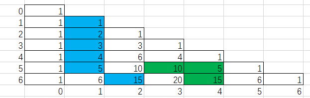

## 杨辉三角

**一、杨辉三角与组合数**

​		◼设列为n（容量），m为取的数量

​		◼组合数的结果位于`(n,m)`的值

​		◼`(n,m)`的值等于`(n-1,m-1)`及其该列上面所有值的和（基本的规律）

​		◼基于基本的规律发现：`(n-1,m)+(n-1,m-1)=(n,m)`

​		◼求杨辉三角的第`i+1`行数组时，只需要第`i`行数组（使用递归运算可以将矩阵压缩只剩最后一行）

​		◼只求一次组合数时可以根据发现的规律直接递归求值，递归到边界时返回1

​		◼获取多个组合数建议求`i+1`行的数组然后取出，获取1个组合数建议直接递归求值