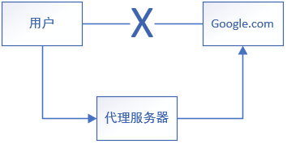
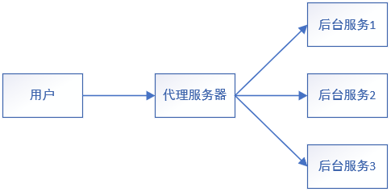
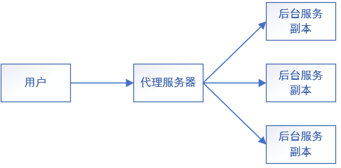
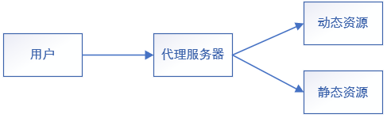

# docker中下载与配置Nginx

**一、下载镜像**

```shell
docker pull nginx
```

**二、创建容器**

```shell
docker run -d --name nginx01 -p 8080:80 nginx
```

# Nginx常用命令

**一、nginx工作目录**

```shell
cd /usr/local/nginx/sbin/
```

**二、启动**

```shell
./nginx
```

**三、停止**

```shell
./nginx -s stop
```

**四、安全退出**

```shell
./nginx -s quit
```

**五、重新加载配置文件**

```shell
./nginx -s reload
```

# Nginx的作用

**一、正向代理**

* 代理服务器代替用户访问网页



**二、反向代理**

* 客户端将请求发送到代理服务器，由代理服务器将请求传到对应的服务器上
* 使用代理服务器暴露的是代理服务器的地址，隐藏了真实服务器IP地址



**三、负载均衡**

* 多个用户发送多个请求到代理服务器，代理服务器将请求分配给每个提供服务的服务器

  * 一般轮询：依次循环将分配到服务器

  * 加权轮询：根据服务器的资源进行加权，权重大的服务器分配的请求多



**四、动静分离**

* 用户请求时，可能访问的是动态资源或静态资源
* 动态资源处理时间长占用资源大，静态资源处理数据非常短资源占用小
* `nginx`服务器可以根据请求的资源类型分配到静态资源服务器和动态资源服务器
* 动静分离有利于提高服务器的响应速度，节省服务器资源
* 一般动态资源转到其他服务器上，静态资源由`nginx`服务器进行响应



# docker中Nginx的安装

**一、拉取镜像**

```shell
docker pull nginx
```

**二、挂载的文件**

* `nginx.conf`：nginx的配置文件
* `conf.d`
* `/var/log/nginx`：日志文件目录
* `/usr/share/nginx/html`

**三、创建容器**

```shell
docker run -d --name mynginx -p 8081:80 \
	\-v $PWD/confg/nginx.conf:/etc/nginx/nginx.conf \
	\-v $PWD/confg/conf.d:/etc/ngonx/conf.d \
	\-v $PWD/log:/var/log/nginx \
	\-v $PWD/html:/usr/share/nginx/html nginx
```

# Nginx配置文件

## nginx配置文件组成

**一、nginx.conf**

* `worker_processes{}`：全局块，配置影响`nginx`服务器整体运行的配置指令
* `events{}`：事件块，影响代理服务器与用户的连接
* `http{}`：http块，用于配置代理

## worker_processes相关配置

**一、设置开启线程数**

* 使用`worker_processes`配置
* 格式：`worker_processes num;`

```nginx
worker_processes 1;
```

**二、设置pid文件存放路径**

* 使用`pid`设置

```nginx
pid /var/log/nginx;
```

## events相关配置

**一、设置最大连接数**

* 使用`worker_connections`设置服务器与用户的最大连接数
* 格式：`worker_connections num;`

```nginx
worker_connections 1024;
```

## http块

* http块包含`http`全局块、`server`块

### http全局块

**一、设置文件类型(MIME)映射表**

* 使用`include`设置文件类型映射表

```nginx
include /etc/nginx/mime.types;
```

**二、设置默认的文件(MIME)类型**

* 使用`default_type`设置
* 如果请求的资源没有类型，则默认资源类型为`default_type`设置的值

```nginx
default_type application/octet-stream
```

**三、开启sendfile方式传输文件**

* 使用`sendfile`进行设置

```nginx
sendfile on
```

**四、设置连接的最大保持时间**

* 使用`keepalive_timeout`设置

```nginx
keepalive_timeout 65;
```

**五、设置全局DNS服务器**

* 使用`resolver`设置

```nginx
resolver 114.114.114.114;
```

**六、设置连接超时时间**

* 使用`keepalive_time_out`设置

```nginx
keepalive_timeout 65;
```

### server块

**一、设置服务监听端口**

* 使用`listen`设置

```nginx
listen 80;
```

**二、绑定代理服务器IP**

* 使用`server_name`

```nginx
server_name 0.0.0.0;
```

### location代理块

**一、正向代理请求**

* 使用`proxy_pass`进行正向代理
* 没有安装插件的`nginx`只能代理`http`信息，不能代理`https`

```nginx
#正向代理，不能代理代理服务器内的web服务
proxy_pass http://$host$request_uri;
#反向代理，可以代理代理服务器内的web服务
proxy_pass http://192.168.43.12:8080;
```

**二、localtion**

* 定义浏览器的路径，后面跟着代理服务的设置

```nginx
#服务代理服务器的根目录时，执行设置好的代理服务
location /{代理服务}
```

# 正向代理

* 没有安装插件的`nginx`只能代理`http`页面，不能代理`https`页面
* [代理`https`的插件安装教程](https://github.com/chobits/ngx_http_proxy_connect_module)

```nginx
worker_processes 1;
events{
    worker_connections 1024;
}
http{
    include /etc/nginx/mime.types;
    default_type application/octet-stream;
    resolver 114.114.114.114;
    sendfile on;
    keepalive_timeout 65;
    server{
        listen 80;
        server_name 0.0.0.0;
        location /{
            proxy_pass http://$host$reques_uri;
        }
    }
}
```

# 反向代理

* 一个server针对一种服务，多种服务要求端口不能冲突

```nginx
worker_processes 1;
events{
    worker_connections 1024;
}
http{
    include /etc/nginx/mime.types;
    default_type application/octet-stream;
    resolver 114.114.114.114;
    sendfile on;
    keepalive_timeout 65;
    server{
        listen 80;
        server_name 0.0.0.0;
        location /one{
            proxy_pass http://192.168.43.12:8080;
        }
        location /two{
            proxy_pass http://192.168.43.12:8080;
        }
    }
}
```

# 负载均衡

* 使用`upstream`创建服务组实现轮转负载均衡
* 使用服务组的组名实现反向代理和负载均衡
* 使用`server`配置服务器
* 在`server`里使用`weight`可以配置权重

## 轮转负载均衡

```nginx
worker_processes 1;
events{
    worker_connections 1024;
}
http{
    include /etc/nginx/mime.types;
    default_type application/octet-stream;
    resolver 114.114.114.114;
    sendfile on;
    keepalive_timeout 65;
    
    upstream myserver{
        server 192.168.43.12:8080;
        server 192.168.43.12:8081;
    }
    
    server{
        listen 80;
        server_name 0.0.0.0;
        location /{
            proxy_pass http://myserver;
        }
    }
}
```

## 带权负载均衡

```nginx
worker_processes 1;
events{
    worker_connections 1024;
}
http{
    include /etc/nginx/mime.types;
    default_type application/octet-stream;
    resolver 114.114.114.114;
    sendfile on;
    keepalive_timeout 65;
    
    upstream myserver{
        server 192.168.43.12:8080 weight=1;
        server 192.168.43.12:8081 weight=2;
    }
    
    server{
        listen 80;
        server_name 0.0.0.0;
        location /{
            proxy_pass http://myserver;
        }
    }
}
```

# 动静分离

**一、root响应**

* 将`location`的路径拼接到内部响应路径，访问资源时需要在后面加资源名

* **服务器内部响应路径：`root`配置的路径+`location`配置的路径+静态文件名**
* **浏览器响应路径：`location`配置的路径+静态文件名**
* 浏览器端例子：`localhost/html/image.webg`
  * `/html`为`location`配置的路径，对应则内部服务器名为`html`的目录
  * `image.webg`为`html`目录下的资源

**二、alias响应**

* 将`location`的路径映射到`alias`设置的路径，访问资源时需要在后面加资源名
* **服务器内部响应路径：`alias`配置的路径+静态文件名**
* **浏览器响应路径：`location`配置的路径+静态文件名**
* 浏览器端例子：`localhost/demo/image.webg`
  * `/demo`为`location`地址，使用`alias`将路径映射到服务器内部资源目录的路径
  * `image.webg`为映射目录下的资源
* 使用格式：`alias 目录地址;`
* `autoindex`：用于配置镜像资源服务器，返回资源目录由用户自行选择静态资源

**三、指定返回的静态资源**

* 使用`index`指定返回的静态资源
* 格式：`index 资源名;`

**四、返回目录下的所有资源名，由用户自行选择**

* 使用`autoindex`配置

## Nginx配置静态资源服务器（资源镜像）

```nginx
worker_processes 1;
events{
    worker_connections 1024;
}
http{
    include /etc/nginx/mime.types;
    default_type application/octet-stream;
    sendfile on;
    keepalive_timeout 65;
    
    server{
        listen 80;
        server_name 0.0.0.0;
        location /{
            alias /usr/share/nginx/html;
            autoindex on;
        }
    }
}
```

## 使用root配置静态资源返回

```nginx
worker_processes 1;
events{
    worker_connections 1024;
}
http{
    include /etc/nginx/mime.types;
    default_type application/octet-stream;
    sendfile on;
    keepalive_timeout 65;
    
    server{
        listen 80;
        server_name 0.0.0.0;
        location /html{
            root /usr/share/nginx;
            index demo.html;
        }
    }
}
```

## 使用alias配置静态资源返回

```nginx
worker_processes 1;
events{
    worker_connections 1024;
}
http{
    include /etc/nginx/mime.types;
    default_type application/octet-stream;
    sendfile on;
    keepalive_timeout 65;
    
    server{
        listen 80;
        server_name 0.0.0.0;
        location /image{
            alias /usr/share/nginx/html;
            index image.webp;
        }
    }
}
```

# 实践

## 开发环境

```nginx
worker_processes 1;

events{

    worker_connections 1024;

}

http{

    include /etc/nginx/mime.types;

    default_type application/octet-stream;

    resolver 114.114.114.114;

    sendfile on;

    keepalive_timeout 65;

    server{

        listen 80;

        server_name 0.0.0.0;

        location /{

            root /usr/share/nginx/html/dist;

            index index.html;

        }

        location /api/spyder/progress{

            proxy_pass http://172.20.0.6:8888;

            proxy_http_version 1.1;

            proxy_set_header Upgrade $http_upgrade;

            proxy_set_header Connection "Upgrade";

        }

        location /api/spyder{

            proxy_pass http://172.20.0.6:8888;

        }

        location /api/get{

            proxy_pass http://172.20.0.6:8888;

        }

        location /api/video{

            proxy_pass http://172.20.0.10:8888;

        }

    }

}
```

## 生产环境

**一、SSL的部署**

```nginx
worker_processes 1;

events{

    worker_connections 1024;

}

http{

    include /etc/nginx/mime.types;

    default_type application/octet-stream;

    resolver 114.114.114.114;

    sendfile on;

    keepalive_timeout 65;

    server{

        listen 443 ssl;

	ssl_certificate /usr/share/nginx/cert/miyofun.top/miyofun.top.pem;

	ssl_certificate_key /usr/share/nginx/cert/miyofun.top/miyofun.top.key;

	ssl_session_timeout 5m;

	ssl_ciphers ECDHE-RSA-AES128-GCM-SHA256:ECDHE:ECDH:AES:HIGH:!NULL:!aNULL:!MD5:!ADH:!RC4;

	ssl_protocols TLSv1 TLSv1.1 TLSv1.2;

	ssl_prefer_server_ciphers on;

        server_name miyofun.top;

        location /{

            root /usr/share/nginx/html/dist;

            index index.html;

        }

        location /api/spyder/progress{

            proxy_pass http://172.20.0.6:8888;

            proxy_http_version 1.1;

            proxy_set_header Upgrade $http_upgrade;

            proxy_set_header Connection "Upgrade";

        }

        location /api/spyder{

            proxy_pass http://172.20.0.6:8888;

        }

        location /api/get{

            proxy_pass http://172.20.0.6:8888;

        }

        location /api/video{

            proxy_pass http://172.20.0.10:8888;

        }

    }

}
```

