# NoSQL

**一、`NoSQL`**

​		◼非关系型数据库

**二、`NoSQL`分类**

​		◼KV键值对：`redis`

​		◼文档型数据库：`MongoDB`				

​		◼列存储数据库：`Hbase`、分布式文件系统

​		◼图关系数据库

# Redis

## redis概述

**一、redis**

​		◼`Redis`，即为远程字典访问

​		◼`Redis`是基于内存的非结构化数据库

​		◼[Redis中文网](http://redis.cn/)

**二、redis的特性**

​		◼多样化的数据类型

​		◼持久化

​		◼集群

​		◼事务

**三、redis作用**

​		◼内存存储、持久化（`rdb`、`aof`）

​		◼高效，用于高速缓存

​		◼用于发布订阅系统

​		◼地图信息分析

​		◼计时器、计数器

**四、redis访问速度快的原因**

​		◼基于内存存储，内存的存储速度快

​		◼使用I/O多路复用技术，保证了单线程情况下短时间内能处理大量I/O操作

**五、redis的多线程作用**

​		◼redis的性能瓶颈在网络I/O操作上，需要多线程解析请求

​		◼用于处理网络数据的读写和协议的解析，降低redis主线程阻塞的时间并提高执行效率

## Redis性能测试

**一、Redis的性能**

​		◼`redis`是基于内存的数据库，`CPU`不是`redis`的性能瓶颈

​		◼`redis`的瓶颈是内存频率和网络带宽

**二、性能测试的参数设置**

​		◼`-h`：指定主机名，默认`127.0.0.1`

​		◼`-p`：指定服务器端口，默认`6379`

​		◼`-c`：指定并发数

​		◼`-n`：指定请求数

```shell
#开始测试10个并发，每个并发10000条请求
redis-benchmark -c 10 -n 10000
```

## 使用Redis的基本系统操作

**一、切换Redis的数据库**

​		◼`Redis`默认有16个数据库，且默认使用第0个数据库

​		◼使用`select`切换数据库

```shell
#切换到第3个数据库（从0开始计）
select 3
```

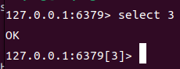

**二、查看当前数据库的数据总量**

​		◼使用`dbsize`命令查看

```shell
dbsize
```

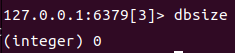

**三、清空数据库**

​		◼使用`flushdb`清空当前数据库数据

​		◼使用`flushall`清空所有数据库数据

```shell
#清空当前数据库
flushdb
#清空所有数据库
flushall
```

## RedisKey的基本命令

**一、判断key是否存在**

​		◼使用`exists`命令进行判断

​		◼返回`integer 1`时表示存在键值对

​		◼返回`integer 0`时表示不存在键值对

```shell
exists name
```

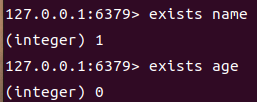

**二、转移键值对**

​		◼使用`move`命令转移一个键值对到另一个`redis`数据库

​		◼使用格式：`move key 数据库编号`

​		◼移除后会返回`integer 0`表示转移成功

```shell
#在第1个数据库中移除key为name的数据
move name 1
```

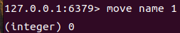

**四、查看数据库所有的key**

​		◼使用`keys`命令查看数据库内所有的key

```shell
keys *
```

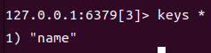

**五、设置数据的过期时间**

​		◼使用`expire`设置数据的过期时间

​		◼设置的时间默认是秒

```shell
#设置key为name的数据的过期时间为10s
expire name 10
```


**六、查看数据过期前剩余的时间**

​		◼使用`ttl`查看过期前剩余的时间

​		◼返回`integer n`表示距离过期剩余n秒

​		◼返回`integer -2`表示已经过期

```shell
ttl name
```

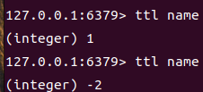

**七、存储键值对**

​		◼`EX`：设置键值对的过期时间，单位为秒

​		◼`PX`：设置键值对的过期时间，单位为毫秒

​		◼`KEEPTTL`：长期保存，系统默认

```shell
#存储键值对，过期时间为12s
set name zhang ex 10
#存储键值对，没有过期时间
set age 13 keepttl
#设键值对，默认不过期
set name zhansan
```


**八、获取键值对的值**

​		◼使用`get`命令获取值

```shell
get name
```

**九、获取键值对值的类型**

​		◼使用`type`命令获取值的类型

```shell
type name
```

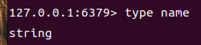

**十、删除键值对**

​		◼使用`del`命令进行删除

```shell
del name
```

# Redis五大数据类型

## String类型

**一、追加字符串**

​		◼已有给值为字符串的键值对追加字符串

​		◼使用`append`命令进行追加内容

​		◼追加成功后返回追加后字符串的长度（`integer 8`）

```shell
append name san
```

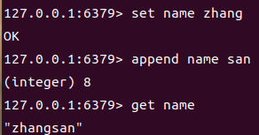

**二、获取字符串的长度**

​		◼使用`strlen`命令获取字符串长度

```shell
strlen name
```

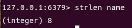

**三、自增+1**

​		◼使用`incr`实现自增+1

​		◼返回自增后的结果

```shell
incr num
```

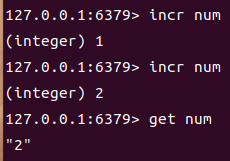

**四、自增-1**

​		◼使用`decr`实现自增-1

​		◼返回自减后的结果

```shell
decr num
```

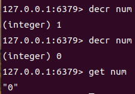

**五、增加任意数字**

​		◼使用`incrby`增加任意数字

​		◼返回增加后的结果

```shell
incrby num 10
```

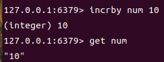

**六、减少任意数字**

​		◼使用`decrby`减少任意数字

​		◼返回减少后的结果

```shell
decrby num 9
```

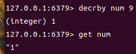

**七、截取字符串**

​		◼使用`getrange`命令截取字符串的一段（从0开始）

​		◼返回截取的结果

```shell
getrange name 0 3
```

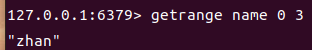

**八、替换指定位置的字符串**

​		◼使用`setrange`命令进行替换

​		◼替换的字母长度大于1时，会连续替换多个字母

​		◼返回替换后字符串的长度

```shell
setrange name 4 xxx
```

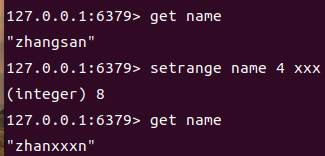

**九、设置有过期时间的键值对**

​		◼除了使用`set`外还可以使用`setex`命令

​		◼使用格式：`set key time value`

```shell
set name 10 zhangsan
```

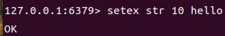

**十、键值对不存在则设置**

​		◼使用`setnx`命令，如果键值对不存在则存放该键值对，存在则不存放

​		◼用于防止之前设的值被覆盖掉

​		◼返回`0`表示键值对已存在，不能存放该键值对

​		◼返回`1`表示键值对不存在，存放该键值对

```shell
setnx db redis
```

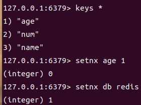

**十一、一次存放多个值**

​		◼使用`mset`方法存放多个键值对

​		◼若某个键值对已经存在则会覆盖值

```shell
mset k1 a k2 b k3 c
```

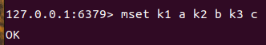

**十二、一次获取多个值**
		◼使用`mget`实现一次获取多个值

```shell
mget k1 k2 k3
```

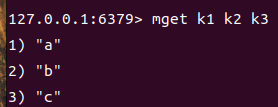

**十三、连续存放多个不存在的键值对**

​		◼使用`msetnx`存放多个不存在的键值对

​		◼如果某个键值对存在则整个操作不会成功

​		◼返回`1`表示存放成功

​		◼返回`0`表示存放失败

```shell
msetnx db1 mysql db2 mongodb db3 redis
```


**十四、取值并更换值**

​		◼使用`getset`实现取值并设置新的值

​		◼如果`key`没有值则返回`nil`并写入新的值

```shell
getset name zhang
```

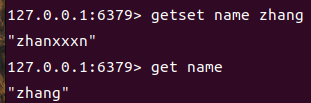

## List类型

**一、从头部插入值**

​		◼使用`lpush`可以构造列表，可以在列表的头处插入元素

​		◼类似队列

​		◼返回列表元素的个数

```shell
lpush arr hello
```

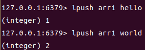

**二、从头部获取列表的值**

​		◼使用`lrange`命令获取列表的值

​		◼格式：`lrange key start end`

​		◼若`end`为`-1`，则默认为获取`start`及其之后的数据

```shell
lrange arr 0 2
```

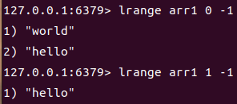

**三、从尾部追加值**

​		◼使用`rpush`从尾部插入值

​		◼返回列表元素的数量

```shell
rpush arr1 one
```

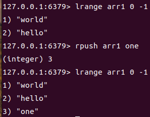

**四、从左边开始，移除列表中的多个元素**

​		◼使用`lpop`命令，移除列表中任意数量元素

​		◼从左边开始移除元素

​		◼格式：`lpop key num`

​		◼如果不添加数量默认移除左边第一个元素

​		◼返回被移除的所有元素

```shell
lpop arr1 2
lpop arr1
```

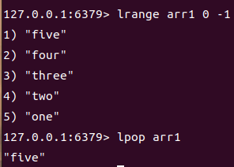

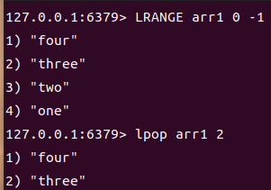

**五、从右边开始，移除列表中多个元素**

​		◼使用`rpop`命令，移除列表中任意数量元素

​		◼从右边开始移除元素

​		◼格式：`rpop key num`

​		◼如果不添加数量默认移除右边第一个元素

​		◼返回被移除的所有元素

```shell
rpop arr 
rpop arr 2
```

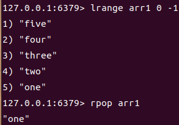

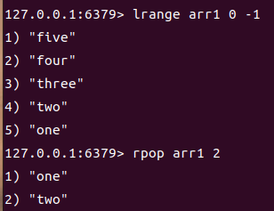

**六、获取list中一个元素**

​		◼使用`lindex`获取对应索引的元素

```shell
lindex arr 0
```

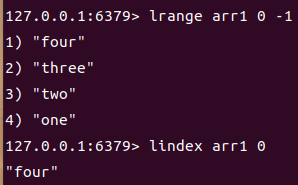

**七、获取list的长度**

​		◼使用`Llen`获取列表的长度

```shell
Llen arr
```

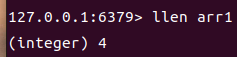

**八、根据值移除列表的元素**

​		◼使用`lrem`移除多个值为val的元素

​		◼返回移除元素的个数

​		◼格式：`lrem arr num val`

```shell
lrem arr 2 one
```

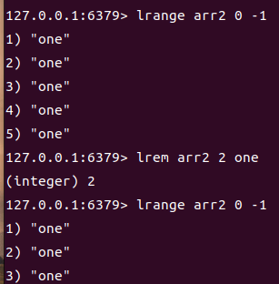

**九、修剪列表**

​		◼使用`ltrim`修剪列表

​		◼格式`trim start end`([start:end])

```shell
ltrim arr 1 2
```

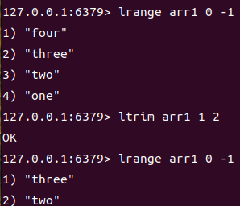

**十、移除列表的最后一个元素，将该元素插到新列表的头部**

​		◼使用`rpoplpush`移除一个列表的最后一个元素，将该元素插到新列表的头部

​		◼格式：`rpoplpush list1 list2`

```shell
rpoplpush arr1 arr2
```

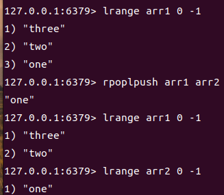

**十一、修改列表中的某个值**

​		◼使用`lset`命令修改列表某个元素的值

​		◼如果列表中对应索引不存在值则返回`error`

​		◼格式：`lset key idx val`

```shell
lset arr 1 change
```

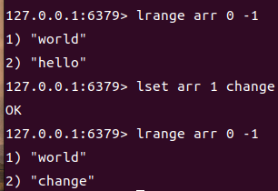

**十二、在某个元素前后插入新的值**

​		◼使用`linsert`命令在某个元素前后插入值

​		◼某元素前插格式：`linsert key before elem val`

​		◼某元素前插格式：`linsert key after elem val`

```shell
#在two前面插入hello
linsert arr before two hello
#在two后面插入world
linsert arr after two world
```

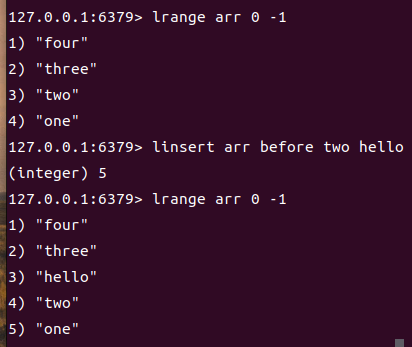

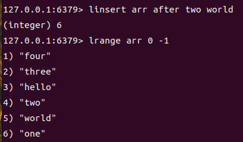

## Set类型

**一、给集合添加值**

​		◼使用`sadd`命令添加值

```shell
sadd myset hello
```

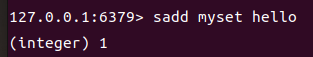

**二、判断集合是否存在某元素**

​		◼使用`sismember`判断集合是否存在某个元素

​		◼返回`0`表示不存在

​		◼返回`1`表示存在

```shell
sismember myset hello
```

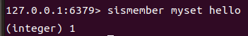

**三、获取集合的长度**

​		◼使用`scard`命令获取长度

```shell
scard myset
```

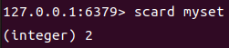

**四、移除集合中某个元素**

​		◼使用`srem`删除指定元素

​		◼返回`1`表示删除成功

​		◼返回`0`表示删除失败或不存在

```shell
srem myset hello
```

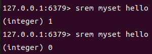

**五、随机获取多个元素**

​		◼使用`srandmember`随机获取多个元素

​		◼默认获取一个元素

​		◼格式：`srandmember key [num]`

```shell
srandmember myset
srandmember myset 2
```

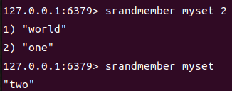

**六、获取集合所有的元素**

​		◼使用`smembers`获取集合所有元素

```shell
smembers myset
```

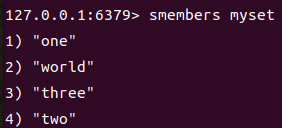

**七、随机获取并删除集合中多个值**

​		◼使用`spop`随机获取并删除多个值

​		◼默认1个值

​		◼格式：`spop key [num]`

```shell
spop myset
spop myset 2
```

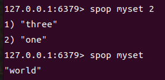

**八、移动集合元素到另一个集合**
		◼使用`smove`移动集合元素到另一个集合

​		◼格式：`smove source destination val`

​		◼返回`1`表示操作操作，返回`0`表示操作失败

```shell
smove myset newset one
```

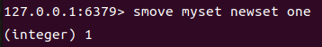

**九、求交集**

​		◼使用`sinter`求交集

```shell
sinter set1 set2
```

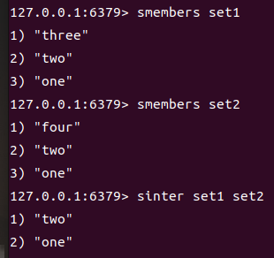

**十、求差集**

​		◼使用`sdiff`求集合的差集

```shell
sdiff set1 set2
```

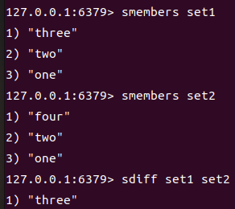

**十一、求并集**

​		◼使用`sunion`求并集

```shell
sunion set1 set2
```

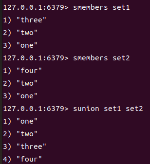

## Hash类型

**一、添加hash键值对**

​		◼使用`hset`添加`hash`键值对

​		◼格式:`hset key field val`

```shell
hset person name zhangsan00
```

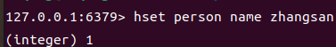

**二、添加多个hash键值对**

​		◼使用`hmset`添加多个`hash`键值对

​		◼格式:`hmset key field1 val1 field2 val2 ...`

```shell
hmset person name zhangsan age 18
```

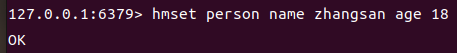

**三、获取`key`里某个键值对**

​		◼使用`hget`获取`key`里某个`hash`键值对

​		◼格式:`hget key field`

```shell
hget person name
```

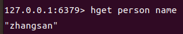

**四、获取`key`里所有的键值对**

​		◼使用`hgetall`获取`key`里所有的`hash`键值对

```shell
hgetall person
```

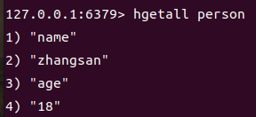

**五、删除`key`里某个键值对**
		◼使用`hdel`删除`key`里某个`hash`键值对

​		◼格式:`hdel key field`

```shell
hdel person age
```


**六、获取`hash`表的长度**

​		◼使用`hlen`获取长度

```shell
hlen person
```


**七、判断`hash`表中某键值对是否存在**

​		◼使用`hexists`判断`hash`表某键值对是否存在

​		◼格式：`hexists key field value`

​		◼返回`1`表示存在，返回`0`表示不存在

```shell
hexists person name
```


**八、获取`hash`表中所有的`key`**

​		◼使用`keys`获取`hash`表中所有的字段

```shell
hkeys person
```


**九、获取`hash`表中所有的`value`**

​		◼使用`hvals`获取`hash`表中所有的字段

```shell
hvals person
```


**十、`hash`表中`value`的加法**

​		◼使用`hincrby`进行值的加法操作

​		◼格式：`hincrby key field num`

​		◼返回加法运算后的结果

```shell
hincrby person age 1
```


**十一、如果不存在则设置键值对**

​		◼使用`hsetnx`进行判断键值对是否存在，如果不存在则设置键值对

```shell
hsetnx person hobby world
```


## Zset类型（有序集合）

**一、设置有序集合的元素**

​		◼使用`zadd`设置有序集合元素

​		◼可以连续设置多个有序集合元素

​		◼格式：`zadd key score1 val1 score2 val2`

```shell
zadd myset 1 onr 2 two 3 three
```


**二、按`score`从小到大获取范围内的元素**

​		◼使用`zrange`获取范围内的元素（按`score`从小到大排序）

​		◼格式：`zrange key start end`

​		◼当`end`为`-1`时获取`start`及`start`后面的元素

```shell
zrange myset 0 -1
zrange myset 1 2
```


**三、按`score`从大到小获取范围内的元素**

​		◼使用`zrevrange`获取范围内的元素（按`score`从大到小排序）

```shell
zrevrange myset 0 -1
```


**四、依据`score`的范围进行取值**

​		◼使用`zrangebyscore`依据`score`范围进行取值

​		◼格式：`zrangebyscore key min max [withscores]`

​		◼`-inf`可以表示最小值，`+inf`表示最大值

​		◼`withscores`可以一并输出元素及其`score`

​		◼可以用`(`表示开区间

```shell
zrangebyscore myset -inf +inf
zrangebyscore myset 1 3 withscores
```


**五、移除元素**

​		◼使用`zrem`移除元素

```shell
zrem myset zero
```


**六、获取有序集合元素个数**

​		◼使用`zcard`获取有序集合元素个数

```shell
zcard myset
```


**七、获取`score`区间里元素数量**

​		◼使用`zcount`获取`score`区间里元素数量

​		◼格式：`zcount key min max`（默认闭区间，加`(`可变成开区间）

```shell
zcount myset 2 3
```


**八、增加有序集合元素的`score`值**

​		◼使用`zincrby`增加有序集合的`score`值

​		◼使用格式：`zincrby myset num val`

​		◼返回求和后的值

```shell
zincrby myset 5 one
```


## 五大数据类型对应的使用场景

**一、String的使用场景**

​		◼计数器

​		◼对象缓存存储

**二、List的用使用场景**

​		◼消息队列

​		◼栈

**三、Set的使用场景**

​		◼去冗余元素

​		◼获取多个共同存在的元素（共同关注、共同好友）

**四、hash的使用场景**

​		◼用于存储对象的属性

**五、zset的使用场景**

​		◼带权重排序

​		◼排行榜

# Redis三大特殊数据类型

## Geospatial地理位置

**一、添加地理位置**

​		◼使用`geoadd`添加地理位置

​		◼有效经度：`-180 -> 180`

​		◼有效纬度：`-85.05112878 ->85.05112878`

​		◼格式：`geoadd key 经度 纬度 坐标名`

​		◼可以一次输入多个坐标

```shell
geoadd city 114.08 22.54 shenzhen
geoadd city 113.12 23.02 foshan 113.28 23.12 guangzhou 121.47 31.23 shanghai
```


**二、查询存储的经度和纬度**

​		◼使用`geopos`查询存储的经度和纬度

```shell
geopos city shenzhen
```


**三、获取两个坐标间的距离**

​		◼使用`geodist`获取两个坐标的距离

​		◼使用格式：`geodist key pos1 pos2 [km]`

​		◼没单位默认为`m`

```shell
geodist city shenzhen shanghai
geodist city shenzhen shanghai km
```


**四、获取某坐标一定半径内地理集合中的元素**

​		◼使用`georadius`获取某坐标一定半径内的地理集合元素

​		◼格式：`georadius key 经度 纬度 距离 单位 [withcoord] [count num]`（经度纬度一般为个人定位）

```shell
georadius city 112.97 22.92 1000 km
georadius city 112.97 22.92 1000 km withcoord	#输出地理集合元素的经纬度
georadius city 112.97 22.92 1000 km count 1		#限制输出地理集合元素的个数
```


**五、获取地理集合里某元素一定半径内的所有元素**

​		◼使用`georadiusbymember`获取地理集合里某元素一定半径内的元素

​		◼格式：`georadiusbymember key pos 距离 单位`

```shell
georadiusbymember city foshan 100 km
```


**六、获取坐标的hash编码**

​		◼使用`geohash`获取坐标11位的的`hash`值

​		◼可以一次输入多个集合元素

​		◼`hash`值越接近，则距离越近

```shell
geohash city foshan guangzhou
```


**七、删除地理集合的元素**

​		◼`geospatial`的底层是`Zset`类型，**可以使用`Zset`操作地理集合**

​		◼使用`zrem`移除元素

```shell
zrem city shanghai
```


## Hyperloglog基数统计

### 相关概念

**一、基数的概念**

​		◼不重复的元素个数

​		◼在大数据场景下，基数可以接受误差，提高运算速度

​		◼`redis`的基数误差率为`0.81%`

**二、Hyperloglog优点**

​		◼占用内存固定，`2^64`不同元素的计数只需要12KB的内存

​		◼误差率低：`0.81%`

### 相关操作

**一、构造PF集合并添加元素**

​		◼使用`pfadd`添加多个元素

​		◼格式：`pfadd key val1 val2 ...`

```shell
pfadd myset a b c d e f
```


**二、统计基数**

​		◼使用`pfcount`统计基数

​		◼可以输入多个PF集合一起统计基数

```shell
pfcount myset
```


**三、合并PF集合**

​		◼使用`pfmerge`合并PF集合

​		◼格式：`pfmerge key pfset1 pfset2 ...`

```shell
pfmerge myset1 myset2
```


## Bitmap位存储

### 相关概念

**一、Bitmap位存储**

​		◼使用`0`和`1`代表两个状态

​		◼`Bitmap`中默认值为`0`

​		◼`bit`的位置用于映射对象的序号

​		◼用于存储大量有序且状态只有两种的对象

### 相关操作

**一、设置值**

​		◼使用`setbit`设置

​		◼格式：`setbit key offset 值`（值只能设置0或1）

```shell
setbit sign 0 1
setbit sign 3 1
```


**二、获取值**

​		◼使用`getbit`取值

​		◼只能取`0`和`1`

```shell
getbit sign 0	#已设置了1
getbit sign 100	#没有设置过值，获取默认值
```


**三、统计`1`的个数**

​		◼使用`bitcount`统计`key`里`1`的个数

```shell
bitcount sign
```


## 三大特殊数据类型对应的使用场景

**一、Geospatial使用场景**

​		◼暂存人的定位

​		◼获取附近一定距离的人

​		◼获取坐标两点间的最短距离（地球非平面）

**二、Hyperloglog基数统计**

​		◼用于计数基数，允许误差的存在

​		◼统计访问的用户数量

**三、Bitmap位存储使用场景**

​		◼存储大量有序且状态只有两种的对象

​		◼签到

​		◼大量同种宝箱的开启情况且需要统计（原神）

# Redis事务

## Redis事务

**一、Redis事务相关概念**

​		◼redis单条命令保证原子性，但是事务不保证原子性

​		◼事务的本质：一组命令的集合，事务中所有的命令会被序列化，执行时按顺序执行

​		◼redis事务的特性：原子性、顺序性、排他性

​		◼redis没有隔离级别的概念，**redis事务不会直接执行，需要发起执行命令时才会执行**

**二、Redis三个阶段**

​		◼开启事务（）

​		◼命令入队（）

​		◼执行事务（）

## Redis事务相关操作

**一、开启事务**

​		◼使用`multi`开启事务

```shell
multi
```


**二、命令入队**

​		◼输入事务相关命令

```shell
set k1 v1
get k1
```


**三、执行事务**

​		◼使用`exec`按顺序执行事务里每个命令

```shell
exec
```


**四、取消事务**
		◼使用`discard`取消事务

```shell
discard
```


## Redis事务相关异常及其处理

**一、命令错误**

​		◼出现命令出错或命令的错误使用

​		◼**存在命令出现异常，事务中所有的命令都不会被执行**

```shell
//异常示例
multi		//开启事务
getset k3	//命令错误使用
set k1 v1	//设值
get k1		//取值
exec		//执行事务
```


**二、运行时异常**

​		◼事务里某个命令**有语法问题**但命令是正确使用的

​		◼**某个命令存在语法问题时，其他命令正常执行，错误命令异常抛出**（不保证原子性）

```shell
//异常示例
multi		//开启事务
set k1 v1	//设值
incr k1		//数字自增，要求值为数字否则报错
get k1		//取值
exec		//执行事务
```


# 乐观锁

## 乐观锁和悲观锁

**一、悲观锁**

​		◼请求大概率会修改数据，执行任何事务都会加锁

​		◼执行效率慢，网络请求大部分都是读取数据

**二、乐观锁**

​		◼请求大概率不会修改值，执行任何事务都不会加锁

​		◼**加乐观锁时会暂存值的版本`verson`，执行事务时会比较值的版本和保存`verson`是否一致**

​		◼**如果比较时版本不一致，则事务不会执行**

​		◼乐观锁只作用于接下来的`1`个事务，无论是否执行成功处理完后自动解开乐观锁


## 乐观锁相关操作

**一、加乐观锁**

​		◼使用`watch`给键值对添加乐观锁

​		◼格式：`watch key`

```shell
watch money
```

**二、取消乐观锁**

​		◼使用`unwatch`取消乐观锁

​		◼格式：`unwatch key`

```shell
#因为执行1个事务自动解锁，所以很少用
unwatch money
```

## 乐观锁相关体验

**一、乐观锁生效，取消事务的执行**

```thread_one
set money 100			//设置money值为100
watch money				//对money加乐观锁，保存verson（假设为1）
multi					//定义事务
incrby money 10			//money值加10
#需要执行完线程2后继续	 //执行线程2
exec					//执行事务，比较money的版本
#结果
nil						//由于money的版本为2与乐观锁保存的1不同，所以事务不执行
//事务处理完自动解开乐观锁
```

```thread_two
decrby money 10			//money值减10，值的verson改变（假设为2）
```

**二、乐观锁生效，允许事务执行**

```thread_one
set money 100			//设置money值为100
watch money				//对money加乐观锁，保存verson（假设为1）
multi					//定义事务
incrby money 10			//money值加10
#需要执行完线程2后继续	 //执行线程2
exec					//执行事务，比较money的版本
//结果：版本没变允许执行事务
money 110
//事务处理完自动解开乐观锁
```

```thread_two
get money				//取值没有进行修改，版本不变
```

# GoLang连接redis与操作

## 连接准备

**一、导入redis包**

```shell
go get -u github.com/go-redis/redis
```

**二、声明数据库全局**

```go
var redisDB *redis.Client
```

## GoLang连接redis

**一、连接redis**

​		◼声明全局变量方便各个函数使用`redis`

​		◼使用`redis.NewClient()`获取`redis`连接

​		◼需要输入`redis.Option{}`结构体的指针，内容为`redis`相关参数

​		◼记得在`main`函数里使用`defer`释放连接

```go
var redis *redis.Client						//声明全局变量
func initRedis(){
    redisDB=redis.NewClient(&redis.Option{	//获取redis连接
        Addr:	"127.0.0.1:6379",			//IP地址和端口
        Password:"",						//密码
        DB:		0})							//选择数据库，redis默认有16个缓存库
}
```

**二、检测是否连接成功**

​		◼使用`Ping()`方法进行检测返回`StatusCmd`，使用`result()`方法进行解析

```go
var redis *redis.Client						//声明全局变量
func initRedis()(err error){				//构造初始化连接方法，返回错误
    var str string
    
    redisDB=redis.NewClient(&redis.Option{	//获取redis连接
        Addr:	"127.0.0.1:6379",			//IP地址和端口
        Password:"",						//密码
        DB:		0})							//选择数据库，redis默认有16个缓存库

    str,err=redis.Ping().Result()			//解析StatusCmd
    fmt.Println(str)						//打印PONG表示连接成功
    return									//返回
}
```

## 使用String数据类型的相关操作

**一、设置有时间限制的值(`Set`)**

```go
err = redisDB.Set("myval", "2", time.Millisecond*2).Err()
if err != nil {
	fmt.Println(err)
	return
}
```

**二、设置永久的键值对(Set)**

```shell
err = redisDB.Set("myval", "1", 0).Err()
if err != nil {
	fmt.Println(err)
	return
}
```

**三、获取值(Get)**

```go
val, err = redisDB.Get("myval").Int()
if err != nil {
	fmt.Println(err)
	return
}
fmt.Println(val)
```

**四、追加字符串(Append)**

```go
err = redisDB.Append("myval", "1").Err()
if err != nil {
	fmt.Println(err)
	return
}
```

**五、获取字符串长度(Strlen)**

```go
val = redisDB.StrLen("myval").Val()
if err != nil {
	fmt.Println(err)
	return
}
fmt.Println("len:", val)
```

**六、自增+1(Incr)**

```go
err = redisDB.Incr("myval").Err()
if err != nil {
	fmt.Println(err)
	return
}
```

**七、自减-1(Decr)**

```go
err = redisDB.Decr("myval").Err()
if err != nil {
	fmt.Println(err)
	return
}
```

**八、增加任意数字(Incrby)**

```go
err = redisDB.IncrBy("myval", 10).Err()
if err != nil {
	fmt.Println(err)
	return
}
```

**九、截取字符串(GetRange)**

```go
val, err = redisDB.GetRange("myval", 0, -1).Bytes()
if err != nil {
	fmt.Println(err)
	return
}
fmt.Println(val)
```

**十、替换指定位置字符串(SetRange)**

```go
err = redisDB.SetRange("myval", 0, "1").Err()
if err != nil {
	fmt.Println(err)
	return
}
```

**十一、不存在则设置(SetNX)**

```go
err = redisDB.SetNX("myval", "1", time.Second).Err()
if err != nil {
	fmt.Println(err)
	return
}
```

**十二、一次存多个值(Mset)**

```go
err = redisDB.MSet([]string{"one", "1", "two", "2"}).Err()
if err != nil {
	fmt.Println(err)
	return
}
```

**十三、一次取多个值(MGet)**

```go
vals := redisDB.MGet([]string{"one", "two"}...).Val()
for _, v := range vals {
	fmt.Println(v.(string))
}
```

**十四、一次存多个不存在的值(MSetNX)**

```go
err = redisDB.MSetNX([]string{"one", "1", "two", "2"}).Err()
if err != nil {
	fmt.Println(err)
	return
}
```

**十五、取值并换值(GetSet)**

```go
val, err = redisDB.GetSet("myval", "10").Int()
if err != nil {
	fmt.Println(err)
	return
}
fmt.Println(val)
```

## 使用List数据类型的相关操作

**一、头部插入多个值(LPush)**

```go
err = redisDB.LPush("arr", []string{"one", "two", "three"}).Err()
if err != nil {
	fmt.Println(err)
	return
}
```

**二、头部取值(LRange)**

```go
val, err = redisDB.LRange("arr", 0, -1).Result()
if err != nil {
	fmt.Println(err)
	return
}
for _, v := range val.([]string) {
	fmt.Println(v)
}
```

**三、尾部加值(RPush)**

```go
err = redisDB.RPush("arr", []string{"hello", "world"}).Err()
if err != nil {
	fmt.Println(err)
	return
}
```

**四、从左边开始获取并移除1个元素(LPop)**

```go
val, err = redisDB.LPop("arr").Result()
if err != nil {
	fmt.Println(err)
	return
}
fmt.Println(val)
```

**五、右边开始移除多个元素(RPop)**

```go
val, err = redisDB.RPop("arr").Result()
if err != nil {
	fmt.Println(err)
	return
}
fmt.Println(val)
```

**六、根据索引获取list的一个元素(LIndex)**

```go
val, err = redisDB.LIndex("arr", 1).Result()
if err != nil {
	fmt.Println(err)
	return
}
fmt.Println(val)
```

**七、获取list的长度(LLen)**

```go
val, err = redisDB.LLen("arr").Result()
if err != nil {
	fmt.Println(err)
	return
}
fmt.Println(val)
```

**八、根据值移除列表元素(LRem)**

```go
err = redisDB.LRem("arr", 2, "three").Err()
if err != nil {
	fmt.Println(err)
	return
}
```

**九、修减列表(LTrim)**

```go
err = redisDB.LTrim("arr", 1, 16).Err()
if err != nil {
	fmt.Println(err)
	return
}
```

**十、移除一个列表的最后一个元素，将元素插到新列表的头部(RPopLPush)**

```go
val, err = redisDB.RPopLPush("arr", "new").Result()
if err != nil {
	fmt.Println(err)
	return
}
fmt.Println(val)
```

**十一、修改列表某个值(LSet)**

```go
err = redisDB.LSet("arr", 3, "world").Err()
if err != nil {
	fmt.Println(err)
	return
}
```

**十二、在某个元素前插入新值(Linsert)**

```go
err = redisDB.LInsert("arr", "before", "world", "hello").Err()
if err != nil {
	fmt.Println(err)
	return
}
```

## 使用Set数据类型的相关操作

**一、给集合添加值(SAdd)**

```go
err = redisDB.SAdd("myset", []string{"one", "two", "three", "four", "five", "six", "seven"}).Err()
if err != nil {
	fmt.Println(err)
	return
}
```

**二、检测集合是否存在某元素(SIsMember)**

```go
val, err = redisDB.SIsMember("myset", "two").Result()
if err != nil {
	fmt.Println(err)
	return
}
fmt.Println(val)
```

**三、获取集合的长度(SCard)**

```go
val = redisDB.SCard("myset").Val()
if err != nil {
	fmt.Println(err)
	return
}
```

**四、移除集合中某个元素(SRem)**

```go
val, err = redisDB.SRem("myset", "three").Result()
if err != nil {
	fmt.Println(err)
	return
}
fmt.Println(val)
```

**五、随机获取1个元素或多个元素(SRandMember)**

```go
val = redisDB.SRandMember("myset").Val()
//_, _ = redisDB.SRandMemberN("myset", 2).Result()
fmt.Println(val)
```

**六、获取集合所有元素(SMembers)**

```go
val, err = redisDB.SMembers("myset").Result()
if err != nil {
	fmt.Println(err)
	return
}
for _, v := range val.([]string) {
	fmt.Println(v)
}
```

**七、随机获取并删除集合多个值(SPop)**

```go
val, err = redisDB.SPop("myset").Result()
//redisDB.SPopN("myset",2).Result()
if err != nil {
	fmt.Println(err)
	return
}
fmt.Println(val)
```

**八、移动集合元素岛另一个集合(SMove)**

```go
val, err = redisDB.SMove("myset", "other", "six").Result()
if err != nil {
	fmt.Println(err)
	return
}
fmt.Println(val)
```

**九、求交集(SInter)**

```go
val, err = redisDB.SInter("myset", "other").Result()
if err != nil {
	fmt.Println(err)
	return
}
fmt.Println(val)
```

**十、求差集(SDiff)**

```go
val, err = redisDB.SDiff("myset", "other").Result()
if err != nil {
	fmt.Println(err)
	return
}
fmt.Println(val)
```

**十一、求并集(SUnion)**

```go
val, err = redisDB.SUnion("myset", "other").Result()
if err != nil {
	fmt.Println(err)
	return
}
fmt.Println(val)
```

## 使用Hash数据类型的相关操作

**一、添加1个键值对(HSet)**

```go
val, err = redisDB.HSet("myhash", "one", 1).Result()
if err != nil {
	fmt.Println(err)
	return
}
fmt.Println(val)
```

**二、添加多个键值对(HMSet)**

```go
m := make(map[string]interface{})
m["two"] = 2
m["three"] = 3
m["four"] = 4
m["five"] = 5
val, err = redisDB.HMSet("myhash", m).Result()
if err != nil {
	fmt.Println(err)
	return
}
fmt.Println(val)
```

**三、获取key里某个键值对(HGet)**

```go
val, err = redisDB.HGet("myhash", "one").Result()
if err != nil {
	fmt.Println(err)
	return
}
fmt.Println(val)
```

**四、获取key里所有键值对(HGetAll)**

```go
val, err = redisDB.HGetAll("myhash").Result()
if err != nil {
	fmt.Println(err)
	return
}
for key, v := range val.(map[string]string) {
	fmt.Println(key, "->", v)
}
```

**五、删除key里某个键值对(HDel)**

```go
err = redisDB.HDel(",myhash", "five").Err()
if err != nil {
	fmt.Println(err)
	return
}
```

**六、获取hash表长度(HLen)**

```go
val, err = redisDB.HLen("myhash").Result()
if err != nil {
	fmt.Println(err)
	return
}
fmt.Println(val)
```

**七、判断hash表是否存在某个键值对(HExists)**

```go
val, err = redisDB.HExists("myhash", "two").Result()
if err != nil {
	fmt.Println(err)
	return
}
fmt.Println(val)
```

**八、获取hash表中所有key(HKeys)**

```go
val, err = redisDB.HKeys("myhash").Result()
if err != nil {
	fmt.Println(err)
	return
}
for _, v := range val.([]string) {
	fmt.Println(v)
}
```

**九、获取hash表中所有value(HVals)**

```go
val, err = redisDB.HVals("myhash").Result()
if err != nil {
	fmt.Println(err)
	return
}
for _, v := range val.([]string) {
	fmt.Println(v)
}
```

**十、如果key中不存在这键值对则设置键值对(HSetNX)**

```go
val, err = redisDB.HSetNX("myhash", "hello", "world").Result()
if err != nil {
	fmt.Println("key不存在", err)
} else {
	fmt.Println(val)
}
```

**十一、hash表中值的增加，有用于浮点数的方法，返回增加后的值(HIncrBy)**

```go
val, err = redisDB.HIncrBy("myhash", "one", 1).Result()
if err != nil {
	fmt.Println(err)
	return
}
fmt.Println(val)
```

## 使用Zset数据类型的相关操作

**一、设置有序集合元素(ZAdd)**

```go
temp := make([]redis.Z, 0, 5)
temp = append(temp, redis.Z{Member: "one", Score: 1})
temp = append(temp, redis.Z{Member: "two", Score: 2})
temp = append(temp, redis.Z{Member: "three", Score: 3})
temp = append(temp, redis.Z{Member: "four", Score: 4})
temp = append(temp, redis.Z{Member: "five", Score: 5})
err = redisDB.ZAdd("myset", temp...).Err()
if err != nil {
	fmt.Println(err)
	return
}
```

**二、按score从小到大获取范围内的元素(ZRange)**

```go
val, err = redisDB.ZRange("myset", 0, -1).Result()
if err != nil {
	fmt.Println(err)
	return
}
for _, v := range val.([]string) {
	fmt.Println(v)
}
```

**三、按score从大到小获取范围内的元素(ZRevRange)**

```go
val, err = redisDB.ZRevRange("myset", 0, -1).Result()
if err != nil {
	fmt.Println(err)
	return
}
for _, v := range val.([]string) {
	fmt.Println(v)
}
```

**四、根据score的范围取值(ZRangeByScore)**

```go
val, err = redisDB.ZRangeByScore("myset", redis.ZRangeBy{Min: "2", Max: "4"}).Result()
if err != nil {
	fmt.Println(err)
	return
}
for _, v := range val.([]string) {
	fmt.Println(v)
}
```

**五、移除元素(ZRem)**

```go
err = redisDB.ZRem("myset", []string{"one", "two"}).Err()
if err != nil {
	fmt.Println(err)
	return
}
```

**六、获取有序集合岛元素个数(ZCard)**

```go
val, err = redisDB.ZCard("myset").Result()
if err != nil {
	fmt.Println(err)
	return
}
fmt.Println(val)
```

**七、获取score间里元素个数(ZCount)**

```go
val, err = redisDB.ZCount("myset", "0", "5").Result()
if err != nil {
	fmt.Println(err)
	return
}
fmt.Println(val)
```

**八、增加有序集合score值(ZIncrBy)**

```go
val, err = redisDB.ZIncrBy("myset", 2, "five").Result()
if err != nil {
	fmt.Println(err)
	return
}
fmt.Println(val)
```

## 使用Geospatial数据类型的相关操作

**一、添加地理位置(GeoAdd)**

```go
temp := make([]*redis.GeoLocation, 0, 4)
temp = append(temp, &redis.GeoLocation{Longitude: 114.08, Latitude: 22.54, Name: "shenzhen"})
temp = append(temp, &redis.GeoLocation{Longitude: 113.12, Latitude: 23.02, Name: "foshan"})
temp = append(temp, &redis.GeoLocation{Longitude: 113.28, Latitude: 23.12, Name: "guangzhou"})
temp = append(temp, &redis.GeoLocation{Longitude: 121.47, Latitude: 31.23, Name: "shanghai"})
err = redisDB.GeoAdd("city", temp...).Err()
if err != nil {
	fmt.Println(err)
	return
}
```

**二、查询存储的经度和纬度(GeoPos)**

```go
val, err = redisDB.GeoPos("city", []string{"foshan", "shenzhen"}...).Result()
if err != nil {
	fmt.Println(err)
	return
}
for _, v := range val.([]*redis.GeoPos) {
	fmt.Println(v)
}
```

**三、获取两个坐标间岛距离(GeoDist)**

```go
val, err = redisDB.GeoDist("city", "foshan", "shanghai", "km").Result()
if err != nil {
	fmt.Println(err)
	return
}
fmt.Println(val)
```

**四、获取某坐标一定半径内地理集合中的元素(GeoRadius)**

```go
val, err = redisDB.GeoRadius("city", 112.97, 22.92, &redis.GeoRadiusQuery{Radius: 1000, Unit: "km"}).Result()
if err != nil {
	fmt.Println(err)
	return
}
for _, v := range val.([]redis.GeoLocation) {
	fmt.Println(v)
}
```

**五、获取地理集合里某元素一定半径内的所有元素(GeoRadiusByMember)**

```go
val, err = redisDB.GeoRadiusByMember("city", "foshan", &redis.GeoRadiusQuery{Radius: 100, Unit: "km"}).Result()
if err != nil {
	fmt.Println(err)
	return
}
for _, v := range val.([]redis.GeoLocation) {
	fmt.Println(v)
}
```

**六、获取坐标的hash编码(GeoHash)**

```go
val, err = redisDB.GeoHash("city", []string{"foshan", "shenzhen"}...).Result()
if err != nil {
	fmt.Println(err)
	return
}
for _, v := range val.([]string) {
	fmt.Println(v)
}
```

**七、删除地理元素(ZRem)**

```go
err = redisDB.ZRem("city", []string{"foshan", "shenzhen"}).Err()
if err != nil {
	fmt.Println(err)
	return
}
```

## 使用Hyperloglog数据类型的相关操作

**一、构造PF集合并添加多个元素(PFAdd)**

```go
err = redisDB.PFAdd("myset", []string{"one", "two", "three", "four"}).Err()
if err != nil {
	fmt.Println(err)
	return
}
```

**二、统计基数(PFCount)**

```go
val, err = redisDB.PFCount("myset").Result()
if err != nil {
	fmt.Println(err)
	return
}
fmt.Println(val)
```

**三、合并PF集合(PFMerge)**

```go
val, err = redisDB.PFMerge("myset", "other").Result()
if err != nil {
	fmt.Println(err)
	return
}
fmt.Println(val)
```

## 使用Bitmap数据类型的相关操作

**一、设置值(SetBit)**

```go
err = redisDB.SetBit("sign", 2, 1).Err()
err = redisDB.SetBit("sign", 1, 1).Err()
err = redisDB.SetBit("sign", 10, 1).Err()
if err != nil {
	fmt.Println(err)
	return
}
```

**二、获取值(GetBit)**

```go
val, err = redisDB.GetBit("sign", 2).Result()
if err != nil {
	fmt.Println(err)
	return
}
```

**三、统计1的个数(BitCount)**

```go
val, err = redisDB.BitCount("sign", &redis.BitCount{}).Result() //BitCount可以为空
if err != nil {
	fmt.Println(err)
	return
}
fmt.Println(val)
```

## 其他常用操作

**一、判断key是否存在(Exists)**

```go
val, err = redisDB.Exists("myval").Result()
if err != nil {
	fmt.Println(err)
	return
}
fmt.Println(val)
```

**二、转移key到其他redis数据库(Move)**

```go
val, err = redisDB.Move("myval", 1).Result()
if err != nil {
	fmt.Println(err)
	return
}
fmt.Println(val)
```

**三、设置key的过期时间(Expire)**

```go
val, err = redisDB.Expire("arr", time.Second*10).Result()
if err != nil {
	fmt.Println(err)
	return
}
fmt.Println(val)
```

**四、查看数据距离过期剩余的时间(TTL)**

```go
val, err = redisDB.TTL("arr").Result()
if err != nil {
	fmt.Println(err)
	return
}
fmt.Println(val)
```

## GoLang管道、事务和乐观锁的实现

### 管道(`Pipeline`)

**一、管道的作用**

* 用于批量处理`redis`命令
* 没使用管道时，执行n个命令需要消耗`n`次`RTT`（往返时间）
* 使用管道后，执行n个命令只需消耗`1`次·`RTT`
* 需要使用`Exec`方法发送批量的命令
* `Pipeline`虽然使用时类似事务，但其本质是打包一堆命令到`redis`处理并返回结果，没有用到`multi`
* `Pipeline`中的**命令如果存在语法错误，不会影响其他命令的执行**，因此`Pipeline`不是事务


**二、管道的实现**

* 使用`Pipeline()`方法获取管道对象
* 管道使用完后需要释放管道
* 批量输入命令，并初始化变量接收`Cmd`内容
* 需要使用`Exec()`方法发送打包好的命令

```go
func pipeFunc() {
	pipe := redisDB.Pipeline()				//获取管道对象
	defer pipe.Close()						//使用完关闭管道

	val1 := pipe.Set("test", "test", 0)		//批量输入并初始化变量接收Cmd内容
	val2 := pipe.Incr("test")				//错误命令，用于理解区分是否有tx（事务）
			 								//命令错误时事务锁不会执行的，但非事务会继续执行
	pipe.Exec()								//发送命令

	if val1.Err() != nil {					//判断是否有error
		fmt.Println(val1.Err())
	}
	fmt.Println(val1.Val())					//取值

	if val2.Err() != nil {					//判断是否有error
		fmt.Println(val2.Err())
	}
	fmt.Println(val2.String())				//取值
}
```

### 事务(Tx)

**一、事务的作用**

* 批量输入命令，并打包发送到`redis`处理并返回结果（与`Pipeline`类似）
* **会检测输入的命令语法是否有错**，如果有错会取消事务的执行（与`Pipeline`的区别）
* **如果命令运行过程中发生错误，事务的其他命令不会停下**
* 使用`TxPipeline()`或`TxPipelined()`实现事务
* 可以使用`Discard()`取消事务

**二、`TxPipeline()`实现事务**

* 使用`TxPipeline()`获取事务对象
* 函数结束时需要关闭事务对象
* 批量构建命令，并初始化变量接收返回的`Cmd`内容
* 使用`Exec()`发送并执行事务
* 发送命令后检测是否有错误，没有错误则取值

```go
func workFuncOne() {
	var err error
	//开启事务
	worker := redisDB.TxPipeline()		//获取事务对象
	defer worker.Close()				//函数结束后关闭
	//构建命令并初始化变量用于接收传回的cmd内容
	val1 := worker.MSet([]string{"one", "1", "two", "2", "three", "3", "four", "4"})
	val2 := worker.Incr("one")
	val3 := worker.MGet([]string{"one", "two", "three", "four"}...)
	//执行事务
	_, _ = worker.Exec() 				//没有exec事务不会执行

	//判断是否有错，没有则输出值
	if val1.Err() != nil {				//判断是否有错
		fmt.Println(val1.Err())
	} else {
		fmt.Println(val1.Val())			//没错则取值
	}
	if val2.Err() != nil {
		fmt.Println(val2.Err())
	} else {
		fmt.Println(val2.Val())
	}
	if val3.Err() != nil {
		fmt.Println(val3.Err())
	} else {
		fmt.Println(val3.Val())
	}
}
```

**三、`TxPipelined()`实现事务**

* 需要使用闭包构造函数，在闭包环境初始化变量接收`Cmd`的内容
* 构造一个类型为`func(piper redis.Pipeliner)error{}`的函数
* 在构造的函数里构建命令并在最后返回`nil`
* 将构造的函数放入`TxPipeline()`里

```go
func workFuncTwo() {
	var val1 *redis.StatusCmd				//初始化接收cmd内容的变量
	var val2 *redis.IntCmd
	var val3 *redis.SliceCmd
	//使用闭包构造函数并构建命令
	fn := func(piper redis.Pipeliner) error {
		val1 = piper.MSet([]string{"one", "1", "two", "2", "three", "3"})
		val2 = piper.Incr("one")
		val3 = piper.MGet([]string{"one", "two", "three"}...)
		return nil
	}
	//执行事务
	_, _ = redisDB.TxPipelined(fn)			//放入函数，执行事务
	//判断是否有错，没有则输出值
	if val1.Err() != nil {
		fmt.Println(val1.Err())
	} else {
		fmt.Println(val1.Val())
	}
	if val2.Err() != nil {
		fmt.Println(val2.Err())
	} else {
		fmt.Println(val2.Val())
	}
	if val3.Err() != nil {
		fmt.Println(val3.Err())
	} else {
		fmt.Println(val3.Val())
	}
}
```

### 乐观锁(Watch)

**一、乐观锁的作用**

* 开启乐观锁时暂存键值对的`verson`
* 执行事务时比对`verson`是否改变，没有改变则执行事务，改变了则不执行
* 常用于处理经常读取不常修改的数据，提高了访问的效率

* 使用`Watch()`加乐观锁并执行事务
* 事务处理完后事务取消后，乐观锁自动解开

**二、使用`Watch()`实现乐观锁**

* 使用嵌套闭包构造`txf`函数
* 在`txf`的闭包环境初始化变量，用于接收`Cmd`的内容
* 构建`txf`函数时，需要先检测暂存的值是否存在
* 在`txf`函数内嵌套闭包构造`fn`函数，`fn`函数能够使用`txf`函数闭包环境的变量
* 使用`TxPipelined()`构建事务
* 使用`Watch()`加乐观锁并执行`txf`函数里的事务

```go
//乐观锁
func watchOP() {
	var val *redis.IntCmd
	var err error
	//使用闭包构建txf函数
	txf := func(tx *redis.Tx) (err error) {
		err = tx.Get("two").Err()
		if err != nil && err != redis.Nil {
			return err
		}

		//time.Sleep(time.Second * 6) //在命令行6秒内修改值用于测试乐观锁是否生效

		//使用闭包构建fn函数，val为txf函数所在环境的值（闭包的闭包）
		fn := func(piper redis.Pipeliner) error {
			val = piper.Incr("two")
			return nil
		}
		//构建事务
		_, err = tx.TxPipelined(fn)
		return
	}
	//使用乐观锁并执行事务
	err = redisDB.Watch(txf, "two")
	if err != nil {
		fmt.Println(err)
		return
	}
    //判断是否有错，没有则输出值
	if val.Err() != nil {			
		fmt.Println(val.Err())
		return
	} else {
		fmt.Println(val.Val())
	}
}
```

# Redis配置文件

* `redis`对大小写不敏感

## Redis通用设置

**一、单位**

```
# 1k => 1000 bytes
# 1kb => 1024 bytes
# 1m => 1000000 bytes
# 1mb => 1024*1024 bytes
# 1g => 1000000000 bytes
# 1gb => 1024*1024*1024 bytes
```

**二、IP绑定**

* 绑定127.0.0.1时只能在本地访问
* 可以本地公网IP或私网IP

```
bind 127.0.0.1
```

**三、端口**

* 修改端口
* 企业部署时要改端口，降低被挖矿病毒攻击的风险

```
port 6379 #默认6379端口
```

**四、保护模式**

* 保护本地`redis`不被外部远程访问
* 需要远程访问时要关掉

```
portected-mode yes
portected-mode no
```

**五、开启守护进程**

* 开启后`redis`在后台持续运行
* `docker`启动时改为`no`

```
daemonize yes
```

**六、指定进程文件**

* 后台方式运行时需要指定一个`pid`文件

```
pidfile 路径/redis.pid
```

**七、日志**

* `debug`：用于开发与测试阶段
* `verbose`：记录较多的日志信息，和`debug`很像
* `notice`：用于生产环境，记录重要的日志信息，默认
* `warning`：记录重要和关键的日志信息

```
loglevel notice		   #选择日志模式
logfile "文件路径"		#用于保存日志的文件日志
```

**八、数据库的数量**

* 默认数据库有16个

```
databases 16
```

**九、设置是否显示redis的logo**

* 默认为一直显示logo
* 没什么用

```
always-show-logo no
```

## Redis安全设置

**一、设置`redis`密码**

* 暴露在网络上时需要设置密码
* 进入`redis`后可以使用`config get requirepass`获取`redis`密码
* 命令行临时设置密码：`config set requirepass 密码`（没有写到`config`文件会导致重启后失效）
* 命令行使用`auth 密码`登录

```
#配置文件设置密码
requirepass 123456
```

```shell
#命令设置密码
config set requirepass 123456
```

**二、限制客户端访问数**

```
#设置能连接上redis的最大客户端数
maxclients 10000
```

## Redis内存设置

**一、内存限制**

```
限制redis最大内存容量
maxmemory 1024  #单位默认为字节
```

**二、设置内存到达上限后的处理策略**

* volatile-lru：删掉有过期时间的`key`（默认）
* allkeys-lru：删除所有`key`
* volatile-random：随机删除有过期时间的`key`
* allkeys-random：时间删除所有key
* volatile-ttl：删除即将过期的key
* noeviction：不删除，返回报错

```
maxmemory-policy vloatile-lru
```

## RDB持久化设置

**一、持久化策略**

* 设置持久化策略
* 在规定的时间内执行了多少次操作则会持久化到`.rdb`或`.aof`文件
* `redis`是内存数据库，需要持久化
* 格式：`save 间隔时间 执行操作次数`

```
#900秒内执行过一次操作则进行持久化
save 900 1
#300秒内执行过10次操作则进行持久化
save 300 10
#60秒内执行过10000次操作则进行持久化
save 60 10000
```

**二、持久化出错后的策略**

* 持久化出错后默认继续工作

```
stop-writes-on-bgsave-error yes
```

**三、压缩rdb文件**

* 压缩rdb文件

```
rdbcompression yes
```

**四、校验rdb文件**

* 校验rdb文件是否出错

```
rdbchecksum yes
```

**五、设置rdb文件保存的目录**

```
dir ./
```

## AOF持久化设置

**一、开启AOF持久化**

* 默认不开启aof持久化模式，默认使用rdb持久化模式

```
appendonly yes
```

**二、设置持久化文件名字**

```
appendfilename "文件.aof"
```

**三、AOF同步策略**

* `always`：每次修改都同步，性能消耗大
* `eversec`：每秒同步一次，如果宕机都丢失1秒的数据
* `no`：不同步

```
appendfsync everysec
```

# Redis持久化

## RDB持久化

**一、RDB相关概念**

* `Redis DataBase`简称为`RDB`

* 在指定的时间间隔内将内存中的数据集快照写入磁盘
* 恢复数据时将快照文件直接读入内存
* `RDB`持久化默认产生的文件为`dump.rdb`
* RDB方式比AOF更高效，但如果突然宕机时，最后一次持久化的数据可能丢失

**二、RDB执行过程**

**1、**开启`RDB`持久化时`Redis`调用`fork()`还是创建子进程

**2、**子进程与父进程共享相同的内存空间

**3、**`Redis`通过子进程遍历内存空间获取存储的数据并保存到临时文件

**4、**触发`RDB`持久化保存机制后，临时文件将覆盖并保存在`dump.rdb`中


**三、RDB相关配置**

**1、**修改默认的rdb文件名

```
dbfilename mydata.rdb
```

**2、**RDB持久化策略

```
#60秒内修改了2次则执行一次RDB保存
save 60 2
```

**四、触发RDB机制的情况**

* 满足`save`规则情况下，自动触发RDB保存机制
* 执行`flushall`命令时，自动触发RDB保存机制
* 退出`redis`时，自动触发RDB保存机制

**五、恢复RDB文件存储的数据**

* `docker`里默认`rdb`数据存放在`/data`里，启动`redis`时会自动搜索并装载数据
* 可以在配置文件设置`rdb`文件存放位置，启动redis时会自动扫描该目录

```redis.conf
dir /data
```

```shell
#获取rdb文件存放所在的目录
config get dir
```

**六、RDB持久化机制的优点**

* 适合大规模的数据恢复
* 执行效率高，能够灵活应对不同时间段的修改情况

**七、RDB持久化机制的缺点**

* 需要在一定时间间隔进行操作，如果redis宕机了最后一次持久化的数据可能会丢失
* fork进程会占用一定的内存空间

## AOF持久化

**一、AOF相关概念**

* `append only file`简写为`aof`
* 以日志的形式记录每个写操作（读操作不记录），只追加文件但不改写文件
* `AOF`和`RDB`同时开启时，默认优先读取`AOF`数据（如果RDB文件有数据默认是不会读入内存）

**二、AOF持久化流程**

**1、**客户端的请求写命令被`append`追加到`AOF`缓冲区内

**2、**`AOF`缓冲区依据`AOF`持久化策略将操作同步到`AOF`文件中

**3、**`AOF`文件大小超过重写策略时，会对`AOF`文件进行重写，压缩`AOF`文件内容


**三、AOF启动相关配置**

**1、**开启AOF持久化

```
appendonly yes
```

**2、**修改生成的文件名（docker里不建议使用）

```
appendfilename "appendonly.aof"
```

**3、**AOF持久化策略

```
appendfsync always		#每次修改都同步，性能消耗大
appendfsync eversec		#每秒同步一次，如果宕机都丢失1秒的数据(默认)
appendfsync	no			#不同步
```

**四、AOF重写压缩(Rewrite)**

**1、**AOF重写修改概念

* 将多个繁琐命令压缩到用一条命令处理（只关注结果，不关注过程）
* 压缩示例

```
#繁琐命令
set k1 v1
set k2 v2
#压缩后的命令
set k1 v1 k2 v2
```

**2、**AOF重写相关配置

* `no-appendfsync-on-rewrite yes`：启动aof重写
* `auto-aof-rewrite-min-size`：设置触发重写`aof`文件机制最小的文件大小值（重写基准值）

* `auto-aof-rewrite-percentage`：超过`重写基准值`后每增加`重写基准值`的百分之几的文件大小就执行重写

```conf
#开启重写
no-appendfsync-on-rewrite yes
#重写基准值设为64mb
auto-aof-rewrite-min-size 64mb
#文件大小超过重写基准值后，文件大小每增加64mb*100%就会执行一次重写
auto-aof-rewrite-percentage 100
```

**五、AOF重写流程**

* 主进程`fork`出一条子进程执行重写操作，保证主进程不会阻塞
* 子进程读取内存中的数据暂存到临时文件，外部请求写入到`aof`备份区和新命令缓冲区保证数据的完整性
* 子进程重写完`AOF`文件后向主进程发送信号，主进程将重写缓冲区的数据写入新的`AOF`文件里
* 新的`AOF`文件覆盖旧的`AOF`文件后完成重写


**六、AOF文件异常处理**

* AOF文件损坏时，redis不能启动
* 使用命令`redis-check-aof --fix 文件.aof`恢复aof文件

* aof文件的恢复方式：把异常数据删掉
* 数据恢复后需要重启重新装载数据

​	**1、**主机的处理方式

```shell
redis-check-aof --fix appendonly.aof
```

​	**2、**docker里redis容器的处理方式

```conf
#修改配置文件，需要关闭aof持久化，否则容器不能启动
appendonly no
```

```shell
#开启rdis容器
docker start redisdemo
#进入容器内部
docker exec -it redisdemo redis-check-aof --fix /data/appendonly.aof
```

```conf
#修改配置文件，开启aof持久化
appendonly yes
```

**七、AOF持久化优点**

* 使用`appendsync always`同步策略，每一次修改都同步，保存的数据完整性高

* 使用`appendsync everysec`同步策略，每秒同步一次可能会丢失`1`秒的数据

**八、AOF持久化缺点**

* `aof`文件远大于`rdb`文件，数据恢复速度比`RDB`持久化慢
* `AOF`运行效率比`RDB`慢

## docker环境下RDB持久化配置文件参考

```redis.conf
port 6379
bind 0.0.0.0
dir /data
daemonize no

save 900 1
save 300 10
save 60 10000

stop-writes-on-bgsave-error yes
rdbcompression yes
rdbchecksum yes
```

## docker环境下AOF持久化配置文件参考

```redis.conf
port 6379
bind 0.0.0.0
dir /data
daemonize no

appendonly yes

appendsync everysec
no-appendfsync-on-rewrite yes
auto-aof-rewrite-min-size 64mb
auto-aof-rewrite-percentage 100
```

# Redis实现简单的订阅发布

## Redis订阅发布相关概念

**一、订阅发布相关概念**

* `Redis`发布订阅是一种消息通信模式，发送者发送消息，订阅者接收消息

* `Redis`客户端可以订阅任意数量的频道
* 订阅发布系统由`消息发布者`、`频道`和`消息订阅者`组成
* 消息发布者：发布消息
* 订阅者：接收消息


**二、redis实时发布订阅的底层代码实现方式**

* 使用`map`表存储频道，频道`ID`为散列表的`key`
* 频道的值为链表指针，使用单链表存储订阅者的`UID`


**三、使用场景**

* 实时聊天室
* 实时广播
* 实时提示

## Redis订阅发布相关操作

**一、订阅一个或多个频道**

* 使用`subscribe`订阅一个或多个频道
* 格式：`subscribe channel`
* 消息由三部分组成：
  * message（数据类型）
  * channel（消息来源）
  * text（消息内容）

```shell
subscribe mychan
```

**二、发送消息**

* 使用`publish`发送消息
* 格式：`publish channel message`
* 发送成功后返回订阅者的数量

```shell
publish mychan hello
```

**三、消息退订**

* 使用`unsubscribe`实现退订消息

```shell
unsubscribe mychan
```

# Redis一主多从，主从复制集群搭建

## 主从复制

**一、主从复制相关概念**

* 主从复制集群至少由1个主节点多个从节点组成，从节点只有1个主节点
* 主从复制会将**主节点的数据复制到从节点**（数据复制是单向的）
* 主节点以写为主，从节点以读为主（redis访问大部分为读访问）

**二、主从复制的作用**

* 数据冗余：主从复制实现了数据的热备份
* 故障恢复：从节点出现问题时，可以由其他从节点提供读访问服务（服务冗余）
* 负载均衡：读写分离。由主节点提供写服务，从节点提供读服务
* 高可用集群的基础：是哨兵集群等其他集群实施的基础


**三、配置主从复制集群必要的认识**

* `Redis`启动时默认自己是主节点
* `Redis`主节点配置和平常变化不大，`Redis`从节点的配置需要有改变

**四、查看集群消息**

* 进入`Redis`使用`info replication`获取集群信息
* `role`：角色，默认为`master`
* `connected_slaves`：连接的从节点数量

```shell
info replication
```

**五、一主多从同步数据原理**

* `slave`启动成功连接到`master`后会发生一个`sync`同步命令
* `master`收到同步命令后，启动子进程收集所有接收到的修改数据的命令
* 后台数据发送完毕后，将缓存命令发送到`slave`完成一次同步
  * 全量复制：`slave`接收`master`某时刻的数据，并加载到内存中
  * 增量复制：`master`将新的修改命令发送到`slave`完成同步

**六、单机Redis的局限**

* 结构上，单个`Redis`服务器会发生单点故障，一台服务器需要处理所有请求，负载压力大
* 容量上，单个`Redis`服务器内存容量有限，一般单机`Redis`最大使用内存不应该超过20G（处理效率低）

## 主从复制配置文件常用的设置（docker）

**一、IP的绑定**

* 修改为主机在局域网的IP或容器内部网络的IP（不确定是否安全的情况下，0.0.0.0建议少用）

```redis.conf
bind 172.18.0.1
```

**二、日志文件命名**

* `Redis`默认不生成日志文件

```redis.conf
logfile "/data/mylog.log"
```

**三、端口**

* 由于在容器内部，所以端口默认为`6379`

```redis.conf
port 6379
```

**四、数据存放目录**

```redis.conf
dir /data
```

**五、关闭守护进程**

* 防止与`docker`冲突

```redis.conf
daemonize no
```

**六、开启主从复制模式**

* 使用`replica-serve-stale-data`开启主从复制

```redis.conf
replica-serve-stale-data yes
```

**七、从节点配置文件里设置主节点**

* 使用`slaveof`配置主节点
* 需要主节点的IP和端口

```redis.conf
slaveof 172.15.0.1 6379
```

**八、从节点配置文件里设置主机的密码**

* 使用`masterauth`设置主机的密码

```redis.cong
masterauth 123456
```

**九、从节点设置只读模式**

* 使用`replica-read-only`设置只读模式

```redis.conf
replica-read-only yes
```

## Redis主从复制相关异常

**一、在从节点写入数据**

* `redis`返回错误
* 主从复制模式下只有主节点能写，从节点不能写

**二、主节点宕机**

* 主节点宕机时系统不能进行写操作
* 主节点宕机时不会影响从节点，因为从节点有一份数据的副本，所以会继续服务
* 主节点恢复后，整个集群服务恢复正常（不需要重启整个集群）

**三、从节点宕机**

* 如果从节点没有使用配置文件配置主从复制，则从节点会离开集群
* 如果从节点使用配置文件配置主从复制，则从节点恢复后自动恢复整个集群
* 从节点重新连接主节点后将执行一次数据的完成同步操作

## 主从复制参考配置文件

**一、master**

```redis.conf
bind 0.0.0.0
port 6379
dir /data
logfile "/data/node_1.log"
daemonize no
replica-serve-stale-data yes

save 5 1

stop-writes-on-bgsave-error yes
rdbcompression yes
```

**二、slave**

```redis.conf
bind 0.0.0.0
port 6379
dir /data
logfile "/data/node_2.log"
daemonize no
replica-serve-stale-data yes
slaveof 172.18.0.11 6379
replica-read-only yes
```

# 哨兵模式

## 哨兵模式相关概念

**一、哨兵模式**

* 哨兵模式能够在后台监控主节点，如果出现主节点故障了会自动切换主节点
* 基本的哨兵模式要有3个哨兵和3个`Redis`主机
* 主观下线：一个哨兵检测到主节点宕机
* 客观下线：完成故障的转移操作，更换主节点

**二、投票选举过程**

* 主节点宕机且一个哨兵检测到时不会立马进行投票（主观下线）
* 多个哨兵检测到主节点宕机时，其中某个哨兵发起一次投票
* 完成投票后进行故障转移，更换主节点（客观下线）

## sentinel.conf哨兵配置文件

**一、设置配置文件存放目录**

* 使用`dir`
* 默认`/tmp`

```sentinel.conf
dir /data
```

**二、绑定IP**

* 使用`bind`

```sentinel.conf
bind 0.0.0.0
```

**三、设置哨兵端口号**

* 使用`port`
* 默认26379

```sentinel.conf
port 26379
```

**四、日志文件**

* 使用`logfile`

```sentinel.conf
logfile "/data/sentinel.log"
```

**五、设置主节点密码**

* 使用`sentinel auth-pass`进行配置
* 格式：`sentinel auth-pass 主节点名 密码`

```sentinel.conf
sentinel auth-pass redisMaster 123456
```

**六、启动哨兵监听主节点**

* 使用`sentinel monitor`完成哨兵的初始化
* 格式：`sentinel monitor 主节点名 ip 端口 主节点主观下线次数`
* 一个哨兵只能引发一次主观下线，多个哨兵可以引发多次主观下线
* 多个哨兵达到主观下线次数时，会进行投票完成故障转移

```sentinel.conf
sentinel monitor redisMaster 172.18.0.11 6371 2
```

**七、设置主观下线的判断时间**

* 使用`sentinel down-after-milliseconds`设置（单位为毫秒）
* 默认30s，该时间内主节点没有应答，则哨兵认为主节点主观下线
* 格式：`sentinel down-after-milliseconds 主节点名 时间`

```sentinel.conf
sentinel down-after-milliseconds redisMaster 3000
```

**八、设置同时同步新主节点数据的从节点数**

* 设置同时同步的从节点数越少，完成主从切换的数据越慢（数量最低为1）
* 从节点进行同步的期间不可提供服务
* 同时同步的从节点数越多，处理请求的从节点越少，内部网络带宽压力越高
* 使用`sentinel parallel-syncs`进行配置
* 格式：`sentinel parallel-syncs 主节点名 节点数`

```sentinel.conf
sentinel parallel-syncs redisMaster 1
```

**九、设置完成故障转移的最大时间**

* 使用`sentinel failover-timeout`设置（单位为毫秒）
* 超过设置的时间则认为故障转移失败（默认3分钟）
* 格式：`sentinel failover-timeout 主节点名 时间 `

```sentinel.conf
sentinel failover-timeout redisMaster 180000
```

**十、设置故障通知脚本**

* 使用`sentinel notification-script`设置
* 当`Redis`主观下线或客观下线发生错误时，自动调用通知运维人员
* 格式：`sentinel notification-script 主节点名 脚本路径`

```sentinel.conf
sentinel notification-script redisMaster /var/redis/notify.sh
```

**十一、设置主节点更换通知脚本**

* 使用`sentinel client-reconfig-script`通知
* 格式：`sentinel client-reconfig-script 主节点名 脚本路径`
* 调用脚本时会传递信息给脚本
* 信息格式：` <master-name> <role> <state> <from-ip> <from-port> <to-ip> <to-port>`

```sentinel.conf
sentinel client-reconfig-script mymaster /var/redis/reconfig.sh
```

## redis主节点宕机后重启的情况

* 主节点宕机后会重新选举新的主节点
* 完成故障转移后（客观下线），产生新的主节点
* 原主节点重启后不再是`master`而是`slave`

# redis常见故障

## 缓存穿透（查不到）

**一、缓存穿透**

* 产生原因：大量用户需要查询的数据在`redis`中没有，会转向请求`MySQL`数据库是否有数据

* 在`DDOS`攻击情况下，产生大量的无效请求去请求`redis`和`MySQL`不存在的数据，导致`MySQL`数据库崩溃


**二、解决方案**

* 布隆过滤器：过滤无效请求
* 缓存空对象：使用`Redis`空值限制对数据库的访问

**三、缓存空对象实现**

**1、**用户请求发送到`Redis`，`Redis`返回结果

**2、**`Redis`如果没有数据则返回`nil`，并将查询的`key`赋予**一个会过期的空值**，防止大量无效请求击穿`MySQL`

**3、**用户在`key`的在空值没过期的时间内只能访问1次`MySQL`，缓解了`MySQL`压力

4、缺点

* 需要消耗一定空间存储值为空的`key`


**四、布隆过滤器实现**

**1、**布隆过滤器将所有可能查询的参数(`MySQL`所有数据)以`hash`形式存储

**2、**请求先通过布隆过滤器进行过滤，将访问不存在数据的请求全部过滤掉

3、缺点：

* 数据量越多，过滤的错误率会提高

## 缓存击穿（查的多）

**一、缓存击穿**

* 产生原因：大量请求同时访问某一个键值对，当**键值对某时刻过期时**，大量请求会转向`MySQL`导致数据库崩溃

**二、解决方案**

* 设置热点数据永不过期：不会过期不会产生缓存击穿问题
* 加互斥锁：保证每个`key`同时只有1个线程去查询数据库

## 缓存雪崩（服务的高可用）

**一、缓存雪崩**

* 产生原因：某个时刻缓存集中失效或`Redis`宕机

**二、解决方案**

* 搭建`Redis`高可用集群（防宕机）
* 限流降级：比如加互斥锁（防数据库崩溃）
* 数据预热：将可能有大量访问的数据提前加载到缓存中，根据可能的访问量给不同的数据设置不同的过期时间


