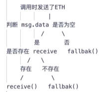

# Solidity

## solidity简介

* solidity是一种面向合约的编程语言，伴随着以太坊的出现而出现
* solidity源代码使用solidity编译器编译后输出字节码文件，该文件需要使用以太坊虚拟机进行部署和运行
* 语法上类似与java，优化代码时是面向gas优化
* 在线开发工具：[在线开发界面](http://remix.ethereum.org/)
* [Solidity 中文文档](https://learnblockchain.cn/docs/solidity/)

# Solidity结构

## solidity开源声明

* MIT：所有人都可以复制粘贴，如果出现问题不用负责
* 合约的开头都需要开源声明

```solidity
//SPDX-License-Identifier:MIT
```

## 版本限制

* 说明合约是使用哪个版本的编译器进行编译
* `^`表示包含后面的版本

```solidity
pragma solidity ^0.8.4;			//0.8.4及以上版本
pragma solidity >=0.8.17 <0.9.0;//0.8.17到0.9.0版本范围之内
pragma solidity 0.8.17;			//仅0.8.17版本
```

## contract合约

**一、定义合约**

* 使用`contract`定义合约
* 交易合约名首字母大写

```solidity
ccontract Hello{ }
```

**二、变量**

* 永久存储在合约存储池

**三、方法**

* 使用`function`定义方法
* 方法里包含合约的可见性

```solidity
function myfunc()public view returns(){
}
```

**四、this关键字**

* `this`表示当前合约
* 使用`this`可以调用合约内部的变量和`external`方法
* `address(this)`：表示合约的地址
* `this.func()`：可以调用`external`可见性的方法

**五、地址**

```solidity
contract Demo{
    address public addr_1;
    address public addr_2;
    //constructor()为构造方法
    constructor()public{
    	//设置addr_1的地址为合约地址
        addr_1=address(this);
        //设置addr_2的地址为调用者的地址
        addr_2=msg.sender;
    }
}
```

**六、合约属性type**

```solidity
contract Hello{
}
contract Demo{
	function name()public pure returns(string memory){
		//获取合约名字
		return type(Hello).name
	}
}
```

**七、导入其它合约**

* 使用`import`实现
* 使用`as`起个包的别名

```solidity
import "./hello.sol";				//直接导入
import "https://github.com/xx";		//导入网络文件
import "./hello.sol" as one;		//起别名防止冲突
```

```solidity
contract Hello{
}
```

```solidity
import "./hello.sol";
contract Demo{
	function name()public pure returns(string memory){
		//获取合约名字
		return type(Hello).name
	}
}
```

## 以太币单位

| 数量     | 表示    |
| -------- | ------- |
| 1 wei    | 1 wei   |
| 1e9 wei  | 1 gwei  |
| 1e18 wei | 1 ether |

## 接收以太币

**一、payable**

* 用于标记函数和地址
* 标记在方法时，方法可以接收以太币
* 标记在地址上时，表示向`payable()`地址转账

```solidity
contract Pay{
	//调用该方法时会将以太发送到合约
	function transderToContract()public payable{}
	//将合约上的所有以太发送给调用者
	function withdraw()external{
	    payable(msg.sender).transfer(address(this).balance);
	}
}
```

**二、fallback()**

* `fallback()`函数是回退函数
* 执行合约不存在的方法是会调用`fallback()`方法

**三、receive**

* 只负责接收主币，最常用的合约接收以太的方式
* 必须要有`payable`属性
* 不需要`function`关键字
* `receive`方法被执行时没有`msg.data`值

```solidity
contract Pay{
	//调用该方法时会将以太发送到合约
    function transderToContract() payable public {
    }
	//将合约上的所有以太发送给调用者
	function withdraw()external{
	    payable(msg.sender).transfer(address(this).balance);
	}
	//获取合约地址的以太数量
    function getBalance()external view returns(uint256){
        return address(this).balance;
    }
    //接收以太并返回接收到的以太
    receive()external payable{
        payable(msg.sender).transfer(msg.value);
    }
    fallback()external {
    }
}
```

**四、fallback和receive的调用**



## 销毁合约

**一、销毁合约并将合约的钱转走**

* 使用`selfdestruct()`实现
* `selfdestruct()`需要输入`payable()`类型的地址用于转走余额
* 合约销毁后，其方法和属性不能调用，里面如果还有以太币则视为销毁

```solidity
pragma solidity ^0.8.17;

contract Demo{
	//定义属性
    uint256 public num=1234;
    //取值
    function getValue()external pure returns(uint256){
        return 1;
    }
    //转账并销毁合约
    function kill()external{
        selfdestruct(payable(msg.sender));
    }
    //接收以太币
    receive()external payable{
    }
    fallback()external{
    }
}
```


# Solidity基础

## hello world

**一、最简单的Solodity程序**

* 由3部分组成：开源许可、solidity版本控制和条约内容
* `pragma`：版本标识，用于限制版本，`^要求版本在0.8.4及以上
* 使用`contract`构建合约，类似java的类
* 使用`public`定义一个公有变量

```solidity
//SPDX-License-Identifier:MIT
pragma solidity ^0.8.4;
contract hello{
	string public message="hello world";
}
```

**二、状态变量**

* 合约的成员属性

## Solidity变量类型

**一、Solidity常见类型**

* 值类型：布尔类型、整型、定长字节数组、地址类型、合约类型等
* 引用类型：数据位置、数组、数组切片、结构体
* 地址类型：地址（存储20字节的值，与以太坊地址大小相同）
* 映射：哈希表

### 值类型

**一、整型**

```solidity
int public num1=1;		//整型
uint public num2=1;		//正整数
uint256 public num3=1;	//字节整数
```

**二、地址类型**

* 地址分为普通地址和转账地址
* 转账地址需要使用`payable`类型定义，转账地址可以转账和查余额
* 普通地址可以使用`payable()`转为转账地址，使用`.balance`获取余额，使用`transfer()`转账

```solidity
address public myAddr=0xd9145CCE52D386f254917e481eB44e9943F39138;
address payable public sendAddr=payable(myAddr)
```

**三、定长字节数组**

* 定长字节数组：`bytes2`,`bytes8`,`bytes32`（后面的数字表示数组的长度，元素为字节整型）
* 使用字符串时会自动将字符串转为字节数组。超出长度的字符串不能转换成功
* 使用`.length`获取定长字节数组长度

```solidity
bytes32 public byteArr="hello"
```

### 引用类型

**一、可变长字节数组**

* 使用`bytes`定义可变长的数组

```solidity
bytes public byteArr="1231231232131312321321321321321321321321321321";
```

**二、字符串类型**

```solidity
string public message ="hello world";
```

**三、固定数组**

```solidity
int[3] public arr;
```

**四、函数**

```solidity
function 函数名(参数){internal|external|public|private}[pure|view|payable]
```

### 变量的赋值

**一、值变量之间和引用变量之间的赋值**

* 无论是只值变量还是引用变量，变量被调用时传递的都是新的副本，引用变量不会传递指针
* 如果方法改变合约定义的变量，则合约变量永久改变，如果改变的是方法定义的变量，则改变结果不会保存

**二、内存变量之间的赋值**

* 内存变量：使用`memeory`修饰的值变量和引用变量，调用完就删除
* 内存变量之间的赋值不会传递副本，而是传递指针地址

### 变量的可见性

**一、可见性相关的关键字**

* `public`：公有（函数默认的可见性，其它的类型（字符串）会自动生成与变量名相同的`getter`函数）
* `private`：私有函数，继承的合约不能使用
* `external`：合约外部可见
* `internal`：合约内部可见，继承的合约可以用（非函数类型默认的可见性）

## Storage和Memory

* `storage`：永久存储在区块链中的变量，比如合约的状态变量
* `memory`：临时存储的变量，只消耗内存，调用完旧释放

```solidity
//获取合约状态变量的值--map
Voter storage sender=voters[msg.sender];
```

### 方法的读写性

**一、方法的读写性**

* `没有关键字`：方法既能改变合约里的变量，也能获取合约里的值
* `view`：方法只能读取不可改变合约里的变量（特殊的变量如`address(this)`都算在内）
* `pure`：方法不能读取也不能改变合约里的变量

```solidity
contract Demo{
	//合约变量
    uint256 public num=1234;
    //仅读取合约变量
    function getValue()external view returns(uint256){
        return num;
    }
    //读取并修改合约变量
    function add()external returns(uint256){
        num++;
        return num;
    }
    //不能读取也不能改变合约里的变量
    function getMSG()external pure returns(string memory){
        return "hello world";
    }
    receive()external payable{
    }
    fallback()external{
    }
}
```

## 数据结构

### 数组

**一、固定数组**

* 定义格式：`类型[长度] public 数组名=[元素];`

```solidity
contract demo{
	uint256[5] public arr=[1,2,3,4,5];
}
```

**二、可变长storage数组**

* 使用`[]`可声明可变长数组
* 使用`push()`方法追加元素
* 使用`.length`获取长度

```solidity
contract demo{
    uint256[] arr;
    function addItem(uint256 num)external{
        arr.push(num);
    }
    function getLength()external view returns(uint256){
        return arr.length;
    }
}
```

### map

**一、map的定义**

* 使用`mapping`定义哈希表
* 定义格式：`mapping(key类型=>value类型) 可见性 map名`

```solidity
mapping(address => uint256) public mymap;
```

**二、设置键值对**

* 格式：`哈希表名[key]=value`

```solidity
function getValue() external view returns(uint256){
	mymap[msg.sender]=123;
}
```

**三、取键值对**

* 格式：`哈希表名[key]`

```solidity
function getValue() external view returns(uint256){
	return mymap[msg.sender];
}
```

**四、删除**

* 格式：`delete 哈希表名[key];`

```solidity
function getValue() external view returns(uint256){
	delete mymap[msg.sender];
}
```

### struct

**一、定义数据结构**

* 使用`struct`实现

```solidity
struct Book{
	string title;
	string author;
	uint256 book_id;
}
```

**二、实例化结构体对象**

* 需要`memory`修饰词，使用完释放资源
* 格式：`结构体名 memory 对象名=结构体名({键值对});`

```solidity
function initOBJ()external{
	Book memory temp=Book(
		title:unicode"book",
		author:"demo",
		book_id:123
	);
}
```


## 注释

**一、单行注释**

* 使用`//`实现

```solidity
//注释
```

**二、多行注释**

* 使用`/**/`实现

```solidity
/*
注释
*/
```

# 实战

## 存钱罐

**一、需求分析**

* 所有人都可以存钱
* 只有钱罐的所有者才能取钱
* 只要取钱，合约就会销毁

```solidity
//SPDX-License-Identifier:MIT
pragma solidity ^0.8.17;

contract Bank{
	//定义钱罐所有者
    address public owner=0x5B38Da6a701c568545dCfcB03FcB875f56beddC4;
    //定义事件及其相关输入参数
    event Deposit(address addr,uint256 amount);
    event getMomety(uint256 amount);
	
    function withdraw()external{
    	//调用者为所有者时进行运行，否则返回"no owner"
        require(msg.sender==owner,"no owner");
        emit getMomety(address(this).balance);
        //销毁合约并转账
        selfdestruct(payable(owner));
    }
	//获取存钱罐的以太币数量
    function getBalance()external view returns(uint256){
        return address(this).balance;
    }

    receive()external payable{
        emit Deposit(msg.sender,msg.value);
    }
}
```

# Solidity的在线编译和在线部署

**一、编译步骤**

* 打开[remix在线开发页面](https://remix.ethereum.org)
* 切换到SOLIDITY编译页面（Solidity compiler）
* 跳到编译详情下面
* 复制`ABI`文件内容和`Bytecode`内容并保存

**二、在线部署合约到私链步骤**

* 打开[remix在线开发页面](https://remix.ethereum.org)
* 切换到部署页面（Deploy & run transactions）
* 切换环境为`External Http Provider`

**三、使用javascript部署**

* 打开[remix在线开发页面](https://remix.ethereum.org)
* 切换到SOLIDITY编译页面（Solidity compiler）
* 点击编译详情
* 找到`WEB3DEPLOY`
* 复制`WEB3DEPLOY`的内容
* 修改`from`的地址


