# 以太坊简介

## 区块链的发展

* 区块链1.0：比特币，简单的记账
* 区块链2.0： ETH1.0，带有智能合约的区块链
* 区块链3.0： EOS和ETH2.0，高性能、大吞吐量、开发者友好、用户友好（但EOS弱化了去中心）

## 以太坊的发展阶段

* Frontier（前沿阶段）
  * 以太坊发表白皮书，众筹组建团队，发布以太坊和产生一个创世区块和第一个智能合约
* Homestead（家园阶段）
  * 因为智能合约有漏洞，遭遇黑客的攻击以太坊经历了第一次硬分叉“Homestead Fork”
  * 旧分叉为`ETC`，新分叉为`ETH`，`ETH`是以太坊主流分叉
* Metropolis（大都会阶段）
  * 拜占庭分叉升级：2017年调整了区块难度评估公式，让出块趋于稳定，区块收益从`5ETH`降低到`3ETH`
  * 君士坦丁堡硬分叉：优化gas费用
* Serenity（宁静阶段）
  * 发布ETH2.0，从POW转至POS，矿工无法通过挖矿获取收益，以太坊出币量大幅减少
  * 过渡期实施双链运行，最终合二为一
  * 解决能源消耗过大、可扩展性差、算力中心化的问题，进一步提高以太坊的安全性和稳定性
  * 提出分片链的形式，解决扩展性差的问题

## 以太坊的特点

* 以太坊是“世界计算机”，是一个开源的、全球分布的计算机基础设施
* 本质是基于交易的状态机
* 使用区块链同步和存储系统状态，<font color=red>使用加密货币（ether）计量和约束执行资源成本</font>
* 能够执行智能合约的程序
* 以太坊平台能够构建具有内置经济功能的去中心化应用程序（DApp），正常运行的同时减少或消除了审查，第三方界面和交易对手的风险

## 以太坊组成部分

* P2P网络
  * 以太坊再以太坊主网络运行（端口30303），以`DEVp2p`作为通信协议
* 交易（Transaction）
  * 以太坊交易是网络消息，主要角色有发送者、接收者、值和数据有效载荷（payload）
* 以太坊虚拟机（EVM）
  * 以太坊状态转换由以太坊虚拟机（EVM）处理
  * 一个执行字节码的基于堆栈的虚拟机
* 数据库（Blockchain）
  * 以太坊的区块链作为数据库本地存储再每个节点，包含序列化后的交易和系统状态
  * 使用K/V数据库存储（google--LevelDB）
* 客户端
  * 用于构建传递信息的点对点网络
  * 创建客户端框架：`Go-Ethereum`和`Parit`

## 以太坊的概念

**一、账户**

* 包含地址，余额和随机数，以及可选的存储和代码的对象
* 普通账户（EOA）：没有存储和代码
* 合约账号（Contract）：包含存储和代码

**二、地址**

* 代表EOA或合约，可以在区块链上接收或发送交易
* 它是ECDSA公钥的keccak散列的最右边的160位

**三、交易**

* 可以发送以太币和信息
* 向合约发送的交易可以调用合约代码，并以信息数据为函数参数
* 向空用户发送信息，可以自动生成以信息为代码块的合约账户

**四、gas**

* 以太坊执行智能合约程序的需要消耗的虚拟燃料
* 对拒绝服务(DoS)攻击的防御，避免计算资源的滥用
* 发送方需要支付消耗gas的手续费，手续费为矿工的一部分收入来源
* gas没有固定的价格，由市场进行调控
* gas单价设置的越高，手续费越高，交易处理速度越快（不能设置为0）

## 以太坊的货币

**一、以太坊数字货币**

* 以太坊的货币单位为以太（ether），用`ETH`表示

**二、叔块**

* 有些区块因为挖出得晚不能作为主区块链的一部分，这些区块称为叔块
* 以太坊一个区块最多只能包含2个叔块
* 出现原因：以太坊的区块时间是20秒左右，相对于比特币更容易出现临时分叉和孤儿区块。而且较短的出块时间，也使得区块在整个网络中更难以充分传播
* 叔块的引用可以跨高度

**三、以太币发行规则历史**

* 挖矿前（Pre-mine，Genesis）
  * 为众筹发行了7200万以太币

* 挖矿产出（Mining）:（GHOST协议）

  * 区块奖励（block reward）：每产生一个新区块会有一笔固定的奖励给矿工，初始阶段5个，发展阶段3个
  * 叔块奖励（uncle reward）： (叔块高度+8-引用叔块的区块高度)*普通区块奖/8，奖励值大于0
  * 叔块引用奖励（uncle referencing reward）：每引用一个叔块可得到区块奖励的$\frac{1}{32}$作为奖励

* 变更以太坊出块机制

  * 从工作量证明（POW）转换为股权证明（POS），以太币越多获得的币越多（类似银行存钱利率）

  * 股权证明机制使用`Casper`协议，在该协议下以太币的发行率大大低于幽灵（GHOST）协议下的发行率

  * 减少了计算资源消耗，性能也得到了相应的提升

  * 依然是基于哈希运算竞争获取记账权的方式

**四、POW奖励流程**

* 挖出一个新的区块（区块2）并入以太坊主网，参与挖出该区块的矿工得到区块奖励
* 与区块2同一高度下，继续挖出新的区块，该区块作为叔块等待下一层区块引用产出的叔块
* 挖出下一层新的区块（区块3）并入以太坊主网，参与挖出该区块的矿工得到区块奖励
* 一部分矿工参与引用叔块到区块3，引用成功后得到叔块引用奖励
* 叔块被引用成功后，参与叔块挖掘的矿工得到叔块奖励（叔块的引用可以跨高度）

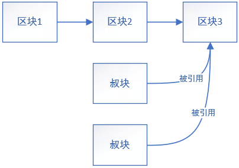

**五、POW机制下以太坊区块收入来源**

* 普通区块收入
  * 区块固定奖励
  * 交易方因消耗gas支付的手续费
  * 叔块引用奖励
* 叔块收入
  * 叔块奖励：叔块奖励=(叔块高度+8-引用叔块的区块高度)*普通区块奖/8

## 以太坊区块信息

| 属性             | 描述                                                         |
| ---------------- | ------------------------------------------------------------ |
| Block Height     | 区块高度                                                     |
| Status           | 区块状态                                                     |
| Timestamp        | 出块时间戳                                                   |
| Transactions     | 交易情况                                                     |
| hash             | 区块哈希值                                                   |
| Parent Hash      | 父区块哈希值                                                 |
| Sha3Uncles       | 叔块哈希值                                                   |
| Total Difficulty | 总难度                                                       |
| Size             | 区块大小                                                     |
| Gas Used         | 已使用的gas                                                  |
| Gas Limit        | 区块最大的gas量                                              |
| Gas Price        | 交易消耗的手续费                                             |
| Block Reward     | POW机制：区块奖励+gas奖励+叔块引用奖励<br>POS机制：区块利息-gas燃烧费用 |
| Nonce            | 随机数                                                       |
| Uncles Reward    | 叔块奖励                                                     |

## 幽灵协议

**一、使用幽灵协议的理由**

* 以太坊出块时间短，每14~15秒出一个块（区块从挖出到广播到每个节点至少12.6s）
* 出块时间短带来区块的高作废率（分叉概率高），链的安全性降低
* 区块可能集中分配到有算力优势的节点（中心化风险）

**二、幽灵协议**

* 全称：Greedy Heaviest Observed SubTree

| 问题       | 解决方案                                                     |
| ---------- | ------------------------------------------------------------ |
| 主链的选择 | 选择长度最长的链作为主链                                     |
| 主链的延续 | 区块末端如果因广播延迟出现多个分叉，则主链选择第一个挖出的区块作为主链的下一个区块 |
| 挫败积极性 | 第一个区块挖出后，同一高度的其它区块称为叔块，叔块被引用后给矿工奖励 |
| 分支攻击   | 叔块的子块没有奖励，叔块需要在7代区块内被引用，否则无奖励，区块最多2个叔块 |
| 奖励公式   | 区块奖励+区块手续费总和+叔块奖励（包含叔块的引用奖励）       |

## 以太坊和图灵完备

**一、图灵完备**

* 定义：一个系统可以模拟任何图灵机
* 图灵完备的系统被称为通用图灵机

**二、停机问题**

* 编写一个程序能否判断另一个程序是否能结束
* 图灵机不能解决停机问题

**三、以太坊系统的图灵完备**

* 以太坊系统属于图灵机的一种
* 以太坊系统支持循环语句，可以运行无限循环程序（带来死循环问题）

**四、以太坊死循环解决方案**

* 引入gas机制限制资源，每个区块拥有一定的`gas limit`
* 区块的gas消耗完后强制停止合约程序

## 去中心化应用

* 基于以太坊可以使用智能来构建去中心化应用（DApp）
* 以太坊的构想是成为DApps编程开发平台
* DApp的组成
  * 后端区块链上的智能合约
  * Web前端用户界面

## 代币（Token）

**一、大笔的定义**

* 代币被称为通证又名”令牌“，代表有所有权的资产、货币、权限风在区块链上的抽象

| 代币种类   | 描述                                                         |
| ---------- | ------------------------------------------------------------ |
| 可替换通证 | 基于区块链技术发行的，互相可以替代的，可以接近无限拆分的token |
| 非同质通证 | 基于区块链技术发行的，唯一的，不可替代的，不可拆分的token（nft->虚拟藏品） |

## 区块链名词解释

| 名词      | 解释                                                         |
| --------- | ------------------------------------------------------------ |
| EIP       | 以太坊改进意见                                               |
| ERC       | 以太坊征求意见                                               |
| EOA       | 外部账户，由以太坊网络的人创建的账户                         |
| Ethash    | 以太坊1.0工作量证明算法                                      |
| HD钱包    | 使用分层确定性密钥创建和转账协议的钱包                       |
| Keccak256 | 以太坊中使用的密码哈希函数，简写为SHA-3                      |
| Nonce     | 密码学中代指只能使用一次的值<br>以太坊使用账户随机数和POW随机数 |

## 以太坊与比特币的区别

* 以太坊有账户的概念而比特币没有
* 以太坊能够无限产出，而比特币数量有限
* POW模式下，以太坊里挖得晚的区块被称为叔块可以被引用，比特币里被称为孤块完全舍弃
* 以太坊拥有智能合约机制，能够开发去中心化应用程序

# 以太坊的交易

## 以太坊单位

* 以太坊的货币单位为以太（ether）
* 以太币最小的单位为`wei`（1以太=$10^{18}$wei）

| 量级      | 名称     | 缩写       |
| --------- | -------- | ---------- |
| 1         | wei      | wei        |
| $10^3$    | babbage  | Kwei       |
| $10^6$    | lovelace | Mwei       |
| $10^9$    | shannon  | Gwei       |
| $10^{12}$ | szabo    | Microether |
| $10^{15}$ | finney   | Milliether |
| $10^{18}$ | ether    | Ether      |

## 以太坊钱包

**一、以太坊钱包**

* 用户进入以太坊系统的门户，代表用户创建和广播交易
* 以太坊钱包包含私钥

| 钱包类型       | 描述                                      |
| -------------- | ----------------------------------------- |
| MetaMask       | 浏览器扩展钱包，运行在浏览器              |
| Jaxx           | 多平台多币种钱包，能在各种操作系统运行    |
| MyRtherWallet  | 基于web的钱包，可以在浏览器上运行         |
| Emerald Wallet | 与ETC配合使用，兼容其它基于以太坊的区块链 |

## 私钥、公钥和地址

**一、私钥**

* 以太坊私钥是一个256位的随机数，用于发送以太交易中创建签名来证明自己对资产的所有权
* `keystore`文件是加密存储的私钥，访问账户必须同时有keystore文件和密码

**二、公钥**

* 由私钥通过椭圆曲线加密`secp256k1`算法单向生成的512位(64字节)数

**三、地址**

* 由公钥的`Keccak-256`单向哈希，取最后160位(20个字节)派生出来的标识符

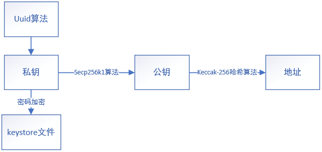

## 区块链网络

| 网络名         | 描述                                                         |
| -------------- | ------------------------------------------------------------ |
| Main Network   | 主要的、公共的以太坊区块链                                   |
| Localhost 8545 | 连接到与浏览器在同一台计算机上运行的节点<br>节点可以是任何公共区块链的一部分，也可以是私链的一部分 |

## MetaMask的使用

**一、助记码**

* 私钥和助记码的关系类似IP与域名的关系
* 助记码是随机的不能自己选
* 钱包能够通过助记码登陆自己的账户，作用和私钥相同

**二、显示测试网络**

* 显示测试网络（设置-高级-显示测试网络）

**三、获取测试以太**

* 切换到测试网络
* 点击购买
* 测试水龙头获取以太

# 以太坊客户端

## 以太坊客户端简介

**一、以太坊客户端**

* 以太坊客户端是一个软件应用程序
* 实现以太坊规范并提供p2p网络与其它以太坊客户端进行通信
* 不同的以太坊客户端符合参考规范和标准化通信协议，则可以进行相互操作
* 以太坊的黄皮书定义了以太坊客户端的标准行为

**二、常用的以太坊客户端**

* `go-ethereum`（Go）
* `parity`（Rust）

## 以太坊全节点

**一、以太坊全节点作用**

* 全节点是整个主链的副本，存储并维护链上的所有数据，并随时验证新区块的合法性
* 保证了区块链的去中心化，区块链网络上只要还有一个全节点，则整个网络不会消失
* 全节点可以帮助其它新节点获取区块数据，并提供所有交易和合约的独立验证

**二、有关全节点的补充**

* 运行全节点将消耗巨大成本，包含硬件资源和带宽
* 第一次下载需要几天才能完全同步
* 必须及时维护、升级并保持在线状态来同步区块
* 以太坊开发不需要再主网上运行，可以使用测试网络或本地私链进行

## 远程客户端和轻节点

**一、远程客户端**

* 不出差区块链的本地副本或验证块和交易
* 只提供钱包的功能，可以创建和广播交易

**二、轻节点**

* 不保存链上的区块历史数据，<font color=red>只保存区块链当前的状态</font>
* 轻节点可以对块和交易进行验证

## 本地私链

**一、本地私链**

* 不需要同步非私有区块链的数据，数据占用少
* 无需获取测试以太，私人可以任意分配以太，随时自己挖取获得
* 没有其他用户和其他合约，无外部干扰

# go-ethereum的使用

## 搭建以太坊私链

**一、拉取镜像**

```bash
docker pull ethereum/client-go
```

**二、开启容器**

* 容器默认启动公链，需要使用`entrypoint`替换入口点

```bash
docker run \
 -itd \
 --name geth_one \
 -v /home/keqing/桌面/ETH/localtime:/etc/localtime \
 -v /home/keqing/桌面/ETH/timezone:/etc/timezone \
 -v /home/keqing/桌面/ETH/dapp/chain_data/genesis.json:/dapp/genesis.json \
 -v /home/keqing/桌面/ETH/dapp/chain_data:/dapp \
 -p 8545:8545 \
 -p 30303:30303 \
 -p 30303:30303/udp \
 --entrypoint /bin/sh \
 ethereum/client-go
```

**三、创世区块配置文件**

* `config`：配置自定义链的设置区块
* `chainId`：区块链标识，不要与主网和主网测试网冲突
* `difficulty`：设置难度，用于控制区块生成时间
* `gasLimit`：gas支出范围限制
* `alloc`：设置私链初始以太币余额，单位wei（可以用MetaMask的钱包地址，但是不能使用，因为没有私钥文件）
* `coinbase`：矿工账号地址

```json
{
    "config": {
        "chainId": 15,
        "homesteadBlock": 0,
        "eip150Block": 0,
        "eip155Block": 0,
        "eip158Block": 0,
        "byzantiumBlock": 0,
        "constantinopleBlock": 0,
        "petersburgBlock": 0,
        "istanbulBlock": 0
    },
    "alloc": {
        "0x5f36F06A5bae2dD6C4c2A62E95b994d8D2e7224F":{"balance":"1000000000000000000000"}
    },
    "nonce": "0x000000000000002a",
    "difficulty": "2000",
    "mixhash": "0x0000000000000000000000000000000000000000000000000000000000000000",
    "coinbase": "0x0000000000000000000000000000000000000000",
    "timestamp": "0x00",
    "parentHash": "0x0000000000000000000000000000000000000000000000000000000000000000",
    "extraData": "0x0000",
    "gasLimit": "0x00ffffff"
}
```

**四、使用创世区块配置文件初始化私链**

* 第一个`/dapp`表示私有链存储位置

```bash
geth init --datadir /dapp /dapp/genesis.json
```

**五、启动私链**

* `--networkid`：必须设置自己的私链id，否则会连接到主链
* `--identity`：自定义节点名
* `--datadir`：区块链数据存储目录
* `--nodiscover`：禁用节点发现机制(手动添加节点)，日志就不会出现` Looking for peers`

```bash
geth --identity "main_node" --datadir /dapp  --networkid 15 --http --http.addr 0.0.0.0 --http.corsdomain "*" --allow-insecure-unlock console 2>>geth.log
```

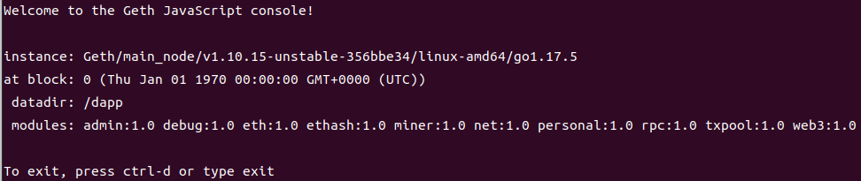

**六、参考资料**

[Docker搭建以太坊私有链](https://juejin.cn/post/6919431624715141133)

## geth控制台操作

### 启动区块链以及获取区块链的相关信息

**一、启动私链进入控制台**

* 必须指明私链网络id
* 结尾必须加上console来启动私链内部控制台
* 必须指明私链数据存储的目录
* 区块链的控制台本质是javascript交互控制台，主要使用javascript语句
* `--http`启动监听端口，默认8545
* `--http.port`：设置监听端口
* `--http.addr`：设置服务器地址（公网下不建议设置0.0.0.0）
* `--http.corsdomain`：允许其他ip访问
* `--allow-insecure-unlock`：允许`http`连接

```bash
geth --identity "main_node" --datadir /dapp  --networkid 15 --http --http.addr 0.0.0.0 --http.api "db,eth,net,web3,personal" --http.corsdomain "*" --allow-insecure-unlock console 2>>geth.log
```

**二、获取基本信息和控制台的方法**

| 代码块   | 描述               |
| -------- | ------------------ |
| admin    | 管理节点的相关命令 |
| eth      | 与区块链交互的命令 |
| miner    | 矿工相关的命令     |
| net      | p2p网络相关命令    |
| personal | 账户管理的相关命令 |
| txpool   | 交易池             |

**三、admin包含的信息**

| 信息       | 描述                 |
| ---------- | -------------------- |
| listenAddr | 监听地址             |
| peers      | 该区块链的其他全节点 |

**四、eth包含的信息**

| 信息        | 描述                 |
| ----------- | -------------------- |
| accounts    | 账户                 |
| blockNumber | 当前区块链的区块高度 |

### 命令学习路线

```
geth(1)->geth(2)->personal(1)->geth(3)->personal(2)->
miner(1)->miner(2)->miner(3)->geth(2)->单位转换(1)->单位转换(2)->geth(4)
geth(5)->geth(6)
```

### geth常用命令

**一、获取账户以太币数量**

* 使用`eth.getBalance()`方法获取以太币数量
* 单位`wei`

```javascript
eth.getBalance("0x5f36F06A5bae2dD6C4c2A62E95b994d8D2e7224F");
//简写写法
eth.getBalance(eth.accounts[0]);		//当第0个账户为实验账户地址
```

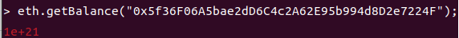

**二、获取区块高度**

```javascript
eth.blockNumber;
```

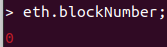

**三、获取区块链内的所有账户**

* 返回数组

```javascript
eth.accounts;
```

**四、发送以太币**

* 使用`eth.sendTransaction()`方法发送以太币，会返回交易hash值
* 需要填入json对象数据，from对应以太币来源账户，to为目标账户，value为币数
* 发币之前需要解锁币来源账户
* 发送后需要矿工开启挖矿处理交易

```javascript
eth.sendTransaction({from:eth.accounts[0],to:eth.accounts[1],value:web3.toWei(1,"ether")});
```

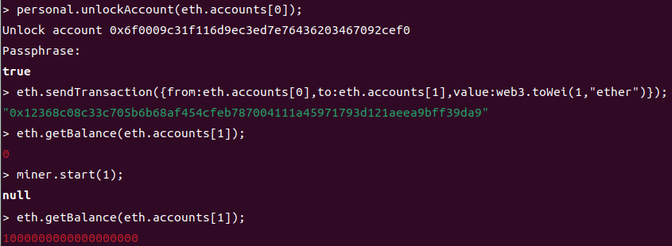

**五、获取交易信息**

* 使用`eth.getTransaction()`获取交易信息

```javascript
eth.getTransaction("交易哈希值");
```

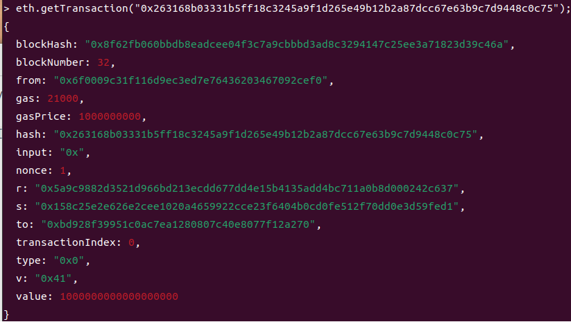

**六、获取区块记录的交易数**

* 使用`eth.getBlockTransactionCount()`获取区块记录的交易数

```javascript
//可以传区块哈希
eth.getBlockTransactionCount(32);
```

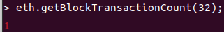

**七、获取区块信息**

* 使用`getBlock()`获取1区块信息

```javascript
eth.getBlock(32);
```

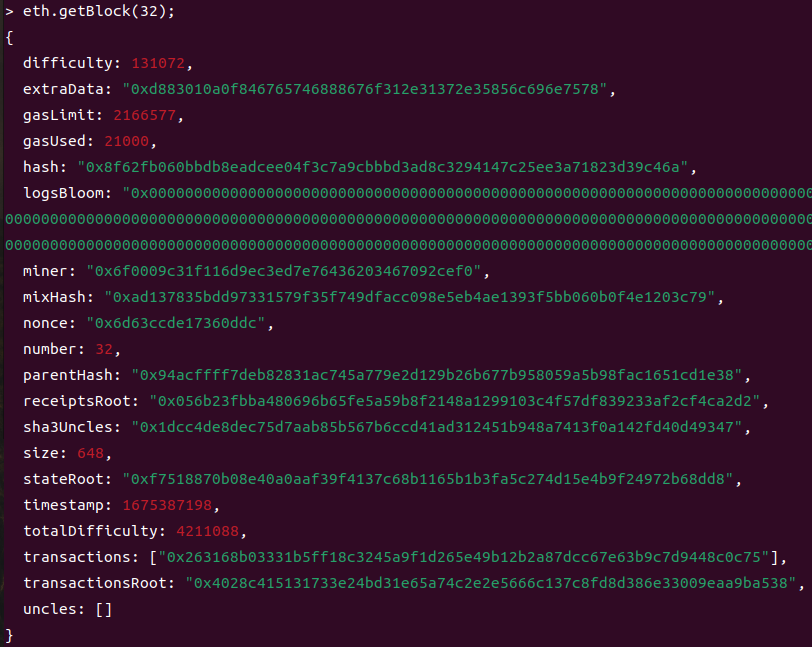

**八、估计交易消耗的gas**

* 使用`eth.estimateGas()`实现
* 需要放入json对象数据，包含from,to,value,data（data可选，必须是16进制）

```javascript
eth.estimateGas({from:eth.accounts[0],to:eth.account[1],value:10,data:"0xfasdad"});
```

### personal常用命令

**一、创建账户**

* 使用`personal.newAccount()`创建账户
* 需要输入密码
* 创建后`keystore`里多出了一个文件

```javascript
personal.newAccount();
```

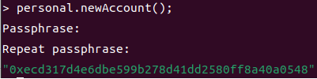

**二、解锁账户**

* 输入密码解锁

* 使用`personal.unlockAccount()`解锁账户

```javascript
personal.unlockAccount("地址");
```

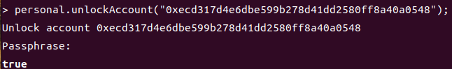

### miner相关命令

**一、设置挖出的以太币的归属**

* 使用`miner.setEtherbase()`设置币的归属
* keystore里有多个账户时需要设置币的归属，否则默认第一个账户

```javascript
miner.setEtherbase()；
```

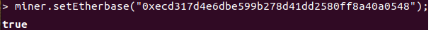

**二、启动CPU挖矿**

* 使用`miner.start()`
* 刚开始挖需要一定时间同步
* 输入挖矿的线程数
* 挖矿的具体日志写入了`geth.log`里

```javascript
miner.start(1);
```

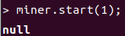

**三、结束挖矿**

* 使用`miner.stop()`

```javascript
miner.stop();
```

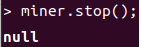

### 单位转换相关

**一、wei转换为ether**

* 使用`web3.fromWei()`实现单位转换

```javascript
web3.fromWei(eth.getBalance("0x5f36F06A5bae2dD6C4c2A62E95b994d8D2e7224F"),"ether");
```

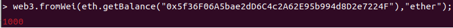

**二、ether转为Wei**

* 使用`web3.toWei()`实现
* 第一个参数为以太数，第二个参数为单位

```javascript
web3.toWei(1,"ether")
```

# 以太坊账户

## 以太坊账户概念

**一、账户数据的存储**

* 以太坊的“状态”是系统中所有账户的列表
* 每个账户都包括了一个余额（balance），和特殊数据（智能合约代码和内部存储）
* 发送的账户有足够的余额支付，则交易有效
* 交易过程中先生成交易合约并支付gas等待矿工处理，矿工处理时发送账户先扣款，收款账户再记入钱
* 如果收款账户有智能合约代码，则代码自动运行，对资金进一步处理

**二、以太坊账户模式优点**

* 可以节省大量空间，每个交易只需要一个输入、一个签名并产生一个输出
* 便于维护持久化轻节点，通过索引沿特点方向扫描状态树，轻节点能随时访问账户相关的所有数据
* 使用智能合约使得以太坊更容易编码和理解

**三、比特币与以太坊的对比**

| 概念     | BTC         | ETH            |
| -------- | ----------- | -------------- |
| 设计定位 | p2p现金系统 | 去中心化应用   |
| 数据组成 | 交易列表    | 交易和账户状态 |
| 交易对象 | UTXO        | Accounts       |
| 代码控制 | 脚本        | 智能合约       |

## 以太坊账户类型

**一、外部账户(EOA)**

* 拥有以太币余额
* 可发送交易
* 由用户私钥控制
* 没有关联代码

**二、合约账户(CA)**

* 拥有以太币余额，有智能合约代码和存储空间
* 需要向零账户发送交易才能产生合约账户
* 可通过交易或其他合约的调用消息触发合约代码执行
* 执行代码时可以操作自己的存储空间和调用其他合约

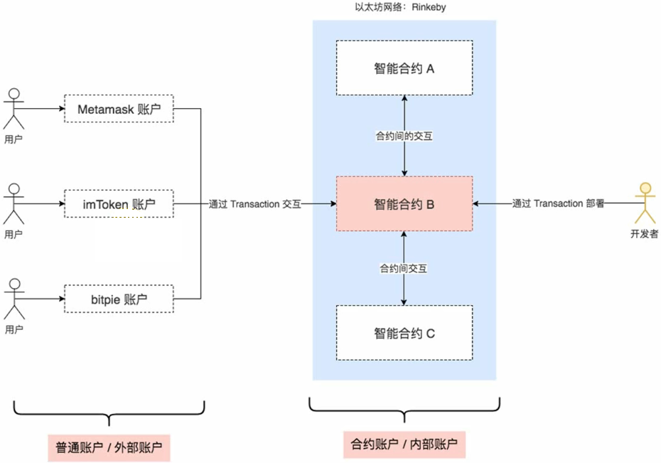

**三、零账户**

* 零账户的地址为(0x0)
* 可用于销毁多余的币（零账户里的币没有流动性）
* 交易的目标账户为零账户时，EVM会获取data创建新的合约（输出的合约本质是合约账户）

## 消息

**一、消息**

* 合约调用其他合约时需要发送消息
* 消息只存在于以太坊执行环境中（EVM）

**二、消息的组成**

* 消息发送方
* 消息接收方
* 金额
* 数据
* START GAS

## 合约

**一、合约**

* 可以读写内部存储的数据
* 可以向其他合约发送消息，依次触发执行
* 合约运行结束，且其发送消息触发的所有子执行结束时，EVM就会终止运行直到下次交易被唤醒

**二、合约应用**

* 维护一个永远不能更改的数据存储，存放对其他合约或外部世界有用的内容
* 模拟货币的合约
* 通过合约实现具有更复杂的访问策略的EOA中间账户（转发合同），满足条件时才能转发消息
* 管理多个用户之间的持续合同或关系（金融合同）

# 以太坊交易

## 以太坊交易相关概念

**一、交易**

* 交易是由账户发起的签名消息，由以太坊网络传输，并被序列化后记录在以太坊区块链上
* 交易是唯一可以触发状态更改和启动EVM里的智能合约的事物
* 以太坊是全局单例状态机，只有交易才能改变其状态
* 交易的数据是序列化的二进制消息，所有递归长度前缀编码方案实现序列化

**二、交易数据结构**

* `nonce`：由发起人EOA发出的序列号，防止交易消息重播
* `gas price`：交易发起人愿意支付的gas单价(wei)
* `start gas`：交易发起人愿意支付的最大gas量
* `to`：目的账户地址
* `value`：发送的以太币数量
* `data`：可变长二进制数据负载(payload)

**三、nonce的作用**

* 用于防止错误计算账户余额，强制来自任何地址的交易按顺序处理，没有间隔
* 确保所有节点计算相同的余额和之前的序列交易，防止出现双重支付的漏洞

**四、并发**

* 以太坊是一个允许操作并发的系统，但强制执行单例状态（出块时只有一个块追加到主链）

## gas机制

**一、gas**

* gas是交易发起人需要为执行合约操作支付的成本（使用以太币支付）
* gas用于衡量消耗的系统资源，具有自然成本
* 交易费用跟gas对以太币的单价有关，通过自由市场进行调节
* `gas price`为每个gas的单价，由交易发起人设置
* 交易中的`gas limit`：防止因合约的死循环造成更多支付方的财产损失
* 区块中的`gas limit`：限制区块的交易数据量
* 交易支付公式：交易手续费(totalCost)=gas单价×使用了的gas
* 交易费用与一次转账多少无关，与交易消耗的计算资源有关

**二、估计交易可能消耗的总gas**

* 使用`eth.estimateGas()`获取预计消耗的gas值
* 如果data数据量越多，gas消耗越大

## 交易的接收者

**一、交易接收者**

* 交易接收者在to字段指定（20字节长的地址）
* 以太坊没有对交易接收者进一步验证，任何20字节的值都认为有效
* 交易发送到无效地址，交易完成后无法追回（没完成交易时可以发送新的交易顶替原来的交易）

## 交易的value和data

**一、交易的有效负载（payload）**

* `value`和`data`为交易的有效负载
* 交易过程中可以有value和data，可以仅有两者其一，也可以两者都没用

**二、data**

* 发送给智能合约的data有效负载是32字节的十六进制序列化编码
  * 函数选择器：函数原型的`keccak256`哈希的前四个字节（识别调用的函数）
  * 函数参数

## 部署合约

**一、合约的部署**

* 部署合约是一种有数据负载没有value的交易，数据为已编译成字节码的合约
* 合约创建交易被发送到零地址（`0x0`），用于表示部署合约
* 零地址仅用于合约注册，如果有以太币发到零地址，则这些以太因不能参与流通而失效
* 部署合约前要尽可能的优化合约，优化差的合约消耗的gas会更多

# 以太坊虚拟机

**一、以太坊虚拟机（EVM）**

* EVM是智能合约的运行环境
* P2P网络里每个节点都会运行EVM
* EVM不仅是沙盒封装的，而且是完全隔离的（不能访问网络、文件系统和其他进程）
* 合约以字节码的形式存储在区块链上
* 合约使用`solidity`编写，通过EVM编译器编译为字节码，通过客户端部署到区块链中
* EVM为了实现去中心化和安全，交易会通过网络发送到各个全节点，在各个节点都处理了一次（冗余处理）

**二、以太坊虚拟机与账户**

* 每个合约账户在EVM中都有一个键值对形式的持久化存储，key和value的长度为256位（称为存储空间）

**三、以太坊虚拟机和交易**

* 在交易中，如果目标账户有合约代码，则该代码会在EVM中执行，以payload作为输入参数
* 如果目标账户是零账户（账户地址为0），则此交易将创建一个新合约

**四、以太坊虚拟机和gas**

* 合约被交易触发调用时，指令会在全网的每个节点上执行，需要消耗算力成本，该成本用gas衡量
* 每笔交易都按照一定数量的gas预付一笔费用，用于限制执行交易所需的工作量和作为手续费
* EVM执行交易时，gas将按特点的规则逐渐耗尽
* gas price是交易发送者设置的gas单价，如果交易后还有剩余的gas则会返还
* gas一旦被耗尽，将会触发`out-of-gas`异常，所作的所有修改将被回滚，<font color=red>已经消耗的gas不会退回</font>

**五、以太坊虚拟机和数据存储**

* Storage
  * 是一个KV存储区，是一个庞大的数据存储空间，不能遍历所有键值对，否则对系统资源消耗极大
  * 每个账户都有一块持久化的存储空间，称为storage，永久保存所有账户的状态变量
  * 由于永久保存合约等信息，此处读写的gas开销最大
* Memory（内存）
  * 每一次消息调用，合约会临时获取一块内存空间
  * 生命周期为方法的执行期间，方法调用完后回收，gas开销较小
  * gas的开销跟内存使用量相关，会按平方指数增长
* Stack（栈）
  * EVM是基于栈的虚拟机
  * 用于存放部分局部值类型变量，gas最低，但数量有限

**六、调用**

* 消息调用：提高消息调用的方式调用其它合约或发送以太币到非合约账户

# 参考资料

[创始人介绍以太坊](https://www.youtube.com/watch?v=TDGq4aeevgY)

[创始人介绍以太坊（中文翻译）](https://www.bilibili.com/video/BV1MW411F7mY)

[精通以太坊(中文版)](https://github.com/inoutcode/ethereum_book)

[以太坊白皮书 ](https://ethereum.org/zh/whitepaper/)

[面向契约的Solidity编程语言](https://github.com/ethereum/solidity)

[Solidity 中文文档](https://learnblockchain.cn/docs/solidity/)

[以太坊社区](https://ethereum.org/zh/)

[以太坊开发者资源](https://ethereum.org/zh/developers/)

[在线编写智能合约的IDE](http://remix.ethereum.org/)

[查询合约情况](https://rinkeby.etherscan.io/)

[Go Ethereum以太坊客户端](https://github.com/ethereum/go-ethereum)

[以太坊出块和交易情况](https://etherscan.io/)

[区块奖励机制](https://zhuanlan.zhihu.com/p/28928827)
