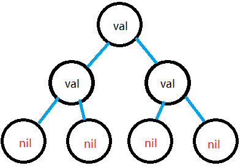
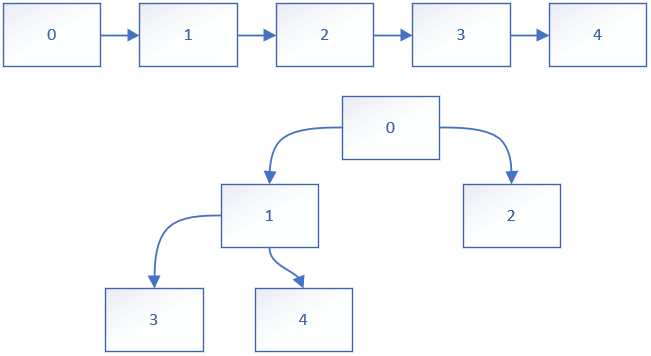
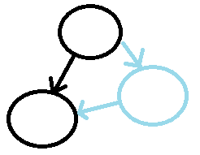
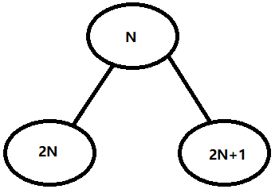

# 二叉树结构

**一、定义二叉树结构**

◼左指针和右指针要求是指针类型

◼二叉树结构包含有值节点和虚拟节点（虚拟节点用于判断节点是否是最深处）

◼二叉树节点声明后不会对左右指针赋予地址，所以虚拟节点的地址默认为nil



```go
//二叉树节点结构体
type treeNode struct{
    Val int
    Left *treeNode
    Right *treeNode
}
```

**二、开辟节点空间获取地址**

◼声明一个树节点时，左指针和右指针都为nil，只有节点本身有地址

◼常用`&treeNode{}`声明一个树节点

# 深度构造二叉树

**一、深度方式构造二叉树**

◼使用递归思想构造二叉树

◼使用递归的标准结构：`if-else-return`

◼执行顺序：输入一个值->判断值是否为结束符(是则返回nil)->给树节点赋值->递归构造其他节点

◼**要求树的递归函数输入的是地址，返回的也是地址**（地址修改的是原有的数据）

```go
func buildTree(root *treeNode)*treeNode{
    //输入值
    var val int
    fmt.Scanf("%d\n",&val)
    //判断值
    if val == 3{
        return nil
    }else{
    	//赋值
        root.Val =val
    	//递归构造节点
        root.Left = buildTree(&treeNode{})
        root.Right =buildTree(&treeNode{})
    }
    //递归构造完后返回节点地址
    return root
}
func main(){
    _=buildTree(&treeNode{})
}
```

# 广度构造完全二叉树

**一、广度构造二叉树方式**

◼使用广度方式构造的二叉树为完全二叉树（或叫满二叉树）

◼需要队列暂存树枝，通过for循环将树枝连接成树

**二、构造二叉树需要的结构**

◼需要树节点的结构

◼需要一个队列结构，而且能够返回树根

◼GoLang中用切片模拟队列，所以队列结构可以简化不需要Root字段

```go
type TreeNode struct{
    Val 	int				//存储值
    Left 	*TreeNode		//节点的左指针
    Right	*TreeNode		//节点的右指针
}
type construct struct{
    Root	*TreeNode
    Queue	[]*TreeNode		//树枝队列
}
```

**三、处理输入的值**

◼构造树枝，将输入的值存储到Val中

◼将树枝添加到树枝队列中

```go
func getInput(constructor *construct)*construct{
    for i:=0;i<5;i++{					//构造树枝，并追加到树枝队列
        constructor.Queue=append(constructor.Queue,&TreeNode{Val:i})
    }
    return constructor					//返回树枝队列
}
```

**四、通过树枝队列构造树并返回根节点**

◼建立一个索引和中间队列

◼索引用于连接树枝和退出循环，中间队列用于确定准备进行连接操作的节点

◼最后要返回树根，且树的结构为满二叉树

```go
func buildTree(constructor *construct)*TreeNode{
    
    i:=1								//创建可用于连接的树枝的Queue的索引（要把根出去要+1）
    q:=constructor.Queue				//中间队列，q[0]为进行连接操作的节点
    for i<len(constructor.Queue){		//没有可用于连接的节点时退出循环
        //q[0]为准备进行连接的节点
        if q[0].Left ==nil{				//左指针为nil则获取树枝，并进行连接
            q[0].Left=constructor.Queue[i]
            i++							//可用于连接的树枝的索引+1
        }
        if i ==len(constructor.Queue){	//可连接树枝使用完直接退出循环
            break						//有左子树没有右子树的情况（Queue长度为偶数的情况）
        }
        if q[0].Right ==nil{			//右指针为nil则获取树枝，并进行连接
            q[0].Left=constructor.Queue[i]
            i++							//可用于连接的树枝的索引+1
        }
        q=q[1:]							//q[0]完成连接后将q[0]剔除，进入下一个循环
    }
    return constructor.Queue[0]			//返回树根
}
```



# 树算法的思考方向

◼是否有修改树的结构（涉及递归函数是否返回节点地址）

◼算法干涉树的哪些结构{父节点-前序、叶子节点-后序}（影响选择遍历的方式）

◼使用的遍历方式（涉及节点的值读取顺序问题）

◼遍历时一定要判断节点是否为`nil`（经常位于叶子节点下的虚拟节点）

◼遍历时使用经典的递归结构：`if-else-return`

# 深度遍历二叉树

## 树的前序遍历

◼在递归函数前读取值

```go
func pruneTree(root *treeNode) {
	if root == nil {
		return
	} else {
        //前序遍历操作区
        fmt.Println(root.Val)
        //递归函数区
		pruneTree(root.Left)
		pruneTree(root.Right)
        //递归函数区
	}
	return
}
```

## 树的中序遍历

◼夹在递归函数中间读取值

```go
func pruneTree(root *treeNode) {
	if root == nil {
		return
	} else {
		pruneTree(root.Left)	//递归函数
        //中序遍历操作区
        fmt.Println(root.Val)
        //中序遍历操作区
		pruneTree(root.Right)	//递归函数

	}
	return
}
```

## 树的后序遍历

◼在递归函数后面读取值

```go
func pruneTree(root *treeNode) {
	if root == nil {
		return
	} else {
		pruneTree(root.Left)	//递归函数
		pruneTree(root.Right)	//递归函数
		//后序遍历操作区
        fmt.Println(root.Val)
        //后序遍历操作区
	}
	return
}
```

# 广度遍历二叉树

**一、广度遍历的方式**

◼从上到下，从左到右一个一个遍历

◼从上到下，每层多个元素一起遍历

**二、一个一个节点遍历的方式**

◼创建一个树的队列（如果需要返回树的队列则多创建一个引用对象）

◼把根追加到队列中

◼使用`for`循环取值

◼**取队列第一个树节点的值**

◼左节点非空则追加到队列

◼右节点非空则追加到队列

◼裁剪队列，裁取第一个元素

◼循环结束后如果要返回队列则`return`队列的引用对象（引用对象和Queue底层的数组都相同）

```go
//从上到下，从左到右一个一个遍历
func ergodic(root *TreeNode){

    Queue:=make([]*TreeNode,0,10)				//创建一个树的队列	
    Queue=append(Queue,root)					//添加根
    
    for len(Queue)>0{							//队列长度大于0时循环
        node:=q[0]								//取第一个树节点
        fmt.Println(node.Val)					//取值

        if node.Left !=nil{						//添加左子树
            Queue=append(Queue,node.Left)	
        }
        if node.Right !=nil{					//添加右子树
            Queue=append(Queue,node.Right)		
        }
        Queue=Queue[1:]							//裁剪队列，长度-1
    }
}
```

**三、一层一层遍历节点**

```go
//从上到下按层一次遍历多个节点
func ergodic(roo *TreeNode){
    
    Queue:=make([]*TreeNode,0,10)					//创建队列
    Queue=append(Queue,root)						//追加树节点
    var size int									//声明层节点的个数
    
    for len(Queue)>0{
        
        size=len(Queue)								//获取层节点个数
        
        for _,node:=range Queue{					//for-range循环的特点：
            										//Queue长度改变时循环次数保持不变
            fmt.Println(node.Val)					//循环完会取出该层所有节点的值
            
            if node.left!=nil{
                Queue=append(Queue,node.left)		//左指针非空时追加元素
            }
            if node.Right!=nil{
                Queue=append(Queue,node.Right)		//右指针非空时追加元素
            }
        }
        Queue=Queue[size:]							//根据size裁剪队列
    }
}
```

# 修剪二叉树

**一、使用的遍历方法**

◼使用后序遍历的方法，剪去满足条件的节点

◼由于有修改树的结构，所以要返回地址

**二、树处理方式**

◼在递归函数后面判断是否是叶子节点，值是否满足条件删除

◼判断是否是叶子节点的方式：判断左指针和右指针是否为`nil`

◼删除叶子节点的方式：满足删除条件则返回`nil`，内存自动回收

```go
func pruneTree(root *treeNode) *treeNode {
	if root == nil {
		return nil
	} else {
		root.Left = pruneTree(root.Left)
		root.Right = pruneTree(root.Right)
		if root.Left == nil && root.Right == nil && root.Val == 0 {
			return nil
		}
	}
	return root
}
```

# 完全二叉树插入器

**一、实现方式**

◼使用广度遍历的方式获取树所有节点的地址，使用队列进行存储

◼遍历队列中的树节点，如果节点的左右指针存在空，则将新增的节点插上去

◼插完新增的节点后节点地址要追加到队列上去，以便插入多个节点地址

```go
func (this *CBTInsert)Insert(val int){
    node:=&TreeNode{Val:val}			//获取输入值构造一个树的结点
    
    for i:=0;i<len(this.Queue);i++{		//遍历完全二叉树的结点
        if this.Queue[i].Left==nil{		//节点的左指针为空则将新节点连接到左指针
            this.Queue[i].Left =node
            break						//连接完成退出循环
        }
        if this.Queue[i].Right==nil{	//节点的右指针为空则将新节点连接到右指针
            this.Queue[i].Right =node
            break						//连接完成退出循环
        }
    }
    this.Queue=append(this.Queue,node)	//插入操作完成后向追加树的节点
}
```

# 最大层内元素和

**一、做题方法**

◼一层一层遍历节点并求和

◼比较sum的值，值最大则暂存sum和层数

◼使用`for`循环遍历所有层

◼使用`for-range`循环遍历层的所有节点，计算求和并追加节点

◼`for-range`循环特点：循环过程中追加元素不会影响循环次数

```go
func maxLevelSum(root *TreeNode) int {

	Queue :=make([]*TreeNode,0,5)								//初始化
    Queue=append(Queue,root)									//添加根节点
	size, layer, minLayer, maxSum, sum := 1, 1, 0, -10001, 0	//初始化参数

	for len(Queue) > 0 {										//循环遍历

	    size = len(Queue)        								//获取队列长度

		for _, node := range Queue {							
			sum += node.Val										//求和
			if node.Left != nil {								//添加左节点
				Queue = append(Queue, node.Left)
			}
			if node.Right != nil {								//添加右节点
				Queue = append(Queue, node.Right)
			}
		}

		if sum > maxSum {										//求是否是最大的求和
			minLayer = layer									//是则写入层数
			maxSum = sum										//保存最大求和的值
		}

        sum-=sum												//sum清0
		Queue = Queue[size:]									//根据size裁剪队列
		layer++													//层数+1
	}
	return minLayer												//返回求和最大值的最小层
}
```

# 二叉树中增加一行节点

**一、在两个树节点间插入新的节点的方式**

◼在插入前`root`节点有左右指针的地址，在完成插入操作前不会改变

```go
root.Legt=&TreeNode{Val:val,Left:root.Left}
//root的左指针=新建一个节点{值为val,左指针为根的左指针}
```



## 深度遍历解决深度问题（推荐）

**二、深度的处理**

◼每次递归一次`depth-1`（不能改变`depth`值本身）

```go
func addfun(root *TreeNode,val int,dept int)*TreeNode{
    
    if root == nil{									//节点为空时返回
        return nil
    }
    if depth ==1{									//深度为1时返回结果
        return xxx
    }
    if depth ==2{									//深度为2时返回结果
        return xx
    }else{											//完成插入操作后不需要递归，使用else跳过递归
        root.Left=addfun(root.Left,val,depth-1)		//未到达指定深度进行左递归，深度值-1
        root.Right=addfun(root.Right,val,depth-1)	//未到达指定深度进行右递归，深度值-1
    }
    return root										//返回节点
}
```

## 广度遍历解决深度问题

**二、深度的处理**

◼使用广度遍历的一层一层遍历节点的方式

◼遍历到插入位置的上方（`depth-1`层）进行插入操作

◼每进行一次层遍历，如果没到`depth-1`层则`depth`值-1

◼遍历若干次后，当`depth=2`时表示位于插入位置的上方

```go
func do(root *TreeNode, val int, depth int) *TreeNode {

	if depth == 1 {								//深度为1时直接处理
		return &TreeNode{Val: val, Left: root}
	}

	Queue := make([]*TreeNode, 0, 5)			//创建树枝队列
	Queue = append(Queue, root)					//增加根节点
	queueSize := 0								//初始化队列大小

	for len(Queue) > 0 {

		if depth == 2 {							//深度为2时
			for _, node := range Queue {		//循环为层的使用节点进行插入操作
				node.Left = &TreeNode{Val: val, Left: node.Left}
				node.Right = &TreeNode{Val: val, Right: node.Right}
			}
			return root							//完成插入操作后返回根节点并结束函数
		}

		queueSize = len(Queue)					//获取层节点的个数
		for _, node := range Queue {			//循环遍历层节点追加下一层的节点
			if node.Left != nil {
				Queue = append(Queue, node.Left)
			}
			if node.Right != nil {
				Queue = append(Queue, node.Right)
			}
		}

		Queue = Queue[queueSize:]				//裁剪当层的节点
		depth--									//深度-1
	}
	return nil
}
```

# 二叉树最大宽度

**一、对二叉树编号**

◼根据节点位置对一般二叉树进行编号

◼编号符合满二叉树对应位置的编号

◼若父节点为`N`，则左子节点的编号为`2N`，右子节点编号为`2N+1`



```go
func do(root *TreeNode){

	id := make(map[int][]int, 3)							//构造散列表
	max := 0												//最大宽度

	var DFS func(root *TreeNode, rootNum int, layer int)	//声明闭包递归函数
	DFS = func(root *TreeNode, rootNum int, layer int) {	//定义闭包递归函数
		if root == nil {									//节点为空时返回
			return
		}

		id[layer] = append(id[layer], rootNum)				//根据层数进行插值

		DFS(root.Left, 2*rootNum, layer+1)		//左递归，左节点的编号为 2*rootNum
		DFS(root.Right, 2*rootNum+1, layer+1)	//右递归，右节点的编号为 2*rootNum+1

		return
	}
	DFS(root, 1, 0)											//执行递归函数
}
```

# 最长同值路径

**一、二叉树路径问题**

◼常用深度遍历的后序遍历

◼路径只有两个端点

◼父节点返回左右子树的子路径时，返回最大的路径用于获取最长路径

**二、闭包递归函数的问题**

◼递归时需要将外部闭包参数归"0"，否则会出错

◼闭包参数归“0”的位置与遍历方式有关，使用后序遍历时将归“0”程序段放在递归函数下面，否则出错

◼接收递归函数的值时，不能用闭包的外部参数，否则执行递归函数时参数会改变导致严重bug

```go
var dfs func(*TreeNode) int
//定义使用到的参数
var ans,num1,num2 int  
dfs = func(node *TreeNode) int {
    if node == nil {
        return 0
    }
    //使用后序遍历
    left := dfs(node.Left)
    right := dfs(node.Right)
    //参数归0
    num1,num2=0,0
    //左右节点与父节点的值相同时，继承路径的边数
    if node.Left != nil && node.Left.Val == node.Val {
        num1=left+1
    }
    if node.Right != nil && node.Right.Val == node.Val {
        num2=right+1
    }
    //结果选取路径最大值
    ans = max(ans, num1+num2)
    //左子树和右子树中选取最大的子路径然后返回（路径左右只有两个端点）
    return max(num1,num2)
}
```


