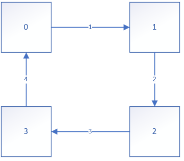

# 动态规划

* 使用一个数组进行缓存，该数组成为dp数组
* 计算时使用缓存可以极大减少重复的计算量，节省大量的时间

# 公交站间的距离

**一、for循环逆向遍历**

​		◼通过求余实现逆向遍历

​		◼实现公式： index=index+length mod length

​		◼GoLang语言数组不支持负数索引

```go
//通过for的自减循环实现逆向遍历
for i:=start+len(arr);i>0;i--{
    fmt.Println(arr[i%len(arr)])
}
```

**二、圆周运动路径的选取问题**

​		◼针对数组的索引对应站点，元素对应站点正向到下一个站点的路径的情况

​		◼顺时针运动则选结点前的路径

​		◼逆时针运动则选结点后的路径（转化成后面结点到该结点的顺序路径）

```go
length:=len(distance)
//顺序遍历
for i:=start;i<length;i++{						//取结点前的路径
    fmt.Println("站点%d 到下一个站点的距离%d",i,distance[i])
}
//逆序遍历	
for i:=start+len(distance);i>0;i++{				//取结点后的路径
    fmt.Println("站点%d 到下一个站点的距离%d",i%length,distance[(i-1)%length])
}
```




**三、通过数组和求余实现圆周运动**

​		◼可以用两个数组模拟一个圆周运动

​		◼**通过求余运算只需一个数组就可以模拟圆周运动**

​		◼顺序圆周运动使用**for递增循环**，比较式要多加个`len(arr)`

​		◼逆向圆周运动使用**for递减循环**，索引值多加个`len(arr)`

```go
//顺时针做圆周运动
for i:=start;i<len(distance)*2;i++{
    //自增循环在判断式子加len(arr)
    fmt.Println("index=",i%len(distance))
}
//逆时针做圆周运动
for i:=start+len(distance);i>0;i--{
    //自减循环在索引式子加len(arr)
    fmt.Println("index:",i%len(distance))
}
```


# 最长增序列/最长减序列的长度

**一、从左到右最长增序列**

```go
//创建dp数组
dpInc:=make([]int,len(arr))
//遍历arr数组
for i,v:=range arr{
    //设置缓存初始值，一个元素的最短子序列为1
    dpInc[i]=1
    //max默认为dp数组对应的值
    max:=dpInc[i]
    //循环[0:i]范围
    for j:=0;j<i;j++{
        //如果v大于arr[j]，则v可参与组成增序列
        if v>arr[j]{
            //如果长度最大，则得到最长增序列
            if dpInc[i]+dpInc[j]>max{
                max=dpInc[j]+1
            }
        }
    }
    dpInc[i]=max
}
```

**二、从右到左最长减序列**

```go
dpDec:=make([]int,len(arr))

for i:=len(arr)-1;i>-1;i--{
    dpDec[i]=1
    max:=dpDec[i]
    for j:=len(arr)-1;j>i;j--{
        if arr[i]>arr[j]{
            if dpDec[i]+dpDec[j]>max{
                max=dpDec[j]+1
            }
        }
    }
    dpDec[i]=max
}
```

**三、最长金字塔队列人数（不能等于）**

* 从左到右最长递增子序列的dp数组+从右到左最长递减子序列的dp数组-1 为金字塔队列的人数，其中最大值为最长金字塔队列人数

```go
dpInc:=make([]int,len(arr))

for i,v:=range arr{
    dpInc[i]=1
    max:=dpInc[i]
    for j:=0;j<i;j++{
        if v>arr[j]{
            if dpInc[i]+dpInc[j]>max{
                max=dpInc[j]+1
            }
        }
    }
    dpInc[i]=max
}

dpDec:=make([]int,len(arr))

for i:=len(arr)-1;i>-1;i--{
    dpDec[i]=1
    max:=dpDec[i]
    for j:=len(arr)-1;j>i;j--{
        if arr[i]>arr[j]{
            if dpDec[i]+dpDec[j]>max{
                max=dpDec[j]+1
            }
        }
    }
    dpDec[i]=max
}
maxNum:=0
for i:=0;i<len(dpInc);i++{
    if dpInc[i]+dpDec[i]-1>maxNum{
        maxNum=dpInc[i]+dpDec[i]-1
    }
}
```


