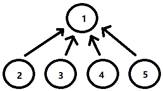

# 并查集

## 并查集的概述

**一、并查集的基本操作**

​		◼初始化

​		◼查询

​		◼合并

**二、查并集的作用**

​		◼处理不相交集合的合并问题

​		◼求连通子图

​		◼求最小生成树

​		◼求最近祖先（`LCA`）

**三、并查集的分类**

​		◼非路径压缩的并查集

​		◼路径压缩的并查集

## 初始化(`init`)

**一、初始化过程**

​		◼如果有n个元素，则使用一个数组`arr`存储每个元素的父节点

​		◼构建`init()`函数，默认数组索引为元素编号，数组元素为对应元素的父节点

​		◼初始化时默认每个元素的父节点为本身


```c
int arr[MAX]
void init(int n){
    for(int i=0;i<n;i++){
        arr[i]=i;			//给每个元素设置编号
    }
}
```

## 查询(`find`)

**一、查询的方式**

​		◼祖先的特性：父节点为本身

​		◼使用递归找到i的祖先并返回

**二、查询--非路径压缩过程**

```c
int find(int i){
    if(arr[i]==i){			//如果元素i的祖先为它本身
        return i;			//则返回该编号
    }
    return find(fa[i])   	//如果编号i的祖先不是本身则继续递归
}
```


**三、查询--路径压缩过程**

​		◼`find()`函数在查询过程中会重构路径结构

```c
int find(int i){
    if(i==arr[i]){			//如果i的父结点为本身则返回
        return i;
    }
    arr[i]=find(arr[i])		//递归获取祖先，并接收祖先结点
    return arr[i]			//返回获取的祖先
}
```



## 合并(`union`)

**五、合并(`union`)**

​		◼满足某种条件则调用`union`函数实现合并

​		◼通过修改集合祖先的父结点实现集合的合并

​		◼先使用`find()`获取两个元素的祖先

​		◼将一个祖先的父结点修改为另一个祖先实现集合的合并

```c
void Union(int i,int j){
    int i_fa=find(i);		//获取i的祖先
    int j_fa=find(j);		//获取j的祖先
    arr[i_fa]=j_fa;			//将i_fa结点的头结点改为j_fa
}
```


