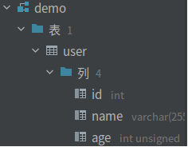

# Xorm

## 官网

[XORM官方中文文档](https://xorm.io/zh/docs/chapter-05/1.conditions/)

[参考中文文档](https://gitea.com/xorm/xorm/src/branch/master/README_CN.md)

## 框架作用

* 支持Struct和数据库之间的灵活映射，支持自动同步
* 支持事务
* 支持原始SQL语句和ORM操作的混合执行
* 使用连写简化调用
* 支持IN,WHERE,LIMIT,JOIN,HAVING等作为条件获取数据集
* 支持缓存
* 支持记录版本（乐观锁）
* 通过`xorm.io/reverse`支持数据库字段生成xorm结构体
* 通过`xorm.io/builder`内置SQL Builder支持

## 下载安装

```shell
go get xorm.io/xorm
```

# 连接数据库

**一、需要的参数**

* 连接名：个人使用一般为root
* 密码
* ip
* 端口：一般为3306
* 数据库名
* 字符编码：最好是utf8mb4

```go
var (
	user	="root"
    pwd		="123456"
    ip		="127.0.0.1"
    port	="3306"
    db		="demo"
    charset	="utf8mb4"
)
```

**二、获取数据库连接**

* 使用`xorm.NewEngine()`获取数据库连接
* 需要导入mysql驱动
* 需要将参数组装成数据源

```go
import(
    //需要导入mysql驱动(需要mysql报的init()函数)
	_ "gitbub.com/go-sql-driver/mysql"
    ...
)
func main(){
    //获取数据库连接需要的参数
    var (
		user	="root"
    	pwd		="123456"
    	ip		="127.0.0.1"
    	port	="3306"
    	db		="demo"
    	charset	="utf8mb4"
	)
    //组装数据源
    dataSource:=fmt.Sprintf("%s:%s@tcp(%s:%s)/%s?charset=%s",user,pwd,ip,port,db,charset)
    //获取数据库连接
    engine,err:=xorm.NewEngine("mysql",dataSource)
    if err!=nil{
        fmt.Println(err)
        return
    }
    //使用完则关闭
    defer engine.Close()
}
```

# 将结构体同步至数据库

**一、将结构体字段同步到数据库**

* 常用于demo开发时期，不能用于最终产品，没优化过的数据库执行sql操作效率低下
* 使用`engine.Sync()`将结构体的字段同步到mysql
* 同步字段时，会创建新的表或更新同名的表，同步过程会将大写字母变成小写字母

```go
type User struct{
    Id 		int64	`xorm:"id"`
    Name	string	`xorm:"name"`
    Age		uint8	`xorm:"age"`
    Passwd string 	`xorm:"varchar(200)"`		//设置字段属性
    Created time.Time `xorm:"created"`			//使用钩子函数，创建时自动写入时间
    Updated time.Time `xorm:"updated"`			//使用钩子函数，更新时自动写入时间
}
func main(){
    ...
    获取数据库连接，连接名为engine
    ...
    err:=enginr.Sync(&User{})
    if err=nil{
        fmt.Println(err)
    }
}
```



# 数据插入

* 输入数据时，默认插入与结构体同名的表（大写自动转为小写）

## 插入单条数据

**一、使用`InsertOne()`插入单条数据**

* 输入结构体或结构体指针可以插入数据
* 返回受影响行数和错误
* id自增时可以不设值

```go
var num int64
var err error
num,err=engine.InsertOne(&User{Id:1,Name:"zhangsan",Age:18})
if err!=nil{
    fmt.Println(err)
    return
}
fmt.Println(num)
```

**二、使用`Insert()`插入单条数据**

* 输入结构体或结构体指针可以插入数据
* 返回受影响行数和错误
* id自增时可以不设值

```go
var num int64
var err error
num,err=engine.Insert(&User{Id:1,Name:"zhangsan",Age:18})
if err!=nil{
    fmt.Println(err)
    return
}
fmt.Println(num)
```

## 插入多条数据

**一、使用多个结构体或结构体指针插入数据**

* 使用`Insert()`输入多个结构体和结构体指针

```go
var err error
var num int64
//构造结构体
user1:=&User{Id:4,Name:"zhangsan",Age:20,Birthdat:"2001-11-01"}
user1:=&User{Id:5,Name:"lisi",Age:19,Birthdat:"2002-11-02"}
//插入多个结构体数据
num,err=engine.Insert(user1,user2)
if err!=nil{
    fmt.Println(err)
    return
}
fmt.Println(num)
```

**二、使用切片插入数据**

* 使用`Insert()`输入切片

```go
var err error
var num int64
//构造结构体
user1:=&User{Id:4,Name:"zhangsan",Age:20,Birthdat:"2001-11-01"}
user1:=&User{Id:5,Name:"lisi",Age:19,Birthdat:"2002-11-02"}
//构造结构体切片
users:=make([]*User,0,5)
users=append(users,user1,user2)
//使用切片插入数据
num,err=engine.Insert(users)
if err!=nil{
    fmt.Println(err)
    return
}
fmt.Println(num)
```

## 指定表插入数据

**一、指定表插入数据**

* 在没有定义结构体的情况下，需要指定表才能插入数据
* 使用`Table()`指定表
* 插入单个数据时，使用`map[string]interface{}`编写数据
* 插入多个数据时，使用`[]map[string]interface{}`编写数据
* 指定表和编写数据时，表名和字段要对应上数据库里的内容

```go
var err error
var num int64
//指定表
num,err=engine.Table("user").Insert(map[string]interface{}{
    //使用map[string]interface{}编写数据
    "id":	"8",
    "name":	"zhangwu",
    "age":	20,
    "birthday":	"2002-10-22",
})
if err!=nil{
    fmt.Println(err)
    return
}
fmt.Println(num)
```

# 数据更新

## 根据主键更新数据

**一、根据id主键更新数据**

* 使用`ID()`指定主键id
* 使用`Update()`更新数据
* 要求结构体的`Id`字段类型为`int64`

```go
var num int64
var err error
//编写修改的值
data:=&User{Age:15}
//进行修改操作
num,err=engine.ID(1).Update(data)
//相当于sql语句：update user set age=15 where id=1;
if err!=nil{
    fmt.Println(err)
    return
}
fmt.Println(num)
```

## 条件更新数据

* 需要编写两个对象，一个用于修改值，一个作为修改条件
* 使用`Update()`更新数据
* `Update()`函数里第一个结构体用于修改数据，第二个结构体用于当作更新条件

```go
var num int64
var err error
//编写修改的值
data:=&User{Age:15}
where:=&User{Name:"wanger",Age:19}
//进行修改操作
num,err=engine.ID(1).Update(data,where)
//相当于sql语句：update user set age=15 where name="wanger" and age=19;
if err!=nil{
    fmt.Println(err)
    return
}
fmt.Println(num)
```

## 条件字段在集合内更新数据

**二、根据字段集合更新数据**

* 使用`In()`输入字段和字段数据的范围
* 如果字段的数据在范围内则修改，不在则不修改

```go
var num int64
var err error
//编写修改的值
data:=&User{Age:20}
ids:=[]int64{7,8,9}
//输入字段和字段的范围进行修改操作
num,err=engine.In("id",ids).Update(data)
//相当于sql语句：update user set age=20 where id IN(7,8,9);
if err!=nil{
    fmt.Println(err)
    return
}
fmt.Println(num)
```

## 更新所有数据里某个值

* 使用`Update()`更新数据
* 不带任何条件时会更新所有数据

```go
var num int64
var err error
//编写修改的值
data:=&User{Age:15}
//进行修改操作
num,err=engine.Update(data)
//相当于sql语句：update user set age=15;
if err!=nil{
    fmt.Println(err)
    return
}
fmt.Println(num)
```

## 强制更新结构体内的空值

* 当结构体的某字段为空值时，不会对数据库对应字段的数据进行更新操作

* 需要使用`Cols()`进行强制更新
* `Cols()`可以指定多个数据库字段

```go
var num int64
var err error
//编写修改的值
data:=&User{Age:15}
//进行强制修改操作
num,err=engine.ID(8).Cols("birthday").Update(data)
if err!=nil{
    fmt.Println(err)
    return
}
fmt.Println(num)
```

## 原始sql语句更新数据

* 使用`Exec()`运行原始的sql语句
* 使用`?`作为预加载符号

```go
id:=1
age:=20
result,err:=engine.Exec("update user set age=? where id=?;",age,id)
if err!=nil{
    fmt.Println(err)
    return
}
fmt.Println(result)
```

# 数据删除

## 根据主键删除记录

* 使用`ID()`确定主键id的值
* 使用`Delete()`删除数据
* 需要放入空值结构体用于确定删除哪个表的数据

```go
var err error
var num int64
//使用id主键确定行进行删除
num,err:=engine.ID(8).Delete(&User{})
if err!=nil{
    fmt.Println(err)
    return
}
fmt.Println(num)
//相当于sql语句：delete from user where id=8;
```

## 条件删除记录

* 将选择条件写入结构体里，然后删除记录

```go
var err error
var num int64
//删除name的指定值
num,err:=engine.Delete(&User{Name:"zhangsan"})
if err!=nil{
    fmt.Println(err)
    return
}
fmt.Println(num)
//相当于sql语句：delete from user where name="zhangsan";
```

## 指定表删除记录

* 使用`Table()`指定表
* 将选择条件写入结构体里，然后删除记录

```go
var err error
var num int64
//删除name的指定值
num,err:=engine.Table("user").Delete(&User{Name:"zhangsan"})
if err!=nil{
    fmt.Println(err)
    return
}
fmt.Println(num)
//相当于sql语句：delete from user where name="zhangsan";
```

## 原始sql语句删除

* 使用`Exec()`进行原始sql语句删除
* result里可以获取影响的行数和处理到最后一行的行id

```go
result,err:=engine.Exec("delete from user where id=6")
if err!=nil{
    fmt.Println(err)
    return
}
fmt.Println(result)
```

# 查询

## 单条查询

**一、单行条件查询**

* 使用`Get()`获取一行数据
* 将选择条件写入结构体指针里可以实现条件查询
* 查询完后会将结果返回到传入的结构体指针里
* 不能使用结构体，否则值返回会失败

```go
//创建结构体指针，写入查询条件
user1:=&User{Id:1}
//使用Get获取单行数据，结果返回到user1里
ok,err:=enginr.Get(user1)
if err!=nil{
    fmt.Println(err)
    return
}
//打印执行结果和数据
fmt.Println(ok,user1)
//相当于sql语句：select * from user where id=1 limit 1;
```

**二、条件查询指定表的指的定字段数据**

* 使用`Cols()`指定返回字段
* 使用`Table()`指定表
* 使用`Where()`进行条件查询
* 将指针传入`Get()`方法里才能获取数据

```go
//使用基本数据接收值，放入顺序要与指定行相对应
var id int64
var name string
ok,err:=engine.Cols("id","name").Table("user").Where("id=?",1).Get(&id,&name)
if err!=nil{
    fmt.Println(err)
    return
}
fmt.Println(ok,num,name)
//相当于sql语句：select id,name from user where id=1 limit 1;
```

```go
//使用散列表接收数据
ValueMap:=make(map[string]interface{},5)
ok,err:=engine.Cols("id","name").Table("user").Where("id=?",1).Get(&ValueMap)
if err!=nil{
    fmt.Println(err)
    return
}
fmt.Println(ok)
fmt.Println(ValueMap)
```

```go
//使用切片接收数据，顺序与指定行相对应
ValueSlice:=make([]interface{},5)
ok,err:=engine.Cols("id","name").Table("user").Where("id=?",1).Get(&ValueSlice)
if err!=nil{
    fmt.Println(err)
    return
}
fmt.Println(ok)
fmt.Println(ValueSlice)
```

## 多行查询

**一、一般多行条件查询**

* 使用`Cols()`指定返回字段
* 使用`Table()`指定表，输入的结构体名有对应的表可以不用指定
* 使用`Where()`进行条件查询，条件语句要用`sql`语句编写
* 使用`And()`进行多条件拼接，一个`Where`可以写多个条件
* 使用`Distinct()`指定字段去重查询

```go
var ValueSlice []User
var err error
err =engine.Cols("id","name","age").		//选择返回行
Table("user").Where("age>? and id>?",15,3).Find(&ValueSlice)//指定表进行条件查询
if err!=nil{
    fmt.Println(err)
    return
}
fmt.Println(ValueSlice)						//返回结构体切片
```

**二、排序查询**

* 使用`Desc()`进行倒序排序
* 使用`Asc()`进行正序排序

```go
var ValueSlice []User
var err error
err =engine.Table("user").Desc(id).Find(&ValueSlice)//倒序排列
if err!=nil{
    fmt.Println(err)
    return
}
fmt.Println(ValueSlice)						//返回结构体数据到切片
```

**三、分组查询**

* 分组查询要经常结合聚集函数使用，使用只能用原始sql语句编写查询
* 使用`SQL()`执行原始sql语句
* 使用`Find()`获取结果集

``` go
var s []int64
var err error
err=engine.SQL(`select count(*) from user group by birthday`).Find(&s)
if err!=nil{
    fmt.Println(err)
    return
}
fmt.Println(s)						//返回结构体切片
```

**四、分页查询**

* 使用`limit()`进行分页查询

```go
var ValueSlice []User
var err error
err=engine.Cols("name","age").Table("user").Limit(0,3).Find(&ValueSlice)
if err!=nil{
    fmt.Println(err)
    return
}
fmt.Println(ValueSlice)						//返回结构体切片
```

## 子查询

### builder包中子查询where()常用参数

| 参数                        | 作用      |
| --------------------------- | --------- |
| builder.Eq{键值对}          | 等于      |
| builder.Gt{键值对}          | 大于      |
| builder.Gte{键值对}         | 大于等于  |
| builder.Lt{键值对}          | 小于      |
| builder.Lte{键值对}         | 小于等于  |
| builder.Neq{键值对}         | 不等于    |
| builder.IsNull{"字段"}      | 空        |
| builder.NotNull{"字段"}     | 非空      |
| builder.Not{键值对}         | 非        |
| builder.Between{结构体数据} | 在...之间 |

### 列子查询

* 使用`builder`包的函数实现子查询
* 使用`In()`筛选字段数据在集合范围内的行，第一个值用于确定字段，后面的值为范围
* 使用`builder.Select()`进行子查询，可以筛选字段获取集合
* 使用`builder.From()`确定子查询数据来源
* 使用`builder.Where()`对子查询进行条件选择
* `builder.Eq{"字段":值}`使用键值对匹配数据

```go
var ValueSlice []User
var err error
//获取name、age字段数据
err=engine.Cols("name","age").Table("user").
	//使用子查询查询id=1的行的birthday
	In("birthday",builder.Select("birthday".From("user").Where(builder.Eq{"id":1}))).
	Find(&ValueSlice)
if err!=nil{
    fmt.Println(err)
    return
}
fmt.Println(ValueSlice)						//返回结构体切片
//相当于sql语句：select name,age from user where birthday in(
//				select birthday from user where id=1)
```

## 查询是否存在值

* 使用`Exist()`检测是否存在值

```go
var ok bool
var err error
ok,err=engine.Table("user").Id(1).Exist()
if err!=nil{
    fmt.Println(err)
    return
}
fmt.Println(ok)
```

## 条件遍历数据库

**一、`Iterate()`条件遍历数据库并缓存数据**

* 使用`Iterate()`进行条件遍历数据库
* 使用`BufferSize()`可以一次获取多条数据并缓存，减少查询数据库的次数
* 使用`Iterate()`方法需要输入条件结构体和实现匿名方法
* `Iterate()`里匿名函数的`bean`为1条，通过断言获取数据

```go
var err error
//编写查询条件
choice:=&User{Birthday:"2000-10-10"}
//使用缓存一次读取多条数据并1个1个输出，实现匿名函数获取数据
err=engine.BufferSize(5).Iterate(choice,func(idx int,bean interface{})error{
    fmt.Println(bean.(*User))
    time.Sleep(time.Second)
    return nil
})
if err!=nil{
    fmt.Println(err)
    return
}
```

**二、`rows()`条件遍历数据库**

* 使用`Rows()`获取遍历对象
* 使用`Next()`查看是否还有值
* 使用`Scan()`获取数据

```go
var row *xorm.Rows
var err error
//编写条件
choice:=&User{Birthday:"2000-10-10"}
//输入条件获取遍历对象
row,err=engine.Rows(choice)
if err!=nil{
    fmt.Println(err)
    return
}
//使用完关闭对象
defer row.Close()
//结果存储到result
result:=&User{}
//使用row.Next()查看是否有值
for row.Next(){
    //有数据则取出
    err:=row.Scan(result)
    if err!=nil{
        fmt.Println(err)
    }
    //使用数据
    fmt.Println(result)
}
```

# 聚集函数

## 获取记录数

* 使用`Count()`获取记录数

## 求和函数

| 方法      | 作用                                  |
| --------- | ------------------------------------- |
| Sum()     | 获取累加结果，返回float64结果         |
| SumInt()  | 获取累加结果，返回int64结果           |
| Sums()    | 输入多个字段，返回对应字段float64结果 |
| SumsInt() | 输入多个字段，返回对应字段int64结果   |

# 事务

* 使用`NewSession()`获取会话
* 使用`session.Begin()`开启事务
* 使用`session.Commit()`提交事务
* 使用`session.Rollback()`回滚事务

```go
//获取会话
session:=engine.NewSession()
defer session.Close()
//开启事务
err=session.Begin()
if err!=nil{
    fmt.Println(err)
    return
}
//插入数据
_,err=session.Insert(&User{Name:"wangliu",Age:23,Birthday:"1999-10-10"})
	//出错则回滚
if err!=nil{
    fmt.Println(err)
    _=session.Rollback()
    return
}
//查询数据
var ValueSlice []User
err=session.Find(&ValueSlice)
	//出错则回滚
if err!=nil{
    fmt.Println(err)
    _=session.Rollback()
    return
}
fmt.Println(ValueSlice)
//提交事务
err=session.Commit()
	//出错则回滚
if err!=nil{
    fmt.Println(err)
    _=session.Rollback()
    return
}
```

# 乐观锁的使用

* <font color=red>表要有version字段</font>
* 结构体要有version字段，并使用映射
* 使用乐观锁前要查询一次
* 更新数据时要把查询到的`version`写入条件结构体
* <font color=red>乐观锁生效时不会对数据进行修改，如果在执行事务则不会引发报错，不会发生数据回滚</font>

```go
//结构体字段要进行映射
type User struct {
    Id 		int64
    Name	string
    Age		uint8
	Birthday string
	Version  int `xorm:"version"`
}
```

```go
//				乐观锁生效情况
//获取会话对象
session := engine.NewSession()
defer session.Close()
//开启事务
err = session.Begin()
if err != nil {
	fmt.Println(err)
	return
}
//读取数据
var Value User
_, err = session.ID(14).Get(&Value)
if err != nil {
	fmt.Println(err)
	_ = session.Rollback()
	return
}
fmt.Println(Value)
//使用协程模拟其他事务修改数据
go func() {
    //修改数据时需要放入查询到的version
	_, _ = engine.ID(14).Update(&User{Age: 2, Version: Value.Version})
}()
//等待协程执行完毕
time.Sleep(time.Second)
//修改数据时需要放入查询到的version
_, err = session.ID(14).Update(&User{Age: 31, Version: Value.Version})
if err != nil {
    //乐观锁生效时不会引发错误，不会导致数据回滚
	fmt.Println(err)
	_ = session.Rollback()
	return
}
//提交事务
err = session.Commit()
if err != nil {
	fmt.Println(err)
	return
}
```

# 常见方法汇总

| 方法             | 作用                                            |
| ---------------- | ----------------------------------------------- |
| NewEngine()      | 获取一个数据库连接                              |
| NewEngineGroup() | 获取数据库连接组                                |
| Insert()         | 插入数据                                        |
| Table()          | 选择表                                          |
| Get()            | 查询1条记录                                     |
| Where()          | 查询条件，用于查询指定字段的条件查询            |
| Desc()           | 倒序排列                                        |
| Cols()           | 输出字段或强制更新字段                          |
| Exist()          | 检查记录是否存在                                |
| SQL()            | 常用于改、查的sql语句，会返回结果集             |
| Exec()           | 常用于插入、更新和删除的sql语句，不会返回结果集 |
| Find()           | 查询多条记录                                    |
| And()            | 条件与，一般前面跟着Where()                     |
| Distinct()       | 去除某字段的重复值                              |
| Alias()          | 给表取别名                                      |


