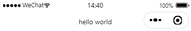

# 小程序简介

## 小程序结构

**一、小程序与网页的区别**

* 运行环境不同：网页运行在浏览器，小程序运行在微信
* API不同：小程序无法调用DOM和BOM的API，但微信环境提供了其他API（物理定位、扫码、支付）
* 开发模式不同
  * 网页：浏览器+集成开发环境
  * 小程序：申请小程序开发账号+安装小程序开发者工具+常见和配置小程序项目

**二、项目基本结构**

* <font color=red>`pages`</font>：存放小程序页面
* `utils`：存放工具性质的模块
* <font color=red>`app.js`</font>：小程序项目入口文件
* <font color=red>`app.json`</font>：小程序项目全局配置文件
* `app.wxss`：小程序项目全局样式文件
* `project.config.json`：项目的配置文件
* `sitemap.json`：配置小程序及其页面是否被允许微信索引

**三、页面的基本结构**

* `.js`文件：页面的脚本文件，存放页面数据、事件处理函数等
* `.json`文件：页面的配置文件、配置窗口的外观、表现
* `.wxml`文件：页面的面板结构文件
* `.wxss`文件：页面的样式表文件

## 小程序JSON配置文件

**一、JSON配置文件**

* 小程序项目的`json`文件
  * 项目根目录的`app.json`
  * 项目根目录的`project.config.json`
  * 项目根目录的`sitemap.json`
  * 每个页面文件夹的`.json`
* 小程序使用`json`格式进行配置

**二、app.json文件**

* 小程序的全局配置文件
* 包含小程序的所有页面路径、窗口外观、界面表现、底部tab

| 配置项          | 作用                                     |
| --------------- | ---------------------------------------- |
| pages           | 记录当前小程序所有页面路径               |
| window          | 全局定义小程序所有页面的背景色文字颜色等 |
| style           | 全局定义小程序组件使用的样式版本         |
| sitemapLocation | 指定`sitemap.json`的路径                 |

**三、sitemap.json文件**

* 配置小程序页面是否被允许微信索引（类似网页的SEO）
* 关闭警告：`project.config.json`的`setting`项里找到`checkSiteMap`设为`false`

| 选项   | 作用           | 可能值          |
| ------ | -------------- | --------------- |
| action | 是否允许被索引 | allow\|disallow |
| page   | 允许索引的页面 | *\|页面路径     |

## 新建页面

**一、创建页面**

* 在`app.json`的`pages`配置项新增页面路径，保存后小程序开发工具自动创建页面文件

**二、修改项目首页**

* 小程序自动把第一个页面路径作为首页
* 调整`app.json`里`pages`选项的页面路径前后顺序

## 小程序代码构成

### WXML

**一、WXML**

* 小程序框架设计的一套标签语言，用于构建小程序页面的结构（类似HTML的地位）

**二、WXML与HTML的不同**

* 标签名称不同
  * HTML：`div`,`span`,`img`
  * WXML：`view`,`text`,`image`,`navigator`
* 属性节点不同
  * HTML：`<a href="#"></a>`
  * WXML：`<navigator url="/pages/demo"></navigator>`

* 提供了类似Vue的模板语法
  * 数据绑定(`v-model`)
  * 列表渲染(`v-for`)
  * 条件渲染(`v-if`)

### WXSS

**一、WXSS**

* 样式语言，描述WXML组件的样式，类似CSS

**二、WXSS和CSS的区别**

* 新增了rpx尺寸单位
  * CSS需要手动进行单位换算
  * rpx在不同大小的屏幕上小程序会自动进行换算
* 提供了全局样式和局部样式
  * `app.wxss`作用于所有小程序页面
  * 局部的`.wxss`样式仅对当前页面有效
* WXSS仅支持部分CSS选择器
  * `.class`
  * `#id`
  * `element`
  * 并集选择器、后代选择器
  * ::after和::before

### JS文件

**一、JS文件**

* 用于处理用户的操作，实现人机交互

**二、JS文件分类**

* `app.js`：小程序项目的入口文件，调用`App()`换算启动小程序
* 页面`.js`文件：页面的入口文件，提供调用`Page()`创建并运行

* 普通的`.js`文件：普通的国内模块文件，用于封装公共函数或属性供页面使用

## 小程序运行环境

**一、微信提供的运行环境**

* 通信模型
  * 渲染层：WXML、WXSS
  * 逻辑层：JS
* 运行机制
* 组件
* API

**二、通信模型**

* 渲染层与逻辑层之间的通信
  * 由微信客户端转发
* 逻辑层与第三方服务器的通信
  * 微信客户端进行转发

**三、小程序启动过程**

* 把小程序的代码包下载到本地
* 解析`app.js`全局配置文件
* 执行`app.js`小程序入口文件，调用`App()`创建小程序示例
* 渲染小程序首页
* 小程序启动完成

**四、页面渲染过程**

* 加载解析页面的`.json`配置文件
* 加载页面的`.wxml`模板和`.wxss`样式
* 执行页面的`.js`文件，调用`Page()`创建页面实例
* 页面渲染完成

## 小程序API

**一、小程序API的分类**

* 事件监听API
  * 以`on`开头，用于监听事件触发
    * `wx.onWindowResize`：监听窗口大小变化
* 同步API
  * 以`Sync`结尾的API
  * 同步API的执行结构通过函数返回值获取，执行出错则抛出异常
    * `wx.setStorageSync("key","value)`：向本地存储键值对
* 异步API
  * 类似`jQuery`的`$.ajax()`函数，通过`success`,`fail`,`complete`接收调用结果
    * `wx.request()`发起伪类请求，使用`success`回调函数接收数据

## 协调开发

**一、基本的项目开发组织结构**


**二、小程序开发流程**


**三、小程序成员管理**


**四、项目成员的权限**


**五、发布上线**

* 上传代码
  * 点击`上传`按钮
  * 填写版本好和项目备注
* 提交审核
  * 开发列表点击提交审核
* 发布
  * 审核通过后可以发布

**六、小程序的推广**

* 基于小程序码的推广
  * 登陆小程序管理后台->设置->基本设置->基本信息->小程序码及线下物料下载

**七、小程序运营数据**

* 小程序后台查看
  * 小程序管理后台->侧边栏->查看相应数据
* 使用小程序数据助手查看

# 组件

## 小程序组件的分类

**一、分类**

* 视图容器
* 基础内容
* 表单组件
* 导航组件
* 媒体组件
* map地图组件
* `canvas`画布组件
* 开放能力
* 无障碍访问

**二、常用的视图容器类组件**

* `view`
  * 普通视图区域
  * 类似HTML的`div`，常用于布局
* `scroll-view`
  * 可滚动的视图区域
  * 用于实现滚动列表效果
* `swiper`和`swiper-item`
* 轮播图容器组件和轮播图item组件

## view和scroll-view的使用

**一、view组件的使用---flex横向布局效果**

* wxss里设置父容器`display`属性值为`flex`

```html
<view class="background">
	<view>A</view>
    <view>B</view>
    <view>C</view>
</view>
```

```css
/*选择类下的view标签*/
.background view{
  width: 100px;
  height: 100px;
  /*文本居中*/
  text-align: center;
  /*设置行高*/
  line-height: 100px;
}
/*伪类选择器的使用*/
.background view:nth-child(1){
  background-color: aqua;
}
.background view:nth-child(2){
  background-color: red;
}
.background view:nth-child(3){
  background-color: blue;
}
/*容器布局*/
.background{
  /*横向布局*/
  display: flex;
    /*同行元素间隔一致*/
  justify-content: space-around;
}
```

**二、纵向滚动效果---scroll-view组件的使用**

* 使用`<scroll-view>`标签作为父容器，在父容器内添加`scroll-y`参数实现纵向滑动

```html
<scroll-view class="background" scroll-y>
	<view>A</view>
    <view>B</view>
    <view>C</view>
</scroll-view>
```

```css
.background view{
  width: 100px;
  height: 100px;
  text-align: center;
  line-height: 100px;
}
/*类选择器 标签选择器:nth-child(子类索引)*/
.background view:nth-child(1){
  background-color: aqua;
}
.background view:nth-child(2){
  background-color: red;
}
.background view:nth-child(3){
  background-color: blue;
}

.background{
  border: 1px solid orange;
  /*限制父容器高度和宽度*/
  height: 120px;
  width: 100px;
}
```

## swiper和swiper-item的使用

**一、轮播图效果**

* 在`swiper`组件设置`indicator-dots`显示轮播点
  * 使用`indicator-color`定义为选中时圆点的颜色
  * 使用`indicator-active-color`定义选中时圆点的颜色
* 使用`swiper-item`定义轮播图元素

```html
<swiper class="swiper-container" indicator-dots>
	<swiper-item>
    <view class="item">A</view>
  </swiper-item>
	<swiper-item>
    <view class="item">B</view>
  </swiper-item>
  <swiper-item>
    <view class="item">C</view>
  </swiper-item>
</swiper>
```

```css
.item{
  height: 100%;
  line-height: 150px;
  text-align: center;
}
/*类选择器 标签选择器:nth-child(子类索引)*/
swiper-item:nth-child(1){
  background-color: aqua;
}
swiper-item:nth-child(2){
  background-color: red;
}
swiper-item:nth-child(3){
  background-color: blue;
}
/*限制轮播图的高度*/
.swiper-container{
  height: 120px;
}
```

**二、轮播图常用属性**

| 属性                   | 类型    | 默认值         | 说明                             |
| ---------------------- | ------- | -------------- | -------------------------------- |
| indicator-dots         | boolean | false          | 显示面板指示点                   |
| indicator-color        | color   | rgba(0,0,0,.3) | 指示点颜色                       |
| indicator-active-color | color   | #000000        | 当前选中的指示点颜色             |
| autoplay               | boolean | false          | 是否自动切换                     |
| intervalber            | number  | 5000           | 自动切换时间间隔                 |
| circular               | boolean | false          | 是否采用衔接滑动<br>循环轮播效果 |

## text和rich-text的使用

**一、文本组件**

* `text`：
  * 文本组件
  * 类似HTML的span标签，行内元素
* `rich-text`
  * 富文本组件
  * 支持把HTML字符串渲染为WXML结构

**二、选中文本内容效果--text组件**

* 使用`text`组件的`user-select`属性实现（`selectable`将弃用）

```html
<view>
    <text user-select>hello world</text>
</view>
```

**三、渲染HTML文本**

* 使用`rich-text`的`nodes`属性设置
* 将`HTML`文本作为`nodes`属性的值（HTML文本的双引号要改成单引号）

```html
<view>
    <rich-text nodes="<h1>hello world</h1>">hello world</rich-text>
</view>
```

## 其他常用组件

### button

**一、button**

* 按钮组件
* 使用`open-type`属性调用微信提供的功能（客服、转发、获取用户授权、获取用户信息）

**二、button的基本使用**

```html
<button>click</button>
```

**三、不同类型的button**

```html
<!-- -- tpye类型 -- -->
<!-- 微信主色调按钮 -->
<button type="primary">click</button>
<!-- 警告按钮 -->
<button type="warn">click</button>
<!-- -- 尺寸类型 -- -->
<button size="mini">click</button>
<!-- -- 镂空类型 -- -->
<button plain>click</button>
```

### image

**一、image**

* 图片组件
* `image`默认宽度为`300px`、高度`240px`

**二、image的基本使用**

* 使用`src`指定路径

```html
<image src="#"></image>
```

**三、image组件的mode属性**

* 使用`mode`属性指定图片的裁剪和缩放模式

| mode值      | 说明                                                         |
| ----------- | ------------------------------------------------------------ |
| scaleToFill | 缩放模式，不保持横纵比缩放图片，图片的宽高拉伸至填满image元素 |
| aspectFit   | 缩放模式，保持横纵比缩放                                     |
| aspectFill  | 保持横纵比缩放，保证短边完全显示出来                         |
| widthFix    | 宽度不变，高度自动变化                                       |
| heightFix   | 高度不变，宽度自动变化                                       |

### navigator

**一、navigator**

* 页面导航组件
* 类似html的a链接

# WXML

## 数据渲染

**一、数据渲染步骤**

* 在`data()`里定义数据
* 在WXML中使用数据

**二、静态渲染键值对**

* 在`网页名.js`文件设置键值对
* 在`wxml`里使用`{{}}`根据键值对输出值

```javascript
Page({
    data:{
        msg:"hello world"
    }
})
```

```html
<view>{{msg}}</view>
```

**三、动态渲染数据**

* 属性的值使用`{{变量}`来绑定（`vue`里相当于`:`）

```html
<image src={{url}}></image>
```

```javascript
Page({
    data:{
        url:"https://www.x.com"
    }
})
```

**四、数字保留位**

* 使用`.toFixed()`实现

```html
<view> {{num}} </view>
```

```javascript
Page({
    data:{
        num:12.34567.toFixed(3)
    }
})
```

## 事件处理

**一、小程序常用事件**

| 类型   | 绑定方式                      | 事件描述                        |
| ------ | ----------------------------- | ------------------------------- |
| tap    | `bindtap` 或 `bind:tap`       | 手指触摸后马上离开（类似click） |
| input  | `bindinput` 或 `bind:input`   | 文本框输入事件                  |
| change | `bindchange` 或 `bind:change` | 状态改变时触发                  |

**二、事件对象的属性列表**

* 事件回调触发时会收到`event`对象

| 属性           | 类型    | 说明                                             |
| -------------- | ------- | ------------------------------------------------ |
| type           | String  | 事件类型                                         |
| timeStamp      | Integer | 页面打开到触发事件所经过的毫秒数                 |
| **target**     | Object  | 触发事件的组件的一些属性值集合                   |
| currentTarget  | Object  | 当前组件的一些属性值集合                         |
| **detail**     | Object  | 额外信息                                         |
| touches        | Array   | 触摸事件，返回触摸点信息的数组（支持多手指触摸） |
| changedTouches | Array   | 触摸事件，当前变化的触摸点信息数组               |

**三、target与currentTarget的区别**

* `target`触发事件的源头组件
* `currentTarget`：是当前事件所绑定的组件（this组件）

**四、触摸事件绑定**

* 使用`bindtap`为组件绑定tap触摸事件
* 在`.js`文件中定义事件处理函数，通过对象`event`接收

```html
<button type="primary" bindtap="btnTapHandler">click</button>
```

```javascript
Page({
  data:{
        ok:true
  },
  btnTapHandler(e){
    console.log(e)
  }
})

```

## 逻辑渲染

**一、三元运算**

* 格式：`{{表达式?true:false}}`

```html
<view>{{ok==true?"对":"错"}}</view>
```

```javascript
Page({
    data:{
        ok:true
    }
})
```

**二、条件渲染**

* `wx:if`,`wx:elif`,`wx:else`实现逻辑显示内容

```html
<view wx:if="{{num==1}}">1</view>
<view wx:elif="{{num==2}}">2</view>
<view wx:else>其他</view>
```

**三、多个组件的展示与隐藏**

* 使用`<block>`标签包裹组件实现（相当于`vue`的`template`）

```html
<block wx:if="{{true}}">
    <view>1</view>
    <view>2</view>
</block>
```

## 循环渲染

**一、循环渲染数组**

* 使用`wx:for`属性实现，用`{{}}`绑定数组
* 使用`index`获取索引，使用`item`获取值

```html
<view wx:for="{{list}}">
  索引：{{index}}，值：{{item}}
</view>
```

```javascript
data: {
	list:["a","b","c"],
},
```

**二、索引名与变量名的重命名**

* `wx:for-index`实现索引重命名
* `wx:for-item`实现项的重命名

```html
<view wx:for="{{list}}" wx:for-index="idx" wx:for-item="obj">
  索引：{{idx}}，值：{{obj}}
</view>
```

**三、指定key值**

* 使用`wx:key`指定key，指定key不用`{{}}`
* 可以用使用作为key

```html
<view wx:for="users" wx:key="id">{{item.name}}</view>
<view wx:for="users" wx:key="index">{{item.name}}</view>
```

```javascript
data:{
    users:[
        {id:1,name:"red"},
        {id:2,name:"green"},
        {id:3,name:"blue"}
    ]
}
```

## 事件修改参数和传参

**一、事件修改参数**

* 通过调用`this.setData()`方法，输入对象修改`data`对象里的数据
* 使用`this.data.变量名`获取变量数值

```javascript
btnTapHandler(){
	this.setData({
  		num: this.data.num+1
	})
}
```

**二、传递参数**

* 在`WXML`里在属性使用`data-*`形式定义参数，`*`为变量名，并使用`{{value}}`赋值
* 参数会放置在`event.target.dataset`对象里，使用`.变量名`获取

```html
<button bindtap="btnTapHandler" data-info="{{2}}">click</button>
```

```javascript
btnTapHandler(event){
	let info=event.target.dataset.info;
	console.log(info);
},
```

**三、文本框输入的使用与数据绑定**

* 使用`bindinput`绑定文本框输入事件，
* 使用`event.detail.value`获取文本框最新内容
* 使用`value`属性设置初始值，使用`{{ }}`可以动态绑定初始值
* 每次修改要重新手动编译

```html
<input value="{{content}}" bindinput="inputHandler"></input>
<view>{{content}}</view>
```

```javascript
data: {
    content:"213"
}
inputHandler(event){
	console.log(event.detail.value)
  	this.setData({
    	content: event.detail.value
  	})
},
```

## 隐藏元素

**一、隐藏组件**

* 使用`hidden`属性设置隐藏，默认为`false`

```html
<view hidden="{{ok}}">hello world</view>
```

**二、wx:if与hidden的对比**

* `wx:if`：以动态创建和移除元素，来控制元素的展示与隐藏
* `hidden`：以切换样式的方式，来控制元素的显示与隐藏

# WXSS

## WXSS的扩展

**一、WXSS的扩展特性**

* rpx尺寸单位
* `@import`样式导入

## rpx单位

**一、rpx尺寸**

* 使用rpx单位解决屏幕适应，一般px的基础上`x2`
* 实现原理：宽度上等分750份

## 样式导入

**一、样式导入**

* 使用`@import`实现，导入时需要外联样式表的相对路径

```css
@import "common.wxss";
```

## 全局样式与局部样式

**一、全局样式**

* 在`app.wxss`定义全局样式，作用于每个页面

**二、局部样式**

* 在页面的`.wxss`文件定义的样式
* 局部样式会覆盖全局样式

# 全局配置

## 常用全局配置项

**一、常用配置项**

* `Pages`
  * 小程序所有页面的存放路径
* `window`
  * 全局小程序窗口外观
* `tabBar`
  * 小程序底部`tabBar`效果
* `style`
  * 新版的组件样式

**二、小程序窗口组成部分**

* 导航栏区域
* 背景区域（默认不可见，需要开启下拉刷新）
* 页面的主体区域

## window-导航栏

**一、导航栏常用配置项**

| 属性名                       | 类型     | 默认值  | 说明                                   |
| ---------------------------- | -------- | ------- | -------------------------------------- |
| navigationBarTitleText       | String   | 字符串  | 导航栏标题文字内容                     |
| navigationBarBackgroundColor | HexColor | #000000 | 导航栏背景颜色                         |
| navigationBarTextStyle       | String   | white   | 导航栏标题颜色（只有While和Black）     |
| backgroundColor              | HexColor | #ffffff | 窗口的背景色                           |
| backgroundTextStyle          | String   | dark    | 下拉loading样式（dark/light）          |
| enablePullDownRefresh        | Boolean  | false   | 全局开启下拉刷新                       |
| onReachBottomDistance        | Number   | 50px    | 页面上拉触底事件场触发时距页面底部距离 |

**二、设置导航栏标题**

* 找到`app.json->window->navigationBarTitleText`
* 修改`navigationBarTitleText`的值

```json
"navigationBarTitleText": "hello world",
```



**三、导航栏背景色**

* 找到`app.json->window->navigationBarBackgroundColor`
* 修改`navigationBarBackgroundColor`的值

```json
"navigationBarBackgroundColor": "#C71585",
```


**四、设置导航栏标题颜色**

* 找到`app.json->window->navigationBarTextStyle`
* 修改`navigationBarTextStyle`的值

```json
"navigationBarTextStyle":"white",
```


## window-下拉刷新

**一、全局开启下拉刷新功能**

* 通过手指在屏幕上的下拉滑动操作实现重新加载页面数据
* 添加`app.json->window->enablePullDownRefresh`
* `enablePullDownRefresh`值设为true
* **模拟器不能完全还原手机效果**

**二、设置下拉窗颜色**

* 添加`app.json->window->backgroundColor`

```json
"backgroundColor":"#efefef"
```


**三、下拉刷新loading的样式**

* `app.json->window->backgroundTextStyle`指定dark值

```json
"backgroundTextStyle":"dark",
```


## window-上拉触底

**一、设置上拉触底距离**

* `app.json->window->onReachBottomDistance`，默认50px
* 页面滚动条到底部不足50px时触发加载下一页数据

```json
"onReachBottomDistance":100
```

## tabBar

**一、tabBar**

* tabBar常用于实现多页面的快速切换
* tabBar最少2个，最多5个
* `tabBar`分类
  * 底部tabBar
  * 底部tabBar


**二、tabBar组成部分**

* `backgroundColor`：tabBar背景色
* `selectIconPath`：选中时图片路径
* `borderStyle`：tabBar上边框颜色
* `iconPath`：未选中时图片路径
* `selectedColor`：tab上文字选中时的颜色
* `color`：tab上文字的默认颜色（未选中）

**三、设置tabBar**

* tabBar的选项

| 属性            | 类型      | 必填 | 默认值 | 描述                                |
| --------------- | --------- | ---- | ------ | ----------------------------------- |
| position        | String    | 否   | bottom | tabBar位置（bottom/top）            |
| borderStyle     | String    | 否   | black  | tabBar边框颜色（black/white）       |
| color           | HexColor  | 否   |        | tab上文字的默认颜色                 |
| selectedColor   | HexColor  | 否   |        | tab上文字选中时的颜色               |
| backgroundColor | HexColor  | 否   |        | tab的背景色                         |
| **list**        | **Array** | 是   |        | **tab页签的列表（最少2个最多5个）** |

* tab项的配置选项

| 属性             | 类型   | 必填 | 描述                                            |
| ---------------- | ------ | ---- | ----------------------------------------------- |
| pagePath         | String | 是   | 页面路径，页面必须在pages中预先定义             |
| text             | String | 是   | tab上显示的文字                                 |
| iconPath         | String | 否   | 未选中是的图标路径（position为top时不显示icon） |
| selectedIconPath | String | 否   | 选中时的图标路径（position为top时不显示icon）   |

```json
"tabBar":{
	"list":[
  	{
    	"pagePath": "pages/index/index",
    	"text":"one"
  	},
  	{
    	"pagePath": "pages/logs/logs",
    	"text":"two"
  	}]
},
```

**四、设置图标**

* 图标来源：[iconfont-阿里巴巴矢量图标库](https://www.iconfont.cn/collections/index?spm=a313x.home_index.i3.4.58a33a81T7oxfX&type=1)

# 页面配置

**一、页面配置和全局配置**

* 全局配置作用于所有页面，页面配置作用于单个页面

**二、页面配置**

* 在页面的`.json`文件设置
* 配置项与全局配置的项相同

# 数据请求

## 请求限制

**一、请求限制**

* 只能请求HTTPS类型的接口
* 将接口的域名添加到信任列表中
* 域名需要经过ICP备案
* 不能使用IP或localhost

**二、配置request合法域名**

* 打开`登陆微信小程序管理后台.开发.开发管理.服务器域名.扫码验证.修改request合法域名`

## GET请求

**一、发起GET请求**

* 使用`wx.request()`发起GET请求
* 建议使用云函数[Go_函数计算-阿里云帮助中心 (aliyun.com)](https://help.aliyun.com/zh/fc/user-guide/go-1/?spm=a2c4g.11186623.0.0.57556405UB2o0x)

```javascript
getInfo(){
    wx.request({
        url:'https地址',
        method:'请求类型',
        data:{
            key1:value1,
            key2:value2
        },
        //请求成功时调用
        success:(res)=>{
            
        },
        //失败时调用
    	fail:(res)=>{
      		console.log(res)
    	},
        //请求完成时调用
        complete:(handlerLog)=>{
            console.log(handlerLog)
        }
    })
}
```

```javascript
btnTapHandler(event){
  wx.request({
    url:"https://1422130925398336.cn-hangzhou.fc.aliyuncs.com/2016-08-15/proxy/go_test/test/",
    method:"GET",
    success:(res)=>{
        console.log(res.data.msg)
    }
  })
},
```

## POST请求

**一、发起POST请求**

* 使用`wx.request()`发起POST请求
* 把`method`设置为`POST`

# 项目示例----本地生活

**一、新建项目**

* 在`app.json`里添加主页，并将主页设为第一页

```json
  "pages":[
    "pages/home/home"
  ],
```

**二、设置导航栏样式**

* 在`app.json`的`window`项设置导航栏样式

```json
"window":{
    //下拉框背景
	"backgroundTextStyle":"light",
    //导航栏背景颜色
	"navigationBarBackgroundColor": "#2b4b6b",
    //导航栏标题内容
	"navigationBarTitleText": "本地生活",
    //文本颜色
	"navigationBarTextStyle":"white",
}
```

**三、设置tabBar**

* 在`app.json`的`window`项设置tabBar效果

```json
  "tabBar":{
    "list":[
      {
        "pagePath": "pages/home/home",
        "text":"首页",
        "iconPath": "icon/home.png",
        "selectedIconPath": "icon/home-fill.png"
      },
      {
        "pagePath": "pages/index/index",
        "text":"消息",
        "iconPath": "icon/message-comments.png",
        "selectedIconPath": "icon/message-comments-fill.png"
      },
      {
        "pagePath": "pages/logs/logs",
        "text":"联系我们",
        "iconPath": "icon/phone.png",
        "selectedIconPath": "icon/phone-fill.png"
      }
    ]
  },
```

**四、设置轮播图**

* 获取轮播图数据，后端传送数组json到前端

```javascript
data: {
	swiperList:[]
},
getSwiperList(){
    wx.request({
        url:'https地址',
        method:'GET',
        //请求成功时调用
        success:(res)=>{
			this.setData({
                //赋值
				swiperList: res.data
			})
        },
        //失败时调用
    	fail:(res)=>{
      		......
    	},
        //请求完成时调用
        complete:(handlerLog)=>{
            ......
        }
    })
},
onLoad(options) {
    //初始化加载
	this.getSwiperList()
},
```

* 设置轮播图
  * `indicator-dots`：显示点
  * `circular`：循环衔接
  * `autoplay`：自动切换
  * 使用`wx:for`循环处理数组

```html
<swiper class="swiper-container" indicator-dots circular autoplay>
  <view wx:for="{{swiperList}}" wx:key="{{index}}">
    <swiper-item>
      <image src="{{item}}" mode="scaleToFill" ></image>
    </swiper-item>
  </view>
</swiper>
```

* 设置轮播图样式

```css
/*轮播图大小*/
swiper{
  height: 350rpx;
  width: 100%;
}
/*图片大小*/
swiper image{
  width: 100%;
  height:100%;
}
```

**五、九宫格效果**

* 获取九宫格数据（和获取轮播图数据方式一样）

* `wx:for`设置九宫格

```html
<view class="grid-list">
  <view class="grid-item" wx:for="{{gridList}}" wx:key="{{index}}">
    <image src="{{item.icon}}"></image>
    <text>{{item.name}}</text>
  </view>
</view>
```

* 设置九宫格样式

```css
.grid-list{
  /*弹性布局*/
  display:flex;
  /*横向弹性溢出换行*/
  flex-wrap:wrap;
  /*设置不同区块的边界线*/
  border-left: 1rpx solid #efefef;
  border-top: 1rpx solid #efefef;
}
.grid-item{
  /*设置item的长和宽*/
  height:200rpx;
  width:33.33%;
  /*弹性布局*/
  display: flex;
  /*设置纵向弹性*/
  flex-direction: column;
  /*组件左右居中*/
  align-items: center;
  /*组件上下居中*/
  justify-content: center;
  /*设置不同item的边界线*/
  border-right: 1rpx solid #efefef;
  border-bottom: 1rpx solid #efefef;
  /*怪异盒，防止容器撑开*/
  box-sizing: border-box;
}
.grid-item image{
  /*设置icon的长和宽*/
  width: 60rpx;
  height:60rpx;
}
.grid-item text{
  /*设置文本大小*/
  font-size: 24rpx;
  /*设置外边距*/
  margin-top: 10rpx;
}
```

**六、图片布局**

* 设置图片区域

```html
<view class="img-box">
  <image src="{{swiperList[0]}}" mode="widthFix"></image>
  <image src="{{swiperList[0]}}" mode="widthFix"></image>
</view>
```

* 设置图片区域样式

```css
.img-box{
    /*弹性布局*/
  display: flex;
   /*设置内边距*/
  padding: 20rpx 10rpx;
   /*设置元素平均间隔*/
  justify-content: space-around;
}
.img-box image{
  /*设置图片宽度，使区域有间隔*/
  width:45%;
}
```

**七、效果图**


# 页面导航

* 页面之间的相互跳转

## 声明式导航

**一、声明式导航**

* 页面上声明`<navigator>`导航组件
* 通过点击`<navigator>`组件实现页面跳转

**二、声明式导航跳转到tabBar**

* `url`参数：表示要跳转的页面地址，必须使用`/`开头
* `open-type`：表示跳转的方式，必须为`switchTab`

```html
<navigator url="/pages/home/home" open-type="switchTab">导航到主页</navigator>
```

**三、声明式导航跳转到非tabBar页面**

* `url`参数：表示要跳转的页面地址，必须使用`/`开头，不能导航到tabBar页面
* `open-type`：表示跳转的方式，必须为`navigate`（可以省略）

```html
<navigator url="/pages/logs/logs" open-type="navigate">导航到日志</navigator>
<navigator url="/pages/logs/logs">导航到日志</navigator>
```

**四、后退导航**

* `open-type`：必须为`navigateBack`（后退导航）
* `delta`：必须是数字，表示后退的层级

```html
<navigator open-type="navigateBack" delta="1">返回上一页</navigator>
```

## 编程式导航

**一、编程式导航**

* 调用小程序的导航API，实现页面的跳转

**二、导航到tabBar页面**

* 使用`wx.switchTab()`实现

| 参数     | 类型     | 必选 | 说明                                                    |
| -------- | -------- | ---- | ------------------------------------------------------- |
| url      | string   | 是   | 需要跳转的tabBar页面路径，开头必须有`\`，路径后不带参数 |
| success  | function | 否   | 接口调用成功的回调函数                                  |
| fail     | function | 否   | 接口调用失败的回调函数                                  |
| complete | function | 否   | 接口调用结束的回调函数（无论接口调用是否成功都会执行）  |

```javascript
wx.switchTab({
	url: '/pages/home/home',
	success: (res) => {},
	fail: (res) => {},
	complete: (res) => {},
})
```

**三、导航到非tabBar页面**

* 使用`wx.navigateTo()`实现

| 参数     | 类型     | 必选 | 说明                                                    |
| -------- | -------- | ---- | ------------------------------------------------------- |
| url      | string   | 是   | 需要跳转的tabBar页面路径，开头必须有`\`，路径后不带参数 |
| success  | function | 否   | 接口调用成功的回调函数                                  |
| fail     | function | 否   | 接口调用失败的回调函数                                  |
| complete | function | 否   | 接口调用结束的回调函数（无论接口调用是否成功都会执行）  |

```javascript
wx.navigateTo({
	url: '/page/demo/demo',
	success: (res) => {},
	fail: (res) => {},
	complete: (res) => {},
})
```

**四、后退导航**

* 调用`wx.navigateBack()`实现

| 参数     | 类型     | 默认值 | 必选 | 说明                                                   |
| -------- | -------- | ------ | ---- | ------------------------------------------------------ |
| delta    | number   | 1      | 否   | 返回页面数                                             |
| success  | function |        | 否   | 接口调用成功的回调函数                                 |
| fail     | function |        | 否   | 接口调用失败的回调函数                                 |
| complete | function |        | 否   | 接口调用结束的回调函数（无论接口调用是否成功都会执行） |

```javascript
wx.navigateBack()
wx.navigateBack({
    delta:2
})
```

## 导航传参

**一、声明式导航传参**

* 使用`navigator`实现跳转时传参
* 在`url`后面使用`?`添加参数
* 使用`&`实现传递多个参数

```html
<navigator url="/page/demo/demo?name=zhangsan&age=20">传递参数</navigator>
```

**二、编程式传参**

* 使用`wx.navigateTo()`实现跳转时传参

```javascript
wx.navigateTo({
    url:"/page/info/info?name=zhansan&age=20"
})
```

## 接收传参

**一、接收参数**

* 在`onLoad(options)`回调方法接收参数
* 使用`options.变量名`获取参数

```javascript
onLoad(options) {
    console.log(options.name)
},
```

# 页面事件

## 下拉刷新

**一、下拉刷新**

* 手指下拉滑动操作，从而重新加载页面数据

**二、启用下拉刷新**

* 全局下拉刷新：找到`app.json`的`window`节点，将`enablePullDownRefresh`设为`true`
* 局部下拉刷新：在`.json`文件，将`enablePullDownRefresh`设为`true`

```json
//局部设置
{
  "usingComponents": {},
   "enablePullDownRefresh":true
}
```

**二、下拉刷新窗口样式**

* 使用`backgroundColor`和`backgroundTextStyle`配置下拉刷新窗口样式
  * `backgroundColor`：配置窗口的背景颜色
  * `backgroundTextStyle`：配置下拉刷新`loading`的样式（`dark`或`light`）

**三、监听页面的下拉刷新事件**

* 使用`onPullDownfresh`回调方法监听
* 需要手动关闭下拉刷新

```html
<view>{{count}}</view>
<button bindtap="add">click</button>
```

```jvavscript
data: {
	count:0
},

add(){
	this.setData({
		count:this.data.count+1
	})
},
onPullDownRefresh() {
	this.setData({
		count:0
	})
},
```

**四、停止下拉刷新**

* 调用`wx.stopPullDownRefresh()`停止下拉刷新

```javascript
data: {
	count:0
},

add(){
	this.setData({
		count:this.data.count+1
	})
},
onPullDownRefresh() {
	this.setData({
		count:0
	})
    wx.stopPullDownRefresh()
},
```

## 上拉触底

**一、上拉触底**

* 手指在屏幕上的上拉滑动操作，实现加载更多数据的行为

**二、监听上拉触底事件**

* `js`文件使用`onReachBottom()`回调方法实现

```javascript
onReachBottom() {
	console.log("触发事件")
},
```

**三、配置触底距离**

* 设置滚动条距离页面底部的一定距离时，触发下拉触底事件
* 在`.json`文件中，通过`onReachBottomDistance`属性配置上拉触底距离（默认50px）

```json
"onReachBottomDistance":150
```

# 项目示例----上拉触底

**一、定义获取随机颜色的方法**

```go
func GetColorList()[][3]float32{
    colorList:=make([][3]float32,0,10)
    for i:=0;i<10;i++{
        var color [3]float32
        for j:=0;j<3;j++{
            color[j]=rand.Float32()*255
        }
        colorList=append(colorList,color)
    }
    return colorList
}
```

**二、页面加载时获取初始数据**

* 定义获取数据函数

```javascript
data: {
    //数据列表
	colorList:[],
},

getColorList(){
	//发起请求
	wx.request({
  		url: 'https://test-go-test-jyxrnztgly.cn-hangzhou.fcapp.run',
  		success:(res)=>{
    		this.setData({
                //数组拼接，通过this.data调用data内的数据
      			colorList:[...this.data.colorList, ...res.data.msg]
    		})
  		},
	})
    //打印列表长度用于观察
	console.log(this.data.colorList.length)
},
//页面初始化加载数据
onLoad(options) {
	this.getColorList()
},
```

**三、渲染UI结构并美化**

```html
<view wx:for="{{colorList}}" wx:key="{{index}}" class="num-item" style="background-color: rgba({{item}});">{{item}}</view>
```

```css
.num-item{
  border: 2rpx solid #efefef;
  border-radius: 8rpx;
  line-height: 200rpx;
  margin:15rpx;
  text-align: center;
  text-shadow: 0 0 5rpx #fff;
  box-shadow: 1rpx 1rpx 6rpx #aaa;
}
```

**四、设置上拉触底事件**

* 使用`this`调用函数

```javascript
onReachBottom() {
	this.getColorList()
},
```

**五、添加loading提示效果**

* 使用`wx.showLoading()`开启加载效果
  * `title`：加载提示文字
  * `mask`：遮罩，关闭加载前，用于阻止用户持续输入
* 使用`wx.hideLoading()`关闭加载效果
* 使用`wx.request()`的回调函数`complete`关闭加载效果

```javascript
getColorList(){
	//开启数据加载效果
	wx.showLoading({
  		title: '数据加载中',
  		mask:true
	})
	wx.request({
  		url: 'https://test-go-test-jyxrnztgly.cn-hangzhou.fcapp.run',
  		success:(res)=>{
    		this.setData({
      			colorList:[...this.data.colorList, ...res.data.msg]
    		})
  		},
  		complete:()=>{
			//关闭数据加载效果
    		wx.hideLoading()
  		}
	})
	console.log(this.data.colorList.length)
},
```

**六、对上拉触底节流处理**

* 在`data`对象定义`isloding`参数
* 发送请求前判断`isloding`是否为`true`，是则`return`否则继续（是否发送请求中）
* 将`isloding`参数设为`true`
* 请求完成后将`isloding`设为`false`
* 新版本自动节流了

```javascript
data: {
	colorList:[],
	isloding:false
},

getColorList(){
    //判断是否在加载其他数据，是则退出
	if(this.data.isloding){
  		return
	}
    //isloding设为true
	this.setData({
  		isloding: true,
	})
	wx.showLoading({
  		title: '数据加载中',
  		mask:true
	})
	wx.request({
  		url: 'https://test-go-test-jyxrnztgly.cn-hangzhou.fcapp.run',
  		success:(res)=>{
    		this.setData({
      			colorList:[...this.data.colorList, ...res.data.msg]
    		})
         },
  		complete:()=>{
            //请求完成，isloding设为false
    		this.setData({
      			isloding:false
    		})
    		wx.hideLoading()
  		}
	})
	console.log(this.data.colorList.length)
},
```

# 生命周期

**一、小程序生命周期**

* 小程序的启动：生命周期的开始
* 小程序的关闭：生命周期的结束
* 小程序运行的过程：小程序运行周期

**二、生命周期分类**

* 应用生命周期
  * 小程序启动->运行->销毁
* 页面生命周期
  * 页面的加载->渲染->销毁

**三、生命周期函数**

* 小程序框架提供的内置函数，伴随生命周期，自动按次序执行
* 在特定时间点执行某些特定的操作

**四、生命周期函数分类**

* 应用生命周期函数：在`app.js`定义应用生命周期函数内容
  * `OnLaunch()`：小程序初始化完成后自动触发`OnLaunch()`
  * `OnShow()`：小程序启动或从后台进入前台显示时触发
  * `OnHide()`：小程序从前台进入后台时触发
* 页面生命周期函数：在页面的`.js`文件定义页面生命周期函数内容
  * `onLoad()`：页面加载时触发，一个页面只调用1次
  * `onShow()`：页面显示或切换前台时调用
  * `onReady()`：页面初次渲染完成时调用1次，一个页面只调用1次，常用于修改页面的标题内容等
  * `onHide()`：页面隐藏或切入后台时调用
  * `onUnload()`：页面卸载时调用，一个页面只调用1次（使用`wx.redirectTo()`或`wx.navigateBack()`时会触发该函数）

# WXS脚本

**一、WXS**

* 小程序独有的脚本语言，结合WXML构建出页面的结构
* 可以直接在`WXML`定义，也可以在`.wxs`文件内定义
* 只能通过WXML传参到wxs脚本
* 不完全是javascript的垃圾东西

**二、使用场景**

* WXML中无法调用`.js`定义的函数，但可以调用wxs中定义的函数（作用类似vue3的计算属性）
* 典型场景：过滤器

**三、定义WXS脚本**

* 直接在`WXML`定义

```html
//定义m1脚本
<wxs module="m1">
    //暴露m1脚本的toUpper方法
	module.exports.toUpper=function(str){
    	//返回值
    	return str.toUpperCase()
    }
</wxs>
//使用
<view>{{m1.toUpper(username)}}</view>
```

* 在`.wxs`定义

```javascript
function(str){
    //返回值
    return str.toUpperCase()
}
module.exports={
    toUpper:toUpper
}
```

```html
//引用wxs脚本
<wxs src="/相对于该wxml的路径" module="模块名"></wxs>
```

# 项目示例----商品列表

**一、WXML**

* 使用`wx:for`处理数组

```html
<view class="shop-item" wx:for="{{itemList}}" wx:key="{{index}}">
  <view class="thumb">
    <image src="{{item.photo}}"></image>
  </view>
  <view class="info">
    <text class="title">{{item.title}}</text>
    <text>电话：{{item.phone}}</text>
    <text>地址：{{item.address}}</text>
    <text>营业时间：{{item.time}}</text>
  </view>
</view>
```

**二、列表样式**

```css
.shop-item{
  display: flex;
  padding:15rpx;
  border: 1rpx solid #efefef;
  border-radius: 8rpx;
  box-shadow: 1rpx 1rpx 15rpx #ddd;
  margin: 15rpx;
}
.thumb image{
  width: 250rpx;
  height:250rpx;
  display:block;
  margin-right:15rpx;
}

.info{
  display: flex;
  flex-direction: column;
  justify-content: space-around;
  font-size:24rpx;
}
.shop-title{
  font-weight:bold;
}
```

**三、接收导航传参**

* `onLoad()`接收导航传参，并放置到`data`里

```javascript
data: {
	pageEnv:{},
	......
},
onLoad(options) {
	......
	this.setData({
      pageEnv: options
	})
},
```

**四、修改页面标题**

* 使用`onReady()`函数修改页面标题

```javascript
onReady() {
	wx.setNavigationBarTitle({
	title: this.data.pageEnv.title,
	})
},
```

**五、数据请求**

* 使用`this.setData()`更新数据
* 使用`wx.showLoading()`显示加载效果，并使用`wx.hideLoading()`关闭效果
* 后端返回`total`参数防止发送无效请求（模拟情况下直接在data设置一个total值）
* 使用`isLoding`参数实现节流处理
* 使用`wx.requrst()`发送请求

```javascript
getList(){
    //节流处理
	if(this.data.isLoding){
		return
	}
    //列表数据是否加载完
	if(this.data.itemList.length>=this.data.total){
        //提示加载完毕
		wx.showToast({
			title: '数据加载完毕',
		})
		return
	}
    //加载效果
	wx.showLoading({
		title: '数据加载中'
	})
    //节流处理
	this.setData({
		isLoding :true
	})
    //发送请求
	wx.request({
		url: 'https://test-go-test-jyxrnztgly.cn-hangzhou.fcapp.run',
		success:(res)=>{
  			this.setData({
                //数据拼接
    			itemList :[...this.data.itemList, ...res.data]
  			})
		},
		complete:()=>{
			this.setData({
                //关闭加载
         		isLoding :false
			})
            //隐藏加载效果
			wx.hideLoading()
		}
	})
},
```

**六、上拉触底事件**

* 设置上拉触底事件

```javascript
onReachBottom() {
	this.getList()
},
```

**七、初始化加载数据**

```javascript
onLoad(options) {
	this.getList()
	this.setData({
  		pageEnv: options
	})
},
```

**八、下拉刷新**

* `json`文件开启下拉刷新

```json
"enablePullDownRefresh": true,
"backgroundColor": "#efefef",
"backgroundTextStyle":"dark"
```

* `onPullDownRefresh()`函数处理下拉刷新事件

```javascript
onPullDownRefresh() {
	//重置关键数据
	this.setData({
		itemList:[]
	})
	//重新发起请求
	this.getList()
	//关闭窗口
	wx.stopPullDownRefresh()
},
```

**九、wxs处理手机号**

* WXML引入`wxs`文件

```html
<wxs src="../../utils/tools.wxs" module="tools"></wxs>
```

* 编写处理方法

```javascript
//导出函数
module.exports={
  splitPhone:splitPhone
}

function splitPhone(str) {
  //检测长度
  if(str.length!=11){
    return str
  }
  //拆开字符串
  var arr=str.split("")
  //索引处传入字符
  arr.splice(3,0,"-")
  arr.splice(8,0,"-")
  //重新拼接成字符串
  return arr.join("")
}
```

# 自定义组件

## 组件的创建于使用

**一、创建组件**

* 项目目录右键创建组件

**二、局部引用组件**

* 找到页面的`.json`文件
* `usingComponents`项引入组件，引入完后重启开发工具

```json
"usingComponents": {
	"my-test": "/component/test/test"
}
```

**三、全局引用**

* `app.json`全局配置引用组件
* 配置方式于局部引用相同

**四、组件和页面的区别**

* 组件`.json`需要声明`"Component":true`
* 组件的`.js`文件调用的是`Component()`函数
* 组件的事件处理函数需要定义到`methods`项里

## 组件样式

**一、组件样式隔离**

* 自定义组件样式只对当前组件生效，不会影响组件之外的UI结构
  * 组件不影响其他组件的样式
  * 组件不影响小程序页面样式
  * 小程序的类选择器样式不影响组件的样式

**二、组件样式隔离注意点**

* 全局样式的类选择器不会影响组件
* id选择器、属性选择器、标签选择器会影响组件

**三、修改组件隔离选项**

* 在组件的`.json`文件使用`styleIsolation`修改组件隔离选项

| 可选值       | 默认值 | 描述                                                        |
| ------------ | ------ | ----------------------------------------------------------- |
| isolated     | 是     | 启用样式隔离，自定义组件内外使用class指定样式将不会相互影响 |
| apply-shared | 否     | 页面wxss样式将影响到自定义组件，组件不能影响页面样式        |
| shared       | 否     | 页面的wxss和自定义组件的wxss之间相互影响                    |

```json
{
    "styleIsolation":"isolated"
}
```

## 自定义组件的data、method和properties

**一、定义data数据**

* data数据：用于组件模板渲染的私有数据

```javascript
data: {
	msg:"hello world"
},
```

**二、定义methods方法**

* 函数方法需要定义到`methods`对象里（与vue相同）
* 使用`this.setData()`修改数据
* 使用`this.xxx`调用其他方法
* 使用`this.data.xxx`调用data里的数据

**三、定义properties**

* properties是组件对外属性，用于接收外界传递到组件里的数据
* 语法与vue相同，但微信的properties是可读可写的，vue的只能读
* 使用`setData()`可以修改properties

```javascript
//定义properties
properties:{
    属性:{
        type: 数据类型,
         value: 默认值
    },
}
//简化定义（不能指定默认值）
properties:{
    属性:类型
}
```

```html
<my-test 属性="值"></my-test>
```

**四、使用properties**

* 使用`this.properties.属性`获取`properties`的值

```javascript
this.properties.msg
```

**五、data和properties的区别**

* data倾向于存储组件的私有数据
* properties倾向于存储外界传递到组件中的数据

## 数据监听器

**一、数据监听器**

* 用于监听和响应任何属性和数据字段的变化，从而执行特定的操作

```javascript
//基本语法
observers:{
    '字段A,字段B': function(字段A的新值,字段B的新值){
        //处理逻辑
        ......
    }
}
```

**二、数据监听器的使用示例**

```javascript
Component({
    data:{n1:0,n2:0,sum:0},
    method:{
        addN1(){this.setData({n1:this.data.n1+1})},
        addN2(){this.setData({n2:this.data.n2+1})},
    },
    observers:{
        'n1,n2':function(n1,n2){
            this.setData({sum:n1+n2})
        }
    }
})
```

**三、监听对象的所有属性**

* 使用通配符`对象.**`实现

```javascript
'obj.**':function(obj){
    ......
}
```

## 纯数字字段

**一、纯数字字段**

* 不用于界面渲染的data字段，常用于提高前端渲染性能
* 既不会展示在界面上，也不会传递给其他组件的数据
* 常用于处理颜色数据

**二、定义纯数字字段**

* 在`options`项里使用`pureDataPattern`字段设置纯数字字段
* 可以使用正则表达式表示变量

```javascript
Component({
    options:{
        pureDataPattern: /^_/		//指定开头为_的变量为纯数据字段
    },
    data:{
        a: true,			//普通数据字段
        b: true,			//纯数据字段
    }
})
```

## 组件的生命周期

**一、组件的生命周期**

* 常用的有`created`,`attached`和`detached`
* `created`：
  * 组件实例刚创建好时不能调用setData
  * 常用于给组件的this添加自定义属性字段
* `attached`
  * 初始化完毕、进入页面节点树后触发、此时可以调用`this.data`
  * 常用于数据的初始化，可以发送请求获取数据
* `detached`：
  * 组件被销毁并离开页面节点树后触发
  * 常用于处理清理限制工作

| 生命周期函数 | 参数         | 描述                                   |
| ------------ | ------------ | -------------------------------------- |
| created      |              | 组件实例刚刚被创建时执行               |
| attached     |              | 组件实例进入页面节点树时执行           |
| ready        |              | 组件在视图层布局完成后执行             |
| moved        |              | 组件实例被移动到节点树另一个位置时执行 |
| detached     |              | 在组件实例被从页面节点数移除时执行     |
| error        | Object Error | 组件方法抛出异常时执行                 |

**二、定义生命周期函数**

* 在`lifetimes`项里定义生命周期函数

```javascript
lifetimes:{
    attached(){ ...... },
    detached(){ ...... }
}
```

## 组件所在页面的生命周期

**一、组件所在页面的生命周期**

* 自定义组件的行为依赖页面状态的变化，此时需要使用组件所在页面的生命周期

| 生命周期函数 | 参数        | 描述                       |
| ------------ | ----------- | -------------------------- |
| show         |             | 组件所在的页面被展示时执行 |
| hide         |             | 组件所在的页面被隐藏时执行 |
| resize       | Object Size | 组件所在页面尺寸变化时执行 |

**二、定义组件所在页面的生命周期函数**

* 在`pageLifetimes`项里定义组件所在页面的生命周期函数

```javascript
pageLifetimes:{
    show(){
        ......
    },
    hide(){
        ......
    },
    resize(){
        ......
    }
}
```

## 插槽

**一、插槽**

* 自定义组件wxml中，可以提供一个`<slot>`插槽，用于承载组件使用者提供的wxml结构

**二、单个插槽**

* 小程序默认每个自定义组件只允许使用一个`<shot>`进行占位

```html
<!--页面-->
<my-test>
	<!--插槽内容-->
    <view>自定义的插槽内容</view>
</my-test>
```

```html
<!--存在插槽的组件-->
<view>
	<view>组件</view>
    <!--单个插槽-->
    <shot></shot>
</view>
```

**三、启用多插槽**

* 在`.js`启动组件的多插槽处理

```javascript
options:{
    multipleSlots: true
}
```

**四、具名插槽**

* 给插槽的name属性赋值
* 放置插槽内容时，使用`slot`属性指定插槽的name值

```html
<!--组件-->
<view>
	<slot name="one"></slot>
</view>
```

```html
<!--页面-->
<my-test>
	<view slot="one"></view>
</my-test>
```

## 父子组件的通信

**一、父子组件通信的方式**

* 属性绑定
  * 父组件向子组件的指定属性设置数据，仅能设置JSON数据
* 事件绑定
  * y与子组件向父组件传递数据，可以传递任意数据
* 获取组件实例
  * 通过`this.selectComponent()`获取子组件实例
  * 可以直接访问子组件的任意数据和方法

### 父组件数据传子组件

**一、属性绑定**

* 用于父组件向子组件传值
* 子组件修改properties变量时不会修改父组件的值

**二、属性绑定的使用**

* 组件js文件设置properties变量

```javascript
properties: {
	msg:{
        //类型
  		type:String,
        //默认值
  		value:"null"  
	}
},
```

* 组件WXML引用数据

```html
<view>{{msg}}</view>
```

* 页面page传递数据

```html
<my-test msg="hello world"></my-test>
```

### 子组件向父组件传值

**一、事件绑定**

* 用于实现子组件向父组件传值

**二、事件绑定传值的实现**

* 在父组件的`.js`文件里定义一个函数，该函数会传递给子组件

```javascript
syncCount(){
}
```

* 在父组件`wxml`里，使用`bind:事件名="方法"`将自定义事件传递给子组件

```html
<my-test bind:sync="syncCount"></my-test>
```

* 子组件的`.js`中，通过调用`this.triggerEvent('自定义事件名称',{key:参数对象})`，把数据发给父组件

```javascript
this.triggerEvent("sync",{value:this.properties.count})
```

* 父组件的`.js`中，通过`e.detail`获取子组件传递来的数据，使用key获取指定的值

```javascript
//步骤一定义的函数，通过emit接收传来的参数
syncCount(emit){
    this.setData({
        count:e.detail.value
    })
}
```

# Vant Weapp

* 官方文档：[介绍 - Vant Weapp (gitee.io)](https://vant-contrib.gitee.io/vant-weapp/#/home)

## 安装Vant Weapp UI框架

**一、安装**

* 创建`package.json`包

```cmd
npm init -y
```

* 下载包

```cmd
npm i @vant/weapp -S --production
```

* 工具->构建npm

**二、使用组件UI**

* 可以在`app.json`或页面的`.json`文件引入

```json
"usingComponents": {
	"van-button":"@vant/weapp/button/index"
}
```

## CS变量与使用

**一、CSS变量**

* 使用`html`标签定义CSS变量

```css
html{
    变量名: 值;
}
```

**二、引用CSS变量**

* 使用var引用CSS变量

```css
html{
    --main-color: #efefef;
}
.box1{
    background-color: var(--main-color);
}
```

**三、主题样式**

* 在`app.wxss`里设置主题样式
* 在`pape{}`项里设置
* 变量查询：[var.less](https://github.com/youzan/vant-weapp/blob/dev/packages/common/style/var.less)

```css
page {
    --button-danger-background-color: #C00000;
    --button-danger-border-color: #D60000;
}
```

# 全局数据共享

## 全局数据共享简介

**一、全局数据共享**

* 解决组件组件数据共享的问题
* 全局数据共享方案：`Vuex`、`Redux`和`MobX`


**二、小程序的数据共享方案**

* 使用`mobx-miniprogram`和`mobx-miniprogram-buildings`实现
  * `mobx-minprogram`：用于创建`Store`实例对象
  * `mobx-miniprogram-buildings`：用于获取`Store`里共享数据和方法

## 安装MobX相关的包

**一、拉起包**

```
npm install --save mobx-miniprogram@4.13.2 mobx-miniprogram-bindings@1.2.1
```

**二、构建包**

* 工具->构建npm
* 重启

## 创建Store实例

**一、创建Store对象**

* 项目根目录创建`store`目录，该目录新建`store.js`文件
* 导入`mobx-miniprogram`包的`observable`构造方法
* 定义store对象内容并导出

```javascript
//导入包
import {observable} from 'mobx-miniprogram'
//导出store对象
export const store=observable({
  //共享数据
  msg: "golang"
})
```

**二、定义计算属性**

* 使用`get`定义只读计算属性

```javascript
//导入包
import {observable} from 'mobx-miniprogram'
//导出store对象
export const store=observable({
  //共享数据
  	msg: "golang",
	get sum(){
    	return this.msg+this.msg
	}
})
```

**三、定义修改属性的方法**

```javascript
//导入包
import {observable,action} from 'mobx-miniprogram'
//导出store对象
export const store=observable({
  //共享数据
  msg: "golang",
  updateMsg:action(function (newMsg) {
    this.msg=newMsg
  })
})
```

## 页面使用全局数据共享

**一、绑定Store到页面**

* 导入包
* 初始化Store对象
* 离开时卸载Store对象

```javascript
//导入包
import {createStoreBindings} from 'mobx-miniprogram-bindings'
import {store} from '../../store/store'
Page({
    //初始化Store
  onLoad(options) {
      //创建Store对象
    this.storeBindings=createStoreBindings(this,{
      //数据源
      store,
      //需要的字段
      fields: ['msg'],
      //需要的方法
      actions: ['updateMsg']
    })
  },
  onUnload() {
    //离开时卸载store对象
    this.storeBindings.destroyStoreBindings()
  }, 
)}
```

**二、使用Store的变量和方法**

```html
<view>{{msg}}</view>
<button bind:tap="updateMsg">拼接</button>
```

```javascript
this.updateMsg
```

## 组件使用全局数据共享

**一、绑定Store到页面**

* 导入包
* 初始化Store对象

```javascript
import {storeBindingsBehavior} from 'mobx-miniprogram-bindings'
import {store} from '../../store/store'
Component({
  behaviors:[storeBindingsBehavior],
  storeBindings:{
    store,
    fields:{
      msg:'msg'
    },
    actions:{
      updateMsg:'updateMsg'
    }
  }
})
```

# 分包

## 分包的概念

**一、分包**

* 将完整的小程序项目按照需求划分为不同的子包，在构建时打包成不同的分包，用户在使用时按需加载

**二、分包的好处**

* 优化小程序首次启动的下载时间
* 多团对共同开发时更好进行解耦协作

**三、分包前项目的构成**

* 小程序项目中所有页面和资源打包到一起，导致整个包体积过大，影响小程序首次启动的下载时间


**四、分包后项目的构成**

* 由一个主包+多个分包组成
* 主包：只包含项目的启动页面或TabBar页面，以及所有分包需要用到的公共资源
* 分包：只包含和当前分包有关的页面和私有资源


**五、分包的加载规则**

* 小程序启动时，默认会下载主包并启动主包内页面
  * tabBar页面需要放到主包
* 用户进入分包内某个页面时，客户端会把对应分包下载下来，下载完后进行展示
  * 非tabBar页面可以按照功能的不同，划分不同的分包之后进行按需下载

**六、分包体积限制**

* 整个小程序大小不超过20M
* 单个分包/主包大小不能超过2M

## 配置分包

**一、设置分包结构**

* 在`app.json`的`subpackage`阶段声明分包结构

```json
{
    "pages":[
        "pages/index"	//主包页面
    ],
    "subpackages":[
        {
            "root":"package",	//分包的根目录
            "pages":[
                "pages/cat"		//分包的页面
            ]
        },{
			"root":"package",	//分包的根目录
            "name":"nickname",	//分包别名
			"pages":[
				"pages/cat"		//分包的页面
            ]
        }
    ]
}
```

**二、分包原则**

* 小程序会按照`subpackages`的配置进行分包
* tabBar页面必须在主包内
* 分包之间不能相互嵌套

**三、引用原则**

* 主包无法引用分包内的私有资源
* 分包之间不能相互引用私有资源
* 分包可以引用主包的公共资源

## 独立分包

**一、独立分包**

* 本质是分包，但是可以单独运行

**二、独立分包与普通分包的区别**

* 依赖主包性
  * 普通分包必须依赖主包运行
  * 独立分包可以不下载主包的情况下独立运行

**三、独立分包的应用场景**

* 不依赖主包即可运行，常用于启动页面

**四、配置独立分包**

* 在子包项里设置`independent:true`

```json
{
    "root":"package",	//分包的根目录
    "pages":[
        "pages/cat"		//分包的页面
    ],
    "independent":true
}
```

**五、引用原则**

* 独立分包和普通分包以及主包之间是相互隔绝的，不能相互引用彼此的资源

## 分包预下载

**一、分包预下载**

* 小程序进入某个页面时，由框架自动预下载可能需要的分包，从而提升进入后续分包页面时的启动速度

**二、配置分包的预下载**

* 预下载分包的行为，会进入指定的页面时触发
* 在`app.json`使用`preloadRule`节点定义分包的预下载规则

```json
{
    "preloadRule":{
        //触发分包预下载路径
        "pages/contact/contact":{
            //all：不限网络		wifi：仅wifi
            "network":"all",
            //设置预下载的分包，通过name和root指定
            "package":["pkgA"]
        }
    }
}
```


