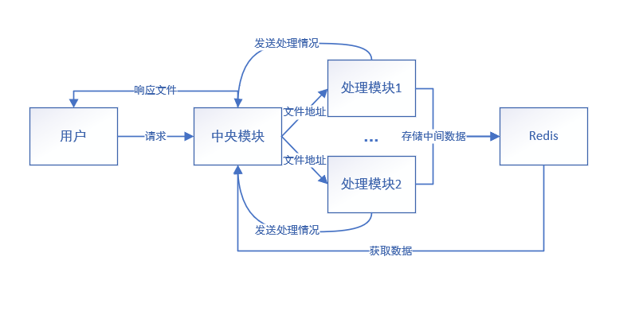
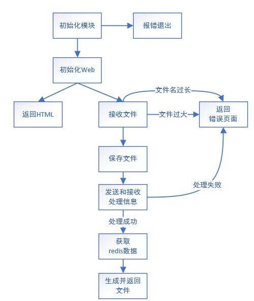
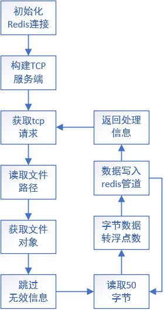

# STL格式分析

**一、STL二进制文件存储结构**

* 以三角面片为单元存储模型，前80个字节用于存储模型的一些描述信息，后面存储三角面片
* 每个三角面片用50个字节存储，一个三角面由1个法向量（12B），三个角坐标（36B），和两字节保留位组成， 角坐标的 x , y , z 为浮点数各个参数占用4B
* STL文件二进制结构示意表

| 0--79B               | 80--84B            | 85--(84+50*n)B   |
| -------------------- | ------------------ | ---------------- |
| 存储模型相关描述信息 | 存储三角面片的个数 | 存储三角面片数据 |

* STL文件二进制面的存储结构示意表

| 法向量 | 角坐标A | 角坐标B | 角坐标C | 保留位 |
| ------ | ------- | ------- | ------- | ------ |
| 12B    | 12B     | 12B     | 12B     | 2B     |

**二、ASCII码文件结构**

* 文件以`solid filenamestl`开头，以`endsolid filenamestl`结尾
* `facet normal`表示面的法向量，后面跟着面的法向量，也是存储一个面的开头，以`endfacet`结尾
* 存储一个面的坐标以`outer loop`开头，以`endloop`结尾，中间填充3个点坐标

```stl
solid filenamestl 文件名
facet normal 法线向量
outer loop
vertex	角A坐标
vertex	角B坐标
vertex	角C坐标
endloop
endfacet
......
endsolid filenamestl 文件名
```

# OBJ格式分析

**一、obj模型的特点**

* OBJ文件是一种3D模型文件

* OBJ文件支持多边形模型

* OBJ文件支持三个点以上的面

* OBJ文件支持法线和贴图坐标

**二、obj格式文件常见字段**

* `v(vertices)`:几何形状的顶点

```
v 0 0 0
v 1 1 1
```

* `vt(vertex texture)`：顶点纹理，代表当前顶点对应纹理图的哪个像素

```
vt 0.0 1.0
```

* `vn(vertex normal)`：顶点法线，用于计算反射光线使用的法线

```
vn 0.0 0.0 1.0
```

* `f(face)`：通过索引记录面的结构,包括坐标索引、法线索引等

```
f 1/1 2/2 3/3
```

* `mtllib`：定义模型材质库

```
mtllib model.mtl
```

* `usemtl`：对象材质，用于为对象指定材质

```
usemtl model
```

**三、obj文件结构**

| 数据类型               | 相关参数                                                     |
| ---------------------- | ------------------------------------------------------------ |
| 顶点数据               | v 几何体顶点<br>vt 贴图坐标点<br>vn 顶点法线<br>vp 参数空格顶点 |
| 自由形态曲线/表面属性  | deg 度<br>bmat 基础矩阵<br>step 步尺寸<br>cstype 曲线或表面类型 |
| 元素                   | p 点<br/>l 线<br/>f 面<br/>curv 曲线<br>curv2 2D曲线<br>surf 表面 |
| 自由形态曲线/表面主体  | parm 参数值<br/>ltrim 外部修剪循环<br/>hole 内部整修循环<br/>scrv 特殊曲线<br/>sp 特殊的点<br/>end 结束陈述 |
| 自由形态表面之间的连接 | con 连接                                                     |
| 成组                   | g 组名称<br/>s 光滑组<br/>mg 合并组<br/>o 对象名称<br/>      |

# 可行性分析

**一、项目需要处理的问题**

* 代码类型不统一（Java、Python、Go）
* 项目的实现方式的选择（Web或客户端）
* 模块间通信问题
* 数据传递问题

**二、解决问题**

* 使用redis作中间件，实现模块间的解耦，兼容不同类型的代码
* 项目选择用Web实现，并选择Go语言作为中央模块的开发
* 模块间的通信采用socket通信
* 使用redis作为中间件实现数据的传递

**三、使用redis的好处**

* 使用redis作为中间件能够实现模块的解耦合，某个模块的修改不会影响其他模块
* 使用redis作为缓存中间件，用于暂存中间数据，提高项目运行的效率
* redis能够统一中间数据的数据类型

**四、使用Go语言开发中央模块的好处**

* Go语言本身简短清晰结构明了，并且拥有完美的标准库，运行效率上比Java快，能够直接编译成二进制文件运行

* Go语言拥有百万量级的并发，一个协程至少占用8KB的内存，提高处理请求的吞吐量

* Go语言有比较成熟的Web开发框架，比如Gin框架。与SpringBoot相比Gin框架简短清晰只需不到10行代码即可启动一个微服务，极大提高了开发效率；在语言优势下，Go的并发程度比Java高，意味着Go在短时间内能够处理更多请求

# 项目总体结构设计



# 中央模块详细结构设计

**一、初始化模块**

* 使用子进程启动项目的所有模块

```go
func initServer() (err error) {
	//初始化redis对象
	redisDB = redis.NewClient(&redis.Options{
		Addr:     "myredis:6379",
		Password: "",
		DB:       0})
	_, err = redisDB.Ping().Result()
	if err != nil {
		return
	}
	//初始化StlToStruct模块
	err = exec.Command("./StlToStruct", "").Start()
	if err != nil {
		return
	}
	//初始化StlToStruct模块
	err = exec.Command("./OffToStruct", "").Start()
	if err != nil {
		return
	}
	err = exec.Command("./DxfToStruct", "").Start()
	if err != nil {
		return
	}
	err = exec.Command("./ObjToStruct", "").Start()
	if err != nil {
		return
	}
	return nil
}
```

**二、初始化web**

* 用于初始化web服务
* 获取http服务对象，并设置网页图标和加载HTML资源

```go
func initWeb() *gin.Engine {
	server := gin.Default()
	server.Use(favicon.New("./kq.png"))
	server.LoadHTMLGlob("templates/*")
	return server
}
```

```go
_ = webServer.Run("0.0.0.0:8081")
```

**三、接收文件**

* 对文件进行检查，对文件的大小和文件名的长度进行限制
* 使用`context.HTML()`方法返回页面
* 使用`context.SaveUploadedFile()`方法保存文件

```go
webServer.POST("/hander", func(context *gin.Context) {
	var tip string
	//接收文件
	uploadFile, _ := context.FormFile("image")
	//限制文件大小
	if uploadFile.Size > 5*1000*1000 {
		context.HTML(200, "error.html", gin.H{"error": "文件过大"})
		return
	}
	if len([]byte(uploadFile.Filename)) >= 256 {
		context.HTML(200, "error.html", gin.H{"error": "文件名称过长"})
		return
	}
	//文件暂存
	_ = context.SaveUploadedFile(uploadFile,"./temp/"+uploadFile.Filename)
}
```

**四、发送和接收处理信息**

* 使用socket通信，发送处理文件地址并接收处理情况
* 使用`net.Dial()`方法获取tcp客户端对象
* 使用`conn.Write()`方法发送消息
* 使用`conn.Read()`方法读取消息

```go
conn, err := net.Dial("tcp", address)
if err != nil {
	fmt.Println(err)
	return "error"
}
```

```go
_, err = conn.Write([]byte(filePath))
if err != nil {
	fmt.Println(err)
	return "error"
}
//获取文件处理消息
n, err = conn.Read(msg)
if err != nil {
	fmt.Println(err)
	return "error"
}
//返回处理消息
return string(msg[:n]
```

**五、返回文件**

* 使用`context.File()`返回文件
* 返回文件前需要设置响应头

```go
//设置文件头
context.Header("Content-Transfer-Encoding", "binary")
context.Header("Cache-Control", "no-cache")
context.Header("Content-Type", "application/octet-stream")
context.Header("Content-Disposition", "attachment;filename="+uploadFile.Filename[:len(uploadFile.Filename)-4]+".dxf")
//返回文件
context.File("./save/" + uploadFile.Filename[:len(uploadFile.Filename)-4] + ".dxf")
```



# 解析STL格式模块设计

**一、初始化redis连接**

* 获取redis连接对象

```go
func initRedis() {
	redisDB = redis.NewClient(&redis.Options{
		Addr:     "0.0.0.0:6379",
		Password: "",
		DB:       0})
    //检查是否连接成功
	_, err := redisDB.Ping().Result()
	if err != nil {
		return
	}
}
```

**二、构建TCP服务端**

* 使用socket网络编程，接收TCP请求并响应
* 使用`net`包的Listen方法获取tcp连接对象

```go
listener, err = net.Listen("tcp", "0.0.0.0:8082")
if err != nil {
	fmt.Println(err)
	return
}
//获取tcp请求
for {
	//获取tcp请求
	conn, err := listener.Accept()
	if err != nil {
		fmt.Println(err)
		continue
	}
	//处理请求
	handleFunc(conn)
	//关闭请求
	_ = conn.Close()
}
```

**三、读取信息**

* 使用`Read()`方法接收并读取信息

* 使用`Write()`方法返回信息

```go
filePath := make([]byte, 256)
var n int
var err error
//读取文件路径
n, err = conn.Read(filePath)
if err != nil {
	fmt.Println(err)
	return
}
//转换方法
err = transform(string(filePath[:n]))
```

```go
_, err = conn.Write([]byte("OK"))
```

**四、代码优化**

* 循环读取文件时使用缓冲管道，一次读取5MB的数据，极大减少了读取文件的次数

```go
reader := bufio.NewReaderSize(fileObj, 5*1000*1000)
```

* 使用redis管道暂存数据处理完后再提交，使得redis数据提交次数为1

```go
pipe := redisDB.Pipeline()
defer pipe.Close()
for {
	//固定50个字节循环读取
	BufData := make([]byte, 50)
	n, _ := reader.Read(BufData)
	if n == 0 {
		break
	}
	//获取面单元
	unit := StlPkg.GetUnit(BufData)

	A := make([]string, 3)
	B := make([]string, 3)
	C := make([]string, 3)
	for i := 0; i < 3; i++ {
		A[i] = fmt.Sprintf("%f", unit.VertexA[i])
		B[i] = fmt.Sprintf("%f", unit.VertexB[i])
		C[i] = fmt.Sprintf("%f", unit.VertexC[i])
	}
	pipe.LPush(fileObj.Name(), A)
	pipe.LPush(fileObj.Name(), B)
	pipe.LPush(fileObj.Name(), C)
}
pipe.Expire(fileObj.Name(), time.Second)
_, err = pipe.Exec()
return err
```



# 返回dxf文件模块设计

**一、创建dxf文件**

* 使用`OpenFile()`方法创建文件

```go
f, err := os.OpenFile("./save/"+fileName[:len(fileName)-4]+".dxf", os.O_CREATE|os.O_WRONLY, 0777)
if err != nil {
	fmt.Println(err)
	return err
}
defer f.Close()
```

**二、写入3D模型数据**

* 使用切片暂存数据
* 使用`Write()`方法写入数据

```go
content := make([]byte, 0, 5*1024*1024)
content = append(content, []byte("0\nSECTION\n2\nENTITIES\n")...)

for _, face := range UnitList {
	content = append(content, []byte("0\n3DFACE\n8\n0\n")...)
	content = append(content, []byte(fmt.Sprintf("10\n%s\n20\n%s\n30\n%s\n", face.VertexA[0], face.VertexA[1], face.VertexA[2]))...)
	content = append(content, []byte(fmt.Sprintf("11\n%s\n21\n%s\n31\n%s\n", face.VertexB[0], face.VertexB[1], face.VertexB[2]))...)
	content = append(content, []byte(fmt.Sprintf("12\n%s\n22\n%s\n32\n%s\n", face.VertexC[0], face.VertexC[1], face.VertexC[2]))...)
	content = append(content, []byte(fmt.Sprintf("13\n%s\n23\n%s\n33\n%s\n", face.VertexC[0], face.VertexC[1], face.VertexC[2]))...)
}
content = append(content, []byte("0\nENDSEC\n0\nEOF\n")...)
f.Write(content)
```


```go
//源码
```

# 项目的部署

**一、`Dockerfile`文件的编写**

* 基于`ubuntu`镜像构建新的镜像用于部署微服务

```dockerfile
FROM ubuntu									#基于ubuntu镜像
MAINTAINER fishkeqing<2192755819@qq.com>	#作者
ENV MYPATH /usr/local						#写入工作目录的环境变量
WORKDIR $MYPATH								#设置工作目录
ADD Project.tar.xz $MYPATH					#在工作目录添加项目文件
EXPOSE 8081									#端口暴露
CMD cd Project && ./main					#容器启动时进入项目目录运行main二进制文件
```

**二、`docker-compose.yml`文件编写**

* 使用`docker-compose`对容器编排管理

```yaml
version: "3.8"				#docker版本
services:					#编排服务
  mywebserver:				#我的微服务
    build: ./				#使用当前目录的Dockerfile文件构建镜像
    ports:					#端口映射
      - "8081:8081"
    networks:				#使用mynet网络
      - mynet
    depends_on:				#要求在redis服务启动后才启动该服务
          - redis
  redis:					#redis存储服务
    image: "redis:latest"	#使用redis镜像
    container_name: myredis	#设置容器名
    networks:				#使用mynet网络
      - mynet
networks:					#构建mynet网络，使用桥接形式连接
    mynet:
      driver: bridge	
```

# 文献参考

[The StL Format](http://www.fabbers.com/tech/STL_Format)

[Wavefront OBJ File Format Summary](https://www.fileformat.info/format/wavefrontobj/egff.htm)
