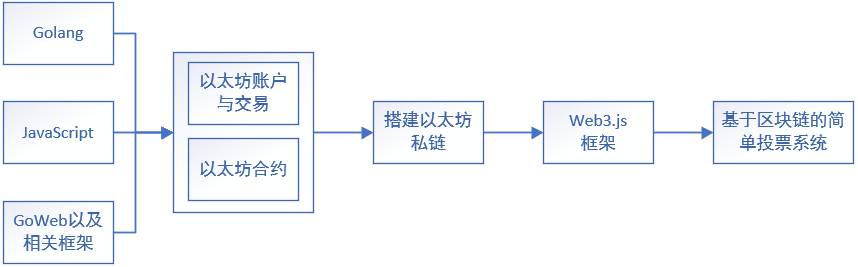

# 毕业设计选题

**基于区块链的投票系统**

## 大纲

​		区块链简单来说是由多个区块组成的链条，其有两大特点：一是数据难以篡改，二是去中心化。基于这两个特点区块链锁记录的信息更真实可靠，可以解决人们互不信任的问题，是新的数据共享技术，因此在金融、物联网等领域得到广泛应用，也是未来`web3.0`的重要根基，可以说没有区块链就没有`web3.0`。

​		在传统的投票系统中有许多问题，比如黑客入侵系统造假、虚假账户投票等问题。这一系列的问题使得投票系统的真实性、可靠性大大降低，在对一些事件进行投票时，比如年度最佳游戏，往往会因为粉圈效应导致竞争非常激烈，此时粉圈会使用各种手段对投票系统进行攻击导致系统投票结果的真实性与可靠性大幅下跌。

​		基于区块链的投票系统能够对用户进行身份认证，其中包含用户的真实身份信息。通过该方式解决了虚假账号带来的问题。除此之外区块链的账本是公开透明的，可以对投票进行追踪溯源，能够精准地找到攻击者的相关信息。在投票时，该系统可以让用户进行匿名投票，只有选民才知道自己投了谁，候选人只知道谁投了票。该系统也可以让用户进行实名投票，候选人可以知道选民投给谁，但不会知道选民的真实身份，只知道选民的虚拟身份。该系统是基于区块链技术的系统，所以其账本数据是分布式存储的，修改数据需要半数以上的节点同意才能修改而且过程公开透明，黑客对单个结点的攻击很难篡改整个区块链的数据。基于这些特性可使得投票变得更公平、公开、公正，可避免投票结果被外界干扰，保证投票的真实性与可靠性。

## 相关技术与路线

​		实现该系统需要熟悉掌握`Go`和`JavaScrip`编程语言，并对`GoWeb`开发有一定的了解。在此基础上需要了解开源的区块链框架——以太坊。需要了解以太坊的客户端、账户和交易的内容，学习智能合约的内容并自主搭建以太坊私链。然后学习`web3.js`编写以太坊脚本，最后实现简单的投票系统。

