# 计算机图形学概述

**一、主要内容**

* `Rasterization`：光栅化
  * OpenGL等API
  * Shader着色器
* `Curves and Meshes`：几何图形、曲线与网格
* `Ray Tracing`：光线追踪
* `Animation/Simulation`：动画与模拟

**二、光栅化**

* 将3D几何形体显示在2D屏幕上

**三、实时性**

* 每秒能够生产30张图`30FPS`

**四、图形学领域**

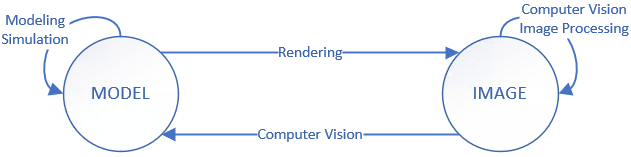

* `MODEL->IMAGE`：渲染(`Rendering`)
* `IMAGE->MODEL`：计算机视觉(`Computer Vision`)
* `MODEL->MODEL`：仿真(`Simulation`)、模型形变(`Modeling`)
* `IMAGE->IMAGE`：图像处理(`Computer Vision`)、计算机视觉(`Computer Vision`)

**五、计算机图形应用情况**

* `Video Game`：游戏
* `Movies`：电影
* `Animations`：动画
* `Design`：设计
* `Visualization`：可视化
* `XR`：扩展现实
* `Digital Illustration`：数字绘画
* `Simulation`：虚拟仿真
* `Graphical User Interfaces`：GUI

# 向量与线性代数

## 向量(Vectors)

### 向量的相关概念

**一、向量**

* 用于表示方向
* 向量本身拥有一定的长度

* 向量的计算：向量=终点坐标-起点坐标

$$
\vec{AB}=B-A
$$

**二、单位向量**

* 长度为1的向量
* 在图形学常用于表示方向
* 单位向量的获取：单位向量=向量÷向量的长度

$$
\widehat{a}=\vec{a}/\begin{Vmatrix}\vec{a}\end{Vmatrix}
$$

### 向量的相关性质

**一、向量求和**

* 平行四边形法则：两向量的尾部相连，组成的平行四边形的对角线为向量的和
* 三角形法则：两向量首尾相连，出现的第三条线为向量的和

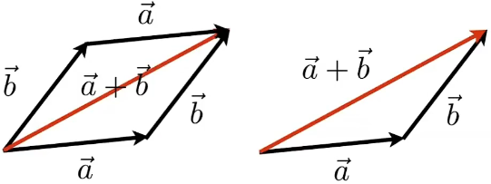

## 点乘

### 非坐标系点乘公式

**一、一般点乘求值公式**
$$
\vec{a}\cdot\vec{b}=\begin{Vmatrix}\vec{a}\end{Vmatrix}\begin{Vmatrix}\vec{b}\end{Vmatrix}\cos\theta
$$

### 直角坐标系点乘公式

**一、2D坐标系下的点乘**
$$
\vec{a}\cdot\vec{b}=
\begin{pmatrix}
x_a\\
y_a\\
\end{pmatrix}\cdot
\begin{pmatrix}
x_b\\
y_b\\
\end{pmatrix}
=x_ax_b+y_ay_b
$$
**二、3D坐标系下的点乘**
$$
\vec{a}\cdot\vec{b}=
\begin{pmatrix}
x_a\\
y_a\\
z_a
\end{pmatrix}\cdot
\begin{pmatrix}
x_b\\
y_b\\
z_b
\end{pmatrix}
=x_ax_b+y_ay_b+z_az_b
$$

### 点乘的运算法则

* 交换律

$$
\vec{a}\cdot\vec{b}=\vec{b}\cdot\vec{a}
$$

* 结合律

$$
\vec{a}\cdot(\vec{b}+\vec{c})=\vec{a}\cdot\vec{b}+\vec{a}\cdot\vec{c}
$$

* 分配律

$$
(k\vec{a})\cdot\vec{b}=(k\vec{b})\cdot\vec{a}=k(\vec{a}\cdot\vec{b})
$$

### 点乘的图形学相关应用

**一、获取两向量的夹角**

* 一般点乘求角公式

$$
\cos\theta=\frac{\vec{a}\cdot\vec{b}}{\begin{Vmatrix}\vec{a}\end{Vmatrix}\begin{Vmatrix}\vec{b}\end{Vmatrix}}
$$

* 单位向量点乘求角公式

$$
\cos\theta=\widehat{a}\cdot\widehat{b}
$$

**二、求投影**
$$
k=\begin{Vmatrix}\vec{b_⊥}\end{Vmatrix}=\begin{Vmatrix}\vec{b}\end{Vmatrix}cos\theta
$$
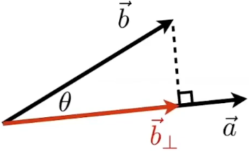

**三、计算两条向量是否接近和是否同向**

* 求取两向量夹角的余弦值
* 值越接近1表示两条向量方向越接近
* 值为正数时为同向，负数为反向，0时为垂直方向

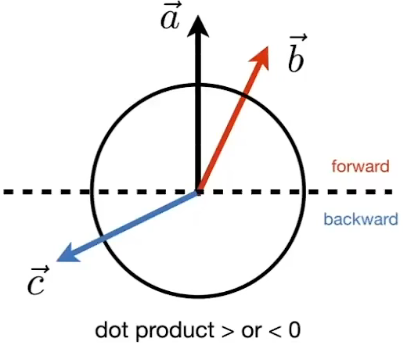

## 叉乘

### 叉乘相关概念

* 叉乘求出来的是向量，但使用公式只能求出向量的长度
* 叉乘求出的向量方向垂直于相乘的两向量
* 向量的叉乘不满足交换律吧，交换后求出的向量方向相反
* 叉乘求出的向量的方向默认符合右手螺旋定则（有些图形API默认左手法则）
  * a×b，则右手手指从a向b卷，母指指向为方向

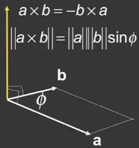

### 非坐标系叉乘公式

**一、一般叉乘公式**
$$
\begin{Vmatrix}\vec{a}\times\vec{b}\end{Vmatrix}=
\begin{Vmatrix}\vec{a}\end{Vmatrix}
\begin{Vmatrix}\vec{b}\end{Vmatrix}
sin\theta
$$
**二、叉乘交换公式**
$$
\vec{a}\times\vec{b}=-\vec{b}\times\vec{a}
$$
**三、同向向量的叉乘**
$$
\vec{a}\times\vec{a}=\vec{0}
$$

### 直角坐标系叉乘公式

**一、坐标表示公式**
$$
\vec{a}\times\vec{b}=
\begin{pmatrix}
y_az_b-y_bz_a\\
z_ax_b-x_az_b\\
x_ay_b-y_ax_b
\end{pmatrix}
$$
**二、矩阵表示公式**
$$
\vec{a}\times\vec{b}=A*b=
\begin{pmatrix}
0 & -z_a & y_a\\
z_a & 0 & -x_a\\
-y_a & x_a & 0
\end{pmatrix}
\begin{pmatrix}
x_b\\
y_b\\
z_b
\end{pmatrix}
$$

### 叉乘的运算法则

* 结合律

$$
\vec{a}\times(\vec{b}+\vec{c})=\vec{a}\times\vec{b}+\vec{a}\times\vec{c}
$$

* 分配律

$$
k(\vec{a}\times\vec{b})=\vec{a}\times(k\vec{b})
$$

* 交换法则

$$
\vec{a}\times\vec{b}=-\vec{b}\times\vec{a}
$$

### 叉乘的图形学相关应用

**一、判断线a在线b的左侧还是右侧**

* 两条线进行叉乘(a×b)，在右手螺旋定则下
  * 若为正，则表示a在b的右侧
  * 若为负，则表示a在b的左侧

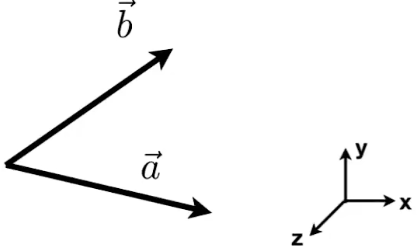

**二、判断点在面的内还是外**

* 在（一）的基础上，分别将组成面边界的线的尾部与点相连，求组成的线与对应边界线的叉乘
  * 如果叉乘得出的结果的都符号相同，则在面的内部
  * 如果叉乘后存在符号不同，则不在面的内部
  * 如果点在边界上，则叉乘后的结果为0，需要自己决定是否在面内

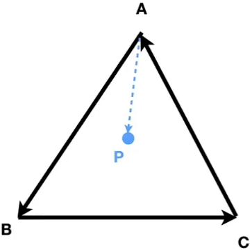

## 矩阵

### 矩阵乘积

**一、能够进行相乘的前提**

* 一个矩阵的行数等于另一个矩阵的列数

### 矩阵乘积的法则

* 没有交换律
  * `AB`不等于`BA`

* 结合律

$$
(AB)C=A(BC)
$$

* 分配律

$$
A(B+C)=AB+AC
$$

$$
(A+B)C=AC+BC
$$

### 矩阵的转置

* 交换行和列（ij->ji）

$$
\begin{pmatrix}
1&2\\
3&4\\
5&6
\end{pmatrix}^T
=
\begin{pmatrix}
1&3&5\\
2&4&6
\end{pmatrix}
$$

* 转置的性质

$$
(AB)^T=B^TA^T
$$

### 单位矩阵

* 对角线上全为1，其余为0

$$
I_{3×3}=
\begin{pmatrix}
1&0&0\\
0&1&0\\
0&0&1
\end{pmatrix}
$$

### 逆矩阵

* 1个矩阵与其逆矩阵进行相乘得到单位矩阵

$$
AA^{-1}=A^{-1}A=I
$$

* 逆矩阵的性质

$$
(AB)^{-1}=B^{-1}A^{-1}
$$

# 变换

## 线性变换定义

* 一个变换矩阵乘以一个坐标矩阵得出一个新的坐标矩阵，这种变化称为线性变换

$$
\begin{bmatrix}
x^\prime\\
y^\prime
\end{bmatrix}
=
\begin{bmatrix}
a & b\\
c & d
\end{bmatrix}
\begin{bmatrix}
x\\
y
\end{bmatrix}
$$

$$
x^\prime=Mx
$$

## 齐次坐标与仿射变换

* 为了统一表示所有变换，通过提升矩阵一个维度可以解决
* 用齐次坐标表示的变换称为**`仿射变换`**

### 2D

**一、点的表示**

* 追加的维度值为1，值要求恒为1，能够用于计算平移等变换

$$
point=(x,y,1)^T
$$

**二、向量的表示**

* 追加的维度值为0，使得向量在变换过程中不会改变

$$
vector=(x,y,0)^T
$$

**三、2D仿射变换表示形式**

* 最后一行1相当于坐标的标志
* 平移永远在最后一列前两个数上

$$
\begin{bmatrix}
x^\prime\\
y^\prime\\
1
\end{bmatrix}
=
\begin{bmatrix}
a & b & t_x\\
c & d & t_y\\
0 & 0 & 1
\end{bmatrix}
\cdot
\begin{bmatrix}
x\\
y\\
1
\end{bmatrix}
$$

### 3D

**一、点的表示**

* 追加的维度值为1，值要求恒为1，能够用于计算平移等变换

$$
point=(x,y,z,1)^T
$$

**二、向量的表示**

* 追加的维度值为0，使得向量在变换过程中不会改变

$$
vector=(x,y,z,0)^T
$$

**三、3D仿射变换表示形式**

* 最后一行1相当于坐标的标志

$$
\begin{bmatrix}
x^\prime\\
y^\prime\\
z^\prime\\
1
\end{bmatrix}
=
\begin{bmatrix}
a & b & c & t_x\\
d & e & f & t_y\\
g & h & i & t_z\\
0 & 0 & 0 & 1
\end{bmatrix}
\cdot
\begin{bmatrix}
x\\
y\\
z\\
1
\end{bmatrix}
$$

### 齐次坐标的加减计算结果

* 向量+向量=新的向量

```
vector+vector=vectot
```

$$
\begin{bmatrix}
1\\
1\\
0
\end{bmatrix}
+
\begin{bmatrix}
1\\
1\\
0
\end{bmatrix}
=
\begin{bmatrix}
2\\
2\\
0
\end{bmatrix}
$$

* 坐标-坐标=向量

```
point-point=vector
```

$$
\begin{bmatrix}
2\\
2\\
1
\end{bmatrix}
-
\begin{bmatrix}
1\\
1\\
1
\end{bmatrix}
=
\begin{bmatrix}
1\\
1\\
0
\end{bmatrix}
$$

* 点+向量=点

```
point+vector=point
```

$$
\begin{bmatrix}
1\\
1\\
1
\end{bmatrix}
+
\begin{bmatrix}
1\\
1\\
0
\end{bmatrix}
=
\begin{bmatrix}
2\\
2\\
1
\end{bmatrix}
$$

* 点+点=两点间的中点

```
point+point=midpoint
```

$$
\begin{bmatrix}
2\\
2\\
1
\end{bmatrix}
+
\begin{bmatrix}
2\\
2\\
1
\end{bmatrix}
=
\begin{bmatrix}
4\\
4\\
2
\end{bmatrix}
=
\begin{bmatrix}
2\\
2\\
1
\end{bmatrix}
$$

## 2D变换

### 缩放变换

* 横纵坐标都乘于缩放比例

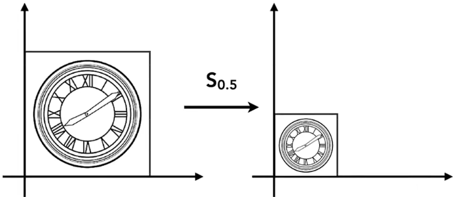

**一、坐标缩放的函数形式**
$$
x^\prime=s_1x
$$

$$
y^\prime=s_2y
$$

**二、坐标缩放的矩阵形式**
$$
\begin{bmatrix}
x^\prime\\
y^\prime
\end{bmatrix}
=
\begin{bmatrix}
s_1 & 0\\
0 & s_2
\end{bmatrix}
\begin{bmatrix}
x\\
y
\end{bmatrix}
$$
**三、坐标缩放的仿射变换形式**
$$
\begin{bmatrix}
x^\prime\\
y^\prime\\
1
\end{bmatrix}
=
\begin{bmatrix}
s_1 & 0 & 0\\
0 & s_2 & 0\\
0 & 0 & 1
\end{bmatrix}
\begin{bmatrix}
x\\
y\\
1
\end{bmatrix}
$$

### 反射变换（镜像）

* `x`坐标变为相反数，`y`坐标不变

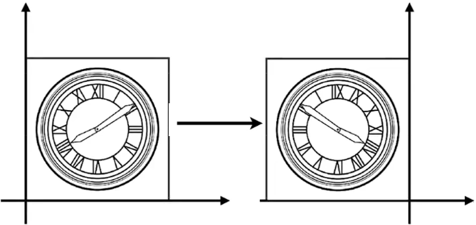

**一、反射变换的函数形式**
$$
x^\prime=-x
$$

$$
y^\prime=y
$$

**二、反射变换的矩阵形式**
$$
\begin{bmatrix}
x^\prime\\
y^\prime
\end{bmatrix}
=
\begin{bmatrix}
-1 & 0\\
0 & 1
\end{bmatrix}
\begin{bmatrix}
x\\
y
\end{bmatrix}
$$
**三、反射变换的仿射变换形式**
$$
\begin{bmatrix}
x^\prime\\
y^\prime\\
1
\end{bmatrix}
=
\begin{bmatrix}
-1 & 0 & 0\\
0 & 1 & 0\\
0 & 0 & 1
\end{bmatrix}
\begin{bmatrix}
x\\
y\\
1
\end{bmatrix}
$$

### 水平切变

* 某一边向某方向偏移，某一边不偏移形成的形变

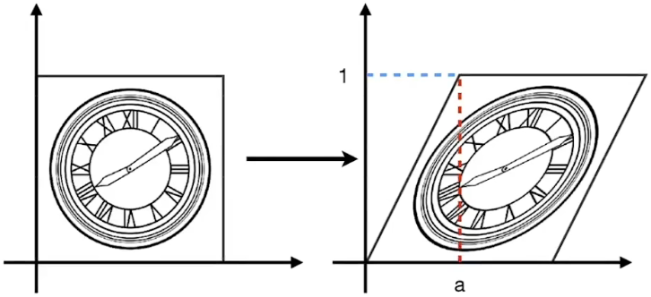

**一、函数的表示形式**
$$
x^\prime=x+\frac{a}{h}y
$$

$$
y^\prime=y
$$

**二、矩阵的表示形式**
$$
\begin{bmatrix}
x^\prime\\
y^\prime
\end{bmatrix}
=
\begin{bmatrix}
1 & \frac{a}{h}\\
0 & 1
\end{bmatrix}
\begin{bmatrix}
x\\
y
\end{bmatrix}
$$
**三、切变的仿射变换形式**
$$
\begin{bmatrix}
x^\prime\\
y^\prime\\
1
\end{bmatrix}
=
\begin{bmatrix}
1 & \frac{a}{h} & 0\\
0 & 1 & 0\\
0 & 0 & 1
\end{bmatrix}
\begin{bmatrix}
x\\
y\\
1
\end{bmatrix}
$$

### 旋转

* 以原点为中心逆时针旋转

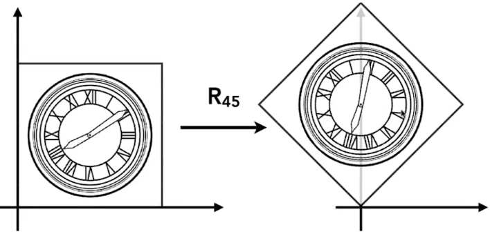

**一、旋转的矩阵表示**
$$
\begin{bmatrix}
x^\prime\\
y^\prime
\end{bmatrix}
=
\begin{bmatrix}
cos\theta & -sin\theta\\
sin\theta & cos\theta
\end{bmatrix}
\begin{bmatrix}
x\\
y
\end{bmatrix}
$$
**二、旋转的仿射变换形式**
$$
\begin{bmatrix}
x^\prime\\
y^\prime\\
1
\end{bmatrix}
=
\begin{bmatrix}
cos\theta & -sin\theta & 0\\
sin\theta & cos\theta & 0\\
0 & 0 & 1
\end{bmatrix}
\begin{bmatrix}
x\\
y\\
1
\end{bmatrix}
$$

### 平移

**一、平移的仿射变换形式**
$$
\begin{bmatrix}
x^\prime\\
y^\prime\\
1
\end{bmatrix}
=
\begin{bmatrix}
1 & 0 & t_x\\
0 & 1 & t_y\\
0 & 0 & 1
\end{bmatrix}
\begin{bmatrix}
x\\
y\\
1
\end{bmatrix}
$$

### 逆变换

* 变换的逆变换
* 图形发生变换后，乘以变换矩阵的逆矩阵可还原成原来的状态

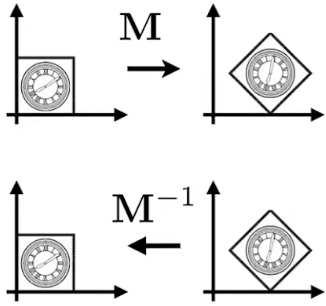
$$
\begin{bmatrix}
x\\
y\\
1
\end{bmatrix}
=
M\cdot
\begin{bmatrix}
x\\
y\\
1
\end{bmatrix}
\cdot
M^{-1}
$$

### 组合变换

* 一系列复杂的变换可以通过简单变换实现
* 变换的顺序会影响结果（与矩阵不满足交换律相对应）

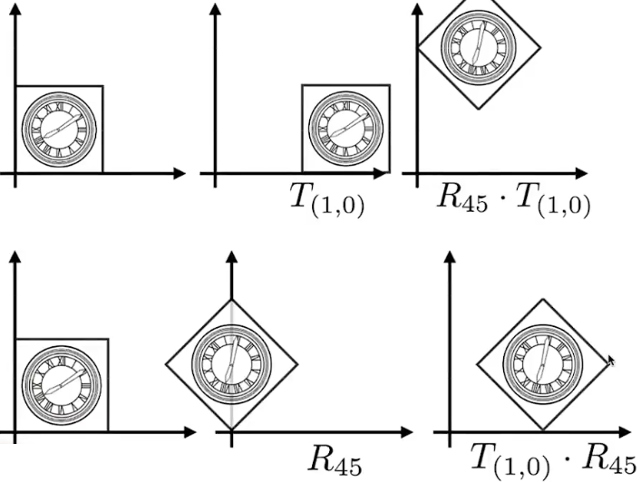

**一、组合变换的表示形式**

* 默认最右边的矩阵为坐标矩阵
* 组合变换默认从右往左进行相乘，越往右变换的执行优先级越高

$$
R_n(x)=
A_n...A_2\cdot A_1\cdot
\begin{bmatrix}
x\\
y\\
1
\end{bmatrix}
$$

**实例：先旋转后平移**
$$
R=
T_{(1,0)}\cdot R_{45}
\begin{bmatrix}
x^\prime\\
y^\prime\\
1
\end{bmatrix}
=
\begin{bmatrix}
1 & 0 & 1\\
0 & 1 & 0\\
0 & 0 & 1
\end{bmatrix}
\begin{bmatrix}
cos\theta & -sin\theta & 0\\
sin\theta & cos\theta & 0\\
0 & 0 & 1
\end{bmatrix}
\begin{bmatrix}
x\\
y\\
1
\end{bmatrix}
$$

## 3D变换

### 缩放变换

**一、仿射矩阵形式**
$$
\begin{bmatrix}
x^\prime\\
y^\prime\\
z^\prime\\
1
\end{bmatrix}
=
\begin{bmatrix}
s_x & 0 & 0 & 0\\
0 & s_y & 0 & 0\\
0 & 0 & s_z & 0\\
0 & 0 & 0 & 1
\end{bmatrix}
\begin{bmatrix}
x\\
y\\
z\\
1
\end{bmatrix}
$$

### 平移变换

**一、仿射矩阵形式**
$$
\begin{bmatrix}
x^\prime\\
y^\prime\\
z^\prime\\
1
\end{bmatrix}
=
\begin{bmatrix}
1 & 0 & 0 & t_x\\
0 & 1 & 0 & t_y\\
0 & 0 & 1 & t_z\\
0 & 0 & 0 & 1
\end{bmatrix}
\begin{bmatrix}
x\\
y\\
z\\
1
\end{bmatrix}
$$

### 旋转变换

**一、绕<font color=red>x</font>轴旋转的仿射矩阵形式**

* x轴不变

$$
\begin{bmatrix}
x^\prime\\
y^\prime\\
z^\prime\\
1
\end{bmatrix}
=
\begin{bmatrix}
1 & 0 & 0 & 0\\
0 & cos\theta & -sin\theta & 0\\
0 & sin\theta & cos\theta & 0\\
0 & 0 & 0 & 1
\end{bmatrix}
\begin{bmatrix}
x\\
y\\
z\\
1
\end{bmatrix}
$$
**二、绕<font color=red>z</font>轴旋转仿射矩阵形式**

* z轴不变

$$
\begin{bmatrix}
x^\prime\\
y^\prime\\
z^\prime\\
1
\end{bmatrix}
=
\begin{bmatrix}
cos\theta & -sin\theta & 0 & 0\\
sin\theta & cos\theta & 0 & 0\\
0 & 0 & 1 & 0\\
0 & 0 & 0 & 1
\end{bmatrix}
\begin{bmatrix}
x\\
y\\
z\\
1
\end{bmatrix}
$$
**三、绕<font color=red>y</font>轴旋转仿射矩阵形式**

* y轴不变
* 在右手定则下，两个`sin`的符号相反

$$
\begin{bmatrix}
x^\prime\\
y^\prime\\
z^\prime\\
1
\end{bmatrix}
=
\begin{bmatrix}
cos\theta & 0 & sin\theta & 0\\
0 & 1 & 0 & 0\\
-sin\theta & 0 & cos\theta & 0\\
0 & 0 & 0 & 1
\end{bmatrix}
\begin{bmatrix}
x\\
y\\
z\\
1
\end{bmatrix}
$$

**四、旋转矩阵的性质**

* 乘以一个坐标得到得到旋转后的坐标
* <font color=red>旋转矩阵是正交矩阵</font>，旋转矩阵与其转置矩阵相乘得到单位矩阵
* 旋转矩阵的转置矩阵是其逆矩阵

$$
R\cdot R^T=I
$$

$$
R^T=R^{-1}
$$

**五、复杂旋转**

* 复杂的旋转都能由多个绕x,y,z轴的旋转矩阵组合而成
* 多个旋转矩阵相乘仍然是正交矩阵

$$
R_{xyz}(α,β,γ)=R_x(α)R_y(β)R_z(γ)
$$

**六、罗德里格斯旋转公式**
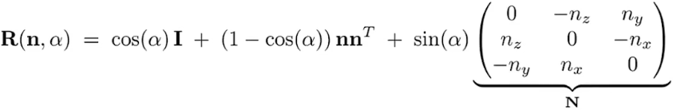

## 视图变换

### 相机与视图变换矩阵

**一、定义相机**

* 坐标（Position）：用于确定相机的位置
* 拍摄向量（Look-at direction）：用于确定相机拍摄的角度
* 垂直于相机向上的向量（Up direction）：用于确定相机的旋转角度，与拍摄向量相垂直

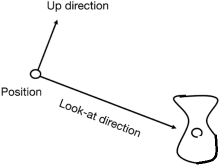

**二、视图变换的作用**

* 将相机移到坐标原点，将拍摄方向(look-at)朝向z轴，向上方向(up)对准y轴，提高计算效率
* <font color=blue>除了相机外的模型乘以视图矩阵，会随着相机做相同的变换，完成变换后相机的视野不会变化</font>

**三、视图变换矩阵的来源与组成**

* 来源：先平移将相机移到原点，然后再通过旋转将拍摄方向对准z轴，相机向上方向对准y轴

* 组成：视图变换矩阵由平移变换矩阵和旋转变换矩阵组成

$$
M_{view}=R_{view}T_{view}
$$

### 视图变换的平移矩阵

* 将任意位置的相机移到原点

$$
T_{view}=
\begin{bmatrix}
1 & 0 & 0 & t_x\\
0 & 1 & 0 & t_y\\
0 & 0 & 1 & t_z\\
0 & 0 & 0 & 1
\end{bmatrix}
$$

### 视图变换的旋转矩阵

* 由于旋转矩阵是正交矩阵，所以旋转矩阵的转置为其逆矩阵
* 由于相机在原点，可以通过逆向思维获得旋转矩阵，获取旋转矩阵的转置得到视图的旋转矩阵

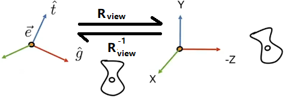

**一、使用逆向思维计算**

* 假设一个虚拟相机在原点且拍摄向量在z轴上，相机向上向量在y轴上，通过旋转重合存在的相机得到一个组合的旋转矩阵

$$
R_{view}^{-1}=R_{virtual}=R_x\cdot R_y \cdot R_z
$$

**二、使用逆变换和正交矩阵的性质得到视图变换的旋转矩阵**

* 经过一系列变换后，只要乘以变换矩阵的逆矩阵则会复原
* 正交矩阵的转置是其逆矩阵，旋转变换矩阵是正交矩阵

$$
R_{view}=R_{virual}^T
$$

## 投影变换

* 正交投影
  * 3D空间中的平行线转为2D时不会相交，常用于工程制图
  * 相机向无限远处移动，相机拍摄的物体其大小不会改变
* 透视投影
  * 3D空间中的平行线转为2D时会相交，符合人眼的观察情况
  * 符合近大远小的规律

### 正交投影

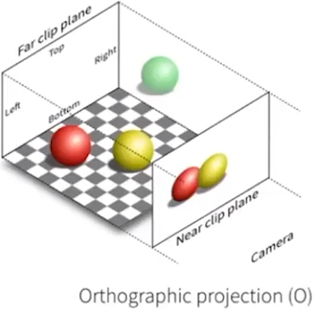

**一、正交投影的过程**

* 将物件的中心移到原点的中心
* 将物件进行缩放，使物件在标准立方体（边长为2，中心在原点的正方体）

**二、正交投影矩阵**

* 正交投影变换矩阵由平移矩阵和缩放矩阵组成

$$
M_{ortho}=M_{Scale} \cdot M_{Translate}
$$

* 平移矩阵，将物件的中心移到原点

$$
M_{ortho}=
\begin{bmatrix}
1 & 0 & 0 & -\frac{r+l}{2}\\
0 & 1 & 0 & -\frac{t+b}{2}\\
0 & 0 & 1 & -\frac{n+f}{2}\\
0 & 0 & 0 & 1
\end{bmatrix}
$$

* 缩放矩阵，将物件缩放成标准正方体

$$
M_{Scale}=
\begin{bmatrix}
-\frac{2}{r-l} & 0 & 0 & 0\\
0 & -\frac{2}{t-b} & 0 & 0\\
0 & 0 & -\frac{2}{n-f} & 0\\
0 & 0 & 0 & 1
\end{bmatrix}
$$

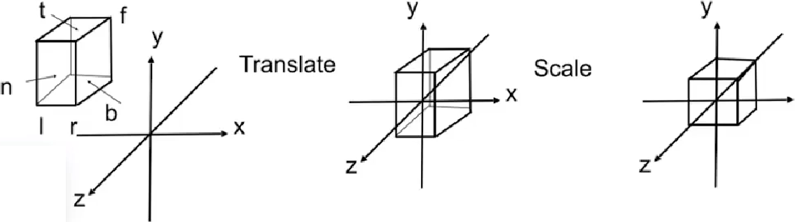

### 透视投影

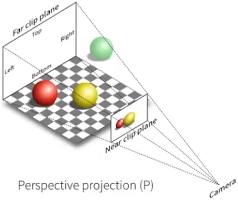

**一、透视投影过程**

* 先对物体进行压缩变换，会对z进行移动实现近大远小
* 再对物体进行正交投影变换

**二、透视投影矩阵**

* <font color=red>透视投影矩阵由一个特殊的缩放矩阵和正交投影矩阵组成</font>

$$
M_{persp}=M_{ortho} \cdot M_{persp \rightarrow ortho}
$$

* 特殊的缩放矩阵
  * n为相机到近平面的距离
  * f为相机到远平面的距离
  * 通过相似三角形得到x与y的变换，高度需要特殊点进行求解
  * 高度的中点`(0,0,n+f/2)`经过压缩变换后为(0,0,(n^2^+f^2^)/2)，即变换后高度变大

$$
M_{persp \rightarrow ortho}=
\begin{bmatrix}
n & 0 & 0 & 0\\
0 & n & 0 & 0\\
0 & 0 & n+f & -nf\\
0 & 0 & 1 & 0
\end{bmatrix}
$$

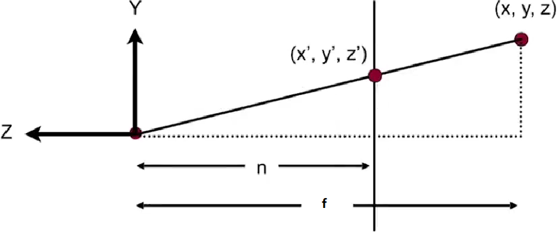

# 光栅化

## 屏幕、像素与光栅化

**一、屏幕**

* 一个用像素组成的二维数组
* 二维数组的大小用分辨率表示
* 一种典型的光栅化显示设备

**二、像素**

* 一个像素的颜色由红、绿、蓝组合而成
* 一个像素只能填充一种颜色

**三、光栅化**

* 将东西绘制到一个二维屏幕上

**四、屏幕产生图像的方式**

* 逐行扫描
* 隔行扫描

**五、计算机输出图片的暂存位置**

* 显存

**六、三角形面**

* 三角形是最基础的多边形
* 任何多边形都可以拆成三角形
* 三角形内部一定是平面的
* 能够用于插值

## 屏幕空间

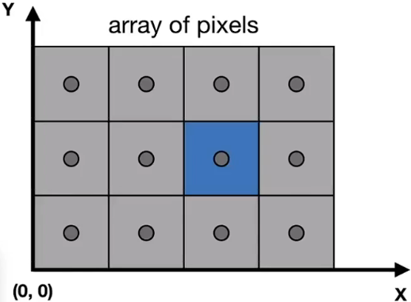

**一、像素的坐标表示**

* 将屏幕放在第一象限，一个像素的长度为x的单位长度，一个像素的高为y的单位长度
* 在屏幕空间内，用(x,y)代表某个位置的像素（x，y为正数）
* 像素的表示范围(0,0)->(width-1,height-1)
* 像素中心位置为`(x+0.5,y+0.5)`

## 视窗变换

**一、视窗变换的目的**

* 将[-1,1]的正方体转换为[0,width]×[0,height]的过程

**二、视窗变换的过程**

* 平移[-1,1]的正方体，使得正方体的左下角与原点重合
* 对正方体的长和宽进行缩放，使之能填充屏幕上所有像素
* width为屏幕的宽，height为屏幕的高

$$
M_{viewport}=M_{Scale} \cdot M_{Translate}=
\begin{bmatrix}
\frac{width}{2} & 0 & 0 & \frac{width}{2}\\
0 & \frac{height}{2} & 0 & \frac{height}{2}\\
0 & 0 & 1 & 0\\
0 & 0 & 0 & 1
\end{bmatrix}
$$

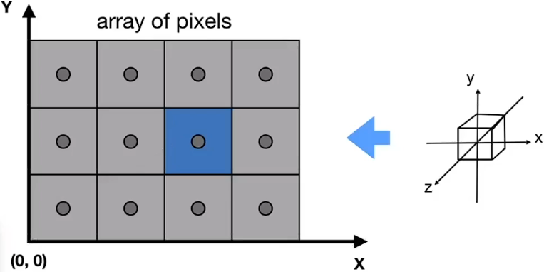

## 光栅化

**一、光栅化的作用**

* 将模型单元转换为像素
* 常见的模型单元：三角面

**二、采样**

* 获得一个函数，函数的值为像素的颜色，输入函数的值获取像素的过程

```go
//单行采样，即1D采样
for x:=0;x<x_Max;x++{
    output=f(x)
}
```

**三、光栅化采样函数**

* 假设一个简单的采样函数，输入三角形和像素坐标，返回像素颜色

$$
inside(t,x,y)=\left\{
\begin{matrix}
1 & 点在三角形t内\\
0 & 点不在三角形t内
\end{matrix}
\right.
$$

* 使用叉乘判断点是否在三角形内（需要叉乘3次）
* 像素中点在边上时可以自己定义是否在三角形内（OpenGL认为左上边在三角形内，右下不在）

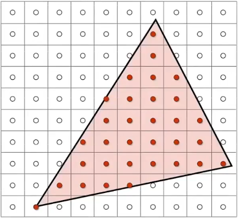

```go
//伪代码实现
//遍历整个屏幕
for i:=0;i<x_Max;i++{
    for j:=0;j<y_Max;j++{
        //判断像素中心是否在三角形内，是则返回1，否则返回0
        image[x][y]=inside(triangle,x+0.5,y+0.5)
    }
}
```

## 光栅化算法优化

**一、三角形包围盒**

* 由于三角形只会对某些像素产生影响，所以跳过该部分区域进行运算
* 三角形的`x,y,z`3个最大值组成一个正方形区域，称为三角形包围盒

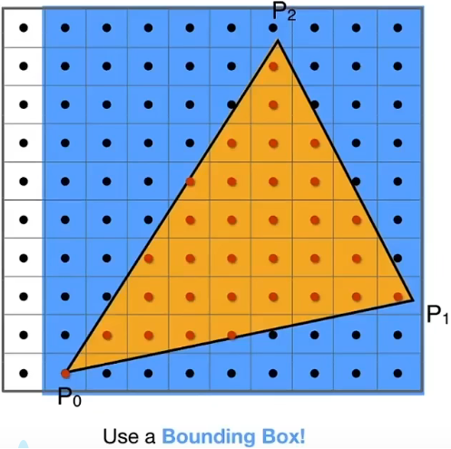

**二、深度遍历运算**

* 获取一个在三角形上最左下角的点，然后通过深度遍历判断附近的点是否在三角形内

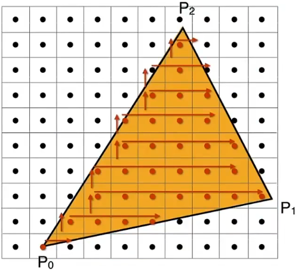

# 抗锯齿

## 采样理论

### 采样瑕疵（Sampling Artifacts）

**一、锯齿**

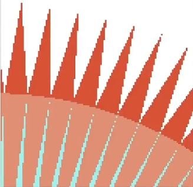

**二、摩尔纹**

* 图片的奇数行奇数列去掉时会出现摩尔纹


**三、车轮效应**

* 人眼的采样速度跟不上车轮的旋转速度

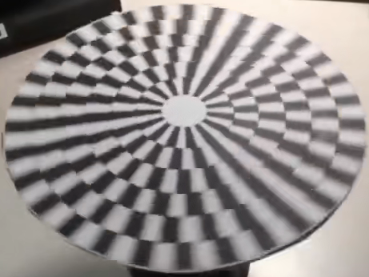

### 香农采样定理与走样

**一、香农采样定理**

* 采样频率要达到模拟信号的两倍才能实现无损采样

**二、走样**

* 采样时，采样频率低于模拟信号的两倍会出现信号偏差，即为走样
* 采样时没有满足香农采样定理

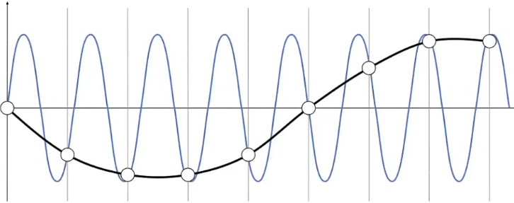

## 傅里叶级数、傅里叶变换与频域

**一、傅里叶级数展开**

* 任何函数都能通过多个正余弦函数的相加进行拟合

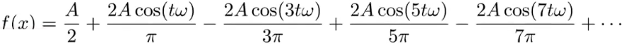


**二、傅里叶变换**

* 能够将时域转为频域，得到频谱（将图片的像素变成频率）
* 中心的区域一般为低频区域（亮度大），越往外频率越高（亮度暗）
* 中间的十字是因为图片有边界，会产生高频变换

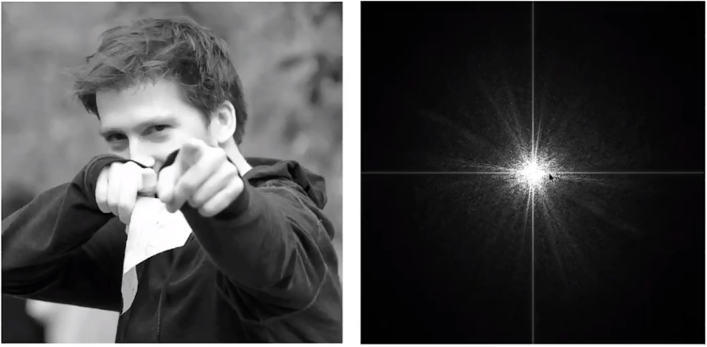

**三、高通滤波**

* 遮挡频谱的低频部分，得到只有高频部分的频谱
* 通过逆傅里叶变换得到一张图片，其中得到的信息为图像的边界
* 图像的边界信息为频谱的高频信息
* 常用于检测边界

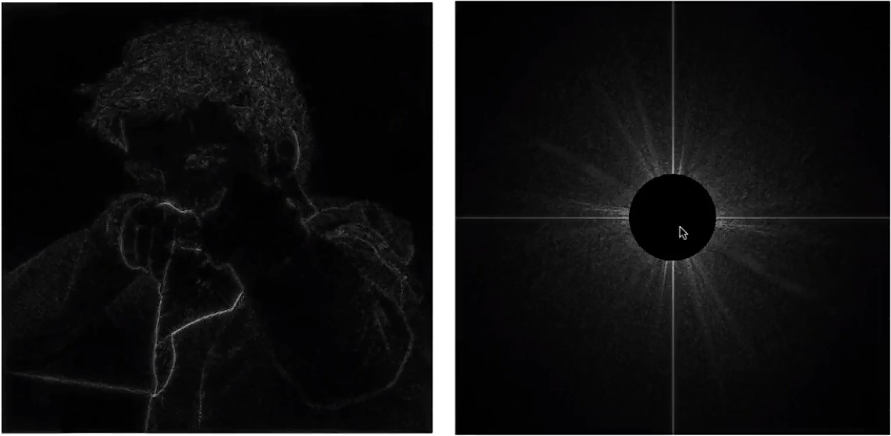

**四、低通滤波**

* 去掉高频部分，只留下低频的频谱
* 通过逆傅里叶变换得到一张模糊的图片

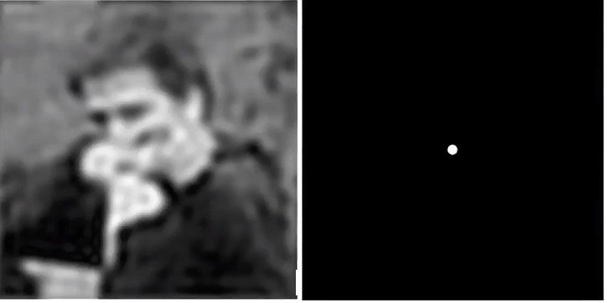

## 卷积

**一、信号与滤波器的卷积**

* 信号与滤波器进行卷积，实际上是平均，得到的结果为模糊的信号

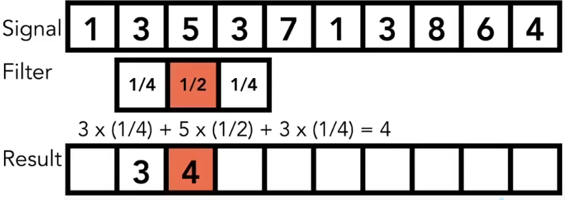

**二、卷积定理**

* <font color=red>时域（图像）上对两个信号进行卷积等于频域（频谱）上对信号的乘积</font>

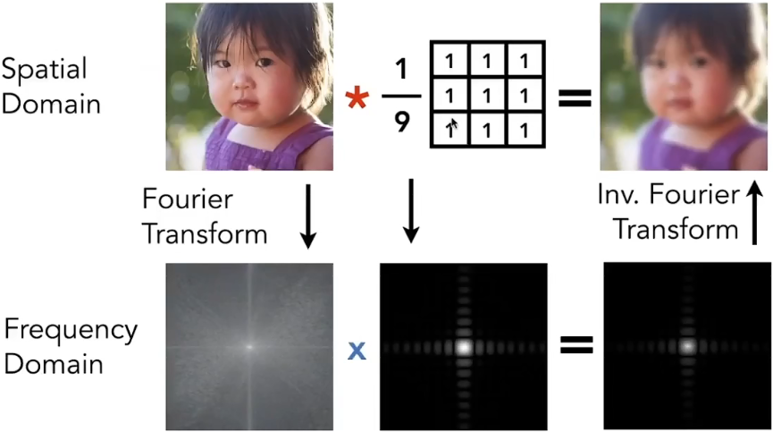

## 抗锯齿的方式

* 提高采样分辨率（提高屏幕的分辨率）
* 抗锯齿
  * 低通滤波抗锯齿
  * 求覆盖像素颜色的平均值

### 低通滤波抗锯齿

* 先对图形进行模糊，然后再进行光栅化处理
* 效果：能够实现抗锯齿但是图像会变得模糊
* 处理过程不能倒转

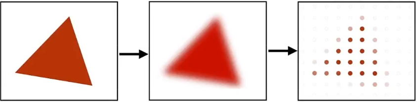

### 求覆盖区域像素平均值

* 提高求平均值实现去锯齿

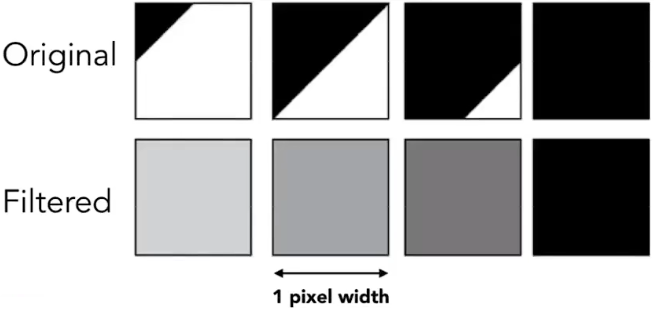

### MSAA

* 使用更多的采样点实现抗锯齿，采样点数量要求是4的倍数
* 以像素为单位，将像素分为4个区域，对这四个区域进行采样，以采样的平均值作为该像素的颜色

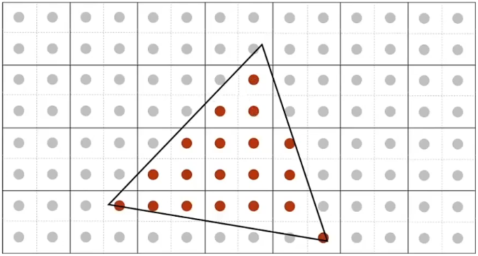

### FXAA

* 快速近似抗锯齿
* 先找到图像的边界，将有锯齿的边界换成五锯齿的边界

### TAA

* 时间性抗锯齿

* 复用上一帧的的像素，将采样点分布在当前帧与上一帧里

### 超分辨率采样

* DLSS通过深度学习获取超分辨率图像然后进行采样

# 可见性与深度算法

## 画家算法

**一、画家算法思路**

* 先画完远处的场景，在画近处的场景，近处的场景覆盖远处的场景
* 只能用于简单的场景，不能正确处理复杂交错的物体


## 深度缓存--Z-Buffer

**一、Z-Buffer**

* 生成一张图时，同步生成帧缓存和深度缓存，帧缓存存储颜色，深度缓存存储深度
* 深度为面到相机的距离，距离越近深度越小，该距离永远为正（越近越黑）
* 深度缓存的大小一般为屏幕像素的数量，如果有使用超采样则大小为采样总数

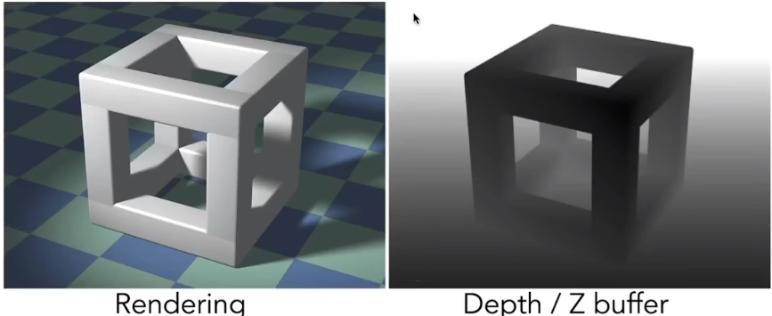

**二、Z-Buff算法**

* 遍历每一个面中覆盖的所有像素，选择深度最小的像素进行存储，并记录深度
* 初始化时，深度缓存的所有值为无限大
* 算法复杂度：对于n个三角形面的时间复杂度为`O(n)`

```go
for 遍历所有三角形{
    for 遍历三角形覆盖的所有像素{
        if 深度小于深度缓存对应位置的值{
            帧缓存存储颜色
            深度缓存存储深度
        }
    }
}
```

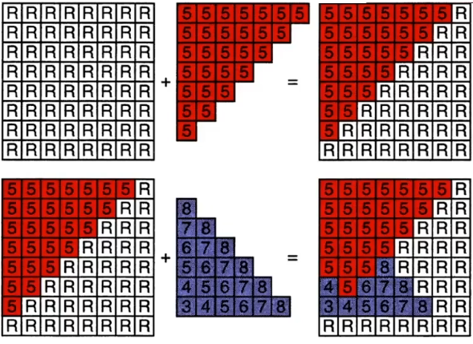

# 着色--Shading

## 着色与材质

**一、着色**

* 着色：用平行线或颜色区块使画面颜色变暗或着色

**二、材质**

* 用于着色的颜色区块被称为材质

**三、着色点的组成**

* `n`：着色点平面法线
* `l`：光源方向，光源来源方向
* `v`：观察方向，人眼获取光的方向

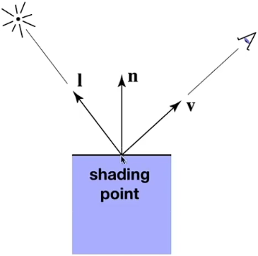

## Blinn-Phong反射模型

### 反射相关理论

**一、郎伯余弦定律**

* 光源方向与平面的法线夹角的余弦值为光源方向与平面法线的点乘值

$$
cos \theta=I \cdot n
$$

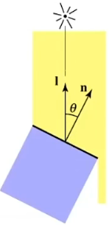

**二、光的辐射与衰减**

* 在不同时刻，光传播所在的球壳上总能量不变
* 随着半径的变大，球壳上点的能量在快速衰减

$$
e=\frac{I}{r^2}
$$

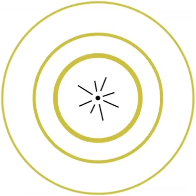

### 高光反射

**一、高光反射**

* 物体表面光滑，且反射非常接近镜面反射
* 半程向量($\vec{h}$)：在光源方向与出射方向夹角的角平分线方向上，为单位向量

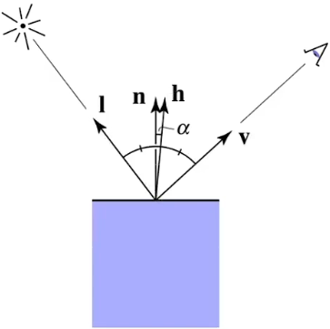

* 半程向量的计算

$$
\vec{h}=\frac{\vec{l}+\vec{v}}{
\begin{Vmatrix}\vec{l}+\vec{v}\end{Vmatrix}
}
$$

* 高光反射的计算

$$
L_s=k_s \cdot\frac{I}{r^2}\cdot max(0,cos\alpha)^p
=k_s \cdot \frac{I}{r^2} \cdot max(0,\vec{n} \cdot \vec{h})^p
$$

* 高光反射p的次方作用：用于控制高光的范围，夹角过大时能快速衰减高光，一般p为128次方

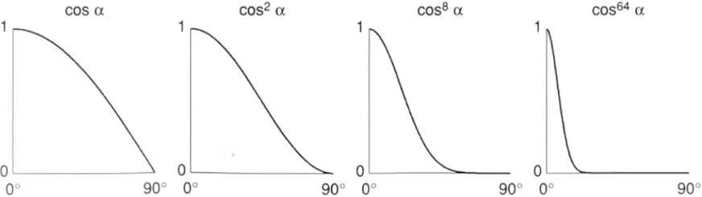

### 漫反射

**二、漫反射**

* 光线射向着色点，其反射光线会向四周发散且亮度一样
* 发散的亮度与光源方向和法线夹角的余弦值有关

$$
L_d=k_d \cdot\frac{I}{r^2}\cdot max(0,n \cdot l)
=k_d \cdot\frac{I}{r^2} \cdot max(0,cos \theta)
=k_d \cdot \frac{I}{r^2} \cdot max(0,\vec{n}\cdot \vec{l})
$$

* k~d~：表示着色点颜色，也称漫反射系数
* cosθ为光源方向与着色点法线的余弦，如果均为单位向量则直接点乘
* $\frac{I}{r^2}$：表示光源到达着色点光的强度

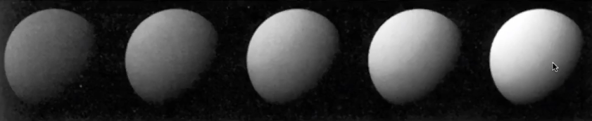

### 环境反射

**一、环境照明**

* 在非光源直接照射的地方会接收到来自环境的漫反射，保证没有没有地方是黑的
* k~a~为环境光系数，与光照和观察方向无关，一般为颜色
* I~a~为环境光强系数，可以根据具体情况定义

$$
L_a=k_aI_a
$$

### Blinn-Phong模型反射公式

* 将环境光、漫反射和高光都加起来得到一个着色的模型

$$
\begin{aligned}
L&=L_a+L_d+L_s\\
&= 
k_aI_a
+
k_d \cdot \frac{I}{r^2} \cdot max(0,\vec{n}\cdot \vec{l})
+
k_s \cdot \frac{I}{r^2} \cdot max(0,\vec{n} \cdot \vec{h})^p
\end{aligned}
$$

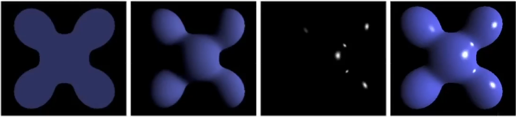

## 着色频率

* 着色应用在面、顶点和像素时产生的效果与消耗的算力会不同

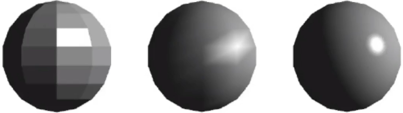

### 平面着色

* 以面为单位进行着色
* 通过叉积获取面的法向量，通过反射模型计算颜色
* 面数越低且距离越近时着色效果越差，相反则越消耗算力但效果越好

### 顶点着色

**一、顶点着色**

* 以顶点为单位进行着色
* 获取顶点的法线，通过反射模型计算顶点的颜色
* 一个面有3个顶点，对这个面的3个顶点颜色求平均得到面的颜色
* 计算量比平面着色大，效果比平面着色好

**二、顶点法线的计算**

* 顶点相邻的所有面的法线之和得到顶点法线，除去模得到单位向量
* 可以进行加权平均处理不同场景

$$
N_v=\frac{N_1+N_2+...}{
\begin{Vmatrix}N_1+N_2+...\end{Vmatrix}
}
$$

### 像素着色

**一、像素着色**

* 以像素为单位进行着色
* 给某个像素插入一个法向量，通过反射模型计算像素的颜色
* 计算量平均

**二、像素法向量的计算**

* 使用重心坐标求像素对应的法向量


## 渲染管线

**一、渲染管线**

* 输入一系列点
* 进行投影变换（可编程部分）
* 点形成三角形
* 光栅化与像素可见性判断
* 着色（可编程部分）
* 像素拼接

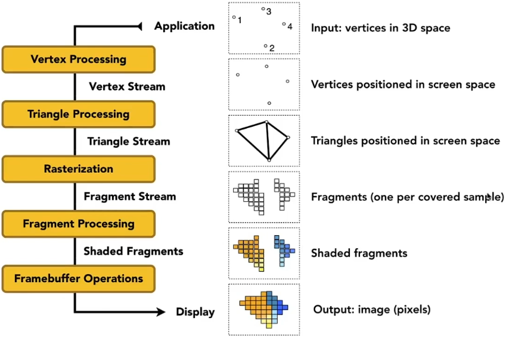

**二、可编程着色器**

* 只需要管一个顶点或一个像素怎么输出即可
  * Vertex Shader：顶点着色器
  * Fragment Shader\Pixel Shader：像素着色器，用于输出颜色

```c++
//纹理
uniform sampler2D myTexture;
//光照方向
uniform vec3 lightDir;
//纹理
varying vec2 uv;
//顶点法线
varying vec norm;
void diffuseShader(){
	vec3 kd;
    //获取漫反射系数
    kd texture2d(my Texture, uv);
    //漫反射公式求光照
    kd*= clamp(dot(-lightdir, norm), 0.0, 1.0);
    //返回像素颜色
    gl_FragColor=vec4(kd, 1.0);   
}
```

## GPU

**一、GPU作用**

* 用于执行图形渲染管线的专用处理器
* 高度并行处理器，与核心数有关（4090核心数16384，并行数极其高）

**二、Geometry Shader**

* 几何着色器
* 用于动态产生三角形

**三、Computer Shader**

* 通用GPU计算
* 可用于深度学习

## 重心坐标

**一、重心坐标**

* 每个平面都有自己独特的重心坐标
* 重心坐标在平面的内部

**二、重心坐标计算公式**

* $\alpha$,$\beta$,$\gamma$均大于0

$$
(x,y)=\alpha A+\beta B+ \gamma C
$$

* 限制重心坐标在三角形内

$$
\alpha+\beta + \gamma =1
$$

**三、三角形的重心坐标**

* 在三角形中，重心坐标有特殊的性质，能将三角形分为3个等面积的子三角形，且重心坐标唯一

$$
(\alpha+\beta+\gamma)=(\frac{1}{3},\frac{1}{3},\frac{1}{3})
$$

$$
(x,y)=\frac{1}{3} A+\frac{1}{3} B+ \frac{1}{3} C
$$

**四、重心坐标的作用以及使用的时机**

* 常用于插值
* <font color=red>由于投影的过程会导致重心坐标发生变化，所以应该在投影之前计算重心坐标，然后进行插值</font>

## 纹理映射

### 纹理

**一、纹理与3D模型**

* 纹理是3D模型的表面
* 任何3D模型的表面都可以映射为二维
* 纹理可以重复使用
* 纹理元素：由于纹理本质为图片，纹理上的像素则称为纹理元素

### 纹理的使用

* 遍历每个像素
* 通过像素中心坐标获取(u,v)纹理坐标
* 通过纹理坐标获取颜色
* 将采样点的颜色设为刚获得的颜色

```go
for 屏幕上每个像素(x,y){				//x，y为像素的中心
    (u,v)=计算纹理坐标(x,y)
    texcolor=texture.Sample(u,v)	//通过(u,v)获取纹理颜色
    将采样点的颜色设置为texcolor		//设置颜色
}
```

### 纹理插值问题（纹理分辨率过小）

#### 邻近插值

* 对于任何一个像素都能找到对应纹理上的位置，对于非整数(u,v)坐标进行四舍五入得到整数坐标
* 根据得到的整数坐标获取纹理

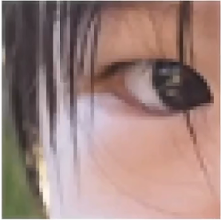

#### 三线性插值

**一、线性插值基本公式**

* 用于计算两点之间某处的坐标
* 知道$v_0$,$v_1$和$x$的值即可求出线内的某点

$$
(x,y)=v_0+x(v_1-v_0)
$$

**二、三线性插值在图形学的使用**

* 通过纹理映射得到得到对应的(u,v)坐标，用于纹理分辨率低，所以(u,v)坐标有小数
* 通过(u,v)坐标的小数得到$s$和$t$

* 计算目标纹理元素所在线段的两点的<font color=red>颜色</font>（对行进行线性插值的使用）

$$
c_0=c_{00}+s(c_{10}-c_{00})\\
c_1=c_{01}+s(c_{11}-c_{01})
$$

* 计算目标纹理元素的<font color=red>颜色</font>（对列进行线性插值的使用）

$$
c=c_{0}+t(c_{1}-c_{0})
$$

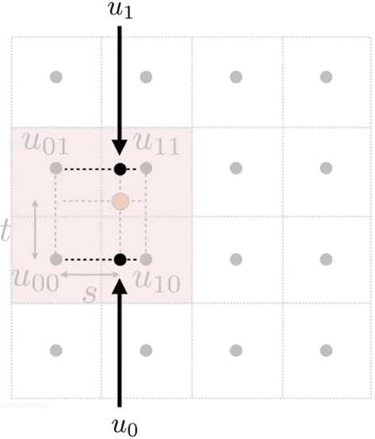

### 抗锯齿--纹理（纹理分辨率过大）

#### 超采样

* 通过纹理映射得到得到对应的(u,v)坐标
* 取多个周围的纹理元素然后进行平均，得到该像素映射的颜色

#### mipmap

* 为了避免大量的计算，可以对所有纹理预先使用超采样处理得到不同分辨率的纹理并存储
* 递归计算原图的分辨率减少一半后的图并存储，直到分辨率为1结束
* 多使用$\frac{1}{3}$的存储空间将算法复杂度降为O(1)


* 取4个像素，通过映射得到4个(u,v)坐标，通过一个(u,v)坐标运动到另一个(u,v)坐标的微分近似使用哪层纹理

$$
\begin{aligned}
&D=log_2L\\
&L = max(\sqrt{(\frac{du}{dx})^2+(\frac{dv}{dx})^2},\sqrt{(\frac{du}{dy})^2+(\frac{dv}{dy})^2})
\end{aligned}
$$

* 缺点：对远景会出现过模糊而丢失细节

#### 各向异性过滤

* 各项异性：在不同方向上表现各不相同
* 在mipmap的基础上增加横向和纵向采样，多耗费了两倍空间
* 能够处理被压缩成长条的远景
* 各向异性的`16X`：表示使用有16层的贴图（横向16张，纵向16张）
* 各向异性过滤需要消耗3倍的存储空间（显存），但计算量不大


## 凹凸贴图

* 在低面模型下产生凹凸感
* 使用复杂的纹理定义相对高度，从而改变法线
* 获取凹凸贴图的值获取相对高度($dp$)，然后改变法线
* 缺点：模型不会改变，边缘位置没有凹凸现象


## 位移贴图

* 在高面模型下产生高质量凹凸感
* 通过凹凸贴图改变坐标顶点位置
* 缺点：非常消耗算力


# 几何

## 隐式几何

**一、隐式几何**

* 使用函数表示一个几何图形
* 若点$(x,y,z)$满足$f(x,y,z)=0$，则点在该几何上
* 隐式几何的特点：能够判断点在不在平面上

**二、常见的隐式几何公式**

**一、球**
$$
x^2+y^2+z^2=1
$$


**二、圆环**
$$
(R-\sqrt{x^2+y^2})^2+z^2=r^2
$$


**三、心**
$$
(x^2+\frac{9y^2}{4}+z^2-1)^3=x^2z^3+\frac{9y^2z^3}{80}
$$


## 显式几何

**一、显示几何**

* 直接给出几何的所有坐标，或通过参数映射获取几何的所有坐标
* 参数映射的公式：$(u,v)=f(u,v)$（输入参数，输出坐标）
* 不能用于判断点是否在面上

## 构造立体几何法

* 通过一系列几何的基本运算得到多样化的几何

**一、几何并运算**


**二、几何交运算**


**三、几何差运算**


**四、复杂几何的运算过程**


## 距离函数

**一、距离函数**

* 在基础几何的基础上，描述几何点到基础几何表面的最近距离
* 输入表面上的点$(x,y)$，输出离一定距离之外的点$(u,v)$


