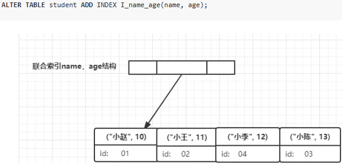

**一、为什么不推荐使用外键和级联**

* 性能问题：
  * 插入数据时mysql会检查外键对应的表是否有对应的数据，如果这一过程由程序控制可以省略很多不必要的查询过程，而mysql必须去这两张表里判断（笛卡尔积）
* 并发问题：
  * 使用外键的情况下每次修改数据都要去另一个表检查数据，此时需要加上额外的锁，在高并发情况下使用外键容易死锁
* 扩展性问题
  * 平台迁移方便，在不设置外键的情况下，从MySQL迁移到Oracle更方便，触发器和外键可以由程序控制而不需要数据库实现
* 分库分表
  * 水平拆分和分库的情况下，外键是无法生效的。通过程序实现数据间关系的维护，为将来分库分表省去很多麻烦

**二、不适合使用索引的场景**

* 频繁更新的字段不适合创建索引，每次更新不只更新记录还要更新索引
* where条件用不到的字段不要创建索引
* 经常增删改的表
* 数据重复切分布平均的字段（比如只有男女）

**三、索引的优点**

* 加快数据的检索速度
* 加快表与表之间的连接
* 在使用分组和排序进行检索时减少查询中分组和排序的时间

**四、索引的缺点**

* 创建索引和维护索引需要时间，时间随着数据量的增加而增加
* 索引需要占用物理空间，数据量越大占用空间越大
* 会降低表的增删改的效率，每次增删改索引都需要动态维护索引

**五、什么是覆盖索引**

* 覆盖索引即为从非主键索引中就能查到的记录，而不需要查询主键索引中的记录，避免了回表的产生减少回表查询的次数，显著提升性能。

**六、如何使用覆盖索引**

* 建立一个联合索引，以查询条件在前，查询结果在后建立索引（索引内包含查询结果）
* 查询流程为：
  1. 在name,age联合索引树上找到名称为小李的节点
  2. 此时节点索引里包含信息age 直接返回 12

**七、如何确定数据库使用了覆盖索引**

* 当发起一个索引覆盖查询时，在explain的extra列可以看到using index的信息

**八、ACID特性**

* 原子性：所有操作要么全部成功，要么全部失败回滚
* 一致性：数据库从一个一致性状态变换到另一个一致性状态（一致性状态要求与现实保持一致）
* 隔离性：并发访问数据库时，某个事务不能被其他事务的操作所干扰，多个并发事务之间要相互隔离。
* 持久性：一个事务一旦被提交了，那么对数据库中的数据的改变就是永久性的

**九、如何优化千万量级的数据查询**

* 按需查询字段，减少网络IO的消耗
* 避免使用`select *`，减少MySQL优化器的负担（舍去*转为字段的优化过程）
* 查询字段尽量保证索引的覆盖
* 使用Redis缓存数据，减少MySQL的负担

**十、分页查询过程中如何优化偏移量提升查询效率**

* 使用`where`条件缩减扫描条数，然后使用Limit进行筛选
* 使用id索引或覆盖索引，保证筛选条件的内容在索引内，减少`where`花费的时间
* 例子：`SELECT * FROM goods WHERE id>100000 LIMIT 100;`

