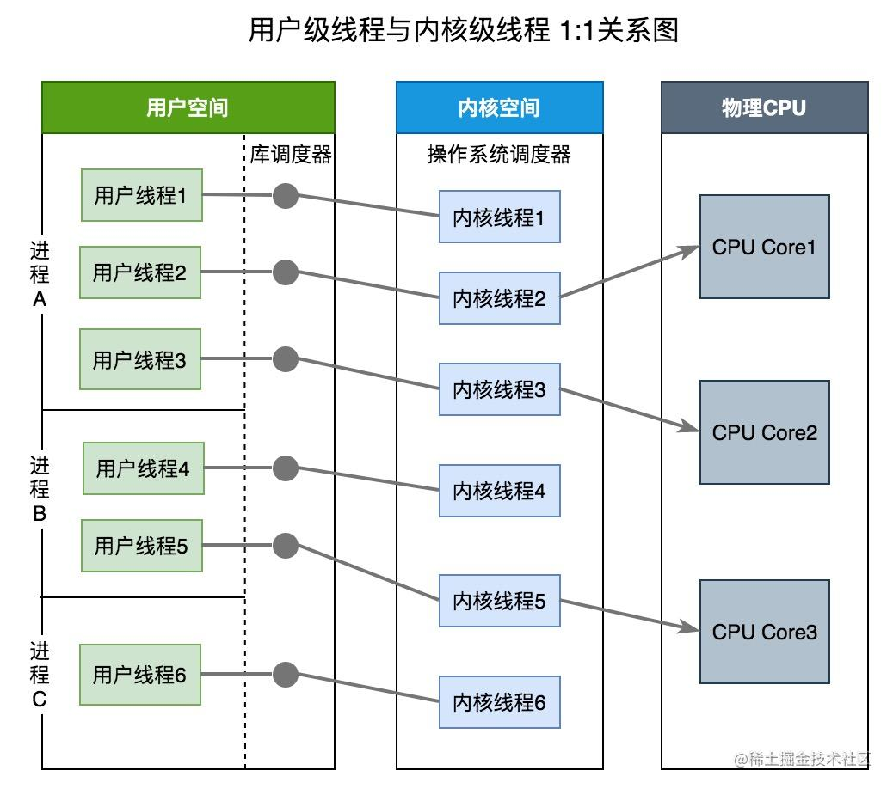
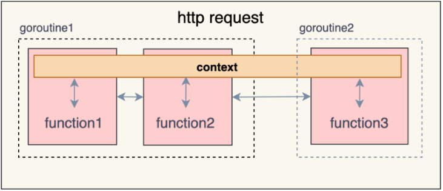

### 协程，线程，进程的区别

- 进程

进程是具有一定独立功能的程序关于某个数据集合上的一次运行活动,进程是系统进行资源分配和调度的一个独立单位。每个进程都有自己的独立内存空间，不同进程通过进程间通信来通信。由于进程比较重量，占据独立的内存，所以上下文进程间的切换开销（栈、寄存器、虚拟内存、文件句柄等）比较大，但相对比较稳定安全。

- 线程

线程是进程的一个实体,是CPU调度和分派的基本单位,它是比进程更小的能独立运行的基本单位.线程自己基本上不拥有系统资源,只拥有一点在运行中必不可少的资源(如程序计数器,一组寄存器和栈),但是它可与同属一个进程的其他的线程共享进程所拥有的全部资源。线程间通信主要通过共享内存，上下文切换很快，资源开销较少，但相比进程不够稳定容易丢失数据。

- 协程

协程是一种用户态的轻量级线程，协程的调度完全由用户控制。协程拥有自己的寄存器上下文和栈。协程调度切换时，将寄存器上下文和栈保存到其他地方，在切回来的时候，恢复先前保存的寄存器上下文和栈，直接操作栈则基本没有内核切换的开销，可以不加锁的访问全局变量，所以上下文的切换非常快。

### 互斥锁，读写锁，死锁问题是怎么解决。

- 互斥锁

互斥锁就是互斥变量mutex，用来锁住临界区的.

条件锁就是条件变量，当进程的某些资源要求不满足时就进入休眠，也就是锁住了。当资源被分配到了，条件锁打开，进程继续运行；读写锁，也类似，用于缓冲区等临界资源能互斥访问的。

- 读写锁

通常有些公共数据修改的机会很少，但其读的机会很多。并且在读的过程中会伴随着查找，给这种代码加锁会降低我们的程序效率。读写锁可以解决这个问题。

注意：写独占，读共享，写锁优先级高

- 死锁

一般情况下，如果同一个线程先后两次调用lock，在第二次调用时，由于锁已经被占用，该线程会挂起等待别的线程释放锁，然而锁正是被自己占用着的，该线程又被挂起而没有机会释放锁，因此就永远处于挂起等待状态了，这叫做死锁（Deadlock）。 另外一种情况是：若线程A获得了锁1，线程B获得了锁2，这时线程A调用lock试图获得锁2，结果是需要挂起等待线程B释放锁2，而这时线程B也调用lock试图获得锁1，结果是需要挂起等待线程A释放锁1，于是线程A和B都永远处于挂起状态了。

死锁产生的四个必要条件:

1. 互斥条件：一个资源每次只能被一个进程使用
2. 请求与保持条件：一个进程因请求资源而阻塞时，对已获得的资源保持不放。
3. 不剥夺条件:进程已获得的资源，在末使用完之前，不能强行剥夺。
4. 循环等待条件:若干进程之间形成一种头尾相接的循环等待资源关系。 这四个条件是死锁的必要条件，只要系统发生死锁，这些条件必然成立，而只要上述条件之一不满足，就不会发生死锁。

a. 预防死锁

可以把资源一次性分配：（破坏请求和保持条件）

然后剥夺资源：即当某进程新的资源未满足时，释放已占有的资源（破坏不可剥夺条件）

资源有序分配法：系统给每类资源赋予一个编号，每一个进程按编号递增的顺序请求资源，释放则相反（破坏环路等待条件）

b. 避免死锁

预防死锁的几种策略，会严重地损害系统性能。因此在避免死锁时，要施加较弱的限制，从而获得 较满意的系统性能。由于在避免死锁的策略中，允许进程动态地申请资源。因而，系统在进行资源分配之前预先计算资源分配的安全性。若此次分配不会导致系统进入不安全状态，则将资源分配给进程；否则，进程等待。其中最具有代表性的避免死锁算法是银行家算法。

c. 检测死锁

首先为每个进程和每个资源指定一个唯一的号码,然后建立资源分配表和进程等待表.

d. 解除死锁

当发现有进程死锁后，便应立即把它从死锁状态中解脱出来，常采用的方法有.

e. 剥夺资源

从其它进程剥夺足够数量的资源给死锁进程，以解除死锁状态.

f. 撤消进程

可以直接撤消死锁进程或撤消代价最小的进程，直至有足够的资源可用，死锁状态.消除为止.所谓代价是指优先级、运行代价、进程的重要性和价值等。

### 什么是channel，为什么它可以做到线程安全？

Channel是Go中的一个核心类型，可以把它看成一个管道，通过它并发核心单元就可以发送或者接收数据进行通讯(communication),Channel也可以理解是一个先进先出的队列，通过管道进行通信。

Golang的Channel,发送一个数据到Channel 和 从Channel接收一个数据 都是 原子性的。而且Go的设计思想就是:不要通过共享内存来通信，而是通过通信来共享内存，前者就是传统的加锁，后者就是Channel。也就是说，设计Channel的主要目的就是在多任务间传递数据的，这当然是安全的。

### 并发编程概念是什么？

并行是指两个或者多个事件在同一时刻发生；并发是指两个或多个事件在同一时间间隔发生。

并行是在不同实体上的多个事件，并发是在同一实体上的多个事件。在一台处理器上“同时”处理多个任务，在多台处理器上同时处理多个任务。如hadoop分布式集群

并发偏重于多个任务交替执行，而多个任务之间有可能还是串行的。而并行是真正意义上的“同时执行”。

并发编程是指在一台处理器上“同时”处理多个任务。并发是在同一实体上的多个事件。多个事件在同一时间间隔发生。并发编程的目标是充分的利用处理器的每一个核，以达到最高的处理性能。

### 什么是 Goroutine，它如何调度

**一、**

* `goroutine`是用户态线程

* 协程拥有自己的寄存器上下文和栈。协程调度切换时，将寄存器上下文和栈保存到其他地方，在切回来的时候，恢复先前保存的寄存器上下文和栈。

**二、**

* Goroutine的调度通过GPM调度模型实现.

Go的调度器内部有四个重要的结构：

- M：内核级线程，goroutine就是跑在M之上的
- G：goroutine，它有自己的栈，instruction pointer和其他信息（正在等待的channel等等），用于调度。
- P:Processor，处理器，它的主要用途就是用来执行goroutine的，所以它也维护了一个goroutine队列，里面存储了所有需要它来执行的goroutine
- Sched：代表调度器，它维护有存储M和G的队列以及调度器的一些状态信息等。

### 协程的优势

* 节省 CPU：避免系统内核级的线程频繁切换，造成的 CPU 资源浪费。而协程是用户态的线程，用户可以自行控制协程的创建于销毁，极大程度避免了系统级线程上下文切换造成的资源浪费。

* 节约内存：在 64 位的Linux中，一个线程需要分配 8MB 栈内存和 64MB 堆内存，系统内存的制约导致我们无法开启更多线程实现高并发。而在协程编程模式下，可以轻松有十几万协程，这是线程无法比拟的。

* 稳定性：前面提到线程之间通过内存来共享数据，这也导致了一个问题，任何一个线程出错时，进程中的所有线程都会跟着一起崩溃。

* 开发效率：使用协程在开发程序之中，可以很方便的将一些耗时的IO操作异步化，例如写文件、耗时 IO 请求等。

### golang中常用的并发模型

* 通过channel通知实现并发控制
  * 在无缓冲通道里消息的发送和接收是必须同步的，如果一方没有准备好发送或接收，另一方会阻塞等待直到对方准备好为止，有缓冲通道可以发送多个消息到通道里，当通道空了或满了的时会触发阻塞
* 通过sync包的WaitGroup实现并发控制
  * Gorountine是异步执行的，为了防止main函数结束的同时杀死协程，需要使用WaitGroup等待所有协程处理完，WaitGroup使用后不能被拷贝
* Context上下文实现并发控制
  * Context包主要用于处理多个goroutine之间共享数据及多个goroutine的管理
  * https://cloud.tencent.com/developer/article/2211978

