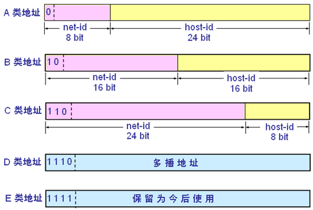

# 计算机操作系统

**1、计算集中型**

* 计算密集型：项目上线后CPU高负荷运作，而硬盘和内存空闲
* 计算密集型程序中所需要的计算量非常大，I/O占用的时间短
* 需要对算法进行优化，以空间复杂度换取时间复杂度，充分利用CPU的多核资源进行并发并行运算

**2、I/O密集型**

* I/O密集型：项目上线后，大部分时间耗费在高频的I/O读写操作
* 常见的I/O读写：读写内存和硬盘的数据、通过网络交互数据
* 需要开启多个异步线程获取数据，然后同步处理数据，解决I/O时间不一致的问题

**3、缓存的作用**

* redis缓存：减少客户端与服务器端的数据交互次数，提高系统的性能（性能的提高与缓存数据命中率有关）
* cookie：保存在浏览器的一组数据，常用于保存用户的配置信息（不能保存敏感信息，调用时可能会被攻击）

* session：存储在服务端的一组数据，常用redis存储，经常用于实现自动登陆等功能

# 计算机网络

**1、TCP三次握手**

* 第一次握手：客户端向服务器发送请求，请求是否能连接
* 第二次握手：服务端同意进行连接并返回确认报文
* 第三次握手：接收服务端的同意连接报文后，客户端向服务器发送确认报文完成建立连接

**2、TCP不采用二次握手的原因**

* 网络传输过程中存在数据丢失的可能，第二次握手时如果确认报文丢失会建立无效的连接
* 第三次握手能够发送客户端的网络状态，预防过期的失效的连接信息，保证连接的稳定可靠

**3、四次挥手**

* 原因：TCP的半关闭状态使得一端连接关闭后还能接收另一端发来的数据

* 第一次挥手：客户端发送释放报文，主动关闭TCP连接，连接进入`FIN_WAIT1`状态
  * 客户端到服务端方向的连接关闭
* 第二次挥手：服务端接收连接关闭请求进入`CLOSE_WAIT`状态，然后返回应答报文
* 第三次挥手：服务端发送完数据后，向客户端发送连接关闭报文，服务端处于`LAST_ACK`状态
  * 服务端到客户端方向的连接关闭
* 第四次握手：客户端收到连接释放报文后，客户端进入`TIME_WAIT`状态，向服务端返回确认报文，过了2MSL（最长报文段寿命）后客户端进入`CLOSED`状态

**4、地址的划分**

