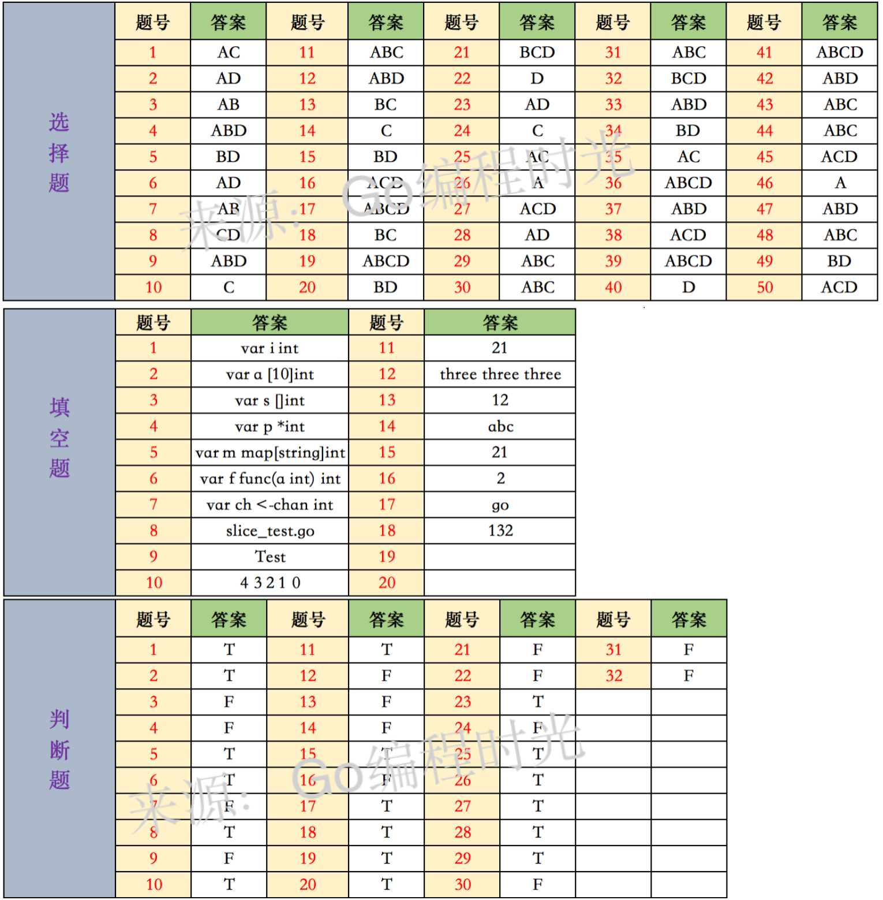

# 选择题

**一、下面属于关键字的是（AC）**
A. func
B. def		Python的关键字
C. struct
D. class	Java的关键字

**二、定义一个包内全局字符串变量，下面语法正确的是 （AD）**
A. var str string
B. str := ""
C. str = ""
D. var str = ""

**三、通过指针变量 p 访问其成员变量 name，下面语法正确的是（AB）**
A. p.name					可以通过指针直接取结构体的变量
B. (*p).name				先取结构体再取值
C. (&p).name
D. p->name

**四、关于接口和类的说法，下面说法正确的是（ABD）**
A. 一个类只需要实现了接口要求的所有函数，我们就说这个类实现了该接口
B. 实现类的时候，只需要关心自己应该提供哪些方法，不用再纠结接口需要拆得多细才合理
C. 类实现接口时，需要导入接口所在的包	实现可以不用
D. 接口由使用方按自身需求来定义，使用方无需关心是否有其他模块定义过类似的接口

**五、关于字符串连接，下面语法正确的是（BD）**
A. str := ‘abc’ + ‘123’			`''`只能用于字符不能用于字符串
B. str := "abc" + "123"
C. str ：= '123' + "abc"
D. fmt.Sprintf("abc%d", 123)

**六、关于协程，下面说法正确是（AD）**
A. 协程和线程都可以实现程序的并发执行
B. 线程比协程更轻量级
C. 协程不存在死锁问题
D. 通过channel来进行协程间的通信

**七、关于init函数，下面说法正确的是（AB）**
A. 一个包中，可以包含多个init函数		确实可以有多个重名的init函数，但是只有傻逼想恶心人才能写出这种代码
B. 程序编译时，先执行导入包的init函数，再执行本包内的init函数
C. main包中，不能有init函数
D. init函数可以被其他函数调用				不能

**八、关于循环语句，下面说法正确的有（CD）**
A. 循环语句既支持for关键字，也支持while和do-while
B. 关键字for的基本使用方法与C/C++中没有任何差异
C. for循环支持continue和break来控制循环，但是它提供了一个更高级的break，可以选择中断哪一个循环
D. for循环不支持以逗号为间隔的多个赋值语句，必须使用平行赋值的方式来初始化多个变量

# 填空题

https://zhuanlan.zhihu.com/p/357193989?utm_id=0

# 参考答案

